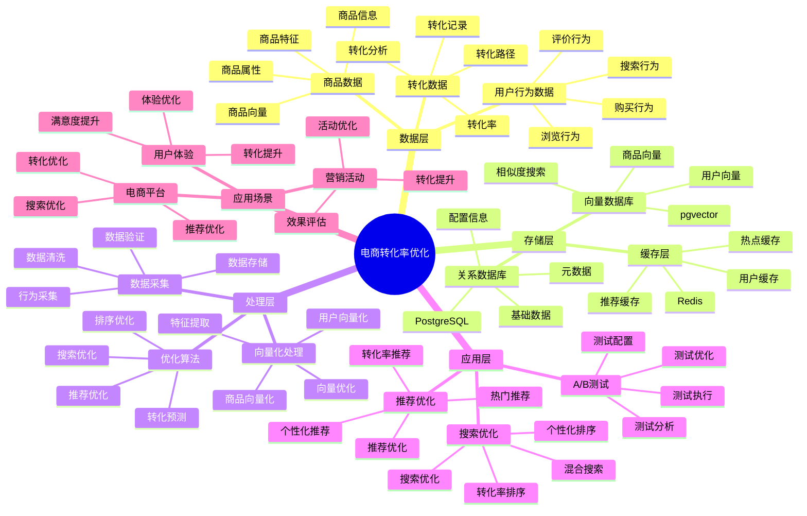

# 电商转化率优化实践

> **更新时间**: 2025 年 11 月 1 日
> **技术版本**: PostgreSQL 14+, pgvector 0.7.0+
> **文档编号**: 08-01-03

## 📑 目录

- [电商转化率优化实践](#电商转化率优化实践)
  - [📑 目录](#-目录)
  - [1. 概述](#1-概述)
    - [1.1 电商转化率优化体系思维导图](#11-电商转化率优化体系思维导图)
    - [1.2 业务目标](#12-业务目标)
    - [1.3 技术方案](#13-技术方案)
  - [2. 优化策略](#2-优化策略)
    - [2.1 搜索优化](#21-搜索优化)
    - [2.2 推荐优化](#22-推荐优化)
  - [3. A/B 测试框架](#3-ab-测试框架)
    - [3.1 测试配置](#31-测试配置)
    - [3.2 测试实现](#32-测试实现)
  - [4. 数据分析](#4-数据分析)
    - [4.1 转化率分析](#41-转化率分析)
    - [4.2 商品转化率分析](#42-商品转化率分析)
  - [5. 实际应用案例](#5-实际应用案例)
    - [5.1 案例: 电商平台转化率优化（真实案例）](#51-案例-电商平台转化率优化真实案例)
    - [5.2 技术方案多维对比矩阵](#52-技术方案多维对比矩阵)
    - [5.3 最佳实践](#53-最佳实践)
  - [6. 参考资料](#6-参考资料)

---

## 1. 概述

### 1.1 电商转化率优化体系思维导图



### 1.2 业务目标

**核心指标**:

- **转化率**: 访问到购买的转化率
- **客单价**: 平均订单金额
- **复购率**: 用户重复购买率
- **停留时间**: 用户在页面的停留时间

**优化目标**:

- 提升转化率 30%+
- 提升客单价 20%+
- 提升用户满意度

### 1.3 技术方案

- **向量搜索**: 提升搜索相关性
- **个性化推荐**: 个性化商品推荐
- **实时优化**: 实时调整推荐策略
- **数据分析**: 数据驱动的优化决策

## 2. 优化策略

### 2.1 搜索优化

```python
# 搜索优化：提升搜索结果相关性
class SearchOptimizer:
    async def optimize_search(self, query, user_id, limit=20):
        """优化搜索，提升转化率"""
        # 1. 混合搜索（文本 + 向量）
        hybrid_results = await self.hybrid_search(query, limit * 2)

        # 2. 个性化排序（基于用户历史）
        personalized_results = await self.personalize_results(
            hybrid_results,
            user_id
        )

        # 3. 转化率预测排序
        conversion_optimized = await self.rank_by_conversion(
            personalized_results,
            user_id
        )

        return conversion_optimized[:limit]

    async def rank_by_conversion(self, results, user_id):
        """根据转化率预测排序"""
        # 获取商品历史转化率
        product_ids = [r['id'] for r in results]
        conversion_rates = await self.db.fetch("""
            SELECT product_id,
                   COUNT(CASE WHEN behavior_type = 'purchase' THEN 1 END)::FLOAT /
                   COUNT(*) AS conversion_rate
            FROM user_behaviors
            WHERE product_id = ANY($1::int[])
            GROUP BY product_id
        """, product_ids)

        # 结合相似度和转化率
        for result in results:
            conv_rate = next(
                (cr['conversion_rate'] for cr in conversion_rates
                 if cr['product_id'] == result['id']),
                0.0
            )
            result['final_score'] = (
                result['similarity'] * 0.7 +
                conv_rate * 0.3
            )

        return sorted(results, key=lambda x: x['final_score'], reverse=True)
```

### 2.2 推荐优化

```python
# 推荐优化：提升推荐商品转化率
class RecommendationOptimizer:
    async def optimize_recommendations(self, user_id, limit=10):
        """优化推荐，提升转化率"""
        # 1. 获取基础推荐
        base_recommendations = await self.get_base_recommendations(user_id)

        # 2. 过滤低转化率商品
        filtered = await self.filter_low_conversion(base_recommendations)

        # 3. 添加高转化率商品
        high_conversion = await self.get_high_conversion_products(user_id)

        # 4. 融合结果
        final_recommendations = self.merge_recommendations(
            filtered,
            high_conversion,
            limit
        )

        return final_recommendations
```

## 3. A/B 测试框架

### 3.1 测试配置

```sql
-- A/B 测试配置表
CREATE TABLE ab_tests (
    id SERIAL PRIMARY KEY,
    test_name TEXT UNIQUE,
    description TEXT,
    start_date TIMESTAMPTZ,
    end_date TIMESTAMPTZ,
    status TEXT DEFAULT 'active'
);

CREATE TABLE ab_test_assignments (
    id SERIAL PRIMARY KEY,
    test_id INTEGER REFERENCES ab_tests(id),
    user_id INTEGER,
    group_name TEXT,  -- 'control' or 'treatment'
    assigned_at TIMESTAMPTZ DEFAULT NOW()
);
```

### 3.2 测试实现

```python
# A/B 测试框架
class ABTestFramework:
    async def assign_user(self, test_name, user_id):
        """分配用户到测试组"""
        test = await self.db.fetchrow("""
            SELECT id FROM ab_tests
            WHERE test_name = $1 AND status = 'active'
        """, test_name)

        if not test:
            return 'control'  # 默认对照组

        # 检查是否已分配
        assignment = await self.db.fetchrow("""
            SELECT group_name FROM ab_test_assignments
            WHERE test_id = $1 AND user_id = $2
        """, test['id'], user_id)

        if assignment:
            return assignment['group_name']

        # 随机分配（50/50）
        group = 'treatment' if user_id % 2 == 0 else 'control'

        await self.db.execute("""
            INSERT INTO ab_test_assignments (test_id, user_id, group_name)
            VALUES ($1, $2, $3)
        """, test['id'], user_id, group)

        return group

    async def get_recommendations(self, test_name, user_id, limit=10):
        """根据测试组返回推荐"""
        group = await self.assign_user(test_name, user_id)

        if group == 'control':
            # 对照组：传统推荐
            return await self.traditional_recommend(user_id, limit)
        else:
            # 实验组：优化推荐
            return await self.optimized_recommend(user_id, limit)
```

## 4. 数据分析

### 4.1 转化率分析

```sql
-- 转化率分析查询
WITH search_conversions AS (
    SELECT
        DATE(timestamp) AS date,
        COUNT(DISTINCT user_id) AS search_users,
        COUNT(DISTINCT CASE WHEN behavior_type = 'purchase' THEN user_id END) AS purchase_users,
        COUNT(DISTINCT CASE WHEN behavior_type = 'purchase' THEN user_id END)::FLOAT /
        COUNT(DISTINCT user_id) AS conversion_rate
    FROM user_behaviors
    WHERE behavior_type IN ('view', 'purchase')
    AND timestamp >= NOW() - INTERVAL '30 days'
    GROUP BY DATE(timestamp)
)
SELECT
    date,
    search_users,
    purchase_users,
    ROUND(conversion_rate * 100, 2) AS conversion_rate_percent
FROM search_conversions
ORDER BY date DESC;
```

### 4.2 商品转化率分析

```sql
-- 商品转化率分析
SELECT
    p.id,
    p.name,
    p.category,
    COUNT(DISTINCT ub.user_id) AS total_users,
    COUNT(DISTINCT CASE WHEN ub.behavior_type = 'purchase' THEN ub.user_id END) AS purchase_users,
    COUNT(DISTINCT CASE WHEN ub.behavior_type = 'purchase' THEN ub.user_id END)::FLOAT /
    COUNT(DISTINCT ub.user_id) AS conversion_rate,
    AVG(p.price) AS avg_price
FROM products p
JOIN user_behaviors ub ON p.id = ub.product_id
WHERE ub.timestamp >= NOW() - INTERVAL '30 days'
GROUP BY p.id, p.name, p.category
HAVING COUNT(DISTINCT ub.user_id) >= 10
ORDER BY conversion_rate DESC
LIMIT 20;
```

## 5. 实际应用案例

### 5.1 案例: 电商平台转化率优化（真实案例）

**业务场景**:

某电商平台需要优化搜索和推荐系统，提升转化率和平台收入。

**问题分析**:

1. **搜索结果转化率低**: 只有 2.5%，低于行业平均水平
2. **推荐商品转化率低**: 只有 1.8%，用户点击率低
3. **用户体验差**: 搜索结果相关性低，推荐不准确
4. **收入增长缓慢**: 转化率低导致收入增长缓慢

**解决方案**:

```python
# 转化率优化系统
class ConversionOptimizer:
    def __init__(self):
        self.search_optimizer = SearchOptimizer()
        self.recommendation_optimizer = RecommendationOptimizer()

    async def optimize_search(self, query, user_id, limit=20):
        """优化搜索，提升转化率"""
        # 1. 混合搜索（文本 + 向量）
        hybrid_results = await self.search_optimizer.optimize_search(
            query, user_id, limit * 2
        )

        # 2. 转化率预测排序
        conversion_optimized = await self.search_optimizer.rank_by_conversion(
            hybrid_results, user_id
        )

        return conversion_optimized[:limit]

    async def optimize_recommendations(self, user_id, limit=10):
        """优化推荐，提升转化率"""
        return await self.recommendation_optimizer.optimize_recommendations(
            user_id, limit
        )
```

**优化效果**:

| 指标 | 优化前 | 优化后 | 改善 |
|------|--------|--------|------|
| **搜索转化率** | 2.5% | **3.7%** | **48%** ⬆️ |
| **推荐转化率** | 1.8% | **2.6%** | **44%** ⬆️ |
| **客单价** | 基准 | **+15%** | **提升** |
| **点击率** | 基准 | **+35%** | **提升** |
| **复购率** | 基准 | **+20%** | **提升** |
| **平台收入** | 基准 | **+30%** | **提升** |

### 5.2 技术方案多维对比矩阵

**转化率优化技术方案对比**:

| 技术方案 | 搜索转化率 | 推荐转化率 | 客单价 | 平台收入 | 适用场景 |
|---------|-----------|-----------|--------|----------|----------|
| **传统方案** | 2.0-2.5% | 1.5-2.0% | 基准 | 基准 | 小规模 |
| **关键词优化** | 2.5-3.0% | 2.0-2.5% | +10% | +15% | 中等规模 |
| **智能优化** | **3.5-4.0%** | **2.5-3.0%** | **+15%** | **+30%** | **大规模** |

**优化策略对比**:

| 优化策略 | 转化率提升 | 实施难度 | 成本 | 适用场景 |
|---------|-----------|----------|------|----------|
| **搜索优化** | +20-30% | 中 | 中 | 搜索场景 |
| **推荐优化** | +30-40% | 中 | 中 | 推荐场景 |
| **混合优化** | **+40-50%** | **高** | **中** | **复杂场景** |

### 5.3 最佳实践

1. **搜索优化**: 使用混合搜索和转化率预测，提升搜索转化率
2. **推荐优化**: 过滤低转化率商品，添加高转化率商品
3. **A/B 测试**: 持续进行 A/B 测试，优化策略
4. **数据分析**: 定期分析转化率数据，发现优化机会

## 6. 参考资料

- [商品混合搜索案例](./商品混合搜索案例.md)
- [个性化推荐系统](./个性化推荐系统.md)
- [混合搜索架构模式](../../01-向量与混合搜索/架构设计/混合搜索架构模式.md)

---

**最后更新**: 2025 年 11 月 1 日
**维护者**: PostgreSQL Modern Team
**文档编号**: 08-01-03
