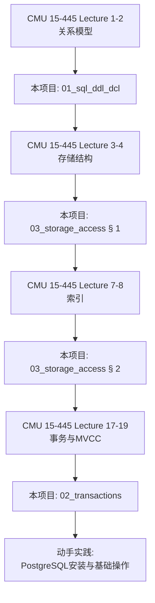
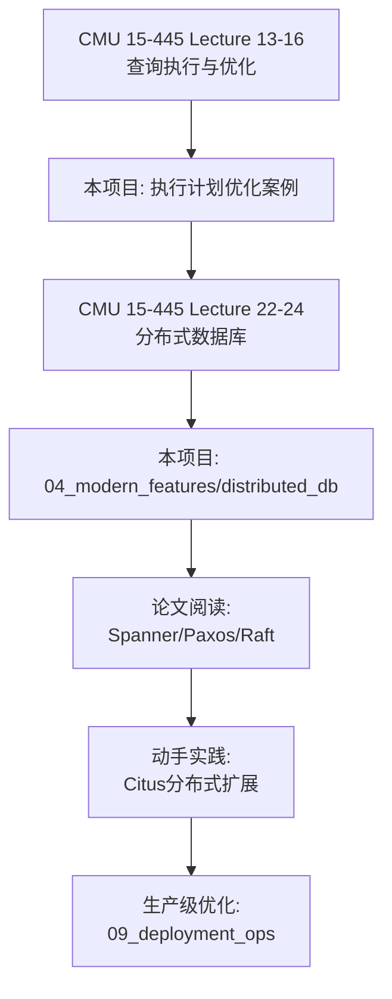

# 11_courses_papers — 课程与论文对照

> **版本对标**：PostgreSQL 17（更新于 2025-10）  
> **模块完整度**：⭐⭐⭐⭐ 80%（已建立完整对照，持续补充）  
> **目标**：将权威课程、教材、论文与本项目内容建立映射，支撑学习路径规划

---

## 📋 目录

- [模块定位](#模块定位)
- [1. CMU 15-445/645 完整对照](#1-cmu-15-445645-完整对照)
- [2. 其他权威课程](#2-其他权威课程)
- [3. 必读论文索引](#3-必读论文索引)
- [4. 经典教材](#4-经典教材)
- [5. 学习路径图](#5-学习路径图)

---

## 模块定位

### 目标

- **建立对照**：将本项目内容与权威课程、论文建立映射关系
- **学习导航**：从本项目到学术资源的双向导航
- **知识验证**：通过学术资源验证本项目内容的准确性

### 对标框架

```text
本项目模块 ←→ 大学课程Lecture ←→ 经典论文 ←→ PostgreSQL实现
```

---

## 1. CMU 15-445/645 完整对照

**课程信息**：

- **课程名称**：Database Systems（本科） / Advanced Database Systems（研究生）
- **官方网站**：<https://15445.courses.cs.cmu.edu/>
- **讲师**：Andy Pavlo 教授
- **特点**：业界公认的数据库系统最佳课程，紧跟前沿技术

### Lecture 1-2: Course Introduction & Relational Model

| CMU 15-445 主题      | 本项目对应章节                                                      | 关键知识点                  |
| -------------------- | ------------------------------------------------------------------- | --------------------------- |
| **Relational Model** | [01_sql_ddl_dcl](../01_sql_ddl_dcl/README.md)                       | 关系模型、SQL 基础、DDL/DML |
| **SQL Basics**       | [01_sql_ddl_dcl § 3.1](../01_sql_ddl_dcl/README.md#31-查询基础)     | SELECT、JOIN、聚合函数      |
| **Database Design**  | [01_sql_ddl_dcl § 2.2](../01_sql_ddl_dcl/README.md#22-表设计与约束) | 约束、外键、范式            |

**延伸阅读**：

- 📄 Edgar F. Codd (1970). "A Relational Model of Data for Large Shared Data Banks"
- 📚 Database System Concepts (Silberschatz) - Chapter 2: Relational Model

---

### Lecture 3: Database Storage I

| CMU 15-445 主题                | 本项目对应章节                                                              | 关键知识点                 |
| ------------------------------ | --------------------------------------------------------------------------- | -------------------------- |
| **Disk-Oriented Architecture** | [03_storage_access § 1.1](../03_storage_access/README.md#11-堆表heap-table) | 堆表、页结构、缓冲池       |
| **DBMS vs OS File System**     | [03_storage_access § 1.1](../03_storage_access/README.md#11-堆表heap-table) | 为什么 DBMS 自管理存储     |
| **File Organization**          | [03_storage_access § 1](../03_storage_access/README.md#1-存储结构)          | 堆文件、顺序文件、哈希文件 |

**PostgreSQL 特有**：

- TOAST 机制（超大字段）：[03_storage_access § 1.2](../03_storage_access/README.md#12-toast超大字段)
- FILLFACTOR 与 HOT 更新
  ：[03_storage_access § 1.3](../03_storage_access/README.md#13-fillfactor与页填充)

---

### Lecture 4: Database Storage II

| CMU 15-445 主题         | 本项目对应章节                                                              | 关键知识点             |
| ----------------------- | --------------------------------------------------------------------------- | ---------------------- |
| **Data Representation** | [01_sql_ddl_dcl § 1.1](../01_sql_ddl_dcl/README.md#11-数据类型全览)         | 数据类型、编码、压缩   |
| **System Catalogs**     | [03_storage_access § 1.1](../03_storage_access/README.md#11-堆表heap-table) | pg_class、pg_attribute |
| **Database Workloads**  | [03_storage_access § 7](../03_storage_access/README.md#7-性能调优实践)      | OLTP vs OLAP           |

---

### Lecture 5-6: Buffer Pools & Hash Tables

| CMU 15-445 主题 | 本项目对应章节                                                              | 关键知识点           |
| --------------- | --------------------------------------------------------------------------- | -------------------- |
| **Buffer Pool** | [03_storage_access § 1.1](../03_storage_access/README.md#11-堆表heap-table) | 缓冲池管理、LRU 策略 |
| **Hash Tables** | [03_storage_access § 2.2](../03_storage_access/README.md#22-hash索引)       | Hash 索引、扩展哈希  |

**PostgreSQL 实现**：

- `shared_buffers`配置
- `pg_buffercache`扩展查看缓冲池

---

### Lecture 7-8: Tree Indexes I & II

| CMU 15-445 主题                | 本项目对应章节                                                                  | 关键知识点                       |
| ------------------------------ | ------------------------------------------------------------------------------- | -------------------------------- |
| **B+Tree**                     | [03_storage_access § 2.1](../03_storage_access/README.md#21-b-tree索引)         | B-tree 原理、插入/删除、并发控制 |
| **B+Tree Optimizations**       | [03_storage_access § 2.1](../03_storage_access/README.md#21-b-tree索引)         | 前缀压缩、批量插入               |
| **PostgreSQL 17 Improvements** | [03_storage_access § 6.1](../03_storage_access/README.md#61-b-tree多值搜索优化) | 多值搜索优化                     |

**延伸阅读**：

- 📄 Rudolf Bayer, Edward M. McCreight (1972). "Organization and Maintenance of Large Ordered
  Indexes"

---

### Lecture 9: Index Concurrency Control

| CMU 15-445 主题               | 本项目对应章节                                                  | 关键知识点                  |
| ----------------------------- | --------------------------------------------------------------- | --------------------------- |
| **Latch Crabbing**            | [02_transactions § 4](../02_transactions/README.md#4-锁机制)    | B-tree 并发控制             |
| **Concurrent Index Creation** | [01_sql_ddl_dcl § 2.4](../01_sql_ddl_dcl/README.md#24-索引管理) | `CREATE INDEX CONCURRENTLY` |

---

### Lecture 10: Sorting & Aggregations

| CMU 15-445 主题         | 本项目对应章节                                                           | 关键知识点         |
| ----------------------- | ------------------------------------------------------------------------ | ------------------ |
| **External Merge Sort** | [03_storage_access § 3.1](../03_storage_access/README.md#31-explain基础) | ORDER BY 执行计划  |
| **Aggregations**        | [01_sql_ddl_dcl § 3.1](../01_sql_ddl_dcl/README.md#31-查询基础)          | GROUP BY、聚合函数 |
| **HashAgg vs Sort**     | [03_storage_access § 3.3](../03_storage_access/README.md#33-join方法)    | 聚合算法选择       |

---

### Lecture 11-12: Join Algorithms

| CMU 15-445 主题      | 本项目对应章节                                                        | 关键知识点                 |
| -------------------- | --------------------------------------------------------------------- | -------------------------- |
| **Nested Loop Join** | [03_storage_access § 3.3](../03_storage_access/README.md#33-join方法) | 简单嵌套循环、索引嵌套循环 |
| **Hash Join**        | [03_storage_access § 3.3](../03_storage_access/README.md#33-join方法) | 构建哈希表、探测           |
| **Sort-Merge Join**  | [03_storage_access § 3.3](../03_storage_access/README.md#33-join方法) | 归并连接                   |

**PostgreSQL 优化器**：

- [03_storage_access § 3.4](../03_storage_access/README.md#34-执行计划优化案例)：3 个 JOIN 优化案例

---

### Lecture 13: Query Execution I

| CMU 15-445 主题            | 本项目对应章节                                                              | 关键知识点             |
| -------------------------- | --------------------------------------------------------------------------- | ---------------------- |
| **Iterator Model**         | [03_storage_access § 3.1](../03_storage_access/README.md#31-explain基础)    | 火山模型、EXPLAIN 输出 |
| **Seq Scan vs Index Scan** | [03_storage_access § 3.2](../03_storage_access/README.md#32-扫描方法)       | 4 种扫描方法对比       |
| **Access Methods**         | [03_storage_access § 2.7](../03_storage_access/README.md#27-索引选型决策树) | 索引选型决策树         |

---

### Lecture 14: Query Execution II

| CMU 15-445 主题           | 本项目对应章节                                                          | 关键知识点          |
| ------------------------- | ----------------------------------------------------------------------- | ------------------- |
| **Parallel Execution**    | [03_storage_access § 5.1](../03_storage_access/README.md#51-vacuum详解) | PostgreSQL 并行查询 |
| **Expression Evaluation** | [01_sql_ddl_dcl § 1.3](../01_sql_ddl_dcl/README.md#13-字面量与常量)     | JIT 编译（PG11+）   |

---

### Lecture 15-16: Query Planning & Optimization I & II

| CMU 15-445 主题      | 本项目对应章节                                                           | 关键知识点             |
| -------------------- | ------------------------------------------------------------------------ | ---------------------- |
| **Cost Estimation**  | [03_storage_access § 4.1](../03_storage_access/README.md#41-analyze原理) | ANALYZE 统计信息       |
| **Plan Enumeration** | [03_storage_access § 3.1](../03_storage_access/README.md#31-explain基础) | PostgreSQL 优化器      |
| **Statistics**       | [03_storage_access § 4.2](../03_storage_access/README.md#42-扩展统计)    | 扩展统计（多列相关性） |

**延伸阅读**：

- 📄 Selinger et al. (1979). "Access Path Selection in a Relational Database Management System"

---

### Lecture 17: Two-Phase Locking Concurrency Control

| CMU 15-445 主题        | 本项目对应章节                                                          | 关键知识点                     |
| ---------------------- | ----------------------------------------------------------------------- | ------------------------------ |
| **ACID Properties**    | [02_transactions § 1](../02_transactions/README.md#1-acid特性与实现)    | 原子性、一致性、隔离性、持久性 |
| **2PL Protocol**       | [02_transactions § 4](../02_transactions/README.md#4-锁机制)            | 两阶段锁协议                   |
| **Deadlock Detection** | [02_transactions § 4.4](../02_transactions/README.md#44-死锁检测与处理) | 死锁检测与预防                 |

---

### Lecture 18: Timestamp Ordering Concurrency Control

| CMU 15-445 主题        | 本项目对应章节                                                           | 关键知识点              |
| ---------------------- | ------------------------------------------------------------------------ | ----------------------- |
| **MVCC**               | [02_transactions § 2](../02_transactions/README.md#2-mvcc多版本并发控制) | 多版本并发控制          |
| **Snapshot Isolation** | [02_transactions § 3.3](../02_transactions/README.md#33-repeatable-read) | PostgreSQL 的 MVCC 实现 |
| **Visibility Rules**   | [02_transactions § 2.3](../02_transactions/README.md#23-可见性规则)      | xmin/xmax 可见性判断    |

**延伸阅读**：

- 📄 Hal Berenson et al. (1995). "A Critique of ANSI SQL Isolation Levels"

---

### Lecture 19: Multi-Version Concurrency Control

| CMU 15-445 主题           | 本项目对应章节                                                               | 关键知识点                    |
| ------------------------- | ---------------------------------------------------------------------------- | ----------------------------- |
| **MVCC Design Decisions** | [02_transactions § 2](../02_transactions/README.md#2-mvcc多版本并发控制)     | PostgreSQL vs MySQL vs Oracle |
| **Garbage Collection**    | [03_storage_access § 5.1](../03_storage_access/README.md#51-vacuum详解)      | VACUUM 机制                   |
| **Index Management**      | [03_storage_access § 5.3](../03_storage_access/README.md#53-reindex索引维护) | MVCC 下的索引维护             |

---

### Lecture 20: Database Logging

| CMU 15-445 主题               | 本项目对应章节                                                            | 关键知识点      |
| ----------------------------- | ------------------------------------------------------------------------- | --------------- |
| **WAL (Write-Ahead Logging)** | [02_transactions § 1.1](../02_transactions/README.md#11-原子性atomicity)  | WAL 机制        |
| **Crash Recovery**            | [04_modern_features](../04_modern_features/README.md)                     | PITR 恢复       |
| **Checkpointing**             | [02_transactions § 1.4](../02_transactions/README.md#14-持久性durability) | Checkpoint 机制 |

**延伸阅读**：

- 📄 C. Mohan et al. (1992). "ARIES: A Transaction Recovery Method Supporting Fine-Granularity
  Locking"

---

### Lecture 21: Database Recovery

| CMU 15-445 主题    | 本项目对应章节                                                              | 关键知识点          |
| ------------------ | --------------------------------------------------------------------------- | ------------------- |
| **Crash Recovery** | [04_modern_features/pitr_example.md](../04_modern_features/pitr_example.md) | PITR 恢复流程       |
| **ARIES Protocol** | [04_modern_features/README.md](../04_modern_features/README.md)             | PostgreSQL 恢复机制 |

---

### Lecture 22: Intro to Distributed Databases

| CMU 15-445 主题          | 本项目对应章节                                                                                  | 关键知识点 |
| ------------------------ | ----------------------------------------------------------------------------------------------- | ---------- |
| **System Architectures** | [04_modern_features/distributed_db](../04_modern_features/distributed_db/README.md)             | 分布式架构 |
| **Partitioning**         | [01_sql_ddl_dcl § 2.3](../01_sql_ddl_dcl/README.md#23-分区表)                                   | 分区策略   |
| **Replication**          | [04_modern_features/replication_topologies.md](../04_modern_features/replication_topologies.md) | 复制拓扑   |

---

### Lecture 23: Distributed OLTP Databases

| CMU 15-445 主题             | 本项目对应章节                                                                                                              | 关键知识点 |
| --------------------------- | --------------------------------------------------------------------------------------------------------------------------- | ---------- |
| **Atomic Commit Protocols** | [08_ecosystem_cases/distributed_db/two_phase_commit_min.sql](../08_ecosystem_cases/distributed_db/two_phase_commit_min.sql) | 两阶段提交 |
| **Consensus Protocols**     | [04_modern_features/distributed_db/consistency_consensus.md](../04_modern_features/distributed_db/consistency_consensus.md) | Paxos/Raft |
| **CAP Theorem**             | [04_modern_features/distributed_db/concepts_overview.md](../04_modern_features/distributed_db/concepts_overview.md)         | CAP 理论   |

**延伸阅读**：

- 📄 Leslie Lamport (1998). "The Part-Time Parliament" (Paxos)
- 📄 Diego Ongaro, John Ousterhout (2014). "In Search of an Understandable Consensus Algorithm"
  (Raft)

---

### Lecture 24: Distributed OLAP Databases

| CMU 15-445 主题     | 本项目对应章节                                                                                                            | 关键知识点     |
| ------------------- | ------------------------------------------------------------------------------------------------------------------------- | -------------- |
| **Query Execution** | [04_modern_features/distributed_db/sharding_replication.md](../04_modern_features/distributed_db/sharding_replication.md) | 分布式查询执行 |
| **Cloud Systems**   | [04_modern_features/distributed_db/cloud_native.md](../04_modern_features/distributed_db/cloud_native.md)                 | 云原生架构     |

---

### 15-645 专属讲座（研究生）

| 主题                             | 本项目对应章节                                                                                | 关键知识点      |
| -------------------------------- | --------------------------------------------------------------------------------------------- | --------------- |
| **In-Memory Databases**          | [04_modern_features/README.md](../04_modern_features/README.md)                               | 内存数据库优化  |
| **Larger-than-Memory Databases** | [03_storage_access § 1.2](../03_storage_access/README.md#12-toast超大字段)                    | TOAST、外部存储 |
| **NewSQL Databases**             | [04_modern_features/distributed_db/README.md](../04_modern_features/distributed_db/README.md) | 分布式 SQL      |

---

## 2. 其他权威课程

### MIT 6.5830/6.5831: Database Systems

**官方网站**：<http://dsg.csail.mit.edu/6.5830/>

| MIT 课程主题                 | 本项目对应章节                                                         |
| ---------------------------- | ---------------------------------------------------------------------- |
| **SQL & Relational Algebra** | [01_sql_ddl_dcl](../01_sql_ddl_dcl/README.md)                          |
| **Query Optimization**       | [03_storage_access § 3](../03_storage_access/README.md#3-执行计划分析) |
| **Transactions**             | [02_transactions](../02_transactions/README.md)                        |

---

### Stanford CS145: Data Management and Data Systems

**官方网站**：<https://cs145-fa19.github.io/>

| Stanford 课程主题            | 本项目对应章节                                                                      |
| ---------------------------- | ----------------------------------------------------------------------------------- |
| **Relational Design Theory** | [01_sql_ddl_dcl § 2](../01_sql_ddl_dcl/README.md#2-ddl数据定义)                     |
| **NoSQL & NewSQL**           | [04_modern_features/distributed_db](../04_modern_features/distributed_db/README.md) |

---

### UC Berkeley CS186: Introduction to Database Systems

**官方网站**：<https://cs186berkeley.net/>

| Berkeley 课程主题       | 本项目对应章节                                                          |
| ----------------------- | ----------------------------------------------------------------------- |
| **B+Trees**             | [03_storage_access § 2.1](../03_storage_access/README.md#21-b-tree索引) |
| **Join Algorithms**     | [03_storage_access § 3.3](../03_storage_access/README.md#33-join方法)   |
| **Concurrency Control** | [02_transactions § 4](../02_transactions/README.md#4-锁机制)            |

---

## 3. 必读论文索引

### 基础理论（Foundation）

| 论文                                                       | 年份 | 主题     | 本项目对应章节                                                       |
| ---------------------------------------------------------- | ---- | -------- | -------------------------------------------------------------------- |
| **A Relational Model of Data for Large Shared Data Banks** | 1970 | 关系模型 | [01_sql_ddl_dcl](../01_sql_ddl_dcl/README.md)                        |
| Edgar F. Codd                                              |      |          |                                                                      |
| **The Transaction Concept: Virtues and Limitations**       | 1981 | 事务模型 | [02_transactions § 1](../02_transactions/README.md#1-acid特性与实现) |
| Jim Gray                                                   |      |          |                                                                      |
| **Granularity of Locks and Degrees of Consistency**        | 1976 | 锁粒度   | [02_transactions § 4](../02_transactions/README.md#4-锁机制)         |
| Jim Gray et al.                                            |      |          |                                                                      |

---

### MVCC 与并发控制（Concurrency Control）

| 论文                                                         | 年份 | 主题      | 本项目对应章节                                                           |
| ------------------------------------------------------------ | ---- | --------- | ------------------------------------------------------------------------ |
| **A Critique of ANSI SQL Isolation Levels**                  | 1995 | 隔离级别  | [02_transactions § 3](../02_transactions/README.md#3-事务隔离级别)       |
| Hal Berenson et al.                                          |      |           |                                                                          |
| **Serializable Snapshot Isolation in PostgreSQL**            | 2012 | SSI 算法  | [02_transactions § 3.4](../02_transactions/README.md#34-serializablessi) |
| Dan R.K. Ports, Kevin Grittner                               |      |           |                                                                          |
| **Multiversion Concurrency Control - Theory and Algorithms** | 1983 | MVCC 理论 | [02_transactions § 2](../02_transactions/README.md#2-mvcc多版本并发控制) |
| Philip A. Bernstein, Nathan Goodman                          |      |           |                                                                          |

---

### 查询优化（Query Optimization）

| 论文                                               | 年份 | 主题       | 本项目对应章节                                                           |
| -------------------------------------------------- | ---- | ---------- | ------------------------------------------------------------------------ |
| **Access Path Selection in a Relational Database** | 1979 | 查询优化器 | [03_storage_access § 3](../03_storage_access/README.md#3-执行计划分析)   |
| Patricia G. Selinger et al. (System R)             |      |            |                                                                          |
| **The Volcano Optimizer Generator**                | 1993 | 火山模型   | [03_storage_access § 3.1](../03_storage_access/README.md#31-explain基础) |
| Goetz Graefe                                       |      |            |                                                                          |

---

### 恢复与日志（Recovery & Logging）

| 论文                                     | 年份 | 主题     | 本项目对应章节                                                           |
| ---------------------------------------- | ---- | -------- | ------------------------------------------------------------------------ |
| **ARIES: A Transaction Recovery Method** | 1992 | WAL 恢复 | [02_transactions § 1.1](../02_transactions/README.md#11-原子性atomicity) |
| C. Mohan et al.                          |      |          |                                                                          |

---

### 分布式数据库（Distributed Databases）

| 论文                                                   | 年份 | 主题          | 本项目对应章节                                                                                                              |
| ------------------------------------------------------ | ---- | ------------- | --------------------------------------------------------------------------------------------------------------------------- |
| **The Part-Time Parliament**                           | 1998 | Paxos         | [04_modern_features/distributed_db/consistency_consensus.md](../04_modern_features/distributed_db/consistency_consensus.md) |
| Leslie Lamport                                         |      |               |                                                                                                                             |
| **In Search of an Understandable Consensus Algorithm** | 2014 | Raft          | [04_modern_features/distributed_db/consistency_consensus.md](../04_modern_features/distributed_db/consistency_consensus.md) |
| Diego Ongaro, John Ousterhout                          |      |               |                                                                                                                             |
| **Spanner: Google's Globally-Distributed Database**    | 2012 | 全球分布式 DB | [04_modern_features/distributed_db/cloud_native.md](../04_modern_features/distributed_db/cloud_native.md)                   |
| James C. Corbett et al.                                |      |               |                                                                                                                             |
| **CAP Twelve Years Later**                             | 2012 | CAP 理论      | [04_modern_features/distributed_db/concepts_overview.md](../04_modern_features/distributed_db/concepts_overview.md)         |
| Eric Brewer                                            |      |               |                                                                                                                             |

---

### 索引结构（Index Structures）

| 论文                                                      | 年份 | 主题   | 本项目对应章节                                                          |
| --------------------------------------------------------- | ---- | ------ | ----------------------------------------------------------------------- |
| **Organization and Maintenance of Large Ordered Indexes** | 1972 | B-tree | [03_storage_access § 2.1](../03_storage_access/README.md#21-b-tree索引) |
| Rudolf Bayer, Edward M. McCreight                         |      |        |                                                                         |
| **R-Trees: A Dynamic Index Structure**                    | 1984 | R-tree | [03_storage_access § 2.4](../03_storage_access/README.md#24-gist索引)   |
| Antonin Guttman                                           |      |        |                                                                         |
| **Generalized Search Trees for Database Systems**         | 1995 | GiST   | [03_storage_access § 2.4](../03_storage_access/README.md#24-gist索引)   |
| Joseph M. Hellerstein et al.                              |      |        |                                                                         |

---

## 4. 经典教材

### 推荐教材列表

| 教材                                  | 作者                               | 难度              | 本项目对应模块                    |
| ------------------------------------- | ---------------------------------- | ----------------- | --------------------------------- |
| **Database System Concepts**          | Silberschatz, Korth, Sudarshan     | ⭐⭐⭐ 入门       | 全部基础模块                      |
| **Database Management Systems**       | Ramakrishnan, Gehrke               | ⭐⭐⭐⭐ 中级     | 01/02/03 模块                     |
| **Transaction Processing**            | Jim Gray, Andreas Reuter           | ⭐⭐⭐⭐⭐ 高级   | 02_transactions                   |
| **Readings in Database Systems**      | Peter Bailis et al. (Red Book)     | ⭐⭐⭐⭐⭐ 论文集 | 04_modern_features/distributed_db |
| **Architecture of a Database System** | Hellerstein, Stonebraker, Hamilton | ⭐⭐⭐⭐ 架构     | 03_storage_access                 |

### 教材章节对照（Database System Concepts 7th Edition）

| 教材章节                                         | 本项目对应章节                                                                      |
| ------------------------------------------------ | ----------------------------------------------------------------------------------- |
| **Chapter 3: Introduction to SQL**               | [01_sql_ddl_dcl § 3](../01_sql_ddl_dcl/README.md#3-dml数据操纵)                     |
| **Chapter 6: Formal Relational Query Languages** | [01_sql_ddl_dcl](../01_sql_ddl_dcl/README.md)                                       |
| **Chapter 10: Storage and File Structure**       | [03_storage_access § 1](../03_storage_access/README.md#1-存储结构)                  |
| **Chapter 11: Indexing and Hashing**             | [03_storage_access § 2](../03_storage_access/README.md#2-索引类型详解)              |
| **Chapter 12: Query Processing**                 | [03_storage_access § 3](../03_storage_access/README.md#3-执行计划分析)              |
| **Chapter 13: Query Optimization**               | [03_storage_access § 4](../03_storage_access/README.md#4-统计信息)                  |
| **Chapter 14: Transactions**                     | [02_transactions § 1](../02_transactions/README.md#1-acid特性与实现)                |
| **Chapter 15: Concurrency Control**              | [02_transactions § 4](../02_transactions/README.md#4-锁机制)                        |
| **Chapter 16: Recovery System**                  | [04_modern_features](../04_modern_features/README.md)                               |
| **Chapter 19: Distributed Databases**            | [04_modern_features/distributed_db](../04_modern_features/distributed_db/README.md) |

---

## 5. 学习路径图

### 初学者路径（Beginner → Intermediate）



**时间规划**：

- **Week 1-2**：SQL 基础 + DDL/DML（01_sql_ddl_dcl）
- **Week 3-4**：存储结构 + 索引（03_storage_access § 1-2）
- **Week 5-6**：执行计划 + 查询优化（03_storage_access § 3-4）
- **Week 7-8**：事务 + 并发控制（02_transactions）
- **Week 9-10**：PostgreSQL 实践 + 性能调优

---

### 进阶路径（Intermediate → Advanced）



**时间规划**：

- **Month 1**：执行计划深度优化
- **Month 2**：分布式数据库理论
- **Month 3**：分布式实战（Citus/Patroni）
- **Month 4**：生产级运维与调优

---

### 专家路径（Advanced → Expert）

1. **论文深度阅读**：

   - ARIES 恢复算法完整理解
   - SSI 算法源码分析（PostgreSQL 实现）
   - Spanner 架构深度解析

2. **PostgreSQL 源码阅读**：

   - MVCC 实现（src/backend/access/heap）
   - 查询优化器（src/backend/optimizer）
   - B-tree 实现（src/backend/access/nbtree）

3. **贡献开源社区**：
   - PostgreSQL 扩展开发
   - 性能优化补丁提交
   - 文档改进

---

## 维护策略

### 更新频率

- **每学期**：检查 CMU 15-445 课程更新（通常 Fall 学期）
- **每年**：补充新发表的重要论文
- **持续**：根据 PostgreSQL 新版本更新对照

### 链接维护

- **季度巡检**：检查所有外部链接有效性
- **失效替换**：优先使用官方/学术机构永久链接
- **归档备份**：重要论文使用 DOI 链接

---

**维护者**：PostgreSQL_modern Project Team  
**最后更新**：2025-10-03  
**下一步**：查看 [12_comparison_wiki_uni](../12_comparison_wiki_uni/README.md) 进行 Wikipedia 条目对
照
