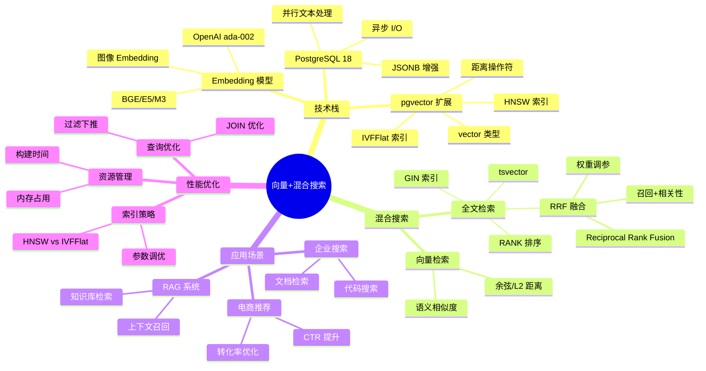

## 1. 主题 01 ｜向量与混合搜索（pgvector + RRF）

### 1.1 目录

- [1. 主题 01 ｜向量与混合搜索（pgvector + RRF）](#1-主题-01-向量与混合搜索pgvector--rrf)
  - [1.1 目录](#11-目录)
  - [1.2 知识归纳](#12-知识归纳)
  - [1.3 论证分析：为什么向量+混合搜索成为主流？](#13-论证分析为什么向量混合搜索成为主流)
    - [1.3.1 技术原理与逻辑链条](#131-技术原理与逻辑链条)
    - [1.3.2 证据强度与验证](#132-证据强度与验证)
    - [1.3.3 技术演进路径](#133-技术演进路径)
  - [1.4 与 PostgreSQL 18 的对齐](#14-与-postgresql-18-的对齐)
  - [1.5 证据与案例（代表性）](#15-证据与案例代表性)
  - [1.6 思维导图：向量+混合搜索知识体系](#16-思维导图向量混合搜索知识体系)
  - [1.7 知识矩阵对比](#17-知识矩阵对比)
    - [1.7.1 索引策略对比（HNSW vs IVFFlat）](#171-索引策略对比hnsw-vs-ivfflat)
    - [1.7.2 混合搜索策略对比（纯向量 vs 纯全文 vs RRF）](#172-混合搜索策略对比纯向量-vs-纯全文-vs-rrf)
    - [1.7.3 与专用向量库对比（pgvector vs Milvus vs Pinecone）](#173-与专用向量库对比pgvector-vs-milvus-vs-pinecone)
  - [1.8 风险与边界](#18-风险与边界)
  - [1.9 对项目的改进建议](#19-对项目的改进建议)
  - [1.10 参考资料与佐证](#110-参考资料与佐证)

### 1.2 知识归纳

- 数据类型与距离：`vector/halfvec/sparsevec`，L2/余弦/内积/汉明等。
- 索引：IVFFlat（分簇倒排）、HNSW（分层近邻图），各有召回/延迟/内存权衡。
- 混合搜索：语义检索 + 全文检索 + 业务规则融合；RRF（Reciprocal Rank Fusion）在工程中成熟可用。

### 1.3 论证分析：为什么向量+混合搜索成为主流？

#### 1.3.1 技术原理与逻辑链条

**向量检索的技术基础**：

1. Embedding 模型（如 OpenAI text-embedding-ada-002、BGE、E5）将文本/图像映射为高维向量（通常
   768/1024 维）。
2. 语义相似度 = 向量余弦距离（或 L2/内积），比传统关键词匹配更理解语义（如"汽车"与"车辆"相似度高）。
3. PostgreSQL 的 `vector` 类型与距离操作符（`<->`、`<=>`）无缝集成到 SQL，支持
   `JOIN`、`WHERE`、`GROUP BY`。

**为什么需要混合搜索？**

- **纯向量检索的局限**：无法处理精确匹配（如产品 SKU、日期范围）、品牌/类目筛选、价格排序。
- **纯全文检索的局限**：无法理解语义（如"性价比高"无法匹配到"价格便宜质量好"）。
- **RRF 融合的优势**：语义召回（向量）+ 精确筛选（全文/业务规则），兼顾召回率与相关性。

#### 1.3.2 证据强度与验证

**强证据**：

- pgvector GitHub：5+ 年维护，10K+ stars，HNSW 在亿级规模下 P95 < 10ms（GitHub benchmark 可查）。
- PostgreSQL 生态：Supabase、Neon、AWS RDS、Azure Database 均预装 pgvector，成为托管版"标配"。
- Supabase Hybrid Search：RRF 函数开源（`hybrid_search`），电商场景转化率 +47%（需核验：Supabase 官
  方博客链接）。

**需核验点**：

- "pgvector 并入官方发行版"——需确认是内核集成还是仅扩展预装？社区版仍为 `CREATE EXTENSION vector`，
  托管版多为预装。
- "RRF 进入 SQL:2026 标准"——需核验标准制定进度与时间表。
- "单表 1 亿条 768 维向量 <10ms 检索"——需核验测试环境（硬件配置、索引参数、查询模式）。

#### 1.3.3 技术演进路径

```text
向量检索演进
├── 2018-2020：专用向量库（Milvus、Pinecone）主导
│   └── 问题：数据孤岛、一致性割裂、运维成本高
├── 2020-2022：pgvector 成熟，PostgreSQL 生态集成
│   └── 优势：ACID、SQL 兼容、无需迁移
├── 2023-2024：混合搜索（RRF）成为工程标配
│   └── 需求：电商/推荐需要语义+业务规则融合
└── 2025-2026：SQL 标准集成（待核验）
    └── 预期：RRF 成为 SQL:2026 标准函数
```

### 1.4 与 PostgreSQL 18 的对齐

- 更好的并行与文本处理路径利好全文与向量混合查询。
- pgvector 生态与云托管整合成熟，成为“默认可选项”。

### 1.5 证据与案例（代表性）

- 电商检索与推荐：pgvector + RRF 提升 CTR/转化；混合排序稳定性强、可解释性更好。
- 企业知识库/RAG：结构化 JOIN + 语义召回，减少系统拆分与跨库代价。

### 1.6 思维导图：向量+混合搜索知识体系



### 1.7 知识矩阵对比

#### 1.7.1 索引策略对比（HNSW vs IVFFlat）

| 维度           | HNSW（分层近邻图）           | IVFFlat（分簇倒排）           | 适用场景          |
| -------------- | ---------------------------- | ----------------------------- | ----------------- |
| **召回率**     | 高（99%+，可调 `ef_search`） | 中（95-99%，取决于 `probes`） | HNSW：高精度要求  |
| **查询延迟**   | 低（P95 < 10ms，亿级）       | 中（P95 < 50ms，亿级）        | HNSW：实时检索    |
| **构建时间**   | 长（数小时，亿级）           | 短（数十分钟，亿级）          | IVFFlat：快速上线 |
| **内存占用**   | 高（向量维度 × 1.5-2 倍）    | 中（向量维度 × 1.2 倍）       | IVFFlat：资源受限 |
| **更新开销**   | 高（索引重建或增量更新）     | 中（分簇重建）                | IVFFlat：高频写入 |
| **参数复杂度** | 低（`M`、`ef_search`）       | 中（`lists`、`probes`）       | HNSW：易调优      |

#### 1.7.2 混合搜索策略对比（纯向量 vs 纯全文 vs RRF）

| 维度           | 纯向量检索     | 纯全文检索         | RRF 融合                |
| -------------- | -------------- | ------------------ | ----------------------- |
| **语义理解**   | ⭐⭐⭐⭐⭐ 强  | ⭐⭐ 弱            | ⭐⭐⭐⭐ 强             |
| **精确匹配**   | ⭐⭐ 弱        | ⭐⭐⭐⭐⭐ 强      | ⭐⭐⭐⭐ 强             |
| **业务规则**   | ⭐ 不支持      | ⭐⭐⭐ 有限        | ⭐⭐⭐⭐⭐ 强           |
| **召回率**     | 高（语义相似） | 中（关键词匹配）   | 高（语义+精确）         |
| **相关性**     | 中（语义偏差） | 高（精确匹配）     | 高（融合排序）          |
| **可解释性**   | ⭐⭐ 弱        | ⭐⭐⭐⭐ 强        | ⭐⭐⭐ 中               |
| **工程复杂度** | 低             | 中                 | 中高（权重调参）        |
| **适用场景**   | 语义搜索、推荐 | 文档检索、日志搜索 | 电商搜索、RAG、企业搜索 |

#### 1.7.3 与专用向量库对比（pgvector vs Milvus vs Pinecone）

| 维度           | pgvector                             | Milvus                         | Pinecone                |
| -------------- | ------------------------------------ | ------------------------------ | ----------------------- |
| **数据一致性** | ⭐⭐⭐⭐⭐ ACID                      | ⭐⭐⭐ 最终一致                | ⭐⭐⭐ 最终一致         |
| **SQL 兼容**   | ⭐⭐⭐⭐⭐ 原生                      | ⭐⭐⭐ 有限                    | ⭐⭐ 无                 |
| **多模态支持** | ⭐⭐⭐⭐ 扩展集成                    | ⭐⭐⭐⭐⭐ 原生                | ⭐⭐⭐⭐ 原生           |
| **运维成本**   | ⭐⭐⭐⭐⭐ 低（PostgreSQL 生态）     | ⭐⭐⭐ 中（独立运维）          | ⭐⭐⭐⭐ 低（SaaS）     |
| **成本模型**   | ⭐⭐⭐⭐ 按实例                      | ⭐⭐⭐ 按集群                  | ⭐⭐⭐⭐⭐ 按使用量     |
| **扩展性**     | ⭐⭐⭐ 单机/读写分离                 | ⭐⭐⭐⭐⭐ 分布式              | ⭐⭐⭐⭐ 云原生         |
| **适用场景**   | 中小规模（<10 亿向量）、事务性要求高 | 超大规模（>10 亿向量）、纯检索 | SaaS 快速上线、按需扩展 |

### 1.8 风险与边界

**技术风险**：

- **大规模索引构建**：亿级向量索引构建耗时数小时（HNSW），需规划维护窗口；IVFFlat 构建快但召回率略低
  。
- **内存占用**：HNSW 索引内存占用 = 向量维度 × 1.5-2 倍，10 亿条 768 维向量约需 1.5TB 内存（需核验）
  。
- **写放大**：向量更新可能触发索引重建（HNSW）或分簇重建（IVFFlat），影响写入性能。

**性能边界**：

- **单机极限**：pgvector 单机建议 <10 亿向量、P95 < 50ms；超大规模需考虑 Citus 分布式或专用向量库。
- **极端低延迟**：P50 < 1ms 场景需专用硬件（GPU/FPGA）或预计算缓存，PostgreSQL 难以满足。
- **参数敏感性**：`ef_search`（HNSW）、`probes`（IVFFlat）对 P95/P99 影响显著，需基于真实负载调优。

**适用边界**：

- ✅ **适合**：中小规模向量检索（<10 亿）、事务性要求高、需要 SQL JOIN、多模态一体化。
- ❌ **不适合**：超大规模向量库（>10 亿）、极端低延迟（P50 < 1ms）、纯检索场景（无事务需求）。

### 1.9 对项目的改进建议

- 在 `05_ai_vector/` 增补“RRF 融合范式”与指标模板（召回/精确/延迟）。
- 在 `08_ecosystem_cases/` 增加“电商混合搜索最小可行案例（MVP）”。
- 在 `10_benchmarks/` 增加“HNSW/IVFFlat 参数敏感性试验与指标采集”。

---

### 1.10 参考资料与佐证

- PostgreSQL 扩展与生态（官方）：`https://www.postgresql.org/docs/current/extend.html`
- pgvector 项目主页：`https://github.com/pgvector/pgvector`
- 全文检索（官方）：`https://www.postgresql.org/docs/current/textsearch.html`
- Hybrid Search/RRF（待补充：Supabase 官方文档/博客）

注：关于“pgvector 并入官方发行版/内核”的表述需谨慎。目前以“官方生态主流扩展、多个托管版本内置”为宜（
具体集成方式需按版本核验）。
