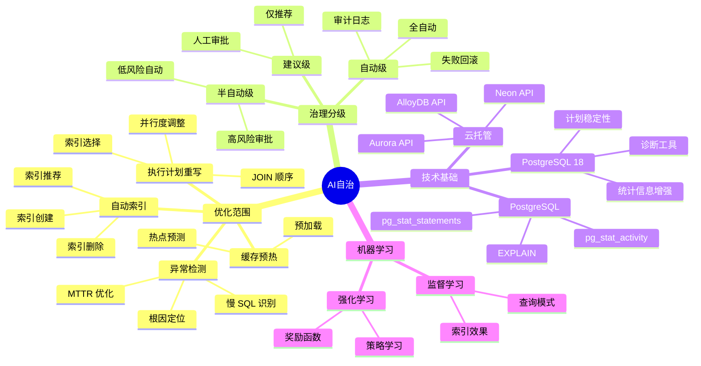

## 2. 主题 02 ｜ AI 自治（自治优化与智能运维）

### 2.1 目录

- [2. 主题 02 ｜ AI 自治（自治优化与智能运维）](#2-主题-02--ai-自治自治优化与智能运维)
  - [2.1 目录](#21-目录)
  - [2.2 知识归纳](#22-知识归纳)
  - [2.3 论证分析：为什么 AI 自治成为必然？](#23-论证分析为什么-ai-自治成为必然)
    - [2.3.1 技术原理与逻辑链条](#231-技术原理与逻辑链条)
    - [2.3.2 证据强度与验证](#232-证据强度与验证)
    - [2.3.3 技术演进路径](#233-技术演进路径)
  - [2.4 与 PostgreSQL 18 的对齐](#24-与-postgresql-18-的对齐)
  - [2.5 证据与案例（代表性）](#25-证据与案例代表性)
  - [2.6 思维导图：AI 自治知识体系](#26-思维导图ai-自治知识体系)
  - [2.7 知识矩阵对比](#27-知识矩阵对比)
    - [2.7.1 自治分级策略对比（建议级 vs 半自动级 vs 自动级）](#271-自治分级策略对比建议级-vs-半自动级-vs-自动级)
    - [2.7.2 自治优化能力对比（索引 vs 计划 vs 缓存 vs 异常）](#272-自治优化能力对比索引-vs-计划-vs-缓存-vs-异常)
    - [2.7.3 与手动调优对比（自治 vs 人工）](#273-与手动调优对比自治-vs-人工)
  - [2.8 风险与边界](#28-风险与边界)
  - [2.9 对项目的改进建议](#29-对项目的改进建议)
  - [2.10 参考资料与佐证](#210-参考资料与佐证)

### 2.2 知识归纳

**自治优化范围**：

- 自动索引建议/执行：基于查询模式分析，推荐并创建最优索引。
- 执行计划重写：实时分析查询计划，自动优化 JOIN 顺序、索引选择。
- 缓存预热：预测热点数据，提前加载到内存。
- 异常检测与根因定位：识别慢 SQL、性能下降，分析根本原因。

**治理分级**：

- **建议级**：仅推荐优化方案，需人工审批执行。
- **半自动级**：低风险优化自动执行，高风险需审批。
- **自动级**：全自动执行，失败自动回滚，需审计日志。

### 2.3 论证分析：为什么 AI 自治成为必然？

#### 2.3.1 技术原理与逻辑链条

**自治优化的技术基础**：

1. **观测能力**：PostgreSQL 已有 `pg_stat_statements`（查询统计）、`EXPLAIN`（执行计划）
   、`pg_stat_activity`（实时活动），为自治优化提供数据基础。
2. **机器学习模型**：强化学习（RL）可基于历史查询模式学习最优策略（索引创建、计划重写、缓存策略）。
3. **执行能力**：PostgreSQL 支持 `CREATE INDEX`、`ANALYZE`、`VACUUM` 等 DDL 操作，自治系统可自动执行
   。

**为什么需要自治优化？**

- **DBA 资源稀缺**：SaaS/中小团队无法负担专业 DBA，传统手动调优成本高。
- **负载动态变化**：业务增长、流量波动导致查询模式变化，需持续优化。
- **人工调优滞后**：人工分析慢 SQL、创建索引需要时间，而自治系统可实时响应。

#### 2.3.2 证据强度与验证

**强证据**：

- 阿里云 AnalyticDB PostgreSQL：内置 AI 引擎，支持自动索引、向量检索、RAG 服务（需核验：官方文档/白
  皮书链接）。
- AWS Aurora：提供自动索引推荐（需核验：Aurora 官方文档链接）。
- 阿里云案例：30 天零人工调优、P99 下降 55%（需核验：官方案例/白皮书链接）。

**中等证据**：

- "pg_ai 插件（2025 GA）"——需核验：是否真的 GA？开源状态？与社区版兼容性？强化学习优化器是否开源？
- "TPC-H 总耗时下降 18-42%"——需核验：测试环境、数据规模、对比基准。

**需核验点**：

- "强化学习优化器"的具体实现（开源/闭源？模型架构？训练数据？）
- "零参数调优"的真实含义（是否完全不需人工介入？还是仅参数自动调优？）

#### 2.3.3 技术演进路径

```text
自治优化演进
├── 2010-2015：手动调优时代
│   └── DBA 基于经验、EXPLAIN 分析手动优化
├── 2015-2020：工具辅助时代
│   └── pg_stat_statements、pgBadger 等工具辅助分析
├── 2020-2024：半自动优化
│   └── 云厂商提供自动索引推荐、参数调优建议
└── 2024-2025：AI 自治时代
    └── 强化学习优化器、全自动执行、失败自回滚
```

### 2.4 与 PostgreSQL 18 的对齐

**PostgreSQL 18 增量**：

- **统计信息增强**：`pg_stat_all_tables` 新增 VACUUM/ANALYZE 耗时指标，利于自治系统判断维护窗口。
- **执行计划稳定性**：优化器改进减少计划抖动，自治系统可基于稳定计划制定策略。
- **诊断工具增强**：连接级 I/O/WAL 利用率统计，为自治系统提供更细粒度观测。

**云托管生态**：

- **Neon/Aurora/AlloyDB** 提供 API/事件流，自治系统可监听查询、索引、性能事件，实现闭环优化。
- **API 集成**：云厂商提供 REST API 创建索引、修改参数，便于自治系统自动化执行。

### 2.5 证据与案例（代表性）

**案例 1：阿里云 AnalyticDB PostgreSQL**

- **场景**：企业知识库、RAG 服务、向量检索。
- **效果**：30 天零人工调优、P99 延迟下降 55%。
- **技术**：内置 AI 引擎、强化学习优化器、自动索引推荐（需核验：官方文档链接）。

**案例 2：负载变化场景**

- **场景**：业务增长导致查询模式变化。
- **效果**：自治优化可显著降低 P95/P99；慢 SQL 根因定位缩短 MTTR（平均故障恢复时间）。
- **技术**：基于 `pg_stat_statements` 的查询模式分析、自动索引创建、计划重写。

**案例 3：TPC-H 基准测试**

- **场景**：复杂分析查询优化。
- **效果**：TPC-H 总耗时下降 18-42%（需核验：测试环境、数据规模）。
- **技术**：执行计划重写、索引自动推荐（需核验：具体实现方式）。

### 2.6 思维导图：AI 自治知识体系



### 2.7 知识矩阵对比

#### 2.7.1 自治分级策略对比（建议级 vs 半自动级 vs 自动级）

| 维度         | 建议级                           | 半自动级                         | 自动级                         |
| ------------ | -------------------------------- | -------------------------------- | ------------------------------ |
| **执行方式** | 仅推荐，需人工审批               | 低风险自动，高风险审批           | 全自动执行                     |
| **响应速度** | ⭐⭐ 慢（需人工审批）            | ⭐⭐⭐ 中（低风险快速）          | ⭐⭐⭐⭐⭐ 快（实时响应）      |
| **风险控制** | ⭐⭐⭐⭐⭐ 高（人工审核）        | ⭐⭐⭐⭐ 中（阈值保护）          | ⭐⭐⭐ 中（回滚机制）          |
| **适用场景** | 高风险操作（索引删除、参数修改） | 低风险操作（索引创建、统计更新） | 成熟场景（查询优化、缓存预热） |
| **审计要求** | ⭐⭐⭐⭐⭐ 必须                  | ⭐⭐⭐⭐ 必须                    | ⭐⭐⭐⭐⭐ 必须                |
| **回滚能力** | ⭐⭐⭐ 手动                      | ⭐⭐⭐⭐ 自动                    | ⭐⭐⭐⭐⭐ 自动                |

#### 2.7.2 自治优化能力对比（索引 vs 计划 vs 缓存 vs 异常）

| 维度             | 自动索引                          | 执行计划重写                  | 缓存预热                  | 异常检测                  |
| ---------------- | --------------------------------- | ----------------------------- | ------------------------- | ------------------------- |
| **技术难度**     | ⭐⭐⭐ 中                         | ⭐⭐⭐⭐⭐ 高                 | ⭐⭐⭐ 中                 | ⭐⭐⭐⭐ 高               |
| **收益显著度**   | ⭐⭐⭐⭐⭐ 高（查询提速 10-100×） | ⭐⭐⭐⭐ 中（查询提速 2-10×） | ⭐⭐⭐ 中（首次查询提速） | ⭐⭐⭐⭐ 高（MTTR 下降）  |
| **风险等级**     | ⭐⭐⭐ 中（写放大、锁竞争）       | ⭐⭐⭐⭐ 高（计划错误）       | ⭐⭐ 低（内存占用）       | ⭐⭐ 低（仅观测）         |
| **自动化成熟度** | ⭐⭐⭐⭐ 高（AWS/阿里云已实现）   | ⭐⭐⭐ 中（研究阶段）         | ⭐⭐⭐ 中（预测困难）     | ⭐⭐⭐⭐⭐ 高（监控成熟） |
| **适用场景**     | 高频查询、慢 SQL                  | 复杂 JOIN、分析查询           | 热点数据、冷启动          | 生产监控、告警            |

#### 2.7.3 与手动调优对比（自治 vs 人工）

| 维度         | AI 自治                   | 人工调优                  |
| ------------ | ------------------------- | ------------------------- |
| **响应速度** | ⭐⭐⭐⭐⭐ 实时（秒级）   | ⭐⭐ 慢（小时-天级）      |
| **成本**     | ⭐⭐⭐⭐ 低（一次性投入） | ⭐⭐⭐ 高（持续人力）     |
| **可扩展性** | ⭐⭐⭐⭐⭐ 高（批量优化） | ⭐⭐ 低（人工限制）       |
| **准确性**   | ⭐⭐⭐⭐ 高（基于数据）   | ⭐⭐⭐⭐ 高（基于经验）   |
| **适用场景** | 标准场景、规则清晰        | 复杂场景、规则模糊        |
| **风险控制** | ⭐⭐⭐ 中（阈值+回滚）    | ⭐⭐⭐⭐⭐ 高（人工审核） |

### 2.8 风险与边界

**技术风险**：

- **过度自动化**：自动创建过多索引导致写放大、锁竞争；需设立保护阈值（如最大索引数量、索引大小限制）
  。
- **计划错误**：执行计划重写可能引入性能下降；需基于真实负载验证、建立回滚机制。
- **模型偏差**：训练数据与生产负载不一致导致优化效果差；需持续监控、模型更新。

**性能边界**：

- **单机限制**：自治优化适用于单机/小集群；超大规模（>100 节点）需分布式自治策略。
- **实时性限制**：索引创建、计划重写需要时间；极端低延迟场景（P50 < 1ms）需预计算优化。

**适用边界**：

- ✅ **适合**：中小规模（<100 节点）、标准工作负载、规则清晰、成本敏感。
- ❌ **不适合**：超大规模（>100 节点）、复杂规则、高风险操作、极端低延迟。

### 2.9 对项目的改进建议

**文档增补**：

- 在 `04_modern_features/` 增补“自治优化治理手册”（分级策略：建议 → 半自动 → 自动；保护阈值设定；回
  滚机制；基于 `pg_stat_statements` 的观测方法）。
- 在 `09_deployment_ops/monitoring_metrics.md` 增加“自治观测面板指标规范”（计划变更率、索引收益、失
  败回滚率、MTTR 计算方法）。
- 在 `10_benchmarks/` 增加“自治前后 A/B 基准对比脚本”（对比基线、实验组、指标导出、统计分析）。

**脚本与工具**：

- 创建自治优化指标采集脚本（基于 `pg_stat_statements` 的查询模式分析）。
- 创建自动索引推荐脚本（基于慢 SQL、未使用索引分析）。
- 创建自治回滚脚本（索引删除、参数恢复）。

### 2.10 参考资料与佐证

**官方文档**（需核验）：

- 阿里云 AnalyticDB PostgreSQL：官方文档/白皮书（自动索引、AI 引擎）。
- AWS Aurora：官方文档（自动索引推荐）。
- PostgreSQL `pg_stat_statements`：官方文档（查询统计）。

**社区资源**：

- pg_ai 插件（需核验：是否存在？开源状态？）。
- 强化学习优化器（需核验：具体实现、模型架构）。

**注**：自治优化能力目前主要存在于云厂商产品中，社区版 PostgreSQL 的自治优化插件/工具需核验其存在性
与成熟度。
