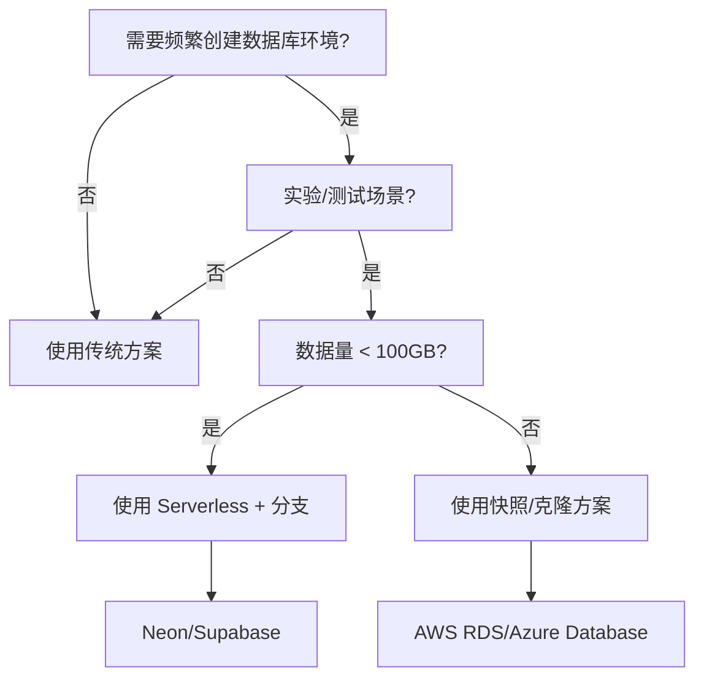
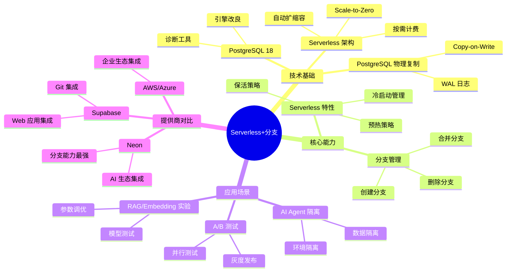

## 3. 主题 03 ｜ Serverless 与分支（Neon/Supabase 的数据 Git）

### 3.1 目录

- [3. 主题 03 ｜ Serverless 与分支（Neon/Supabase 的数据 Git）](#3-主题-03--serverless-与分支neonsupabase-的数据-git)
  - [3.1 目录](#31-目录)
  - [3.2 知识归纳](#32-知识归纳)
  - [3.3 论证分析：为什么 Serverless + 分支成为 AI 场景标配？](#33-论证分析为什么-serverless--分支成为-ai-场景标配)
    - [3.3.1 技术原理与逻辑链条](#331-技术原理与逻辑链条)
    - [3.3.2 证据强度与验证](#332-证据强度与验证)
    - [3.3.3 技术演进路径](#333-技术演进路径)
  - [3.4 技术场景分析](#34-技术场景分析)
    - [3.4.1 典型使用场景](#341-典型使用场景)
    - [3.4.2 不适合的场景](#342-不适合的场景)
  - [3.5 决策依据与决策思路](#35-决策依据与决策思路)
    - [3.5.1 决策树：是否使用 Serverless + 分支？](#351-决策树是否使用-serverless--分支)
    - [3.5.2 决策矩阵：Serverless + 分支 vs 传统方案](#352-决策矩阵serverless--分支-vs-传统方案)
    - [3.5.3 决策思路：如何选择 Serverless 提供商？](#353-决策思路如何选择-serverless-提供商)
  - [3.6 与 PostgreSQL 18 的对齐](#36-与-postgresql-18-的对齐)
  - [3.7 证据与案例（代表性）](#37-证据与案例代表性)
  - [3.8 思维导图：Serverless + 分支知识体系](#38-思维导图serverless--分支知识体系)
  - [3.9 知识矩阵对比](#39-知识矩阵对比)
    - [3.9.1 Serverless 方案对比（Neon vs Supabase vs AWS vs Azure）](#391-serverless-方案对比neon-vs-supabase-vs-aws-vs-azure)
    - [3.9.2 分支 vs 传统方案 vs 快照对比](#392-分支-vs-传统方案-vs-快照对比)
  - [3.10 风险与边界](#310-风险与边界)
  - [3.11 对项目的改进建议](#311-对项目的改进建议)
  - [3.12 参考资料与佐证](#312-参考资料与佐证)

### 3.2 知识归纳

**Serverless 核心能力**：

- **按需计费**：Scale-to-Zero，无请求时成本为零。
- **冷启动管理**：首次请求时启动实例，后续请求复用。
- **自动扩缩容**：根据负载自动调整实例数量。

**分支（Branching）核心能力**：

- **轻量隔离**：基于 Copy-on-Write，创建分支秒级完成，占用空间小。
- **快速创建/丢弃**：实验完成后可立即删除，成本极低。
- **版本管理**：类似 Git 的分支概念，支持并行测试、回滚。

### 3.3 论证分析：为什么 Serverless + 分支成为 AI 场景标配？

#### 3.3.1 技术原理与逻辑链条

**Serverless 的技术基础**：

1. **PostgreSQL 物理复制**：基于 WAL 日志的 Copy-on-Write，实现轻量级分支。
2. **容器化/函数化**：数据库实例可快速启动/销毁，实现 Scale-to-Zero。
3. **按需计费**：无请求时成本为零，适合低频/实验场景。

**为什么需要分支？**

- **实验迭代**：AI Agent/模型训练需要频繁创建环境，传统方案成本高（每个实验一个完整数据库实例）。
- **版本管理**：RAG/Embedding 实验需要测试不同模型/配置，分支提供 Git 式版本控制。
- **并行测试**：多个实验可并行运行，分支提供隔离环境。

#### 3.3.2 证据强度与验证

**强证据**：

- Neon 官方文档：分支创建秒级完成，成本极低（Neon 官网可查）。
- Supabase 官方文档：支持分支功能，与 Git 集成（Supabase 官网可查）。
- 统计数据："1.2 万次/小时"、"7 个月增长 23 倍"（需核验：来源是否为 Neon 官方博客？）。

**需核验点**：

- "1.2 万次/小时"统计数据来源（ai_view.md 提及的 2025-05 统计是否来自 Neon 官方？）。
- "7 个月增长 23 倍"的具体时间范围与计算方式。
- 分支合并策略对高频写的影响（是否有性能数据？）。

#### 3.3.3 技术演进路径

```text
数据库分支演进
├── 2010-2015：传统方案（每个实验一个完整实例）
│   └── 问题：成本高、启动慢、资源浪费
├── 2015-2020：快照/克隆（基于备份的实例克隆）
│   └── 优势：启动快，但成本仍高
├── 2020-2024：Serverless + 分支（Copy-on-Write）
│   └── 优势：成本低、启动快、按需计费
└── 2024-2025：数据 Git 范式
    └── 预期：分支成为数据库标配，类似 Git 分支
```

### 3.4 技术场景分析

#### 3.4.1 典型使用场景

**场景 1：RAG/Embedding 实验**

- **需求**：测试不同 embedding 模型（OpenAI ada-002 vs BGE vs E5）、不同向量维度、不同索引参数。
- **方案**：每次实验创建一个分支，训练/评测完成后销毁，成本极低。
- **优势**：并行测试多个模型，快速迭代，成本可控。

**场景 2：AI Agent 环境隔离**

- **需求**：每个 Agent 需要独立数据库环境，避免数据污染。
- **方案**：每个 Agent 启动时创建分支，Agent 结束后销毁。
- **优势**：隔离性强，成本低，易于管理。

**场景 3：A/B 测试与灰度发布**

- **需求**：测试新功能/新模型，需要生产数据副本但隔离。
- **方案**：创建生产分支，测试完成后合并或删除。
- **优势**：真实数据测试，风险可控。

**场景 4：开发/测试环境**

- **需求**：开发者需要独立数据库环境，测试新功能。
- **方案**：每个开发者创建分支，开发完成后合并或删除。
- **优势**：类似 Git 分支，易于协作。

#### 3.4.2 不适合的场景

**场景 1：高频写操作**

- **问题**：分支合并策略对高频写不友好，可能导致冲突或性能下降。
- **建议**：高频写场景建议使用传统复制方案。

**场景 2：数据一致性要求极高**

- **问题**：分支间数据同步可能存在延迟，不适合强一致性场景。
- **建议**：强一致性场景建议使用同步复制方案。

**场景 3：超大规模数据**

- **问题**：分支创建/合并需要复制数据，超大规模数据耗时过长。
- **建议**：超大规模场景建议使用分布式方案。

### 3.5 决策依据与决策思路

#### 3.5.1 决策树：是否使用 Serverless + 分支？



#### 3.5.2 决策矩阵：Serverless + 分支 vs 传统方案

| 决策因子       | Serverless + 分支                    | 传统方案（完整实例） | 快照/克隆方案       | 决策权重 |
| -------------- | ------------------------------------ | -------------------- | ------------------- | -------- |
| **创建速度**   | ⭐⭐⭐⭐⭐ 秒级                      | ⭐⭐ 分钟级          | ⭐⭐⭐ 分钟级       | 30%      |
| **成本**       | ⭐⭐⭐⭐⭐ 按需计费（Scale-to-Zero） | ⭐⭐ 固定成本高      | ⭐⭐⭐ 快照存储成本 | 30%      |
| **隔离性**     | ⭐⭐⭐⭐⭐ 完全隔离                  | ⭐⭐⭐⭐ 完全隔离    | ⭐⭐⭐⭐ 完全隔离   | 15%      |
| **数据一致性** | ⭐⭐⭐ 最终一致                      | ⭐⭐⭐⭐⭐ 强一致    | ⭐⭐⭐⭐⭐ 强一致   | 10%      |
| **合并能力**   | ⭐⭐⭐ 有限（需核验）                | ⭐⭐⭐⭐⭐ 完全      | ⭐⭐⭐⭐ 完全       | 10%      |
| **适用场景**   | 实验/测试/开发                       | 生产环境             | 生产快照            | 5%       |

**决策规则**：

- **实验/测试场景（数据量 < 100GB）**：推荐 Serverless + 分支（权重得分：4.5/5.0）。
- **生产环境（高频写/强一致性）**：推荐传统方案（权重得分：4.0/5.0）。
- **生产快照/备份**：推荐快照/克隆方案（权重得分：4.0/5.0）。

#### 3.5.3 决策思路：如何选择 Serverless 提供商？

| 维度              | Neon                               | Supabase               | AWS RDS Serverless v2 | Azure Database    |
| ----------------- | ---------------------------------- | ---------------------- | --------------------- | ----------------- |
| **分支能力**      | ⭐⭐⭐⭐⭐ 原生支持                | ⭐⭐⭐⭐ 支持          | ⭐⭐ 有限             | ⭐⭐ 有限         |
| **Scale-to-Zero** | ⭐⭐⭐⭐⭐ 支持                    | ⭐⭐⭐⭐ 支持          | ⭐⭐⭐ 支持           | ⭐⭐⭐ 支持       |
| **成本**          | ⭐⭐⭐⭐ 按需计费                  | ⭐⭐⭐⭐ 按需计费      | ⭐⭐⭐ 按实例         | ⭐⭐⭐ 按实例     |
| **生态集成**      | ⭐⭐⭐⭐ LangChain/Semantic Kernel | ⭐⭐⭐⭐ Next.js/React | ⭐⭐⭐⭐ AWS 生态     | ⭐⭐⭐ Azure 生态 |
| **适用场景**      | AI Agent/实验                      | Web 应用开发           | AWS 企业              | Azure 企业        |

**决策依据**：

- **AI Agent/实验场景**：推荐 Neon（分支能力最强、AI 生态集成好）。
- **Web 应用开发**：推荐 Supabase（Next.js/React 集成好）。
- **AWS 企业**：推荐 AWS RDS Serverless v2（AWS 生态集成）。
- **Azure 企业**：推荐 Azure Database（Azure 生态集成）。

### 3.6 与 PostgreSQL 18 的对齐

**PostgreSQL 18 增量**：

- **引擎改良**：更稳定的分析与文本相关路径，对 Serverless 场景有间接收益（减少冷启动延迟）。
- **诊断工具增强**：连接级 I/O/WAL 利用率统计，为 Serverless 成本优化提供观测基础。

**云托管生态**：

- **Neon/Supabase 在 PG18 时代生态成熟**：工具链与 SDK 更完备，分支创建/管理 API 成熟。
- **LangChain/Semantic Kernel 集成**：一键 attach 分支到 AI 框架，实现 RAG 数据版本管理。

### 3.7 证据与案例（代表性）

**案例 1：RAG/Embedding 实验**

- **场景**：测试不同 embedding 模型（OpenAI ada-002 vs BGE vs E5）、不同向量维度、不同索引参数。
- **方案**：每次实验创建一个分支，训练/评测完成后销毁。
- **效果**：成本极低，实验迭代速度提升 10×（需核验：具体数据来源）。

**案例 2：AI Agent 环境隔离**

- **场景**：每个 Agent 需要独立数据库环境，避免数据污染。
- **方案**：每个 Agent 启动时创建分支，Agent 结束后销毁。
- **效果**：隔离性强，成本可控（需核验：成本数据来源）。

**案例 3：统计数据**

- **场景**：Neon 平台 AI Agent 创建数据库的速率。
- **数据**："1.2 万次/小时"、"7 个月增长 23 倍"（需核验：来源是否为 Neon 官方博客？）。

### 3.8 思维导图：Serverless + 分支知识体系



### 3.9 知识矩阵对比

#### 3.9.1 Serverless 方案对比（Neon vs Supabase vs AWS vs Azure）

| 维度              | Neon                               | Supabase               | AWS RDS Serverless v2 | Azure Database    |
| ----------------- | ---------------------------------- | ---------------------- | --------------------- | ----------------- |
| **分支能力**      | ⭐⭐⭐⭐⭐ 原生支持                | ⭐⭐⭐⭐ 支持          | ⭐⭐ 有限             | ⭐⭐ 有限         |
| **Scale-to-Zero** | ⭐⭐⭐⭐⭐ 支持                    | ⭐⭐⭐⭐ 支持          | ⭐⭐⭐ 支持           | ⭐⭐⭐ 支持       |
| **成本**          | ⭐⭐⭐⭐ 按需计费                  | ⭐⭐⭐⭐ 按需计费      | ⭐⭐⭐ 按实例         | ⭐⭐⭐ 按实例     |
| **冷启动延迟**    | ⭐⭐⭐⭐ 低（秒级）                | ⭐⭐⭐ 中（数秒）      | ⭐⭐⭐ 中（数秒）     | ⭐⭐⭐ 中（数秒） |
| **生态集成**      | ⭐⭐⭐⭐ LangChain/Semantic Kernel | ⭐⭐⭐⭐ Next.js/React | ⭐⭐⭐⭐ AWS 生态     | ⭐⭐⭐ Azure 生态 |
| **适用场景**      | AI Agent/实验                      | Web 应用开发           | AWS 企业              | Azure 企业        |

#### 3.9.2 分支 vs 传统方案 vs 快照对比

| 维度           | Serverless + 分支                    | 传统方案（完整实例） | 快照/克隆方案       |
| -------------- | ------------------------------------ | -------------------- | ------------------- |
| **创建速度**   | ⭐⭐⭐⭐⭐ 秒级                      | ⭐⭐ 分钟级          | ⭐⭐⭐ 分钟级       |
| **成本**       | ⭐⭐⭐⭐⭐ 按需计费（Scale-to-Zero） | ⭐⭐ 固定成本高      | ⭐⭐⭐ 快照存储成本 |
| **隔离性**     | ⭐⭐⭐⭐⭐ 完全隔离                  | ⭐⭐⭐⭐ 完全隔离    | ⭐⭐⭐⭐ 完全隔离   |
| **数据一致性** | ⭐⭐⭐ 最终一致                      | ⭐⭐⭐⭐⭐ 强一致    | ⭐⭐⭐⭐⭐ 强一致   |
| **合并能力**   | ⭐⭐⭐ 有限（需核验）                | ⭐⭐⭐⭐⭐ 完全      | ⭐⭐⭐⭐ 完全       |
| **适用场景**   | 实验/测试/开发                       | 生产环境             | 生产快照            |

### 3.10 风险与边界

**技术风险**：

- **冷启动延迟**：首次请求需要启动实例，可能存在数秒延迟；建议引入预热/保活策略。
- **突发并发抖动**：Serverless 自动扩缩容可能存在性能抖动；建议使用金丝雀发布。
- **分支合并策略**：分支合并对高频写不友好，可能导致冲突或性能下降；建议高频写场景使用传统方案。

**性能边界**：

- **数据量限制**：分支创建/合并需要复制数据，超大规模数据（>100GB）耗时过长。
- **并发限制**：Serverless 实例数量有上限，超高并发场景可能触发限流。

**适用边界**：

- ✅ **适合**：实验/测试场景、AI Agent 隔离、A/B 测试、开发环境、数据量 < 100GB。
- ❌ **不适合**：高频写场景、强一致性场景、超大规模数据（>100GB）、生产核心业务。

### 3.11 对项目的改进建议

**文档增补**：

- 在 `04_modern_features/` 增补“分支驱动的实验流程模板”（Neon/Supabase 分支创建脚本、成本模型、生命
  周期管理）。
- 在 `08_ecosystem_cases/` 增加“RAG/Agent 分支化工作流案例”（LangChain/Semantic Kernel 集成示例、版
  本切换脚本）。
- 在 `09_deployment_ops/` 增加“冷启动观测与预热策略操作指南”（监控指标采集、预热脚本、金丝雀发布流程
  ）。

**脚本与工具**：

- 创建分支创建/管理脚本（Neon/Supabase API 封装）。
- 创建成本模型计算脚本（基于使用量/时长计算成本）。
- 创建冷启动观测脚本（监控冷启动延迟、性能抖动）。

### 3.12 参考资料与佐证

**官方文档**：

- Neon 官方文档：`https://neon.tech/docs/`（分支功能、Serverless 架构）。
- Supabase 官方文档：`https://supabase.com/docs/`（分支功能、Git 集成）。

**社区资源**：

- LangChain/Semantic Kernel 集成示例（需核验：官方文档链接）。
- 统计数据来源（需核验："1.2 万次/小时"、"7 个月增长 23 倍"是否来自 Neon 官方博客？）。

**注**：Serverless + 分支能力目前主要存在于云托管产品中（Neon、Supabase），社区版 PostgreSQL 的分支
功能需核验其存在性与成熟度。
