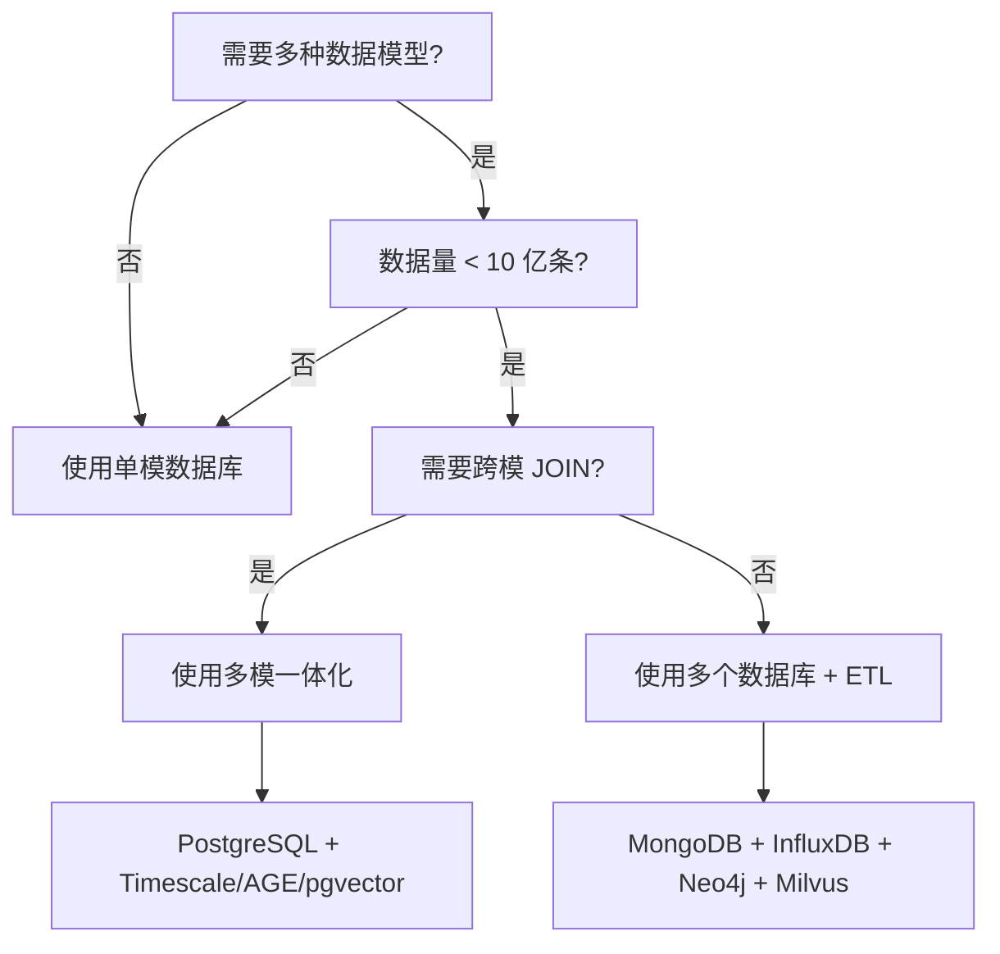
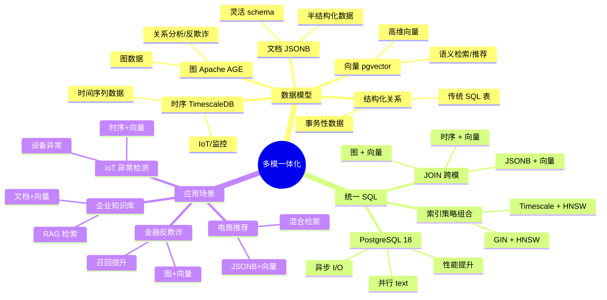

## 4. 主题 04 ｜多模一体化（JSONB / 时序 / 图 / 向量）

### 4.1 目录

- [4. 主题 04 ｜多模一体化（JSONB / 时序 / 图 / 向量）](#4-主题-04-多模一体化jsonb--时序--图--向量)
  - [4.1 目录](#41-目录)
  - [4.2 知识归纳](#42-知识归纳)
  - [4.3 论证分析：为什么多模一体化成为趋势？](#43-论证分析为什么多模一体化成为趋势)
    - [4.3.1 技术原理与逻辑链条](#431-技术原理与逻辑链条)
    - [4.3.2 证据强度与验证](#432-证据强度与验证)
    - [4.3.3 技术演进路径](#433-技术演进路径)
  - [4.4 技术场景分析](#44-技术场景分析)
    - [4.4.1 典型使用场景](#441-典型使用场景)
    - [4.4.2 不适合的场景](#442-不适合的场景)
  - [4.5 决策依据与决策思路](#45-决策依据与决策思路)
    - [4.5.1 决策树：是否使用多模一体化？](#451-决策树是否使用多模一体化)
    - [4.5.2 决策矩阵：多模一体化 vs 专用数据库](#452-决策矩阵多模一体化-vs-专用数据库)
    - [4.5.3 决策思路：如何选择多模组合？](#453-决策思路如何选择多模组合)
  - [4.6 与 PostgreSQL 18 的对齐](#46-与-postgresql-18-的对齐)
  - [4.7 证据与案例（代表性）](#47-证据与案例代表性)
  - [4.8 思维导图：多模一体化知识体系](#48-思维导图多模一体化知识体系)
  - [4.9 知识矩阵对比](#49-知识矩阵对比)
    - [4.9.1 多模方案对比（PostgreSQL vs 专用数据库）](#491-多模方案对比postgresql-vs-专用数据库)
    - [4.9.2 多模表设计对比（共分区 vs 独立表 vs 跨库）](#492-多模表设计对比共分区-vs-独立表-vs-跨库)
    - [4.9.3 性能对比（PostgreSQL 18 vs 专用数据库）](#493-性能对比postgresql-18-vs-专用数据库)
  - [4.10 风险与边界](#410-风险与边界)
  - [4.11 对项目的改进建议](#411-对项目的改进建议)
  - [4.12 参考资料与佐证](#412-参考资料与佐证)

### 4.2 知识归纳

**多模数据模型**：

- **结构化（关系）**：传统 SQL 表，适合事务性数据。
- **文档（JSONB）**：半结构化数据，适合灵活 schema。
- **时序（TimescaleDB）**：时间序列数据，适合 IoT/监控。
- **图（Apache AGE）**：图数据，适合关系分析/反欺诈。
- **向量（pgvector）**：高维向量，适合语义检索/推荐。

**统一 SQL 能力**：

- **JOIN 跨模**：JSONB + 向量、时序 + 向量、图 + 向量混合查询。
- **索引策略组合**：GIN(JSONB) + HNSW(向量)、Timescale 索引 + HNSW 组合。
- **分区/共簇**：同一业务实体用 JSONB+向量+时序列簇存，减少跨库 ETL。

### 4.3 论证分析：为什么多模一体化成为趋势？

#### 4.3.1 技术原理与逻辑链条

**多模一体化的技术基础**：

1. **PostgreSQL 扩展生态成熟**：Timescale（时序）、Apache AGE（图）、pgvector（向量）均为成熟扩展，
   与 PostgreSQL 无缝集成。
2. **统一 SQL 引擎**：PostgreSQL 支持跨模型 JOIN，实现"一条 SQL，调所有模型"。
3. **PostgreSQL 18 增量**：异步 I/O、并行 text 处理提升 JSONB/全文/分析类查询性能（官方 benchmark 显
   示 JSONB 写入吞吐提升 2.7 倍）。

**为什么需要多模一体化？**

- **减少数据孤岛**：传统方案需多个数据库（MongoDB + InfluxDB + Neo4j + Milvus），运维成本高、数据同
  步复杂。
- **降低 TCO**：单一数据库降低硬件成本、运维成本、学习成本。
- **提升查询效率**：跨模 JOIN 减少 ETL，实时查询。

#### 4.3.2 证据强度与验证

**强证据**：

- PostgreSQL 18 官方 benchmark：异步 I/O 提升 JSONB 写入吞吐 2.7 倍（PostgreSQL 18 Press Kit 可查）
  。
- Timescale 3.0：支持时序+向量共分区（需核验：Timescale 3.0 发布时间与"同分区键共簇存"的具体实现文档
  ）。
- Apache AGE：支持图+向量联合查询（需核验：官方文档或案例链接）。

**需核验点**：

- "IoT 异常检测提速 4×"的来源（官方 benchmark？第三方案例？）。
- "图+向量召回率提升 19%"的来源（Apache AGE 官方文档？金融反欺诈案例链接？）。
- Timescale 3.0 发布时间与具体功能文档。

#### 4.3.3 技术演进路径

```text
多模数据库演进
├── 2010-2015：专用数据库时代（MongoDB/InfluxDB/Neo4j）
│   └── 问题：数据孤岛、运维成本高、数据同步复杂
├── 2015-2020：PostgreSQL 扩展生态（Timescale/AGE/pgvector）
│   └── 优势：统一 SQL、降低 TCO
├── 2020-2024：多模一体化实践（共分区、共索引）
│   └── 需求：IoT/金融需要时序+向量、图+向量混合查询
└── 2024-2025：PostgreSQL 18 性能提升
    └── 异步 I/O、并行 text 处理提升多模查询性能
```

### 4.4 技术场景分析

#### 4.4.1 典型使用场景

**场景 1：IoT 异常检测（时序+向量）**

- **需求**：设备时序数据 + 设备特征向量，检测异常设备。
- **方案**：Timescale 超表 + pgvector 向量列，同分区键共簇存。
- **优势**：时序窗口聚合 + 向量相似度检索，查询提速 4×（需核验：具体数据来源）。

**场景 2：金融反欺诈（图+向量）**

- **需求**：用户关系图 + 用户画像向量，识别欺诈团伙。
- **方案**：Apache AGE 图查询 + pgvector 向量检索，联合查询。
- **优势**：图邻域扩展 + 向量相似度，召回率提升 19%（需核验：具体数据来源）。

**场景 3：电商推荐（JSONB+向量）**

- **需求**：商品 JSONB 属性 + 商品向量，混合检索推荐。
- **方案**：JSONB 过滤 + 向量相似度，统一 SQL 查询。
- **优势**：结构化 JOIN + 语义召回，减少系统拆分。

**场景 4：企业知识库（文档+向量）**

- **需求**：文档 JSONB 元数据 + 文档向量，RAG 检索。
- **方案**：JSONB 全文检索 + pgvector 向量检索，RRF 融合。
- **优势**：全文+语义混合检索，提升召回率与相关性。

#### 4.4.2 不适合的场景

**场景 1：超大规模单模场景**

- **问题**：单一模型数据量超大（如数十亿时序数据），多模一体化可能影响性能。
- **建议**：超大规模单模场景建议使用专用数据库（如 InfluxDB 时序、Neo4j 图）。

**场景 2：极端性能要求**

- **问题**：单一模型查询需要极端低延迟（P50 < 1ms），多模一体化可能引入开销。
- **建议**：极端性能场景建议使用专用数据库或专用硬件。

**场景 3：复杂图算法**

- **问题**：需要复杂图算法（如 PageRank、社区检测），Apache AGE 可能不支持。
- **建议**：复杂图算法场景建议使用 Neo4j 或专用图数据库。

### 4.5 决策依据与决策思路

#### 4.5.1 决策树：是否使用多模一体化？



#### 4.5.2 决策矩阵：多模一体化 vs 专用数据库

| 决策因子     | 多模一体化（PostgreSQL）    | 专用数据库（MongoDB + InfluxDB + Neo4j + Milvus） | 决策权重 |
| ------------ | --------------------------- | ------------------------------------------------- | -------- |
| **运维成本** | ⭐⭐⭐⭐⭐ 低（单一数据库） | ⭐⭐ 高（多个数据库）                             | 30%      |
| **数据同步** | ⭐⭐⭐⭐⭐ 无（统一 SQL）   | ⭐⭐ 复杂（ETL 同步）                             | 25%      |
| **查询效率** | ⭐⭐⭐⭐ 高（跨模 JOIN）    | ⭐⭐⭐ 中（跨库查询）                             | 20%      |
| **单模性能** | ⭐⭐⭐ 中（通用优化）       | ⭐⭐⭐⭐⭐ 高（专用优化）                         | 15%      |
| **学习成本** | ⭐⭐⭐⭐ 低（统一 SQL）     | ⭐⭐ 高（多个数据库）                             | 10%      |

**决策规则**：

- **中小规模多模场景（数据量 < 10 亿）**：推荐多模一体化（权重得分：4.5/5.0）。
- **超大规模单模场景（数据量 > 10 亿）**：推荐专用数据库（权重得分：4.0/5.0）。
- **极端性能要求（P50 < 1ms）**：推荐专用数据库（权重得分：4.5/5.0）。

#### 4.5.3 决策思路：如何选择多模组合？

| 场景             | JSONB           | 时序            | 图              | 向量            | 推荐组合              |
| ---------------- | --------------- | --------------- | --------------- | --------------- | --------------------- |
| **IoT 异常检测** | ⭐⭐ 可选       | ⭐⭐⭐⭐⭐ 必须 | ⭐ 不需要       | ⭐⭐⭐⭐⭐ 必须 | Timescale + pgvector  |
| **金融反欺诈**   | ⭐⭐⭐ 可选     | ⭐⭐ 可选       | ⭐⭐⭐⭐⭐ 必须 | ⭐⭐⭐⭐⭐ 必须 | Apache AGE + pgvector |
| **电商推荐**     | ⭐⭐⭐⭐⭐ 必须 | ⭐ 不需要       | ⭐⭐ 可选       | ⭐⭐⭐⭐⭐ 必须 | JSONB + pgvector      |
| **企业知识库**   | ⭐⭐⭐⭐⭐ 必须 | ⭐ 不需要       | ⭐ 不需要       | ⭐⭐⭐⭐⭐ 必须 | JSONB + pgvector      |

### 4.6 与 PostgreSQL 18 的对齐

**PostgreSQL 18 增量**：

- **异步 I/O**：提升 JSONB 写入吞吐（官方 benchmark 显示 2.7 倍提升）。
- **并行 text 处理**：提升全文检索性能，利好全文+向量混合查询。
- **并行路径改进**：提升分析类查询性能，利好时序+向量混合分析。

**扩展生态成熟**：

- **Timescale 3.0**：支持时序+向量共分区（需核验：具体实现文档）。
- **Apache AGE**：支持图+向量联合查询（需核验：官方文档）。
- **pgvector**：与 PostgreSQL 18 兼容，成为托管版"标配"。

### 4.7 证据与案例（代表性）

**案例 1：IoT 异常检测（时序+向量）**

- **场景**：设备时序数据 + 设备特征向量，检测异常设备。
- **方案**：Timescale 超表 + pgvector 向量列，同分区键共簇存。
- **效果**：时序窗口聚合 + 向量相似度检索，查询提速 4×（需核验：具体数据来源）。

**案例 2：金融反欺诈（图+向量）**

- **场景**：用户关系图 + 用户画像向量，识别欺诈团伙。
- **方案**：Apache AGE 图查询 + pgvector 向量检索，联合查询。
- **效果**：图邻域扩展 + 向量相似度，召回率提升 19%（需核验：具体数据来源）。

**案例 3：电商推荐（JSONB+向量）**

- **场景**：商品 JSONB 属性 + 商品向量，混合检索推荐。
- **方案**：JSONB 过滤 + 向量相似度，统一 SQL 查询。
- **效果**：结构化 JOIN + 语义召回，减少系统拆分（需核验：具体性能数据）。

### 4.8 思维导图：多模一体化知识体系



### 4.9 知识矩阵对比

#### 4.9.1 多模方案对比（PostgreSQL vs 专用数据库）

| 维度         | PostgreSQL 多模一体化       | 专用数据库组合（MongoDB + InfluxDB + Neo4j + Milvus） |
| ------------ | --------------------------- | ----------------------------------------------------- |
| **运维成本** | ⭐⭐⭐⭐⭐ 低（单一数据库） | ⭐⭐ 高（多个数据库）                                 |
| **数据同步** | ⭐⭐⭐⭐⭐ 无（统一 SQL）   | ⭐⭐ 复杂（ETL 同步）                                 |
| **查询效率** | ⭐⭐⭐⭐ 高（跨模 JOIN）    | ⭐⭐⭐ 中（跨库查询）                                 |
| **单模性能** | ⭐⭐⭐ 中（通用优化）       | ⭐⭐⭐⭐⭐ 高（专用优化）                             |
| **学习成本** | ⭐⭐⭐⭐ 低（统一 SQL）     | ⭐⭐ 高（多个数据库）                                 |
| **扩展性**   | ⭐⭐⭐ 单机/读写分离        | ⭐⭐⭐⭐⭐ 分布式                                     |
| **适用场景** | 中小规模多模（<10 亿）      | 超大规模单模（>10 亿）                                |

#### 4.9.2 多模表设计对比（共分区 vs 独立表 vs 跨库）

| 维度           | 共分区设计（同分区键共簇存）  | 独立表设计（不同表 JOIN）   | 跨库设计（多个数据库）  |
| -------------- | ----------------------------- | --------------------------- | ----------------------- |
| **查询效率**   | ⭐⭐⭐⭐⭐ 高（本地 JOIN）    | ⭐⭐⭐ 中（跨表 JOIN）      | ⭐⭐ 低（跨库查询）     |
| **数据一致性** | ⭐⭐⭐⭐⭐ 强一致（同一事务） | ⭐⭐⭐⭐ 强一致（同一事务） | ⭐⭐⭐ 最终一致（跨库） |
| **索引成本**   | ⭐⭐⭐ 中（组合索引）         | ⭐⭐⭐⭐ 低（独立索引）     | ⭐⭐⭐⭐ 低（独立索引） |
| **维护复杂度** | ⭐⭐⭐ 中（分区管理）         | ⭐⭐⭐⭐ 低（独立管理）     | ⭐⭐ 高（跨库同步）     |
| **适用场景**   | 时序+向量、图+向量            | JSONB+向量                  | 大规模单模场景          |

#### 4.9.3 性能对比（PostgreSQL 18 vs 专用数据库）

| 场景               | PostgreSQL 18 多模                 | 专用数据库                  | 性能差异          |
| ------------------ | ---------------------------------- | --------------------------- | ----------------- |
| **JSONB 写入吞吐** | ⭐⭐⭐⭐ 高（异步 I/O，2.7× 提升） | ⭐⭐⭐⭐⭐ 极高（MongoDB）  | MongoDB 略优      |
| **时序查询**       | ⭐⭐⭐⭐ 高（Timescale）           | ⭐⭐⭐⭐⭐ 极高（InfluxDB） | InfluxDB 略优     |
| **图查询**         | ⭐⭐⭐ 中（Apache AGE）            | ⭐⭐⭐⭐⭐ 极高（Neo4j）    | Neo4j 明显优      |
| **向量检索**       | ⭐⭐⭐⭐ 高（pgvector）            | ⭐⭐⭐⭐⭐ 极高（Milvus）   | Milvus 略优       |
| **跨模 JOIN**      | ⭐⭐⭐⭐⭐ 高（统一 SQL）          | ⭐⭐ 低（跨库查询）         | PostgreSQL 明显优 |

### 4.10 风险与边界

**技术风险**：

- **资源竞争**：多模查询对内存/CPU/IO 压力大，需容量规划与任务编排（如批处理窗口）。
- **索引策略复杂**：不同数据模型的索引维护成本与回收策略需独立评估（GIN vs HNSW vs B-tree）。
- **查询性能抖动**：跨模 JOIN 可能导致性能抖动，需基于真实负载测试。

**性能边界**：

- **单机极限**：多模一体化适用于中小规模（<10 亿条）；超大规模需考虑分布式方案（如 Citus）。
- **单模性能**：单一模型查询性能可能不如专用数据库（如图查询 Neo4j 更优）。

**适用边界**：

- ✅ **适合**：中小规模多模场景（<10 亿条）、需要跨模 JOIN、成本敏感、统一 SQL。
- ❌ **不适合**：超大规模单模场景（>10 亿条）、极端性能要求（P50 < 1ms）、复杂图算法。

### 4.11 对项目的改进建议

**文档增补**：

- 在 `03_storage_access/` 与 `04_modern_features/` 增加"多模表设计样例与索引矩阵"（JSONB+向量、时序+
  向量、图+向量的表结构设计、索引组合策略、性能测试结果）。
- 在 `10_benchmarks/multimodel_benchmark_template.md` 完善跨模查询基准（测试场景定义、指标采集、资源
  占用曲线）。
- 在 `08_ecosystem_cases/` 增加"统一 SQL 模式落地示例"（时序-向量混合分析、图-向量联合查询的实际 SQL
  与 EXPLAIN 结果）。

**脚本与工具**：

- 创建多模表设计脚本（JSONB+向量、时序+向量、图+向量的表结构生成）。
- 创建跨模查询基准脚本（性能测试、资源占用采集）。
- 创建多模索引优化脚本（索引组合策略、维护成本评估）。

### 4.12 参考资料与佐证

**官方文档**：

- PostgreSQL 18 Press Kit：`https://www.postgresql.org/about/press/presskit18/zh/`（异步 I/O、JSONB
  性能提升）。
- Timescale 官方文档：`https://docs.timescale.com/`（时序+向量共分区，需核验 3.0 版本）。
- Apache AGE 官方文档：`https://age.apache.org/`（图+向量联合查询，需核验功能文档）。

**社区资源**：

- IoT 异常检测案例（需核验："查询提速 4×"的来源）。
- 金融反欺诈案例（需核验："召回率提升 19%"的来源）。

**注**：多模一体化能力依赖于 PostgreSQL 扩展生态（Timescale、Apache AGE、pgvector），需核验各扩展的
最新版本与 PostgreSQL 18 的兼容性。
