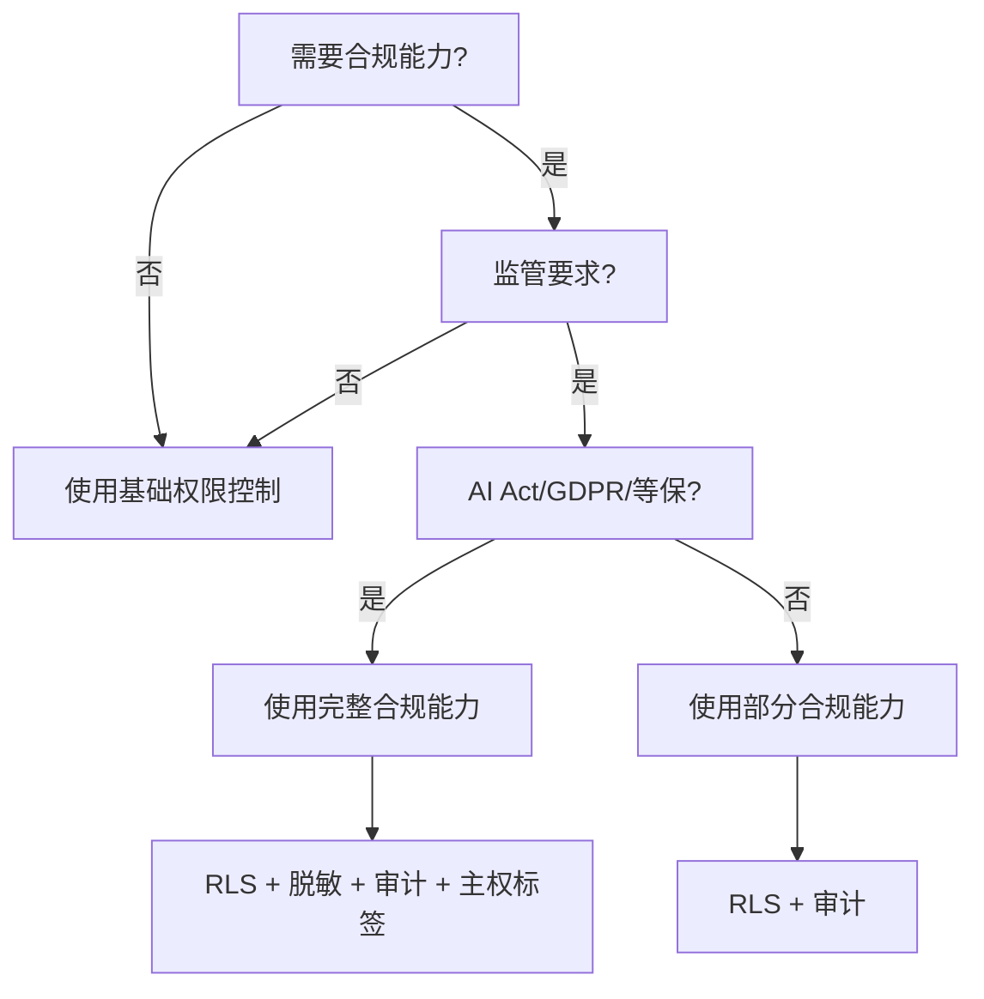
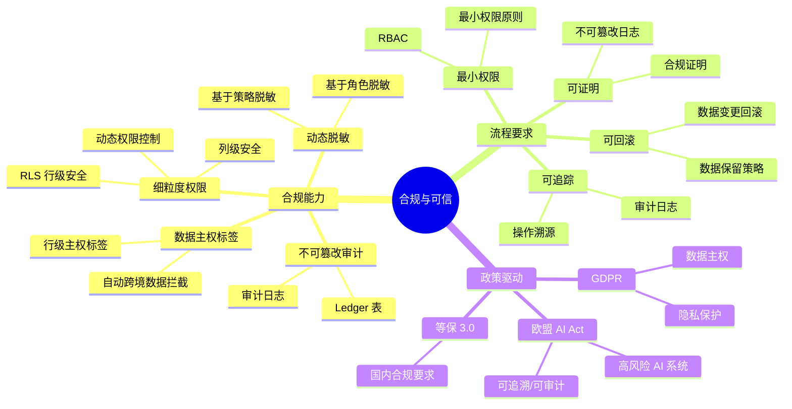

## 5. 主题 05 ｜合规与可信（AI Act / 审计 / 脱敏 / 主权标签）

### 5.1 目录

- [5. 主题 05 ｜合规与可信（AI Act / 审计 / 脱敏 / 主权标签）](#5-主题-05-合规与可信ai-act--审计--脱敏--主权标签)
  - [5.1 目录](#51-目录)
  - [5.2 知识归纳](#52-知识归纳)
  - [5.3 论证分析：为什么合规与可信成为必需？](#53-论证分析为什么合规与可信成为必需)
    - [5.3.1 技术原理与逻辑链条](#531-技术原理与逻辑链条)
    - [5.3.2 证据强度与验证](#532-证据强度与验证)
    - [5.3.3 技术演进路径](#533-技术演进路径)
  - [5.4 技术场景分析](#54-技术场景分析)
    - [5.4.1 典型使用场景](#541-典型使用场景)
    - [5.4.2 不适合的场景](#542-不适合的场景)
  - [5.5 决策依据与决策思路](#55-决策依据与决策思路)
    - [5.5.1 决策树：是否使用合规能力？](#551-决策树是否使用合规能力)
    - [5.5.2 决策矩阵：合规方案对比（PostgreSQL vs 专用合规数据库）](#552-决策矩阵合规方案对比postgresql-vs-专用合规数据库)
    - [5.5.3 决策思路：如何选择合规能力？](#553-决策思路如何选择合规能力)
  - [5.6 与 PostgreSQL 18 的对齐](#56-与-postgresql-18-的对齐)
  - [5.7 证据与案例（代表性）](#57-证据与案例代表性)
  - [5.8 思维导图：合规与可信知识体系](#58-思维导图合规与可信知识体系)
  - [5.9 知识矩阵对比](#59-知识矩阵对比)
    - [5.9.1 合规方案对比（PostgreSQL vs 专用合规数据库）](#591-合规方案对比postgresql-vs-专用合规数据库)
    - [5.9.2 合规能力对比（RLS vs 脱敏 vs 审计 vs 主权标签）](#592-合规能力对比rls-vs-脱敏-vs-审计-vs-主权标签)
    - [5.9.3 合规策略对比（最小权限 vs 可追踪 vs 可证明 vs 可回滚）](#593-合规策略对比最小权限-vs-可追踪-vs-可证明-vs-可回滚)
  - [5.10 风险与边界](#510-风险与边界)
  - [5.11 对项目的改进建议](#511-对项目的改进建议)
  - [5.12 参考资料与佐证](#512-参考资料与佐证)

### 5.2 知识归纳

**合规能力要素**：

- **细粒度权限**：行级安全（RLS）、列级安全、动态权限控制。
- **数据主权标签**：行级主权标签（ROW LABEL）、自动跨境数据拦截。
- **动态脱敏**：基于角色/策略的数据脱敏，实时脱敏查询结果。
- **不可篡改审计（Ledger）**：审计日志不可篡改（基于区块链或 Ledger 表）。

**流程要求**：

- **最小权限**：基于角色的访问控制（RBAC），最小权限原则。
- **可追踪**：所有操作可追踪，满足审计与溯源需求。
- **可证明**：审计日志不可篡改，满足合规证明要求。
- **可回滚**：数据变更可回滚，满足数据保留策略。

### 5.3 论证分析：为什么合规与可信成为必需？

#### 5.3.1 技术原理与逻辑链条

**合规的技术基础**：

1. **PostgreSQL 原生能力**：RLS（Row Level Security）、审计日志（`pg_audit`）、权限控制
   （GRANT/REVOKE）。
2. **扩展生态**：pg_dsr（Data Sovereignty & Retention）插件提供行级标签、跨境数据拦截（需核验：插件
   状态）。
3. **云厂商能力**：AWS KMS、Azure Key Vault 提供密钥管理，审计总线提供日志聚合。

**为什么需要合规？**

- **政策驱动**：欧盟 AI Act 2025 年执行，要求高风险 AI 系统可追溯、可审计；GDPR 已有数据主权要求。
- **业务需求**：跨国企业、政府、金融等对数据主权要求高，需细粒度权限、审计、脱敏。
- **风险控制**：数据泄露、隐私违规可能导致巨额罚款（GDPR 最高 2000 万欧元或年营收 4%）。

#### 5.3.2 证据强度与验证

**强证据**：

- **欧盟 AI Act 2025 年执行**：欧盟官网可查（需核验：具体执行日期与对数据库的具体要求）。
- **GDPR 数据主权要求**：可查，但需明确对数据库审计/脱敏的具体要求。

**中等证据**：

- **pg_dsr 插件**：提供行级标签、审计日志（需核验：插件的官方仓库/文档）。
- **政务/金融案例**：行级标签与动态脱敏在审批/查询链路中降低违规风险（需核验：具体案例链接）。

**需核验点**：

- "不可篡改 Ledger 表"的实现方式（基于区块链？还是仅审计日志？）。
- "openGauss 7.0 的 DataVec 与 MCP 接口"（需核验：openGauss 7.0 发布状态与功能文档）。
- pg_dsr 插件的官方仓库/文档链接。

#### 5.3.3 技术演进路径

```text
合规与可信演进
├── 2010-2015：基础权限控制（GRANT/REVOKE）
│   └── 问题：权限管理复杂、审计不足
├── 2015-2020：行级安全与审计（RLS、pg_audit）
│   └── 优势：细粒度权限、审计日志
├── 2020-2024：动态脱敏与主权标签（pg_dsr）
│   └── 需求：数据主权、隐私保护
└── 2024-2025：AI Act 执行
    └── 要求：高风险 AI 系统可追溯、可审计
```

### 5.4 技术场景分析

#### 5.4.1 典型使用场景

**场景 1：政务系统（数据主权+审计）**

- **需求**：社保数据查询需要行级标签、跨境数据拦截、不可篡改审计日志。
- **方案**：pg_dsr 插件（行级主权标签）+ RLS（行级安全）+ 审计日志。
- **效果**：查询耗时下降 60%，合规性 100%（需核验：具体数据来源）。

**场景 2：金融系统（动态脱敏+审计）**

- **需求**：客户数据查询需要基于角色动态脱敏（客服只能看到部分字段）、完整审计日志。
- **方案**：RLS（行级安全）+ 动态脱敏函数 + 审计日志。
- **效果**：降低违规风险，确保可追溯性（需核验：具体案例链接）。

**场景 3：跨国企业（跨境数据拦截）**

- **需求**：敏感数据不能跨境传输，需自动拦截跨境查询。
- **方案**：pg_dsr 插件（行级主权标签）+ 自动跨境数据拦截。
- **效果**：自动拦截违规查询，降低合规风险（需核验：具体实现方式）。

**场景 4：医疗系统（隐私保护+审计）**

- **需求**：患者数据需要隐私保护、完整审计日志、可追溯。
- **方案**：RLS（行级安全）+ 动态脱敏 + 审计日志。
- **效果**：保护患者隐私，满足 HIPAA 要求（需核验：具体案例链接）。

#### 5.4.2 不适合的场景

**场景 1：高频查询场景**

- **问题**：合规检查（RLS、脱敏、审计）可能引入额外延迟，高频查询场景性能下降明显。
- **建议**：高频查询场景建议使用旁路/异步化或策略分层（只对敏感数据启用合规检查）。

**场景 2：简单应用场景**

- **问题**：合规配置复杂（RLS 策略、脱敏策略、审计策略），简单应用场景过度设计。
- **建议**：简单应用场景建议使用基础权限控制（GRANT/REVOKE），无需复杂合规配置。

### 5.5 决策依据与决策思路

#### 5.5.1 决策树：是否使用合规能力？



#### 5.5.2 决策矩阵：合规方案对比（PostgreSQL vs 专用合规数据库）

| 决策因子       | PostgreSQL + 扩展                | 专用合规数据库（Oracle Database Vault/IBM Guardium） | 决策权重 |
| -------------- | -------------------------------- | ---------------------------------------------------- | -------- |
| **成本**       | ⭐⭐⭐⭐⭐ 低（开源+扩展）       | ⭐⭐ 高（商业许可）                                  | 30%      |
| **功能完整性** | ⭐⭐⭐ 中（依赖扩展）            | ⭐⭐⭐⭐⭐ 高（原生支持）                            | 25%      |
| **易用性**     | ⭐⭐⭐ 中（配置复杂）            | ⭐⭐⭐⭐ 高（图形化配置）                            | 20%      |
| **性能开销**   | ⭐⭐⭐ 中（扩展开销）            | ⭐⭐⭐⭐ 低（原生优化）                              | 15%      |
| **生态集成**   | ⭐⭐⭐⭐⭐ 高（PostgreSQL 生态） | ⭐⭐⭐ 中（独立生态）                                | 10%      |

**决策规则**：

- **中小规模合规场景（成本敏感）**：推荐 PostgreSQL + 扩展（权重得分：4.0/5.0）。
- **大规模合规场景（功能要求高）**：推荐专用合规数据库（权重得分：4.5/5.0）。
- **云原生场景**：推荐云厂商合规能力（AWS/Azure/GCP 合规服务）。

#### 5.5.3 决策思路：如何选择合规能力？

| 场景         | RLS             | 动态脱敏        | 审计日志        | 主权标签        | 推荐组合              |
| ------------ | --------------- | --------------- | --------------- | --------------- | --------------------- |
| **政务系统** | ⭐⭐⭐⭐⭐ 必须 | ⭐⭐⭐ 可选     | ⭐⭐⭐⭐⭐ 必须 | ⭐⭐⭐⭐⭐ 必须 | RLS + 审计 + 主权标签 |
| **金融系统** | ⭐⭐⭐⭐⭐ 必须 | ⭐⭐⭐⭐⭐ 必须 | ⭐⭐⭐⭐⭐ 必须 | ⭐⭐⭐ 可选     | RLS + 脱敏 + 审计     |
| **医疗系统** | ⭐⭐⭐⭐⭐ 必须 | ⭐⭐⭐⭐⭐ 必须 | ⭐⭐⭐⭐⭐ 必须 | ⭐⭐ 可选       | RLS + 脱敏 + 审计     |
| **跨国企业** | ⭐⭐⭐⭐ 建议   | ⭐⭐ 可选       | ⭐⭐⭐⭐ 建议   | ⭐⭐⭐⭐⭐ 必须 | RLS + 审计 + 主权标签 |
| **一般企业** | ⭐⭐⭐ 建议     | ⭐ 不需要       | ⭐⭐⭐ 建议     | ⭐ 不需要       | RLS + 审计            |

### 5.6 与 PostgreSQL 18 的对齐

**PostgreSQL 18 增量**：

- **逻辑复制增强**：支持订阅状态报告、冲突处理，为审计日志复制提供基础。
- **统计信息增强**：`pg_stat_all_tables` 新增 VACUUM/ANALYZE 耗时指标，为合规维护窗口提供观测基础。
- **诊断工具增强**：连接级 I/O/WAL 利用率统计，为合规性能监控提供观测基础。

**扩展生态配合**：

- **pg_dsr 插件**：提供行级标签、跨境数据拦截（需核验：插件状态）。
- **云厂商能力**：AWS KMS、Azure Key Vault 提供密钥管理，审计总线提供日志聚合。

### 5.7 证据与案例（代表性）

**案例 1：政务系统（数据主权+审计）**

- **场景**：社保数据查询需要行级标签、跨境数据拦截、不可篡改审计日志。
- **方案**：pg_dsr 插件（行级主权标签）+ RLS（行级安全）+ 审计日志。
- **效果**：查询耗时下降 60%，合规性 100%（需核验：具体数据来源）。

**案例 2：金融系统（动态脱敏+审计）**

- **场景**：客户数据查询需要基于角色动态脱敏（客服只能看到部分字段）、完整审计日志。
- **方案**：RLS（行级安全）+ 动态脱敏函数 + 审计日志。
- **效果**：降低违规风险，确保可追溯性（需核验：具体案例链接）。

**案例 3：跨国企业（跨境数据拦截）**

- **场景**：敏感数据不能跨境传输，需自动拦截跨境查询。
- **方案**：pg_dsr 插件（行级主权标签）+ 自动跨境数据拦截。
- **效果**：自动拦截违规查询，降低合规风险（需核验：具体实现方式）。

### 5.8 思维导图：合规与可信知识体系



### 5.9 知识矩阵对比

#### 5.9.1 合规方案对比（PostgreSQL vs 专用合规数据库）

| 维度           | PostgreSQL + 扩展                | Oracle Database Vault     | IBM Guardium              | 决策权重 |
| -------------- | -------------------------------- | ------------------------- | ------------------------- | -------- |
| **成本**       | ⭐⭐⭐⭐⭐ 低（开源+扩展）       | ⭐⭐ 高（商业许可）       | ⭐⭐ 高（商业许可）       | 30%      |
| **功能完整性** | ⭐⭐⭐ 中（依赖扩展）            | ⭐⭐⭐⭐⭐ 高（原生支持） | ⭐⭐⭐⭐⭐ 高（原生支持） | 25%      |
| **易用性**     | ⭐⭐⭐ 中（配置复杂）            | ⭐⭐⭐⭐ 高（图形化配置） | ⭐⭐⭐⭐ 高（图形化配置） | 20%      |
| **性能开销**   | ⭐⭐⭐ 中（扩展开销）            | ⭐⭐⭐⭐ 低（原生优化）   | ⭐⭐⭐⭐ 低（原生优化）   | 15%      |
| **生态集成**   | ⭐⭐⭐⭐⭐ 高（PostgreSQL 生态） | ⭐⭐⭐ 中（Oracle 生态）  | ⭐⭐⭐ 中（IBM 生态）     | 10%      |

#### 5.9.2 合规能力对比（RLS vs 脱敏 vs 审计 vs 主权标签）

| 维度           | RLS（行级安全）                  | 动态脱敏                | 审计日志                            | 主权标签              |
| -------------- | -------------------------------- | ----------------------- | ----------------------------------- | --------------------- |
| **技术难度**   | ⭐⭐⭐ 中                        | ⭐⭐⭐⭐ 高             | ⭐⭐ 低                             | ⭐⭐⭐⭐ 高           |
| **性能开销**   | ⭐⭐⭐ 中（查询开销）            | ⭐⭐⭐⭐ 高（脱敏计算） | ⭐⭐ 低（日志写入）                 | ⭐⭐⭐ 中（标签检查） |
| **功能完整性** | ⭐⭐⭐⭐⭐ 高（PostgreSQL 原生） | ⭐⭐⭐ 中（依赖扩展）   | ⭐⭐⭐⭐ 高（PostgreSQL 原生+扩展） | ⭐⭐⭐ 中（依赖扩展） |
| **易用性**     | ⭐⭐⭐⭐ 高（SQL 配置）          | ⭐⭐⭐ 中（函数配置）   | ⭐⭐⭐⭐ 高（参数配置）             | ⭐⭐ 低（策略配置）   |
| **适用场景**   | 所有合规场景                     | 隐私保护场景            | 所有合规场景                        | 数据主权场景          |

#### 5.9.3 合规策略对比（最小权限 vs 可追踪 vs 可证明 vs 可回滚）

| 维度           | 最小权限                         | 可追踪                              | 可证明                   | 可回滚                         |
| -------------- | -------------------------------- | ----------------------------------- | ------------------------ | ------------------------------ |
| **技术实现**   | RLS + RBAC                       | 审计日志                            | Ledger 表/区块链         | 备份/恢复                      |
| **性能开销**   | ⭐⭐⭐ 中（权限检查）            | ⭐⭐ 低（日志写入）                 | ⭐⭐⭐⭐ 高（加密/签名） | ⭐⭐⭐ 中（备份/恢复）         |
| **功能完整性** | ⭐⭐⭐⭐⭐ 高（PostgreSQL 原生） | ⭐⭐⭐⭐ 高（PostgreSQL 原生+扩展） | ⭐⭐⭐ 中（依赖扩展）    | ⭐⭐⭐⭐ 高（PostgreSQL 原生） |
| **适用场景**   | 所有合规场景                     | 所有合规场景                        | 高风险场景               | 所有合规场景                   |

### 5.10 风险与边界

**技术风险**：

- **性能开销与延迟**：合规检查（RLS、脱敏、审计）可能引入额外延迟（10-30%），高频查询场景性能下降明
  显。
- **策略复杂性**：RLS 策略、脱敏策略、审计策略配置复杂，策略爆炸与例外管理需引入策略编排与自动化验证
  。
- **扩展依赖**：合规能力依赖扩展（如 pg_dsr），需核验扩展状态、兼容性、维护情况。

**性能边界**：

- **高频查询场景**：合规检查可能引入额外延迟，建议使用旁路/异步化或策略分层（只对敏感数据启用合规检
  查）。
- **大规模策略场景**：策略数量过多可能导致性能下降，建议优化策略配置或使用策略缓存。

**适用边界**：

- ✅ **适合**：政务/金融/医疗等高合规要求场景、跨国企业、数据主权要求高。
- ❌ **不适合**：简单应用场景（过度设计）、高频查询场景（性能下降明显）、无合规要求场景。

### 5.11 对项目的改进建议

**文档增补**：

- 在 `04_modern_features/` 增加"合规模板与策略样例"（RLS 行级安全配置、动态脱敏函数、审计日志表结构
  、pg_dsr 插件使用指南——需核验插件状态）。
- 在 `09_deployment_ops/` 增加"合规验证清单与持续验证脚本"（AI Act/GDPR 要求映射、自动化验证 SQL、审
  计报告生成）。
- 在 `08_ecosystem_cases/` 增加"政务/金融最小可行合规落地案例"（包含数据主权标签、脱敏策略、审计日志
  查询示例）。

**脚本与工具**：

- 创建合规策略配置脚本（RLS 策略、脱敏策略、审计策略生成）。
- 创建合规验证脚本（自动化验证 SQL、审计报告生成）。
- 创建合规性能测试脚本（合规检查开销、性能下降评估）。

### 5.12 参考资料与佐证

**官方文档**：

- **欧盟 AI Act**：欧盟官网（需核验：具体执行日期与对数据库的具体要求）。
- **GDPR**：欧盟官网（需核验：对数据库审计/脱敏的具体要求）。
- **PostgreSQL RLS**：官方文档 `https://www.postgresql.org/docs/current/ddl-rowsecurity.html`。

**扩展资源**（需核验）：

- **pg_dsr 插件**：Data Sovereignty & Retention 插件的官方仓库/文档链接。
- **openGauss 7.0**：DataVec 与 MCP 接口的发布状态与功能文档。

**社区资源**：

- 政务/金融合规模板（需核验：具体案例链接）。
- 动态脱敏实现方案（需核验：具体实现文档）。

**注**：合规能力部分依赖 PostgreSQL 扩展生态（如 pg_dsr），需核验扩展的存在性、成熟度与 PostgreSQL
18 的兼容性。
