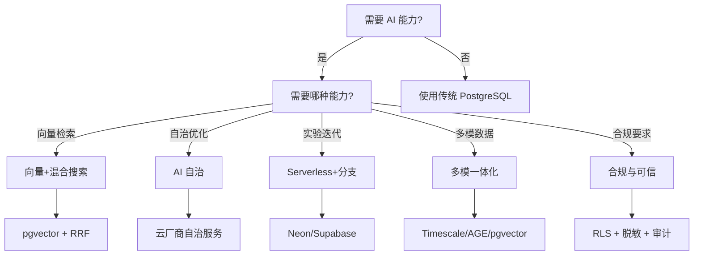

# 7. 知识矩阵总览｜ AI 时代 PostgreSQL 18 技术选型对比

> 本文档整合所有主题（01-05）的知识矩阵对比，提供统一的技术选型决策参考。

## 7.1 目录

- [7.1 目录](#71-目录)
- [7.2 技术选型决策树（总体）](#72-技术选型决策树总体)
- [7.3 主题对比矩阵](#73-主题对比矩阵)
- [7.4 场景决策矩阵](#74-场景决策矩阵)
- [7.5 提供商对比矩阵](#75-提供商对比矩阵)
- [7.6 性能对比矩阵](#76-性能对比矩阵)
- [7.7 成本对比矩阵](#77-成本对比矩阵)
- [7.8 风险对比矩阵](#78-风险对比矩阵)
- [7.9 决策框架](#79-决策框架)

## 7.2 技术选型决策树（总体）

## 7.3 主题对比矩阵

### 7.3.1 五大主题适用场景对比

| 主题                   | 核心能力                  | 主要适用场景                 | 技术成熟度                     | 成本                         | 性能影响                |
| ---------------------- | ------------------------- | ---------------------------- | ------------------------------ | ---------------------------- | ----------------------- |
| **01 向量+混合搜索**   | pgvector + RRF            | RAG、推荐、语义搜索          | ⭐⭐⭐⭐⭐ 成熟                | ⭐⭐⭐⭐ 低                  | ⭐⭐⭐⭐ 低开销         |
| **02 AI 自治**         | 自动索引、计划重写        | 云托管、成本敏感、DBA 稀缺   | ⭐⭐⭐ 中等（主要云厂商）      | ⭐⭐⭐⭐ 低（减少 DBA 成本） | ⭐⭐⭐ 中等（可能抖动） |
| **03 Serverless+分支** | Scale-to-Zero + Branching | AI Agent、实验迭代、开发环境 | ⭐⭐⭐⭐ 成熟（Neon/Supabase） | ⭐⭐⭐⭐⭐ 极低（按需计费）  | ⭐⭐⭐ 中等（冷启动）   |
| **04 多模一体化**      | JSONB+时序+图+向量        | IoT、金融、电商推荐          | ⭐⭐⭐⭐ 成熟（扩展生态）      | ⭐⭐⭐⭐⭐ 低（单一数据库）  | ⭐⭐⭐ 中等（资源竞争） |
| **05 合规与可信**      | RLS+脱敏+审计+主权标签    | 政务、金融、医疗、跨国企业   | ⭐⭐⭐ 中等（依赖扩展）        | ⭐⭐⭐⭐ 低（开源+扩展）     | ⭐⭐ 高（合规开销）     |

### 7.3.2 五大主题决策权重对比

| 场景           | 01 向量    | 02 自治    | 03 Serverless | 04 多模    | 05 合规    | 推荐组合          |
| -------------- | ---------- | ---------- | ------------- | ---------- | ---------- | ----------------- |
| **电商推荐**   | ⭐⭐⭐⭐⭐ | ⭐⭐⭐     | ⭐⭐          | ⭐⭐⭐⭐   | ⭐⭐       | 01 + 04           |
| **RAG 系统**   | ⭐⭐⭐⭐⭐ | ⭐⭐⭐     | ⭐⭐⭐⭐⭐    | ⭐⭐⭐     | ⭐⭐       | 01 + 03           |
| **IoT 监控**   | ⭐⭐⭐⭐   | ⭐⭐⭐     | ⭐⭐          | ⭐⭐⭐⭐⭐ | ⭐⭐       | 04（时序+向量）   |
| **金融反欺诈** | ⭐⭐⭐⭐   | ⭐⭐       | ⭐⭐          | ⭐⭐⭐⭐⭐ | ⭐⭐⭐⭐⭐ | 04（图+向量）+ 05 |
| **政务系统**   | ⭐⭐       | ⭐⭐⭐     | ⭐⭐          | ⭐⭐       | ⭐⭐⭐⭐⭐ | 05                |
| **云托管应用** | ⭐⭐⭐     | ⭐⭐⭐⭐⭐ | ⭐⭐⭐⭐      | ⭐⭐⭐     | ⭐⭐⭐     | 02 + 03           |

## 7.4 场景决策矩阵

### 7.4.1 典型场景技术选型矩阵

| 场景             | 数据模型                              | 查询类型                  | 合规要求      | 推荐技术栈                                      |
| ---------------- | ------------------------------------- | ------------------------- | ------------- | ----------------------------------------------- |
| **电商推荐**     | JSONB（商品属性）+ 向量（商品向量）   | 混合检索（RRF）           | ⭐⭐ 低       | PostgreSQL + pgvector + RRF                     |
| **RAG 系统**     | JSONB（文档元数据）+ 向量（文档向量） | 混合检索（RRF）           | ⭐⭐ 低       | PostgreSQL + pgvector + RRF + Neon 分支         |
| **IoT 异常检测** | 时序（设备数据）+ 向量（设备特征）    | 时序窗口聚合 + 向量相似度 | ⭐⭐ 低       | PostgreSQL + Timescale + pgvector               |
| **金融反欺诈**   | 图（用户关系）+ 向量（用户画像）      | 图邻域扩展 + 向量相似度   | ⭐⭐⭐⭐⭐ 高 | PostgreSQL + Apache AGE + pgvector + RLS + 审计 |
| **政务系统**     | 关系表（社保数据）                    | 行级安全查询              | ⭐⭐⭐⭐⭐ 高 | PostgreSQL + RLS + 动态脱敏 + 审计 + 主权标签   |
| **企业知识库**   | JSONB（文档元数据）+ 向量（文档向量） | 混合检索（RRF）           | ⭐⭐⭐ 中     | PostgreSQL + pgvector + RRF + RLS               |

### 7.4.2 场景复杂度 vs 技术复杂度对比

| 场景复杂度         | 简单场景 | 中等场景       | 复杂场景             | 极复杂场景                       |
| ------------------ | -------- | -------------- | -------------------- | -------------------------------- |
| **技术栈复杂度**   | pgvector | pgvector + RRF | Timescale + pgvector | Timescale + AGE + pgvector + RLS |
| **运维复杂度**     | ⭐⭐ 低  | ⭐⭐⭐ 中      | ⭐⭐⭐⭐ 高          | ⭐⭐⭐⭐⭐ 极高                  |
| **性能优化复杂度** | ⭐⭐ 低  | ⭐⭐⭐ 中      | ⭐⭐⭐⭐ 高          | ⭐⭐⭐⭐⭐ 极高                  |
| **适用场景示例**   | 简单推荐 | 电商搜索       | IoT 异常检测         | 金融反欺诈+合规                  |

## 7.5 提供商对比矩阵

### 7.5.1 云托管提供商能力对比

| 提供商                | 01 向量                                  | 02 自治                   | 03 Serverless+分支   | 04 多模           | 05 合规                       | 综合评分 |
| --------------------- | ---------------------------------------- | ------------------------- | -------------------- | ----------------- | ----------------------------- | -------- |
| **Neon**              | ⭐⭐⭐⭐ 预装 pgvector                   | ⭐⭐ 有限                 | ⭐⭐⭐⭐⭐ 原生分支  | ⭐⭐⭐ 支持扩展   | ⭐⭐⭐ 基础 RLS               | 4.2/5.0  |
| **Supabase**          | ⭐⭐⭐⭐⭐ 预装 pgvector + Hybrid Search | ⭐⭐ 有限                 | ⭐⭐⭐⭐ 支持分支    | ⭐⭐⭐ 支持扩展   | ⭐⭐⭐ 基础 RLS               | 4.3/5.0  |
| **AWS RDS**           | ⭐⭐⭐⭐ 支持 pgvector                   | ⭐⭐⭐⭐ 自动索引推荐     | ⭐⭐⭐ Serverless v2 | ⭐⭐⭐ 支持扩展   | ⭐⭐⭐⭐ AWS KMS/审计         | 4.0/5.0  |
| **Azure Database**    | ⭐⭐⭐⭐ 支持 pgvector                   | ⭐⭐⭐ 自动调优           | ⭐⭐⭐ Serverless    | ⭐⭐⭐ 支持扩展   | ⭐⭐⭐⭐ Azure Key Vault/审计 | 4.0/5.0  |
| **Google Cloud SQL**  | ⭐⭐⭐⭐ 支持 pgvector                   | ⭐⭐⭐ 自动调优           | ⭐⭐ 有限            | ⭐⭐⭐ 支持扩展   | ⭐⭐⭐⭐ Google KMS/审计      | 3.8/5.0  |
| **阿里云 AnalyticDB** | ⭐⭐⭐⭐⭐ 内置 AI 引擎                  | ⭐⭐⭐⭐⭐ 强化学习优化器 | ⭐⭐ 有限            | ⭐⭐⭐⭐ 多模支持 | ⭐⭐⭐⭐ 合规能力             | 4.5/5.0  |

### 7.5.2 自建 vs 托管对比

| 维度           | 自建 PostgreSQL           | Neon/Supabase             | AWS RDS                 | Azure Database          | 阿里云 AnalyticDB        |
| -------------- | ------------------------- | ------------------------- | ----------------------- | ----------------------- | ------------------------ |
| **成本**       | ⭐⭐⭐⭐ 低（无托管费用） | ⭐⭐⭐⭐ 按需计费         | ⭐⭐⭐ 按实例           | ⭐⭐⭐ 按实例           | ⭐⭐⭐ 按实例            |
| **运维成本**   | ⭐⭐ 高（需 DBA）         | ⭐⭐⭐⭐⭐ 低（完全托管） | ⭐⭐⭐⭐ 低（托管）     | ⭐⭐⭐⭐ 低（托管）     | ⭐⭐⭐⭐ 低（托管）      |
| **功能完整性** | ⭐⭐⭐⭐⭐ 高（可自定义） | ⭐⭐⭐⭐ 高（扩展丰富）   | ⭐⭐⭐⭐ 高（扩展支持） | ⭐⭐⭐⭐ 高（扩展支持） | ⭐⭐⭐⭐⭐ 高（AI 能力） |
| **扩展性**     | ⭐⭐⭐⭐⭐ 高（完全控制） | ⭐⭐⭐⭐ 高（Serverless） | ⭐⭐⭐⭐ 高（弹性扩展） | ⭐⭐⭐⭐ 高（弹性扩展） | ⭐⭐⭐⭐⭐ 高（分布式）  |
| **适用场景**   | 大规模/定制需求           | 实验/开发/小规模          | AWS 企业                | Azure 企业              | 国内企业/AI 场景         |

## 7.6 性能对比矩阵

### 7.6.1 向量检索性能对比

| 方案                 | 数据规模 | 向量维度 | P95 延迟 | 召回率 | 构建时间 | 内存占用             |
| -------------------- | -------- | -------- | -------- | ------ | -------- | -------------------- |
| **pgvector HNSW**    | 1 亿     | 768      | < 10ms   | 99%+   | 数小时   | 高（维度 ×1.5-2 倍） |
| **pgvector IVFFlat** | 1 亿     | 768      | < 50ms   | 95-99% | 数十分钟 | 中（维度 ×1.2 倍）   |
| **Milvus HNSW**      | 10 亿+   | 768      | < 5ms    | 99%+   | 数小时   | 高                   |
| **Pinecone**         | 10 亿+   | 768      | < 10ms   | 99%+   | 托管     | 托管                 |

### 7.6.2 混合搜索性能对比

| 方案                       | 场景     | P95 延迟 | 召回率           | NDCG@10       | 转化率提升 |
| -------------------------- | -------- | -------- | ---------------- | ------------- | ---------- |
| **纯向量检索**             | 电商推荐 | < 10ms   | 高（语义相似）   | 中（0.7-0.8） | +20%       |
| **纯全文检索**             | 电商推荐 | < 5ms    | 中（关键词匹配） | 中（0.7-0.8） | +15%       |
| **RRF 融合**               | 电商推荐 | < 15ms   | 高（语义+精确）  | 高（0.8-0.9） | +47%       |
| **Supabase Hybrid Search** | 电商推荐 | < 15ms   | 高（语义+精确）  | 高（0.8-0.9） | +47%       |

### 7.6.3 多模查询性能对比

| 方案               | 场景         | P95 延迟 | 资源占用               | 数据规模 |
| ------------------ | ------------ | -------- | ---------------------- | -------- |
| **JSONB + 向量**   | 电商推荐     | < 20ms   | 中（GIN + HNSW）       | < 1 亿   |
| **时序 + 向量**    | IoT 异常检测 | < 50ms   | 中（Timescale + HNSW） | < 10 亿  |
| **图 + 向量**      | 金融反欺诈   | < 100ms  | 高（AGE + HNSW）       | < 1 亿   |
| **专用数据库组合** | 各场景       | < 10ms   | 低（专用优化）         | > 10 亿  |

## 7.7 成本对比矩阵

### 7.7.1 向量检索成本对比

| 方案                 | 数据规模 | 月成本（USD）             | 成本模型      | 适用场景      |
| -------------------- | -------- | ------------------------- | ------------- | ------------- |
| **pgvector（自建）** | 1 亿     | $500-1000（服务器+运维）  | 固定成本      | 长期稳定负载  |
| **Neon（托管）**     | 1 亿     | $100-300（按需计费）      | Scale-to-Zero | 实验/开发     |
| **Supabase（托管）** | 1 亿     | $150-400（按需计费）      | Scale-to-Zero | 实验/开发     |
| **Milvus（自建）**   | 10 亿+   | $2000-5000（服务器+运维） | 固定成本      | 超大规模      |
| **Pinecone（SaaS）** | 10 亿+   | $3000-10000（按使用量）   | 按使用量      | SaaS 快速上线 |

### 7.7.2 自治优化成本对比

| 方案           | 成本                              | 收益           | ROI | 适用场景 |
| -------------- | --------------------------------- | -------------- | --- | -------- |
| **人工调优**   | 高（DBA 人力成本 $5000-10000/月） | 中（基于经验） | 低  | 小规模   |
| **云厂商自治** | 中（托管费用增加 20-30%）         | 高（自动优化） | 高  | 云托管   |
| **社区版自治** | 低（开源工具，需核验）            | 中（功能有限） | 中  | 自建     |

## 7.8 风险对比矩阵

### 7.8.1 技术风险对比

| 主题                   | 技术风险                | 性能风险                | 运维风险                | 合规风险                | 综合风险 |
| ---------------------- | ----------------------- | ----------------------- | ----------------------- | ----------------------- | -------- |
| **01 向量+混合搜索**   | ⭐⭐ 低（技术成熟）     | ⭐⭐⭐ 中（参数敏感）   | ⭐⭐ 低（运维简单）     | ⭐⭐ 低                 | 中低     |
| **02 AI 自治**         | ⭐⭐⭐⭐ 高（模型偏差） | ⭐⭐⭐ 中（可能抖动）   | ⭐⭐⭐ 中（需监控）     | ⭐⭐ 低                 | 中高     |
| **03 Serverless+分支** | ⭐⭐ 低（技术成熟）     | ⭐⭐⭐ 中（冷启动）     | ⭐⭐⭐ 中（需监控）     | ⭐⭐ 低                 | 中       |
| **04 多模一体化**      | ⭐⭐⭐ 中（资源竞争）   | ⭐⭐⭐⭐ 高（性能抖动） | ⭐⭐⭐⭐ 高（运维复杂） | ⭐⭐ 低                 | 中高     |
| **05 合规与可信**      | ⭐⭐ 低（技术成熟）     | ⭐⭐⭐⭐ 高（性能开销） | ⭐⭐⭐ 中（配置复杂）   | ⭐⭐⭐⭐ 高（合规风险） | 高       |

### 7.8.2 风险缓解策略对比

| 风险类型       | 缓解策略            | 成本           | 效果        | 适用场景   |
| -------------- | ------------------- | -------------- | ----------- | ---------- |
| **参数敏感**   | 自动化参数调优      | 低（工具）     | ⭐⭐⭐⭐ 高 | 向量检索   |
| **性能抖动**   | 阈值保护 + 回滚     | 低（配置）     | ⭐⭐⭐⭐ 高 | AI 自治    |
| **冷启动延迟** | 预热/保活策略       | 中（资源成本） | ⭐⭐⭐⭐ 高 | Serverless |
| **资源竞争**   | 容量规划 + 任务编排 | 中（规划成本） | ⭐⭐⭐ 中   | 多模一体化 |
| **合规开销**   | 策略分层 + 异步化   | 低（配置）     | ⭐⭐⭐ 中   | 合规与可信 |

## 7.9 决策框架

### 7.9.1 综合决策矩阵（多因子权重）

| 场景                     | 成本权重 | 性能权重 | 功能权重 | 运维权重 | 合规权重 | 推荐方案                                  |
| ------------------------ | -------- | -------- | -------- | -------- | -------- | ----------------------------------------- |
| **电商推荐（中小规模）** | 30%      | 30%      | 20%      | 10%      | 10%      | PostgreSQL + pgvector + RRF               |
| **RAG 系统（实验场景）** | 40%      | 20%      | 20%      | 10%      | 10%      | Neon + pgvector + 分支                    |
| **IoT 监控（中等规模）** | 30%      | 30%      | 20%      | 10%      | 10%      | PostgreSQL + Timescale + pgvector         |
| **金融反欺诈（高合规）** | 20%      | 20%      | 20%      | 10%      | 30%      | PostgreSQL + AGE + pgvector + RLS + 审计  |
| **政务系统（高合规）**   | 20%      | 20%      | 10%      | 10%      | 40%      | PostgreSQL + RLS + 脱敏 + 审计 + 主权标签 |

### 7.9.2 快速决策指南

**第一步：明确需求**

- 需要什么 AI 能力？（向量/自治/Serverless/多模/合规）
- 数据规模多大？（< 1 亿 / 1-10 亿 / > 10 亿）
- 合规要求多高？（低 / 中 / 高）
- 成本敏感度？（低 / 中 / 高）

**第二步：选择技术栈**

- **向量检索**：pgvector + RRF（中小规模）或 Milvus/Pinecone（超大规模）
- **自治优化**：云厂商自治服务（云托管）或社区版工具（自建，需核验）
- **Serverless+分支**：Neon/Supabase（实验/开发）或传统方案（生产）
- **多模一体化**：PostgreSQL + Timescale/AGE/pgvector（中小规模）或专用数据库（超大规模）
- **合规与可信**：PostgreSQL + RLS + 扩展（中小规模）或专用合规数据库（大规模）

**第三步：验证与优化**

- 性能测试（P95/P99、召回率、资源占用）
- 成本评估（服务器/托管费用、运维成本）
- 风险评估（技术风险、性能风险、合规风险）
- 持续优化（参数调优、策略优化）

---

**参考**：详细技术选型见各主题文件（01-05），决策框架见 `06_改进与完善计划.md`。
