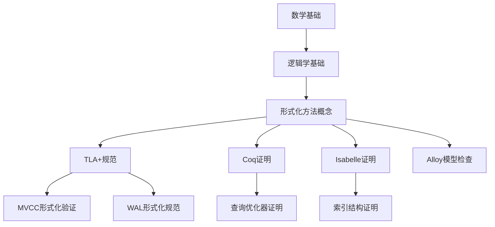
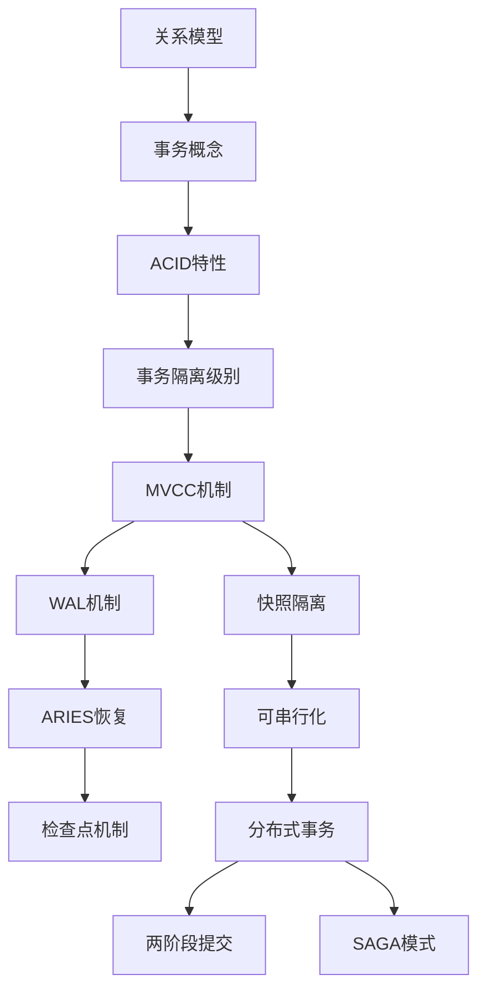
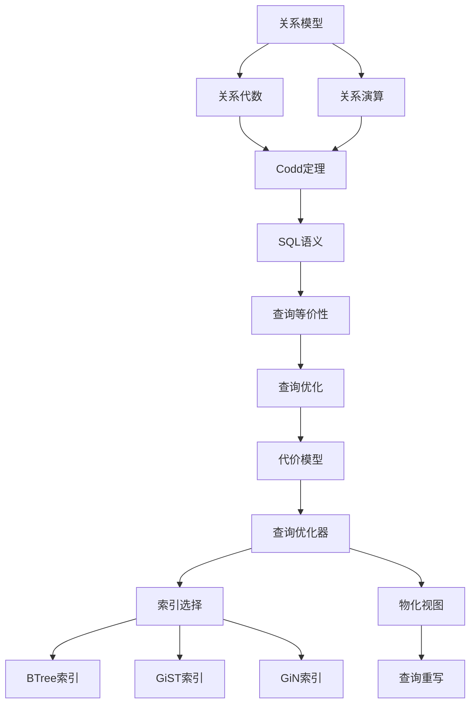
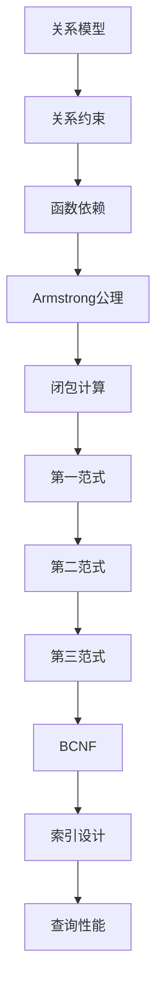
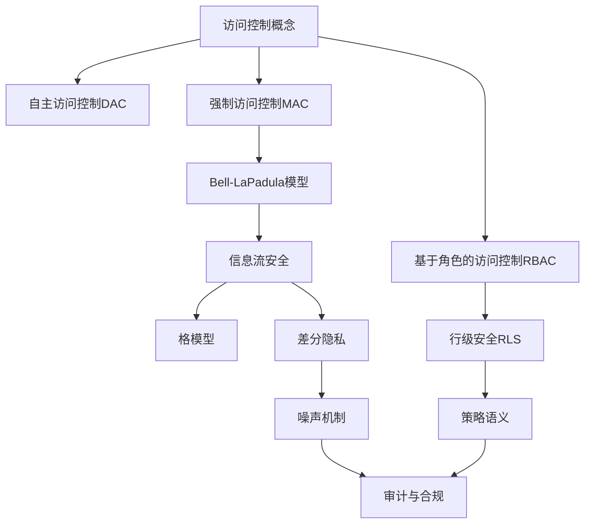
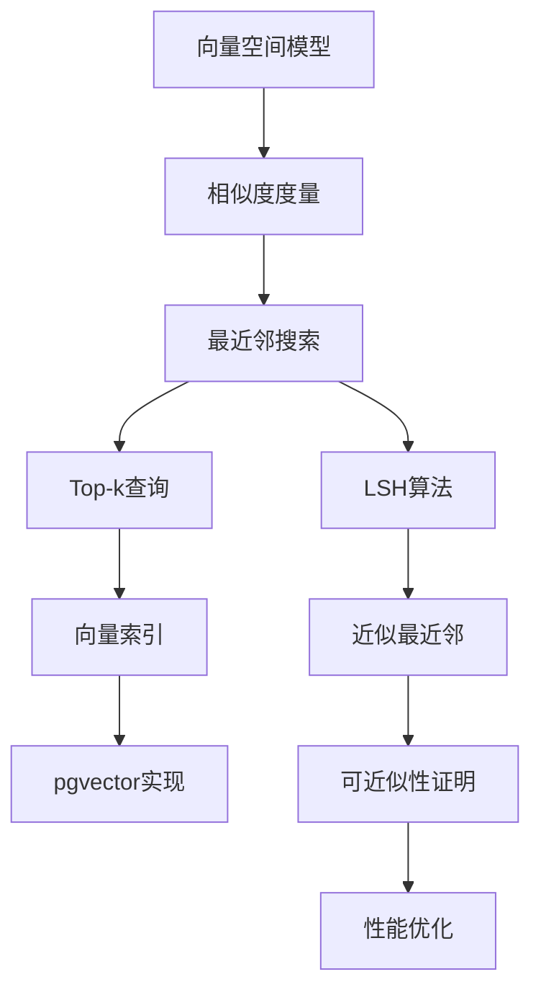

# 知识依赖关系图

> **创建日期**: 2025-01-16
> **状态**: ✅ 完成
> **目标**: 建立完整的知识依赖关系和前置知识体系

---

## 📊 知识依赖关系总览

### 依赖关系类型

1. **强依赖**: 必须掌握前置知识才能理解
2. **弱依赖**: 建议掌握前置知识，但不强制
3. **参考依赖**: 有助于理解，但不是必需的

---

## 🔗 核心知识依赖关系

### 1. 形式化方法基础依赖链



**依赖说明**:

- **强依赖**: 数学基础 → 逻辑学基础 → 形式化方法概念
- **强依赖**: 形式化方法概念 → TLA+/Coq/Isabelle/Alloy
- **强依赖**: TLA+ → MVCC形式化验证、WAL形式化规范

---

### 2. 事务处理依赖链



**依赖说明**:

- **强依赖**: 关系模型 → 事务概念 → ACID特性
- **强依赖**: ACID特性 → 事务隔离级别 → MVCC机制
- **强依赖**: MVCC机制 → WAL机制 → ARIES恢复
- **强依赖**: 可串行化 → 分布式事务 → 两阶段提交

---

### 3. 查询处理依赖链



**依赖说明**:

- **强依赖**: 关系模型 → 关系代数/关系演算 → Codd定理
- **强依赖**: Codd定理 → SQL语义 → 查询等价性
- **强依赖**: 查询等价性 → 查询优化 → 代价模型
- **强依赖**: 代价模型 → 查询优化器 → 索引选择

---

### 4. 数据模型依赖链



**依赖说明**:

- **强依赖**: 关系模型 → 关系约束 → 函数依赖
- **强依赖**: 函数依赖 → Armstrong公理 → 闭包计算
- **强依赖**: 闭包计算 → 第一范式 → 第二范式 → 第三范式 → BCNF
- **强依赖**: BCNF → 索引设计 → 查询性能

---

### 5. 安全与合规依赖链



**依赖说明**:

- **强依赖**: 访问控制概念 → DAC/MAC/RBAC
- **强依赖**: MAC → Bell-LaPadula模型 → 信息流安全
- **强依赖**: RBAC → 行级安全RLS → 策略语义
- **强依赖**: 信息流安全 → 差分隐私 → 噪声机制

---

### 6. 向量检索依赖链



**依赖说明**:

- **强依赖**: 向量空间模型 → 相似度度量 → 最近邻搜索
- **强依赖**: 最近邻搜索 → Top-k查询 → 向量索引
- **强依赖**: 最近邻搜索 → LSH算法 → 近似最近邻
- **强依赖**: 近似最近邻 → 可近似性证明 → 性能优化

---

## 📚 知识层次与前置依赖

### 基础层（Level 1）- 入门必备

**前置知识**: 无

**核心文档**:

1. 08.02-关系代数与关系演算-科德定理与可表达性
   - **前置**: 无
   - **核心**: 关系模型、关系代数、关系演算、Codd定理

2. 09.01-关系约束与规范化-函数依赖与范式证明
   - **前置**: 关系模型（来自08.02）
   - **核心**: 函数依赖、Armstrong公理、范式

3. 01.01-形式化验证方法
   - **前置**: 数学基础、逻辑学基础
   - **核心**: TLA+、Coq、Isabelle、Alloy

**学习时间**: 3-4周

---

### 中级层（Level 2）- 核心理论

**前置知识**: 基础层

**核心文档**:

1. 03.01-MVCC高级分析与形式证明
   - **前置**: 形式化验证方法（01.01）、关系模型（08.02）
   - **核心**: MVCC机制、快照隔离、形式化证明

2. 05.01-代价模型与优化器-等价重写与最优性
   - **前置**: 关系代数（08.02）、查询语义（01.06）
   - **核心**: 代价模型、查询优化器、等价重写

3. 06.01-TLA+-事务与WAL-规范纲要
   - **前置**: 形式化验证方法（01.01）、MVCC（03.01）
   - **核心**: WAL机制、TLA+规范、事务恢复

**学习时间**: 4-6周

---

### 高级层（Level 3）- 前沿研究

**前置知识**: 中级层

**核心文档**:

1. 04.02-分布式一致性与CAP-形式化刻画与权衡
   - **前置**: MVCC（03.01）、事务隔离（03.03）
   - **核心**: CAP定理、分布式一致性、形式化刻画

2. 06.03-ARIES日志恢复-正确性与不变式
   - **前置**: WAL（06.01）、事务恢复（06.01）
   - **核心**: ARIES算法、恢复正确性、不变式证明

3. 07.04-数据库安全模型-访问控制与信息流安全的形式化
   - **前置**: 访问控制基础、形式化方法（01.01）
   - **核心**: RBAC、MAC、信息流安全、形式化证明

4. 11.01-向量检索与Top-k-数学模型与可近似性证明
   - **前置**: 查询优化（05.01）、索引结构（05.02）
   - **核心**: 向量检索、Top-k查询、可近似性证明

**学习时间**: 6-8周

---

## 🎯 学习路径依赖关系

### 路径1：事务处理路径依赖

```text
Level 1: 形式化验证方法（01.01）
    ↓
Level 2: MVCC高级分析（03.01）
    ↓
Level 2: 事务隔离与MVCC（03.03）
    ↓
Level 2: TLA+-事务与WAL（06.01）
    ↓
Level 3: ARIES日志恢复（06.03）
    ↓
Level 3: 分布式一致性与CAP（04.02）
```

**总学习时间**: 12-16周

---

### 路径2：查询处理路径依赖

```text
Level 1: 关系约束与规范化（09.01）
    ↓
Level 1: 关系代数与关系演算（08.02）
    ↓
Level 1: 查询语言的形式语义（01.06）
    ↓
Level 2: 代价模型与优化器（05.01）
    ↓
Level 2: 索引结构正确性（05.02）
    ↓
Level 2: 数据库性能调优（05.15）
```

**总学习时间**: 10-14周

---

### 路径3：安全与合规路径依赖

```text
Level 1: 形式化验证方法（01.01）
    ↓
Level 2: 数据库安全模型（07.04）
    ↓
Level 2: 行级安全-RLS（07.03）
    ↓
Level 3: 安全策略与非干扰（07.01）
    ↓
Level 3: 差分隐私（07.02）
    ↓
Level 3: 数据库审计与合规（07.05）
```

**总学习时间**: 10-14周

---

## 📋 依赖关系矩阵

### 文档间依赖关系

| 文档 | 依赖文档 | 依赖类型 | 依赖强度 |
|------|---------|---------|---------|
| **03.01-MVCC** | 01.01-形式化验证方法 | 理论依赖 | 强 |
| **03.01-MVCC** | 08.02-关系代数 | 概念依赖 | 弱 |
| **05.01-优化器** | 08.02-关系代数 | 理论依赖 | 强 |
| **05.01-优化器** | 01.06-查询语义 | 理论依赖 | 强 |
| **06.01-WAL** | 01.01-形式化验证方法 | 理论依赖 | 强 |
| **06.01-WAL** | 03.01-MVCC | 概念依赖 | 弱 |
| **06.03-ARIES** | 06.01-WAL | 实现依赖 | 强 |
| **04.02-CAP** | 03.01-MVCC | 理论依赖 | 强 |
| **07.04-安全模型** | 01.01-形式化验证方法 | 理论依赖 | 强 |
| **11.01-向量检索** | 05.01-优化器 | 应用依赖 | 弱 |
| **11.01-向量检索** | 05.02-索引结构 | 实现依赖 | 强 |

---

## 🎓 学习建议

### 初学者路径

**建议顺序**:

1. 先学习基础层（Level 1）的所有文档
2. 然后选择一条路径深入学习
3. 最后学习其他路径作为扩展

**时间安排**:

- 基础层：3-4周
- 选择路径：4-6周
- 扩展学习：4-6周
- **总计**: 11-16周

---

### 进阶路径

**建议顺序**:

1. 快速复习基础层（1周）
2. 深入学习中级层（4-6周）
3. 选择2-3条路径深入学习（8-12周）
4. 学习高级层（6-8周）

**时间安排**:

- **总计**: 19-27周

---

### 专家路径

**建议顺序**:

1. 快速浏览所有文档（2周）
2. 深入研究感兴趣的领域（8-12周）
3. 阅读最新研究论文（持续）
4. 参与实际项目（持续）

**时间安排**:

- **总计**: 10-14周（基础）+ 持续学习

---

## ✅ 总结

知识依赖关系图已建立，包括：

- ✅ 6条核心知识依赖链
- ✅ 3层知识层次结构
- ✅ 3条学习路径依赖关系
- ✅ 文档间依赖关系矩阵
- ✅ 学习建议和时间安排

**下一步**: 创建详细的学习路径文档。

---

**最后更新**: 2025-01-16
**维护者**: Documentation Team
**状态**: ✅ 完成
