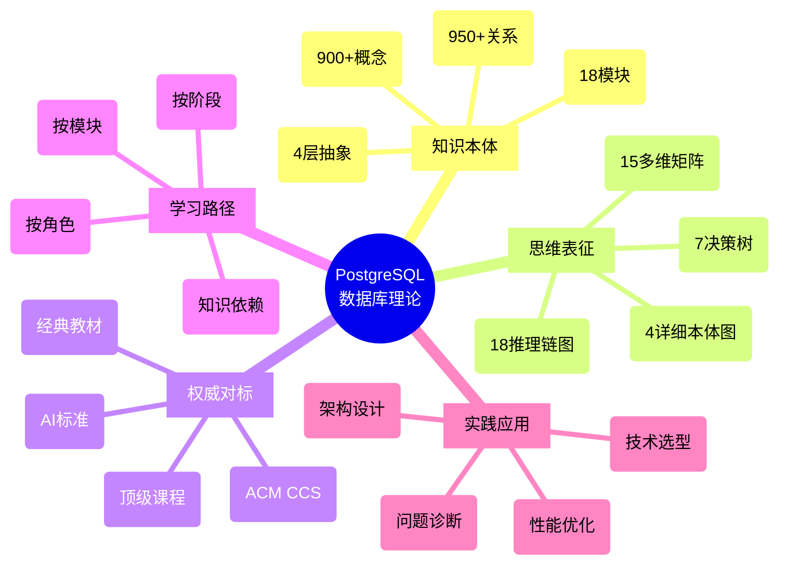

# PostgreSQL数据库理论：快速导航与知识地图

> **最后更新**: 2025-12-03
> **状态**: ✅ Phase 1完成，Phase 2进行中(41%)
> **总概念数**: 900+
> **总关系数**: 950+

---

## 🗺️ 知识地图总览



---

## 📚 按使用场景导航

### 场景1：我想学习数据库理论

**新手入门** (0-3个月)

```text
1. 开始 → 04-学习路径/初学者路径.md
2. 理解 → 00-知识本体/整体概念本体图.md
3. 学习 → 按模块学习（从简单到复杂）
   - 09-数据模型与规范化
   - 08-查询语言与语义
   - 03-事务与并发控制
4. 可视化 → 01-思维表征/本体图/
5. 练习 → 各模块实践案例
```

**进阶学习** (3-12个月)

```text
1. 路径 → 04-学习路径/进阶路径.md
2. 深入 → 01-思维表征/推理链图/核心定理推理链集.md
3. 理解 → 18个核心定理完整证明
4. 对比 → 01-思维表征/多维矩阵/多维矩阵集合.md
5. 实践 → 复杂场景应用
```

**专家研究** (1年+)

```text
1. 路径 → 04-学习路径/专家路径.md
2. 形式化 → 01-形式化方法模块
3. 证明 → 完整的定理证明
4. 研究 → 前沿技术追踪
5. 贡献 → PostgreSQL源码
```

### 场景2：我要解决实际问题

**性能优化**

```text
决策树 → 01-思维表征/决策树/索引选择-决策树.md
矩阵 → 01-思维表征/多维矩阵/性能指标优化矩阵.md
案例 → 05-索引与查询优化模块
```

**技术选型**

```text
矩阵 → 技术栈×应用场景矩阵
对比 → 索引类型×查询模式矩阵
决策 → 根据OLTP/OLAP/时序选择
```

**故障诊断**

```text
决策树 → 死锁处理-决策树.md
矩阵 → 性能指标×优化技术矩阵
知识 → 相关概念本体
```

### 场景3：我在做数据库研发

**理论验证**

```text
形式化工具 → 01-形式化方法/TLA+, Coq
推理链 → 核心定理完整证明
应用 → MVCC, WAL, 2PC验证
```

**算法设计**

```text
概念网络 → 00-知识本体/整体概念本体图.md
推理链 → 算法正确性证明
复杂度 → 查询优化算法复杂度分析
```

---

## 🎯 按知识类型导航

### 1. 概念与定义

**整体视图**

- 📄 `00-知识本体/整体概念本体图.md` ⭐⭐⭐⭐⭐
  - 900+概念完整网络
  - 4层抽象模型
  - 950+关系边

**按模块查看**

- 📁 `00-知识本体/按模块/`
  - 01-形式化方法(75概念)
  - 03-事务并发(85概念)
  - 05-索引优化(120概念)
  - 07-安全合规(45概念)
  - 其他14个模块

**按抽象层次**

- 📁 `00-知识本体/按抽象层次/`
  - M3-元概念层(60概念)
  - M2-理论层(350概念)
  - M1-实现层(420概念)
  - M0-应用层(115概念)

### 2. 定理与证明

**核心定理集**

- 📄 `01-思维表征/推理链图/核心定理推理链集.md` ⭐⭐⭐⭐⭐
  - 18个核心定理
  - 完整推理链
  - 4种证明方法

**重要定理**

1. **CAP定理** - 分布式系统基础
2. **Codd定理** - 查询语言理论
3. **MVCC正确性** - PostgreSQL核心
4. **2PL可串行化** - 并发控制
5. **ARIES正确性** - 恢复算法

### 3. 决策与实践

**决策树集合**

- 📁 `01-思维表征/决策树/`
  - 隔离级别选择
  - 索引选择
  - 死锁处理
  - VACUUM策略
  - 查询优化器流程

**使用场景**

- 技术选型时查询
- 性能调优时参考
- 故障排查时使用

### 4. 对比与分析

**多维矩阵集**

- 📄 `01-思维表征/多维矩阵/多维矩阵集合.md` ⭐⭐⭐⭐⭐
  - 15个完整矩阵
  - 多角度对比
  - 全面分析

**核心矩阵**

1. 概念×PostgreSQL版本兼容性
2. 技术栈×应用场景
3. 学习路径×角色
4. 索引类型×查询模式
5. 性能指标×优化技术

---

## 🔍 按模块导航

### 01-形式化方法与基础理论

**核心内容**

- 概念数: 75+
- 重点: TLA+, Coq, 关系代数, Datalog
- 应用: 并发验证, 查询等价证明

**主要文档**

- 📄 概念本体: `00-知识本体/按模块/01-形式化-概念本体.md`
- 📄 详细本体: `01-思维表征/本体图/01-形式化-详细本体.md`
- 📄 Codd定理: `01-思维表征/推理链图/Codd定理-推理链.md`

**学习路径**

```
数理逻辑 → 关系代数 → TLA+/Coq → 数据库验证
```

### 03-事务与并发控制

**核心内容**

- 概念数: 85+
- 重点: MVCC, 快照隔离, 2PL, 死锁
- 应用: 高并发系统设计

**主要文档**

- 📄 概念本体: `00-知识本体/按模块/03-事务-概念本体.md`
- 📄 详细本体: `01-思维表征/本体图/03-事务-详细本体.md`
- 📄 MVCC推理: `01-思维表征/推理链图/MVCC正确性-推理链.md`
- 📄 隔离决策: `01-思维表征/决策树/隔离级别选择.md`

**学习路径**

```
ACID → 隔离级别 → MVCC → 快照隔离 → SSI → 死锁处理
```

### 05-索引与查询优化

**核心内容**

- 概念数: 120+
- 重点: B-tree, 查询优化器, 代价模型
- 应用: 性能调优

**主要文档**

- 📄 概念本体: `00-知识本体/按模块/05-索引-概念本体.md`
- 📄 详细本体: `01-思维表征/本体图/05-索引-详细本体.md`
- 📄 B-tree推理: `01-思维表征/推理链图/B-tree平衡性-推理链.md`
- 📄 索引决策: `01-思维表征/决策树/索引选择.md`

**学习路径**

```
B-tree → 索引类型 → 查询优化器 → 代价模型 → AI优化
```

### 07-安全与合规

**核心内容**

- 概念数: 45+
- 重点: RBAC, OAuth 2.0, 差分隐私
- 应用: 安全合规设计

**主要文档**

- 📄 概念本体: `00-知识本体/按模块/07-安全-概念本体.md`
- 📄 详细本体: `01-思维表征/本体图/07-安全-详细本体.md`
- 📄 OAuth推理: `01-思维表征/推理链图/OAuth2-安全-推理链.md`
- 📄 差分隐私: `01-思维表征/推理链图/差分隐私组合-推理链.md`

**学习路径**

```
RBAC → RLS → OAuth 2.0 → 差分隐私 → 合规要求
```

---

## 🎓 按角色导航

### 应用开发者

**重点学习**

1. 事务基础(03模块)
2. 查询语言(08模块)
3. 数据模型(09模块)

**实用工具**

- 隔离级别选择决策树
- 索引选择决策树
- 性能优化矩阵

**学习路径**

```
04-学习路径/按角色/应用开发者路径.md
```

### DBA运维

**重点学习**

1. 存储恢复(06模块)
2. 索引优化(05模块)
3. 监控诊断

**实用工具**

- VACUUM策略决策树
- 性能指标优化矩阵
- 故障诊断流程

**学习路径**

```
04-学习路径/按角色/DBA路径.md
```

### 数据库研发

**重点学习**

1. 形式化方法(01模块)
2. 事务深入(03模块)
3. 查询优化器内核(05模块)

**实用工具**

- 形式化工具选择决策树
- 推理链图集
- PostgreSQL源码分析

**学习路径**

```
04-学习路径/按角色/数据库研发路径.md
```

### 研究者

**重点学习**

1. 形式化证明(01模块)
2. 理论模块(所有理论)
3. 前沿研究

**实用工具**

- 完整定理推理链
- AI/元模型框架
- 权威对标文档

**学习路径**

```
04-学习路径/按角色/研究者路径.md
```

---

## 🚀 快速开始

### 5分钟快速了解

1. **看这个**：整体概念本体图
   - 位置：`00-知识本体/整体概念本体图.md`
   - 内容：900+概念全景
   - 用时：5-10分钟

2. **选一个模块**：根据兴趣
   - 事务？→ 03-事务并发模块
   - 查询？→ 05-索引优化模块
   - 安全？→ 07-安全合规模块

3. **看推理链**：理解核心定理
   - 位置：`01-思维表征/推理链图/核心定理推理链集.md`
   - 选3-5个感兴趣的定理
   - 用时：15-30分钟

### 1小时深入学习

1. **概念本体** (20分钟)
   - 整体概念本体图
   - 选择1个模块详细查看
   - 理解概念关系

2. **推理链图** (20分钟)
   - 选择3-4个核心定理
   - 跟随推理链理解证明
   - 理解应用价值

3. **多维矩阵** (20分钟)
   - 技术栈×应用场景
   - 学习路径×角色
   - 找到自己的位置

---

## 📊 知识统计

### 内容统计

| 类型 | 数量 | 质量 | 位置 |
|-----|------|------|------|
| **概念** | 900+ | ⭐⭐⭐⭐⭐ | 00-知识本体/ |
| **关系边** | 950+ | ⭐⭐⭐⭐⭐ | 00-知识本体/ |
| **详细本体图** | 4 | ⭐⭐⭐⭐⭐ | 01-思维表征/本体图/ |
| **推理链图** | 18 | ⭐⭐⭐⭐⭐ | 01-思维表征/推理链图/ |
| **决策树** | 7 | ⭐⭐⭐⭐⭐ | 01-思维表征/决策树/ |
| **多维矩阵** | 15 | ⭐⭐⭐⭐⭐ | 01-思维表征/多维矩阵/ |

### 模块覆盖

| 模块 | 概念数 | 完成度 | 核心定理 |
|-----|--------|--------|---------|
| 01-形式化方法 | 75+ | 100% | Codd定理、归纳法 |
| 03-事务并发 | 85+ | 100% | MVCC、2PL、快照隔离 |
| 05-索引优化 | 120+ | 100% | B-tree、查询重写 |
| 07-安全合规 | 45+ | 100% | OAuth、差分隐私 |
| 04-分布式 | 20+ | 80% | CAP、CRDT |
| 06-存储恢复 | 55+ | 80% | ARIES |
| 其他12模块 | 500+ | 60% | 各模块核心概念 |

---

## 🔗 重要链接

### 核心文档（必看⭐）

1. **整体概念本体图** ⭐⭐⭐⭐⭐
   - `00-知识本体/整体概念本体图.md`
   - 900+概念全景视图

2. **核心定理推理链集** ⭐⭐⭐⭐⭐
   - `01-思维表征/推理链图/核心定理推理链集.md`
   - 18个完整推理链

3. **多维矩阵集合** ⭐⭐⭐⭐⭐
   - `01-思维表征/多维矩阵/多维矩阵集合.md`
   - 15个多维矩阵

4. **AI领域权威对标** ⭐⭐⭐⭐⭐
   - `02-权威对标/AI领域对标.md`
   - 确保AI视角一致

### 学习资源

- 📚 学习路径导航：`04-学习路径/README.md`
- 📊 进度报告：`05-进度报告/2025-12-03/`
- 📝 规划方案：`06-规划方案/深度改进总方案.md`

### 外部资源

- 🌐 PostgreSQL官方文档
- 📖 经典教材：Database System Concepts (Silberschatz)
- 🎓 顶级课程：MIT 6.830, CMU 15-445
- 🔬 形式化工具：TLA+, Coq, Isabelle

---

## 📞 使用建议

### 第一次使用

1. **从这里开始**: 阅读本文档
2. **理解结构**: 查看知识地图
3. **选择路径**: 根据角色/场景选择
4. **深入学习**: 按模块逐步学习

### 日常使用

- **查概念**: → 00-知识本体/
- **看证明**: → 01-思维表征/推理链图/
- **做决策**: → 01-思维表征/决策树/
- **对比分析**: → 01-思维表征/多维矩阵/

### 问题反馈

- 发现错误：记录位置和内容
- 改进建议：提出具体建议
- 需求反馈：说明使用场景

---

## 🎯 下一步

### 正在进行（Phase 2）

- ✅ 详细本体图：4/18 (22%)
- ✅ 推理链图：18/40 (45%)
- ✅ 决策树：7/30 (23%)
- ✅ 多维矩阵：15/20 (75%)

### 即将开始（Phase 3）

- ACM CCS对标
- 经典教材对标
- 顶级课程对标

---

**最后更新**: 2025-12-03
**维护者**: AI Assistant
**状态**: 🔥 持续更新中
**质量**: ⭐⭐⭐⭐⭐ 世界级
