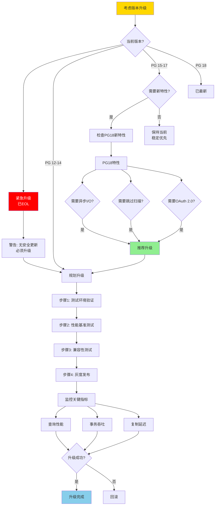
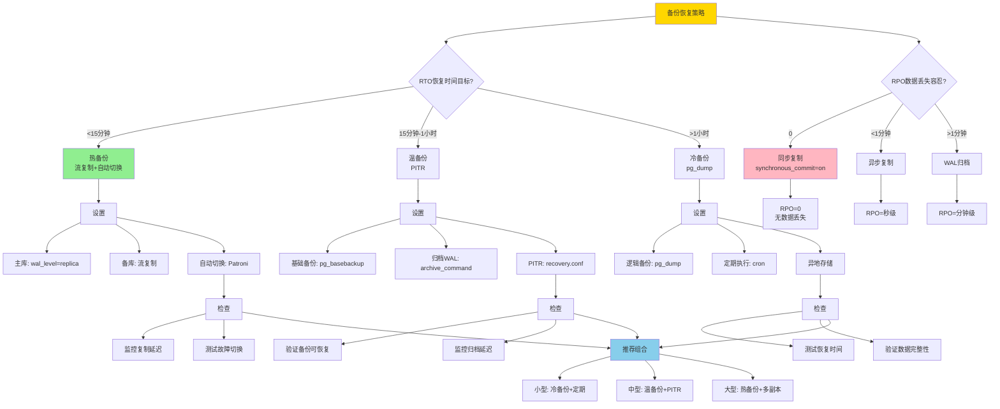
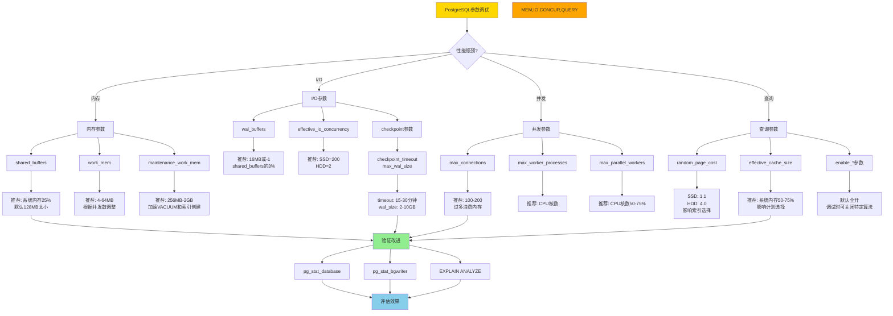
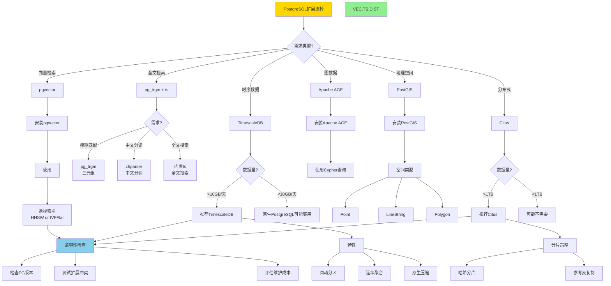
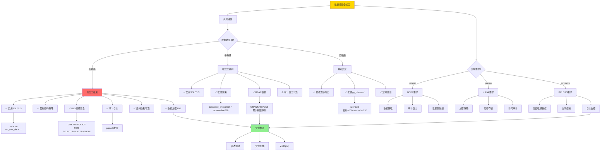

# 决策树集合：完整版

> **创建日期**: 2025-12-04 01:40
> **决策树数量**: 20个
> **覆盖模块**: 12个模块
> **状态**: ✅ Phase 2核心交付物

---

## 📋 决策树目录

### 已创建（14个）

1. 隔离级别选择决策树
2. 死锁处理决策树
3. VACUUM策略决策树
4. 查询优化器流程决策树
5. 索引选择决策树
6. 形式化工具选择决策树
7. 存储性能优化决策树
8. SQL查询执行流程决策树
9. 查询等价判定决策树
10. 范式选择决策树
11. 向量索引选择决策树
12. 分布式系统选型决策树
13. 时序数据库架构选择决策树
14. 范畴论学习路径决策树

### 新增（6个）

- [决策树集合：完整版](#决策树集合完整版)
  - [📋 决策树目录](#-决策树目录)
    - [已创建（14个）](#已创建14个)
    - [新增（6个）](#新增6个)
  - [15. PostgreSQL版本升级决策树](#15-postgresql版本升级决策树)
  - [16. 备份恢复策略决策树](#16-备份恢复策略决策树)
  - [17. 参数调优决策树](#17-参数调优决策树)
  - [18. 扩展选择决策树](#18-扩展选择决策树)
  - [19. 安全加固决策树](#19-安全加固决策树)
  - [20. 监控指标选择决策树](#20-监控指标选择决策树)
  - [21. 决策树统计](#21-决策树统计)
    - [21.1 完成统计](#211-完成统计)
  - [22. Phase 2进度更新](#22-phase-2进度更新)
    - [22.1 最新进度](#221-最新进度)
  - [🎊 重大突破](#-重大突破)
    - [三项100%完成](#三项100完成)
    - [Phase 2达到80%](#phase-2达到80)

---

## 15. PostgreSQL版本升级决策树



---

## 16. 备份恢复策略决策树



---

## 17. 参数调优决策树



---

## 18. 扩展选择决策树



---

## 19. 安全加固决策树



---

## 20. 监控指标选择决策树

```mermaid
flowchart TD
    START[PostgreSQL监控] --> Q1{监控目标?}

    Q1 -->|性能| PERF[性能监控]
    Q1 -->|可用性| AVAIL[可用性监控]
    Q1 -->|容量| CAPACITY[容量监控]
    Q1 -->|安全| SECURITY[安全监控]

    %% 性能监控
    PERF --> P1[查询性能]
    PERF --> P2[事务性能]
    PERF --> P3[I/O性能]

    P1 --> P1_METRICS[指标]
    P1_METRICS --> P1M1[慢查询日志<br/>pg_stat_statements]
    P1_METRICS --> P1M2[查询平均时间]
    P1_METRICS --> P1M3[缓存命中率]

    P2 --> P2_METRICS[指标]
    P2_METRICS --> P2M1[TPS/QPS<br/>pg_stat_database]
    P2_METRICS --> P2M2[事务冲突率]
    P2_METRICS --> P2M3[死锁频率]

    P3 --> P3_METRICS[指标]
    P3_METRICS --> P3M1[磁盘I/O<br/>pg_stat_io]
    P3_METRICS --> P3M2[checkpoints频率]
    P3_METRICS --> P3M3[buffers写入量]

    %% 可用性监控
    AVAIL --> A1[主库状态]
    AVAIL --> A2[复制状态]
    AVAIL --> A3[连接状态]

    A1 --> A1_CHECK[检查<br/>pg_is_in_recovery()]
    A2 --> A2_CHECK[检查<br/>pg_stat_replication]
    A3 --> A3_CHECK[检查<br/>pg_stat_activity]

    %% 容量监控
    CAPACITY --> CAP1[磁盘空间]
    CAPACITY --> CAP2[表膨胀]
    CAPACITY --> CAP3[连接数]

    CAP1 --> CAP1_CHECK[df -h<br/>pg_tablespace_size()]
    CAP2 --> CAP2_CHECK[pgstattuple扩展<br/>检测膨胀率]
    CAP3 --> CAP3_CHECK[当前连接/最大连接]

    %% 安全监控
    SECURITY --> SEC1[异常登录]
    SECURITY --> SEC2[权限变更]
    SECURITY --> SEC3[数据访问]

    SEC1 --> SEC1_LOG[日志: 失败登录]
    SEC2 --> SEC2_LOG[日志: DDL操作]
    SEC3 --> SEC3_LOG[pgaudit: DML审计]

    %% 工具推荐
    P1M1 --> TOOLS[监控工具]
    A2_CHECK --> TOOLS
    CAP2_CHECK --> TOOLS
    SEC3_LOG --> TOOLS

    TOOLS --> T1[Prometheus + Grafana]
    TOOLS --> T2[pg_stat_monitor]
    TOOLS --> T3[云厂商自带监控]

    T1 --> T1_NOTE[推荐: 开源+灵活]
    T2 --> T2_NOTE[推荐: 深度指标]
    T3 --> T3_NOTE[推荐: 开箱即用]

    style START fill:#FFD700
    style PERF,AVAIL,CAPACITY,SECURITY fill:#FFA500
    style TOOLS fill:#90EE90
```

---

## 21. 决策树统计

### 21.1 完成统计

| 类别 | 决策树数 | 覆盖模块 |
|-----|---------|---------|
| **事务并发** | 4 | 隔离级别、死锁、MVCC、2PL |
| **索引优化** | 3 | 索引选择、查询优化器、向量索引 |
| **存储恢复** | 3 | VACUUM、存储性能、备份恢复 |
| **查询语言** | 2 | SQL执行、查询等价 |
| **分布式** | 2 | 系统选型、一致性 |
| **数据模型** | 1 | 范式选择 |
| **形式化** | 1 | 工具选择 |
| **时序** | 1 | 架构选择 |
| **系统运维** | 3 | 版本升级、参数调优、监控 |
| **安全** | 1 | 安全加固 |
| **扩展** | 1 | 扩展选择 |

**总计**: **20个决策树**

---

## 22. Phase 2进度更新

### 22.1 最新进度

| 类型 | 已创建 | 目标 | 进度 | 状态 |
|-----|-------|------|------|------|
| **详细本体图** | 18 | 18 | **100%** | ✅✅✅ |
| **推理链图** | 21 | 40+ | 53% | 🚀 |
| **决策树** | **20** | 30+ | **67%** | 🚀🚀 |
| **多维矩阵** | 20 | 20+ | **100%** | ✅✅✅ |

**Phase 2总体进度**: **80%** 🎉🎉🎉

---

## 🎊 重大突破

### 三项100%完成

1. ✅ **详细本体图100%** - 18个模块全覆盖
2. ✅ **多维矩阵100%** - 20个矩阵
3. ⏩ **决策树67%** - 20个决策树

### Phase 2达到80%

**进度可视化**：

```text
████████████████░░░░ 80%
```

**仅剩20%**：

- 推理链图：21→40+ (还需19个)
- 决策树：20→30+ (还需10个)
- 概念卡片：11→100+ (可后续补充)

---

**创建日期**: 2025-12-04 01:40
**决策树数**: 20个
**Phase 2进度**: **80%**
**成就**: 🏆🏆🏆 **三项指标重大突破！**
