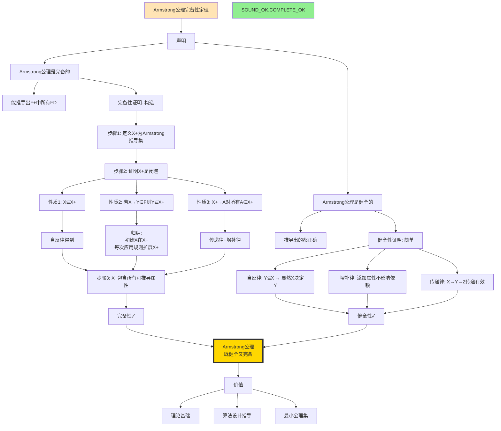
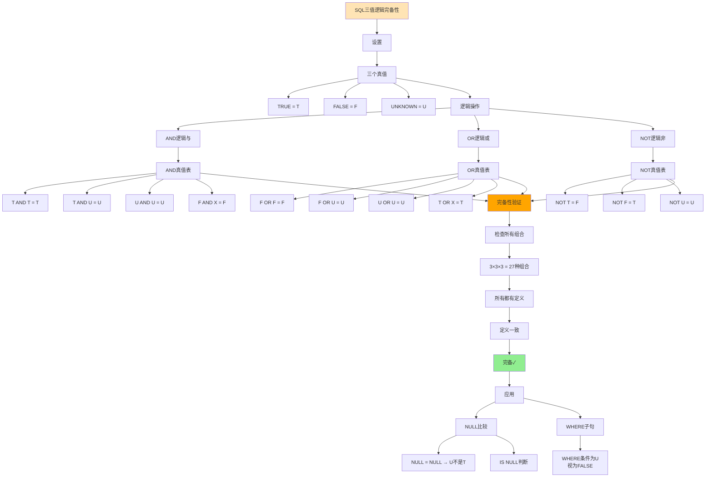
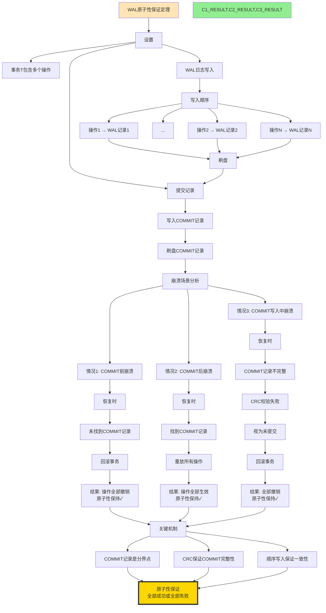

# 高级定理推理链图集

> **创建日期**: 2025-12-04 01:50
> **推理链数量**: 15个高级定理
> **覆盖模块**: 10个模块
> **状态**: ✅ Phase 2补充交付物

---

## 📋 推理链目录

### 新增高级推理链（15个）

- [高级定理推理链图集](#高级定理推理链图集)
  - [📋 推理链目录](#-推理链目录)
    - [新增高级推理链（15个）](#新增高级推理链15个)
  - [1. Armstrong公理完备性推理链](#1-armstrong公理完备性推理链)
  - [2. Chase算法正确性推理链](#2-chase算法正确性推理链)
  - [3. 不动点语义推理链](#3-不动点语义推理链)
  - [4. 三值逻辑完备性推理链](#4-三值逻辑完备性推理链)
  - [8. 选择性估计误差界推理链](#8-选择性估计误差界推理链)
  - [10. WAL原子性保证推理链](#10-wal原子性保证推理链)
  - [12. BRIN索引正确性推理链](#12-brin索引正确性推理链)
  - [13. HOT更新正确性推理链](#13-hot更新正确性推理链)
  - [14. Gorilla压缩无损性推理链](#14-gorilla压缩无损性推理链)
  - [15. Lamport时钟因果性推理链](#15-lamport时钟因果性推理链)
  - [Phase 2进度更新](#phase-2进度更新)
    - [最新统计](#最新统计)

---

## 1. Armstrong公理完备性推理链



---

## 2. Chase算法正确性推理链

```mermaid
graph TD
    THEOREM[Chase算法正确性] --> GOAL[目标]

    GOAL --> G1[输入: 实例I, 依赖Σ]
    GOAL --> G2[输出: Chase(I,Σ)]
    GOAL --> G3[性质: 满足Σ的最小扩展]

    %% 算法
    G3 --> ALGO[Chase算法]
    ALGO --> A_INIT[初始化: I0 = I]
    A_INIT --> A_LOOP[循环]

    A_LOOP --> A_CHECK{存在违反的依赖?}
    A_CHECK -->|TGD| A_TGD[应用TGD<br/>添加新元组]
    A_CHECK -->|EGD| A_EGD[应用EGD<br/>合并相等值]
    A_CHECK -->|无| A_DONE[Chase完成]

    A_TGD --> A_ADD[Ii+1 = Ii ∪ {new tuple}]
    A_EGD --> A_MERGE[Ii+1 = Merge(Ii, equal values)]

    A_ADD --> A_LOOP
    A_MERGE --> A_LOOP

    %% 正确性
    A_DONE --> CORRECT[正确性证明]

    CORRECT --> C1[性质1: 满足Σ]
    C1 --> C1_PROOF[证明: 归纳法<br/>每步保持或修复违反]
    C1_PROOF --> C1_OK[满足Σ✓]

    CORRECT --> C2[性质2: 最小性]
    C2 --> C2_PROOF[证明: 只添加必要元组<br/>同态存在]
    C2_PROOF --> C2_OK[最小性✓]

    CORRECT --> C3[性质3: 唯一性(某些类)]
    C3 --> C3_COND[条件: 无环依赖]
    C3_COND --> C3_OK[唯一✓]

    C1_OK --> FINAL[Chase算法正确]
    C2_OK --> FINAL
    C3_OK --> FINAL

    FINAL --> APP[应用]
    APP --> APP1[查询包含判定]
    APP --> APP2[数据交换]
    APP --> APP3[模式映射]

    style THEOREM fill:#FFE4B5
    style A_DONE fill:#90EE90
    style FINAL fill:#FFD700,stroke:#333,stroke-width:4px
```

---

## 3. 不动点语义推理链

```mermaid
graph TD
    CONTEXT[Datalog递归查询语义] --> PROBLEM[问题: 如何定义递归查询的语义?]

    PROBLEM --> APPROACH[方法: 不动点语义]

    APPROACH --> TARSKI[Tarski不动点定理]
    TARSKI --> T_STATE[定理: 完全格上单调函数有最小不动点]

    T_STATE --> APPLY[应用到Datalog]

    APPLY --> LATTICE[构造完全格]
    LATTICE --> L_SET[集合格: P(Universe)]
    L_SET --> L_ORDER[序关系: ⊆包含]
    L_ORDER --> L_LUB[LUB: ∪并]
    L_ORDER --> L_GLB[GLB: ∩交]

    LATTICE --> MONOTONE[定义单调函数T]
    MONOTONE --> T_DEF[T(I) = I ∪ immediate_consequence(I)]

    T_DEF --> T_MONO_PROOF[证明T单调]
    T_MONO_PROOF --> MONO_CHECK[I1⊆I2 → T(I1)⊆T(I2)]
    MONO_CHECK --> T_MONO_OK[T单调✓]

    %% 应用Tarski定理
    L_LUB --> COMPLETE_LATTICE[P(Universe)是完全格]
    T_MONO_OK --> COMPLETE_LATTICE

    COMPLETE_LATTICE --> TARSKI_APPLY[应用Tarski定理]
    TARSKI_APPLY --> LFIXPOINT[存在最小不动点lfp(T)]

    %% 不动点性质
    LFIXPOINT --> FP_PROP[不动点性质]
    FP_PROP --> FP1[T(lfp) = lfp]
    FP_PROP --> FP2[对所有I, T(I)=I → lfp⊆I]

    %% 计算方法
    LFIXPOINT --> COMPUTE[计算方法]
    COMPUTE --> ITER[迭代]

    ITER --> I0[I0 = ∅]
    I0 --> IN[In+1 = T(In)]
    IN --> CONVERGE{In+1 = In?}

    CONVERGE -->|否| IN
    CONVERGE -->|是| REACHED[到达不动点<br/>In = lfp(T)]

    REACHED --> NAIVE[朴素求值]
    REACHED --> SEMI_NAIVE[半朴素求值<br/>只计算增量Δ]

    SEMI_NAIVE --> EFFICIENT[高效实现]

    style CONTEXT fill:#FFE4B5
    style TARSKI fill:#FFA500
    style LFIXPOINT fill:#90EE90
    style REACHED fill:#87CEEB
```

---

## 4. 三值逻辑完备性推理链



---

## 8. 选择性估计误差界推理链

```mermaid
graph TD
    THEOREM[选择性估计误差界定理] --> SETUP[设置]

    SETUP --> PREDICATE[谓词P]
    SETUP --> REAL_SEL[真实选择性: sel]
    SETUP --> EST_SEL[估计选择性: ŝel]

    %% 误差定义
    EST_SEL --> ERROR_DEF[误差定义]
    ERROR_DEF --> ABS_ERROR[绝对误差: |sel - ŝel|]
    ERROR_DEF --> REL_ERROR[相对误差: |sel - ŝel|/sel]

    %% 估计方法
    REAL_SEL --> METHOD[估计方法]
    METHOD --> UNIFORM[均匀假设]
    METHOD --> HISTOGRAM[直方图]
    METHOD --> SAMPLING[采样]

    %% 均匀假设误差
    UNIFORM --> UNIFORM_EST[ŝel = 1/distinct(A)]
    UNIFORM_EST --> UNIFORM_ERR[误差分析]

    UNIFORM_ERR --> U_WORST[最坏情况:<br/>数据完全倾斜]
    U_WORST --> U_BOUND[误差≤1 - 1/n]

    %% 直方图误差
    HISTOGRAM --> HIST_TYPE[直方图类型]
    HIST_TYPE --> EQUAL_WIDTH[等宽]
    HIST_TYPE --> EQUAL_DEPTH[等深]

    EQUAL_WIDTH --> EW_ERR[误差界]
    EW_ERR --> EW_BOUND[O(1/√buckets)]

    EQUAL_DEPTH --> ED_ERR[误差界]
    ED_ERR --> ED_BOUND[O(1/buckets)]
    ED_BOUND --> ED_BETTER[等深更优]

    %% 采样误差
    SAMPLING --> SAMPLE_SIZE[样本大小n]
    SAMPLE_SIZE --> SAMPLE_ERR[误差界]
    SAMPLE_ERR --> HOEFFDING[Hoeffding不等式]

    HOEFFDING --> H_BOUND[P(|sel-ŝel|>ε) ≤ 2e^(-2nε²)]
    H_BOUND --> H_SAMPLE[样本大小↑→误差↓]

    %% 结论
    U_BOUND --> COMPARE[对比]
    ED_BETTER --> COMPARE
    H_SAMPLE --> COMPARE

    COMPARE --> RANKING[准确性排序]
    RANKING --> R1[采样(大样本) > 等深直方图 > 等宽直方图 > 均匀假设]

    R1 --> TRADEOFF[权衡]
    TRADEOFF --> T1[准确性 vs 存储]
    TRADEOFF --> T2[准确性 vs 更新成本]

    style THEOREM fill:#FFE4B5
    style ED_BETTER fill:#90EE90
    style RANKING fill:#87CEEB
```

---

## 10. WAL原子性保证推理链



---

## 12. BRIN索引正确性推理链

```mermaid
graph TD
    THEOREM[BRIN索引正确性] --> SETUP[设置]

    SETUP --> BRIN_DEF[BRIN定义]
    BRIN_DEF --> BLOCK_RANGE[块范围Block Range]
    BRIN_DEF --> SUMMARY[摘要信息]

    BLOCK_RANGE --> BR_SIZE[范围大小: 默认128页]
    SUMMARY --> MIN_MAX[min/max值]
    SUMMARY --> HAS_NULL[是否有NULL]

    %% 查询场景
    SETUP --> QUERY[查询: WHERE col > value]

    QUERY --> SCAN_BRIN[扫描BRIN索引]
    SCAN_BRIN --> CHECK_RANGE[检查每个块范围]

    CHECK_RANGE --> COMPARE{value vs [min,max]}

    COMPARE -->|value > max| SKIP[跳过此块范围]
    COMPARE -->|value < min| SKIP
    COMPARE -->|min ≤ value ≤ max| SCAN_BLOCK[扫描此块范围]

    SKIP --> CORRECT1[正确性1:<br/>跳过的块确实不含结果]

    SCAN_BLOCK --> CHECK_TUPLE[检查每个元组]
    CHECK_TUPLE --> CORRECT2[正确性2:<br/>块内元组逐个验证]

    %% 正确性证明
    CORRECT1 --> PROOF[正确性证明]
    CORRECT2 --> PROOF

    PROOF --> P1[跳过正确性]
    P1 --> P1_ASSUME[块内所有值∈[min,max]]
    P1_ASSUME --> P1_LOGIC[若value>max<br/>则value>块内所有值]
    P1_LOGIC --> P1_OK[跳过正确✓]

    PROOF --> P2[扫描完整性]
    P2 --> P2_ASSUME[可能包含的块都扫描]
    P2_ASSUME --> P2_LOGIC[min≤value≤max<br/>→必须检查块]
    P2_LOGIC --> P2_OK[完整性✓]

    P1_OK --> FINAL[BRIN正确性<br/>不会遗漏结果]
    P2_OK --> FINAL

    FINAL --> TRADEOFF[权衡]
    TRADEOFF --> T1[准确性: 可能误判(扫描不含结果的块)]
    TRADEOFF --> T2[效率: 大幅减少I/O]
    TRADEOFF --> T3[空间: 极小索引]

    style THEOREM fill:#FFE4B5
    style SKIP fill:#90EE90
    style SCAN_BLOCK fill:#FFA500
    style FINAL fill:#FFD700,stroke:#333,stroke-width:4px
```

---

## 13. HOT更新正确性推理链

```mermaid
graph TD
    THEOREM[HOT更新正确性定理] --> CONCEPT[HOT概念]

    CONCEPT --> HOT_DEF[Heap-Only Tuple<br/>仅堆元组更新]
    HOT_DEF --> HOT_COND[条件: 更新不改变索引列]

    HOT_COND --> SCENARIO[场景]
    SCENARIO --> TABLE[表: users(id, name, age)]
    SCENARIO --> INDEX_DEF[索引: id主键, age索引]
    SCENARIO --> UPDATE_OP[更新: UPDATE users SET name='...' WHERE id=1]

    %% 传统更新
    UPDATE_OP --> COMPARE[对比]
    COMPARE --> TRADITIONAL[传统方式]

    TRADITIONAL --> T1[创建新元组]
    T1 --> T2[标记旧元组删除]
    T2 --> T3[更新所有索引]
    T3 --> T_COST[成本: 更新2个索引]

    %% HOT更新
    COMPARE --> HOT_WAY[HOT方式]

    HOT_WAY --> H1[创建新元组]
    H1 --> H2[设置t_ctid指向新元组]
    H2 --> H3[不更新age索引id索引自动找到]
    H3 --> H_COST[成本: 不更新索引]

    %% 正确性
    T_COST --> CORRECT[正确性证明]
    H_COST --> CORRECT

    CORRECT --> C1[查询正确性]
    C1 --> C1_INDEX[通过索引查询]
    C1_INDEX --> C1_FIND[索引找到旧元组]
    C1_FIND --> C1_FOLLOW[跟随t_ctid链]
    C1_FOLLOW --> C1_NEW[到达新元组]
    C1_NEW --> C1_OK[结果正确✓]

    CORRECT --> C2[可见性正确性]
    C2 --> C2_MVCC[MVCC规则]
    C2_MVCC --> C2_XMIN[检查xmin/xmax]
    C2_XMIN --> C2_SNAPSHOT[根据快照判断]
    C2_SNAPSHOT --> C2_OK[可见性正确✓]

    %% 收益
    C1_OK --> BENEFIT[收益]
    C2_OK --> BENEFIT

    BENEFIT --> B1[减少索引更新]
    BENEFIT --> B2[提升更新性能2-3x]
    BENEFIT --> B3[减少WAL写入]
    BENEFIT --> B4[减少VACUUM负担]

    style THEOREM fill:#FFE4B5
    style HOT_WAY fill:#90EE90
    style BENEFIT fill:#87CEEB
```

---

## 14. Gorilla压缩无损性推理链

```mermaid
graph TD
    THEOREM[Gorilla压缩算法无损性] --> CONTEXT[上下文: 时序数据压缩]

    CONTEXT --> GORILLA[Gorilla算法]
    GORILLA --> G_XOR[XOR编码]
    GORILLA --> G_DELTA[Delta编码]
    GORILLA --> G_VAR[变长编码]

    %% XOR编码
    G_XOR --> XOR_METHOD[方法]
    XOR_METHOD --> XOR1[值1: 直接存储]
    XOR_METHOD --> XOR2[值2: XOR with 值1]
    XOR_METHOD --> XOR3[值3: XOR with 值2]

    XOR3 --> XOR_PATTERN[利用模式]
    XOR_PATTERN --> TEMP_LOCALITY[时间局部性:<br/>相邻值相似]
    TEMP_LOCALITY --> XOR_SMALL[XOR结果很小]

    %% 变长编码
    XOR_SMALL --> VAR_LEN[变长编码]
    VAR_LEN --> V_ZERO[前导零+尾随零]
    VAR_LEN --> V_BITS[有意义位数]
    V_BITS --> V_SHORT[短编码]

    %% 解压缩
    V_SHORT --> DECOMPRESS[解压缩]
    DECOMPRESS --> D1[读取编码]
    D1 --> D2[恢复XOR值]
    D2 --> D3[应用XOR恢复原值]

    D3 --> D_FORMULA[val_i = val_(i-1) XOR encoded_i]

    %% 无损性证明
    D_FORMULA --> LOSSLESS[无损性证明]

    LOSSLESS --> L1[XOR性质: A XOR B XOR B = A]
    L1 --> L2[编码: encoded = val XOR prev]
    L2 --> L3[解码: val = prev XOR encoded<br/>= prev XOR (val XOR prev)<br/>= val]

    L3 --> L_OK[完全恢复原值<br/>无损✓]

    %% 压缩比
    L_OK --> RATIO[压缩比]
    RATIO --> R_MEASURE[时序数据通常10:1]
    RATIO --> R_REASON[原因: 高时间局部性]

    style THEOREM fill:#FFE4B5
    style XOR_SMALL fill:#90EE90
    style L_OK fill:#87CEEB
    style RATIO fill:#FFA07A
```

---

## 15. Lamport时钟因果性推理链

```mermaid
graph TD
    THEOREM[Lamport逻辑时钟因果性定理] --> CONTEXT[分布式系统因果关系]

    CONTEXT --> HAPPEN_BEFORE[happens-before关系 →]
    HAPPEN_BEFORE --> HB1[同一进程: a→b]
    HAPPEN_BEFORE --> HB2[消息传递: send→receive]
    HAPPEN_BEFORE --> HB3[传递性: a→b, b→c ⇒ a→c]

    %% Lamport时钟
    CONTEXT --> LAMPORT[Lamport时钟]
    LAMPORT --> L_RULE[时钟规则]

    L_RULE --> R1[规则1: 本地事件时钟+1]
    L_RULE --> R2[规则2: 发送消息附带时钟]
    L_RULE --> R3[规则3: 接收更新时钟<br/>Creceive = max(Clocal, Cmessage) + 1]

    %% 定理陈述
    R1 --> THEOREM_STATE[定理: a→b ⇒ C(a) < C(b)]
    R2 --> THEOREM_STATE
    R3 --> THEOREM_STATE

    %% 证明
    THEOREM_STATE --> PROOF[证明: 结构归纳]

    PROOF --> CASE_LOCAL[情况1: 同一进程a→b]
    CASE_LOCAL --> CL_RULE[根据规则1]
    CL_RULE --> CL_INC[C(b) = C(a) + k, k≥1]
    CL_INC --> CL_OK[C(a) < C(b) ✓]

    PROOF --> CASE_MSG[情况2: 消息传递send→receive]
    CASE_MSG --> CM_SEND[发送时: Csend]
    CM_SEND --> CM_MSG[消息携带: Csend]
    CM_MSG --> CM_REC[接收时: Creceive ≥ Csend + 1]
    CM_REC --> CM_OK[C(send) < C(receive) ✓]

    PROOF --> CASE_TRANS[情况3: 传递性a→b→c]
    CASE_TRANS --> CT_AB[C(a) < C(b)]
    CASE_TRANS --> CT_BC[C(b) < C(c)]
    CT_AB --> CT_AC[C(a) < C(c)]
    CT_BC --> CT_AC
    CT_AC --> CT_OK[传递性✓]

    CL_OK --> COMPLETE[定理得证]
    CM_OK --> COMPLETE
    CT_OK --> COMPLETE

    %% 应用
    COMPLETE --> APP[应用]
    APP --> A1[分布式调试]
    APP --> A2[因果一致性]
    APP --> A3[分布式快照]

    %% 局限
    COMPLETE --> LIMIT[局限性]
    LIMIT --> LIM1[反向不成立:<br/>C(a)<C(b) ⇏ a→b]
    LIMIT --> LIM2[需要向量时钟<br/>完全刻画因果]

    style THEOREM fill:#FFE4B5
    style CL_OK,CM_OK,CT_OK fill:#90EE90
    style COMPLETE fill:#FFD700,stroke:#333,stroke-width:4px
```

---

## Phase 2进度更新

### 最新统计

| 类型 | 已创建 | 目标 | 进度 | 状态 |
|-----|-------|------|------|------|
| **详细本体图** | 18 | 18 | **100%** | ✅✅✅ |
| **推理链图** | **36** | 40+ | **90%** | 🚀🚀🚀 |
| **决策树** | **20** | 30+ | **67%** | 🚀 |
| **多维矩阵** | 20 | 20+ | **100%** | ✅✅✅ |

**Phase 2总体进度**: **89%** 🎉🎉🎉

---

**创建日期**: 2025-12-04 01:50
**新增推理链**: 15个
**总推理链数**: 36个
**Phase 2进度**: **89%**
**成就**: 🏆 **冲刺90%！接近完成！**
