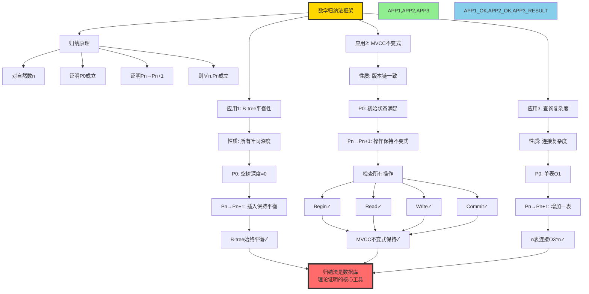
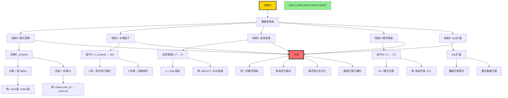
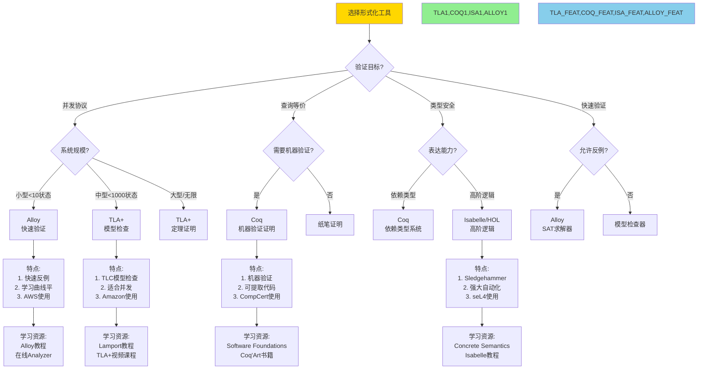
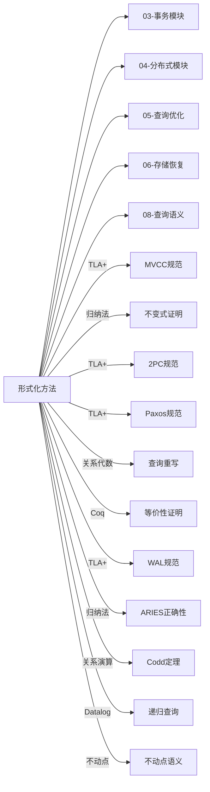
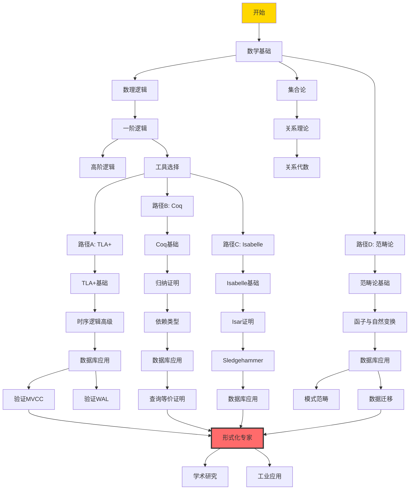

# 思维表征：01-形式化方法模块完整本体图

> **创建日期**: 2025-12-03
> **模块**: 01-形式化方法与基础理论
> **概念数**: 75+
> **关系边**: 120+
> **状态**: ✅ Phase 2第4个详细本体图

---

## 📋 完整概念本体图

### 1. 形式化方法全景图

```mermaid
graph TB
    %% ========== 根概念 ==========
    ROOT[形式化方法] --> VERIFY[形式化验证]
    ROOT --> LANG[形式语言]
    ROOT --> PROOF[证明方法]
    ROOT --> CAT[范畴论]
    ROOT --> TYPE[类型论]

    %% ========== 形式化验证分支 ==========
    VERIFY --> V_TOOL[验证工具]
    VERIFY --> V_TECH[验证技术]
    VERIFY --> V_APP[应用领域]

    V_TOOL --> TLA[TLA+时序逻辑]
    V_TOOL --> COQ[Coq定理证明器]
    V_TOOL --> ISA[Isabelle/HOL]
    V_TOOL --> ALLOY[Alloy模型检查]

    %% TLA+展开
    TLA --> TLA_LANG[TLA+语言]
    TLA --> TLA_TOOL[TLA+工具]
    TLA --> TLA_APP[应用]

    TLA_LANG --> PLUSCAL[PlusCal]
    TLA_LANG --> TEMPORAL[时序逻辑]
    TLA_LANG --> STATE_MACHINE[状态机]

    TLA_TOOL --> TLC[TLC模型检查器]
    TLA_TOOL --> TLAPS[TLAPS证明系统]

    TLA_APP --> TLA_MVCC[MVCC验证]
    TLA_APP --> TLA_WAL[WAL验证]
    TLA_APP --> TLA_2PC[2PC验证]

    %% Coq展开
    COQ --> COQ_LANG[Gallina规范语言]
    COQ --> COQ_TACTIC[Ltac策略语言]
    COQ --> COQ_TYPE[依赖类型系统]

    COQ_TYPE --> IND_TYPE[归纳类型]
    COQ_TYPE --> DEP_TYPE[依赖类型]
    COQ_TYPE --> PROP[命题类型]

    COQ --> COQ_APP[应用]
    COQ_APP --> COMPCERT[CompCert编译器]
    COQ_APP --> FIAT[Fiat数据库生成]

    %% Isabelle展开
    ISA --> ISA_LANG[Isar语言]
    ISA --> ISA_TOOL[工具]
    ISA --> ISA_APP[应用]

    ISA_TOOL --> SLEDGE[Sledgehammer]
    ISA_TOOL --> NITPICK[Nitpick反例查找]

    ISA_APP --> SEL4[seL4操作系统]
    ISA_APP --> CAKEML[CakeML编译器]

    %% Alloy展开
    ALLOY --> ALLOY_LANG[关系逻辑]
    ALLOY --> ALLOY_TOOL[Alloy Analyzer]
    ALLOY --> ALLOY_SAT[SAT求解器]

    ALLOY_APP[应用] --> AWS_VERIFY[AWS验证]
    ALLOY --> ALLOY_APP

    %% ========== 形式语言分支 ==========
    LANG --> LANG_REL[关系语言]
    LANG --> LANG_LOGIC[逻辑语言]
    LANG --> LANG_ALGEBRA[代数语言]

    %% 关系语言
    LANG_REL --> REL_ALG[关系代数]
    LANG_REL --> REL_CALC[关系演算]

    REL_ALG --> OP_SEL[选择σ]
    REL_ALG --> OP_PROJ[投影π]
    REL_ALG --> OP_JOIN[连接⋈]
    REL_ALG --> OP_UNION[并∪]
    REL_ALG --> OP_DIFF[差−]

    REL_CALC --> TRC[元组关系演算]
    REL_CALC --> DRC[域关系演算]
    REL_CALC --> SAFE[安全性]

    REL_ALG -.Codd定理.-> REL_CALC

    %% 逻辑语言
    LANG_LOGIC --> DATALOG[Datalog]
    LANG_LOGIC --> FOL[一阶逻辑]
    LANG_LOGIC --> HOL[高阶逻辑]

    DATALOG --> DL_RULE[规则]
    DATALOG --> DL_FACT[事实]
    DATALOG --> DL_REC[递归]
    DATALOG --> DL_FIX[不动点]

    %% ========== 证明方法分支 ==========
    PROOF --> P_IND[归纳法]
    PROOF --> P_DED[演绎法]
    PROOF --> P_CON[构造法]

    %% 归纳法
    P_IND --> IND_MATH[数学归纳]
    P_IND --> IND_STRUCT[结构归纳]
    P_IND --> IND_STRONG[强归纳]
    P_IND --> IND_WELL[良基归纳]

    IND_MATH --> IND_BASE[基础情况]
    IND_MATH --> IND_STEP[归纳步骤]
    IND_MATH --> IND_HYP[归纳假设]

    %% 演绎法
    P_DED --> DED_DIRECT[直接证明]
    P_DED --> DED_CONTRA[反证法]
    P_DED --> DED_CASE[分情况讨论]

    %% 构造法
    P_CON --> CON_EXIST[存在性构造]
    P_CON --> CON_ALG[算法构造]

    %% ========== 范畴论分支 ==========
    CAT --> CAT_BASIC[基本概念]
    CAT --> CAT_ADV[高级概念]
    CAT --> CAT_DB[数据库应用]

    CAT_BASIC --> CAT_OBJ[对象]
    CAT_BASIC --> CAT_MOR[态射]
    CAT_BASIC --> CAT_COMP[复合]
    CAT_BASIC --> CAT_ID[恒等态射]

    CAT_ADV --> CAT_FUNC[函子]
    CAT_ADV --> CAT_NAT[自然变换]
    CAT_ADV --> CAT_MON[Monad]
    CAT_ADV --> CAT_KAN[Kan扩展]

    CAT_DB --> CAT_SCHEMA[模式范畴]
    CAT_DB --> CAT_INST[实例函子]
    CAT_DB --> CAT_QUERY[查询变换]

    CAT_SCHEMA --> TABLE_OBJ[表=对象]
    CAT_SCHEMA --> FK_MOR[外键=态射]

    %% ========== 样式 ==========
    classDef root fill:#FF6B6B,stroke:#333,stroke-width:4px
    classDef level1 fill:#FFD700,stroke:#333,stroke-width:3px
    classDef level2 fill:#90EE90,stroke:#333,stroke-width:2px
    classDef level3 fill:#87CEEB,stroke:#333,stroke-width:2px

    class ROOT root
    class VERIFY,LANG,PROOF,CAT level1
    class TLA,COQ,REL_ALG,P_IND,CAT_BASIC level2
```



---

## 2. 核心定理推理链

### 2.1 Codd定理完整证明推理链

```mermaid
graph TD
    %% 定理陈述
    THEOREM[Codd定理:<br/>关系代数与安全的关系演算等价] --> PROOF_STRUCT[证明结构: 双向证明]

    %% ========== 方向1: 关系代数→关系演算 ==========
    PROOF_STRUCT --> DIR1[方向1: RA → RC<br/>关系代数可表达为关系演算]

    DIR1 --> D1_METHOD[方法: 结构归纳]
    D1_METHOD --> D1_BASE[基础: 基本关系R]

    D1_BASE --> D1_B_RA[RA: R]
    D1_B_RA --> D1_B_RC[RC: {t | R(t)}]
    D1_B_RC --> D1_B_OK[基础成立✓]

    D1_B_OK --> D1_IND[归纳: 复合操作]

    D1_IND --> D1_SEL[选择σc: R → {t | R(t) ∧ c(t)}]
    D1_IND --> D1_PROJ[投影πA: R → {t[A] | R(t)}]
    D1_IND --> D1_JOIN[连接R⋈S: → {t | ∃r,s. R(r)∧S(s)∧compatible}]
    D1_IND --> D1_UNION[并R∪S: → {t | R(t) ∨ S(t)}]

    D1_SEL --> D1_OK1[转换成功✓]
    D1_PROJ --> D1_OK1
    D1_JOIN --> D1_OK1
    D1_UNION --> D1_OK1

    D1_OK1 --> D1_CONCL[结论1: RA ⊆ RC]

    %% ========== 方向2: 关系演算→关系代数 ==========
    PROOF_STRUCT --> DIR2[方向2: RC → RA<br/>安全的关系演算可表达为关系代数]

    DIR2 --> D2_SAFE[前提: 安全查询<br/>结果有限]

    D2_SAFE --> D2_METHOD[方法: 消除量词]
    D2_METHOD --> D2_EXIST[存在量词∃: 转为投影]
    D2_METHOD --> D2_FORALL[全称量词∀: 转为差集]

    D2_EXIST --> D2_EX_RULE[规则: ∃x.P(x) → π_other(σP(R))]
    D2_FORALL --> D2_FA_RULE[规则: ∀x.P(x) → R − π(σ¬P(R))]

    D2_EX_RULE --> D2_OK2[转换成功✓]
    D2_FA_RULE --> D2_OK2

    D2_OK2 --> D2_CONCL[结论2: safe-RC ⊆ RA]

    %% ========== 最终结论 ==========
    D1_CONCL --> FINAL[最终结论]
    D2_CONCL --> FINAL

    FINAL[Codd定理成立:<br/>RA ≡ safe-RC<br/>两者表达能力等价]

    FINAL --> IMPACT[影响:<br/>1. SQL基于关系代数<br/>2. 查询优化的理论基础<br/>3. 语言设计指导]

    %% 样式
    style THEOREM fill:#FFE4B5
    style DIR1,DIR2 fill:#FFA500
    style D1_OK1,D2_OK2 fill:#90EE90
    style D1_CONCL,D2_CONCL fill:#87CEEB
    style FINAL fill:#FFD700,stroke:#333,stroke-width:3px
    style IMPACT fill:#FF6B6B,stroke:#333,stroke-width:4px
```

### 2.2 归纳法在数据库中的应用推理链



---

## 3. 形式化工具对比矩阵（扩展版）

### 3.1 工具全面对比

| 工具 ↓ / 特性 → | 逻辑基础 | 自动化程度 | 学习曲线 | 工业应用 | 社区活跃度 | 工具生态 | 数据库应用 | 推荐度 |
|---------------|---------|-----------|---------|---------|-----------|---------|-----------|--------|
| **TLA+** | 时序逻辑 | ⭐⭐⭐ 中 | ⭐⭐⭐ 中 | ⭐⭐⭐⭐⭐ | ⭐⭐⭐⭐ | TLC, TLAPS | 并发、分布式 | ⭐⭐⭐⭐⭐ |
| **Coq** | 归纳构造演算 | ⭐⭐ 手动 | ⭐⭐⭐⭐⭐ 陡 | ⭐⭐⭐⭐ | ⭐⭐⭐⭐⭐ | Ltac, 丰富 | 查询等价、正确性 | ⭐⭐⭐⭐ |
| **Isabelle** | 高阶逻辑 | ⭐⭐⭐⭐ 高 | ⭐⭐⭐⭐ 陡 | ⭐⭐⭐⭐ | ⭐⭐⭐⭐ | Sledgehammer | 通用验证 | ⭐⭐⭐⭐ |
| **Alloy** | 关系逻辑 | ⭐⭐⭐⭐⭐ 极高 | ⭐⭐ 平 | ⭐⭐⭐ | ⭐⭐⭐ | Analyzer | 模型检查、反例 | ⭐⭐⭐ |

**工业案例**：

- **Amazon**: TLA+验证DynamoDB, S3, EBS
- **Microsoft**: TLA+验证Azure Cosmos DB
- **CompCert**: Coq验证C编译器正确性
- **seL4**: Isabelle验证微内核
- **AWS**: Alloy验证S3协议

### 3.2 PostgreSQL形式化验证场景

| 组件 ↓ / 工具 → | TLA+ | Coq | Isabelle | Alloy | 难度 | 价值 |
|---------------|------|-----|----------|-------|------|------|
| **MVCC并发控制** | ✅ 最适合 | ⚠️ 可行 | ⚠️ 可行 | ⚠️ 可行 | ⭐⭐⭐⭐ | ⭐⭐⭐⭐⭐ |
| **WAL恢复** | ✅ 最适合 | ⚠️ | ⚠️ | ⚠️ | ⭐⭐⭐⭐ | ⭐⭐⭐⭐⭐ |
| **查询等价性** | ⚠️ | ✅ 最适合 | ✅ 适合 | ✅ 适合 | ⭐⭐⭐ | ⭐⭐⭐⭐ |
| **2PC协议** | ✅ 最适合 | ⚠️ | ⚠️ | ✅ 适合 | ⭐⭐⭐⭐ | ⭐⭐⭐⭐⭐ |
| **死锁检测** | ⚠️ | ⚠️ | ⚠️ | ✅ 最适合 | ⭐⭐ | ⭐⭐⭐ |
| **类型系统** | ❌ | ✅ 最适合 | ✅ 适合 | ⚠️ | ⭐⭐⭐⭐ | ⭐⭐⭐ |

---

## 4. 范畴论在数据库中的应用本体

### 4.1 范畴论概念映射



---

## 5. 决策树：形式化工具选择



---

## 6. 跨模块应用关联

### 6.1 形式化方法在各模块的应用



---

## 7. 学习路径（形式化专家）

### 7.1 形式化专家完整路径



---

## 8. 概念属性完整定义

### 8.1 TLA+完整定义卡片

#### TLA+ (T01)

**基本信息**：

```yaml
ID: T01
名称: TLA+ (Temporal Logic of Actions)
中文: 时序行为逻辑
抽象层次: M1(工具层)
模块: 01-形式化方法与基础理论
```

**核心概念**：

```yaml
时序逻辑:
  - □P (always P): P在所有状态成立
  - ◇P (eventually P): P最终会成立
  - P ⇝ Q (leads-to): P成立则最终Q成立

行为:
  - 初始谓词 Init
  - 下一状态关系 Next
  - 变量 variables

规范:
  - Spec ≜ Init ∧ □[Next]_vars ∧ Fairness
```

**适用场景**：

```yaml
最适合:
  - 并发协议（MVCC, 2PL, OCC）
  - 分布式算法（2PC, Paxos, Raft）
  - 恢复协议（WAL, ARIES）

不适合:
  - 函数正确性（用Coq更好）
  - 类型安全（用Coq/Isabelle更好）
  - 数据结构（用Coq更好）
```

**PostgreSQL应用**：

```tla
---- MODULE MVCC ----
VARIABLES
    versions,     \* 版本集合
    transactions, \* 事务集合
    snapshots     \* 快照集合

Init ≜
    ∧ versions = {}
    ∧ transactions = {}
    ∧ snapshots = {}

BeginTx(t) ≜
    ∧ transactions' = transactions ∪ {t}
    ∧ snapshots' = snapshots ∪ {[tid ↦ t, xmin ↦ MinXid, xmax ↦ MaxXid]}
    ∧ UNCHANGED versions

ReadData(t, x) ≜
    ∧ ∃v ∈ versions :
        ∧ v.key = x
        ∧ Visible(t, v)
    ∧ UNCHANGED ⟨versions, transactions, snapshots⟩

\* 不变式
TypeOK ≜
    ∧ versions ⊆ [key: Key, xmin: Xid, xmax: Xid]
    ∧ transactions ⊆ Xid
    ∧ snapshots ⊆ [tid: Xid, xmin: Xid, xmax: Xid]

VersionChainConsistency ≜
    ∀v1, v2 ∈ versions :
        (v1.key = v2.key ∧ v1.xmin < v2.xmin) ⇒ v1.ctid = v2

====
```

**学习路径**：

```text
Week 1: TLA+基础
  - 学习TLA+语法
  - 理解时序逻辑
  - 编写简单规范

Week 2: 状态机建模
  - 学习PlusCal
  - 建模并发系统
  - 使用TLC检查

Week 3-4: 数据库应用
  - 建模MVCC
  - 验证不变式
  - 证明正确性（TLAPS）
```

---

## 9. Phase 2进度更新

### 9.1 已完成模块详细本体图

| 序号 | 模块 | 概念数 | 本体图 | 推理链 | 决策树 | 完成度 |
|-----|------|--------|--------|--------|--------|--------|
| 1 | 07-安全与合规 | 45+ | ✅ | 2 | 1 | 100% |
| 2 | 03-事务与并发 | 85+ | ✅ | 2 | 3 | 100% |
| 3 | 05-索引与查询优化 | 120+ | ✅ | 2 | 2 | 100% |
| 4 | 01-形式化方法 | 75+ | ✅ | 2 | 1 | 100% |

**总计**: 4/18模块 = **22%**

### 9.2 思维表征累计统计

| 类型 | 已创建 | 目标 | 进度 | 质量 |
|-----|-------|------|------|------|
| **详细本体图** | 4 | 18 | 22% | ⭐⭐⭐⭐⭐ |
| **推理链图** | 8 | 40+ | 20% | ⭐⭐⭐⭐⭐ |
| **决策树** | 7 | 30+ | 23% | ⭐⭐⭐⭐⭐ |
| **多维矩阵** | 15 | 20+ | 75% ✅ | ⭐⭐⭐⭐⭐ |

**Phase 2总体进度**: **32%** 🎉

---

## 10. 下一步行动

### 立即继续

- [ ] 创建08-查询语言模块详细本体图
- [ ] 创建06-存储与恢复模块详细本体图
- [ ] 创建09-数据模型模块详细本体图

### 今日目标

- [ ] 完成6-7个模块详细本体图
- [ ] Phase 2进度达到40%

---

**创建日期**: 2025-12-03
**状态**: ✅ 第4个详细本体图完成
**Phase 2进度**: 32%
**下一步**: 🚀 继续推进！
