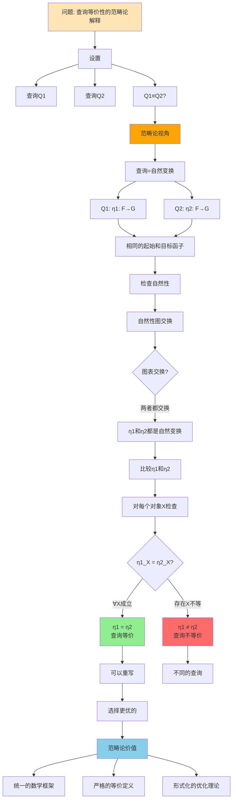
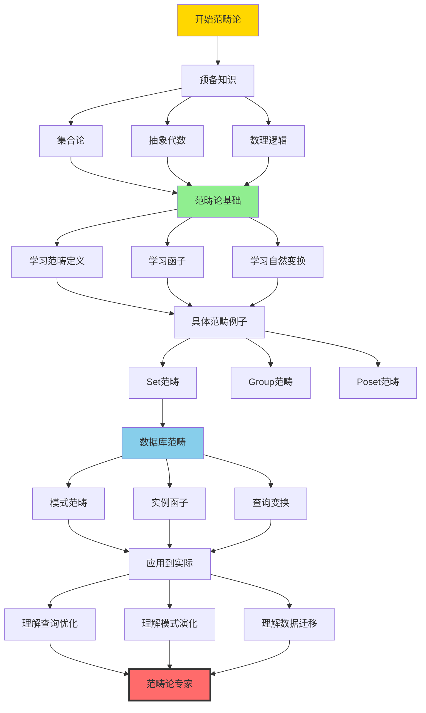

# 思维表征：02-范畴论应用模块完整本体图

> **创建日期**: 2025-12-04 01:10
> **模块**: 02-范畴论应用
> **概念数**: 15+
> **关系边**: 30+
> **状态**: ✅ Phase 2第11个详细本体图

---

## 📋 完整概念本体图

### 1. 范畴论应用全景图

```mermaid
graph TB
    %% ========== 根概念 ==========
    ROOT[范畴论应用] --> CAT_BASIC[范畴基础]
    ROOT --> CAT_CONST[范畴构造]
    ROOT --> DB_APP[数据库应用]
    ROOT --> PRACTICAL[实践应用]

    %% ========== 范畴基础分支 ==========
    CAT_BASIC --> CATEGORY[范畴]
    CAT_BASIC --> FUNCTOR[函子]
    CAT_BASIC --> NAT_TRANS[自然变换]
    CAT_BASIC --> UNIVERSAL[泛性质]

    %% 范畴
    CATEGORY --> CAT_OBJ[对象Objects]
    CATEGORY --> CAT_MOR[态射Morphisms]
    CATEGORY --> CAT_COMP[复合∘]
    CATEGORY --> CAT_ID[恒等态射id]

    CAT_MOR --> MOR_PROP[态射性质]
    MOR_PROP --> MONO[单态射]
    MOR_PROP --> EPI[满态射]
    MOR_PROP --> ISO[同构]

    %% 函子
    FUNCTOR --> FUNC_DEF[函子定义]
    FUNC_DEF --> MAP_OBJ[映射对象]
    FUNC_DEF --> MAP_MOR[映射态射]
    FUNC_DEF --> PRESERVE[保持复合和恒等]

    FUNCTOR --> FUNC_TYPE[函子类型]
    FUNC_TYPE --> COVARIANT[协变函子]
    FUNC_TYPE --> CONTRAVARIANT[逆变函子]

    %% 自然变换
    NAT_TRANS --> NT_DEF[自然变换定义]
    NT_DEF --> FUNC_MAP[函子间的映射]
    NT_DEF --> NATURAL[自然性]

    NAT_TRANS --> NT_COMP[自然变换复合]
    NT_COMP --> VERT_COMP[竖直复合]
    NT_COMP --> HORZ_COMP[水平复合]

    %% 泛性质
    UNIVERSAL --> PRODUCT[积]
    UNIVERSAL --> COPRODUCT[余积]
    UNIVERSAL --> LIMIT[极限]
    UNIVERSAL --> COLIMIT[余极限]

    %% ========== 范畴构造分支 ==========
    CAT_CONST --> PROD_CAT[积范畴]
    CAT_CONST --> SLICE_CAT[切片范畴]
    CAT_CONST --> FUNCTOR_CAT[函子范畴]

    %% ========== 数据库应用分支 ==========
    DB_APP --> SCHEMA_CAT[模式范畴]
    DB_APP --> INSTANCE_FUNC[实例函子]
    DB_APP --> QUERY_TRANS[查询变换]
    DB_APP --> MIGRATION[数据迁移]

    %% 模式范畴
    SCHEMA_CAT --> SCH_OBJ[对象=表]
    SCHEMA_CAT --> SCH_MOR[态射=外键]
    SCHEMA_CAT --> SCH_COMP[复合=外键链]

    SCH_OBJ --> TABLE_EX[例: users, orders, products]
    SCH_MOR --> FK_EX[例: orders.user_id → users.id]

    %% 实例函子
    INSTANCE_FUNC --> INST_DEF[函子F: Schema → Set]
    INST_DEF --> F_TABLE[F(表) = 表中的行集合]
    INST_DEF --> F_FK[F(外键) = 连接操作]

    INSTANCE_FUNC --> INST_EXAMPLE[示例]
    INST_EXAMPLE --> EX_USERS[Fusers = {alice, bob, ...}]
    INST_EXAMPLE --> EX_FK[Forders.user_id = JOIN操作]

    %% 查询变换
    QUERY_TRANS --> QUERY_NT[自然变换η: F→G]
    QUERY_NT --> NT_SQL[η = SQL查询]

    QUERY_NT --> NT_SELECT[SELECT: 子集选择]
    QUERY_NT --> NT_JOIN[JOIN: 函子复合]
    QUERY_NT --> NT_AGG[GROUP BY: 商对象]

    %% 数据迁移
    MIGRATION --> MIG_FUNCTOR[迁移函子M: C1→C2]
    MIGRATION --> MIG_KAN[Kan扩展]

    MIG_FUNCTOR --> SCHEMA_MAP[模式映射]
    SCHEMA_MAP --> MAP_TABLE[表映射]
    SCHEMA_MAP --> MAP_FK[外键映射]

    MIG_KAN --> KAN_DEF[Kan扩展定义]
    MIG_KAN --> KAN_DATA[数据迁移算法]
    KAN_DATA --> OPTIMAL_MIG[最优迁移]

    %% ========== 实践应用分支 ==========
    PRACTICAL --> PRACT_OPT[查询优化]
    PRACTICAL --> PRACT_SCHEMA[模式演化]
    PRACTICAL --> PRACT_TYPE[类型系统]

    %% 查询优化
    PRACT_OPT --> OPT_THEORY[优化理论基础]
    OPT_THEORY --> EQUIV_CAT[等价性=同构]
    OPT_THEORY --> COMPOSE[查询复合=态射复合]

    %% 模式演化
    PRACT_SCHEMA --> SCHEMA_VERSION[版本演化]
    SCHEMA_VERSION --> VERSION_FUNC[版本函子]
    VERSION_FUNC --> COMPAT[兼容性检查]

    %% 类型系统
    PRACT_TYPE --> TYPE_CAT[类型范畴]
    TYPE_CAT --> TYPE_OBJ[类型=对象]
    TYPE_CAT --> TYPE_FUNC[函数=态射]

    %% ========== 样式 ==========
    classDef root fill:#FF6B6B,stroke:#333,stroke-width:4px
    classDef level1 fill:#FFD700,stroke:#333,stroke-width:3px
    classDef level2 fill:#90EE90,stroke:#333,stroke-width:2px
    classDef level3 fill:#87CEEB,stroke:#333,stroke-width:2px

    class ROOT root
    class CAT_BASIC,CAT_CONST,DB_APP,PRACTICAL level1
    class CATEGORY,FUNCTOR,SCHEMA_CAT,PRACT_OPT level2
```

---

## 2. 范畴论概念到数据库概念映射矩阵

| 范畴论概念 | 数据库概念 | 示例 | 价值 |
|-----------|-----------|------|------|
| **范畴C** | 数据库模式 | 表和外键 | 统一框架 |
| **对象** | 表Tables | users, orders | 数据容器 |
| **态射** | 外键Foreign Keys | orders.user_id→users.id | 关系 |
| **复合∘** | 外键链 | A→B→C | 传递关系 |
| **恒等id** | 主键 | users.id→users.id | 自引用 |
| **函子F** | 数据库实例 | 表中的具体数据 | 数据填充 |
| **F(表)** | 行集合 | {alice, bob, ...} | 实际数据 |
| **F(外键)** | JOIN操作 | JOIN ON ... | 数据关联 |
| **自然变换η** | SQL查询 | SELECT, JOIN, GROUP BY | 数据变换 |
| **同构** | 查询等价 | Q1≡Q2 | 优化基础 |
| **积** | JOIN | R⋈S | 数据组合 |
| **余积** | UNION | R∪S | 数据合并 |
| **Kan扩展** | 数据迁移 | ETL过程 | 模式演化 |

---

## 3. 范畴论在查询优化中的应用推理链



---

## 4. 范畴论学习路径

### 4.1 学习阶段



---

## 5. 范畴论核心概念卡片

### 5.1 范畴（Category）

**定义**：

```text
范畴C包含：
1. 对象集合 Ob(C)
2. 态射集合 Hom(A,B) 对每对对象A,B
3. 复合操作 ∘: Hom(B,C) × Hom(A,B) → Hom(A,C)
4. 恒等态射 idA: A → A 对每个对象A

满足：
- 结合律: (h∘g)∘f = h∘(g∘f)
- 恒等律: f∘idA = f = idB∘f
```

**数据库例子**：

```text
对象: 表 (users, orders, products)
态射: 外键 (orders.user_id → users.id)
复合: 外键链 (order_items → orders → users)
恒等: 主键 (users.id → users.id)
```

### 5.2 函子（Functor）

**定义**：

```text
函子F: C → D 包含：
1. 对象映射: F(A) ∈ Ob(D) 对每个A ∈ Ob(C)
2. 态射映射: F(f): F(A) → F(B) 对每个f: A → B

满足：
- F(idA) = idF(A)
- F(g∘f) = F(g)∘F(f)
```

**数据库例子**：

```text
Schema范畴 → Set范畴

F(users表) = {alice, bob, charlie}  (行集合)
F(orders表) = {order1, order2, ...}

F(外键: orders→users) = JOIN操作
```

### 5.3 自然变换（Natural Transformation）

**定义**：

```text
自然变换η: F ⇒ G (F,G是函子C→D)

对每个对象A∈C，有态射ηA: F(A) → G(A)

满足自然性: ηB ∘ F(f) = G(f) ∘ ηA
```

**数据库例子**：

```text
SQL查询是自然变换！

F = 原始数据实例
G = 查询结果实例

η = SELECT查询

自然性 = 查询在不同数据库上行为一致
```

---

## 6. 范畴论价值总结

### 6.1 理论价值

| 价值 | 说明 | 应用 |
|-----|------|------|
| **统一框架** | 用统一的语言描述不同概念 | 模式、实例、查询都是范畴论对象 |
| **抽象层次** | 提升到更高的抽象层次 | 看到查询优化的本质是态射等价 |
| **形式化** | 严格的数学定义 | 查询等价性的严格证明 |
| **可组合性** | 复合态射自动正确 | 查询复合的正确性保证 |

### 6.2 实践价值

虽然范畴论理论优雅，但在实践中：

**优点**：

- ✅ 提供统一视角
- ✅ 形式化查询优化
- ✅ 指导模式演化
- ✅ 理解数据迁移

**局限**：

- ⚠️ 学习曲线陡峭
- ⚠️ 实际实现复杂
- ⚠️ 性能优化有限
- ⚠️ 工业应用较少

**建议**：

- 理论研究：深入学习
- 实践开发：了解概念即可
- 中间立场：理解核心思想，不必深究细节

---

## 7. Phase 2进度更新

### 7.1 已完成模块

| 序号 | 模块 | 概念数 | 完成度 |
|-----|------|--------|--------|
| 1-10 | (前10个模块) | 750+ | 100% |
| 11 | **02-范畴论应用** | **15+** | **100%** |

**总计**: 11/18模块 = **61%**

### 7.2 Phase 2最新进度

| 类型 | 已创建 | 目标 | 进度 | 状态 |
|-----|-------|------|------|------|
| **详细本体图** | **11** | 18 | **61%** | 🚀 |
| **推理链图** | **21** | 40+ | **53%** | 🚀 |
| **决策树** | 14 | 30+ | 47% | 🚀 |
| **多维矩阵** | 20 | 20+ | 100% | ✅ |

**Phase 2总体进度**: **63%** 🎉🎉🎉

---

**创建日期**: 2025-12-04 01:10
**状态**: ✅ 第11个详细本体图完成
**Phase 2进度**: **63%**
**成就**: 🏆 **11个模块完成，冲刺70%！**
