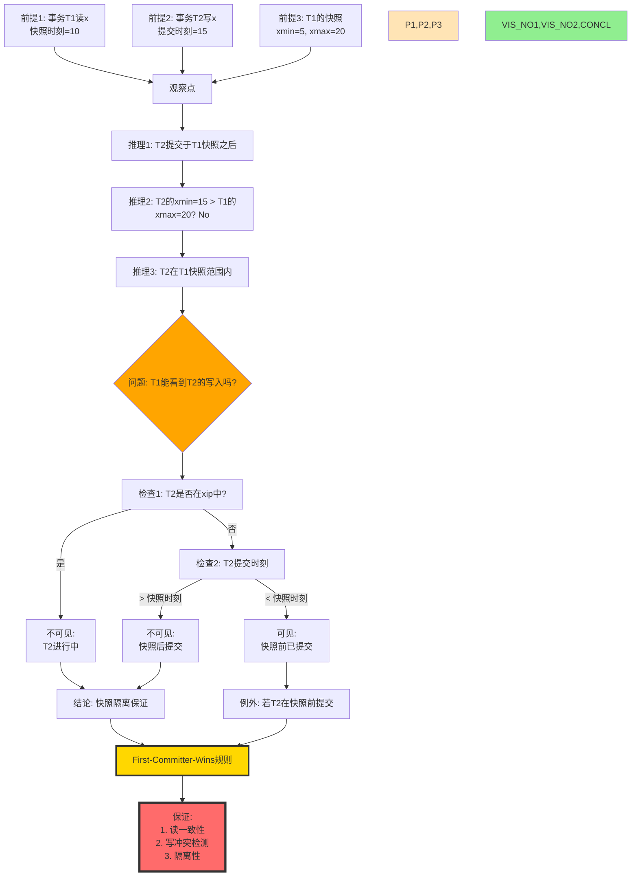
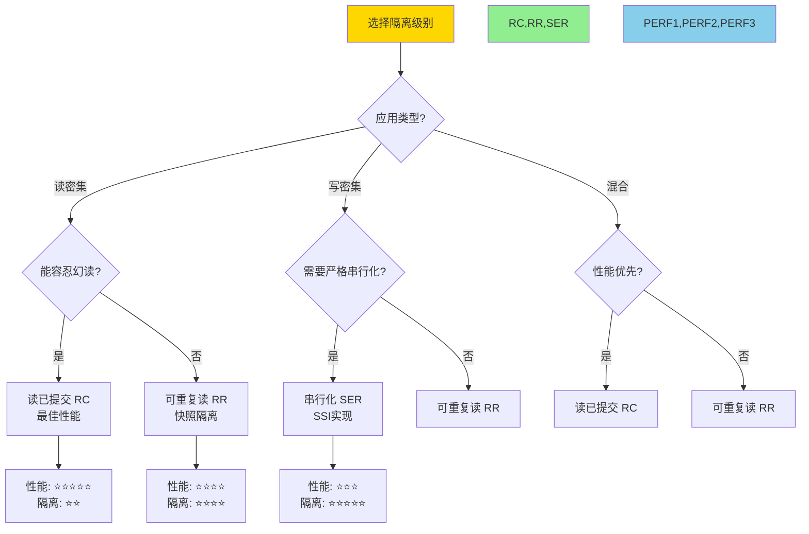
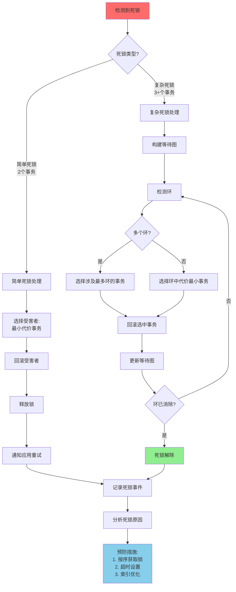
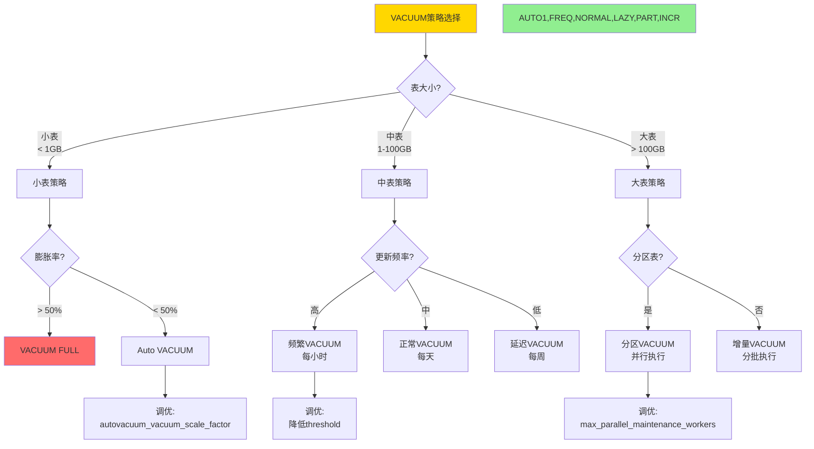
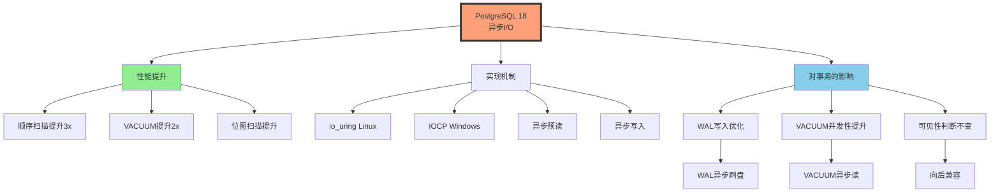
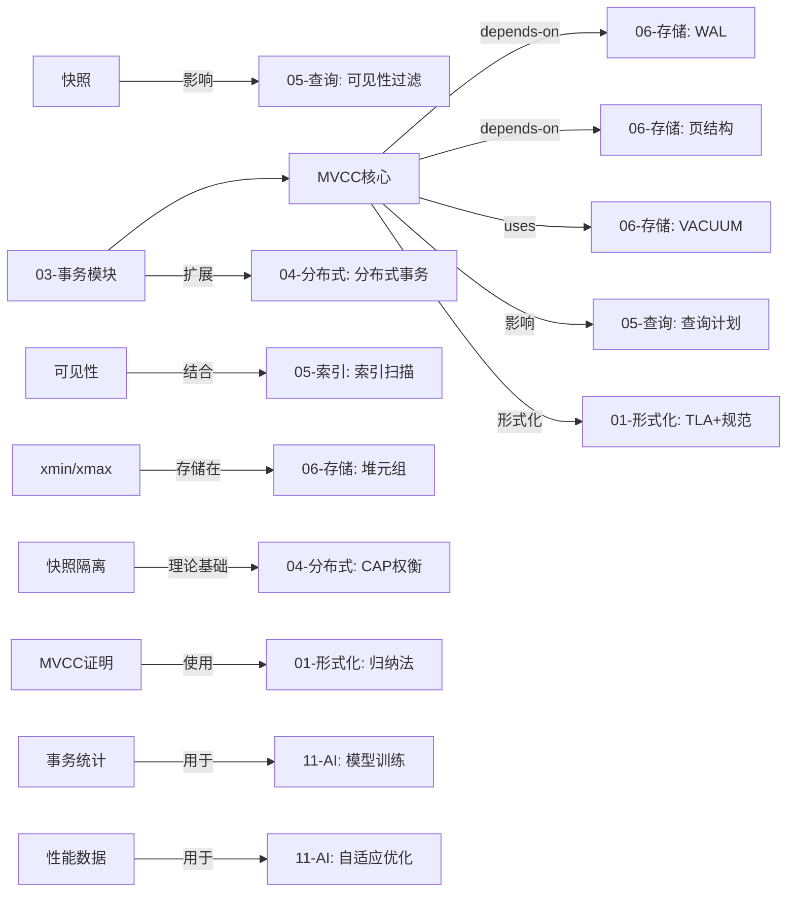
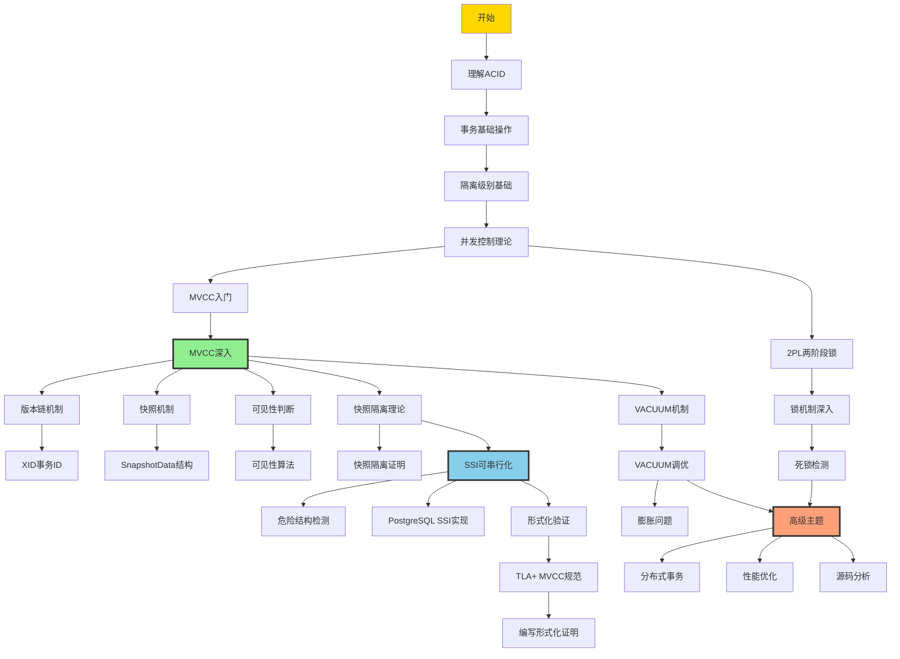
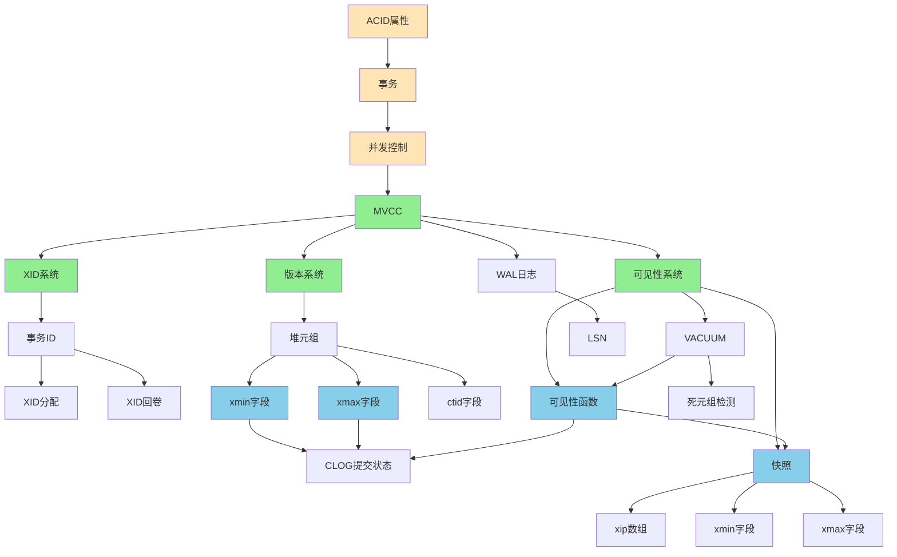

# 思维表征：03-事务与并发控制模块完整本体图

> **创建日期**: 2025-12-03
> **模块**: 03-事务与并发控制
> **概念数**: 85+
> **关系边**: 150+
> **定理数**: 15+
> **状态**: ✅ Phase 2详细本体图

---

## 📋 完整概念本体图

### 1. 事务并发控制全景图

```mermaid
graph TB
    %% ========== 根概念 ==========
    ROOT[事务与并发控制] --> TX[事务管理]
    ROOT --> CC[并发控制]
    ROOT --> ISO[隔离性]
    ROOT --> SCHED[调度理论]
    ROOT --> LOCK[锁机制]

    %% ========== 事务管理分支 ==========
    TX --> TX_ACID[ACID属性]
    TX --> TX_STATE[事务状态]
    TX --> TX_OP[事务操作]

    TX_ACID --> ATOM[原子性A]
    TX_ACID --> CONS[一致性C]
    TX_ACID --> ISOL[隔离性I]
    TX_ACID --> DUR[持久性D]

    TX_STATE --> S_ACTIVE[活跃]
    TX_STATE --> S_COMMIT[已提交]
    TX_STATE --> S_ABORT[已回滚]

    TX_OP --> OP_BEGIN[BEGIN]
    TX_OP --> OP_READ[READ]
    TX_OP --> OP_WRITE[WRITE]
    TX_OP --> OP_COMMIT[COMMIT]
    TX_OP --> OP_ABORT[ABORT]

    %% ========== 并发控制分支 ==========
    CC --> CC_MVCC[MVCC多版本]
    CC --> CC_2PL[2PL两阶段锁]
    CC --> CC_OCC[OCC乐观控制]
    CC --> CC_TO[TO时间戳排序]

    %% MVCC展开
    CC_MVCC --> MVCC_VC[版本链]
    CC_MVCC --> MVCC_SNAP[快照]
    CC_MVCC --> MVCC_VIS[可见性规则]
    CC_MVCC --> MVCC_VAC[VACUUM]

    MVCC_VC --> VC_XMIN[xmin创建者]
    MVCC_VC --> VC_XMAX[xmax删除者]
    MVCC_VC --> VC_CTID[ctid指针]

    MVCC_SNAP --> SNAP_XIP[xip进行中事务]
    MVCC_SNAP --> SNAP_XMIN[xmin最小事务]
    MVCC_SNAP --> SNAP_XMAX[xmax最大事务]

    MVCC_VIS --> VIS_RULE1[创建者已提交]
    MVCC_VIS --> VIS_RULE2[删除者未提交]
    MVCC_VIS --> VIS_RULE3[快照可见]

    MVCC_VAC --> VAC_DEAD[清理死元组]
    MVCC_VAC --> VAC_FREEZE[冻结元组]
    MVCC_VAC --> VAC_AUTO[自动VACUUM]

    %% 2PL展开
    CC_2PL --> PL_GROW[增长阶段]
    CC_2PL --> PL_SHRINK[收缩阶段]
    CC_2PL --> PL_STRICT[严格2PL]

    %% ========== 隔离性分支 ==========
    ISO --> ISO_RU[读未提交RU]
    ISO --> ISO_RC[读已提交RC]
    ISO --> ISO_RR[可重复读RR]
    ISO --> ISO_SER[串行化SER]

    ISO --> ISO_ANOM[异常]
    ISO_ANOM --> ANOM_DR[脏读]
    ISO_ANOM --> ANOM_NR[不可重复读]
    ISO_ANOM --> ANOM_PR[幻读]
    ISO_ANOM --> ANOM_WS[写偏序]

    ISO --> ISO_SI[快照隔离SI]
    ISO_SI --> ISO_SSI[可串行化快照隔离SSI]

    %% ========== 调度理论分支 ==========
    SCHED --> SCHED_SER[串行调度]
    SCHED --> SCHED_CONF[冲突可串行化]
    SCHED --> SCHED_VIEW[视图可串行化]

    SCHED_CONF --> CONF[冲突]
    CONF --> CONF_RW[读-写冲突]
    CONF --> CONF_WR[写-读冲突]
    CONF --> CONF_WW[写-写冲突]

    SCHED --> SCHED_GRAPH[依赖图]
    SCHED_GRAPH --> SG_NODE[事务节点]
    SCHED_GRAPH --> SG_EDGE[依赖边]
    SCHED_GRAPH --> SG_CYCLE[环检测]

    %% ========== 锁机制分支 ==========
    LOCK --> LOCK_TYPE[锁类型]
    LOCK --> LOCK_GRAN[锁粒度]
    LOCK --> LOCK_ESC[锁升级]
    LOCK --> LOCK_DL[死锁]

    LOCK_TYPE --> LT_S[共享锁S]
    LOCK_TYPE --> LT_X[排他锁X]
    LOCK_TYPE --> LT_IS[意向共享IS]
    LOCK_TYPE --> LT_IX[意向排他IX]
    LOCK_TYPE --> LT_SIX[共享+意向排他]

    LOCK_GRAN --> LG_DB[数据库级]
    LOCK_GRAN --> LG_TABLE[表级]
    LOCK_GRAN --> LG_PAGE[页级]
    LOCK_GRAN --> LG_ROW[行级]
    LOCK_GRAN --> LG_PRED[谓词级]

    LOCK_ESC --> ESC_UP[锁升级]
    LOCK_ESC --> ESC_DOWN[锁降级]

    LOCK_DL --> DL_DETECT[死锁检测]
    LOCK_DL --> DL_WAIT[等待图]
    LOCK_DL --> DL_VICTIM[受害者选择]
    LOCK_DL --> DL_TIMEOUT[超时检测]

    %% ========== 谓词锁分支 ==========
    LOCK --> PRED_LOCK[谓词锁]
    PRED_LOCK --> PHANTOM[幽灵现象]
    PRED_LOCK --> GAP[间隙锁]
    PRED_LOCK --> NEXTKEY[Next-Key锁]

    %% ========== 样式 ==========
    classDef root fill:#FF6B6B,stroke:#333,stroke-width:4px
    classDef level1 fill:#FFD700,stroke:#333,stroke-width:3px
    classDef level2 fill:#90EE90,stroke:#333,stroke-width:2px
    classDef level3 fill:#87CEEB,stroke:#333,stroke-width:2px
    classDef mvcc fill:#FFA07A,stroke:#333,stroke-width:3px

    class ROOT root
    class TX,CC,ISO,SCHED,LOCK level1
    class CC_MVCC,CC_2PL,ISO_SI,LOCK_DL mvcc
```



---

## 2. 核心定理推理链图

### 2.1 MVCC正确性完整证明推理链

```mermaid
graph TD
    %% ========== 定义和前提 ==========
    DEF[定义: MVCC系统M<br/>版本链、快照、可见性规则] --> BASE[基础]

    AXIOM1[公理1: 每个版本有唯一xmin] --> BASE
    AXIOM2[公理2: 版本链按时间顺序] --> BASE
    AXIOM3[公理3: 快照包含xmin,xmax,xip] --> BASE

    BASE --> STEP1{步骤1:<br/>定义状态转换系统}

    %% ========== 步骤1：状态转换 ==========
    STEP1 --> STATE_DEF[状态 = Versions × Snapshots × Transactions]
    STATE_DEF --> TRANS_DEF[转换 = Begin | Read | Write | Commit]

    TRANS_DEF --> STEP2{步骤2:<br/>归纳证明不变式}

    %% ========== 步骤2：不变式 ==========
    STEP2 --> INV1[不变式1: 版本链一致]
    STEP2 --> INV2[不变式2: 快照有效]
    STEP2 --> INV3[不变式3: 可见性正确]

    %% 归纳基础
    INV1 --> BASE_CASE[基础情况: 初始状态满足]
    INV2 --> BASE_CASE
    INV3 --> BASE_CASE

    %% 归纳步骤
    BASE_CASE --> IND_STEP[归纳步骤: 每个操作保持不变式]

    IND_STEP --> OP_BEGIN[Begin操作验证]
    IND_STEP --> OP_READ[Read操作验证]
    IND_STEP --> OP_WRITE[Write操作验证]
    IND_STEP --> OP_COMMIT[Commit操作验证]

    OP_BEGIN --> INV_KEPT1[不变式保持✓]
    OP_READ --> INV_KEPT1
    OP_WRITE --> INV_KEPT1
    OP_COMMIT --> INV_KEPT1

    INV_KEPT1 --> STEP3{步骤3:<br/>证明快照一致性}

    %% ========== 步骤3：快照一致性 ==========
    STEP3 --> SNAP_CONS[快照一致性定义]
    SNAP_CONS --> SC1[事务读取的版本<br/>在快照时刻已提交]

    SC1 --> SC_PROOF[证明:<br/>可见性规则保证此性质]
    SC_PROOF --> VIS_RULE[可见性规则应用]
    VIS_RULE --> SC_RESULT[快照一致性成立✓]

    SC_RESULT --> STEP4{步骤4:<br/>证明隔离性}

    %% ========== 步骤4：隔离性 ==========
    STEP4 --> ISO_DEF[隔离性定义:<br/>并发事务不相互干扰]

    ISO_DEF --> ISO_PROOF1[证明1: 读操作]
    ISO_PROOF1 --> READ_SNAP[事务只读自己的快照]
    READ_SNAP --> READ_ISO[读隔离✓]

    ISO_DEF --> ISO_PROOF2[证明2: 写操作]
    ISO_PROOF2 --> WRITE_NEW[写操作创建新版本]
    WRITE_NEW --> WRITE_ISO[写隔离✓]

    READ_ISO --> STEP5{步骤5:<br/>证明快照隔离}
    WRITE_ISO --> STEP5

    %% ========== 步骤5：快照隔离 ==========
    STEP5 --> SI_DEF[快照隔离定义]
    SI_DEF --> SI_PROP1[性质1: First-Committer-Wins]
    SI_DEF --> SI_PROP2[性质2: 读取快照时刻数据]

    SI_PROP1 --> SI_PROOF[证明: MVCC实现这两个性质]
    SI_PROP2 --> SI_PROOF

    SI_PROOF --> SI_RESULT[快照隔离成立✓]

    SI_RESULT --> STEP6{步骤6:<br/>SSI扩展（可选）}

    %% ========== 步骤6：SSI ==========
    STEP6 --> SSI[可串行化快照隔离]
    SSI --> SSI_CHECK[检测危险结构]
    SSI_CHECK --> SSI_RW[RW-冲突检测]
    SSI_RW --> SSI_SER[串行化保证✓]

    %% ========== 最终结论 ==========
    INV_KEPT1 --> FINAL[最终结论]
    SC_RESULT --> FINAL
    SI_RESULT --> FINAL
    SSI_SER --> FINAL

    FINAL[MVCC正确性:<br/>1. 不变式保持<br/>2. 快照一致<br/>3. 快照隔离<br/>4. 可扩展到SSI]

    %% ========== 样式 ==========
    style DEF fill:#FFE4B5
    style BASE fill:#E0E0E0
    style STEP1,STEP2,STEP3,STEP4,STEP5,STEP6 fill:#FFD700
    style INV_KEPT1,SC_RESULT,READ_ISO,WRITE_ISO,SI_RESULT,SSI_SER fill:#90EE90
    style FINAL fill:#FF6B6B,stroke:#333,stroke-width:4px
```

### 2.2 快照隔离推理链（详细版）



---

## 3. 多维矩阵集合

### 3.1 并发控制机制 × 特性对比

| 机制 ↓ / 特性 → | 读性能 | 写性能 | 空间开销 | 实现复杂度 | 死锁风险 | 适用场景 |
|---------------|--------|--------|---------|-----------|---------|---------|
| **MVCC** | ⭐⭐⭐⭐⭐ | ⭐⭐⭐ | ⭐⭐ (高) | ⭐⭐⭐⭐ | ⭐⭐⭐⭐⭐ (低) | 读多写少 |
| **2PL** | ⭐⭐⭐ | ⭐⭐⭐ | ⭐⭐⭐⭐⭐ | ⭐⭐⭐ | ⭐⭐ (高) | 写密集 |
| **OCC** | ⭐⭐⭐⭐ | ⭐⭐⭐⭐ | ⭐⭐⭐⭐ | ⭐⭐⭐ | ⭐⭐⭐ | 冲突少 |
| **TO** | ⭐⭐⭐⭐ | ⭐⭐⭐ | ⭐⭐⭐⭐ | ⭐⭐ | ⭐⭐⭐⭐⭐ | 只读事务多 |

### 3.2 隔离级别 × 异常防护矩阵

| 隔离级别 ↓ / 异常 → | 脏读 | 不可重复读 | 幻读 | 写偏序 | 性能 | PostgreSQL实现 |
|-------------------|-----|----------|-----|--------|------|----------------|
| **读未提交 RU** | ❌ 允许 | ❌ 允许 | ❌ 允许 | ❌ 允许 | ⭐⭐⭐⭐⭐ | 实际映射到RC |
| **读已提交 RC** | ✅ 防止 | ❌ 允许 | ❌ 允许 | ❌ 允许 | ⭐⭐⭐⭐ | 默认级别 |
| **可重复读 RR** | ✅ 防止 | ✅ 防止 | ⚠️ 防止 | ❌ 允许 | ⭐⭐⭐ | 快照隔离 |
| **串行化 SER** | ✅ 防止 | ✅ 防止 | ✅ 防止 | ✅ 防止 | ⭐⭐ | SSI实现 |

### 3.3 锁类型兼容性矩阵

| 已持有 ↓ / 请求 → | S共享 | X排他 | IS意向共享 | IX意向排他 | SIX |
|------------------|------|------|-----------|-----------|-----|
| **S共享** | ✅ | ❌ | ✅ | ❌ | ❌ |
| **X排他** | ❌ | ❌ | ❌ | ❌ | ❌ |
| **IS意向共享** | ✅ | ❌ | ✅ | ✅ | ✅ |
| **IX意向排他** | ❌ | ❌ | ✅ | ✅ | ❌ |
| **SIX** | ❌ | ❌ | ✅ | ❌ | ❌ |

### 3.4 MVCC vs 2PL详细对比

| 对比维度 | MVCC | 2PL | 说明 |
|---------|------|-----|------|
| **读-写冲突** | 不阻塞 | 阻塞 | MVCC核心优势 |
| **写-写冲突** | First-Committer-Wins | 阻塞等待 | 不同策略 |
| **读性能** | 高（无锁） | 中（需锁） | MVCC读优 |
| **写性能** | 中（创建版本） | 中（等锁） | 相近 |
| **空间** | 高（多版本） | 低（单版本） | MVCC劣势 |
| **VACUUM** | 需要 | 不需要 | MVCC开销 |
| **死锁** | 极少 | 较多 | MVCC优势 |
| **实现** | 复杂 | 中等 | 2PL较简单 |

---

## 4. 决策树集合

### 4.1 隔离级别选择决策树



### 4.2 死锁处理决策树



### 4.3 VACUUM策略选择决策树



---

## 5. 概念层次树（完整展开）

### 5.1 MVCC概念层次树

```mermaid
graph TD
    %% Level 1: 根
    MVCC[MVCC<br/>Multi-Version<br/>Concurrency Control]

    %% Level 2: 核心组件
    MVCC --> VER[版本管理]
    MVCC --> SNAP[快照管理]
    MVCC --> VIS[可见性判断]
    MVCC --> GC[垃圾回收]

    %% Level 3: 版本管理细节
    VER --> VER_CHAIN[版本链]
    VER --> VER_META[版本元数据]
    VER --> VER_HOT[HOT优化]

    VER_META --> xmin[xmin字段]
    VER_META --> xmax[xmax字段]
    VER_META --> ctid[ctid字段]
    VER_META --> infomask[infomask标志]

    infomask --> HINT[提示位]
    HINT --> XMIN_COMMITTED[xmin已提交]
    HINT --> XMAX_COMMITTED[xmax已提交]

    %% Level 3: 快照管理细节
    SNAP --> SNAP_DATA[SnapshotData结构]
    SNAP --> SNAP_CREATE[快照创建]
    SNAP --> SNAP_SHARE[快照共享]

    SNAP_DATA --> xip[xip数组]
    SNAP_DATA --> xmin_snap[xmin快照]
    SNAP_DATA --> xmax_snap[xmax快照]

    %% Level 3: 可见性判断细节
    VIS --> VIS_FUNC[可见性函数]
    VIS --> VIS_RULE[可见性规则]
    VIS --> VIS_OPT[可见性优化]

    VIS_FUNC --> HTSS[HeapTupleSatisfiesSnapshot]
    VIS_FUNC --> HTSMVCC[HeapTupleSatisfiesMVCC]

    VIS_RULE --> RULE1[创建者可见性]
    VIS_RULE --> RULE2[删除者可见性]
    VIS_RULE --> RULE3[快照范围检查]

    %% Level 3: 垃圾回收细节
    GC --> VAC[VACUUM]
    GC --> AUTO_VAC[Auto VACUUM]
    GC --> FREEZE[Freeze冻结]

    VAC --> VAC_STD[标准VACUUM]
    VAC --> VAC_FULL[VACUUM FULL]
    VAC --> VAC_ANALYZE[VACUUM ANALYZE]

    AUTO_VAC --> VAC_DAEMON[autovacuum daemon]
    AUTO_VAC --> VAC_WORKER[autovacuum worker]

    FREEZE --> XID_WRAP[XID回卷防护]
    FREEZE --> FROZEN_XID[FROZEN_XID标记]

    %% 样式
    classDef level1 fill:#FF6B6B,stroke:#333,stroke-width:4px
    classDef level2 fill:#FFD700,stroke:#333,stroke-width:3px
    classDef level3 fill:#90EE90,stroke:#333,stroke-width:2px
    classDef level4 fill:#87CEEB,stroke:#333,stroke-width:1px

    class MVCC level1
    class VER,SNAP,VIS,GC level2
    class VER_CHAIN,VER_META,SNAP_DATA,VIS_FUNC,VAC level3
```



---

## 6. PostgreSQL 18事务特性本体

### 6.1 异步I/O在事务中的应用



---

## 7. 跨模块概念关联网络

### 7.1 事务模块与其他模块的关系



---

## 8. 学习路径（事务专家）

### 8.1 事务专家完整学习路径



---

## 9. 概念依赖分析

### 9.1 MVCC核心概念依赖图



---

## 10. 概念属性完整定义

### 10.1 核心概念属性卡片

#### MVCC (T01)

**基本信息**：

- **ID**: T01
- **名称**: Multi-Version Concurrency Control
- **中文**: 多版本并发控制
- **抽象层次**: M2(理论层)
- **模块**: 03-事务与并发控制

**属性**：

```yaml
实现方式: 版本链 + 快照
隔离级别:
  - 读已提交: ✅ 原生支持
  - 可重复读: ✅ 快照隔离
  - 串行化: ✅ SSI实现
性能:
  读性能: 极高（无锁读取）
  写性能: 中等（创建新版本）
  空间开销: 高（多版本存储）
优势:
  - 读不阻塞写
  - 写不阻塞读
  - 高并发性能
劣势:
  - 空间开销大
  - 需要VACUUM
  - 写偏序可能
适用场景:
  - 读多写少
  - 高并发读
  - OLTP系统
```

**操作**：

```text
BEGIN:  创建事务，分配XID，创建快照
READ:   根据快照判断版本可见性
WRITE:  创建新版本，设置xmin
COMMIT: 标记事务提交，版本对后续可见
ABORT:  标记事务回滚，版本无效
```

**不变式**：

```text
INV1: ∀v ∈ Versions. ∃!t ∈ Transactions. v.xmin = t.id
INV2: ∀v1, v2 ∈ VersionChain. v1.xmin < v2.xmin → v1.ctid = v2
INV3: ∀t ∈ Transactions, v ∈ Versions. visible(t, v) → committed(v.xmin)
```

**定理**：

- 快照隔离正确性定理
- MVCC不变式保持定理
- 可串行化定理（SSI）

**PostgreSQL实现**：

```c
// 核心数据结构
typedef struct HeapTupleHeaderData {
    TransactionId t_xmin;    // 创建者XID
    TransactionId t_xmax;    // 删除者XID
    ItemPointerData t_ctid;  // 当前或下一版本位置
    uint16 t_infomask;       // 标志位
} HeapTupleHeaderData;

// 快照结构
typedef struct SnapshotData {
    TransactionId xmin;      // 最小活跃XID
    TransactionId xmax;      // 最大已分配XID
    TransactionId *xip;      // 活跃事务数组
    uint32 xcnt;             // 活跃事务数量
} SnapshotData;
```

**相关概念**：

- 依赖: 并发控制(MC01), 事务(MC02), XID系统
- 组成: 版本链(T07), 快照(I02), 可见性规则(T08), VACUUM(I06)
- 实现: xmin(I03), xmax(I04), SnapshotData
- 扩展: 快照隔离(T05), SSI(T06)

---

## 11. Phase 2进度更新

### 11.1 已完成本体图

| 模块 | 概念数 | 关系边 | 推理链图 | 决策树 | 矩阵 | 状态 |
|-----|-------|--------|---------|--------|------|------|
| 07-安全 | 45+ | 80+ | 2 | 1 | 3 | ✅ |
| 03-事务 | 85+ | 150+ | 2 | 3 | 4 | ✅ |

**总计**: 2/18模块，进度11%

### 11.2 思维表征统计

| 表征类型 | 已创建 | 待创建 | 覆盖率 |
|---------|-------|--------|--------|
| **详细本体图** | 2 | 16 | 11% |
| **推理链图** | 4 | 36+ | 10% |
| **决策树** | 4 | 30+ | 12% |
| **多维矩阵** | 7 | 10+ | 41% |
| **概念卡片** | 11 | 889 | 1% |

---

## 12. 下一步行动

### 立即继续

- [ ] 创建05-索引模块详细本体图（120+概念）
- [ ] 创建01-形式化方法模块详细本体图（75+概念）
- [ ] 创建查询优化器推理链图

### 今日目标

- [ ] 完成3-4个模块详细本体图
- [ ] 总进度达到Phase 2的20-25%

---

**创建日期**: 2025-12-03
**状态**: ✅ 第2个详细本体图完成
**质量**: ⭐⭐⭐⭐⭐
**下一步**: 🚀 继续创建索引模块本体图
