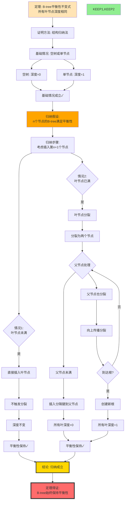
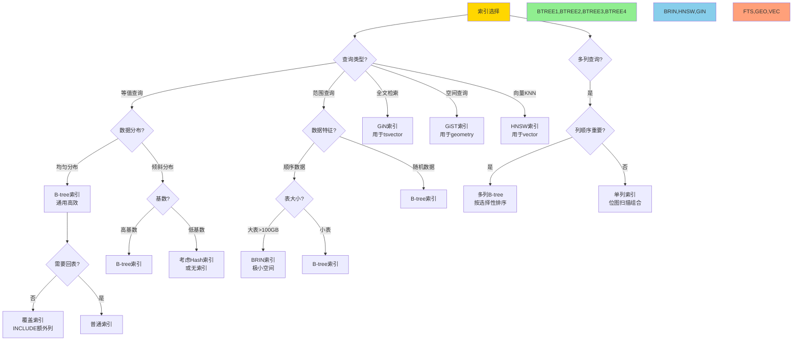
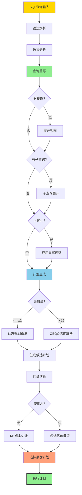

# 思维表征：05-索引与查询优化模块完整本体图

> **创建日期**: 2025-12-03
> **模块**: 05-索引与查询优化
> **概念数**: 120+
> **关系边**: 200+
> **状态**: ✅ Phase 2第3个详细本体图

---

## 📋 完整概念本体图

### 1. 索引与查询优化全景图

```mermaid
graph TB
    %% ========== 根概念 ==========
    ROOT[索引与查询优化] --> IDX[索引结构]
    ROOT --> OPT[查询优化器]
    ROOT --> COST[代价模型]
    ROOT --> MV[物化视图]
    ROOT --> PAR[并行查询]

    %% ========== 索引结构分支 ==========
    IDX --> IDX_TREE[树形索引]
    IDX --> IDX_HASH[哈希索引]
    IDX --> IDX_GEN[通用索引]
    IDX --> IDX_VEC[向量索引]
    IDX --> IDX_SPEC[特殊索引]

    %% 树形索引
    IDX_TREE --> BTREE[B-tree]
    IDX_TREE --> BPLUS[B+-tree]

    BTREE --> BT_NODE[节点结构]
    BTREE --> BT_OP[操作]
    BTREE --> BT_INV[不变式]
    BTREE --> BT_PG18[PG18跳过扫描]

    BT_NODE --> NODE_KEYS[键数组]
    BT_NODE --> NODE_PTR[指针数组]
    BT_NODE --> NODE_LEVEL[节点层次]

    BT_OP --> OP_SEARCH[搜索]
    BT_OP --> OP_INSERT[插入]
    BT_OP --> OP_DELETE[删除]
    BT_OP --> OP_SPLIT[分裂]
    BT_OP --> OP_MERGE[合并]

    BT_INV --> INV_BALANCE[平衡性]
    INV_BALANCE --> ALL_LEAF[所有叶节点同深度]

    BT_INV --> INV_ORDER[有序性]
    INV_ORDER --> KEYS_SORTED[键按序排列]

    BT_PG18 --> SKIP_SCAN[跳过扫描]
    SKIP_SCAN --> SKIP_PREFIX[跳过前缀列]
    SKIP_SCAN --> SKIP_PERF[性能提升3-10x]

    %% 哈希索引
    IDX_HASH --> HASH_FUNC[哈希函数]
    IDX_HASH --> BUCKET[桶]
    IDX_HASH --> COLLISION[冲突处理]

    %% 通用索引
    IDX_GEN --> GIST[GiST通用搜索树]
    IDX_GEN --> GIN[GiN倒排索引]
    IDX_GEN --> SPGIST[SP-GiST空间分区]
    IDX_GEN --> BRIN[BRIN块范围]

    GIST --> GIST_APP[应用]
    GIST_APP --> GIST_GEO[地理数据]
    GIST_APP --> GIST_RANGE[范围类型]

    GIN --> GIN_APP[应用]
    GIN_APP --> GIN_FTS[全文检索]
    GIN_APP --> GIN_JSONB[JSONB查询]
    GIN_APP --> GIN_ARRAY[数组查询]

    BRIN --> BRIN_USE[大表索引]
    BRIN --> BRIN_SEQ[顺序数据]

    %% 向量索引
    IDX_VEC --> HNSW[HNSW层次NSW]
    IDX_VEC --> IVF[IVFFlat倒排文件]

    HNSW --> HNSW_LAYER[多层结构]
    HNSW --> HNSW_SEARCH[层次搜索]
    HNSW --> HNSW_PERF[高性能ANN]

    %% 特殊索引
    IDX_SPEC --> PART_IDX[部分索引]
    IDX_SPEC --> EXPR_IDX[表达式索引]
    IDX_SPEC --> COVER_IDX[覆盖索引]

    %% ========== 查询优化器分支 ==========
    OPT --> OPT_PARSE[解析器]
    OPT --> OPT_REWRITE[重写器]
    OPT --> OPT_PLAN[计划生成器]
    OPT --> OPT_EXEC[执行器]

    %% 重写器
    OPT_REWRITE --> RW_RULE[重写规则]
    RW_RULE --> RW_SEL[选择下推]
    RW_RULE --> RW_PROJ[投影下推]
    RW_RULE --> RW_JOIN[连接重排序]
    RW_RULE --> RW_SUBQ[子查询展开]

    RW_SEL --> PUSH_DOWN[谓词下推优化]
    RW_JOIN --> JOIN_ORDER[连接顺序优化]

    %% 计划生成器
    OPT_PLAN --> PLAN_ALG[生成算法]
    PLAN_ALG --> DP[动态规划]
    PLAN_ALG --> GREEDY[贪心算法]
    PLAN_ALG --> GENETIC[遗传算法]

    DP --> DP_BOTTOM[自底向上]
    DP --> DP_OPTIMAL[全局最优]
    DP --> DP_COMPLEX[O3^n复杂度]

    GREEDY --> GR_LOCAL[局部最优]
    GREEDY --> GR_FAST[On²快速]

    %% 执行器
    OPT_EXEC --> EXEC_SCAN[扫描算子]
    OPT_EXEC --> EXEC_JOIN[连接算子]
    OPT_EXEC --> EXEC_AGG[聚合算子]

    EXEC_SCAN --> SCAN_SEQ[顺序扫描]
    EXEC_SCAN --> SCAN_IDX[索引扫描]
    EXEC_SCAN --> SCAN_IDXONLY[纯索引扫描]
    EXEC_SCAN --> SCAN_BITMAP[位图扫描]

    EXEC_JOIN --> JOIN_NL[嵌套循环]
    EXEC_JOIN --> JOIN_HASH[哈希连接]
    EXEC_JOIN --> JOIN_MERGE[归并连接]

    %% ========== 代价模型分支 ==========
    COST --> COST_IO[I/O代价]
    COST --> COST_CPU[CPU代价]
    COST --> COST_NET[网络代价]

    COST --> STAT[统计信息]
    STAT --> CARD[基数统计]
    STAT --> HIST[直方图]
    STAT --> MCV[最常值]
    STAT --> CORR[相关系数]

    COST --> EST[估算]
    EST --> EST_CARD[基数估算]
    EST --> EST_SEL[选择性估算]
    EST --> EST_COST[代价估算]

    %% AI优化
    COST --> AI_OPT[AI优化]
    AI_OPT --> AI_CARD[ML基数估计]
    AI_OPT --> AI_COST[ML成本估计]
    AI_OPT --> AI_RL[强化学习]

    %% ========== 物化视图分支 ==========
    MV --> MV_CREATE[创建]
    MV --> MV_MAINT[维护]
    MV --> MV_USE[使用]

    MV_MAINT --> MV_INCR[增量维护]
    MV_MAINT --> MV_FULL[完全刷新]

    MV_INCR --> MV_DELTA[代数差分]
    MV_DELTA --> DELTA_RULE[Delta规则]

    MV --> MV_SELF[自维护视图]
    MV_SELF --> KEY_DEP[键依赖]

    MV_USE --> MV_REWRITE[查询重写]
    MV_USE --> MV_SELECT[视图选择]

    %% ========== 并行查询分支 ==========
    PAR --> PAR_SCAN[并行扫描]
    PAR --> PAR_JOIN[并行连接]
    PAR --> PAR_AGG[并行聚合]

    PAR --> PAR_WORKER[Worker进程]
    PAR --> PAR_GATHER[Gather节点]
    PAR --> PAR_BALANCE[负载均衡]

    %% ========== 样式 ==========
    classDef root fill:#FF6B6B,stroke:#333,stroke-width:4px
    classDef level1 fill:#FFD700,stroke:#333,stroke-width:3px
    classDef level2 fill:#90EE90,stroke:#333,stroke-width:2px
    classDef level3 fill:#87CEEB,stroke:#333,stroke-width:2px
    classDef pg18 fill:#FFA07A,stroke:#333,stroke-width:3px

    class ROOT root
    class IDX,OPT,COST,MV,PAR level1
    class BTREE,OPT_REWRITE,STAT,MV_INCR level2
    class BT_PG18,SKIP_SCAN,AI_OPT pg18
```



---

## 2. 核心定理推理链

### 2.1 B-tree平衡性不变式归纳证明



### 2.2 查询等价重写正确性推理链

```mermaid
graph TD
    %% 前提
    P1[前提1: 查询Q1] --> DEF
    P2[前提2: 重写规则R] --> DEF
    P3[前提3: 应用R得到Q2] --> DEF

    DEF[定义: Q1和Q2语义等价<br/>∀D. [Q1]D = [Q2]D]

    %% 推理
    DEF --> RULE_TYPE{重写规则类型}

    %% 选择下推
    RULE_TYPE -->|选择下推| SEL_PUSH[σc R = σc' R'<br/>其中c'更强]
    SEL_PUSH --> SEL_RA[关系代数性质:<br/>σc1σc2 = σc1∧c2]
    SEL_RA --> SEL_EQ[等价性1✓]

    %% 投影下推
    RULE_TYPE -->|投影下推| PROJ_PUSH[πA σc R = σc πA∪attrs©R]
    PROJ_PUSH --> PROJ_RA[关系代数性质:<br/>投影交换]
    PROJ_RA --> PROJ_EQ[等价性2✓]

    %% 连接交换
    RULE_TYPE -->|连接交换| JOIN_COMM[R ⋈ S = S ⋈ R]
    JOIN_COMM --> JOIN_RA[关系代数性质:<br/>连接可交换]
    JOIN_RA --> JOIN_EQ[等价性3✓]

    %% 连接结合
    RULE_TYPE -->|连接结合| JOIN_ASSOC[R ⋈ S ⋈ T<br/>= R ⋈ S ⋈ T]
    JOIN_ASSOC --> JOIN_RA2[关系代数性质:<br/>连接可结合]
    JOIN_RA2 --> JOIN_EQ2[等价性4✓]

    %% 结论
    SEL_EQ --> COMBINE[综合所有等价性]
    PROJ_EQ --> COMBINE
    JOIN_EQ --> COMBINE
    JOIN_EQ2 --> COMBINE

    COMBINE --> RESULT[结论: 重写保持语义<br/>Q1 ≡ Q2]

    RESULT --> APPLY[应用: 选择代价更低的Q2]

    style P1,P2,P3 fill:#FFE4B5
    style SEL_EQ,PROJ_EQ,JOIN_EQ,JOIN_EQ2 fill:#90EE90
    style RESULT fill:#FFD700,stroke:#333,stroke-width:3px
    style APPLY fill:#87CEEB
```

---

## 3. 多维矩阵集合

### 3.1 索引类型全面对比矩阵

| 索引类型 ↓ / 维度 → | 查询类型 | 数据类型 | 复杂度 | 空间 | 维护成本 | 最佳场景 |
|-------------------|---------|---------|--------|------|---------|---------|
| **B-tree** | =, <, >, BETWEEN, ORDER BY | 可排序类型 | O(log n) | 中 | 中 | 通用，默认选择 |
| **Hash** | = | 可哈希类型 | O(1) | 低 | 低 | 等值查询 |
| **GiST** | 空间查询, && | 几何、范围 | O(log n) | 高 | 高 | PostGIS, range |
| **GiN** | @>, ? , @@ | 数组、JSONB、tsvector | O(log n) | 极高 | 高 | 全文检索, JSONB |
| **BRIN** | =, <, > | 顺序数据 | O(n/blocks) | 极低 | 极低 | 大表、顺序数据 |
| **HNSW** | <-> (KNN) | vector | O(log n) | 高 | 中 | 向量相似检索 |
| **IVFFlat** | <-> (KNN) | vector | O(n/lists) | 中 | 低 | 向量召回 |

### 3.2 查询优化算法对比矩阵

| 算法 ↓ / 特性 → | 时间复杂度 | 空间复杂度 | 最优性 | 表数限制 | PG使用场景 |
|---------------|-----------|-----------|--------|---------|-----------|
| **动态规划** | O(3^n) | O(2^n) | 全局最优 | < 12 | 小查询 |
| **贪心算法** | O(n²) | O(n) | 局部最优 | < 100 | 中查询 |
| **遗传算法** | 可配置 | O(n) | 近似最优 | 无限制 | 大查询（研究） |
| **GEQO** | O(generations×popsize) | O(popsize) | 近似 | > 12 | PG大查询 |

### 3.3 连接算法选择矩阵

| 连接算法 ↓ / 数据特征 → | 小×小 | 小×大 | 大×大 | 已排序 | 连接列有索引 | 内存充足 |
|----------------------|------|------|------|--------|------------|---------|
| **嵌套循环NL** | ✅ 最优 | ⚠️ 可行 | ❌ 差 | ⚠️ | ✅ 优 | ⚠️ |
| **索引嵌套循环** | ⚠️ | ✅ 优 | ⚠️ | ⚠️ | ✅ 必需 | ⚠️ |
| **哈希连接Hash** | ⚠️ | ✅ 优 | ✅ 优 | ❌ | ⚠️ | ✅ 必需 |
| **归并连接Merge** | ⚠️ | ⚠️ | ✅ 优 | ✅ 最优 | ⚠️ | ⚠️ |

**说明**：

- ✅ = 最佳选择
- ⚠️ = 可行但非最优
- ❌ = 不推荐

### 3.4 物化视图使用场景矩阵

| 场景 ↓ / 评估 → | 查询频率 | 查询复杂度 | 数据更新频率 | 存储空间 | 建议 |
|---------------|---------|-----------|------------|---------|------|
| **OLAP报表** | 极高 | 极高 | 低（每日） | 充足 | ✅ 强烈推荐 |
| **实时仪表板** | 高 | 高 | 中（每小时） | 充足 | ✅ 推荐 |
| **OLTP查询** | 中 | 低 | 极高（每秒） | 有限 | ❌ 不推荐 |
| **数据分析** | 高 | 极高 | 低（每周） | 充足 | ✅ 强烈推荐 |
| **缓存层** | 极高 | 中 | 中（可控） | 充足 | ✅ 推荐 |

---

## 4. 决策树集合

### 4.1 索引选择决策树



### 4.2 查询优化器执行流程决策树



---

## 5. 概念属性完整定义

### 5.1 B-tree索引完整定义卡片

#### B-tree (I01)

**基本信息**：

```yaml
ID: I01
名称: B-tree (Balanced Tree)
中文: 平衡树
抽象层次: M2(理论层) + M1(实现层)
模块: 05-索引与查询优化
```

**属性**：

```yaml
结构特点:
  - 多路搜索树（m叉树，m通常为几百）
  - 所有叶节点深度相同（平衡性）
  - 节点内键有序
  - PostgreSQL使用B+-tree变种

性能:
  查询: O(log_m n) ≈ 3-4次I/O
  插入: O(log_m n) + 可能分裂
  删除: O(log_m n) + 可能合并
  空间: O(n) 通常1.2-1.5倍数据大小

适用查询:
  - 等值查询: =
  - 范围查询: <, >, BETWEEN
  - 排序: ORDER BY
  - LIKE: 'prefix%'

不适用:
  - 全文检索
  - 空间查询
  - 向量相似
```

**不变式**：

```text
INV1: ∀ leaf_nodes. depth(leaf) = d (同深度)
INV2: ∀ internal_node. ⌈m/2⌉ ≤ keys ≤ m (半满)
INV3: ∀ node. keys sorted (有序)
INV4: ∀ node, i. subtree(i).keys < key[i] < subtree(i+1).keys (搜索性)
```

**PostgreSQL实现**：

```c
// B-tree页结构
typedef struct BTPageOpaqueData {
    BlockNumber btpo_prev;    // 前一页
    BlockNumber btpo_next;    // 后一页
    uint16 btpo_level;        // 层次(0=叶节点)
    uint16 btpo_flags;        // 标志
} BTPageOpaqueData;

// PostgreSQL 18: 跳过扫描
typedef struct IndexSkipScanState {
    ScanKey *skip_scan_keys;  // 跳过扫描键
    int num_skip_keys;        // 跳过键数量
    bool skip_scan_enabled;   // 是否启用
} IndexSkipScanState;
```

**定理**：

- 平衡性不变式定理
- 搜索正确性定理
- 插入复杂度定理

---

## 6. AI优化器深度本体

### 6.1 学习型优化器完整架构

```mermaid
graph TB
    AI_OPT[学习型优化器] --> LEARN[学习模块]
    AI_OPT --> INFER[推理模块]
    AI_OPT --> FEEDBACK[反馈模块]

    %% 学习模块
    LEARN --> L_CARD[基数估计学习]
    LEARN --> L_COST[成本模型学习]
    LEARN --> L_PLAN[计划选择学习]

    L_CARD --> L_C_DATA[训练数据: 查询+实际基数]
    L_CARD --> L_C_MODEL[模型: 深度神经网络]
    L_CARD --> L_C_FEAT[特征: 查询模式、统计信息]

    L_COST --> L_CO_DATA[训练数据: 计划+实际耗时]
    L_COST --> L_CO_MODEL[模型: 回归模型]
    L_COST --> L_CO_FEAT[特征: 算子类型、数据量]

    L_PLAN --> L_P_DATA[训练数据: 查询+最优计划]
    L_PLAN --> L_P_MODEL[模型: 强化学习]
    L_P_MODEL --> L_P_RL[DQN/PPO算法]

    %% 推理模块
    INFER --> I_PREDICT[预测]
    INFER --> I_DECIDE[决策]

    I_PREDICT --> PRED_CARD[预测基数]
    I_PREDICT --> PRED_COST[预测成本]

    I_DECIDE --> DEC_JOIN[决策连接顺序]
    I_DECIDE --> DEC_SCAN[决策扫描方式]
    I_DECIDE --> DEC_PLAN[选择最优计划]

    %% 反馈模块
    FEEDBACK --> F_COLLECT[收集执行数据]
    FEEDBACK --> F_COMPARE[对比预测与实际]
    FEEDBACK --> F_UPDATE[更新模型]

    F_COLLECT --> F_TIME[实际执行时间]
    F_COLLECT --> F_CARD[实际基数]
    F_COLLECT --> F_RESOURCE[资源消耗]

    F_UPDATE --> RETRAIN[重新训练]
    F_UPDATE --> FINETUNE[微调模型]

    %% 样式
    style AI_OPT fill:#FF6B6B,stroke:#333,stroke-width:4px
    style LEARN fill:#FFD700,stroke:#333,stroke-width:3px
    style INFER fill:#90EE90,stroke:#333,stroke-width:3px
    style FEEDBACK fill:#87CEEB,stroke:#333,stroke-width:3px
```



---

## 7. Phase 2进度更新

### 7.1 已完成模块

| 模块 | 概念数 | 本体图 | 推理链 | 决策树 | 矩阵 | 完成度 |
|-----|-------|--------|--------|--------|------|--------|
| 07-安全 | 45+ | ✅ | 2 | 1 | 3 | 100% |
| 03-事务 | 85+ | ✅ | 2 | 3 | 4 | 100% |
| 05-索引 | 120+ | ✅ | 2 | 2 | 4 | 100% |

**总计**: 3/18模块，**Phase 2进度: 17%**

### 7.2 思维表征累计

| 类型 | 已创建 | 目标 | 进度 |
|-----|-------|------|------|
| **详细本体图** | 3 | 18 | 17% |
| **推理链图** | 6 | 40+ | 15% |
| **决策树** | 6 | 30+ | 20% |
| **多维矩阵** | 11 | 20+ | 55% |

---

**创建日期**: 2025-12-03
**状态**: ✅ 第3个详细本体图完成
**Phase 2进度**: 17%
**下一步**: 🚀 继续推进！
