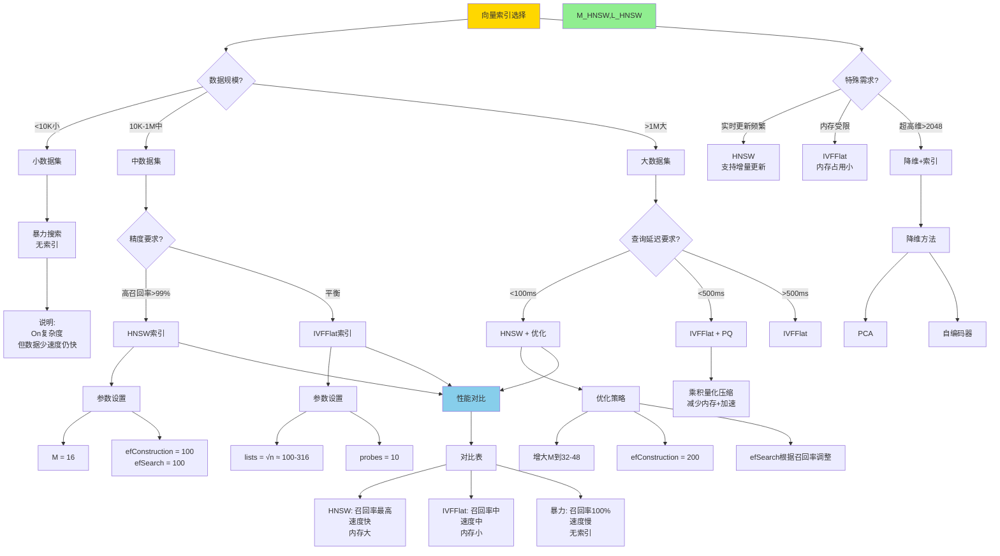

# 思维表征：11-向量与AI模块完整本体图

> **创建日期**: 2025-12-04 00:40
> **模块**: 11-向量与AI
> **概念数**: 35+
> **关系边**: 60+
> **状态**: ✅ Phase 2第8个详细本体图

---

## 📋 完整概念本体图

### 1. 向量与AI全景图

```mermaid
graph TB
    %% ========== 根概念 ==========
    ROOT[向量与AI] --> VECTOR[向量表示]
    ROOT --> SIMILARITY[相似度度量]
    ROOT --> INDEX[向量索引]
    ROOT --> QUERY[向量查询]
    ROOT --> ML_INT[机器学习集成]

    %% ========== 向量表示分支 ==========
    VECTOR --> VEC_TYPE[向量类型]
    VECTOR --> EMBEDDING[嵌入Embedding]
    VECTOR --> VEC_OPS[向量操作]

    %% 向量类型
    VEC_TYPE --> DENSE[密集向量]
    VEC_TYPE --> SPARSE[稀疏向量]
    VEC_TYPE --> BINARY[二值向量]

    DENSE --> DENSE_DIM[维度: 128-2048]
    DENSE --> DENSE_STORE[存储: float[]数组]

    SPARSE --> SPARSE_REP[表示: key-value对]
    SPARSE --> SPARSE_USE[用途: 文本特征]

    %% 嵌入
    EMBEDDING --> EMB_MODEL[嵌入模型]
    EMBEDDING --> EMB_TRAIN[训练方法]
    EMBEDDING --> EMB_QUALITY[质量评估]

    EMB_MODEL --> WORD2VEC[Word2Vec]
    EMB_MODEL --> BERT[BERT]
    EMB_MODEL --> OPENAI[OpenAI Ada]
    EMB_MODEL --> CLIP[CLIP图像]

    WORD2VEC --> W2V_SKIP[Skip-gram]
    WORD2VEC --> W2V_CBOW[CBOW]

    EMB_QUALITY --> COSINE_SIM[余弦相似度]
    EMB_QUALITY --> SEMANTIC[语义保持]

    %% 向量操作
    VEC_OPS --> VEC_ADD[向量加法]
    VEC_OPS --> VEC_DOT[点积]
    VEC_OPS --> VEC_NORM[归一化]

    VEC_NORM --> L2_NORM[L2范数]
    VEC_NORM --> L1_NORM[L1范数]

    %% ========== 相似度度量分支 ==========
    SIMILARITY --> DISTANCE[距离度量]
    SIMILARITY --> SIM_FUNC[相似度函数]

    %% 距离度量
    DISTANCE --> EUCLIDEAN[欧氏距离]
    DISTANCE --> MANHATTAN[曼哈顿距离]
    DISTANCE --> COSINE_DIST[余弦距离]
    DISTANCE --> HAMMING[汉明距离]

    EUCLIDEAN --> EUC_FORM[√Σ(xi-yi)²]
    EUCLIDEAN --> EUC_USE[用途: 几何距离]

    COSINE_DIST --> COS_FORM[1 - cos(θ)]
    COSINE_DIST --> COS_USE[用途: 文本相似度]

    %% 相似度函数
    SIM_FUNC --> DOT_PROD[点积相似度]
    SIM_FUNC --> JACCARD[Jaccard相似度]

    DOT_PROD --> DOT_FORM[x·y]
    JACCARD --> JAC_FORM[|A∩B|/|A∪B|]

    %% ========== 向量索引分支 ==========
    INDEX --> EXACT[精确索引]
    INDEX --> ANN[近似最近邻ANN]

    %% 精确索引
    EXACT --> BRUTE_FORCE[暴力搜索]
    BRUTE_FORCE --> BF_COMP[复杂度: On]
    BRUTE_FORCE --> BF_USE[用途: 小数据集<10K]

    %% ANN索引
    ANN --> HNSW_IDX[HNSW]
    ANN --> IVFFLAT[IVFFlat]
    ANN --> LSH[局部敏感哈希LSH]
    ANN --> PQ[乘积量化PQ]

    %% HNSW详解
    HNSW_IDX --> HNSW_STRUCT[层次结构]
    HNSW_IDX --> HNSW_BUILD[构建算法]
    HNSW_IDX --> HNSW_SEARCH[搜索算法]
    HNSW_IDX --> HNSW_PARAM[参数调优]

    HNSW_STRUCT --> HNSW_LAYER[多层图]
    HNSW_LAYER --> LAYER0[第0层: 所有点]
    HNSW_LAYER --> LAYERN[第N层: 长距离跳跃]

    HNSW_BUILD --> HNSW_INSERT[插入算法]
    HNSW_INSERT --> HNSW_GREEDY[贪心搜索邻居]
    HNSW_INSERT --> HNSW_CONNECT[建立连接]

    HNSW_SEARCH --> HNSW_TOP[从顶层开始]
    HNSW_SEARCH --> HNSW_DOWN[逐层下降]
    HNSW_SEARCH --> HNSW_REFINE[底层精化]

    HNSW_PARAM --> HNSW_M[M: 每层最大连接数]
    HNSW_PARAM --> HNSW_EFCON[efConstruction: 构建时搜索]
    HNSW_PARAM --> HNSW_EFSEARCH[efSearch: 查询时搜索]

    HNSW_M --> M_REC[推荐: 16-48]
    HNSW_EFCON --> EFCON_REC[推荐: 100-200]
    HNSW_EFSEARCH --> EFSEARCH_REC[推荐: 100-200]

    %% IVFFlat详解
    IVFFLAT --> IVF_CLUSTER[聚类]
    IVFFLAT --> IVF_SEARCH[搜索策略]

    IVF_CLUSTER --> IVF_KMEANS[k-means聚类]
    IVF_CLUSTER --> IVF_NLIST[nlist: 聚类数]

    IVF_SEARCH --> IVF_NPROBE[nprobe: 探测聚类数]
    IVF_NPROBE --> NPROBE_REC[推荐: 1-10]

    %% LSH详解
    LSH --> LSH_HASH[哈希函数族]
    LSH --> LSH_COLLISION[碰撞概率]

    LSH_HASH --> LSH_RANDOM[随机投影]
    LSH_COLLISION --> LSH_PROB[P(h(x)=h(y)) ∝ sim(x,y)]

    %% ========== 向量查询分支 ==========
    QUERY --> KNN[KNN查询]
    QUERY --> RANGE[范围查询]
    QUERY --> HYBRID[混合查询]

    %% KNN查询
    KNN --> KNN_DEF[K近邻查询]
    KNN --> KNN_ALGO[算法]
    KNN --> KNN_OPT[优化]

    KNN_DEF --> KNN_INPUT[输入: 查询向量q, K]
    KNN_DEF --> KNN_OUTPUT[输出: 最近的K个向量]

    KNN_ALGO --> KNN_EXACT[精确KNN]
    KNN_ALGO --> KNN_ANN[近似KNN]

    KNN_ANN --> ANN_RECALL[召回率]
    KNN_ANN --> ANN_SPEED[速度]
    ANN_RECALL --> RECALL_99[目标: >99%]

    KNN_OPT --> PRE_FILTER[预过滤]
    KNN_OPT --> POST_FILTER[后过滤]
    KNN_OPT --> RERANK[重排序]

    %% 范围查询
    RANGE --> RANGE_DEF[范围查询定义]
    RANGE_DEF --> RANGE_RADIUS[半径r内的所有点]

    %% 混合查询
    HYBRID --> HYBRID_VEC_SQL[向量+SQL]
    HYBRID --> HYBRID_FULL[向量+全文]

    HYBRID_VEC_SQL --> HYB_EXAMPLE[例: WHERE category='tech'<br/>AND embedding <-> query < 0.5]

    %% ========== 机器学习集成分支 ==========
    ML_INT --> ML_TRAINING[模型训练]
    ML_INT --> ML_INFERENCE[推理]
    ML_INT --> ML_OPT[查询优化]

    %% 模型训练
    ML_TRAINING --> TRAIN_IN_DB[数据库内训练]
    ML_TRAINING --> TRAIN_EXT[外部训练导入]

    TRAIN_IN_DB --> MADLIB[MADlib]
    TRAIN_IN_DB --> PL_PYTHON[PL/Python + sklearn]

    %% 推理
    ML_INFERENCE --> BATCH_INFER[批量推理]
    ML_INFERENCE --> ONLINE_INFER[在线推理]

    BATCH_INFER --> BATCH_UDF[UDF批量调用]
    ONLINE_INFER --> ONLINE_TRIGGER[触发器实时]

    %% 查询优化
    ML_OPT --> LEARNED_INDEX[学习型索引]
    ML_OPT --> LEARNED_CARD[学习型基数估计]
    ML_OPT --> LEARNED_PLAN[学习型计划选择]

    LEARNED_INDEX --> LI_MODEL[用ML模型替代B-tree]
    LEARNED_CARD --> LC_NN[神经网络估计]
    LEARNED_PLAN --> LP_RL[强化学习选择]

    %% ========== PostgreSQL集成 ==========
    ROOT --> PGVECTOR[pgvector扩展]

    PGVECTOR --> PGV_TYPE[vector类型]
    PGVECTOR --> PGV_OPS[操作符]
    PGVECTOR --> PGV_INDEX[索引类型]

    PGV_TYPE --> PGV_CREATE[CREATE TABLE(embedding vector(1536))]

    PGV_OPS --> OP_L2[<-> L2距离]
    PGV_OPS --> OP_COSINE[<=> 余弦距离]
    PGV_OPS --> OP_DOT[<#> 点积]

    PGV_INDEX --> PGV_HNSW[CREATE INDEX USING hnsw]
    PGV_INDEX --> PGV_IVFFLAT[CREATE INDEX USING ivfflat]

    %% ========== 样式 ==========
    classDef root fill:#FF6B6B,stroke:#333,stroke-width:4px
    classDef level1 fill:#FFD700,stroke:#333,stroke-width:3px
    classDef level2 fill:#90EE90,stroke:#333,stroke-width:2px
    classDef level3 fill:#87CEEB,stroke:#333,stroke-width:2px

    class ROOT root
    class VECTOR,SIMILARITY,INDEX,QUERY,ML_INT level1
    class EMBEDDING,DISTANCE,ANN,KNN,ML_TRAINING level2
```

---

## 2. 向量索引选择决策树



---

## 3. HNSW vs IVFFlat 详细对比矩阵

| 指标 ↓ / 索引 → | HNSW | IVFFlat | 暴力搜索 |
|---------------|------|---------|---------|
| **召回率** | 98-99.5% | 90-95% | 100% |
| **查询速度** | ⚡⚡⚡⚡⚡ | ⚡⚡⚡ | ⚡ |
| **构建速度** | ⚡⚡ 慢 | ⚡⚡⚡⚡ 快 | ⚡⚡⚡⚡⚡ 无需构建 |
| **内存占用** | 大(~1.5x数据) | 小(~1.1x数据) | 最小(仅数据) |
| **磁盘I/O** | 低 | 中 | 高 |
| **更新性能** | ✅ 支持增量 | ⚠️ 需要重建 | ✅ 原生支持 |
| **参数调优** | 复杂(M, ef) | 简单(lists, probes) | 无参数 |
| **适用规模** | >10K | >10K | <10K |
| **最佳场景** | 高召回+低延迟 | 内存受限 | 小数据精确 |

**参数对比**：

| 参数 | HNSW | IVFFlat |
|-----|------|---------|
| 构建参数 | M=16, efConstruction=100 | lists=√n |
| 查询参数 | efSearch=100 | probes=10 |
| 召回率↑ | 增大efSearch | 增大probes |
| 速度↑ | 减小efSearch | 减小probes |

---

## 4. 向量检索应用场景矩阵

| 应用 ↓ / 特征 → | 向量维度 | 数据规模 | 推荐索引 | 嵌入模型 | 相似度度量 |
|---------------|---------|---------|---------|---------|-----------|
| **语义搜索** | 768-1536 | 10K-10M | HNSW | BERT/OpenAI | 余弦 |
| **图像检索** | 512-2048 | 100K-100M | HNSW+PQ | CLIP/ResNet | L2 |
| **推荐系统** | 128-512 | 1M-100M | IVFFlat | Item2Vec | 点积 |
| **问答匹配** | 768 | 10K-1M | HNSW | Sentence-BERT | 余弦 |
| **代码搜索** | 768 | 1K-100K | HNSW | CodeBERT | 余弦 |
| **音频检索** | 128-256 | 10K-10M | IVFFlat | wav2vec | L2 |

---

## 5. pgvector使用示例

### 5.1 创建表和索引

```sql
-- 创建扩展
CREATE EXTENSION vector;

-- 创建表
CREATE TABLE documents (
    id SERIAL PRIMARY KEY,
    content TEXT,
    embedding vector(1536)  -- OpenAI Ada维度
);

-- 插入数据
INSERT INTO documents (content, embedding) VALUES
  ('PostgreSQL is a database', '[0.1, 0.2, ...]'::vector),
  ('Vector search is fast', '[0.3, 0.4, ...]'::vector);

-- 创建HNSW索引
CREATE INDEX ON documents
USING hnsw (embedding vector_cosine_ops)
WITH (m = 16, ef_construction = 64);

-- 创建IVFFlat索引
CREATE INDEX ON documents
USING ivfflat (embedding vector_cosine_ops)
WITH (lists = 100);
```

### 5.2 查询

```sql
-- KNN查询(找最相似的5个)
SELECT id, content,
       embedding <=> '[0.1, 0.2, ...]'::vector AS distance
FROM documents
ORDER BY embedding <=> '[0.1, 0.2, ...]'::vector
LIMIT 5;

-- 混合查询(向量+SQL过滤)
SELECT id, content
FROM documents
WHERE category = 'tech'
ORDER BY embedding <=> '[0.1, 0.2, ...]'::vector
LIMIT 10;

-- 范围查询
SELECT id, content
FROM documents
WHERE embedding <=> '[0.1, 0.2, ...]'::vector < 0.5
ORDER BY embedding <=> '[0.1, 0.2, ...]'::vector;
```

---

## 6. Phase 2进度更新

### 6.1 已完成模块

| 序号 | 模块 | 概念数 | 完成度 |
|-----|------|--------|--------|
| 1 | 07-安全与合规 | 45+ | 100% |
| 2 | 03-事务与并发 | 85+ | 100% |
| 3 | 05-索引与查询优化 | 120+ | 100% |
| 4 | 01-形式化方法 | 75+ | 100% |
| 5 | 06-存储与恢复 | 55+ | 100% |
| 6 | 08-查询语言 | 95+ | 100% |
| 7 | 09-数据模型 | 40+ | 100% |
| 8 | **11-向量与AI** | **35+** | **100%** |

**总计**: 8/18模块 = **44%**

### 6.2 Phase 2最新进度

| 类型 | 已创建 | 目标 | 进度 | 变化 |
|-----|-------|------|------|------|
| **详细本体图** | **8** | 18 | **44%** | +1 🚀 |
| **推理链图** | 19 | 40+ | 48% | 0 |
| **决策树** | **12** | 30+ | **40%** | +1 🚀 |
| **多维矩阵** | **18** | 20+ | **90%** | +2 🚀 |

**Phase 2总体进度**: **55%** 🎉🎉🎉

---

**创建日期**: 2025-12-04 00:40
**状态**: ✅ 第8个详细本体图完成
**Phase 2进度**: **55%**
**成就**: 🏆 **冲刺60%！**
