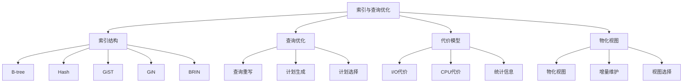
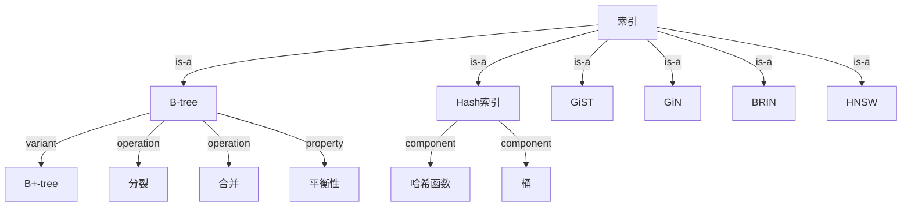
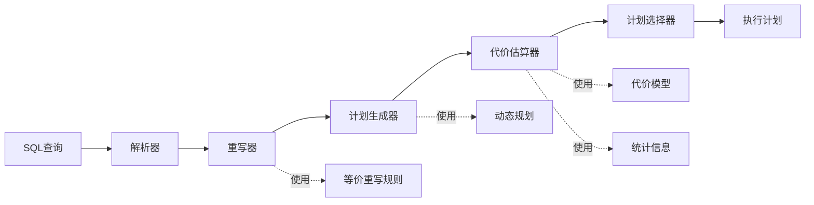
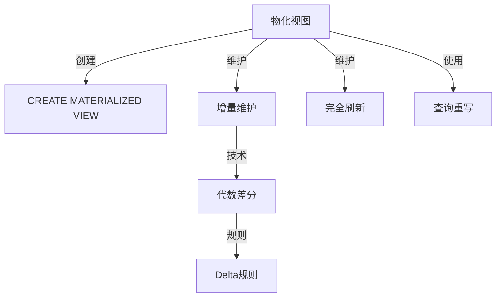
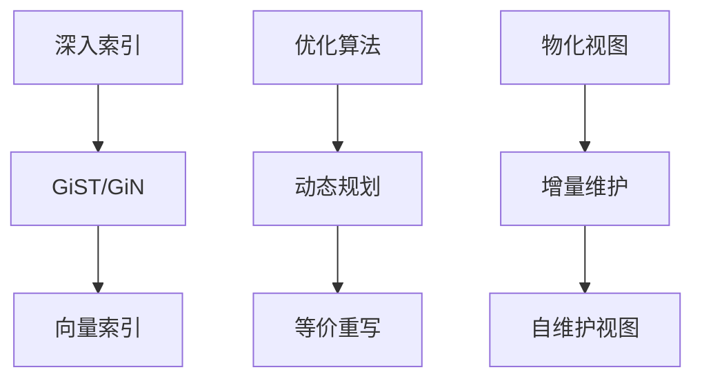
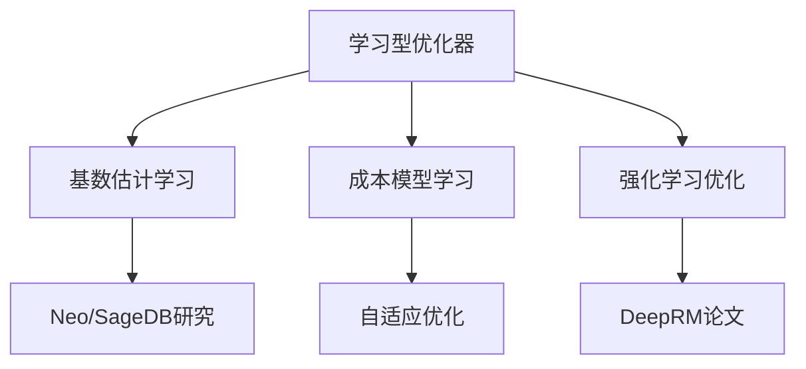

# 概念本体：05-索引与查询优化模块

> **提取日期**: 2025-12-03
> **来源模块**: 05-索引与查询优化（16个文档）
> **概念数量**: 120+
> **状态**: ✅ 提取完成

---

## 📋 概念分类体系

### 顶层概念架构



---

## 1. 核心概念清单

### 1.1 元概念层（Meta-Concepts）

| ID | 概念名称 | 英文名 | 定义 | 抽象层次 |
|----|---------|--------|------|---------|
| QO01 | **查询优化** | Query Optimization | 选择最优查询执行计划的过程 | 元概念 |
| QO02 | **索引** | Index | 加速数据检索的数据结构 | 元概念 |
| QO03 | **查询计划** | Query Plan | 查询的执行策略 | 元概念 |
| QO04 | **代价** | Cost | 查询执行的资源消耗估算 | 元概念 |
| QO05 | **选择性** | Selectivity | 查询条件筛选数据的比例 | 元概念 |

### 1.2 查询优化理论（Query Optimization Theory）

#### 1.2.1 优化器组件

| ID | 概念名称 | 英文名 | 定义 | 依赖概念 | 关系 |
|----|---------|--------|------|---------|------|
| O01 | **查询优化器** | Query Optimizer | 生成最优查询计划的组件 | QO01 | implements |
| O02 | **查询解析器** | Query Parser | 解析SQL生成查询树 | O01 | part-of |
| O03 | **查询重写器** | Query Rewriter | 等价变换查询 | O01 | part-of |
| O04 | **计划生成器** | Plan Generator | 生成候选执行计划 | O01 | part-of |
| O05 | **代价估算器** | Cost Estimator | 估算计划执行代价 | O01 | part-of |
| O06 | **计划选择器** | Plan Selector | 选择最优计划 | O01 | part-of |

#### 1.2.2 等价重写

| ID | 概念名称 | 英文名 | 定义 | 依赖概念 | 关系 |
|----|---------|--------|------|---------|------|
| R01 | **等价重写** | Equivalence Rewrite | 保持语义的查询变换 | QO01 | technique |
| R02 | **选择下推** | Selection Pushdown | 将过滤条件下推 | R01 | rule |
| R03 | **投影下推** | Projection Pushdown | 将列选择下推 | R01 | rule |
| R04 | **连接重排序** | Join Reordering | 改变连接顺序 | R01 | rule |
| R05 | **子查询展开** | Subquery Unnesting | 将子查询转换为连接 | R01 | rule |
| R06 | **公共表达式提取** | Common Expression Extraction | 提取重复表达式 | R01 | rule |
| R07 | **谓词传递** | Predicate Propagation | 推导新的谓词 | R01 | rule |

#### 1.2.3 计划生成算法

| ID | 概念名称 | 英文名 | 定义 | 依赖概念 | 复杂度 |
|----|---------|--------|------|---------|--------|
| A01 | **动态规划** | Dynamic Programming | 自底向上生成最优计划 | O04 | O(3^n) |
| A02 | **贪心算法** | Greedy Algorithm | 每步选择局部最优 | O04 | O(n²) |
| A03 | **遗传算法** | Genetic Algorithm | 进化算法搜索空间 | O04 | 启发式 |
| A04 | **模拟退火** | Simulated Annealing | 概率搜索算法 | O04 | 启发式 |
| A05 | **随机采样** | Random Sampling | 随机生成候选计划 | O04 | 快速但不保证最优 |

### 1.3 索引结构（Index Structures）

#### 1.3.1 B-tree索引

| ID | 概念名称 | 英文名 | 定义 | 依赖概念 | PostgreSQL对应 |
|----|---------|--------|------|---------|----------------|
| I01 | **B-tree** | Balanced Tree | 平衡的多路搜索树 | QO02 | btree |
| I02 | **B+-tree** | B+ Tree | 数据仅在叶节点的B-tree | I01 | PostgreSQL实现 |
| I03 | **节点** | Node | B-tree的单元 | I01 | Page |
| I04 | **分裂** | Split | 节点满时分裂为两个 | I01 | 维护操作 |
| I05 | **合并** | Merge | 节点少时合并 | I01 | 维护操作 |
| I06 | **平衡性** | Balance | 所有叶节点深度相同 | I01 | 不变式 |
| I07 | **填充因子** | Fill Factor | 节点的填充比例 | I01 | 性能参数 |
| I08 | **索引跳过扫描** | Index Skip Scan | PostgreSQL 18新特性 | I01 | PG18优化 |

#### 1.3.2 Hash索引

| ID | 概念名称 | 英文名 | 定义 | 依赖概念 | 特点 |
|----|---------|--------|------|---------|------|
| I10 | **Hash索引** | Hash Index | 基于哈希函数的索引 | QO02 | 等值查询快 |
| I11 | **哈希函数** | Hash Function | 将键映射到桶 | I10 | 散列 |
| I12 | **桶** | Bucket | 存储哈希值相同的记录 | I10 | 存储单元 |
| I13 | **冲突** | Collision | 不同键映射到同一桶 | I10 | 性能问题 |
| I14 | **扩展散列** | Extendible Hashing | 动态调整桶数量 | I10 | 动态扩展 |

#### 1.3.3 通用索引（GiST/GiN）

| ID | 概念名称 | 英文名 | 定义 | 依赖概念 | 应用 |
|----|---------|--------|------|---------|------|
| I20 | **GiST** | Generalized Search Tree | 通用搜索树框架 | QO02 | 空间数据 |
| I21 | **GiN** | Generalized Inverted Index | 通用倒排索引 | QO02 | 全文检索 |
| I22 | **SP-GiST** | Space-Partitioned GiST | 空间分区GiST | I20 | 空间索引 |
| I23 | **BRIN** | Block Range Index | 块范围索引 | QO02 | 大表索引 |
| I24 | **HNSW** | Hierarchical NSW | 向量检索索引 | QO02 | pgvector |

### 1.4 代价模型（Cost Model）

#### 1.4.1 代价组件

| ID | 概念名称 | 英文名 | 定义 | 依赖概念 | 单位 |
|----|---------|--------|------|---------|------|
| C01 | **代价模型** | Cost Model | 估算查询执行代价的模型 | QO04 | 抽象代价 |
| C02 | **I/O代价** | I/O Cost | 磁盘读写代价 | C01 | 页数 |
| C03 | **CPU代价** | CPU Cost | 计算代价 | C01 | 元组数 |
| C04 | **网络代价** | Network Cost | 数据传输代价 | C01 | 字节数 |
| C05 | **启动代价** | Startup Cost | 开始执行的固定代价 | C01 | 时间 |
| C06 | **总代价** | Total Cost | 完整执行的总代价 | C01 | 时间 |

#### 1.4.2 统计信息

| ID | 概念名称 | 英文名 | 定义 | 依赖概念 | PostgreSQL对应 |
|----|---------|--------|------|---------|----------------|
| S01 | **统计信息** | Statistics | 数据分布的统计数据 | C01 | pg_statistics |
| S02 | **基数** | Cardinality | 关系的元组数量 | S01 | reltuples |
| S03 | **选择性** | Selectivity | 谓词筛选的比例 | S01 | 估算值 |
| S04 | **直方图** | Histogram | 数据分布的统计 | S01 | histogram_bounds |
| S05 | **MCV** | Most Common Values | 最常见值列表 | S01 | most_common_vals |
| S06 | **NULL比例** | NULL Fraction | NULL值的比例 | S01 | null_frac |
| S07 | **相关系数** | Correlation | 物理顺序与逻辑顺序的相关性 | S01 | correlation |

### 1.5 物化视图（Materialized Views）

#### 1.5.1 物化视图基础

| ID | 概念名称 | 英文名 | 定义 | 依赖概念 | 关系 |
|----|---------|--------|------|---------|------|
| MV01 | **物化视图** | Materialized View | 存储查询结果的视图 | QO03 | 查询优化技术 |
| MV02 | **增量维护** | Incremental Maintenance | 只更新变化部分 | MV01 | 维护方法 |
| MV03 | **完全刷新** | Full Refresh | 重新计算整个视图 | MV01 | 维护方法 |
| MV04 | **自维护视图** | Self-Maintainable View | 可增量维护的视图 | MV01, MV02 | 特殊类型 |
| MV05 | **视图选择** | View Selection | 选择要物化的视图 | MV01 | 优化问题 |
| MV06 | **查询重写** | Query Rewriting | 用视图改写查询 | MV01 | 使用方法 |

#### 1.5.2 增量维护理论

| ID | 概念名称 | 英文名 | 定义 | 依赖概念 | 关系 |
|----|---------|--------|------|---------|------|
| MV10 | **代数差分** | Algebraic Differencing | 计算查询的增量 | MV02 | 理论基础 |
| MV11 | **Delta规则** | Delta Rules | 增量计算规则 | MV10 | 算法 |
| MV12 | **键依赖** | Key Dependency | 主键的依赖关系 | MV04 | 可维护性判据 |
| MV13 | **传递更新** | Transitive Update | 级联更新机制 | MV02 | 维护方法 |

### 1.6 查询执行算子（Query Operators）

#### 1.6.1 扫描算子

| ID | 概念名称 | 英文名 | 定义 | 依赖概念 | 代价 |
|----|---------|--------|------|---------|------|
| OP01 | **顺序扫描** | Sequential Scan | 逐行扫描表 | QO03 | O(n) |
| OP02 | **索引扫描** | Index Scan | 通过索引访问 | QO02, QO03 | O(log n + k) |
| OP03 | **索引唯一扫描** | Index Only Scan | 只扫描索引 | OP02 | O(log n) |
| OP04 | **位图扫描** | Bitmap Scan | 批量索引访问 | OP02 | O(log n + k) |
| OP05 | **TID扫描** | TID Scan | 通过元组ID访问 | QO03 | O(1) |

#### 1.6.2 连接算子

| ID | 概念名称 | 英文名 | 定义 | 依赖概念 | 复杂度 |
|----|---------|--------|------|---------|--------|
| OP10 | **嵌套循环连接** | Nested Loop Join | 双层循环 | QO03 | O(n×m) |
| OP11 | **哈希连接** | Hash Join | 基于哈希表 | QO03 | O(n+m) |
| OP12 | **归并连接** | Merge Join | 基于排序 | QO03 | O(n log n + m log m) |
| OP13 | **半连接** | Semi Join | 只返回左表匹配行 | OP10 | EXISTS查询 |
| OP14 | **反连接** | Anti Join | 只返回左表不匹配行 | OP10 | NOT EXISTS查询 |

#### 1.6.3 聚合算子

| ID | 概念名称 | 英文名 | 定义 | 依赖概念 | 关系 |
|----|---------|--------|------|---------|------|
| OP20 | **哈希聚合** | Hash Aggregate | 基于哈希表的聚合 | QO03 | O(n) |
| OP21 | **排序聚合** | Sort Aggregate | 基于排序的聚合 | QO03 | O(n log n) |
| OP22 | **分组** | Group By | 按列分组 | OP20 | SQL语句 |

### 1.7 优化技术（Optimization Techniques）

#### 1.7.1 分区技术

| ID | 概念名称 | 英文名 | 定义 | 依赖概念 | PostgreSQL支持 |
|----|---------|--------|------|---------|----------------|
| PT01 | **表分区** | Table Partitioning | 将表分割为多个分区 | QO01 | ✅ 原生支持 |
| PT02 | **范围分区** | Range Partitioning | 按值范围分区 | PT01 | PARTITION BY RANGE |
| PT03 | **列表分区** | List Partitioning | 按值列表分区 | PT01 | PARTITION BY LIST |
| PT04 | **哈希分区** | Hash Partitioning | 按哈希值分区 | PT01 | PARTITION BY HASH |
| PT05 | **分区裁剪** | Partition Pruning | 跳过不相关分区 | PT01 | 查询优化 |
| PT06 | **分区智能连接** | Partition-wise Join | 分区间独立连接 | PT01 | 并行优化 |

#### 1.7.2 并行查询

| ID | 概念名称 | 英文名 | 定义 | 依赖概念 | 关系 |
|----|---------|--------|------|---------|------|
| PA01 | **并行查询** | Parallel Query | 多进程执行查询 | QO03 | 性能优化 |
| PA02 | **并行扫描** | Parallel Scan | 多进程扫描表 | PA01 | 操作 |
| PA03 | **并行连接** | Parallel Join | 多进程执行连接 | PA01 | 操作 |
| PA04 | **Gather节点** | Gather Node | 收集并行结果 | PA01 | 同步点 |
| PA05 | **负载均衡** | Load Balancing | 均衡工作负载 | PA01 | 调度策略 |

#### 1.7.3 部分索引与约束

| ID | 概念名称 | 英文名 | 定义 | 依赖概念 | 关系 |
|----|---------|--------|------|---------|------|
| PI01 | **部分索引** | Partial Index | 只索引满足条件的行 | QO02 | 空间优化 |
| PI02 | **表达式索引** | Expression Index | 索引表达式结果 | QO02 | 功能索引 |
| PI03 | **约束排除** | Constraint Exclusion | 基于约束跳过分区 | PT05 | 优化技术 |
| PI04 | **覆盖索引** | Covering Index | 索引包含所需列 | QO02 | Index Only Scan |

### 1.8 学习型优化（Learning-based Optimization）

#### 1.8.1 AI优化技术

| ID | 概念名称 | 英文名 | 定义 | 依赖概念 | 状态 |
|----|---------|--------|------|---------|------|
| AI01 | **学习型优化器** | Learned Optimizer | 使用ML的优化器 | O01 | 研究前沿 |
| AI02 | **基数估计学习** | Cardinality Estimation Learning | ML估计结果集大小 | S02 | Neo, SageDB |
| AI03 | **成本模型学习** | Cost Model Learning | ML估计查询代价 | C01 | 自适应 |
| AI04 | **计划学习** | Plan Learning | 从历史学习计划 | O04 | 案例推理 |
| AI05 | **强化学习优化** | RL Optimization | 强化学习选择计划 | AI01 | DeepRM |
| AI06 | **反馈学习** | Feedback Learning | 从执行结果学习 | AI01 | 自适应调整 |

---

## 2. 概念关系网络

### 2.1 索引结构层次



### 2.2 查询优化流程



### 2.3 物化视图生命周期



---

## 3. 多维概念矩阵

### 3.1 索引类型 × 查询类型

| 索引 ↓ / 查询 → | 等值 | 范围 | 排序 | 全文 | 空间 | 向量 |
|---------------|-----|-----|-----|-----|-----|-----|
| **B-tree** | ✅ | ✅ | ✅ | ❌ | ❌ | ❌ |
| **Hash** | ✅ | ❌ | ❌ | ❌ | ❌ | ❌ |
| **GiST** | ⚠️ | ⚠️ | ❌ | ❌ | ✅ | ⚠️ |
| **GiN** | ✅ | ❌ | ❌ | ✅ | ❌ | ❌ |
| **BRIN** | ⚠️ | ✅ | ❌ | ❌ | ❌ | ❌ |
| **HNSW** | ❌ | ❌ | ❌ | ❌ | ❌ | ✅ |

### 3.2 连接算法 × 数据特征

| 连接 ↓ / 特征 → | 小表×小表 | 小表×大表 | 大表×大表 | 已排序 |
|---------------|---------|---------|---------|--------|
| **嵌套循环** | ✅ 优 | ⚠️ 可行 | ❌ 差 | ⚠️ |
| **哈希连接** | ⚠️ | ✅ 优 | ✅ 优 | ❌ |
| **归并连接** | ⚠️ | ⚠️ | ✅ 优 | ✅ 优 |

### 3.3 优化技术 × 场景

| 技术 ↓ / 场景 → | OLTP | OLAP | 时序数据 | 向量检索 |
|---------------|------|------|---------|---------|
| **索引优化** | ✅ B-tree | ✅ Bitmap | ✅ BRIN | ✅ HNSW |
| **分区表** | ⚠️ | ✅ | ✅ | ⚠️ |
| **物化视图** | ❌ | ✅ | ✅ | ❌ |
| **并行查询** | ❌ | ✅ | ⚠️ | ⚠️ |

---

## 4. 概念学习路径

### 4.1 初学者路径


**学习顺序**：

1. 理解索引概念 → QO02, I01
2. 学习B-tree结构 → I01-I08
3. 理解查询优化器 → O01-O06
4. 学习代价模型 → C01-C06
5. 掌握统计信息 → S01-S07

### 4.2 进阶路径



### 4.3 专家路径（AI方向）



---

## 5. PostgreSQL 18新特性概念

| ID | 概念名称 | 英文名 | 定义 | 关系 | 影响 |
|----|---------|--------|------|------|------|
| PG01 | **索引跳过扫描** | Index Skip Scan | 多列索引跳过前缀列 | I08 | 查询优化 |
| PG02 | **异步I/O** | Async I/O | 异步读写优化 | C02 | I/O性能 |
| PG03 | **UUIDv7** | UUIDv7 | 时间有序UUID | I01 | 索引性能 |

---

## 6. 跨模块概念关联

### 6.1 与事务模块

| 本模块 | 事务模块 | 关联 |
|-------|---------|------|
| 索引扫描 | MVCC可见性 | 依赖 |
| 查询计划 | 事务隔离级别 | 受影响 |
| 统计信息 | VACUUM | 维护 |

### 6.2 与存储模块

| 本模块 | 存储模块 | 关联 |
|-------|---------|------|
| I/O代价 | 页访问 | 基于 |
| B-tree | 页结构 | 存储在 |
| BRIN | 块元数据 | 使用 |

### 6.3 与形式化方法模块

| 本模块 | 形式化模块 | 关联 |
|-------|-----------|------|
| 等价重写 | 关系代数 | 基于 |
| 代价模型 | 形式化定义 | 使用 |
| 算法正确性 | 归纳证明 | 证明方法 |

---

## 7. AI视角的元模型

### 7.1 优化器元模型

```text
M2层（元模型）：优化器规则库
├── 重写规则类
├── 代价函数类
└── 统计信息类

M1层（模型）：具体查询
├── 查询树实例
├── 执行计划实例
└── 代价估算实例

M0层（实例）：执行结果
├── 实际执行时间
├── 资源消耗
└── 性能指标
```

### 7.2 AI推理在优化器中的应用

**基于规则的推理**：

- 等价重写规则（选择下推、投影下推）
- 触发条件：查询模式匹配
- 动作：应用变换规则

**基于案例的推理**：

- 案例库：历史查询和计划
- 检索：相似查询查找
- 适配：调整历史计划

**基于模型的推理**：

- 代价模型：估算执行代价
- 性能模型：预测执行时间
- 决策：选择最优计划

**机器学习推理**：

- 基数估计：ML预测结果集大小
- 成本估计：ML预测执行时间
- 计划选择：RL选择计划

---

## 8. 概念质量评估

### 8.1 完整性

- ✅ 索引结构：6大类索引全覆盖
- ✅ 查询优化：优化器组件完整
- ✅ 代价模型：I/O、CPU、网络代价
- ✅ 物化视图：理论和实现
- ✅ AI优化：前沿技术覆盖
- ⚠️ 覆盖度：约85%，需补充联邦查询细节

### 8.2 深度

- ✅ 算法复杂度标注
- ✅ PostgreSQL对应关系
- ✅ 应用场景矩阵
- ✅ AI视角元模型

---

## 9. 待补充概念

### 9.1 高优先级

- [ ] **查询缓存**（Query Cache）
- [ ] **执行器**（Executor）
- [ ] **JIT编译**（JIT Compilation）

### 9.2 中优先级

- [ ] **列存储优化**（Columnar Storage）
- [ ] **向量化执行**（Vectorized Execution）

---

**下一步**：提取08-查询语言与语义模块

---

**提取者**: AI Assistant
**状态**: ✅ 完成
**概念数**: 120+
