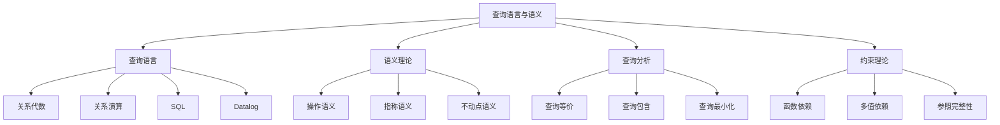
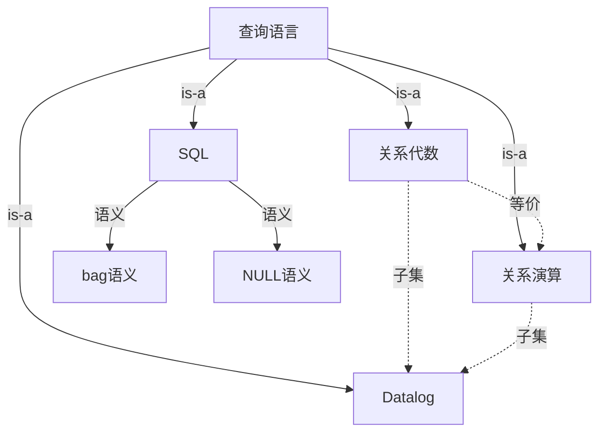
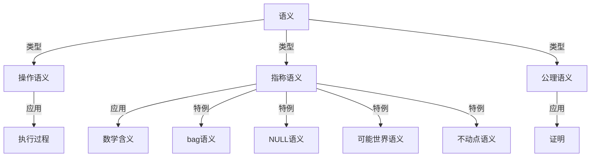
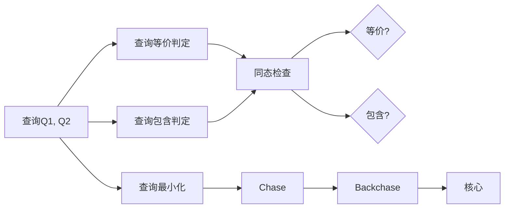
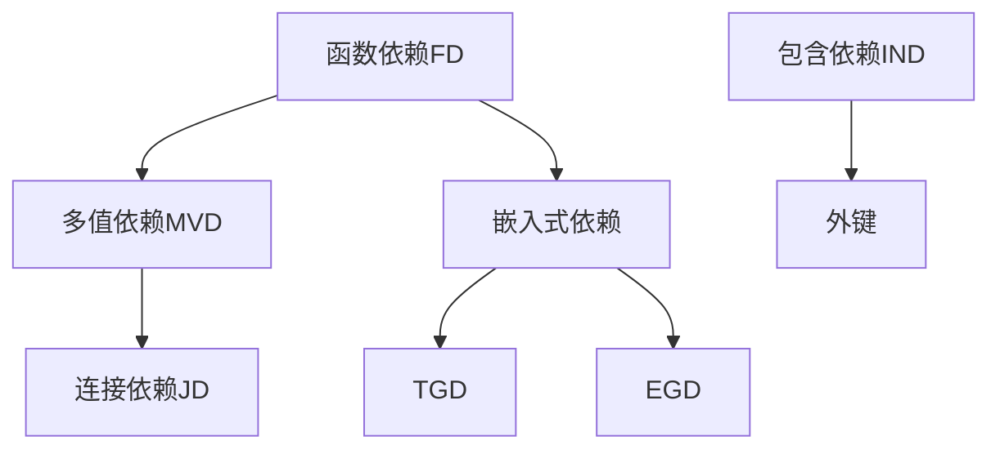
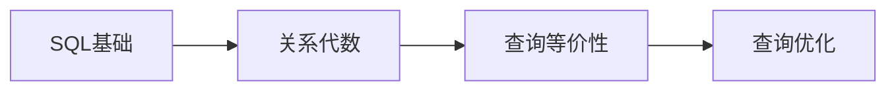
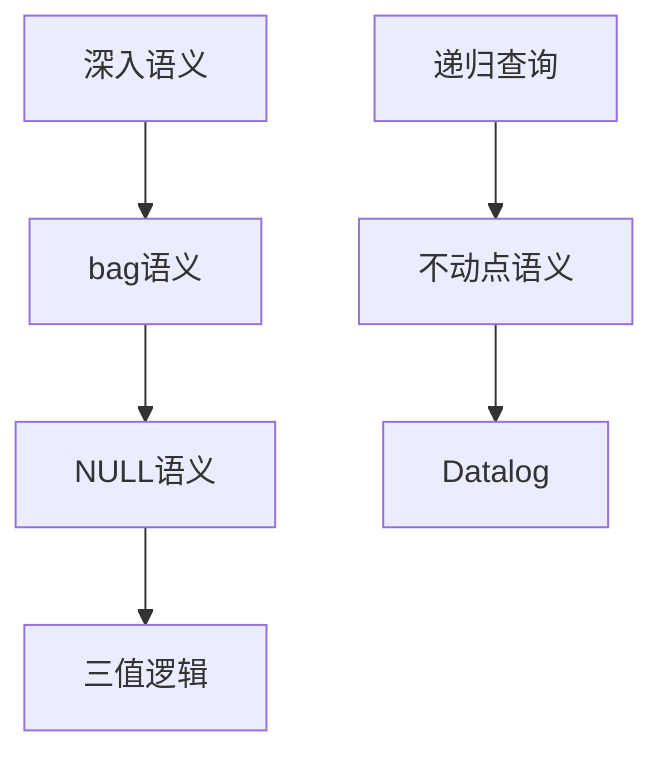
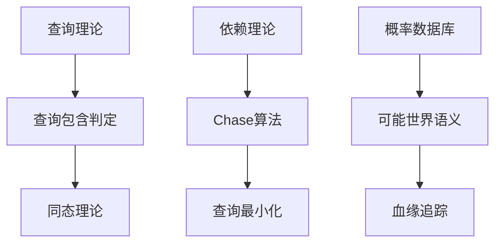

# 概念本体：08-查询语言与语义模块

> **提取日期**: 2025-12-03
> **来源模块**: 08-查询语言与语义（12个文档）
> **概念数量**: 95+
> **状态**: ✅ 提取完成

---

## 📋 概念分类体系

### 顶层概念架构



---

## 1. 核心概念清单

### 1.1 元概念层（Meta-Concepts）

| ID | 概念名称 | 英文名 | 定义 | 抽象层次 |
|----|---------|--------|------|---------|
| QL01 | **查询语言** | Query Language | 表达数据检索需求的语言 | 元概念 |
| QL02 | **语义** | Semantics | 查询语言的意义解释 | 元概念 |
| QL03 | **等价性** | Equivalence | 两个查询产生相同结果 | 元概念 |
| QL04 | **完备性** | Completeness | 语言的表达能力 | 元概念 |
| QL05 | **可计算性** | Computability | 查询能否有效计算 | 元概念 |

### 1.2 查询语言（Query Languages）

#### 1.2.1 关系语言

| ID | 概念名称 | 英文名 | 定义 | 依赖概念 | 特点 |
|----|---------|--------|------|---------|------|
| L01 | **关系代数** | Relational Algebra | 过程式关系查询语言 | QL01 | 过程式 |
| L02 | **关系演算** | Relational Calculus | 声明式关系查询语言 | QL01 | 声明式 |
| L03 | **SQL** | Structured Query Language | 标准数据库查询语言 | QL01 | 工业标准 |
| L04 | **Codd定理** | Codd's Theorem | 关系代数与演算等价 | L01, L02 | 等价性定理 |
| L05 | **域独立性** | Domain Independence | 查询结果与域无关 | L02 | 安全性条件 |
| L06 | **安全性** | Safety | 查询结果有限 | L02 | 可计算性 |

#### 1.2.2 逻辑语言

| ID | 概念名称 | 英文名 | 定义 | 依赖概念 | 特点 |
|----|---------|--------|------|---------|------|
| L10 | **Datalog** | Datalog | 声明式逻辑查询语言 | QL01 | 支持递归 |
| L11 | **规则** | Rule | Horn子句形式 | L10 | 组成单元 |
| L12 | **事实** | Fact | 基础关系 | L10 | 基础数据 |
| L13 | **目标** | Goal | 查询目标 | L10 | 查询请求 |
| L14 | **递归** | Recursion | 规则递归定义 | L10 | 传递闭包 |
| L15 | **分层Datalog** | Stratified Datalog | 消除否定的递归 | L10 | 有否定 |
| L16 | **不动点** | Fixpoint | 递归的最小不动点 | L14 | 语义基础 |
| L17 | **可计算性** | Computability | Datalog查询可终止 | L10 | 理论保证 |

### 1.3 语义理论（Semantics Theory）

#### 1.3.1 语义类型

| ID | 概念名称 | 英文名 | 定义 | 依赖概念 | 关系 |
|----|---------|--------|------|---------|------|
| S01 | **操作语义** | Operational Semantics | 描述计算过程 | QL02 | 语义类型 |
| S02 | **指称语义** | Denotational Semantics | 描述数学含义 | QL02 | 语义类型 |
| S03 | **公理语义** | Axiomatic Semantics | 基于公理推理 | QL02 | 语义类型 |
| S04 | **组合语义** | Compositional Semantics | 部分语义组合整体 | QL02 | 组合性 |

#### 1.3.2 特殊语义

| ID | 概念名称 | 英文名 | 定义 | 依赖概念 | 应用 |
|----|---------|--------|------|---------|------|
| S10 | **bag语义** | Bag Semantics | 多重集语义 | QL02 | SQL实际语义 |
| S11 | **set语义** | Set Semantics | 集合语义 | QL02 | 关系代数 |
| S12 | **NULL语义** | NULL Semantics | 空值的语义 | QL02 | 三值逻辑 |
| S13 | **三值逻辑** | Three-Valued Logic | True/False/Unknown | S12 | 逻辑基础 |
| S14 | **外连接语义** | Outer Join Semantics | 保留不匹配行 | S12 | SQL特性 |
| S15 | **可能世界语义** | Possible World Semantics | 不确定性数据语义 | QL02 | 概率数据库 |
| S16 | **不动点语义** | Fixpoint Semantics | 递归的最小不动点 | L16 | Datalog/CTE |

### 1.4 查询分析（Query Analysis）

#### 1.4.1 查询等价与包含

| ID | 概念名称 | 英文名 | 定义 | 依赖概念 | 关系 |
|----|---------|--------|------|---------|------|
| A01 | **查询等价** | Query Equivalence | 两查询在所有实例上结果相同 | QL03 | 判定问题 |
| A02 | **查询包含** | Query Containment | 一查询结果是另一查询的子集 | QL03 | 判定问题 |
| A03 | **同态** | Homomorphism | 保持结构的映射 | A01 | 判定方法 |
| A04 | **同构** | Isomorphism | 双向同态 | A03 | 等价判定 |
| A05 | **查询最小化** | Query Minimization | 找到等价的最小查询 | A01 | 优化问题 |
| A06 | **视图可用性** | View Usability | 视图能否用于改写查询 | A01 | 查询重写 |

#### 1.4.2 依赖理论

| ID | 概念名称 | 英文名 | 定义 | 依赖概念 | 关系 |
|----|---------|--------|------|---------|------|
| D01 | **函数依赖** | Functional Dependency | X→Y，X确定Y | QL04 | 完整性约束 |
| D02 | **多值依赖** | Multivalued Dependency | X↠Y，X多值确定Y | D01 | 更强约束 |
| D03 | **连接依赖** | Join Dependency | 关系可无损分解 | D01 | 分解约束 |
| D04 | **包含依赖** | Inclusion Dependency | 一关系列值包含另一关系 | QL04 | 外键约束 |
| D05 | **嵌入式依赖** | Embedded Dependency | 更一般的依赖 | D01 | 一般化 |
| D06 | **元组生成依赖** | Tuple-Generating Dependency (TGD) | 蕴含新元组存在 | D05 | 逻辑约束 |
| D07 | **等式生成依赖** | Equality-Generating Dependency (EGD) | 蕴含值相等 | D05 | 逻辑约束 |

#### 1.4.3 Chase理论

| ID | 概念名称 | 英文名 | 定义 | 依赖概念 | 应用 |
|----|---------|--------|------|---------|------|
| CH01 | **Chase** | Chase | 使用依赖推导新事实 | D06, D07 | 查询优化 |
| CH02 | **Chase步骤** | Chase Step | 应用一个依赖 | CH01 | 算法单元 |
| CH03 | **Chase终止** | Chase Termination | Chase过程停止 | CH01 | 可计算性 |
| CH04 | **Backchase** | Backchase | Chase的逆过程 | CH01 | 查询最小化 |
| CH05 | **核心** | Core | 查询的最小等价形式 | A05 | 最小化结果 |

### 1.5 CTE与递归（CTE and Recursion）

| ID | 概念名称 | 英文名 | 定义 | 依赖概念 | PostgreSQL语法 |
|----|---------|--------|------|---------|----------------|
| CTE01 | **CTE** | Common Table Expression | 公共表表达式 | QL01 | WITH子句 |
| CTE02 | **递归CTE** | Recursive CTE | 引用自身的CTE | CTE01 | WITH RECURSIVE |
| CTE03 | **工作表** | Working Table | 递归的当前结果 | CTE02 | - |
| CTE04 | **递归项** | Recursive Term | CTE的递归部分 | CTE02 | UNION |
| CTE05 | **基础项** | Base Term | CTE的非递归部分 | CTE02 | 初始值 |
| CTE06 | **不动点计算** | Fixpoint Computation | 计算最小不动点 | CTE02 | 语义 |

### 1.6 窗口函数（Window Functions）

| ID | 概念名称 | 英文名 | 定义 | 依赖概念 | SQL语法 |
|----|---------|--------|------|---------|---------|
| W01 | **窗口函数** | Window Function | 在窗口上计算聚合 | QL01 | OVER子句 |
| W02 | **窗口** | Window | 当前行相关的行集合 | W01 | PARTITION BY |
| W03 | **帧** | Frame | 窗口内的特定行范围 | W02 | ROWS BETWEEN |
| W04 | **分区** | Partition | 窗口函数的分组 | W02 | PARTITION BY |
| W05 | **排序** | Ordering | 窗口内的排序 | W02 | ORDER BY |
| W06 | **排名函数** | Rank Function | 计算行的排名 | W01 | ROW_NUMBER, RANK |
| W07 | **聚合函数** | Aggregate Function | 在窗口上聚合 | W01 | SUM, AVG |

### 1.7 外键与约束（Foreign Keys and Constraints）

| ID | 概念名称 | 英文名 | 定义 | 依赖概念 | 关系 |
|----|---------|--------|------|---------|------|
| FK01 | **外键** | Foreign Key | 引用另一表主键的列 | D04 | 参照完整性 |
| FK02 | **参照完整性** | Referential Integrity | 外键必须引用存在的主键 | FK01 | 完整性约束 |
| FK03 | **级联删除** | CASCADE DELETE | 删除时级联删除引用行 | FK01 | 操作 |
| FK04 | **级联更新** | CASCADE UPDATE | 更新时级联更新引用 | FK01 | 操作 |
| FK05 | **设置NULL** | SET NULL | 删除时设外键为NULL | FK01 | 操作 |
| FK06 | **约束检查** | Constraint Checking | 验证约束满足 | FK02 | 执行时机 |
| FK07 | **延迟约束** | Deferred Constraint | 事务结束时检查 | FK06 | 检查时机 |

### 1.8 概率与不确定性（Probability and Uncertainty）

| ID | 概念名称 | 英文名 | 定义 | 依赖概念 | 关系 |
|----|---------|--------|------|---------|------|
| P01 | **概率数据库** | Probabilistic Database | 数据带有概率 | QL01 | 扩展 |
| P02 | **可能世界** | Possible World | 数据库的一种可能状态 | P01 | 语义基础 |
| P03 | **元组独立性** | Tuple Independence | 元组概率独立 | P01 | 假设 |
| P04 | **查询概率** | Query Probability | 查询结果的概率 | P01 | 计算 |
| P05 | **血缘** | Lineage | 结果来源的追踪 | P01 | 来源分析 |
| P06 | **半环** | Semiring | 代数结构 | P05 | 血缘计算 |

### 1.9 视图理论（View Theory）

| ID | 概念名称 | 英文名 | 定义 | 依赖概念 | 关系 |
|----|---------|--------|------|---------|------|
| V01 | **视图** | View | 虚拟表 | QL01 | 查询抽象 |
| V02 | **视图定义** | View Definition | 视图的查询表达式 | V01 | 定义 |
| V03 | **视图更新** | View Update | 通过视图修改基表 | V01 | 更新问题 |
| V04 | **可更新视图** | Updatable View | 可以更新的视图 | V03 | 特殊视图 |
| V05 | **视图更新转换** | View Update Translation | 将视图更新转换为基表更新 | V03 | 转换算法 |
| V06 | **常数补齐** | Constant Complement | 视图更新的补齐策略 | V05 | 策略 |

---

## 2. 概念关系网络

### 2.1 查询语言层次



### 2.2 语义类型关系



### 2.3 查询分析流程



### 2.4 依赖理论层次



---

## 3. 多维概念矩阵

### 3.1 查询语言 × 表达能力

| 语言 ↓ / 能力 → | 选择 | 投影 | 连接 | 递归 | 聚合 | 否定 | 排序 |
|--------------|-----|-----|-----|-----|-----|-----|-----|
| **关系代数** | ✅ | ✅ | ✅ | ❌ | ⚠️ | ❌ | ❌ |
| **关系演算** | ✅ | ✅ | ✅ | ❌ | ⚠️ | ✅ | ❌ |
| **Datalog** | ✅ | ✅ | ✅ | ✅ | ⚠️ | ⚠️ | ❌ |
| **SQL** | ✅ | ✅ | ✅ | ✅ | ✅ | ✅ | ✅ |

### 3.2 语义类型 × 查询类型

| 语义 ↓ / 查询 → | 选择查询 | 连接查询 | 聚合查询 | 递归查询 | 更新查询 |
|---------------|---------|---------|---------|---------|---------|
| **操作语义** | ✅ | ✅ | ✅ | ✅ | ✅ |
| **指称语义** | ✅ | ✅ | ✅ | ✅ | ⚠️ |
| **公理语义** | ✅ | ⚠️ | ⚠️ | ❌ | ⚠️ |

### 3.3 依赖 × 范式

| 依赖 ↓ / 范式 → | 1NF | 2NF | 3NF | BCNF | 4NF | 5NF |
|---------------|-----|-----|-----|------|-----|-----|
| **函数依赖FD** | ✅ | ✅ | ✅ | ✅ | ⚠️ | ⚠️ |
| **多值依赖MVD** | ❌ | ❌ | ❌ | ❌ | ✅ | ⚠️ |
| **连接依赖JD** | ❌ | ❌ | ❌ | ❌ | ❌ | ✅ |

---

## 4. 概念学习路径

### 4.1 初学者路径



**学习顺序**：

1. SQL语法 → L03
2. 关系代数操作 → L01
3. Codd定理 → L04
4. 查询等价性 → A01
5. 查询优化基础 → 转到05模块

### 4.2 进阶路径（语义方向）



### 4.3 专家路径（理论方向）



---

## 5. 跨模块概念关联

### 5.1 与形式化方法模块

| 本模块 | 形式化模块 | 关联类型 |
|-------|-----------|---------|
| 关系代数 | 形式语言 | 实例 |
| 不动点语义 | 不动点理论 | 应用 |
| 查询等价 | 等价性证明 | 需要证明 |

### 5.2 与查询优化模块

| 本模块 | 优化模块 | 关联类型 |
|-------|---------|---------|
| 关系代数 | 等价重写 | 理论基础 |
| 查询包含 | 查询重写 | 判定依据 |
| bag语义 | SQL优化 | 语义基础 |

### 5.3 与数据模型模块

| 本模块 | 数据模型模块 | 关联类型 |
|-------|------------|---------|
| 函数依赖 | 范式 | 规范化依据 |
| 外键约束 | 关系模型 | 完整性 |
| Chase | 约束推理 | 推理工具 |

---

## 6. AI视角的元模型

### 6.1 查询语言元模型

```text
M3层（元元模型）：查询语言理论
├── 语法元类
├── 语义元类
└── 等价性元类

M2层（元模型）：SQL语法规范
├── SELECT语句类
├── JOIN语句类
└── CTE语句类

M1层（模型）：具体SQL查询
├── "SELECT * FROM users"
├── "WITH RECURSIVE ..."
└── 具体窗口查询

M0层（实例）：查询结果
├── 返回的行集合
└── 执行统计
```

### 6.2 AI推理在查询分析中的应用

**基于规则的推理**：

- 等价重写规则（选择下推、连接交换）
- Chase规则（依赖推导）
- 查询重写规则

**基于案例的推理**：

- 案例：历史查询及其计划
- 检索：查找相似查询
- 适配：调整计划

**基于模型的推理**：

- 语义模型：bag语义、NULL语义
- 推理：判断查询等价性
- 应用：查询优化

**机器学习推理**：

- 查询分类：OLTP/OLAP识别
- 性能预测：基于查询特征
- 计划推荐：学习最优计划

---

## 7. 概念质量评估

### 7.1 完整性

- ✅ 查询语言：关系代数、演算、SQL、Datalog全覆盖
- ✅ 语义理论：操作/指称/公理语义
- ✅ 查询分析：等价、包含、最小化
- ✅ 依赖理论：FD、MVD、JD、TGD、EGD
- ✅ 特殊特性：CTE、窗口函数、外连接
- ✅ 前沿理论：概率数据库、血缘追踪
- ⚠️ 覆盖度：约90%

### 7.2 深度

- ✅ 理论完整：Codd定理、Chase理论
- ✅ 语义丰富：6种语义类型
- ✅ 实现对应：PostgreSQL语法映射
- ✅ AI视角：元模型和推理框架

---

## 8. 待补充概念

### 8.1 高优先级

- [ ] **查询重写规则完整集**
- [ ] **SQL标准版本差异**（SQL-92/99/2003/2011/2016）

### 8.2 中优先级

- [ ] **查询计划提示**（Query Hints）
- [ ] **存储过程语义**（PL/pgSQL）

---

**下一步**：提取09-数据模型与规范化模块

---

**提取者**: AI Assistant
**状态**: ✅ 完成
**概念数**: 95+
