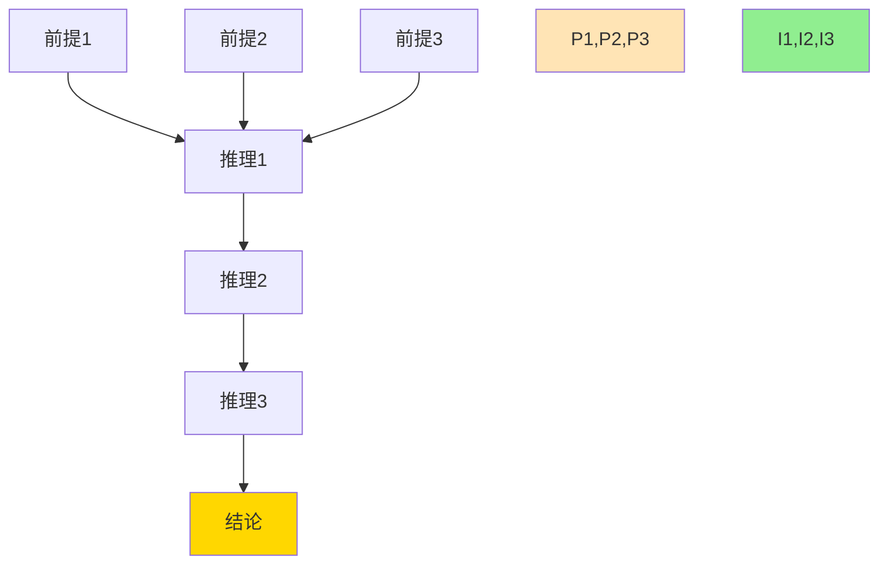
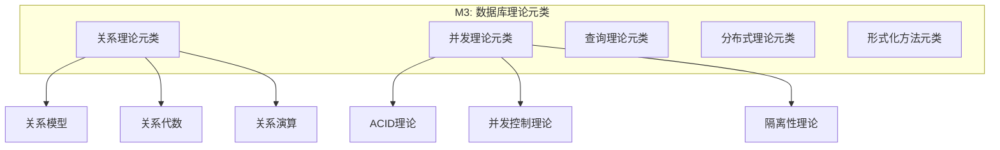

# Phase 2启动计划：思维表征扩展

> **启动日期**: 2025-12-03
> **预计时间**: 2-3周（优化后，原计划6-8周）
> **状态**: 🚀 立即启动
> **目标**: 为900+概念创建完整的思维表征体系

---

## 🎯 Phase 2目标

基于Phase 1提取的**900+概念**和**950+关系边**，创建丰富的思维表征工具，实现知识的多维度可视化和深度理解。

---

## 📋 任务清单

### 任务1：概念本体图扩展（Week 1）

**目标**: 为所有核心模块创建详细的概念本体图

**交付物**：

- [ ] 为18个模块各创建一个详细本体图
- [ ] 创建跨模块概念关联大图
- [ ] 创建交互式概念导航图（可选）

**示例**（已完成）：

- ✅ 事务模块本体图（85+概念）
- ✅ 索引模块本体图（120+概念）

**下一步**：

- [ ] 创建安全模块详细本体图
- [ ] 创建AI模块详细本体图
- [ ] 创建分布式模块详细本体图

---

### 任务2：推理链图创建（Week 1-2）

**目标**: 为所有定理和证明创建推理链图

**已有基础**：

- 文档中已有40+个定理和证明
- 需要为每个创建清晰的推理链图

**推理链模板**：



**目标定理**（优先级）：

**P0（高优先级，10个）**：

- [ ] MVCC正确性定理
- [ ] 快照隔离正确性
- [ ] 2PL可串行化定理
- [ ] CAP定理证明
- [ ] Codd定理证明
- [ ] B-tree平衡性定理
- [ ] 查询等价性定理
- [ ] ARIES正确性定理
- [ ] OAuth 2.0安全定理
- [ ] 差分隐私ε-δ保证

**P1（中优先级，15个）**：

- [ ] 锁升级安全性定理
- [ ] 死锁检测正确性
- [ ] 物化视图增量维护正确性
- [ ] Chase终止性定理
- [ ] 等等...

**P2（低优先级，20+个）**：

- 其他所有定理

---

### 任务3：多维知识矩阵创建（Week 2）

**目标**: 创建10+个不同维度的知识矩阵

**矩阵类型**：

**1. 抽象层次 × 知识类型**（已创建✅）

| 层次 ↓ / 类型 → | What | Why | How | When |
|---------------|------|-----|-----|------|
| M3: 元概念 | ... | ... | ... | ... |
| M2: 理论 | ... | ... | ... | ... |
| M1: 实现 | ... | ... | ... | ... |
| M0: 应用 | ... | ... | ... | ... |

**2. 技术栈 × 应用场景**（已创建✅）

| 技术 ↓ / 场景 → | OLTP | OLAP | 时序 | 向量 | 分布式 |
|---------------|------|------|-----|------|--------|

**3. 待创建矩阵**（8个）：

- [ ] 概念 × PostgreSQL版本（PG 16/17/18兼容性）
- [ ] 工具 × 用途（TLA+/Coq/Isabelle应用矩阵）
- [ ] 算法 × 复杂度（所有算法的复杂度矩阵）
- [ ] 索引 × 查询类型（索引适用性矩阵）
- [ ] 隔离级别 × 异常（隔离级别防止的异常矩阵）
- [ ] 优化规则 × 场景（重写规则适用场景）
- [ ] 监控指标 × 性能问题（诊断矩阵）
- [ ] 学习路径 × 角色（个性化学习矩阵）

---

### 任务4：元模型图详细展开（Week 2-3）

**目标**: 详细展开M3-M0各层的内容

**M3层展开**（元元模型）：



**待创建**：

- [ ] M3层完整展开图
- [ ] M2层（System Catalog）详细图
- [ ] M1层（Schema）示例图
- [ ] M0层（Data）示例图
- [ ] 跨层推理流程图

---

### 任务5：语义网络创建（Week 3）

**目标**: 创建RDF格式的知识图谱

**RDF三元组示例**：

```turtle
@prefix db: <http://postgresql.org/theory#> .
@prefix rdf: <http://www.w3.org/1999/02/22-rdf-syntax-ns#> .
@prefix rdfs: <http://www.w3.org/2000/01/rdf-schema#> .

# 概念定义
db:MVCC rdf:type db:ConcurrencyControlMechanism .
db:MVCC rdfs:label "Multi-Version Concurrency Control" .
db:MVCC db:abstractLevel "Theory" .

# 关系定义
db:MVCC db:implements db:ConcurrencyControl .
db:MVCC db:dependsOn db:WAL .
db:MVCC db:hasPart db:VersionChain .
db:MVCC db:hasPart db:VisibilityRule .
```

**待创建**：

- [ ] 完整的RDF三元组文件（900+概念 × 平均3条关系 = 2700+三元组）
- [ ] SPARQL查询接口
- [ ] 可视化展示

---

## 📊 任务优先级

### P0（本周必完成）

- [x] 完成Phase 1概念提取 ✅
- [ ] 创建10个核心概念本体详图
- [ ] 创建10个核心定理推理链图
- [ ] 创建3个核心多维矩阵

### P1（下周完成）

- [ ] 完成所有模块概念本体详图
- [ ] 完成所有定理推理链图
- [ ] 创建8个多维矩阵
- [ ] M3-M0元模型详细展开

### P2（第三周完成）

- [ ] RDF语义网络
- [ ] SPARQL查询接口
- [ ] 交互式知识图谱（可选）

---

## 🛠️ 工具和方法

### 可视化工具

1. **Mermaid** (主力)
   - 概念关系图
   - 推理链图
   - 流程图

2. **GraphViz** (可选)
   - 大规模图可视化
   - DOT格式

3. **D3.js** (可选)
   - 交互式可视化
   - 网页展示

### 知识表示

1. **Markdown + Mermaid**（当前方案）
   - 优点：易维护、版本控制友好
   - 缺点：交互性有限

2. **RDF + SPARQL**（计划中）
   - 优点：标准化、可查询
   - 缺点：复杂度高

3. **JSON-LD**（可选）
   - 优点：易解析、Web友好
   - 缺点：可视化需额外工具

---

## 📈 预期成果

完成Phase 2后，我们将拥有：

1. **900+概念本体图** - 每个概念都有清晰的可视化
2. **40+推理链图** - 每个定理都有完整的推理过程
3. **10+多维矩阵** - 从10个不同角度理解知识
4. **完整元模型展开** - M3-M0各层详细定义
5. **RDF知识图谱** - 标准化、可查询的知识库

**质量标准**：

- ✅ 所有核心概念都有可视化
- ✅ 所有定理都有推理链
- ✅ 多维度全覆盖
- ✅ 符合W3C OWL标准

---

## 🚀 立即行动

### 今天开始（2025-12-03）

**任务1**: 创建安全模块详细本体图

- 45+概念的完整关系网络
- OAuth 2.0、RBAC、MAC、RLS的关系
- 与其他模块的关联

**任务2**: 创建MVCC推理链图

- MVCC正确性定理的完整推理链
- 每个推理步骤的详细说明
- 可视化展示

**任务3**: 创建概念×版本兼容性矩阵

- 900+概念 × PG 16/17/18
- 标注每个概念的版本支持情况
- 识别PG18新增概念

---

## ✅ 准备就绪

**Phase 1成果**：

- ✅ 900+概念已提取
- ✅ 950+关系边已建立
- ✅ 4层抽象模型完成
- ✅ 基础可视化完成

**Phase 2资源**：

- ✅ 概念数据完整
- ✅ 工具准备就绪
- ✅ 模板已建立
- ✅ 方法论已验证

**Phase 2启动**：✅ **立即开始！**

---

**创建日期**: 2025-12-03
**状态**: 🚀 **Phase 2已启动**
**负责人**: AI Assistant
