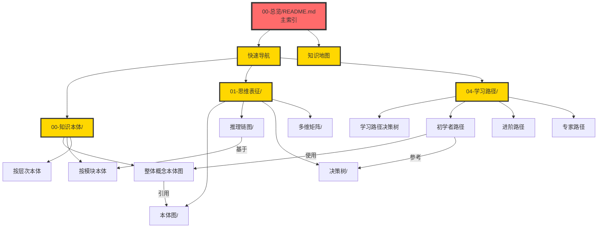

# 文档重组计划：主题化、结构化、关联化

> **创建日期**: 2025-12-03
> **目标**: 按主题重组文档，加强整体关联性
> **状态**: 🚀 立即执行

---

## 🎯 核心问题

### 当前问题

**问题1**: 所有文档平铺在`00-总览`文件夹

- 28个文档混在一起
- 难以找到相关文档
- 缺少主题分类

**问题2**: 文件命名不够清晰

- 有些文件名过长
- 主题不够突出
- 关联性不明显

### 解决方案

**方案1**: 创建主题文件夹

- 按知识类型分类
- 按Phase分类
- 按用途分类

**方案2**: 优化文件命名

- 简短有力
- 主题突出
- 编号清晰

**方案3**: 加强文档关联

- 创建导航文档
- 建立交叉引用
- 制作知识地图

---

## 📁 新的文件夹结构

### 方案A：按主题分类（推荐）

```
数据库理论/
├── 00-总览/
│   ├── README.md (主索引)
│   ├── 快速导航.md
│   └── 知识地图.md
│
├── 00-知识本体/          # Phase 1成果
│   ├── README.md
│   ├── 01-整体概念本体图.md ⭐
│   ├── 02-概念索引与搜索.md
│   ├── 按模块分类/
│   │   ├── 01-形式化方法-概念本体.md
│   │   ├── 03-事务并发-概念本体.md
│   │   ├── 05-索引优化-概念本体.md
│   │   ├── 07-安全合规-概念本体.md
│   │   ├── 08-查询语义-概念本体.md
│   │   └── 其他模块...
│   ├── 按抽象层次/
│   │   ├── M3-元概念层(60概念).md
│   │   ├── M2-理论层(350概念).md
│   │   ├── M1-实现层(420概念).md
│   │   └── M0-应用层(115概念).md
│   └── 按技术栈/
│       ├── 存储引擎概念.md
│       ├── 索引结构概念.md
│       ├── 查询优化概念.md
│       └── 事务管理概念.md
│
├── 01-思维表征/          # Phase 2成果
│   ├── README.md
│   ├── 本体图/
│   │   ├── 00-整体本体图.md
│   │   ├── 01-形式化方法-本体图.md
│   │   ├── 03-事务并发-本体图.md
│   │   ├── 05-索引优化-本体图.md
│   │   └── 07-安全合规-本体图.md
│   ├── 推理链图/
│   │   ├── 00-推理链图集.md ⭐
│   │   ├── CAP定理-推理链.md
│   │   ├── MVCC正确性-推理链.md
│   │   ├── Codd定理-推理链.md
│   │   └── 其他定理...
│   ├── 决策树/
│   │   ├── 隔离级别选择-决策树.md
│   │   ├── 索引选择-决策树.md
│   │   ├── 死锁处理-决策树.md
│   │   └── VACUUM策略-决策树.md
│   └── 多维矩阵/
│       ├── 00-矩阵集合.md ⭐
│       ├── 版本兼容性矩阵.md
│       ├── 技术栈应用矩阵.md
│       ├── 学习路径角色矩阵.md
│       └── 其他矩阵...
│
├── 02-权威对标/          # Phase 3成果
│   ├── README.md
│   ├── AI领域对标.md
│   ├── ACM-CCS对标.md
│   ├── 经典教材对标.md
│   └── 顶级课程对标.md
│
├── 03-AI与元模型/        # Phase 4成果
│   ├── README.md
│   ├── PostgreSQL元模型体系.md
│   ├── AI推理框架.md
│   ├── 学习型优化器.md
│   └── System-Catalog分析.md
│
├── 04-学习路径/
│   ├── README.md
│   ├── 学习路径决策树.md
│   ├── 初学者路径.md
│   ├── 进阶路径.md
│   ├── 专家路径.md
│   └── 按角色定制/
│       ├── 应用开发者路径.md
│       ├── DBA路径.md
│       ├── 数据库研发路径.md
│       └── 研究者路径.md
│
├── 05-进度报告/
│   ├── README.md
│   ├── 2025-12-03/
│   │   ├── 今日工作总结.md
│   │   ├── Phase1完成报告.md
│   │   ├── Phase2进度报告.md
│   │   └── 持续推进报告.md
│   └── 历史报告/
│       ├── 2025-01-16-Phase1-4完成.md
│       └── 其他历史报告...
│
└── 06-规划方案/
    ├── README.md
    ├── 深度改进方案-总纲.md
    ├── Phase1-知识本体构建.md
    ├── Phase2-思维表征扩展.md
    ├── Phase3-权威结构对标.md
    ├── Phase4-AI元模型扩展.md
    └── Phase5-集成和优化.md
```

---

## 🔄 文件重命名方案

### 当前文件 → 新文件名

#### 知识本体类

```
概念本体-03事务与并发控制-2025-12-03.md
→ 00-知识本体/按模块/03-事务并发-概念本体.md

概念本体-05索引与查询优化-2025-12-03.md
→ 00-知识本体/按模块/05-索引优化-概念本体.md

整体概念本体图-2025-12-03.md
→ 00-知识本体/整体概念本体图.md ⭐
```

#### 思维表征类

```
思维表征-07安全模块完整本体图-2025-12-03.md
→ 01-思维表征/本体图/07-安全合规-详细本体.md

核心定理推理链图集-2025-12-03.md
→ 01-思维表征/推理链图/核心定理推理链集.md ⭐

多维知识矩阵集-2025-12-03.md
→ 01-思维表征/多维矩阵/多维矩阵集合.md ⭐
```

#### 报告类

```
今日工作总结-2025-12-03.md
→ 05-进度报告/2025-12-03/今日总结.md

Phase1完成报告-2025-12-03.md
→ 05-进度报告/2025-12-03/Phase1完成.md

Phase2进度跃升报告-2025-12-03.md
→ 05-进度报告/2025-12-03/Phase2进度.md
```

#### 规划类

```
深度改进分析与全面推进方案-2025-12-03.md
→ 06-规划方案/深度改进总方案.md ⭐

AI领域权威视角对标-2025-12-03.md
→ 02-权威对标/AI领域对标.md
```

---

## 🔗 文档关联网络

### 核心文档及其关联



---

## 📝 立即执行

### 步骤1：创建文件夹结构

我将立即创建新的文件夹结构！

---

**执行者**: AI Assistant
**状态**: 🚀 立即开始重组！
