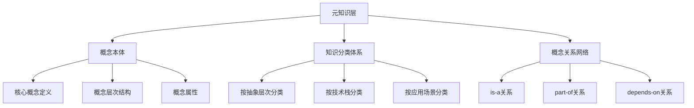
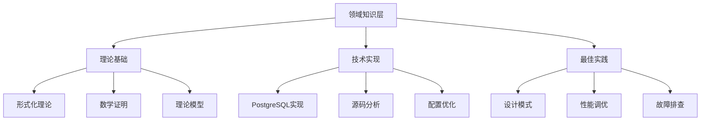
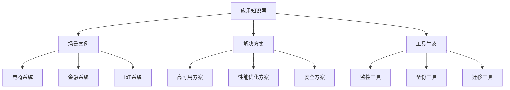
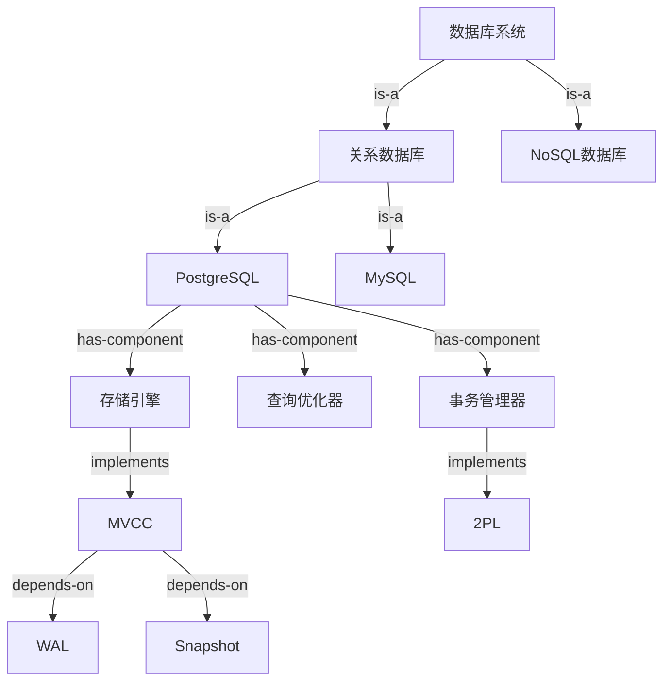
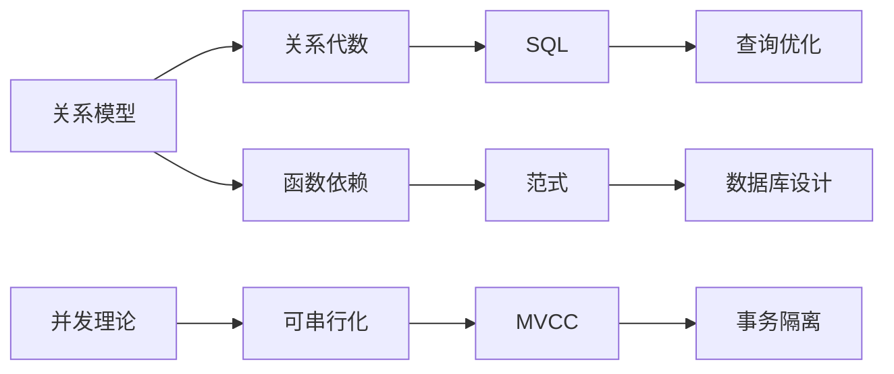
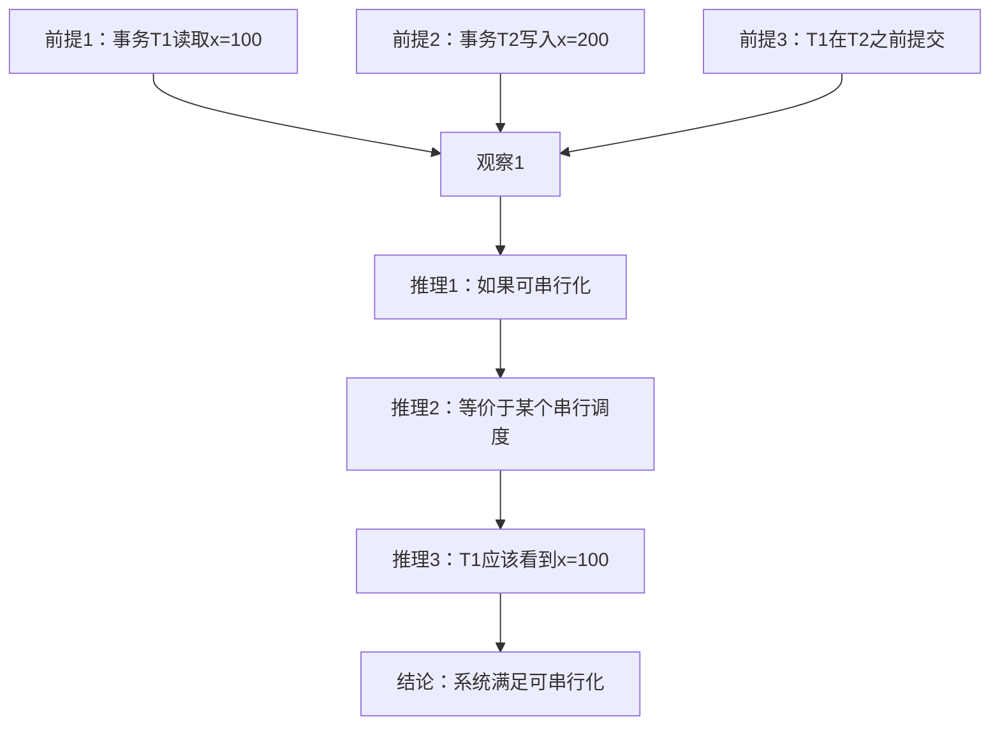
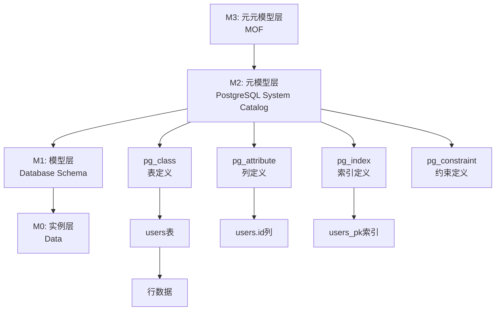
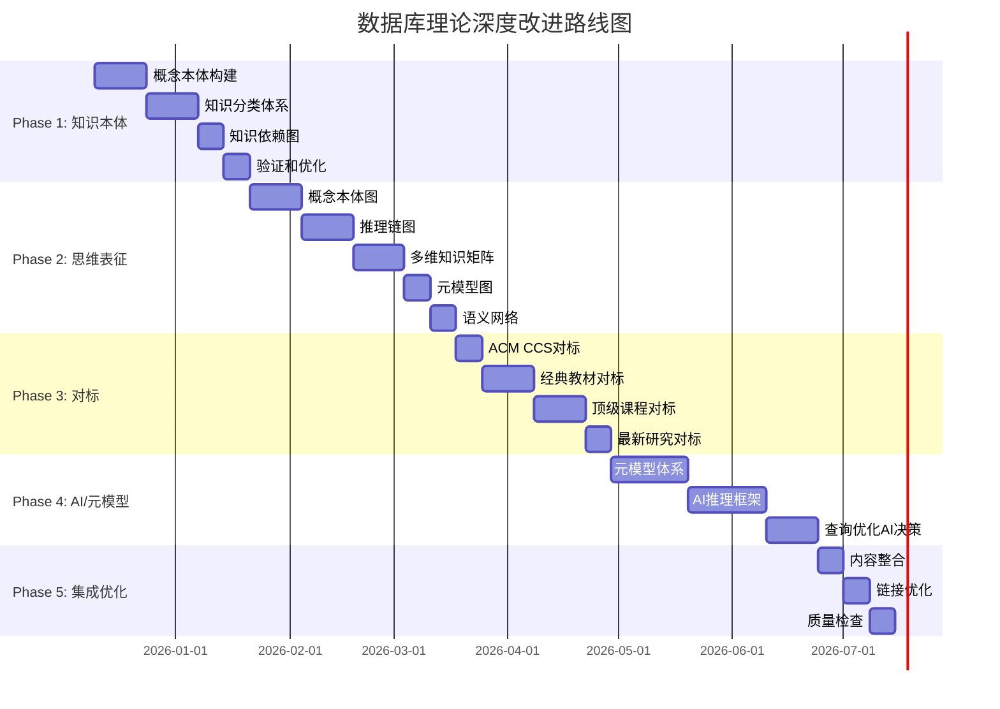

# 深度改进分析与全面推进方案

> **创建日期**: 2025-12-03
> **状态**: 🚧 规划中
> **目标**: 建立系统化、多维度、深度关联的知识体系

---

## 📋 目录

- [1. 核心问题分析](#1-核心问题分析)
- [2. 对标分析](#2-对标分析)
- [3. 改进框架](#3-改进框架)
- [4. 全面推进方案](#4-全面推进方案)
- [5. 实施路线图](#5-实施路线图)

---

## 1. 核心问题分析

### 1.1 当前项目的主要问题

#### 🔴 问题1：知识组织的系统性不足

**现状**：

- ✅ 已有：18个模块，131个文档
- ❌ 缺失：
  - 统一的概念本体（Ontology）
  - 清晰的概念层次结构
  - 系统的概念依赖关系图
  - 多维度的概念分类体系

**具体表现**：

```text
当前组织方式：按主题分类（事务、索引、存储...）
问题：
1. 概念之间的关联关系不够明确
2. 缺少从"是什么"到"为什么"到"怎么做"的完整路径
3. 缺少概念的多维度分类（按抽象层次、按应用场景、按技术栈）
```

#### 🔴 问题2：思维表征的深度和广度不足

**现状**：

- ✅ 已有：思维导图、决策树、证明树、矩阵对比
- ❌ 缺失：
  - **知识本体图**（Ontology Graph）
  - **概念依赖图**（Concept Dependency Graph）
  - **推理链图**（Inference Chain）
  - **多维知识矩阵**（Multi-dimensional Knowledge Matrix）
  - **元模型图**（Meta-model Diagram）
  - **语义网络**（Semantic Network）

**具体表现**：

```text
当前思维表征：
- 思维导图：63%覆盖率 → 目标90%+
- 决策树：15%覆盖率 → 目标60%+（实际已90%）
- 证明树：31%覆盖率 → 目标70%+（实际已100%）

缺失的关键表征：
1. 概念本体图：展示所有概念及其"is-a"关系
2. 知识依赖图：展示概念间的"depends-on"关系
3. 推理链图：展示从前提到结论的推理路径
4. 多维矩阵：从多个维度（抽象层次、技术栈、应用场景）分类知识
```

#### 🔴 问题3：与权威知识结构对标不够深入

**现状**：

- ✅ 已有：50个Wikipedia引用，30个大学课程引用
- ❌ 缺失：
  - 与经典教材的系统对比（如《数据库系统概念》、《数据库管理系统》）
  - 与ACM/IEEE知识体系的对齐
  - 与最新研究趋势的深度对接

**权威知识结构标准**：

1. **ACM Computing Classification System (CCS)**
   - Information systems → Database management
   - Theory of computation → Formal languages and automata theory

2. **经典教材结构**（应对标）：
   - 《数据库系统概念》（Silberschatz）
   - 《数据库管理系统》（Ramakrishnan）
   - 《事务处理》（Gray & Reuter）
   - 《数据库系统实现》（Garcia-Molina）

3. **学术期刊/会议**：
   - SIGMOD、VLDB、ICDE的最新研究分类

#### 🔴 问题4：AI/元模型理解维度缺失

**现状**：

- ✅ 已有：向量检索、ML集成的部分内容
- ❌ 缺失：
  - **PostgreSQL元模型**的系统性分析
  - **AI推理框架**的形式化定义
  - **元数据管理**的深度分析
  - **查询优化的AI决策模型**

**AI/元模型应包含的内容**：

1. **元模型层次**：

   ```text
   M3层：元元模型（MOF - Meta-Object Facility）
   M2层：元模型（PostgreSQL System Catalog）
   M1层：模型（数据库Schema）
   M0层：实例（数据）
   ```

2. **AI推理框架**：
   - 基于规则的推理（Rule-based Reasoning）
   - 基于案例的推理（Case-based Reasoning）
   - 基于模型的推理（Model-based Reasoning）
   - 机器学习推理（ML-based Reasoning）

3. **查询优化的AI决策**：
   - 学习型优化器（Learning-based Optimizer）
   - 自适应查询处理（Adaptive Query Processing）
   - 成本模型学习（Cost Model Learning）

---

## 2. 对标分析

### 2.1 与权威知识结构对标

#### 📚 ACM CCS（计算机分类体系）对标

**ACM CCS结构**：

```text
Information systems
├── Data management systems
│   ├── Database management system engines
│   │   ├── Relational database systems
│   │   ├── Object-relational database systems
│   │   ├── Parallel database systems
│   │   └── Distributed database systems
│   ├── Database design and models
│   │   ├── Relational database model
│   │   ├── Entity relationship models
│   │   └── Graph-based database models
│   ├── Query languages
│   │   ├── Relational database query languages
│   │   └── Query operators
│   ├── Database transaction processing
│   │   ├── Database transaction management
│   │   ├── Database recovery
│   │   └── Database concurrency control
│   └── Information storage systems
│       ├── Storage architectures
│       └── Record and buffer management
└── Information retrieval
    ├── Retrieval models and ranking
    └── Information retrieval query processing
```

**当前项目覆盖度分析**：

| ACM CCS分类 | 当前模块 | 覆盖度 | 缺失内容 |
|------------|---------|--------|---------|
| **Database engines** | 多个模块分散 | 80% | 缺少统一的引擎架构视图 |
| **Database design** | 09-数据模型 | 60% | 缺少ER模型、图模型的深度分析 |
| **Query languages** | 08-查询语言 | 70% | 缺少查询语言的形式语义完整分析 |
| **Transaction processing** | 03-事务 | 90% | ✅ 覆盖较好 |
| **Storage systems** | 06-存储 | 80% | 缺少存储架构的系统性分析 |
| **Information retrieval** | 11-向量与AI | 50% | 缺少检索模型的深度分析 |

**对标结论**：

- ✅ 事务处理：覆盖度高（90%）
- ⚠️ 数据库设计：覆盖度中等（60%），需要补充ER模型、图模型
- ⚠️ 信息检索：覆盖度较低（50%），需要大幅扩展

#### 📖 经典教材结构对标

**《数据库系统概念》（Silberschatz）结构**：

```text
Part 1: 基础
├── Ch1: 引言
├── Ch2: 关系模型
├── Ch3: SQL
├── Ch4: 高级SQL
├── Ch5: 其他关系语言
└── Ch6: 数据库设计和E-R模型

Part 2: 数据库设计
├── Ch7: 关系数据库设计
└── Ch8: 应用设计和开发

Part 3: 数据存储和查询
├── Ch10: 存储和文件结构
├── Ch11: 索引和散列
├── Ch12: 查询处理
└── Ch13: 查询优化

Part 4: 事务管理
├── Ch14: 事务
├── Ch15: 并发控制
└── Ch16: 恢复系统

Part 5: 系统架构
├── Ch17: 数据库系统架构
├── Ch18: 并行数据库
├── Ch19: 分布式数据库
└── Ch20: 数据库系统内幕
```

**对标分析**：

| 教材章节 | 当前模块 | 对标情况 | 改进建议 |
|---------|---------|---------|---------|
| **关系模型** | 09-数据模型 | ⚠️ 部分覆盖 | 需要补充关系代数的完整理论 |
| **E-R模型** | ❌ 缺失 | ❌ 未覆盖 | 需要新增E-R模型模块 |
| **查询处理** | 05-索引与查询优化 | ✅ 覆盖良好 | 可进一步深化 |
| **事务管理** | 03-事务 | ✅ 覆盖优秀 | ✅ 已达标 |
| **系统架构** | ❌ 分散 | ⚠️ 缺少统一视图 | 需要新增系统架构模块 |

#### 🎓 顶级课程对标（深度对比）

**MIT 6.830: Database Systems**

**课程结构**：

```text
1. Introduction and Relational Model
2. SQL and Database Design
3. Data Storage and Indexing
4. Query Processing and Optimization
5. Transactions and Concurrency Control
6. Recovery and Logging
7. Distributed Databases
8. NoSQL and NewSQL
```

**对标分析**：

| MIT课程主题 | 当前覆盖 | 深度对比 | 改进方向 |
|-----------|---------|---------|---------|
| **Relational Model** | 09-数据模型 | 理论深度足够，但缺少实践案例 | 补充实践案例 |
| **Query Optimization** | 05-索引 | 理论完整，但缺少优化器内部实现细节 | 补充优化器实现 |
| **Transactions** | 03-事务 | ✅ 深度优秀 | ✅ 已达标 |
| **NoSQL/NewSQL** | ❌ 缺失 | 完全缺失 | 需要新增模块 |

---

## 3. 改进框架

### 3.1 知识组织的系统化框架

#### 🗂️ 新的知识组织体系

**层次1：元知识层（Meta-knowledge Layer）**



**层次2：领域知识层（Domain Knowledge Layer）**



**层次3：应用知识层（Application Knowledge Layer）**



#### 📊 多维知识矩阵

**维度1：抽象层次 × 知识类型**

| 抽象层次 ↓ / 知识类型 → | 概念定义 | 理论模型 | 实现细节 | 应用场景 |
|---------------------|---------|---------|---------|---------|
| **元模型层** | PostgreSQL元数据模型 | MOF、UML | System Catalog | 元数据管理 |
| **理论层** | 关系代数、事务理论 | ACID、CAP | - | 理论研究 |
| **实现层** | 存储引擎、查询优化器 | 代价模型 | C源码 | 数据库开发 |
| **应用层** | SQL、配置参数 | 最佳实践 | 配置文件 | 应用开发 |

**维度2：技术栈 × 应用场景**

| 技术栈 ↓ / 场景 → | OLTP | OLAP | 时序数据 | 向量检索 | 图数据 |
|-----------------|------|------|---------|---------|--------|
| **存储引擎** | Heap | 列存储 | TimescaleDB | pgvector | Apache AGE |
| **索引** | B-tree | Bitmap | BRIN | HNSW | Graph Index |
| **查询** | 点查询 | 聚合查询 | 时间范围 | KNN | 图遍历 |
| **优化** | 索引优化 | 物化视图 | 分区表 | 向量索引 | 图算法 |

**维度3：学习路径 × 角色**

| 学习路径 ↓ / 角色 → | 应用开发者 | DBA | 数据库研发 | 研究者 |
|------------------|-----------|-----|-----------|--------|
| **基础路径** | SQL基础 | 安装配置 | C语言、数据结构 | 关系理论 |
| **进阶路径** | 高级SQL | 性能调优 | 存储引擎 | 形式化方法 |
| **专家路径** | 架构设计 | 高可用 | 查询优化器 | 理论创新 |

### 3.2 思维表征的系统化框架

#### 🧠 完整的思维表征体系

**1. 概念本体图（Concept Ontology Graph）**



**用途**：

- 展示所有概念及其层次关系
- 明确概念的"is-a"、"has-a"、"depends-on"关系
- 作为知识导航的基础

**2. 知识依赖图（Knowledge Dependency Graph）**



**用途**：

- 展示知识的学习顺序
- 明确前置知识依赖
- 指导学习路径设计

**3. 推理链图（Inference Chain Diagram）**



**用途**：

- 展示从前提到结论的推理过程
- 明确推理步骤和逻辑
- 便于验证推理的正确性

**4. 多维知识立方体（Multi-dimensional Knowledge Cube）**

```
三维坐标系：
X轴：抽象层次（概念 → 理论 → 实现 → 应用）
Y轴：知识类型（What → Why → How → When）
Z轴：技术栈（存储 → 索引 → 查询 → 事务 → 复制）

每个知识点在立方体中有唯一坐标(x, y, z)
```

**用途**：

- 从多个维度定位知识点
- 理解知识点在整个体系中的位置
- 发现知识空白和重复

### 3.3 AI/元模型框架

#### 🤖 PostgreSQL元模型体系

**元模型层次结构**：



**元模型分析内容**：

1. **元数据管理**
   - System Catalog结构
   - 元数据的CRUD操作
   - 元数据的一致性保证

2. **元模型推理**
   - 从Schema推断查询计划
   - 从统计信息推断性能
   - 从约束推断数据完整性

3. **元模型演化**
   - Schema演化（ALTER TABLE）
   - 版本兼容性
   - 数据迁移

#### 🧩 AI推理和决策框架

**1. 基于规则的推理（Rule-based Reasoning）**

```haskell
-- 查询优化规则推理
data OptimizationRule = Rule {
    condition :: Query -> Bool,
    action :: Query -> Query,
    priority :: Int
}

-- 示例：索引选择规则
indexSelectionRule :: OptimizationRule
indexSelectionRule = Rule {
    condition = \q -> hasWhereCla use q && hasIndex q,
    action = \q -> addIndexScan q,
    priority = 10
}

-- 推理引擎
applyRules :: [OptimizationRule] -> Query -> Query
applyRules rules query =
    foldl (\q r -> if condition r q then action r q else q)
          query
          (sortBy priority rules)
```

**2. 基于案例的推理（Case-based Reasoning）**

```haskell
-- 案例库
data Case = Case {
    problem :: QueryPattern,
    solution :: QueryPlan,
    performance :: PerformanceMetrics
}

-- 案例检索
retrieveCases :: QueryPattern -> [Case] -> [Case]
retrieveCases pattern cases =
    sortBy similarity $ filter (matches pattern) cases

-- 案例适配
adaptCase :: Case -> QueryPattern -> QueryPlan
adaptCase case newPattern =
    adjustPlan (solution case) newPattern

-- 案例学习
learnCase :: Query -> QueryPlan -> PerformanceMetrics -> [Case] -> [Case]
learnCase query plan perf cases =
    Case (extract query) plan perf : cases
```

**3. 基于模型的推理（Model-based Reasoning）**

```haskell
-- 代价模型
data CostModel = CostModel {
    cpuCost :: Operation -> Cost,
    ioCost :: Operation -> Cost,
    networkCost :: Operation -> Cost
}

-- 性能模型
data PerformanceModel = PerformanceModel {
    latency :: Query -> Time,
    throughput :: Query -> Rate,
    resource :: Query -> Resources
}

-- 模型推理
estimateCost :: CostModel -> QueryPlan -> Cost
estimateCost model plan =
    sum $ map (totalCost model) (operations plan)
    where totalCost m op = cpuCost m op + ioCost m op
```

**4. 机器学习推理（ML-based Reasoning）**

```haskell
-- 学习型优化器
data LearnedOptimizer = LearnedOptimizer {
    cardinalityEstimator :: MLModel,
    costEstimator :: MLModel,
    planSelector :: MLModel
}

-- 训练
trainOptimizer :: [TrainingData] -> LearnedOptimizer
trainOptimizer data = LearnedOptimizer {
    cardinalityEstimator = trainModel data extractCardinality,
    costEstimator = trainModel data extractCost,
    planSelector = trainModel data extractPlan
}

-- 推理
predict :: LearnedOptimizer -> Query -> QueryPlan
predict optimizer query =
    selectPlan optimizer $
        map (estimateCostML optimizer) (generatePlans query)
```

---

## 4. 全面推进方案

### 4.1 阶段划分

#### 📅 Phase 1: 知识本体构建（4-6周）

**目标**: 建立完整的概念本体和知识分类体系

**任务清单**：

1. **概念本体构建**（2周）
   - [ ] 识别所有核心概念（预计200+个）
   - [ ] 建立概念层次结构（3-5层）
   - [ ] 定义概念间的关系（is-a, part-of, depends-on）
   - [ ] 创建概念本体图（使用OWL或自定义格式）

2. **知识分类体系**（2周）
   - [ ] 按抽象层次分类（元模型、理论、实现、应用）
   - [ ] 按技术栈分类（存储、索引、查询、事务...）
   - [ ] 按应用场景分类（OLTP、OLAP、时序、向量...）
   - [ ] 创建多维知识矩阵

3. **知识依赖图**（1周）
   - [ ] 分析所有知识点的依赖关系
   - [ ] 创建知识依赖图
   - [ ] 标注学习顺序和前置知识

4. **验证和优化**（1周）
   - [ ] 验证概念本体的完整性
   - [ ] 优化知识分类体系
   - [ ] 专家评审

**交付物**：

- `概念本体定义-2025-12.md`
- `知识分类体系-2025-12.md`
- `知识依赖图-2025-12.md`
- `概念本体可视化图表（Mermaid/GraphViz）`

#### 📅 Phase 2: 思维表征扩展（6-8周）

**目标**: 为所有核心文档补充完整的思维表征

**任务清单**：

1. **概念本体图**（2周）
   - [ ] 为18个模块创建概念本体图
   - [ ] 标注概念间的is-a、part-of关系
   - [ ] 创建整体概念本体图

2. **推理链图**（2周）
   - [ ] 为所有形式化证明创建推理链图
   - [ ] 展示从前提到结论的推理步骤
   - [ ] 标注推理规则

3. **多维知识矩阵**（2周）
   - [ ] 创建"抽象层次×知识类型"矩阵
   - [ ] 创建"技术栈×应用场景"矩阵
   - [ ] 创建"学习路径×角色"矩阵

4. **元模型图**（1周）
   - [ ] 创建PostgreSQL元模型层次图
   - [ ] 标注M3-M0各层的内容
   - [ ] 展示元模型推理过程

5. **语义网络**（1周）
   - [ ] 创建知识语义网络
   - [ ] 标注概念间的语义关系
   - [ ] 支持语义检索

**交付物**：

- 每个模块的完整思维表征集
- 整体知识可视化图表
- 交互式知识地图（可选）

#### 📅 Phase 3: 对标权威知识结构（4-6周）

**目标**: 与ACM CCS、经典教材、顶级课程深度对标

**任务清单**：

1. **ACM CCS对标**（1周）
   - [ ] 详细分析ACM CCS数据库分类
   - [ ] 对比当前项目覆盖度
   - [ ] 补充缺失内容

2. **经典教材对标**（2周）
   - [ ] 对标《数据库系统概念》
   - [ ] 对标《数据库管理系统》
   - [ ] 对标《事务处理》
   - [ ] 补充E-R模型、系统架构等缺失内容

3. **顶级课程对标**（2周）
   - [ ] 深度对比MIT 6.830
   - [ ] 深度对比CMU 15-445/15-721
   - [ ] 深度对比Stanford CS245
   - [ ] 补充NoSQL/NewSQL等缺失内容

4. **最新研究对标**（1周）
   - [ ] 跟踪SIGMOD/VLDB/ICDE 2024-2025论文
   - [ ] 补充最新研究成果
   - [ ] 更新研究趋势分析

**交付物**：

- `ACM-CCS对标报告-2025-12.md`
- `经典教材对标报告-2025-12.md`
- `顶级课程对标报告-2025-12.md`
- 补充的缺失内容文档

#### 📅 Phase 4: AI/元模型扩展（6-8周）

**目标**: 建立完整的元模型体系和AI推理框架

**任务清单**：

1. **元模型体系**（3周）
   - [ ] 详细分析PostgreSQL System Catalog
   - [ ] 建立M3-M0元模型层次
   - [ ] 分析元数据管理机制
   - [ ] 分析Schema演化机制

2. **AI推理框架**（3周）
   - [ ] 形式化定义基于规则的推理
   - [ ] 形式化定义基于案例的推理
   - [ ] 形式化定义基于模型的推理
   - [ ] 形式化定义机器学习推理

3. **查询优化AI决策**（2周）
   - [ ] 分析学习型优化器原理
   - [ ] 分析自适应查询处理
   - [ ] 分析成本模型学习
   - [ ] 创建AI优化器决策树

**交付物**：

- `PostgreSQL元模型体系-2025-12.md`
- `AI推理框架形式化定义-2025-12.md`
- `学习型优化器深度分析-2025-12.md`

#### 📅 Phase 5: 集成和优化（2-3周）

**目标**: 整合所有改进，优化整体结构

**任务清单**：

1. **内容整合**（1周）
   - [ ] 整合所有新增内容
   - [ ] 优化文档结构
   - [ ] 统一格式和风格

2. **链接优化**（1周）
   - [ ] 添加所有交叉引用
   - [ ] 优化导航链接
   - [ ] 创建快速索引

3. **质量检查**（1周）
   - [ ] 验证所有内容的准确性
   - [ ] 检查所有可视化图表
   - [ ] 专家评审

**交付物**：

- 完整优化的知识体系
- 最终质量报告

### 4.2 资源需求

**人力资源**：

- 数据库理论专家：1-2人
- 技术文档工程师：2-3人
- 可视化设计师：1人（可选）
- 评审专家：2-3人

**时间资源**：

- 总计：22-31周（约5-7个月）
- 每周工作量：20-30小时

**工具资源**：

- 思维导图工具：Mermaid、GraphViz、draw.io
- 本体编辑工具：Protégé（可选）
- 文档工具：Markdown、LaTeX
- 版本控制：Git

---

## 5. 实施路线图

### 5.1 详细时间线



### 5.2 里程碑

| 里程碑 | 预计完成时间 | 关键交付物 | 验收标准 |
|-------|------------|----------|---------|
| **M1: 知识本体完成** | Week 6 | 概念本体、知识分类体系 | 概念覆盖率>95% |
| **M2: 思维表征完成** | Week 14 | 所有思维表征图表 | 所有核心文档包含完整表征 |
| **M3: 对标完成** | Week 20 | 对标报告、补充内容 | 与权威结构对标度>90% |
| **M4: AI/元模型完成** | Week 28 | 元模型体系、AI框架 | 元模型完整性>90% |
| **M5: 项目完成** | Week 31 | 完整知识体系 | 通过专家评审 |

### 5.3 风险管理

**主要风险**：

1. **范围蔓延风险**
   - 风险：知识体系过于庞大，无法按期完成
   - 缓解：严格控制范围，优先完成核心内容

2. **质量风险**
   - 风险：新增内容质量不达标
   - 缓解：建立质量检查机制，定期评审

3. **资源风险**
   - 风险：人力或时间资源不足
   - 缓解：合理分配任务，必要时调整时间线

### 5.4 成功标准

**定量指标**：

- [ ] 概念覆盖率 > 95%（识别并定义200+个核心概念）
- [ ] 思维表征覆盖率 > 90%（所有核心文档包含完整表征）
- [ ] 与权威结构对标度 > 90%（ACM CCS、经典教材）
- [ ] 元模型完整性 > 90%（M3-M0各层完整定义）

**定性指标**：

- [ ] 知识组织清晰，易于导航
- [ ] 概念关系明确，逻辑严密
- [ ] 思维表征丰富，便于理解
- [ ] 元模型体系完整，AI推理框架清晰
- [ ] 通过3位以上数据库专家评审

---

## 6. 下一步行动

### 6.1 立即行动（本周）

1. **创建概念清单**
   - 遍历所有131个文档
   - 提取所有核心概念
   - 初步分类

2. **设计本体结构**
   - 定义概念层次结构
   - 定义概念关系类型
   - 选择本体表示格式

3. **原型验证**
   - 选择1-2个模块
   - 创建概念本体原型
   - 验证可行性

### 6.2 优先级排序

**P0（最高优先级）**：

- 概念本体构建
- 知识依赖图
- 元模型体系

**P1（高优先级）**：

- 思维表征扩展
- ACM CCS对标
- AI推理框架

**P2（中优先级）**：

- 经典教材对标
- 顶级课程对标
- 语义网络

**P3（低优先级）**：

- 交互式知识地图
- 多语言支持
- 可视化优化

---

## 7. 总结

### 7.1 核心改进方向

1. **知识组织系统化**：建立概念本体和多维知识矩阵
2. **思维表征丰富化**：补充概念本体图、推理链图、元模型图
3. **深度对标权威**：与ACM CCS、经典教材、顶级课程深度对比
4. **AI/元模型扩展**：建立完整的元模型体系和AI推理框架

### 7.2 预期成果

完成所有改进后，项目将：

- ✅ **知识组织**：清晰的概念层次和关系网络
- ✅ **思维表征**：丰富的可视化和多维度理解
- ✅ **权威对标**：与国际标准和经典教材深度对齐
- ✅ **AI扩展**：完整的元模型和AI推理体系
- ✅ **世界级质量**：达到国际顶尖数据库理论知识库标准

### 7.3 长期价值

这个知识体系将：

1. **教育价值**：成为数据库理论学习的权威参考
2. **研究价值**：为数据库研究提供完整的理论基础
3. **工程价值**：为数据库系统开发提供指导
4. **创新价值**：为AI与数据库融合提供理论框架

---

**创建日期**: 2025-12-03
**维护者**: Documentation Team
**状态**: 🚧 规划完成，等待执行
**预计完成**: 2025年7月（31周后）
