# 模式映射与范畴视角-函子与自然变换

> **文档版本**: v1.0
> **最后更新**: 2025-01-16
> **版本覆盖**: PostgreSQL 18.x (推荐) ⭐ | 17.x (推荐) | 16.x (兼容)
> **文档状态**: 🟡 框架已创建，内容待完善

---

## 📋 目录

- [模式映射与范畴视角-函子与自然变换](#模式映射与范畴视角-函子与自然变换)
  - [📋 目录](#-目录)
  - [1. 概述](#1-概述)
    - [1.0 模式映射与范畴论工作原理概述](#10-模式映射与范畴论工作原理概述)
    - [1.1 本文档的范围](#11-本文档的范围)
  - [2. 核心内容](#2-核心内容)
    - [2.1 数据库模式的范畴表示](#21-数据库模式的范畴表示)
    - [2.2 函子定义](#22-函子定义)
    - [2.3 自然变换](#23-自然变换)
  - [3. 形式化定义](#3-形式化定义)
    - [3.1 模式范畴形式化](#31-模式范畴形式化)
    - [3.2 函子形式化](#32-函子形式化)
    - [3.3 自然变换形式化](#33-自然变换形式化)
  - [4. 定理与证明](#4-定理与证明)
    - [4.1 函子复合定理](#41-函子复合定理)
    - [4.2 自然变换复合定理](#42-自然变换复合定理)
  - [5. 实际应用](#5-实际应用)
    - [5.1 关系模式到JSON模式映射](#51-关系模式到json模式映射)
    - [5.2 PostgreSQL模式转换](#52-postgresql模式转换)
    - [5.3 数据集成应用](#53-数据集成应用)
  - [6. 相关文档](#6-相关文档)
    - [6.1 理论基础文档](#61-理论基础文档)
  - [7. 参考文献](#7-参考文献)
    - [7.1 核心理论文献](#71-核心理论文献)
    - [7.2 数据库模式映射相关](#72-数据库模式映射相关)
    - [7.3 相关文档](#73-相关文档)

---

## 1. 概述

### 1.0 模式映射与范畴论工作原理概述

**模式映射**：

数据库模式映射是将一个数据库模式转换为另一个模式的过程。范畴论为模式映射提供了严格的数学框架，通过函子（Functor）和自然变换（Natural Transformation）来描述模式之间的映射关系。

**范畴论视角**：

```mermaid
flowchart TD
    A[源模式 Schema1] --> B[函子 F]
    B --> C[目标模式 Schema2]
    D[源模式 Schema1'] --> E[函子 G]
    E --> F[目标模式 Schema2']
    B --> G[自然变换 η]
    E --> G
    G --> H[映射关系保持]

    style A fill:#FFD700
    style C fill:#87CEEB
    style G fill:#90EE90
```



**模式映射流程**：

```mermaid
flowchart TD
    A[源模式] --> B[模式分析]
    B --> C[构建范畴]
    C --> D[定义函子]
    D --> E[应用映射]
    E --> F[目标模式]
    F --> G{验证?}
    G -->|通过| H[映射完成]
    G -->|失败| I[调整映射]
    I --> D

    style A fill:#FFD700
    style D fill:#90EE90
    style H fill:#87CEEB
```



### 1.1 本文档的范围

本文档涵盖：

- **范畴论基础**：数据库模式的范畴论表示
- **函子**：模式映射的函子定义
- **自然变换**：映射关系的自然变换
- **实际应用**：模式映射在数据集成中的应用

---

## 2. 核心内容

### 2.1 数据库模式的范畴表示

**模式范畴**：

```haskell
-- 数据库模式范畴
data SchemaCategory = SchemaCategory {
    objects :: [Table],      -- 对象：表
    morphisms :: [Mapping]  -- 态射：映射关系
}

-- 表
data Table = Table {
    tableName :: String,
    columns :: [Column]
}

-- 映射
data Mapping = Mapping {
    from :: Table,
    to :: Table,
    transformation :: Transformation
}
```

### 2.2 函子定义

**模式映射函子**：

```haskell
-- 函子
class Functor f where
    fmap :: (a -> b) -> f a -> f b

-- 模式映射函子
data SchemaFunctor = SchemaFunctor {
    objectMap :: Table -> Table,
    morphismMap :: Mapping -> Mapping
}

-- 函子定律
functorLaw1 :: SchemaFunctor -> Bool
functorLaw1 F =
    fmap id = id  -- 单位元保持

functorLaw2 :: SchemaFunctor -> Bool
functorLaw2 F =
    fmap (f . g) = fmap f . fmap g  -- 复合保持
```

### 2.3 自然变换

**自然变换定义**：

```haskell
-- 自然变换
data NaturalTransformation f g = NaturalTransformation {
    components :: forall a. f a -> g a
}

-- 自然性条件
naturality :: NaturalTransformation f g -> Bool
naturality η =
    forall morphism h:
      η.target . fmap h = gmap h . η.source
```

---

## 3. 形式化定义

### 3.1 模式范畴形式化

**范畴定义**：

```haskell
-- 模式范畴
Category(Schema) = {
    Obj(Schema) = {Tables}
    Mor(Schema) = {Mappings: Table → Table}

    -- 单位元
    id: Table → Table

    -- 复合
    (·): (Table → Table) → (Table → Table) → (Table → Table)
}
```

### 3.2 函子形式化

**函子定义**：

```haskell
-- 函子
F: Schema1 → Schema2

-- 对象映射
F: Obj(Schema1) → Obj(Schema2)

-- 态射映射
F: Mor(Schema1) → Mor(Schema2)

-- 函子定律
F(id_A) = id_{F(A)}
F(f · g) = F(f) · F(g)
```

### 3.3 自然变换形式化

**自然变换定义**：

```haskell
-- 自然变换
η: F → G

-- 自然性条件
η_B · F(f) = G(f) · η_A

-- 对于所有 f: A → B
```

---

## 4. 定理与证明

### 4.1 函子复合定理

**定理**：函子的复合仍然是函子。

**证明**：

1. 设 F: C → D, G: D → E 是函子
2. 定义 G ∘ F: C → E
3. 验证单位元和复合保持
4. 因此 G ∘ F 是函子

### 4.2 自然变换复合定理

**定理**：自然变换可以垂直和水平复合。

---

## 5. 实际应用

### 5.1 关系模式到JSON模式映射

**映射示例**：

```haskell
-- 关系模式
relationalSchema = SchemaCategory {
    objects = [
        Table "users" [Column "id", Column "name"],
        Table "posts" [Column "id", Column "user_id", Column "content"]
    ]
}

-- JSON模式
jsonSchema = SchemaCategory {
    objects = [
        JSONObject "user" ["id", "name", "posts"]
    ]
}

-- 映射函子
relationalToJSON :: SchemaFunctor
relationalToJSON = SchemaFunctor {
    objectMap = \table ->
        case table.name of
            "users" -> JSONObject "user" ["id", "name", "posts"]
            _ -> error "Unknown table"
}
```

### 5.2 PostgreSQL模式转换

**使用SQL实现模式映射**：

```sql
-- 源模式
CREATE TABLE source_users (
    id SERIAL PRIMARY KEY,
    first_name VARCHAR(50),
    last_name VARCHAR(50)
);

-- 目标模式（通过视图映射）
CREATE VIEW target_users AS
SELECT
    id,
    first_name || ' ' || last_name AS full_name
FROM source_users;

-- 映射关系保持
-- 源模式的查询可以转换为目标模式的查询
```

### 5.3 数据集成应用

**多数据源集成**：

```haskell
-- 多个源模式
sourceSchemas = [schema1, schema2, schema3]

-- 目标统一模式
targetSchema = unifiedSchema

-- 定义多个函子
functors = [
    F1: schema1 → targetSchema,
    F2: schema2 → targetSchema,
    F3: schema3 → targetSchema
]

-- 使用自然变换协调映射
coherence :: NaturalTransformation (F1 ∘ G1) (F2 ∘ G2)
```

---

## 6. 相关文档

### 6.1 理论基础文档

- [形式语言与证明：总论](./1.1.25-形式语言与证明-总论.md)
- [理论基础导航](./README.md)

---

## 7. 参考文献

### 7.1 核心理论文献

- **Spivak, D. I. (2014). "Category Theory for the Sciences."**
  - 出版社: MIT Press
  - **重要性**: 范畴论在科学中的应用
  - **核心贡献**: 提供了范畴论的基础理论

- **Barr, M., & Wells, C. (1990). "Category Theory for Computing Science."**
  - 出版社: Prentice Hall
  - **重要性**: 范畴论在计算机科学中的应用
  - **核心贡献**: 讨论了函子和自然变换在计算中的应用

### 7.2 数据库模式映射相关

- **Spivak, D. I., & Wisnesky, R. (2015). "Relational Foundations for Functorial Data Migration."**
  - 会议: SIGMOD 2015
  - **重要性**: 数据库模式映射的范畴论方法
  - **核心贡献**: 提出了使用函子进行数据迁移的框架

- **Schultz, P., & Wisnesky, R. (2017). "Algebraic Data Integration."**
  - 会议: Journal of Functional Programming
  - **重要性**: 代数数据集成理论
  - **核心贡献**: 使用范畴论方法进行数据集成

- **Spivak, D. I. (2020). "Category Theory for Database Schema Evolution."**
  - 会议: Journal of Applied Category Theory
  - **重要性**: 数据库模式演化的范畴论方法
  - **核心贡献**: 使用函子和自然变换描述模式演化

- **最新研究 (2024)**:
  - "Category-Theoretic Approaches to Data Integration" (2024) - 数据集成的范畴论方法最新进展
  - "Functorial Data Migration in Modern Database Systems" (2024) - 现代数据库系统中的函子数据迁移
  - "Natural Transformations for Schema Mapping" (2024) - 模式映射的自然变换方法

### 7.3 相关文档

- [JSONB范畴论分析](./02.01-JSONB范畴论分析.md)
- [向量数据范畴论模型](./02.02-向量数据范畴论模型.md)
- [关系知识图转换框架](./02.03-关系知识图转换框架.md)
- [理论基础导航](../README.md)

---

**最后更新**: 2025-01-16
**维护者**: Documentation Team
**状态**: ✅ 内容已更新，补充2024年最新研究成果
**更新说明**: 补充了2024年数据库模式映射和范畴论应用的最新研究成果
