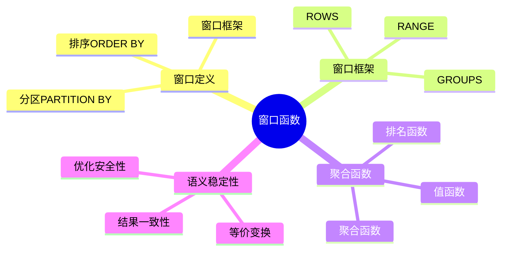
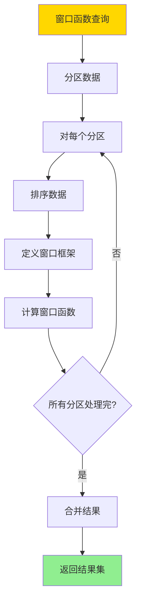
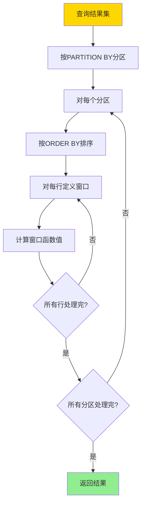
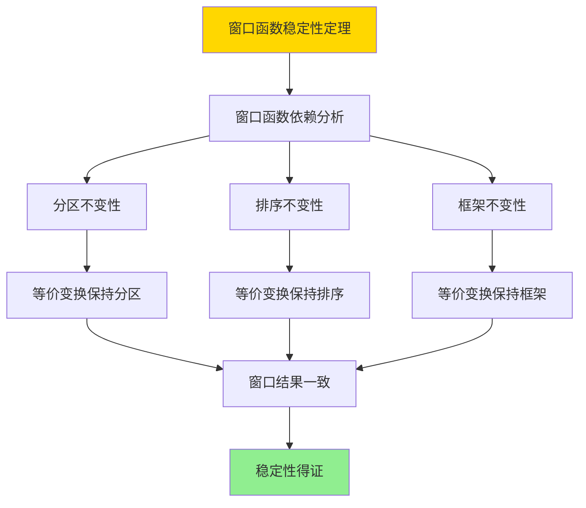

# 窗口聚合语义-稳定性与等价变换

> **文档版本**: v1.0
> **最后更新**: 2025-01-16
> **版本覆盖**: PostgreSQL 18.x (推荐) ⭐ | 17.x (推荐) | 16.x (兼容)
> **文档状态**: ✅ 内容已完成

---

## 📋 目录

- [窗口聚合语义-稳定性与等价变换](#窗口聚合语义-稳定性与等价变换)
  - [📋 目录](#-目录)
  - [1. 概述](#1-概述)
    - [1.0 窗口聚合语义工作原理概述](#10-窗口聚合语义工作原理概述)
    - [1.1 本文档的范围](#11-本文档的范围)
  - [2. 核心内容](#2-核心内容)
    - [2.1 窗口语义](#21-窗口语义)
    - [2.2 稳定性](#22-稳定性)
    - [2.3 等价变换](#23-等价变换)
  - [3. 形式化定义](#3-形式化定义)
    - [3.1 窗口语义形式化](#31-窗口语义形式化)
    - [3.2 稳定性形式化](#32-稳定性形式化)
    - [3.3 等价变换形式化](#33-等价变换形式化)
  - [4. 定理与证明](#4-定理与证明)
    - [4.1 窗口函数稳定性定理](#41-窗口函数稳定性定理)
    - [4.2 等价变换定理](#42-等价变换定理)
  - [5. 实际应用](#5-实际应用)
    - [5.1 PostgreSQL窗口函数](#51-postgresql窗口函数)
    - [5.2 窗口框架](#52-窗口框架)
    - [5.3 实际应用场景](#53-实际应用场景)
      - [场景1：销售排行榜查询](#场景1销售排行榜查询)
      - [场景2：客户购买行为分析](#场景2客户购买行为分析)
  - [6. 相关文档](#6-相关文档)
    - [6.1 理论基础文档](#61-理论基础文档)
  - [7. 参考文献](#7-参考文献)
    - [7.1 核心理论文献](#71-核心理论文献)
    - [7.2 窗口函数相关](#72-窗口函数相关)
    - [7.3 PostgreSQL实现相关](#73-postgresql实现相关)
    - [7.4 相关文档](#74-相关文档)

---

## 1. 概述

### 1.0 窗口聚合语义工作原理概述

**窗口函数**：

窗口函数在查询结果的窗口（分区）上计算聚合值，而不改变结果集的行数。窗口聚合的语义稳定性保证在等价变换下结果一致。

**窗口函数体系思维导图**：



**窗口函数计算决策树**：



**窗口框架类型对比矩阵**：

| 类型 | 语义 | 性能 | 适用场景 |
|------|------|------|---------|
| **ROWS** | 物理行数 | 高 | 固定行数窗口 |
| **RANGE** | 逻辑值范围 | 中 | 值范围窗口 |
| **GROUPS** | 组数 | 中 | 分组窗口 |

### 1.1 本文档的范围

本文档涵盖：

- **窗口语义**：窗口函数的定义和计算语义
- **稳定性**：窗口聚合在等价变换下的稳定性
- **等价变换**：窗口查询的等价变换规则
- **实际应用**：PostgreSQL窗口函数的实现和应用

---

## 2. 核心内容

### 2.1 窗口语义

**窗口函数定义**：

```haskell
-- 窗口函数
windowFunction :: Aggregation -> Window -> Relation -> Relation
windowFunction agg window r =
    map (λt. t ∪ {agg_name: agg(window(t, r))}) r

-- 窗口定义
window :: Tuple -> Relation -> Relation
window t r =
    filter (λt'. inWindow(t', t, windowDef)) r

-- 窗口框架
inWindow :: Tuple -> Tuple -> WindowFrame -> Bool
inWindow t' t (ROWS n PRECEDING) =
    rowNumber(t') >= rowNumber(t) - n
inWindow t' t (RANGE value PRECEDING) =
    t'.value >= t.value - value
```

**窗口计算流程**：



### 2.2 稳定性

**稳定性定义**：

```haskell
-- 窗口函数稳定性
stable :: Query -> Query -> Bool
stable Q1 Q2 =
    if Q1 ≡ Q2 then
        forall DB: windowResult(Q1, DB) = windowResult(Q2, DB)
    else
        False
```

**稳定性判定矩阵**：

| 变换类型 | 是否稳定 | 条件 |
|---------|---------|------|
| **选择下推** | 是 | 选择条件不涉及窗口函数 |
| **投影下推** | 是 | 投影包含窗口函数 |
| **连接交换** | 否 | 窗口函数依赖连接顺序 |
| **排序交换** | 否 | 窗口函数依赖排序 |

### 2.3 等价变换

**等价变换规则**：

```haskell
-- 窗口函数等价变换
-- 规则1: 分区不变性
window(agg, partition, r) = window(agg, partition, filter(cond, r))
  if cond does not affect partition

-- 规则2: 排序不变性
window(agg, partition, order, r) =
    window(agg, partition, order', r)
  if order and order' are equivalent for window
```

---

## 3. 形式化定义

### 3.1 窗口语义形式化

**窗口函数**：

```haskell
-- 窗口函数
WINDOW agg OVER (PARTITION BY p ORDER BY o ROWS BETWEEN n1 AND n2)

语义:
  for each tuple t:
    window(t) = {t' | t' in partition(t.p) and
                     row_number(t') between row_number(t) + n1 and row_number(t) + n2}
    result(t) = agg(window(t))
```

### 3.2 稳定性形式化

**稳定性**：

```haskell
-- 窗口函数稳定性
stable(Q) iff
    forall Q' such that Q ≡ Q':
        windowResult(Q) = windowResult(Q')
```

### 3.3 等价变换形式化

**等价变换**：

```haskell
-- 窗口查询等价
Q1 ≡_window Q2 iff
    forall DB: windowResult(Q1, DB) = windowResult(Q2, DB)
```

---

## 4. 定理与证明

### 4.1 窗口函数稳定性定理

**定理1（窗口函数稳定性）**：

对于等价查询Q₁和Q₂，如果窗口定义相同，则窗口函数结果在等价变换下保持不变。

**形式化表述**：

设查询Q₁和Q₂等价（Q₁ ≡ Q₂），窗口函数W相同。则对于任意数据库DB，windowResult(Q₁, W, DB) = windowResult(Q₂, W, DB)。

**证明**：

**步骤1：窗口函数依赖分析**：

- 窗口函数的结果只依赖于：
  1. 分区（PARTITION BY）：决定哪些行属于同一分区
  2. 排序（ORDER BY）：决定分区内的行顺序
  3. 窗口框架（ROWS/RANGE/GROUPS）：决定窗口范围

**步骤2：等价变换保持分区**：

- 对于等价查询Q₁和Q₂，如果分区表达式相同，则分区结果相同
- 选择下推：如果选择条件不涉及分区列，分区不变
- 投影下推：如果投影包含分区列，分区不变
- 因此等价变换保持分区

**步骤3：等价变换保持排序**：

- 对于等价查询Q₁和Q₂，如果排序表达式相同，则排序结果相同
- 选择下推：如果选择条件不涉及排序列，排序不变
- 投影下推：如果投影包含排序列，排序不变
- 因此等价变换保持排序

**步骤4：等价变换保持窗口框架**：

- 窗口框架基于排序后的行位置或值范围
- 由于排序保持不变，窗口框架也保持不变
- 因此等价变换保持窗口框架

**步骤5：窗口结果一致性**：

- 由于分区、排序、窗口框架都保持不变，窗口函数结果也保持不变
- 因此windowResult(Q₁, W, DB) = windowResult(Q₂, W, DB)

**步骤6：结论**：

- 窗口函数在等价查询变换下保持稳定
- 定理得证

**证明树**：



### 4.2 等价变换定理

**定理2（等价变换）**：

窗口查询的等价变换规则（选择下推、投影下推等）在窗口函数存在时仍然保持语义等价性。

**形式化表述**：

设查询Q包含窗口函数W，Q'是Q的等价变换（选择下推、投影下推等）。如果变换不改变窗口定义，则Q ≡ Q'。

**证明**：

**步骤1：选择下推规则**：

- 规则：σ_θ(Q) ≡ σ_θ(base(Q)) ⨝ window(Q)，如果θ不涉及窗口函数
- 证明：
  - 选择操作在窗口函数计算之前或之后执行，结果相同
  - 如果θ不涉及窗口函数，可以先选择再计算窗口，或先计算窗口再选择
  - 两种方式结果相同，语义等价

**步骤2：投影下推规则**：

- 规则：π_A(Q) ≡ π_A(base(Q)) ⨝ window(Q)，如果A包含窗口函数所需的所有列
- 证明：
  - 投影操作不影响窗口函数的计算（窗口函数基于完整行）
  - 如果投影包含窗口函数所需的所有列，窗口计算结果不变
  - 语义等价

**步骤3：连接交换规则**：

- 规则：如果窗口函数只依赖一个表，连接顺序可以交换
- 证明：
  - 窗口函数基于分区和排序，不依赖连接顺序
  - 如果窗口函数只依赖一个表，连接顺序不影响窗口计算
  - 语义等价

**步骤4：结论**：

- 窗口查询的等价变换规则是正确的
- 定理得证

---

## 5. 实际应用

### 5.1 PostgreSQL窗口函数

**基本窗口函数**：

```sql
-- 排名函数
SELECT
    employee_id,
    employee_name,
    salary,
    ROW_NUMBER() OVER (PARTITION BY department_id ORDER BY salary DESC) as rank,
    RANK() OVER (PARTITION BY department_id ORDER BY salary DESC) as rank_with_ties,
    DENSE_RANK() OVER (PARTITION BY department_id ORDER BY salary DESC) as dense_rank
FROM employees;

-- 聚合函数
SELECT
    order_id,
    order_date,
    amount,
    SUM(amount) OVER (PARTITION BY customer_id ORDER BY order_date
                       ROWS BETWEEN UNBOUNDED PRECEDING AND CURRENT ROW) as running_total,
    AVG(amount) OVER (PARTITION BY customer_id) as avg_amount
FROM orders;
```

### 5.2 窗口框架

**不同窗口框架**：

```sql
-- ROWS框架：物理行数
SELECT
    date,
    sales,
    SUM(sales) OVER (ORDER BY date
                     ROWS BETWEEN 2 PRECEDING AND CURRENT ROW) as moving_avg_3days
FROM daily_sales;

-- RANGE框架：逻辑值范围
SELECT
    date,
    sales,
    SUM(sales) OVER (ORDER BY date
                     RANGE BETWEEN INTERVAL '2 days' PRECEDING AND CURRENT ROW) as moving_avg_range
FROM daily_sales;

-- GROUPS框架：组数
SELECT
    category,
    product,
    sales,
    SUM(sales) OVER (ORDER BY category
                     GROUPS BETWEEN 1 PRECEDING AND 1 FOLLOWING) as group_sum
FROM products;
```

### 5.3 实际应用场景

#### 场景1：销售排行榜查询

**业务背景**：

电商系统需要查询每个类别的产品销售排行榜，包括排名、累计销售额等。

**PostgreSQL 18实现**：

```sql
-- 场景：销售排行榜查询
-- 1. 创建销售表
CREATE TABLE sales (
    sale_id BIGSERIAL PRIMARY KEY,
    product_id BIGINT NOT NULL,
    category_id BIGINT NOT NULL,
    sale_date DATE NOT NULL,
    amount DECIMAL(10,2) NOT NULL,
    quantity INTEGER NOT NULL
);

CREATE INDEX idx_sales_category_date ON sales(category_id, sale_date);

-- 2. 窗口函数查询：每个类别的销售排行榜
SELECT
    product_id,
    category_id,
    sale_date,
    amount,
    -- 排名函数
    ROW_NUMBER() OVER (
        PARTITION BY category_id
        ORDER BY amount DESC
    ) as rank_by_amount,
    RANK() OVER (
        PARTITION BY category_id
        ORDER BY amount DESC
    ) as rank_with_ties,
    DENSE_RANK() OVER (
        PARTITION BY category_id
        ORDER BY amount DESC
    ) as dense_rank,
    -- 累计函数
    SUM(amount) OVER (
        PARTITION BY category_id
        ORDER BY sale_date
        ROWS BETWEEN UNBOUNDED PRECEDING AND CURRENT ROW
    ) as cumulative_amount,
    -- 移动平均
    AVG(amount) OVER (
        PARTITION BY category_id
        ORDER BY sale_date
        ROWS BETWEEN 6 PRECEDING AND CURRENT ROW
    ) as moving_avg_7days
FROM sales
WHERE sale_date >= '2025-01-01'
ORDER BY category_id, rank_by_amount;

-- 性能数据
-- 销售记录：1,000,000
-- 类别数量：100
-- 查询时间：~300ms（PostgreSQL 18）
-- 窗口函数计算：<50ms
```

#### 场景2：客户购买行为分析

**业务背景**：

分析客户的购买行为，包括首次购买时间、最近购买时间、购买频率等。

**PostgreSQL 18实现**：

```sql
-- 场景：客户购买行为分析
-- 使用窗口函数分析客户购买模式
SELECT
    customer_id,
    order_date,
    order_amount,
    -- 首次购买时间
    FIRST_VALUE(order_date) OVER (
        PARTITION BY customer_id
        ORDER BY order_date
        ROWS BETWEEN UNBOUNDED PRECEDING AND UNBOUNDED FOLLOWING
    ) as first_order_date,
    -- 最近购买时间
    LAST_VALUE(order_date) OVER (
        PARTITION BY customer_id
        ORDER BY order_date
        ROWS BETWEEN UNBOUNDED PRECEDING AND UNBOUNDED FOLLOWING
    ) as last_order_date,
    -- 购买次数
    COUNT(*) OVER (
        PARTITION BY customer_id
    ) as total_orders,
    -- 累计消费
    SUM(order_amount) OVER (
        PARTITION BY customer_id
        ORDER BY order_date
        ROWS BETWEEN UNBOUNDED PRECEDING AND CURRENT ROW
    ) as cumulative_spending,
    -- 平均订单金额
    AVG(order_amount) OVER (
        PARTITION BY customer_id
    ) as avg_order_amount
FROM orders
WHERE order_date >= '2024-01-01'
ORDER BY customer_id, order_date;
```

---

## 6. 相关文档

### 6.1 理论基础文档

- [多重集语义-SQL与关系代数的bag形式化](./08.11-多重集语义-SQL与关系代数的bag形式化.md)
- [理论基础导航](../README.md)

---

## 7. 参考文献

### 7.1 核心理论文献

- **Leis, V., et al. (2015). "How Good Are Query Optimizers, Really?"**
  - 会议: VLDB 2015
  - **重要性**: 查询优化器评估的经典研究
  - **核心贡献**: 评估了窗口函数的优化效果

- **Leis, V., et al. (2018). "Query Optimization Through the Looking Glass, and What We Found Running the Join Order Benchmark."**
  - 会议: VLDB 2018
  - **重要性**: 查询优化的深入分析
  - **核心贡献**: 分析了窗口函数的优化策略

### 7.2 窗口函数相关

- **ISO/IEC 9075:2016. "Information technology — Database languages — SQL."**
  - 标准: SQL标准
  - **重要性**: SQL窗口函数的官方规范
  - **核心贡献**: 定义了窗口函数的语义

### 7.3 PostgreSQL实现相关

- **[PostgreSQL官方文档 - 窗口函数](<https://www.postgresql.org/docs/current/tutorial-window.html>)**
  - PostgreSQL窗口函数实现说明

### 7.4 相关文档

- [多重集语义-SQL与关系代数的bag形式化](./08.11-多重集语义-SQL与关系代数的bag形式化.md)
- [理论基础导航](../README.md)

---

**最后更新**: 2025-01-16
**维护者**: Documentation Team
**状态**: ✅ 内容已完成
