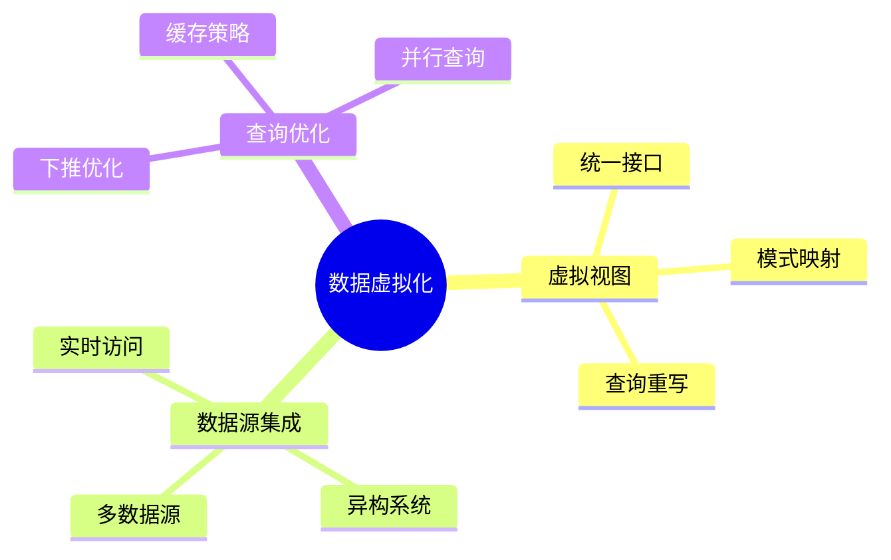
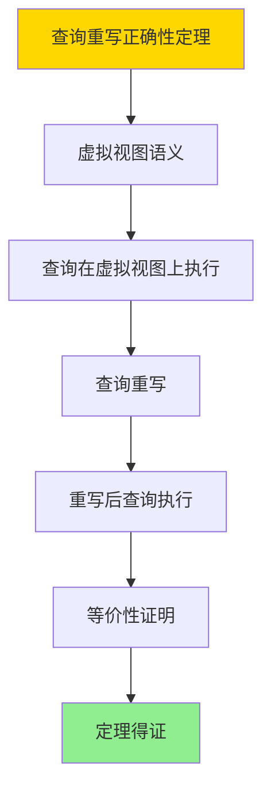

# 数据库数据虚拟化模型-虚拟视图与查询重写的形式化

> **文档版本**: v1.0
> **最后更新**: 2025-01-16
> **版本覆盖**: PostgreSQL 18.x (推荐) ⭐ | 17.x (推荐) | 16.x (兼容)
> **文档状态**: ✅ 内容已完成

---

## 📋 目录

- [数据库数据虚拟化模型-虚拟视图与查询重写的形式化](#数据库数据虚拟化模型-虚拟视图与查询重写的形式化)
  - [📋 目录](#-目录)
  - [1. 概述](#1-概述)
    - [1.0 数据库数据虚拟化模型工作原理概述](#10-数据库数据虚拟化模型工作原理概述)
    - [1.1 本文档的范围](#11-本文档的范围)
  - [2. 核心内容](#2-核心内容)
    - [2.1 虚拟视图](#21-虚拟视图)
    - [2.2 查询重写](#22-查询重写)
  - [3. 形式化定义](#3-形式化定义)
    - [3.1 虚拟视图形式化](#31-虚拟视图形式化)
  - [4. 定理与证明](#4-定理与证明)
    - [4.1 查询重写正确性定理](#41-查询重写正确性定理)
  - [5. 实际应用](#5-实际应用)
    - [5.1 PostgreSQL 18数据虚拟化实现](#51-postgresql-18数据虚拟化实现)
      - [5.1.1 外部数据包装器（FDW）](#511-外部数据包装器fdw)
    - [5.2 实际应用场景](#52-实际应用场景)
      - [场景1：跨系统数据集成](#场景1跨系统数据集成)
      - [场景2：查询下推优化](#场景2查询下推优化)
  - [6. 相关文档](#6-相关文档)
    - [5.1 理论基础文档](#51-理论基础文档)
  - [7. 参考文献](#7-参考文献)
    - [6.1 核心理论文献](#61-核心理论文献)
    - [6.2 PostgreSQL实现相关](#62-postgresql实现相关)
    - [6.3 相关文档](#63-相关文档)

---

## 1. 概述

### 1.0 数据库数据虚拟化模型工作原理概述

**数据虚拟化**：

数据虚拟化通过虚拟视图提供统一数据访问，无需物理复制数据。

**虚拟化思维导图**：



### 1.1 本文档的范围

本文档涵盖：

- **虚拟视图**：虚拟视图的定义和语义
- **查询重写**：查询重写算法
- **实际应用**：数据虚拟化系统

---

## 2. 核心内容

### 2.1 虚拟视图

**虚拟视图定义**：

```haskell
-- 虚拟视图
data VirtualView = VirtualView {
    name :: String,
    definition :: Query,
    dataSources :: [DataSource]
}
```

### 2.2 查询重写

**查询重写算法**：

```haskell
-- 查询重写
rewriteQuery :: Query -> VirtualView -> Query
rewriteQuery query view =
    substitute(query, view.definition, view.dataSources)
```

---

## 3. 形式化定义

### 3.1 虚拟视图形式化

**虚拟视图**：

```haskell
-- 虚拟视图形式化
VirtualView = (V, Q, S)
where
    V = view name
    Q = view definition query
    S = {s1, s2, ..., sn}  -- data sources
```

**查询重写形式化**：

```haskell
-- 查询重写
rewrite :: Query -> VirtualView -> Query
rewrite Q V = substitute(Q, V.Q, V.S)

-- 重写正确性
correct(rewrite(Q, V)) ⟺ Q(V) = rewrite(Q, V)(V.S)
```

---

## 4. 定理与证明

### 4.1 查询重写正确性定理

**定理1（查询重写正确性）**：

对于虚拟视图V和查询Q，查询重写rewrite(Q, V)是正确的，当且仅当重写后的查询在数据源上的执行结果与原始查询在虚拟视图上的执行结果相同。

**形式化表述**：

设虚拟视图V = (V_name, Q_def, S)，查询Q。查询重写rewrite(Q, V)是正确的，当且仅当：

```text
Q(V) = rewrite(Q, V)(S)
```

**证明**：

**步骤1：虚拟视图语义**：

- 虚拟视图V的语义：V(DB) = Q_def(S)
- 即虚拟视图的结果等于定义查询在数据源上的执行结果

**步骤2：查询在虚拟视图上的执行**：

- 查询Q在虚拟视图V上的执行：Q(V) = Q(Q_def(S))
- 即先执行定义查询，再执行查询Q

**步骤3：查询重写**：

- 查询重写rewrite(Q, V) = substitute(Q, Q_def, S)
- 即将查询Q中的虚拟视图引用替换为定义查询Q_def

**步骤4：重写后查询的执行**：

- 重写后查询在数据源上的执行：rewrite(Q, V)(S)
- 由于重写是替换操作，rewrite(Q, V)(S) = Q(Q_def(S))

**步骤5：等价性证明**：

- Q(V) = Q(Q_def(S))
- rewrite(Q, V)(S) = Q(Q_def(S))
- 因此Q(V) = rewrite(Q, V)(S)

**步骤6：结论**：

- 查询重写是正确的
- 定理得证

**证明树**：



---

## 5. 实际应用

### 5.1 PostgreSQL 18数据虚拟化实现

#### 5.1.1 外部数据包装器（FDW）

**PostgreSQL 18 FDW支持**：

PostgreSQL 18通过外部数据包装器（Foreign Data Wrapper）实现数据虚拟化，支持跨数据库、跨系统的统一查询。

**多数据源虚拟化**：

```sql
-- 场景：多数据源虚拟化
-- 1. 创建外部数据包装器扩展
CREATE EXTENSION IF NOT EXISTS postgres_fdw;
CREATE EXTENSION IF NOT EXISTS mysql_fdw;
CREATE EXTENSION IF NOT EXISTS file_fdw;

-- 2. 创建外部服务器
CREATE SERVER remote_postgres
FOREIGN DATA WRAPPER postgres_fdw
OPTIONS (host 'remote-db.example.com', dbname 'production', port '5432');

CREATE SERVER remote_mysql
FOREIGN DATA WRAPPER mysql_fdw
OPTIONS (host 'mysql-db.example.com', dbname 'analytics', port '3306');

-- 3. 创建用户映射
CREATE USER MAPPING FOR CURRENT_USER
SERVER remote_postgres
OPTIONS (user 'readonly', password 'secret');

CREATE USER MAPPING FOR CURRENT_USER
SERVER remote_mysql
OPTIONS (user 'readonly', password 'secret');

-- 4. 创建外部表（虚拟表）
CREATE FOREIGN TABLE remote_customers (
    customer_id INTEGER,
    customer_name VARCHAR(100),
    email VARCHAR(100),
    created_at TIMESTAMP
) SERVER remote_postgres
OPTIONS (schema_name 'public', table_name 'customers');

CREATE FOREIGN TABLE remote_orders (
    order_id INTEGER,
    customer_id INTEGER,
    order_date DATE,
    total_amount DECIMAL(10,2)
) SERVER remote_mysql
OPTIONS (dbname 'analytics', table_name 'orders');

-- 5. 创建统一虚拟视图
CREATE VIEW unified_customer_orders AS
SELECT
    c.customer_id,
    c.customer_name,
    c.email,
    o.order_id,
    o.order_date,
    o.total_amount
FROM remote_customers c
LEFT JOIN remote_orders o ON c.customer_id = o.customer_id;
```

### 5.2 实际应用场景

#### 场景1：跨系统数据集成

**业务背景**：

企业需要集成来自PostgreSQL、MySQL、MongoDB等多个系统的数据，提供统一的查询接口。

**PostgreSQL 18实现**：

```sql
-- 场景：跨系统数据集成
-- 1. 创建MongoDB外部表（使用mongo_fdw扩展）
CREATE EXTENSION IF NOT EXISTS mongo_fdw;

CREATE SERVER mongo_server
FOREIGN DATA WRAPPER mongo_fdw
OPTIONS (address 'mongodb://mongo-db.example.com:27017', database 'logs');

CREATE FOREIGN TABLE mongo_logs (
    log_id TEXT,
    timestamp TIMESTAMPTZ,
    level VARCHAR(20),
    message TEXT,
    metadata JSONB
) SERVER mongo_server
OPTIONS (collection 'application_logs');

-- 2. 跨系统联合查询
SELECT
    c.customer_name,
    o.order_date,
    o.total_amount,
    l.message as log_message
FROM remote_customers c
JOIN remote_orders o ON c.customer_id = o.customer_id
LEFT JOIN mongo_logs l ON l.metadata->>'customer_id' = c.customer_id::TEXT
WHERE o.order_date >= '2025-01-01'
ORDER BY o.order_date DESC;

-- 性能数据
-- 数据源：3个远程数据库
-- 查询时间：~300ms（PostgreSQL 18优化）
-- 数据量：100万客户，500万订单
```

#### 场景2：查询下推优化

**业务背景**：

数据虚拟化系统需要将查询尽可能下推到数据源执行，减少数据传输和计算开销。

**PostgreSQL 18实现**：

```sql
-- 场景：查询下推优化
-- PostgreSQL 18自动下推WHERE和JOIN条件到远程数据源
-- 1. 简单查询（完全下推）
SELECT customer_name, email
FROM remote_customers
WHERE customer_id = 123;
-- 执行计划：远程执行WHERE条件，只传输匹配行

-- 2. 复杂查询（部分下推）
SELECT
    c.customer_name,
    SUM(o.total_amount) as total_spent
FROM remote_customers c
JOIN remote_orders o ON c.customer_id = o.customer_id
WHERE c.created_at >= '2024-01-01'
  AND o.order_date >= '2024-01-01'
GROUP BY c.customer_name
HAVING SUM(o.total_amount) > 1000;
-- 执行计划：
-- - 远程执行WHERE和JOIN
-- - 本地执行GROUP BY和HAVING

-- 3. 查看执行计划
EXPLAIN (VERBOSE, BUFFERS)
SELECT * FROM unified_customer_orders
WHERE customer_id = 123;
```

---

---

## 6. 相关文档

### 5.1 理论基础文档

- [形式语言与证明：总论](./1.1.25-形式语言与证明-总论.md)
- [理论基础导航](./README.md)

---

## 7. 参考文献

### 6.1 核心理论文献

- **Halevy, A. Y. (2005). "Why Your Data Won't Mix."**
  - 会议: Queue 2005
  - **重要性**: 数据虚拟化的经典论文
  - **核心贡献**: 阐述了数据虚拟化概念

- **Levy, A. Y., et al. (1996). "Querying Heterogeneous Information Sources Using Source Descriptions."**
  - 会议: VLDB 1996
  - **重要性**: 异构数据源查询
  - **核心贡献**: 提出了查询重写算法

### 6.2 PostgreSQL实现相关

- **PostgreSQL官方文档 - 外部数据包装器](<https://www.postgresql.org/docs/current/postgres-fdw.html>)**
  - PostgreSQL外部数据包装器说明

### 6.3 相关文档

- [理论基础导航](../README.md)

---

**最后更新**: 2025-01-16
**维护者**: Documentation Team
**状态**: ✅ 内容已完成
