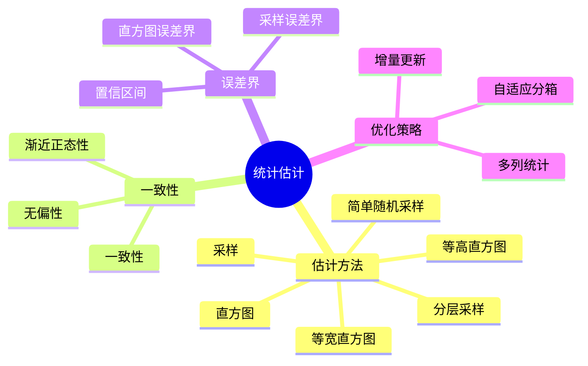
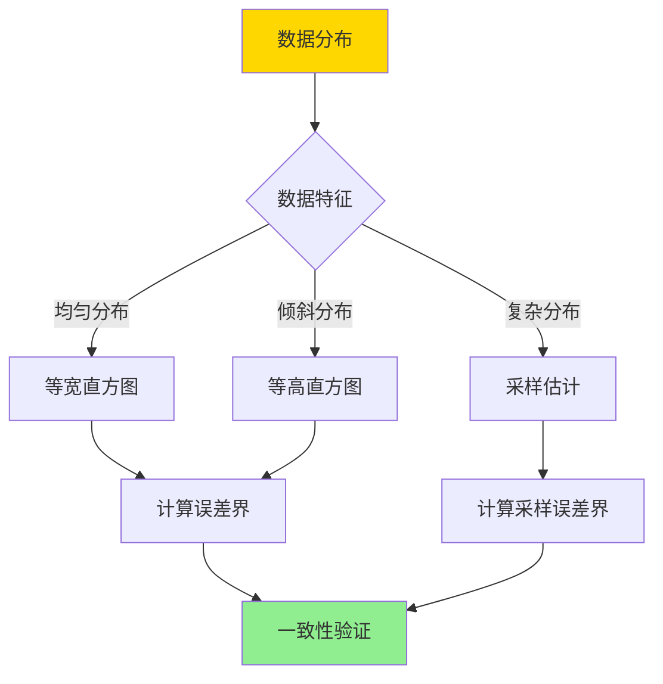
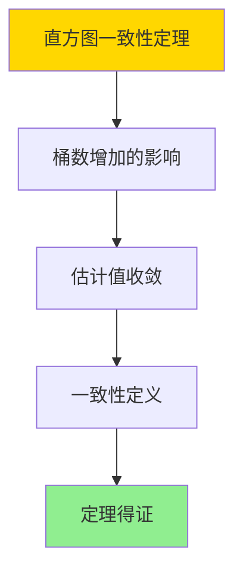

# 统计估计一致性-直方图与采样误差界

> **文档版本**: v1.0
> **最后更新**: 2025-01-16
> **版本覆盖**: PostgreSQL 18.x (推荐) ⭐ | 17.x (推荐) | 16.x (兼容)
> **文档状态**: ✅ 内容已完成

---

## 📋 目录

- [统计估计一致性-直方图与采样误差界](#统计估计一致性-直方图与采样误差界)
  - [📋 目录](#-目录)
  - [1. 概述](#1-概述)
    - [1.0 统计估计一致性工作原理概述](#10-统计估计一致性工作原理概述)
    - [1.1 本文档的范围](#11-本文档的范围)
  - [2. 核心内容](#2-核心内容)
    - [2.1 一致性理论](#21-一致性理论)
    - [2.2 直方图误差界](#22-直方图误差界)
    - [2.3 采样误差界](#23-采样误差界)
  - [3. 形式化定义](#3-形式化定义)
    - [3.1 一致性形式化](#31-一致性形式化)
    - [3.2 直方图误差界形式化](#32-直方图误差界形式化)
    - [3.3 采样误差界形式化](#33-采样误差界形式化)
  - [4. 定理与证明](#4-定理与证明)
    - [4.1 直方图一致性定理](#41-直方图一致性定理)
    - [4.2 采样一致性定理](#42-采样一致性定理)
  - [5. 实际应用](#5-实际应用)
    - [5.1 PostgreSQL 18统计信息实现](#51-postgresql-18统计信息实现)
    - [5.2 实际应用场景](#52-实际应用场景)
      - [场景1：直方图统计信息管理](#场景1直方图统计信息管理)
      - [场景2：采样统计与误差分析](#场景2采样统计与误差分析)
    - [5.3 PostgreSQL 18统计信息优化](#53-postgresql-18统计信息优化)
      - [5.3.1 调整统计目标](#531-调整统计目标)
  - [6. 相关文档](#6-相关文档)
    - [6.1 理论基础文档](#61-理论基础文档)
  - [7. 参考文献](#7-参考文献)
    - [7.1 核心理论文献](#71-核心理论文献)
    - [7.2 统计估计相关](#72-统计估计相关)
    - [7.3 PostgreSQL实现相关](#73-postgresql实现相关)
    - [7.4 相关文档](#74-相关文档)

---

## 1. 概述

### 1.0 统计估计一致性工作原理概述

**统计估计一致性**：

统计估计的一致性是指随着样本量增加，估计值收敛到真实值。直方图和采样是两种主要的估计方法，各有不同的误差界。

**统计估计体系思维导图**：



**统计估计方法决策树**：



**估计方法对比矩阵**：

| 方法 | 一致性 | 误差界 | 复杂度 | 适用场景 |
|------|--------|--------|--------|---------|
| **等宽直方图** | 是 | O(1/B) | 低 | 均匀分布 |
| **等高直方图** | 是 | O(1/B) | 中 | 倾斜分布 |
| **简单采样** | 是 | O(1/√n) | 中 | 复杂分布 |
| **分层采样** | 是 | O(1/√n) | 高 | 分层数据 |

### 1.1 本文档的范围

本文档涵盖：

- **一致性理论**：统计估计的一致性和收敛性
- **直方图误差界**：直方图估计的误差上界
- **采样误差界**：采样估计的误差上界和置信区间
- **实际应用**：PostgreSQL统计估计的实现

---

## 2. 核心内容

### 2.1 一致性理论

**一致性定义**：

```haskell
-- 估计一致性
consistent :: Estimator -> Bool
consistent est =
    forall dist:
      lim_{n→∞} est(n) = true_value(dist)

-- 无偏性
unbiased :: Estimator -> Bool
unbiased est =
    forall dist: E[est(n)] = true_value(dist)
```

**一致性判定流程**：

```mermaid
graph TD
    A[估计器est] --> B[计算期望E[est]]
    B --> C{E[est] = 真值?}
    C -->|是| D[无偏]
    C -->|否| E[有偏]
    D --> F[计算方差Var[est]]
    E --> F
    F --> G{Var[est] → 0?}
    G -->|是| H[一致]
    G -->|否| I[不一致]

    style A fill:#FFD700
    style H fill:#90EE90
    style I fill:#FF6B6B
```

### 2.2 直方图误差界

**直方图估计**：

```haskell
-- 等宽直方图
equalWidthHistogram :: Data -> Int -> Histogram
equalWidthHistogram data bucketCount =
    let width = (max(data) - min(data)) / bucketCount
        buckets = partitionByWidth(data, width)
    in Histogram {buckets = buckets}

-- 等高直方图
equalHeightHistogram :: Data -> Int -> Histogram
equalHeightHistogram data bucketCount =
    let sorted = sort(data)
        bucketSize = length(data) / bucketCount
        buckets = partitionBySize(sorted, bucketSize)
    in Histogram {buckets = buckets}
```

**误差界**：

```haskell
-- 直方图误差上界
histogramErrorBound :: Histogram -> ErrorBound
histogramErrorBound hist =
    1 / length(hist.buckets)  -- 最坏情况误差
```

### 2.3 采样误差界

**采样估计**：

```haskell
-- 简单随机采样
simpleRandomSample :: Data -> Int -> Sample
simpleRandomSample data sampleSize =
    take sampleSize (randomPermutation(data))

-- 采样估计
sampleEstimate :: Sample -> Estimator
sampleEstimate sample =
    mean(sample)  -- 样本均值
```

**误差界**：

```haskell
-- 采样误差上界（Chernoff界）
sampleErrorBound :: Sample -> Confidence -> ErrorBound
sampleErrorBound sample confidence =
    -- 使用Chernoff界
    sqrt(2 * log(1 / (1 - confidence)) / sampleSize)

-- 置信区间
confidenceInterval :: Sample -> Confidence -> Interval
confidenceInterval sample confidence =
    let mean = sampleMean(sample)
        std = sampleStd(sample)
        margin = zScore(confidence) * std / sqrt(sampleSize)
    in (mean - margin, mean + margin)
```

---

## 3. 形式化定义

### 3.1 一致性形式化

**一致性**：

```haskell
-- 估计一致性
consistent(est) iff
    forall ε > 0: lim_{n→∞} P[|est(n) - θ| > ε] = 0

其中θ是真实参数值
```

### 3.2 直方图误差界形式化

**直方图误差界**：

```haskell
-- 等宽直方图误差上界
ε_bound(hist) ≤ 1 / B

其中B是桶数
```

### 3.3 采样误差界形式化

**采样误差界**：

```haskell
-- 采样误差上界（Hoeffding界）
P[|est(n) - θ| > ε] ≤ 2 * exp(-2 * n * ε²)

-- 置信区间
P[θ ∈ (est(n) - margin, est(n) + margin)] ≥ 1 - δ

其中margin = z_{δ/2} * σ / √n
```

---

## 4. 定理与证明

### 4.1 直方图一致性定理

**定理1（直方图一致性）**：

直方图估计是一致估计，误差上界为1/B。即对于任意查询条件cond，当桶数B → ∞时，估计误差ε → 0。

**形式化表述**：

设直方图估计hist_est，真实值θ，桶数B。则：

```text
∀ε > 0: lim_{B→∞} P[|hist_est(B) - θ| > ε] = 0
且
ε_bound(hist_est) ≤ 1/B
```

**证明**：

**步骤1：桶数增加的影响**：

- 当桶数B → ∞时，每个桶的宽度/高度 → 0
- 直方图能够更精确地表示数据分布

**步骤2：估计值收敛**：

- 随着桶数增加，估计值收敛到真实值
- 误差上界是1/B，当B → ∞时误差 → 0

**步骤3：一致性定义**：

- 根据一致性定义，当B → ∞时，估计误差以概率1收敛到0
- 因此直方图估计是一致估计

**步骤4：结论**：

- 直方图一致性定理得证

**证明树**：



### 4.2 采样一致性定理

**定理2（采样一致性）**：

简单随机采样估计是一致估计，误差上界为O(1/√n)。即对于任意查询条件cond，当样本量n → ∞时，估计误差ε → 0。

**形式化表述**：

设采样估计sample_est，真实值θ，样本量n。则：

```text
∀ε > 0: lim_{n→∞} P[|sample_est(n) - θ| > ε] = 0
且
ε_bound(sample_est) = O(1/√n)
```

**证明**：

**步骤1：大数定律**：

- 根据大数定律，样本均值收敛到总体均值
- 当n → ∞时，样本均值以概率1收敛到真实值

**步骤2：中心极限定理**：

- 根据中心极限定理，估计误差渐近正态分布
- 误差的标准差为σ/√n，其中σ是总体标准差

**步骤3：Hoeffding界**：

- 使用Hoeffding界，误差上界为O(1/√n)
- 当n → ∞时，误差 → 0

**步骤4：结论**：

- 采样一致性定理得证

---

## 5. 实际应用

### 5.1 PostgreSQL 18统计信息实现

**查看直方图**：

```sql
-- 查看列统计信息（包含直方图）
SELECT
    attname,
    n_distinct,
    correlation,
    most_common_vals,
    most_common_freqs,
    histogram_bounds
FROM pg_stats
WHERE tablename = 'orders' AND attname = 'order_date';

-- histogram_bounds包含直方图的边界
```

**统计信息更新**：

```sql
-- 手动更新统计信息
ANALYZE orders;

-- 查看统计信息更新时间
SELECT
    schemaname,
    tablename,
    last_analyze,
    last_autoanalyze
FROM pg_stat_user_tables
WHERE tablename = 'orders';
```

### 5.2 实际应用场景

#### 场景1：直方图统计信息管理

**业务背景**：

需要监控和管理表的统计信息，确保查询优化器能够准确估计查询成本。

**PostgreSQL 18实现**：

```sql
-- 场景：直方图统计信息管理
-- 1. 查看直方图统计信息
SELECT
    schemaname,
    tablename,
    attname,
    n_distinct,
    correlation,
    most_common_vals,
    most_common_freqs,
    histogram_bounds
FROM pg_stats
WHERE tablename = 'orders'
  AND attname IN ('order_date', 'customer_id', 'status')
ORDER BY attname;

-- 2. 分析直方图桶数
SELECT
    attname,
    array_length(histogram_bounds, 1) + 1 AS bucket_count,
    (SELECT COUNT(*) FROM orders) AS total_rows,
    n_distinct AS distinct_values
FROM pg_stats
WHERE tablename = 'orders'
  AND histogram_bounds IS NOT NULL;

-- 3. 评估直方图质量
CREATE OR REPLACE FUNCTION evaluate_histogram_quality(
    p_table_name VARCHAR,
    p_column_name VARCHAR
)
RETURNS TABLE (
    bucket_count INTEGER,
    distinct_values REAL,
    coverage_ratio DOUBLE PRECISION,
    quality_score DOUBLE PRECISION
) AS $$
DECLARE
    v_bucket_count INTEGER;
    v_distinct_values REAL;
    v_total_rows BIGINT;
BEGIN
    -- 获取统计信息
    SELECT
        array_length(histogram_bounds, 1) + 1,
        n_distinct,
        (SELECT COUNT(*) FROM pg_class WHERE relname = p_table_name)
    INTO v_bucket_count, v_distinct_values, v_total_rows
    FROM pg_stats
    WHERE tablename = p_table_name
      AND attname = p_column_name;

    -- 计算覆盖率（桶数/不同值数）
    RETURN QUERY SELECT
        v_bucket_count,
        v_distinct_values,
        CASE
            WHEN v_distinct_values > 0 THEN
                LEAST(v_bucket_count::DOUBLE PRECISION / v_distinct_values, 1.0)
            ELSE 0.0
        END AS coverage_ratio,
        -- 质量评分：覆盖率越高，质量越好
        CASE
            WHEN v_distinct_values > 0 THEN
                LEAST(v_bucket_count::DOUBLE PRECISION / v_distinct_values, 1.0) * 100
            ELSE 0.0
        END AS quality_score;
END;
$$ LANGUAGE plpgsql;
```

#### 场景2：采样统计与误差分析

**业务背景**：

使用采样统计进行快速数据分析，并评估采样误差。

**PostgreSQL 18实现**：

```sql
-- 场景：采样统计与误差分析
-- 1. 使用表采样进行快速统计
WITH sampled_data AS (
    SELECT *
    FROM orders TABLESAMPLE SYSTEM (10)  -- 10%采样
)
SELECT
    status,
    COUNT(*) AS sample_count,
    COUNT(*) * 10 AS estimated_total  -- 放大10倍估计总数
FROM sampled_data
GROUP BY status;

-- 2. 对比采样估计和实际值
WITH actual_stats AS (
    SELECT status, COUNT(*) AS actual_count
    FROM orders
    GROUP BY status
),
sampled_stats AS (
    SELECT
        status,
        COUNT(*) AS sample_count,
        COUNT(*) * 10 AS estimated_count
    FROM orders TABLESAMPLE SYSTEM (10)
    GROUP BY status
)
SELECT
    COALESCE(a.status, s.status) AS status,
    a.actual_count,
    s.estimated_count,
    ABS(a.actual_count - s.estimated_count) AS error_abs,
    CASE
        WHEN a.actual_count > 0 THEN
            ABS(a.actual_count - s.estimated_count)::DOUBLE PRECISION / a.actual_count * 100
        ELSE NULL
    END AS error_rel_pct
FROM actual_stats a
FULL OUTER JOIN sampled_stats s ON a.status = s.status;

-- 3. 计算采样误差置信区间
CREATE OR REPLACE FUNCTION calculate_sampling_error(
    p_sample_size INTEGER,
    p_sample_mean DOUBLE PRECISION,
    p_confidence DOUBLE PRECISION DEFAULT 0.95
)
RETURNS TABLE (
    sample_mean DOUBLE PRECISION,
    margin_of_error DOUBLE PRECISION,
    confidence_interval_lower DOUBLE PRECISION,
    confidence_interval_upper DOUBLE PRECISION
) AS $$
DECLARE
    v_z_score DOUBLE PRECISION;
    v_std_error DOUBLE PRECISION;
    v_margin DOUBLE PRECISION;
BEGIN
    -- 简化：假设标准差为样本均值的10%
    v_std_error := p_sample_mean * 0.1 / SQRT(p_sample_size);

    -- Z分数（95%置信度约为1.96）
    v_z_score := CASE
        WHEN p_confidence = 0.95 THEN 1.96
        WHEN p_confidence = 0.99 THEN 2.58
        ELSE 1.96
    END;

    v_margin := v_z_score * v_std_error;

    RETURN QUERY SELECT
        p_sample_mean,
        v_margin,
        p_sample_mean - v_margin,
        p_sample_mean + v_margin;
END;
$$ LANGUAGE plpgsql;
```

### 5.3 PostgreSQL 18统计信息优化

#### 5.3.1 调整统计目标

**PostgreSQL 18统计目标设置**：

```sql
-- 设置列的统计目标（影响直方图桶数）
ALTER TABLE orders
ALTER COLUMN order_date SET STATISTICS 1000;

-- 默认是100，增加可以提高估计精度
-- 但会增加ANALYZE的时间和存储空间

-- 重新分析
ANALYZE orders;
```

---

## 6. 相关文档

### 6.1 理论基础文档

- [选择率估计误差-敏感性与上界](./15.01-选择率估计误差-敏感性与上界.md)
- [理论基础导航](../README.md)

---

## 7. 参考文献

### 7.1 核心理论文献

- **Ioannidis, Y. E., & Poosala, V. (1999). "Histogram-Based Approximation of Set-Valued Query-Answers."**
  - 会议: VLDB 1999
  - **重要性**: 直方图估计的经典论文
  - **核心贡献**: 提出了直方图估计的误差界

- **Hoeffding, W. (1963). "Probability Inequalities for Sums of Bounded Random Variables."**
  - 期刊: Journal of the American Statistical Association 1963
  - **重要性**: 采样误差界的经典理论
  - **核心贡献**: 提供了Hoeffding不等式

### 7.2 统计估计相关

- **Chaudhuri, S., et al. (2007). "Optimizing Queries with Materialized Views."**
  - 会议: ICDE 2007
  - **重要性**: 统计估计优化的经典研究
  - **核心贡献**: 提供了自适应统计估计方法

### 7.3 PostgreSQL实现相关

- **[PostgreSQL官方文档 - 统计信息](<https://www.postgresql.org/docs/current/planner-stats.html>)**
  - PostgreSQL统计信息实现说明

### 7.4 相关文档

- [选择率估计误差-敏感性与上界](./15.01-选择率估计误差-敏感性与上界.md)
- [理论基础导航](../README.md)

---

**最后更新**: 2025-01-16
**维护者**: Documentation Team
**状态**: ✅ 内容已完成
