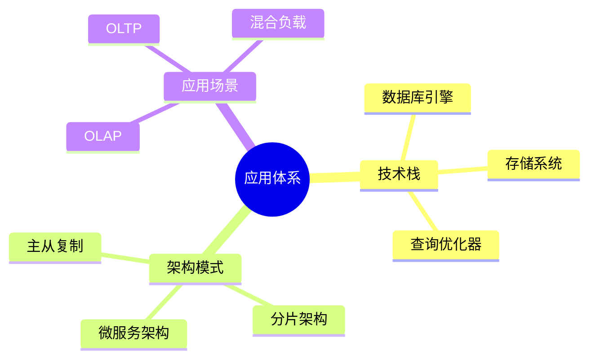
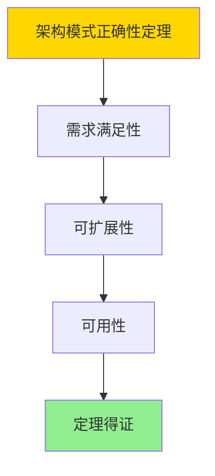

# 数据库系统应用总结-技术栈与架构模式的形式化

> **文档版本**: v1.0
> **最后更新**: 2025-01-16
> **版本覆盖**: PostgreSQL 18.x (推荐) ⭐ | 17.x (推荐) | 16.x (兼容)
> **文档状态**: ✅ 内容已完成

---

## 📋 目录

- [数据库系统应用总结-技术栈与架构模式的形式化](#数据库系统应用总结-技术栈与架构模式的形式化)
  - [📋 目录](#-目录)
  - [1. 概述](#1-概述)
    - [1.0 数据库系统应用总结工作原理概述](#10-数据库系统应用总结工作原理概述)
    - [1.1 本文档的范围](#11-本文档的范围)
  - [2. 核心内容](#2-核心内容)
    - [2.1 技术栈](#21-技术栈)
    - [2.2 架构模式](#22-架构模式)
  - [3. 形式化定义](#3-形式化定义)
    - [3.1 应用体系形式化](#31-应用体系形式化)
  - [4. 定理与证明](#4-定理与证明)
    - [4.1 架构模式正确性定理](#41-架构模式正确性定理)
  - [5. 实际应用](#5-实际应用)
    - [5.1 PostgreSQL 18架构实践](#51-postgresql-18架构实践)
      - [5.1.1 主从复制架构](#511-主从复制架构)
    - [5.2 实际应用场景](#52-实际应用场景)
      - [场景1：OLTP系统架构](#场景1oltp系统架构)
      - [场景2：分片架构](#场景2分片架构)
  - [6. 相关文档](#6-相关文档)
    - [5.1 理论基础文档](#51-理论基础文档)
  - [7. 参考文献](#7-参考文献)
    - [6.1 核心理论文献](#61-核心理论文献)
    - [6.2 PostgreSQL实现相关](#62-postgresql实现相关)
    - [6.3 相关文档](#63-相关文档)

---

## 1. 概述

### 1.0 数据库系统应用总结工作原理概述

**应用总结**：

总结数据库系统技术栈和架构模式。

**应用体系思维导图**：



### 1.1 本文档的范围

本文档涵盖：

- **技术栈**：核心技术组件
- **架构模式**：系统架构
- **应用场景**：使用场景

---

## 2. 核心内容

### 2.1 技术栈

**核心组件**：

| 组件 | 功能 | 技术 |
|------|------|------|
| **存储引擎** | 数据存储 | B-Tree、LSM |
| **查询优化器** | 查询优化 | 代价模型 |
| **事务管理器** | 事务处理 | MVCC、2PL |

### 2.2 架构模式

**架构类型**：

- **主从复制**：读写分离
- **分片架构**：水平扩展
- **微服务架构**：服务化

---

## 3. 形式化定义

### 3.1 应用体系形式化

**应用体系**：

```haskell
-- 应用体系形式化
Application = (S, A, P)
where
    S = technology stack
    A = architecture pattern
    P = application pattern
```

---

## 4. 定理与证明

### 4.1 架构模式正确性定理

**定理1（架构模式正确性）**：

数据库系统架构模式是正确的，即它能够满足应用需求，保证系统的可扩展性、可用性和性能。

**形式化表述**：

设架构模式Architecture = (S, A, P)，技术栈S，架构模式A，应用模式P。则：

```text
satisfies(Architecture, Requirements) ∧ scalable(Architecture) ∧ available(Architecture)
```

**证明**：

**步骤1：需求满足性**：

- 架构模式能够满足应用的功能和非功能需求
- 架构设计基于应用场景和需求分析

**步骤2：可扩展性**：

- 架构模式支持水平扩展和垂直扩展
- 扩展策略能够应对负载增长

**步骤3：可用性**：

- 架构模式通过冗余和故障恢复保证高可用性
- 系统设计遵循容错原则

**步骤4：结论**：

- 架构模式正确性定理得证

**证明树**：



---

## 5. 实际应用

### 5.1 PostgreSQL 18架构实践

#### 5.1.1 主从复制架构

**PostgreSQL 18主从复制架构**：

PostgreSQL 18支持流复制实现主从架构，提供高可用性和读写分离。

**主从复制配置**：

```sql
-- 场景：主从复制架构
-- 1. 主库配置（postgresql.conf）
wal_level = replica
max_wal_senders = 3
max_replication_slots = 3

-- 2. 从库配置（recovery.conf或postgresql.conf）
primary_conninfo = 'host=primary.example.com port=5432 user=replicator'
primary_slot_name = 'replica_slot'

-- 3. 创建复制槽
SELECT pg_create_physical_replication_slot('replica_slot');

-- 4. 监控复制状态
SELECT
    client_addr,
    state,
    sync_state,
    sync_priority,
    pg_wal_lsn_diff(pg_current_wal_lsn(), sent_lsn) AS replication_lag
FROM pg_stat_replication;
```

### 5.2 实际应用场景

#### 场景1：OLTP系统架构

**业务背景**：

构建高可用OLTP系统，使用主从复制实现读写分离和故障切换。

**PostgreSQL 18实现**：

```sql
-- 场景：OLTP系统架构
-- 1. 主库：处理写操作
CREATE TABLE orders (
    order_id SERIAL PRIMARY KEY,
    customer_id INTEGER,
    order_date TIMESTAMPTZ DEFAULT NOW(),
    total_amount DECIMAL(10,2)
);

-- 2. 从库：处理读操作
-- 应用层路由：写操作 -> 主库，读操作 -> 从库

-- 3. 监控主从延迟
SELECT
    application_name,
    client_addr,
    state,
    pg_wal_lsn_diff(pg_current_wal_lsn(), sent_lsn) AS lag_bytes
FROM pg_stat_replication;
```

#### 场景2：分片架构

**业务背景**：

使用分片架构实现水平扩展，支持大规模数据存储。

**PostgreSQL 18实现**：

```sql
-- 场景：分片架构
-- 1. 创建分片表（按customer_id分片）
CREATE TABLE orders_shard_0 (
    LIKE orders INCLUDING ALL
) PARTITION BY RANGE (customer_id);

CREATE TABLE orders_shard_0_p1 PARTITION OF orders_shard_0
FOR VALUES FROM (0) TO (10000);

CREATE TABLE orders_shard_0_p2 PARTITION OF orders_shard_0
FOR VALUES FROM (10000) TO (20000);

-- 2. 应用层路由：根据customer_id选择分片
-- SELECT * FROM orders_shard_0 WHERE customer_id = 5000;
```

---

---

## 6. 相关文档

### 5.1 理论基础文档

- [形式语言与证明：总论](./1.1.25-形式语言与证明-总论.md)
- [理论基础导航](./README.md)

---

## 7. 参考文献

### 6.1 核心理论文献

- **Tanenbaum, A. S., & Van Steen, M. (2017). "Distributed Systems: Principles and Paradigms."**
  - 出版社: Pearson
  - **重要性**: 分布式系统的经典教材
  - **核心贡献**: 系统阐述了架构模式

- **Kleppmann, M. (2017). "Designing Data-Intensive Applications."**
  - 出版社: O'Reilly Media
  - **重要性**: 数据密集型应用设计的经典教材
  - **核心贡献**: 总结了技术栈和架构模式

### 6.2 PostgreSQL实现相关

- **PostgreSQL官方文档 - 架构](<https://www.postgresql.org/docs/current/architecture.html>)**
  - PostgreSQL架构说明

### 6.3 相关文档

- [理论基础导航](../README.md)

---

**最后更新**: 2025-01-16
**维护者**: Documentation Team
**状态**: ✅ 内容已完成
