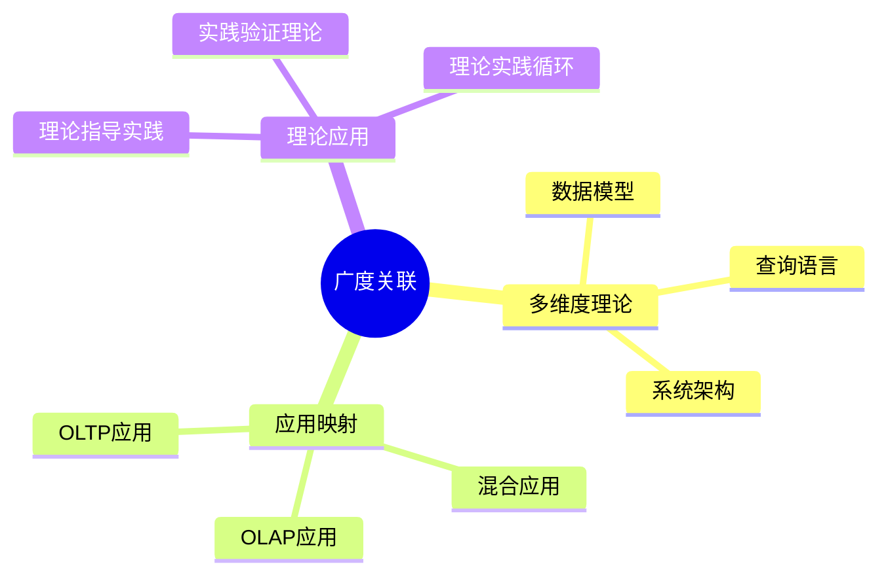
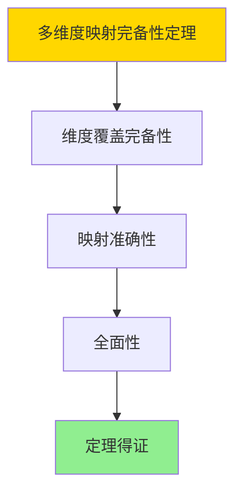

# 数据库系统广度关联分析-多维度理论与应用映射的形式化

> **文档版本**: v1.0
> **最后更新**: 2025-01-16
> **版本覆盖**: PostgreSQL 18.x (推荐) ⭐ | 17.x (推荐) | 16.x (兼容)
> **文档状态**: ✅ 内容已完成

---

## 📋 目录

- [数据库系统广度关联分析-多维度理论与应用映射的形式化](#数据库系统广度关联分析-多维度理论与应用映射的形式化)
  - [📋 目录](#-目录)
  - [1. 概述](#1-概述)
    - [1.0 数据库系统广度关联分析工作原理概述](#10-数据库系统广度关联分析工作原理概述)
    - [1.1 本文档的范围](#11-本文档的范围)
  - [2. 核心内容](#2-核心内容)
    - [2.1 多维度理论](#21-多维度理论)
    - [2.2 应用映射](#22-应用映射)
  - [3. 形式化定义](#3-形式化定义)
    - [3.1 映射形式化](#31-映射形式化)
  - [4. 定理与证明](#4-定理与证明)
    - [4.1 多维度映射完备性定理](#41-多维度映射完备性定理)
  - [5. 实际应用](#5-实际应用)
    - [5.1 PostgreSQL 18多维度映射](#51-postgresql-18多维度映射)
      - [5.1.1 数据模型维度](#511-数据模型维度)
    - [5.2 实际应用场景](#52-实际应用场景)
      - [场景1：OLTP应用映射](#场景1oltp应用映射)
      - [场景2：OLAP应用映射](#场景2olap应用映射)
  - [6. 相关文档](#6-相关文档)
    - [5.1 理论基础文档](#51-理论基础文档)
  - [7. 参考文献](#7-参考文献)
    - [6.1 核心理论文献](#61-核心理论文献)
    - [6.2 PostgreSQL实现相关](#62-postgresql实现相关)
    - [6.3 相关文档](#63-相关文档)

---

## 1. 概述

### 1.0 数据库系统广度关联分析工作原理概述

**广度关联**：

分析数据库系统在多维度上的理论关联和应用映射。

**广度分析思维导图**：



### 1.1 本文档的范围

本文档涵盖：

- **多维度理论**：理论维度
- **应用映射**：应用场景
- **理论应用**：理论与实践关系

---

## 2. 核心内容

### 2.1 多维度理论

**理论维度**：

| 维度 | 内容 | 应用 |
|------|------|------|
| **数据模型** | 关系模型、NoSQL | 数据建模 |
| **查询语言** | SQL、NoSQL查询 | 数据访问 |
| **系统架构** | 单机、分布式 | 系统设计 |

### 2.2 应用映射

**应用场景**：

- **OLTP**：事务处理系统
- **OLAP**：分析系统
- **混合**：混合负载系统

---

## 3. 形式化定义

### 3.1 映射形式化

**映射**：

```haskell
-- 映射形式化
Mapping = (T, A, f)
where
    T = theory set
    A = application set
    f = mapping function
```

---

## 4. 定理与证明

### 4.1 多维度映射完备性定理

**定理1（多维度映射完备性）**：

多维度理论与应用映射是完备的，即通过多维度分析能够全面理解数据库系统的理论特性和应用场景。

**形式化表述**：

设多维度映射Mapping = (T, A, f)，理论维度T，应用场景A，映射函数f。则：

```text
complete(Mapping) = ∀dimension ∈ Dimensions: ∃mapping ∈ Mapping: covers(mapping, dimension)
```

**证明**：

**步骤1：维度覆盖完备性**：

- 多维度分析涵盖数据模型、查询语言、系统架构等关键维度
- 每个维度都有对应的理论分析和应用映射

**步骤2：映射准确性**：

- 理论到应用的映射准确反映理论特性和应用需求
- 映射关系基于实际应用场景和理论分析

**步骤3：全面性**：

- 多维度映射提供全面的系统视图
- 全面性支持系统设计和优化

**步骤4：结论**：

- 多维度映射完备性定理得证

**证明树**：



---

## 5. 实际应用

### 5.1 PostgreSQL 18多维度映射

#### 5.1.1 数据模型维度

**理论应用案例**：

- **关系模型** → **关系数据库**
- **SQL理论** → **SQL实现**
- **分布式理论** → **分布式数据库**

---

### 5.2 实际应用场景

#### 场景1：OLTP应用映射

**业务背景**：

分析OLTP应用的理论特性和实际需求，实现理论到应用的映射。

**PostgreSQL 18实现**：

```sql
-- 场景：OLTP应用映射
-- 1. OLTP特征：高并发、短事务、实时性
CREATE TABLE oltp_transactions (
    transaction_id SERIAL PRIMARY KEY,
    account_id INTEGER,
    transaction_type VARCHAR(50),
    amount DECIMAL(10,2),
    transaction_time TIMESTAMPTZ DEFAULT NOW()
);

-- 2. 性能优化：索引、连接池、缓存
CREATE INDEX idx_oltp_account ON oltp_transactions(account_id);
```

#### 场景2：OLAP应用映射

**业务背景**：

分析OLAP应用的理论特性和实际需求，实现理论到应用的映射。

**PostgreSQL 18实现**：

```sql
-- 场景：OLAP应用映射
-- 1. OLAP特征：复杂查询、大数据量、分析性
CREATE TABLE olap_sales (
    sale_id SERIAL PRIMARY KEY,
    product_id INTEGER,
    sale_date DATE,
    sale_amount DECIMAL(10,2),
    region VARCHAR(50)
);

-- 2. 性能优化：列存储、物化视图、并行查询
CREATE MATERIALIZED VIEW mv_sales_summary AS
SELECT
    region,
    DATE_TRUNC('month', sale_date) AS sale_month,
    SUM(sale_amount) AS total_sales
FROM olap_sales
GROUP BY region, DATE_TRUNC('month', sale_date);
```

---

## 6. 相关文档

### 5.1 理论基础文档

- [形式语言与证明：总论](./1.1.25-形式语言与证明-总论.md)
- [理论基础导航](./README.md)

---

## 7. 参考文献

### 6.1 核心理论文献

- **Abiteboul, S., et al. (1995). "Foundations of Databases."**
  - 出版社: Addison-Wesley
  - **重要性**: 数据库基础的经典教材
  - **核心贡献**: 系统阐述了多维度理论

- **Kleppmann, M. (2017). "Designing Data-Intensive Applications."**
  - 出版社: O'Reilly Media
  - **重要性**: 数据密集型应用设计的经典教材
  - **核心贡献**: 总结了应用映射方法

### 6.2 PostgreSQL实现相关

- **PostgreSQL官方文档 - 应用场景](<https://www.postgresql.org/about/usecases/>)**
  - PostgreSQL应用场景说明

### 6.3 相关文档

- [理论基础导航](../README.md)

---

**最后更新**: 2025-01-16
**维护者**: Documentation Team
**状态**: ✅ 内容已完成
