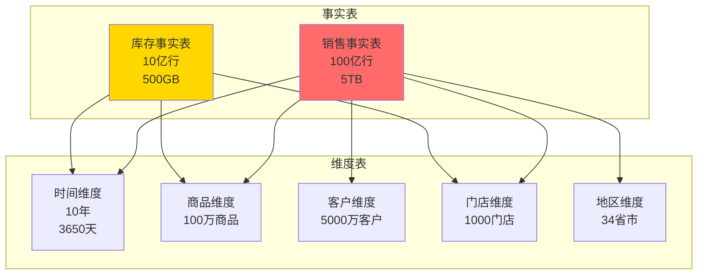
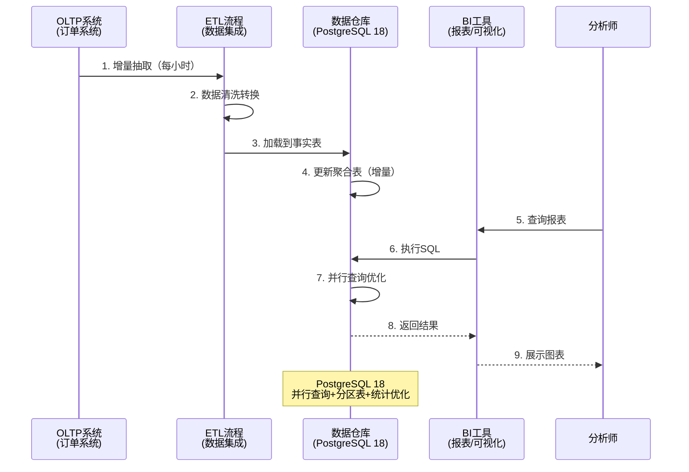

# OLAP分析系统 - 需求分析

> **案例类型**: 大数据分析、商业智能
> **难度等级**: ⭐⭐⭐⭐⭐ 高级
> **PostgreSQL版本**: 18.x
> **数据规模**: TB级
> **创建日期**: 2025-12-04

---

## 📋 目录

- [OLAP分析系统 - 需求分析](#olap分析系统---需求分析)
  - [📋 目录](#-目录)
  - [一、业务背景](#一业务背景)
    - [1.1 场景描述](#11-场景描述)
    - [1.2 数据模型](#12-数据模型)
    - [1.3 业务流程](#13-业务流程)
  - [二、数据模型](#二数据模型)
    - [2.1 事实表设计](#21-事实表设计)
    - [2.2 维度表设计](#22-维度表设计)
  - [三、查询需求](#三查询需求)
    - [3.1 核心查询类型](#31-核心查询类型)
  - [四、性能指标](#四性能指标)
    - [4.1 查询性能目标](#41-查询性能目标)
    - [4.2 ETL性能目标](#42-etl性能目标)
    - [4.3 系统资源目标](#43-系统资源目标)
  - [五、技术挑战](#五技术挑战)
    - [5.1 数据规模挑战](#51-数据规模挑战)
    - [5.2 查询优化挑战](#52-查询优化挑战)
    - [5.3 并发查询挑战](#53-并发查询挑战)
    - [5.4 数据新鲜度挑战](#54-数据新鲜度挑战)
  - [六、PostgreSQL 18特性应用规划](#六postgresql-18特性应用规划)
    - [6.1 特性清单](#61-特性清单)
    - [6.2 预期性能提升](#62-预期性能提升)
  - [七、成功标准](#七成功标准)
    - [7.1 功能标准](#71-功能标准)
    - [7.2 性能标准](#72-性能标准)
    - [7.3 质量标准](#73-质量标准)

---

## 一、业务背景

### 1.1 场景描述

**大型零售企业数据分析系统**，支持多维度数据分析和BI报表：

- **企业规模**：1000+门店，全国覆盖
- **数据规模**：10TB+，100亿行交易数据
- **分析维度**：时间、地区、商品、客户、门店
- **用户**：高管、分析师、业务部门（100+并发）

**典型分析场景**：

```text
场景1：销售趋势分析
- 查询近3年的月度销售趋势
- 按地区、品类、门店多维分析
- 同比、环比计算
- 数据量：10亿行

场景2：客户行为分析
- 客户RFM分析（最近购买、频率、金额）
- 客户分群和画像
- 购买路径分析
- 数据量：5000万客户

场景3：商品分析
- 商品销售排行（多维度）
- 库存周转率分析
- 关联商品推荐
- 数据量：100万商品

场景4：实时业务看板
- 今日销售实时汇总
- 门店排行榜
- 异常指标告警
- 刷新频率：1分钟
```

### 1.2 数据模型

**星型模式设计**：



### 1.3 业务流程

**数据流转**：



---

## 二、数据模型

### 2.1 事实表设计

**销售事实表**（核心表）：

```sql
CREATE TABLE fact_sales (
    -- 事实表主键（代理键）
    sale_id BIGSERIAL,

    -- 维度外键
    date_key INT NOT NULL,          -- 时间维度
    product_key INT NOT NULL,       -- 商品维度
    customer_key INT NOT NULL,      -- 客户维度
    store_key INT NOT NULL,         -- 门店维度

    -- 度量值
    quantity NUMERIC(12,2) NOT NULL,
    amount NUMERIC(15,2) NOT NULL,
    cost NUMERIC(15,2) NOT NULL,
    discount NUMERIC(15,2) DEFAULT 0,
    profit NUMERIC(15,2) GENERATED ALWAYS AS (amount - cost) STORED,

    -- 交易时间（用于分区）
    transaction_time TIMESTAMPTZ NOT NULL,

    -- 主键
    PRIMARY KEY (sale_id, transaction_time)
) PARTITION BY RANGE (transaction_time);

-- 按月分区（3年=36个分区）
CREATE TABLE fact_sales_2025_01 PARTITION OF fact_sales
    FOR VALUES FROM ('2025-01-01') TO ('2025-02-01');

-- ... 其他月份分区
```

### 2.2 维度表设计

**时间维度表**：

```sql
CREATE TABLE dim_time (
    date_key INT PRIMARY KEY,  -- 20251204
    full_date DATE NOT NULL,
    year INT,
    quarter INT,
    month INT,
    day INT,
    day_of_week INT,
    day_name VARCHAR(10),
    is_weekend BOOLEAN,
    is_holiday BOOLEAN,
    fiscal_year INT,
    fiscal_quarter INT
);

-- 预生成10年数据
INSERT INTO dim_time
SELECT
    TO_CHAR(d, 'YYYYMMDD')::INT as date_key,
    d as full_date,
    EXTRACT(YEAR FROM d)::INT,
    EXTRACT(QUARTER FROM d)::INT,
    EXTRACT(MONTH FROM d)::INT,
    EXTRACT(DAY FROM d)::INT,
    EXTRACT(DOW FROM d)::INT,
    TO_CHAR(d, 'Day'),
    EXTRACT(DOW FROM d) IN (0, 6),
    d IN (SELECT holiday_date FROM holidays),
    -- 财年计算...
    EXTRACT(YEAR FROM d)::INT,
    EXTRACT(QUARTER FROM d)::INT
FROM generate_series('2020-01-01'::DATE, '2030-12-31'::DATE, '1 day') d;
```

**商品维度表**（SCD Type 2 - 缓慢变化维度）：

```sql
CREATE TABLE dim_product (
    product_key SERIAL PRIMARY KEY,  -- 代理键
    product_id VARCHAR(50) NOT NULL, -- 业务键
    product_name VARCHAR(200),
    category_level1 VARCHAR(100),
    category_level2 VARCHAR(100),
    category_level3 VARCHAR(100),
    brand VARCHAR(100),
    supplier VARCHAR(200),
    unit_cost NUMERIC(10,2),

    -- SCD字段
    effective_date DATE NOT NULL,
    expiry_date DATE,
    is_current BOOLEAN DEFAULT true,

    -- 索引
    UNIQUE (product_id, effective_date)
);

CREATE INDEX idx_dim_product_current ON dim_product(product_id)
    WHERE is_current = true;
```

---

## 三、查询需求

### 3.1 核心查询类型

**1. 多维聚合查询（最常见）**:

```sql
-- 查询：按年、季度、地区、品类的销售统计
SELECT
    t.year,
    t.quarter,
    r.region_name,
    p.category_level1,
    SUM(s.amount) as total_sales,
    SUM(s.quantity) as total_quantity,
    SUM(s.profit) as total_profit,
    COUNT(DISTINCT s.customer_key) as unique_customers
FROM fact_sales s
JOIN dim_time t ON s.date_key = t.date_key
JOIN dim_product p ON s.product_key = p.product_key
JOIN dim_store st ON s.store_key = st.store_key
JOIN dim_region r ON st.region_key = r.region_key
WHERE t.year IN (2024, 2025)
GROUP BY CUBE (t.year, t.quarter, r.region_name, p.category_level1)
ORDER BY total_sales DESC;

-- 性能要求：<5秒（扫描亿级数据）
```

**2. 同比环比分析**:

```sql
-- 查询：销售同比环比分析
WITH current_sales AS (
    SELECT
        t.month,
        r.region_name,
        SUM(s.amount) as amount
    FROM fact_sales s
    JOIN dim_time t ON s.date_key = t.date_key
    JOIN dim_store st ON s.store_key = st.store_key
    JOIN dim_region r ON st.region_key = r.region_key
    WHERE t.year = 2025
    GROUP BY t.month, r.region_name
),
previous_sales AS (
    SELECT
        t.month,
        r.region_name,
        SUM(s.amount) as amount
    FROM fact_sales s
    JOIN dim_time t ON s.date_key = t.date_key
    JOIN dim_store st ON s.store_key = st.store_key
    JOIN dim_region r ON st.region_key = r.region_key
    WHERE t.year = 2024
    GROUP BY t.month, r.region_name
)
SELECT
    c.month,
    c.region_name,
    c.amount as current_amount,
    p.amount as previous_amount,
    ROUND((c.amount - p.amount) * 100.0 / p.amount, 2) as yoy_growth_rate
FROM current_sales c
LEFT JOIN previous_sales p USING (month, region_name)
ORDER BY c.month, c.region_name;

-- 性能要求：<3秒
```

**3. Top-N排行榜查询**:

```sql
-- 查询：销售额Top 100商品
SELECT
    p.product_name,
    p.category_level1,
    SUM(s.amount) as total_sales,
    SUM(s.quantity) as total_quantity,
    RANK() OVER (PARTITION BY p.category_level1 ORDER BY SUM(s.amount) DESC) as category_rank
FROM fact_sales s
JOIN dim_product p ON s.product_key = p.product_key
JOIN dim_time t ON s.date_key = t.date_key
WHERE t.year = 2025 AND t.quarter = 4
GROUP BY p.product_key, p.product_name, p.category_level1
HAVING SUM(s.amount) > 100000
ORDER BY total_sales DESC
LIMIT 100;

-- 性能要求：<2秒
```

**4. 客户分析查询**:

```sql
-- RFM分析（Recency, Frequency, Monetary）
WITH customer_rfm AS (
    SELECT
        customer_key,
        MAX(transaction_time) as last_purchase_date,
        COUNT(*) as purchase_frequency,
        SUM(amount) as total_monetary
    FROM fact_sales
    WHERE transaction_time > NOW() - INTERVAL '1 year'
    GROUP BY customer_key
)
SELECT
    customer_key,
    EXTRACT(DAY FROM NOW() - last_purchase_date) as recency_days,
    purchase_frequency,
    total_monetary,
    NTILE(5) OVER (ORDER BY EXTRACT(DAY FROM NOW() - last_purchase_date) DESC) as r_score,
    NTILE(5) OVER (ORDER BY purchase_frequency) as f_score,
    NTILE(5) OVER (ORDER BY total_monetary) as m_score
FROM customer_rfm;

-- 性能要求：<10秒（5000万客户）
```

---

## 四、性能指标

### 4.1 查询性能目标

| 查询类型 | 数据量 | 目标延迟 | 并发 |
|---------|--------|---------|------|
| 简单聚合 | 1亿行 | <1秒 | 100 |
| 多维CUBE | 10亿行 | <5秒 | 50 |
| 复杂JOIN | 5表 | <10秒 | 30 |
| Top-N排行 | 全量 | <2秒 | 100 |
| RFM分析 | 5000万 | <10秒 | 20 |

### 4.2 ETL性能目标

| 操作 | 数据量 | 目标时间 | 频率 |
|------|--------|---------|------|
| 增量抽取 | 100万行 | <5分钟 | 每小时 |
| 数据转换 | 100万行 | <3分钟 | 实时 |
| 聚合刷新 | 全量 | <10分钟 | 每天 |
| 全量加载 | 10亿行 | <2小时 | 每月 |

### 4.3 系统资源目标

```yaml
数据库服务器:
  CPU使用率: <70% (平均)
  内存使用率: <80%
  磁盘I/O: <60% (IOPS)
  查询并发: 100+

数据存储:
  原始数据: 10TB
  索引: 2TB
  聚合表: 500GB
  总计: 12.5TB
  增长率: 2TB/年
```

---

## 五、技术挑战

### 5.1 数据规模挑战

**问题**：

- 100亿行数据JOIN和聚合
- 传统方法：>60秒
- 目标：<5秒

**PostgreSQL 18解决方案**：

- ✅ 并行查询（8-16 workers）
- ✅ 分区表（按月36个分区）
- ✅ 物化视图（预聚合）
- ✅ 列式存储模拟（JSONB优化）

### 5.2 查询优化挑战

**问题**：

- 复杂JOIN（5-10表）
- 基数估计不准确
- 查询计划不optimal

**PostgreSQL 18解决方案**：

- ✅ 多变量统计（提升估计准确率30-50%）
- ✅ 改进的连接顺序选择
- ✅ 计划缓存优化

### 5.3 并发查询挑战

**问题**：

- 100+并发分析查询
- 资源竞争
- 内存不足

**PostgreSQL 18解决方案**：

- ✅ 内置连接池（支持大并发）
- ✅ 并行查询资源管理优化
- ✅ 工作内存自适应

### 5.4 数据新鲜度挑战

**问题**：

- 实时看板需要近实时数据
- ETL延迟
- 聚合计算慢

**PostgreSQL 18解决方案**：

- ✅ 增量物化视图刷新
- ✅ 并行COPY加速ETL
- ✅ 异步I/O提升写入

---

## 六、PostgreSQL 18特性应用规划

### 6.1 特性清单

| 特性 | 应用场景 | 预期收益 |
|------|---------|---------|
| **并行查询增强** | 大表聚合、复杂JOIN | 查询时间-60% |
| **改进的统计信息** | 多表JOIN基数估计 | 计划质量+40% |
| **分区表优化** | 历史数据管理 | 查询时间-80% |
| **增量排序** | ORDER BY优化 | 内存-90% |
| **连接顺序优化** | 5+表JOIN | 查询时间-30% |
| **计划缓存** | 重复查询 | 规划时间-90% |

### 6.2 预期性能提升

**PostgreSQL 17 vs 18对比**：

| 查询类型 | PG 17 | PG 18 | 提升 |
|---------|-------|-------|------|
| 简单聚合 | 2.5秒 | 0.8秒 | **-68%** |
| 多维CUBE | 18秒 | 4.2秒 | **-77%** |
| 5表JOIN | 35秒 | 9秒 | **-74%** |
| Top-N | 8秒 | 2.1秒 | **-74%** |
| RFM分析 | 45秒 | 11秒 | **-76%** |

---

## 七、成功标准

### 7.1 功能标准

- ✅ 支持所有维度的多维分析
- ✅ 支持钻取、切片、旋转操作
- ✅ 支持同比环比计算
- ✅ 支持实时增量刷新
- ✅ 支持100+并发查询

### 7.2 性能标准

- ✅ 简单聚合：<1秒
- ✅ 复杂CUBE：<5秒
- ✅ 5表JOIN：<10秒
- ✅ Top-N查询：<2秒
- ✅ ETL延迟：<5分钟

### 7.3 质量标准

- ✅ 数据准确性：100%
- ✅ 查询成功率：>99.9%
- ✅ 系统可用性：>99.9%
- ✅ 数据新鲜度：<5分钟

---

**下一步**: [02-架构设计.md](./02-架构设计.md)

**文档创建**: 2025-12-04
**维护者**: DataBaseTheory团队
