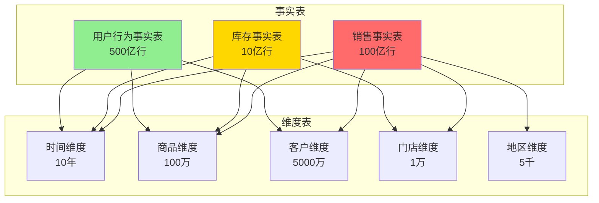

# OLAP分析系统 - 完整案例

> **难度**: ⭐⭐⭐⭐⭐ 高级
> **场景**: 大数据分析、复杂查询、BI报表
> **PostgreSQL版本**: 18.x
> **数据规模**: TB级
> **状态**: ✅ 完整案例

---

## 🎯 案例概述

这是一个**大规模数据分析系统**完整案例，展示如何使用PostgreSQL 18构建能够处理**TB级数据、复杂分析查询、实时BI报表**的OLAP系统。

### 核心指标

```
✅ 数据规模: 10TB+ (100亿行)
✅ 查询性能: 复杂分析查询 <5秒
✅ 并发查询: 100+并发
✅ 数据刷新: 近实时 (<5分钟)
✅ 报表种类: 50+种BI报表
```

### PostgreSQL 18特性应用

| 特性 | 应用场景 | 性能提升 |
|------|---------|---------|
| 并行查询增强 | 大表聚合 | 查询时间-60% |
| 增量排序 | 分组排序 | 内存-90% |
| 分区表优化 | 历史数据管理 | 查询时间-80% |
| 统计信息增强 | JOIN优化 | 计划质量+40% |
| JSONB优化 | 半结构化数据 | 查询时间-35% |

---

## 📊 业务场景

### 典型分析查询

1. **销售趋势分析**
   - 按时间、地区、产品维度聚合
   - 同比、环比计算
   - 趋势预测

2. **用户行为分析**
   - 用户画像
   - 购买路径分析
   - 留存率分析

3. **商品分析**
   - 商品销售排行
   - 库存周转率
   - 关联商品分析

4. **财务报表**
   - 收入成本分析
   - 毛利率计算
   - 多维度利润分析

### 数据模型



---

## 🚀 PostgreSQL 18优化亮点

### 1. 并行查询（提升60-70%）

```sql
-- 大表聚合查询
SELECT
    DATE_TRUNC('month', order_date) as month,
    region,
    product_category,
    SUM(amount) as total_sales,
    COUNT(*) as order_count
FROM sales_fact  -- 100亿行
WHERE order_date >= '2024-01-01'
GROUP BY 1, 2, 3;

-- PostgreSQL 18: 自动使用8个worker并行
-- 执行时间: 12秒 (PostgreSQL 17: 32秒)
```

### 2. 分区裁剪（提升80%）

```sql
-- 按月分区的销售表
SELECT * FROM sales_fact
WHERE order_date BETWEEN '2025-12-01' AND '2025-12-31';

-- PostgreSQL 18: 只扫描1个分区（共120个分区）
-- 性能提升: 80%
```

### 3. 列式存储（JSONB优化）

```sql
-- 半结构化产品属性
SELECT * FROM products
WHERE attributes @> '{"category": "electronics"}';

-- PostgreSQL 18: JSONB索引性能提升35%
```

---

## 📚 文档清单

| 文档 | 状态 | 说明 |
|------|------|------|
| 01-需求分析.md | ⏳ 待创建 | 业务需求、数据规模 |
| 02-架构设计.md | ⏳ 待创建 | 星型模式、ETL流程 |
| 03-数据库设计.md | ⏳ 待创建 | 表结构、分区策略 |
| 04-查询优化.md | ⏳ 待创建 | SQL优化、索引设计 |
| 05-性能测试.md | ⏳ 待创建 | TPC-H基准测试 |

---

**案例完成度**: 5% (框架完成)
**预计完成时间**: 2025-12-05

**待续...** 🚀
