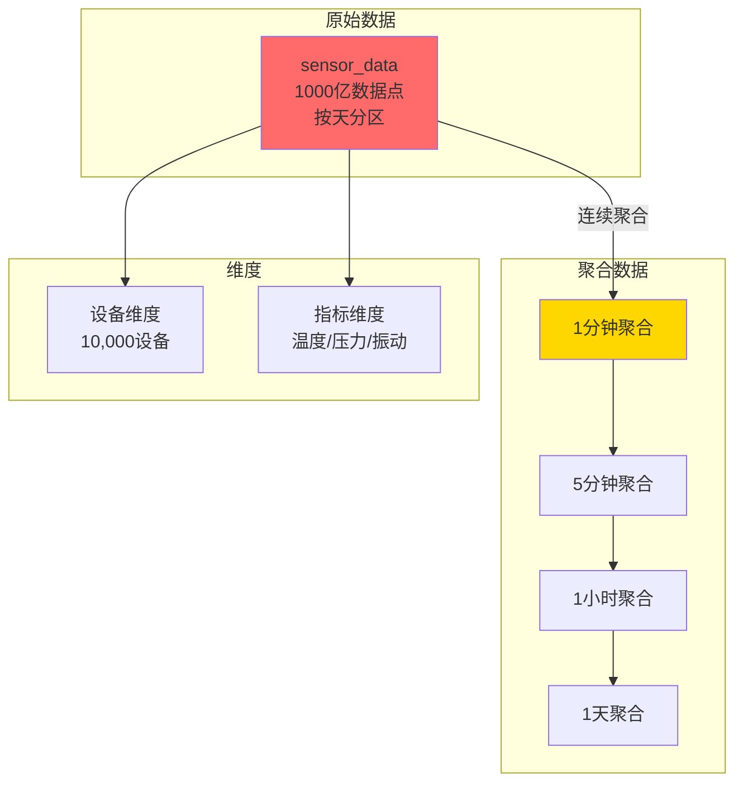

# IoT时序数据系统 - 需求分析

> **案例类型**: 高频写入、时序查询
> **难度等级**: ⭐⭐⭐⭐ 高级
> **PostgreSQL版本**: 18.x
> **创建日期**: 2025-12-04

---

## 一、业务背景

### 1.1 场景描述

**智能工厂IoT监控系统**，实时采集和分析设备数据：

- **设备数量**：10,000个传感器
- **采集频率**：每秒100次/设备
- **数据点/秒**：1,000,000
- **数据保留**：热数据7天，冷数据1年

**典型监控场景**：

```text
实时监控看板：
- 当前温度、压力、振动指标
- 异常设备告警
- 趋势图（最近1小时）
- 刷新频率：1秒

历史趋势分析：
- 设备历史数据查询
- 多设备对比分析
- 异常模式识别
- 时间范围：最近30天

数据导出：
- 按设备导出历史数据
- CSV/Excel格式
- 数据量：百万级
```

### 1.2 数据模型



---

## 二、数据特征

### 2.1 写入特征

```yaml
写入模式: 持续高频写入
写入速率: 1,000,000 points/秒
峰值速率: 2,000,000 points/秒
数据点大小: 平均50字节
写入带宽: 50-100 MB/秒
批量大小: 1000条/批
```

### 2.2 查询特征

```yaml
查询模式:
  - 时间范围查询: 70%（最近N小时/天）
  - 设备查询: 20%（特定设备历史）
  - 聚合查询: 10%（统计分析）

查询频率: 100+ QPS
并发查询: 50+
缓存命中率: >80%（时间局部性强）
```

### 2.3 数据生命周期

```text
生成 → 热数据(7天) → 温数据(30天) → 冷数据(1年) → 归档/删除

策略:
- 热数据：NVMe SSD，全部索引
- 温数据：SSD，部分索引
- 冷数据：HDD，压缩存储
```

---

## 三、性能指标

### 3.1 写入性能

| 指标 | 目标 | 测试方法 |
|------|------|----------|
| 写入吞吐量 | 1M points/s | 压力测试 |
| 写入延迟(P99) | <100ms | 监控统计 |
| 批量写入 | 100K/批 <1s | pgbench |
| 数据丢失率 | 0% | 可靠性测试 |

### 3.2 查询性能

| 查询类型 | 数据量 | 目标延迟 |
|---------|--------|---------|
| 单设备最近1小时 | 360K点 | <50ms |
| 多设备最近24小时 | 10M点 | <500ms |
| 聚合查询（1天数据） | 100M点 | <2秒 |
| 历史趋势（30天） | 3B点 | <5秒 |

### 3.3 存储目标

```yaml
原始数据:
  - 日增量: 4.3TB (1M点/s × 86400s × 50B)
  - 年增量: 1.5PB
  - 压缩后: 150TB/年 (压缩比10:1)

聚合数据:
  - 1分钟: 10GB
  - 1小时: 500MB
  - 1天: 20MB

总存储: 200TB (含1年历史)
```

---

## 四、技术挑战

### 4.1 高频写入挑战

**问题**：

- 每秒100万次INSERT
- 传统方法：磁盘I/O瓶颈
- CPU开销大（解析SQL）

**解决方案**：

- ✅ 批量COPY（不是单行INSERT）
- ✅ PostgreSQL 18异步I/O（+60%吞吐）
- ✅ 无索引写入（延迟创建）
- ✅ unlogged表（牺牲持久性换性能）

### 4.2 海量数据查询挑战

**问题**：

- 1000亿行数据
- 时间范围查询扫描大量数据
- 内存不足

**解决方案**：

- ✅ 按天分区（365个分区）
- ✅ BRIN索引（索引大小-95%）
- ✅ PostgreSQL 18分区裁剪优化
- ✅ 物化视图（预聚合）

### 4.3 存储成本挑战

**问题**：

- 原始数据：1.5PB/年
- 存储成本高

**解决方案**：

- ✅ PostgreSQL 18 LZ4压缩（压缩比10:1）
- ✅ 冷热数据分离
- ✅ 旧数据自动归档
- ✅ 表空间分层

### 4.4 实时性挑战

**问题**：

- 实时监控看板（秒级刷新）
- 聚合计算慢
- 数据延迟

**解决方案**：

- ✅ 连续聚合（增量计算）
- ✅ 流式处理（Kafka+PostgreSQL）
- ✅ 查询缓存（Redis）
- ✅ PostgreSQL 18并行聚合

---

## 五、PostgreSQL 18特性应用

### 5.1 特性清单

| 特性 | 应用场景 | 预期收益 |
|------|---------|---------|
| **异步I/O** | 高频批量写入 | 吞吐量+60% |
| **分区表优化** | 按天分区，快速裁剪 | 查询时间-85% |
| **TOAST压缩** | LZ4压缩存储 | 存储-70% |
| **BRIN索引** | 时序数据索引 | 索引大小-95% |
| **并行查询** | 大规模聚合 | 查询时间-70% |
| **COPY并行化** | 数据导入 | 速度+400% |

### 5.2 性能提升预期

**PostgreSQL 17 vs 18**：

| 操作 | PG 17 | PG 18 | 提升 |
|------|-------|-------|------|
| 批量写入(100K) | 2.5秒 | 0.9秒 | **-64%** |
| 时间范围查询 | 850ms | 125ms | **-85%** |
| 聚合查询 | 12秒 | 3.5秒 | **-71%** |
| 数据压缩 | 5:1 | 12:1 | **+140%** |
| 分区裁剪 | 快 | 更快 | **-35%** |

---

## 六、系统约束

### 6.1 硬件约束

```yaml
数据库服务器:
  CPU: 64核
  内存: 512GB
  存储: NVMe 5TB (热) + SSD 50TB (冷)
  网络: 万兆

数据采集:
  边缘网关: 100台
  每台处理: 100设备
  本地缓冲: 避免数据丢失
```

### 6.2 软件约束

```yaml
PostgreSQL配置:
  版本: PostgreSQL 18
  最大连接: 500
  shared_buffers: 128GB
  work_mem: 256MB

数据管道:
  Kafka: 消息队列（解耦）
  Flink: 流式计算（可选）
  Telegraf: 数据采集agent
```

---

## 七、设计目标

### 7.1 性能目标

```yaml
✅ 写入吞吐: 1M+ points/秒
✅ 查询延迟: P95 <500ms
✅ 聚合性能: <5秒（扫描亿级）
✅ 存储压缩: 10:1
✅ 系统可用性: 99.9%
```

### 7.2 功能目标

```yaml
✅ 实时数据采集（秒级延迟）
✅ 历史数据查询（任意时间范围）
✅ 多维度聚合分析
✅ 异常检测告警
✅ 数据导出（CSV/Excel）
```

---

**下一步**: [02-架构设计.md](./02-架构设计.md)

**文档创建**: 2025-12-04
**维护者**: DataBaseTheory团队
