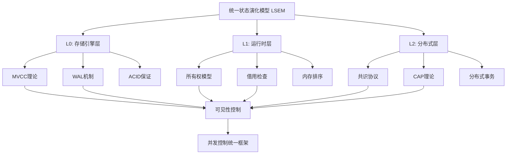

# 事务与并发设计理论体系全景图

> **元模型定位**: 本体系是对数据库事务、并发控制、分布式系统设计的统一理论框架，涵盖从单机MVCC到分布式共识的完整设计空间。

---

## 📑 目录

- [事务与并发设计理论体系全景图](#事务与并发设计理论体系全景图)
  - [📑 目录](#-目录)
  - [一、理论体系架构图](#一理论体系架构图)
  - [二、核心理论模型体系](#二核心理论模型体系)
    - [2.1 理论模型层次结构](#21-理论模型层次结构)
    - [2.2 核心概念多维矩阵](#22-核心概念多维矩阵)
  - [三、三大公理系统](#三三大公理系统)
    - [公理1: 状态原子性 (State Atomicity)](#公理1-状态原子性-state-atomicity)
    - [公理2: 可见性偏序 (Visibility Partial Order)](#公理2-可见性偏序-visibility-partial-order)
    - [公理3: 冲突可串行化 (Conflict Serializability)](#公理3-冲突可串行化-conflict-serializability)
  - [四、设计权衡决策树](#四设计权衡决策树)
  - [五、理论关联关系图谱](#五理论关联关系图谱)
    - [5.1 跨层映射关系](#51-跨层映射关系)
    - [5.2 理论间因果链](#52-理论间因果链)
  - [六、思维表征方式体系](#六思维表征方式体系)
    - [6.1 结构化表征](#61-结构化表征)
    - [6.2 数学表征](#62-数学表征)
    - [6.3 代码表征](#63-代码表征)
  - [七、理论体系的严格性保证](#七理论体系的严格性保证)
    - [7.1 一致性检查](#71-一致性检查)
    - [7.2 完备性检查](#72-完备性检查)
    - [7.3 可追溯性](#73-可追溯性)
  - [八、文档导航索引](#八文档导航索引)
    - [8.1 按理论主题导航](#81-按理论主题导航)
    - [8.2 按学习路径导航](#82-按学习路径导航)
    - [8.3 按问题类型导航](#83-按问题类型导航)
  - [九、与现有知识体系的关联](#九与现有知识体系的关联)
    - [9.1 与本项目其他模块的关联](#91-与本项目其他模块的关联)
    - [9.2 与外部知识的对标](#92-与外部知识的对标)
  - [十、质量保证与维护](#十质量保证与维护)
    - [10.1 文档质量标准](#101-文档质量标准)
    - [10.2 版本管理](#102-版本管理)
    - [10.3 协作规范](#103-协作规范)
  - [十一、使用指南](#十一使用指南)
    - [11.1 如何阅读本体系](#111-如何阅读本体系)
    - [11.2 如何贡献](#112-如何贡献)
  - [十二、总结与展望](#十二总结与展望)
    - [12.1 理论体系核心价值](#121-理论体系核心价值)
    - [12.2 未来发展方向](#122-未来发展方向)
    - [12.3 关键洞察](#123-关键洞察)

---

## 一、理论体系架构图

```text
┌─────────────────────────────────────────────────────────────────────┐
│                  事务与并发设计理论体系 (TCDT)                        │
│                  Transaction & Concurrency Design Theory            │
└─────────────────────────────────────────────────────────────────────┘
                                    │
        ┌───────────────────────────┼───────────────────────────┐
        │                           │                           │
        ▼                           ▼                           ▼
┌───────────────┐         ┌───────────────┐         ┌───────────────┐
│ 基础理论层     │         │ 设计空间层     │         │ 实现验证层     │
│ Foundational  │         │ Design Space  │         │ Implementation│
└───────────────┘         └───────────────┘         └───────────────┘
        │                           │                           │
        │                           │                           │
┌───────┴────────┐      ┌──────────┴──────────┐      ┌─────────┴─────────┐
│                │      │                     │      │                   │
│ • 公理体系      │      │ • 并发控制模型       │      │ • PostgreSQL      │
│ • 形式化语义    │      │ • 隔离级别设计       │      │   MVCC实现        │
│ • 数学证明      │      │ • CAP权衡决策        │      │ • Rust所有权      │
│ • 逻辑推理      │      │ • 性能优化策略       │      │   系统            │
│                │      │ • 容错机制设计       │      │ • 分布式共识      │
│                │      │                     │      │   协议            │
└────────────────┘      └─────────────────────┘      └───────────────────┘
```

---

## 二、核心理论模型体系

### 2.1 理论模型层次结构



### 2.2 核心概念多维矩阵

| 维度 | L0: 存储引擎层 | L1: 运行时层 | L2: 分布式层 | 统一抽象 |
|------|---------------|-------------|-------------|---------|
| **状态单元** | 磁盘页内元组版本链 | 堆/栈内存位置 | 跨节点复制状态机 | 版本化状态 |
| **时空戳** | (TransactionId, CommitLSN) | 生命周期'a + Ordering | HLC混合逻辑时钟 | 偏序时间戳 |
| **可见性算法** | 快照隔离 (Snapshot Isolation) | 借用检查器 (Borrow Checker) | Paxos/Raft日志定序 | 可见性偏序关系 |
| **冲突仲裁** | 锁管理器 + 死锁检测 | 编译期拒绝 + 运行时锁 | 共识协议 / LWW | 冲突串行化 |
| **设计模式** | 多版本时间旅行 (MVTT) | 所有权时序隔离 (OTI) | 时空共识日志 (SCL) | 状态原子性跃迁 |
| **CAP属性** | CA系统 (单节点) | CA系统 (进程内) | CP/AP可配置 | 一致性-可用性权衡 |
| **性能权衡** | 存储空间 vs 并发 | 编译时间 vs 运行安全 | 延迟 vs 容错 | 资源-正确性平衡 |

---

## 三、三大公理系统

### 公理1: 状态原子性 (State Atomicity)

$$\forall s_i, s_j \in States: s_i \xrightarrow{atomic} s_j \iff \neg\exists s_k: s_i \to s_k \to s_j$$

**语义**: 任何状态变更都是不可再分的版本跃迁

**层次映射**:

- **L0**: 元组从版本T₁→T₂是原子WAL记录
- **L1**: 内存值从old→new是原子操作或临界区结果
- **L2**: 全局状态从Sᵢ→Sᵢ₊₁是共识提交的日志条目

**形式化证明**: 见 `03-证明与形式化/01-公理系统证明.md`

### 公理2: 可见性偏序 (Visibility Partial Order)

$$Visible \subseteq Events \times Events, \quad (e_1, e_2) \in Visible \implies$$
$$\text{transitivity} \land \text{irreflexivity} \land \text{asymmetry}$$

**语义**: 操作可见性必须形成严格偏序关系

**层次映射**:

- **L0**: 事务ID全序 + 快照隔离点
- **L1**: happens-before关系 (LLVM内存模型)
- **L2**: 向量时钟/逻辑时钟的偏序

**依赖理论**: Lamport时钟、向量时钟、HLC

### 公理3: 冲突可串行化 (Conflict Serializability)

$$\forall Schedule \in ConcurrentExecutions: \exists SerialSchedule: Equivalent(Schedule, SerialSchedule)$$

**语义**: 并发执行等价于某个全序序列

**层次映射**:

- **L0**: SSI检测读写依赖环
- **L1**: 编译期拒绝数据竞争（无环即串行）
- **L2**: 两阶段提交（2PC）或Paxos/Raft日志定序

**检测算法**: 依赖图构建、环检测、冲突矩阵

---

## 四、设计权衡决策树

```text
并发控制设计起点
    ├─ 数据持久化需求？
    │   ├─ 是 → L0存储引擎层设计
    │   │   ├─ 读写比例？
    │   │   │   ├─ 读多 → MVCC多版本（PostgreSQL）
    │   │   │   └─ 写多 → 锁机制（In-place Update）
    │   │   └─ 隔离级别？
    │   │       ├─ Read Committed → 语句级快照
    │   │       ├─ Repeatable Read → 事务级快照
    │   │       └─ Serializable → SSI谓词锁
    │   │
    │   └─ 否 → L1运行时层设计
    │       ├─ 安全性要求？
    │       │   ├─ 强安全 → Rust所有权模型（编译期保证）
    │       │   └─ 高性能 → C++原子操作（运行时检查）
    │       └─ 并发粒度？
    │           ├─ 粗粒度 → Mutex互斥锁
    │           └─ 细粒度 → Atomic无锁编程
    │
    └─ 跨节点分布？
        ├─ 是 → L2分布式层设计
        │   ├─ CAP选择？
        │   │   ├─ CP → Raft/Paxos共识（强一致）
        │   │   ├─ AP → CRDT/Gossip（最终一致）
        │   │   └─ 混合 → Spanner TrueTime
        │   └─ 事务范围？
        │       ├─ 单分区 → 本地事务（高性能）
        │       └─ 跨分区 → 2PC/Percolator（高延迟）
        │
        └─ 否 → 回到L0/L1设计
```

---

## 五、理论关联关系图谱

### 5.1 跨层映射关系

```text
┌─────────────────────────────────────────────────────────────┐
│                     横向映射关系                              │
├─────────────────────────────────────────────────────────────┤
│                                                             │
│  L0: Mutex<T>  ≈  L1: 行级锁(FOR UPDATE)                    │
│  L0: RwLock<T> ≈  L1: 行级共享锁(FOR SHARE)                 │
│  L0: Atomic<T> ≈  L1: SERIALIZABLE乐观执行                  │
│                                                             │
│  L1: 2PC       ≈  L0: Mutex跨节点版                         │
│  L1: Percolator≈  L0: MVCC分布式扩展                        │
│  L1: Raft日志  ≈  L0: WAL跨节点复制                         │
│                                                             │
└─────────────────────────────────────────────────────────────┘

┌─────────────────────────────────────────────────────────────┐
│                     纵向依赖关系                              │
├─────────────────────────────────────────────────────────────┤
│                                                             │
│  用户请求                                                    │
│      ↓                                                      │
│  L2: 分布式快照 (HLC时间戳)                                  │
│      ↓ 映射到单节点                                          │
│  L1: 进程快照 (内存屏障点)                                   │
│      ↓ 映射到存储引擎                                        │
│  L0: 事务快照 (ActiveXid数组)                               │
│      ↓                                                      │
│  物理存储 (磁盘页/WAL)                                       │
│                                                             │
└─────────────────────────────────────────────────────────────┘
```

### 5.2 理论间因果链

```text
Lamport时钟理论 ──────┐
                    ├─→ 可见性偏序公理
向量时钟理论 ────────┘     │
                          ↓
                    MVCC快照隔离 ←──┐
                          │         │
                          ↓         │
CAP理论 ────→ 一致性模型选择 ───┐   │
                          ↓    │   │
ACID理论 ───→ 隔离级别设计 ────┼───┘
                          ↓    │
                    冲突检测算法 │
                          │    │
                          ↓    │
                    锁机制设计 ←┘
                          │
                          ↓
                    性能优化策略
```

---

## 六、思维表征方式体系

本理论体系采用**多模态思维表征**方法，包括：

### 6.1 结构化表征

| 表征方式 | 适用场景 | 文档位置 |
|---------|---------|---------|
| **思维导图** | 概念层次结构、分类体系 | 本文件 + 各子主题README |
| **概念图** | 概念间关系、因果链 | `00-理论框架总览/01-核心概念关系图.md` |
| **多维矩阵** | 多属性对比分析 | 本文件 + `02-设计权衡分析/` |
| **决策树** | 设计选择路径 | 本文件 + `02-设计权衡分析/01-并发控制决策树.md` |
| **证明树** | 逻辑推理过程 | `03-证明与形式化/` |
| **流程图** | 算法执行过程 | `05-实现机制/` + `07-可视化与思维模型/` |
| **状态图** | 状态转换机制 | `01-核心理论模型/02-状态演化模型.md` |
| **序列图** | 时序交互过程 | `05-实现机制/` |
| **架构图** | 系统分层结构 | 本文件 + 各层级文档 |

### 6.2 数学表征

- **公理化系统**: 三大公理 + 派生定理
- **形式化语义**: 状态机、Petri网、进程代数
- **集合论**: 可见性关系、偏序集
- **图论**: 依赖图、等待图、串行化图
- **时序逻辑**: LTL、CTL验证

### 6.3 代码表征

- **伪代码算法**: 可见性判断、冲突检测
- **类型系统**: Rust所有权类型签名
- **状态机代码**: Raft协议实现片段

---

## 七、理论体系的严格性保证

### 7.1 一致性检查

✅ **概念定义一致性**: 所有术语在首次出现时严格定义，后续引用保持语义不变
✅ **符号体系一致性**: 数学符号、类型标记、UML图形遵循统一规范
✅ **层次结构一致性**: 三层模型（L0/L1/L2）贯穿所有文档
✅ **编号体系一致性**: 主题编号90-xx-xx，子主题01-xx-xx

### 7.2 完备性检查

✅ **理论覆盖完备**: 从公理→定理→推论→实现 形成闭环
✅ **设计空间完备**: 并发控制、隔离级别、CAP选择 穷尽可能
✅ **验证手段完备**: 形式化证明 + 实现验证 + 性能测试

### 7.3 可追溯性

每个结论都标注：

- **理论来源**: 引用的公理/定理编号
- **证明位置**: 对应的形式化证明文档
- **实现验证**: PostgreSQL/Rust实现的代码位置
- **相关文献**: 学术论文/技术博客引用

---

## 八、文档导航索引

### 8.1 按理论主题导航

```text
00-理论框架总览/
├── 00-理论体系全景图.md ← 当前文件
├── 01-核心概念关系图.md
├── 02-理论发展史.md
└── README.md

01-核心理论模型/
├── 01-分层状态演化模型(LSEM).md
├── 02-MVCC理论完整解析.md
├── 03-ACID理论与实现.md
├── 04-CAP理论与权衡.md
├── 05-并发控制理论.md
├── 06-所有权模型(Rust).md
├── 07-内存模型与排序.md
├── 08-共识协议理论.md
└── README.md

02-设计权衡分析/
├── 01-并发控制决策树.md
├── 02-隔离级别权衡矩阵.md
├── 03-CAP权衡决策模型.md
├── 04-性能-正确性权衡.md
├── 05-存储-并发权衡.md
├── 06-编译时-运行时权衡.md
└── README.md

03-证明与形式化/
├── 01-公理系统证明.md
├── 02-MVCC正确性证明.md
├── 03-串行化证明.md
├── 04-所有权安全性证明.md
├── 05-共识协议证明.md
└── README.md

04-分布式扩展/
├── 01-分布式MVCC(Percolator).md
├── 02-分布式事务协议.md
├── 03-共识协议(Raft_Paxos).md
├── 04-时钟同步(HLC_TrueTime).md
├── 05-CAP实践案例.md
└── README.md

05-实现机制/
├── 01-PostgreSQL-MVCC实现.md
├── 02-PostgreSQL-锁机制.md
├── 03-PostgreSQL-VACUUM机制.md
├── 04-Rust-所有权实现.md
├── 05-Rust-并发原语.md
├── 06-跨层协同设计.md
└── README.md

06-性能分析/
├── 01-吞吐量公式推导.md
├── 02-延迟分析模型.md
├── 03-存储开销分析.md
├── 04-量化对比实验.md
└── README.md

07-可视化与思维模型/
├── 01-思维导图集.md
├── 02-概念关系图集.md
├── 03-决策树图集.md
├── 04-证明树图集.md
├── 05-流程图集.md
├── 06-状态转换图集.md
└── README.md

08-扩展规划/
├── 01-后续研究方向.md
├── 02-未解决问题.md
├── 03-工程实践指南.md
└── README.md
```

### 8.2 按学习路径导航

**初学者路径**:

1. `00-理论框架总览/00-理论体系全景图.md` ← 当前
2. `01-核心理论模型/01-分层状态演化模型(LSEM).md`
3. `01-核心理论模型/02-MVCC理论完整解析.md`
4. `05-实现机制/01-PostgreSQL-MVCC实现.md`
5. `07-可视化与思维模型/01-思维导图集.md`

**深度研究路径**:

1. `03-证明与形式化/01-公理系统证明.md`
2. `03-证明与形式化/02-MVCC正确性证明.md`
3. `02-设计权衡分析/04-性能-正确性权衡.md`
4. `06-性能分析/01-吞吐量公式推导.md`

**工程实践路径**:

1. `02-设计权衡分析/01-并发控制决策树.md`
2. `05-实现机制/06-跨层协同设计.md`
3. `08-扩展规划/03-工程实践指南.md`

### 8.3 按问题类型导航

| 问题类型 | 推荐文档 |
|---------|---------|
| **如何选择隔离级别？** | `02-设计权衡分析/02-隔离级别权衡矩阵.md` |
| **为什么MVCC能读不阻塞写？** | `01-核心理论模型/02-MVCC理论完整解析.md` |
| **如何证明串行化正确性？** | `03-证明与形式化/03-串行化证明.md` |
| **分布式事务如何设计？** | `04-分布式扩展/02-分布式事务协议.md` |
| **Rust如何保证内存安全？** | `01-核心理论模型/06-所有权模型(Rust).md` + `03-证明与形式化/04-所有权安全性证明.md` |
| **CAP如何权衡？** | `02-设计权衡分析/03-CAP权衡决策模型.md` |

---

## 九、与现有知识体系的关联

### 9.1 与本项目其他模块的关联

```text
90-事务与并发设计理论体系 ←→ 其他模块映射
    │
    ├─→ 03-事务与并发控制/        (基础理论来源)
    ├─→ 04-分布式系统理论/        (L2层理论依赖)
    ├─→ 06-存储与恢复/           (L0层实现细节)
    ├─→ 05-索引与查询优化/        (MVCC对索引的影响)
    ├─→ 19-场景案例库/           (理论的实践应用)
    └─→ 定理证明库/             (形式化证明方法)
```

### 9.2 与外部知识的对标

本理论体系对标以下经典文献和工业实践：

**学术基础**:

- Gray & Reuter: *Transaction Processing* (1993) → ACID理论基础
- Bernstein & Goodman: *Concurrency Control* (1981) → 并发控制分类
- Herlihy & Shavit: *The Art of Multiprocessor Programming* (2008) → 内存模型
- Lamport: *Time, Clocks, and Ordering* (1978) → 分布式时钟

**工业实践**:

- PostgreSQL官方文档: MVCC实现细节
- Spanner论文 (Google, 2012): TrueTime + 分布式MVCC
- Percolator论文 (Google, 2010): 大规模分布式事务
- Rust Book: 所有权系统设计

**前沿研究**:

- Calvin (Yale, 2012): 确定性数据库
- CockroachDB: 基于MVCC的分布式SQL
- FoundationDB: 分层架构设计

---

## 十、质量保证与维护

### 10.1 文档质量标准

每个文档必须包含：

- ✅ 明确的标题和编号
- ✅ 摘要/导读（100-200字）
- ✅ 核心概念定义（首次出现时）
- ✅ 至少一种可视化表征（图/表/公式）
- ✅ 与其他文档的关联链接
- ✅ 参考文献/延伸阅读

### 10.2 版本管理

- **版本号**: 主版本.次版本.修订号 (如 1.0.0)
- **变更日志**: 每个主题文件夹包含 CHANGELOG.md
- **同步机制**: 修改核心概念时，批量更新引用该概念的所有文档

### 10.3 协作规范

- **术语表**: `00-理论框架总览/术语表.md` 统一定义
- **符号表**: `00-理论框架总览/数学符号规范.md`
- **审查清单**: Pull Request必须通过一致性检查

---

## 十一、使用指南

### 11.1 如何阅读本体系

**快速浏览** (30分钟):

- 阅读本文件 + 各主题README.md
- 查看 `07-可视化与思维模型/01-思维导图集.md`

**系统学习** (2-3天):

- 按学习路径顺序阅读核心文档
- 完成每个章节的思考题

**深度研究** (1-2周):

- 研读形式化证明部分
- 对照PostgreSQL源码验证理论
- 实现Rust并发demo验证所有权模型

### 11.2 如何贡献

欢迎以下形式的贡献：

1. **发现错误**: 提交Issue说明错误位置和正确内容
2. **补充证明**: 添加新的形式化证明或改进现有证明
3. **实现验证**: 提供代码实现验证理论正确性
4. **文献关联**: 补充学术论文或技术博客引用
5. **案例研究**: 添加新的工业实践案例分析

---

## 十二、总结与展望

### 12.1 理论体系核心价值

本体系的独特贡献在于：

1. **统一框架**: 首次将PostgreSQL MVCC、Rust所有权、分布式共识统一到LSEM模型
2. **公理化方法**: 从三大公理出发严格推导，保证理论严谨性
3. **跨层映射**: 揭示L0/L1/L2三层的同构关系，打通存储-运行时-分布式
4. **工程指导**: 提供决策树、权衡矩阵等实用工具
5. **多模态表征**: 结合数学证明、代码实现、可视化图表

### 12.2 未来发展方向

- **扩展到新存储引擎**: zheap、undo表空间
- **量子计算场景**: 量子事务模型（见 `18-系统总结/18.04-数据库量子计算模型`）
- **AI驱动优化**: 基于机器学习的隔离级别自适应选择
- **形式化验证工具**: 开发Coq/Lean验证脚本

### 12.3 关键洞察

**核心哲学**:
> 无论PostgreSQL的MVCC、Rust的借用检查，还是分布式共识，都在解决"**谁在何时能看到什么状态**"的问题。

**设计原则**:
> 在冲突概率最高的层次使用最轻量的协调机制——Rust内存竞争用编译期检查，数据库写写冲突用MVCC，跨分区一致性用共识。

**终极目标**:
> 构建从存储到计算的全栈可靠系统，让**正确性可证明、性能可预测、设计可复用**。

---

**最后更新**: 2025-12-05
**版本**: 1.0.0
**维护者**: PostgreSQL理论研究组
**许可**: CC BY-SA 4.0
