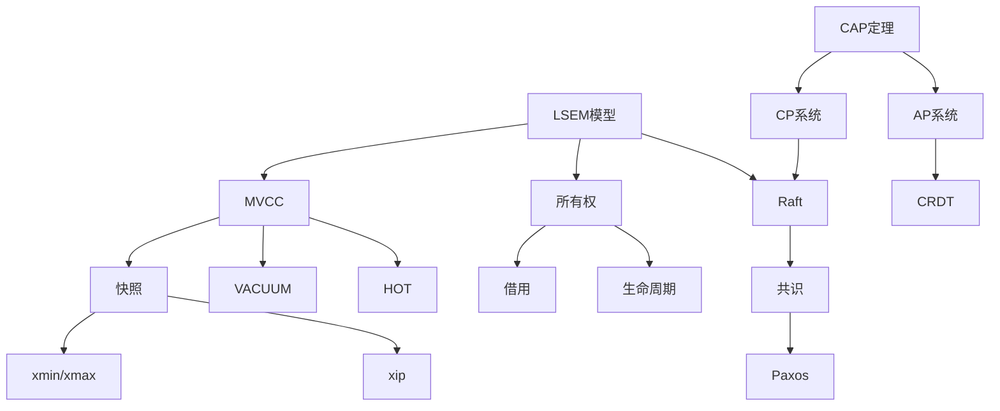

# 01 | 核心概念词典

> **工具定位**: 本文档提供所有核心概念的权威定义，支持快速查阅和准确理解。

---

## 📑 目录

- [01 | 核心概念词典](#01--核心概念词典)
  - [📑 目录](#-目录)
  - [一、按字母排序](#一按字母排序)
    - [A-C](#a-c)
    - [H-M](#h-m)
    - [P-Z](#p-z)
  - [二、按主题分类](#二按主题分类)
    - [并发控制](#并发控制)
    - [分布式系统](#分布式系统)
    - [Rust并发](#rust并发)
  - [三、完整词条列表（按字母排序）](#三完整词条列表按字母排序)
    - [A](#a)
    - [B](#b)
    - [C](#c)
    - [D](#d)
    - [E](#e)
    - [F](#f)
    - [G](#g)
    - [H](#h)
    - [I](#i)
    - [L](#l)
    - [M](#m)
    - [O](#o)
    - [P](#p)
    - [R](#r)
    - [S](#s)
    - [T](#t)
    - [V](#v)
    - [W](#w)
    - [X](#x)
  - [四、快速查找索引](#四快速查找索引)
    - [按技术领域](#按技术领域)
    - [按应用场景](#按应用场景)
  - [五、概念关系图](#五概念关系图)
  - [六、扩展阅读指南](#六扩展阅读指南)

---

## 一、按字母排序

### A-C

**ACID**:

- **定义**: 事务的四大特性（原子性、一致性、隔离性、持久性）
- **相关**: [03-ACID理论与实现.md](../01-核心理论模型/03-ACID理论与实现.md)

**Arc<T>** (Rust)

- **定义**: 原子引用计数智能指针，实现跨线程共享
- **公式**: $Arc = AtomicRefCount + T$
- **相关**: [06-所有权模型(Rust).md](../01-核心理论模型/06-所有权模型(Rust).md)

**CAP定理**:

- **定义**: 分布式系统无法同时满足一致性(C)、可用性(A)、分区容错(P)
- **公式**: $C \land A \land P = \emptyset$
- **相关**: [04-CAP理论与权衡.md](../01-核心理论模型/04-CAP理论与权衡.md)

**CCaaLF (Concurrency Control as a Learnable Function)**:

- **定义**: 学习型并发控制，使用机器学习优化并发控制策略
- **核心**: 将并发控制决策建模为学习问题 $f: \text{Workload} \rightarrow \text{Strategy}$
- **性能**: 相比传统方法提升12-56%
- **相关**: [09-学习型并发控制(CCaaLF).md](../10-前沿研究方向/09-学习型并发控制(CCaaLF).md)

---

### H-M

**happens-before**:

- **定义**: Rust内存模型中的偏序关系
- **性质**: 非自反、传递、反对称
- **相关**: [07-内存模型与排序.md](../01-核心理论模型/07-内存模型与排序.md)

**HOT (Heap-Only Tuple)**:

- **定义**: 仅更新堆表不更新索引的优化
- **条件**: 未更新索引列 + 同页内 + 有空间
- **相关**: [02-MVCC理论完整解析.md](../01-核心理论模型/02-MVCC理论完整解析.md)

**Hazard Pointers (危险指针)**:

- **定义**: 无锁数据结构中的内存回收技术
- **机制**: 线程标记正在访问的指针，延迟释放
- **相关**: [06-无锁算法性能分析.md](../06-性能分析/06-无锁算法性能分析.md)

**HLC (Hybrid Logical Clock)**:

- **定义**: 混合逻辑时钟 = 物理时间 + 逻辑计数器
- **公式**: $HLC = (pt, lc)$
- **相关**: [04-时钟同步(HLC_TrueTime).md](../04-分布式扩展/04-时钟同步(HLC_TrueTime).md)

**LSEM (Layered State Evolution Model)**:

- **定义**: 分层状态演化模型，本体系的核心元模型
- **层次**: L0(存储) + L1(运行时) + L2(分布式)
- **相关**: [01-分层状态演化模型(LSEM).md](../01-核心理论模型/01-分层状态演化模型(LSEM).md)

**MVCC (Multi-Version Concurrency Control)**:

- **定义**: 多版本并发控制，通过保留多个版本实现快照隔离
- **核心**: 版本链 + 可见性判断
- **相关**: [02-MVCC理论完整解析.md](../01-核心理论模型/02-MVCC理论完整解析.md)

---

### P-Z

**Percolator**:

- **定义**: Google的分布式MVCC模型，基于Bigtable
- **机制**: 两阶段提交 + 分布式锁
- **相关**: [01-分布式MVCC(Percolator).md](../04-分布式扩展/01-分布式MVCC(Percolator).md)

**Raft**:

- **定义**: 易理解的共识协议
- **核心**: Leader选举 + 日志复制 + 安全性
- **相关**: [08-共识协议理论.md](../01-核心理论模型/08-共识协议理论.md)

**Snapshot (快照)**:

- **定义**: 数据库在某一时刻的一致性视图
- **结构**: $(xmin, xmax, xip)$
- **相关**: [02-MVCC理论完整解析.md](../01-核心理论模型/02-MVCC理论完整解析.md)

**SSI (Serializable Snapshot Isolation)**:

- **定义**: PostgreSQL的串行化隔离实现
- **机制**: 检测危险结构 + 依赖图
- **相关**: [02-MVCC理论完整解析.md](../01-核心理论模型/02-MVCC理论完整解析.md)

**TPC-C**:

- **定义**: 事务处理性能委员会制定的OLTP基准测试
- **指标**: TPM-C (Transactions Per Minute)
- **场景**: 模拟复杂订单处理系统（5种事务类型，9张表）
- **相关**: [04-量化对比实验.md](../06-性能分析/04-量化对比实验.md)

**TPC-H**:

- **定义**: 决策支持系统(DSS)的标准基准测试
- **指标**: QphH (Queries per Hour)
- **场景**: 22个复杂分析查询，模拟数据仓库场景
- **相关**: [04-量化对比实验.md](../06-性能分析/04-量化对比实验.md)

**VACUUM**:

- **定义**: PostgreSQL MVCC中清理死元组、回收存储空间的核心机制。VACUUM通过识别不再对任何活跃事务可见的元组版本（死元组），回收存储空间，防止表膨胀，并执行Freeze操作防止32位事务ID回卷。VACUUM是MVCC系统维护存储效率和性能的关键操作
- **形式化**:

$$
DeadTuple(\tau) \iff \tau.xmax \neq 0 \land \tau.xmax < \text{OldestXmin}$; $\text{CanVacuum}(\tau) \iff DeadTuple(\tau) \land \tau.xmax \text{ is committed}
$$

- **作用**: 清理死元组，回收存储空间，防止表膨胀，执行Freeze操作防止XID回卷
- **OldestXmin**: 所有活跃事务中最小的事务ID，用于确定死元组边界
- **Freeze**: 当元组年龄超过阈值时，标记为永久可见，防止XID回卷
- **性能**: VACUUM开销取决于表大小和死元组数量，可以通过并行VACUUM优化
- **类型**: VACUUM（标准清理）、VACUUM FULL（完整重写）、VACUUM ANALYZE（清理+统计）、VACUUM FREEZE（强制Freeze）
- **相关**: [02-MVCC理论完整解析.md](../01-核心理论模型/02-MVCC理论完整解析.md#50-vacuum-完整定义与分析), [03-PostgreSQL-VACUUM机制.md](../05-实现机制/03-PostgreSQL-VACUUM机制.md)

**Dead Tuple (死元组)**:

- **定义**: 不再对任何活跃事务可见的元组版本，当行被更新或删除时，旧版本被标记为死元组
- **识别**: xmax < OldestXmin 且 xmax已提交，其中OldestXmin是所有活跃事务中最小的事务ID
- **清理**: 通过VACUUM机制清理，回收存储空间
- **影响**: 死元组累积导致表膨胀和性能下降
- **相关**: [02-MVCC理论完整解析.md](../01-核心理论模型/02-MVCC理论完整解析.md)

**WAL (Write-Ahead Logging)**:

- **定义**: 预写日志，先写日志再写数据
- **作用**: 保证原子性和持久性
- **相关**: [03-ACID理论与实现.md](../01-核心理论模型/03-ACID理论与实现.md)

**xmin/xmax**:

- **定义**: PostgreSQL元组头部的事务ID字段
- **xmin**: 创建该版本的事务ID
- **xmax**: 删除该版本的事务ID
- **相关**: [01-PostgreSQL-MVCC实现.md](../05-实现机制/01-PostgreSQL-MVCC实现.md)

---

## 二、按主题分类

### 并发控制

- **Concurrency Control (并发控制)**: 协调并发事务执行的机制，实现隔离性
- MVCC, 2PL, OCC, SSI, ESSN
- 锁(Lock), 死锁(Deadlock)
- 隔离级别(Isolation Level)
- Lock-Free, Wait-Free, Hazard Pointers
- CCaaLF (学习型并发控制)

### 分布式系统

- CAP, PACELC
- Raft, Paxos
- 2PC, Saga, TCC
- HLC, TrueTime

### Rust并发

- 所有权(Ownership)
- 借用(Borrow)
- 生命周期(Lifetime)
- Send/Sync trait

---

## 三、完整词条列表（按字母排序）

### A

**ACID**:

- **定义**: 事务的四大特性（原子性、一致性、隔离性、持久性）
- **公式**: $ACID = \{Atomicity, Consistency, Isolation, Durability\}$
- **相关**: [03-ACID理论与实现.md](../01-核心理论模型/03-ACID理论与实现.md)

**Arc<T>** (Rust)

- **定义**: 原子引用计数智能指针，实现跨线程共享
- **公式**: $Arc = AtomicRefCount + T$
- **使用场景**: 多线程共享只读数据
- **相关**: [06-所有权模型(Rust).md](../01-核心理论模型/06-所有权模型(Rust).md)

**Advisory Lock** (PostgreSQL)

- **定义**: 应用层锁，不依赖数据库对象
- **函数**: `pg_advisory_lock(key)`, `pg_advisory_unlock(key)`
- **用途**: 分布式协调、应用层互斥
- **相关**: [02-PostgreSQL-锁机制.md](../05-实现机制/02-PostgreSQL-锁机制.md)

### B

**Borrow Checker** (Rust)

- **定义**: Rust编译器的借用检查器，保证内存安全
- **规则**: 不可变借用与可变借用不能同时存在
- **相关**: [06-所有权模型(Rust).md](../01-核心理论模型/06-所有权模型(Rust).md)

**Bigtable**:

- **定义**: Google的分布式存储系统，Percolator的基础
- **特点**: 列族存储、多版本、时间戳排序
- **相关**: [01-分布式MVCC(Percolator).md](../04-分布式扩展/01-分布式MVCC(Percolator).md)

### C

**Concurrency Control (并发控制)**:

- **定义**: 协调并发事务执行的机制，确保并发事务执行正确且高效，在保持数据库一致性的同时允许最大并发度
- **方法**: MVCC、2PL、OCC、时间戳排序等
- **目标**: 实现隔离性，保证数据一致性
- **相关**: [05-并发控制理论统一框架.md](../01-核心理论模型/05-并发控制理论统一框架.md)

**CAP定理**:

- **定义**: 分布式系统无法同时满足一致性(C)、可用性(A)、分区容错(P)
- **公式**: $C \land A \land P = \emptyset$
- **权衡**: CP vs AP
- **相关**: [04-CAP理论与权衡.md](../01-核心理论模型/04-CAP理论与权衡.md)

**CRDT (Conflict-free Replicated Data Types)**:

- **定义**: 无冲突复制数据类型，满足交换律和结合律
- **类型**: G-Counter, PN-Counter, OR-Set
- **相关**: [04-CAP理论与权衡.md](../01-核心理论模型/04-CAP理论与权衡.md)

**Clog (Commit Log)**:

- **定义**: PostgreSQL的提交日志，记录事务状态
- **存储**: 共享内存 + 磁盘
- **用途**: 快速查询事务是否已提交
- **相关**: [01-PostgreSQL-MVCC实现.md](../05-实现机制/01-PostgreSQL-MVCC实现.md)

**Checkpoint**:

- **定义**: PostgreSQL WAL恢复机制中优化恢复时间的核心机制。Checkpoint是WAL序列中的一个点，在该点所有数据文件都已更新以反映日志中的信息。Checkpoint过程包括将所有脏缓冲区刷盘到磁盘，确保到该点为止的所有更改都已安全存储。Checkpoint通过限制恢复期间必须处理的WAL数量来缩短恢复时间
- **形式化**: $$\text{Checkpoint}(CP) \iff \forall \text{page } P: \text{Dirty}(P) \implies \text{Flushed}(P) \land \text{Recorded}(CP, \text{WAL})$; $\text{RecoveryStartLSN} = \max\{CP.\text{LSN} : \text{Checkpoint}(CP)\}$$
- **作用**: 优化恢复时间，缩短需要处理的WAL数量，定期持久化数据
- **触发**: 时间触发（checkpoint_timeout）、WAL大小触发（max_wal_size）、手动触发（CHECKPOINT命令）
- **性能**: Checkpoint将恢复时间缩短10-100×（从数小时缩短到数分钟）
- **平滑执行**: 使用checkpoint_completion_target平滑执行，不阻塞写入
- **相关**: [03-ACID理论与实现.md](../01-核心理论模型/03-ACID理论与实现.md#62-checkpoint-完整定义与分析), [01-PostgreSQL-MVCC实现.md](../05-实现机制/01-PostgreSQL-MVCC实现.md)

### D

**Deadlock (死锁)**:

- **定义**: 并发系统中的循环等待条件，多个事务相互等待对方释放资源，形成等待图中的环
- **检测**: 等待图 + DFS环检测算法
- **解决**: 选择牺牲者事务并回滚
- **必要条件**: 互斥、持有并等待、不可抢占、循环等待（Coffman条件）
- **相关**: [02-PostgreSQL-锁机制.md](../05-实现机制/02-PostgreSQL-锁机制.md)

**Durability (持久性)**:

- **定义**: 已提交事务的修改永久保存
- **保证**: WAL + fsync
- **相关**: [03-ACID理论与实现.md](../01-核心理论模型/03-ACID理论与实现.md)

### E

**Epoch (纪元)**:

- **定义**: Rust中的内存管理单元
- **用途**: 无锁数据结构的内存回收
- **相关**: [05-Rust-并发原语.md](../05-实现机制/05-Rust-并发原语.md)

**ESSN (Extended Serial Safety Net)**:

- **定义**: 扩展串行安全网，SSN的泛化方法
- **核心**: 使用已知全序(KTO)简化串行化检测
- **性能**: 相比SSN提升22-47%，中止率降低33-47%
- **时间复杂度**: $O(|R| + |W|)$ - 线性时间复杂度
- **相关**: [10-扩展串行安全网(ESSN).md](../10-前沿研究方向/10-扩展串行安全网(ESSN).md)

### F

**Fast Path Locking**:

- **定义**: PostgreSQL的快速路径锁，避免共享内存访问
- **适用**: AccessShareLock, RowExclusiveLock
- **性能**: 10×加速
- **相关**: [02-PostgreSQL-锁机制.md](../05-实现机制/02-PostgreSQL-锁机制.md)

**Fillfactor**:

- **定义**: 页面填充因子，预留空间给HOT更新
- **默认**: 100（填满）
- **推荐**: 70-80（高频更新表）
- **相关**: [03-存储开销分析.md](../06-性能分析/03-存储开销分析.md)

### G

**G-Counter (Grow-Only Counter)**:

- **定义**: 仅增计数器CRDT
- **合并**: 取每个节点的最大值
- **相关**: [04-CAP理论与权衡.md](../01-核心理论模型/04-CAP理论与权衡.md)

### H

**happens-before**:

- **定义**: Rust内存模型中的偏序关系
- **性质**: 非自反、传递、反对称
- **建立**: Acquire/Release语义
- **相关**: [07-内存模型与排序.md](../01-核心理论模型/07-内存模型与排序.md)

**HOT (Heap-Only Tuple)**:

- **定义**: 仅更新堆表不更新索引的优化
- **条件**: 未更新索引列 + 同页内 + 有空间
- **效果**: 避免索引膨胀
- **相关**: [02-MVCC理论完整解析.md](../01-核心理论模型/02-MVCC理论完整解析.md)

**Hazard Pointers (危险指针)**:

- **定义**: 无锁数据结构中的内存回收技术
- **机制**: 线程标记正在访问的指针，延迟释放
- **相关**: [06-无锁算法性能分析.md](../06-性能分析/06-无锁算法性能分析.md)

**HLC (Hybrid Logical Clock)**:

- **定义**: 混合逻辑时钟 = 物理时间 + 逻辑计数器
- **公式**: $HLC = (pt, lc)$
- **用途**: 分布式系统时间戳
- **相关**: [04-时钟同步(HLC_TrueTime).md](../04-分布式扩展/04-时钟同步(HLC_TrueTime).md)

**Hint Bits**:

- **定义**: PostgreSQL MVCC中优化可见性判断的性能优化机制。Hint Bits是存储在元组头部的标志位，用于缓存创建或删除该元组的事务的提交状态。通过Hint Bits，系统可以快速判断元组的可见性，无需重复查询事务日志（pg_clog），从而显著提升读操作的性能
- **形式化**: $$\text{HintBits}(\tau) = \{XMIN\_COMMITTED, XMIN\_INVALID, XMAX\_COMMITTED, XMAX\_INVALID\}$; $\text{UseHintBit}(\tau, \text{bit}) \iff \text{HintBitSet}(\tau, \text{bit}) \land \text{Valid}(\tau, \text{bit})$$
- **作用**: 缓存事务提交状态，避免重复查询pg_clog，优化可见性判断性能
- **类型**: XMIN_COMMITTED（xmin已提交）、XMIN_INVALID（xmin已回滚）、XMAX_COMMITTED（xmax已提交）、XMAX_INVALID（xmax已回滚）
- **性能**: Hint Bits将可见性判断延迟降低10-1000×（从1-100μs降低到< 0.1μs）
- **权衡**: Hint Bits设置导致页面脏页，需要优化设置策略
- **相关**: [02-MVCC理论完整解析.md](../01-核心理论模型/02-MVCC理论完整解析.md#60-hint-bits-完整定义与分析), [01-PostgreSQL-MVCC实现.md](../05-实现机制/01-PostgreSQL-MVCC实现.md)

### I

**Isolation Level (隔离级别)**:

- **定义**: 事务隔离的严格程度
- **级别**: Read Uncommitted, Read Committed, Repeatable Read, Serializable
- **相关**: [02-隔离级别权衡矩阵.md](../02-设计权衡分析/02-隔离级别权衡矩阵.md)

### L

**LSEM (Layered State Evolution Model)**:

- **定义**: 分层状态演化模型，本体系的核心元模型
- **层次**: L0(存储) + L1(运行时) + L2(分布式)
- **相关**: [01-分层状态演化模型(LSEM).md](../01-核心理论模型/01-分层状态演化模型(LSEM).md)

**Lock (锁)**:

- **定义**: 控制并发访问的同步机制，通过授予事务对数据项的独占或共享访问权限，防止并发事务同时修改同一数据项
- **类型**: 共享锁（S）、排他锁（X）
- **协议**: 2PL（两阶段锁）保证可串行化
- **相关**: [02-PostgreSQL-锁机制.md](../05-实现机制/02-PostgreSQL-锁机制.md)

**Lock-Free (无锁)**:

- **定义**: 并发算法保证至少一个线程能取得进展
- **保证**: 系统级进度保证，但非线程级
- **与Wait-Free区别**: Wait-Free保证所有线程都能取得进展
- **相关**: [06-无锁算法性能分析.md](../06-性能分析/06-无锁算法性能分析.md)

**Lifetime (生命周期)**:

- **定义**: Rust中引用的有效期间
- **标记**: `'a`, `'static`
- **相关**: [06-所有权模型(Rust).md](../01-核心理论模型/06-所有权模型(Rust).md)

**Little's Law**:

- **定义**: 系统平均请求数 = 到达率 × 平均响应时间
- **公式**: $N = \lambda \times W$
- **应用**: 连接池大小计算
- **相关**: [01-吞吐量公式推导.md](../06-性能分析/01-吞吐量公式推导.md)

### M

**MVCC (Multi-Version Concurrency Control)**:

- **定义**: 多版本并发控制，通过保留多个版本实现快照隔离
- **核心**: 版本链 + 可见性判断
- **优势**: 读不阻塞写
- **相关**: [02-MVCC理论完整解析.md](../01-核心理论模型/02-MVCC理论完整解析.md)

**Version Chain (版本链)**:

- **定义**: 同一逻辑元组的所有版本的链表结构，通过ctid指针连接，表示同一数据在不同时间点的状态
- **结构**: 通过ctid指针连接版本，从新版本向旧版本遍历
- **作用**: 存储多个历史版本，支持快照隔离
- **完整性**: 必须满足 $\tau_i.\text{xmax} = \tau_{i+1}.\text{xmin}$ 不变式
- **相关**: [02-MVCC理论完整解析.md](../01-核心理论模型/02-MVCC理论完整解析.md)

**Mutex<T>** (Rust)

- **定义**: 互斥锁，保护共享数据
- **特点**: 编译期保证线程安全
- **相关**: [05-Rust-并发原语.md](../05-实现机制/05-Rust-并发原语.md)

### O

**OldestXmin**:

- **定义**: PostgreSQL MVCC中用于确定死元组边界和可见性判断的关键概念。OldestXmin表示系统中所有活跃事务中最小的事务ID。它用于VACUUM识别可以安全清理的死元组：任何xmax小于OldestXmin的元组都保证对所有活跃事务不可见，因此可以安全清理。OldestXmin也用于Freeze操作，防止32位事务ID回卷
- **形式化**: $$\text{OldestXmin} = \begin{cases}\min\{\text{xid} | \text{xid is active}\} & \text{if } \exists \text{ active transaction} \\\text{LatestCompletedXid} & \text{otherwise}\end{cases}$; $DeadTuple(\tau) \iff \tau.xmax \neq 0 \land \tau.xmax < \text{OldestXmin} \land \text{Committed}(\tau.xmax)$$
- **作用**: 确定死元组边界，用于VACUUM识别死元组，保证不删除活跃事务可见的元组
- **计算**: 扫描所有活跃事务列表，取最小的事务ID
- **性能**: OldestXmin计算开销很小（1-10μs），但对VACUUM效果影响大
- **长事务影响**: 长事务导致OldestXmin过小，死元组无法清理，表膨胀严重
- **相关**: [02-MVCC理论完整解析.md](../01-核心理论模型/02-MVCC理论完整解析.md#51-oldestxmin-完整定义与分析), [01-PostgreSQL-MVCC实现.md](../05-实现机制/01-PostgreSQL-MVCC实现.md)

**Ownership (所有权)**:

- **定义**: Rust的内存管理模型
- **规则**: 每个值有唯一所有者
- **转移**: move语义
- **相关**: [06-所有权模型(Rust).md](../01-核心理论模型/06-所有权模型(Rust).md)

### P

**Percolator**:

- **定义**: Google的分布式MVCC模型，基于Bigtable
- **机制**: 两阶段提交 + 分布式锁
- **相关**: [01-分布式MVCC(Percolator).md](../04-分布式扩展/01-分布式MVCC(Percolator).md)

**Paxos**:

- **定义**: 经典共识协议
- **阶段**: Prepare + Accept
- **相关**: [03-共识协议(Raft_Paxos).md](../04-分布式扩展/03-共识协议(Raft_Paxos).md)

**PACELC**:

- **定义**: CAP的扩展，考虑正常情况下的延迟
- **公式**: If Partition: (A or C) Else: (L or C)
- **相关**: [04-CAP理论与权衡.md](../01-核心理论模型/04-CAP理论与权衡.md)

### R

**Raft**:

- **定义**: 易理解的共识协议
- **核心**: Leader选举 + 日志复制 + 安全性
- **相关**: [03-共识协议(Raft_Paxos).md](../04-分布式扩展/03-共识协议(Raft_Paxos).md)

**RwLock<T>** (Rust)

- **定义**: 读写锁，允许多读或单写
- **相关**: [05-Rust-并发原语.md](../05-实现机制/05-Rust-并发原语.md)

### S

**Saga**:

- **定义**: 长事务模式，分解为多个本地事务 + 补偿
- **类型**: Choreography, Orchestration
- **相关**: [02-分布式事务协议.md](../04-分布式扩展/02-分布式事务协议.md)

**Snapshot (快照)**:

- **定义**: 数据库在某一时刻的一致性视图
- **结构**: $(xmin, xmax, xip)$
- **相关**: [02-MVCC理论完整解析.md](../01-核心理论模型/02-MVCC理论完整解析.md)

**SSI (Serializable Snapshot Isolation)**:

- **定义**: PostgreSQL的串行化隔离实现
- **机制**: 检测危险结构 + 依赖图
- **相关**: [02-MVCC理论完整解析.md](../01-核心理论模型/02-MVCC理论完整解析.md)

**Send/Sync** (Rust)

- **定义**: Rust的并发安全trait
- **Send**: 可跨线程传递
- **Sync**: 可跨线程共享引用
- **相关**: [05-Rust-并发原语.md](../05-实现机制/05-Rust-并发原语.md)

### T

**Transaction (事务)**:

- **定义**: 数据库中的逻辑工作单元，具有ACID特性（原子性、一致性、隔离性、持久性）
- **公式**: $T = \{op_1, op_2, ..., op_n\} \xrightarrow{ACID} \text{Database State Transition}$
- **特性**: ACID = {Atomicity, Consistency, Isolation, Durability}
- **相关**: [03-ACID理论与实现.md](../01-核心理论模型/03-ACID理论与实现.md)

**TCC (Try-Confirm-Cancel)**:

- **定义**: 三阶段分布式事务模式
- **阶段**: Try(预留) + Confirm(确认) + Cancel(取消)
- **相关**: [02-分布式事务协议.md](../04-分布式扩展/02-分布式事务协议.md)

**TPC-C**:

- **定义**: 事务处理性能委员会制定的OLTP基准测试
- **指标**: TPM-C (Transactions Per Minute)
- **场景**: 模拟复杂订单处理系统（5种事务类型，9张表）
- **典型性能**: 125,000 TPM-C (PostgreSQL RC, 100并发)
- **相关**: [04-量化对比实验.md](../06-性能分析/04-量化对比实验.md)

**TPC-H**:

- **定义**: 决策支持系统(DSS)的标准基准测试
- **指标**: QphH (Queries per Hour)
- **场景**: 22个复杂分析查询，模拟数据仓库场景
- **典型性能**: 248 QphH (PostgreSQL企业级配置，8并发)
- **相关**: [04-量化对比实验.md](../06-性能分析/04-量化对比实验.md)

**TrueTime**:

- **定义**: Google Spanner的时钟同步API
- **精度**: 7ms误差
- **用途**: 外部一致性保证
- **相关**: [04-时钟同步(HLC_TrueTime).md](../04-分布式扩展/04-时钟同步(HLC_TrueTime).md)

**2PC (Two-Phase Commit)**:

- **定义**: 两阶段提交协议
- **阶段**: Prepare + Commit
- **问题**: 阻塞问题
- **相关**: [02-分布式事务协议.md](../04-分布式扩展/02-分布式事务协议.md)

**3PC (Three-Phase Commit)**:

- **定义**: 三阶段提交协议
- **阶段**: CanCommit + PreCommit + DoCommit
- **改进**: 减少阻塞，但仍有问题
- **相关**: [02-分布式事务协议.md](../04-分布式扩展/02-分布式事务协议.md)

### V

**VACUUM**:

- **定义**: PostgreSQL MVCC中清理死元组、回收存储空间的核心机制。VACUUM通过识别不再对任何活跃事务可见的元组版本（死元组），回收存储空间，防止表膨胀，并执行Freeze操作防止32位事务ID回卷。VACUUM是MVCC系统维护存储效率和性能的关键操作
- **形式化**: $$DeadTuple(\tau) \iff \tau.xmax \neq 0 \land \tau.xmax < \text{OldestXmin}$; $\text{CanVacuum}(\tau) \iff DeadTuple(\tau) \land \tau.xmax \text{ is committed}$$
- **作用**: 清理死元组，回收存储空间，防止表膨胀，执行Freeze操作防止XID回卷
- **OldestXmin**: 所有活跃事务中最小的事务ID，用于确定死元组边界
- **Freeze**: 当元组年龄超过阈值时，标记为永久可见，防止XID回卷
- **性能**: VACUUM开销取决于表大小和死元组数量，可以通过并行VACUUM优化
- **类型**: VACUUM（标准清理）、VACUUM FULL（完整重写）、VACUUM ANALYZE（清理+统计）、VACUUM FREEZE（强制Freeze）
- **相关**: [02-MVCC理论完整解析.md](../01-核心理论模型/02-MVCC理论完整解析.md#50-vacuum-完整定义与分析), [03-PostgreSQL-VACUUM机制.md](../05-实现机制/03-PostgreSQL-VACUUM机制.md)

**Visibility Map**:

- **定义**: PostgreSQL MVCC中优化Index-Only Scan的性能优化机制。Visibility Map是存储在独立文件中的位图结构，每个堆页面对应两个位：all-visible位和all-frozen位。all-visible位表示页面上的所有元组对所有活跃事务可见，这意味着Index-Only Scan可以跳过堆访问，直接从索引获取数据，从而显著提升查询性能
- **形式化**: $\text{VisibilityMap}(R) = \{(\text{PageNum}(p), \text{AllVisible}(p), \text{AllFrozen}(p)) : p \in \text{Pages}(R)\}$; $\text{AllVisible}(p) = 1 \iff \forall \tau \in p, \forall \text{snapshot } s: \text{Visible}(\tau, s)$
- **作用**: 标记全可见页面，允许Index-Only Scan跳过堆访问，优化查询性能
- **类型**: all-visible位（页面所有元组对所有事务可见）、all-frozen位（页面所有元组已冻结）
- **性能**: Visibility Map将Index-Only Scan延迟降低2-10×（从10-100μs降低到< 0.1μs）
- **维护**: VACUUM维护Visibility Map，写操作清除all-visible位
- **相关**: [02-MVCC理论完整解析.md](../01-核心理论模型/02-MVCC理论完整解析.md#615-visibility-map-完整定义与分析), [01-PostgreSQL-MVCC实现.md](../05-实现机制/01-PostgreSQL-MVCC实现.md)

### W

**WAL (Write-Ahead Logging)**:

- **定义**: PostgreSQL实现原子性和持久性的核心机制。WAL的核心原则是"先写日志，后写数据"：所有对数据文件的修改必须先写入WAL日志并刷盘到持久存储，然后才能修改数据文件。这确保了系统崩溃后可以从WAL日志恢复数据库到一致状态
- **形式化**: $\forall \text{page } P, \forall \text{log record } L: \text{Write}(P) \implies \text{Flushed}(L)$ where $L$ describes updates to $P$
- **作用**: 保证原子性（WAL记录所有操作，支持回滚）和持久性（WAL刷盘，数据持久化）
- **LSN**: Log Sequence Number，日志序列号，用于确定日志顺序
- **恢复**: 系统崩溃后从WAL恢复，重做已提交事务，撤销已中止事务
- **性能**: fsync是WAL的主要性能瓶颈（1-10ms），可以通过异步提交优化
- **相关**: [03-ACID理论与实现.md](../01-核心理论模型/03-ACID理论与实现.md#61-wal-write-ahead-logging-完整定义与分析)

### X

**xmin/xmax**:

- **定义**: PostgreSQL MVCC中元组头部的两个核心事务ID字段，是可见性判断的基础。xmin记录创建该元组版本的事务ID，xmax记录删除或更新该元组版本的事务ID（如果未被删除则为0）
- **xmin**: 创建该版本的事务ID（Transaction ID of Inserting Transaction）
- **xmax**: 删除该版本的事务ID（Transaction ID of Deleting Transaction），如果元组未被删除则为0
- **形式化**: $$\tau.\text{xmin} = \text{TransactionID}(T_i)$ where $T_i$ created $\tau$; $\tau.\text{xmax} = \text{TransactionID}(T_j)$ if $T_j$ deleted/updated $\tau$, else 0$$
- **作用**: 通过比较元组的xmin/xmax与事务快照的xmin/xmax/xip，系统可以确定该元组版本是否对当前事务可见
- **版本链不变式**: $$\forall \tau_i, \tau_{i+1} \in \text{Chain}(r, k): \tau_i.\text{xmax} = \tau_{i+1}.\text{xmin} \land \tau_i.\text{xmax} \neq 0$$
- **性能**: xmin/xmax比较开销极小（< 0.2μs），可忽略
- **相关**: [02-MVCC理论完整解析.md](../01-核心理论模型/02-MVCC理论完整解析.md#14-xminxmax-完整定义与分析), [01-PostgreSQL-MVCC实现.md](../05-实现机制/01-PostgreSQL-MVCC实现.md)

**xip (活跃事务列表)**:

- **定义**: PostgreSQL MVCC快照的核心组件之一，用于存储快照创建时所有活跃事务的事务ID数组。xip在可见性判断中起关键作用：如果元组的xmin在xip中，说明创建该元组的事务在快照创建时仍在运行（未提交），因此该元组对快照不可见，从而防止脏读。xip数组是有序的，支持二分查找，使得可见性判断的时间复杂度为O(log N_active)
- **形式化**: $$snap.\text{xip} = \{xid | xid \text{ is active} \land snap.\text{xmin} \leq xid < snap.\text{xmax}\}$; $\tau.\text{xmin} \in snap.\text{xip} \implies \neg \text{Visible}(\tau, snap)$; $T_{xip\_lookup} = O(\log N_{active})$$
- **作用**: 防止脏读，标识未提交事务，用于可见性判断
- **实现**: 有序数组存储活跃事务ID，支持二分查找
- **性能**: xip构建开销1-10μs，查找开销< 0.1μs，对系统性能影响小
- **长事务影响**: 大量长事务导致xip数组过大，内存开销和快照创建时间增加
- **相关**: [02-MVCC理论完整解析.md](../01-核心理论模型/02-MVCC理论完整解析.md#13555-xip-活跃事务列表-完整定义与分析), [01-PostgreSQL-MVCC实现.md](../05-实现机制/01-PostgreSQL-MVCC实现.md)

---

## 四、快速查找索引

### 按技术领域

**数据库理论**:

- ACID, MVCC, Snapshot, SSI, VACUUM, WAL, xmin/xmax, xip, HOT, Hint Bits, Visibility Map, Clog

**分布式系统**:

- CAP, PACELC, Raft, Paxos, 2PC, 3PC, Saga, TCC, Percolator, HLC, TrueTime, CRDT

**Rust并发**:

- Ownership, Borrow, Lifetime, Arc<T>, Mutex<T>, RwLock<T>, Send/Sync, Epoch, happens-before

**性能优化**:

- Little's Law, Fast Path Locking, Fillfactor, Advisory Lock
- TPC-C, TPC-H (基准测试)
- 性能调优、容量规划

### 按应用场景

**高并发读**:

- MVCC, Snapshot, Visibility Map, Index-Only Scan

**高并发写**:

- HOT, Fillfactor, 乐观锁, 行分散

**分布式事务**:

- 2PC, 3PC, Saga, TCC, Percolator

**共识协调**:

- Raft, Paxos, HLC, TrueTime

---

## 五、概念关系图

---

## 六、扩展阅读指南

**入门概念** (先学):

- ACID, MVCC, Snapshot, 隔离级别

**进阶概念** (深入):

- SSI, HOT, Hint Bits, VACUUM机制

**高级概念** (研究):

- LSEM, CAP, Raft, Percolator, 所有权模型
- CCaaLF, ESSN (最新研究)
- Lock-Free算法, Hazard Pointers

**实践概念** (应用):

- Fast Path Locking, Fillfactor, Advisory Lock, TCC

---

**版本**: 2.1.0（最新研究补充）
**创建日期**: 2025-12-05
**最后更新**: 2025-12-05
**词条数**: 60+
**新增内容**:

- 完整词条列表、快速查找索引、概念关系图、扩展阅读指南
- CCaaLF (学习型并发控制)
- ESSN (扩展串行安全网)
- TPC-C, TPC-H (基准测试)
- Lock-Free, Hazard Pointers (无锁算法)

**状态**: 持续更新中
