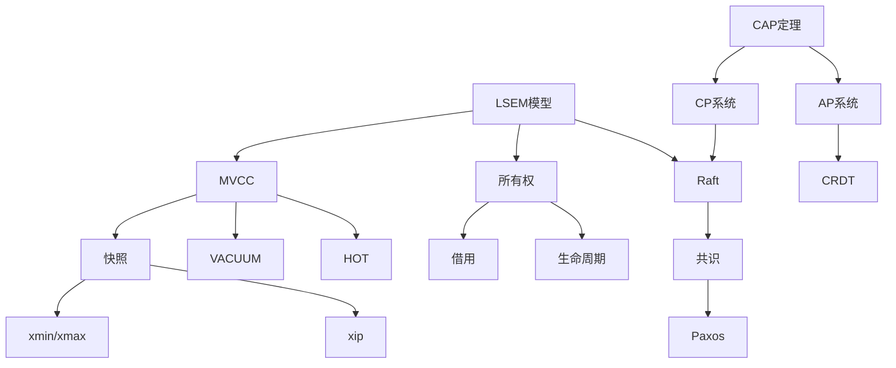

# 01 | 核心概念词典

> **工具定位**: 本文档提供所有核心概念的权威定义，支持快速查阅和准确理解。

---

## 📑 目录

- [01 | 核心概念词典](#01--核心概念词典)
  - [📑 目录](#-目录)
  - [📑 按字母排序](#-按字母排序)
    - [A-C](#a-c)
    - [H-M](#h-m)
    - [P-Z](#p-z)
  - [📖 按主题分类](#-按主题分类)
    - [并发控制](#并发控制)
    - [分布式系统](#分布式系统)
    - [Rust并发](#rust并发)
  - [三、完整词条列表（按字母排序）](#三完整词条列表按字母排序)
    - [A](#a)
    - [B](#b)
    - [C](#c)
    - [D](#d)
    - [E](#e)
    - [F](#f)
    - [G](#g)
    - [H](#h)
    - [I](#i)
    - [L](#l)
    - [M](#m)
    - [O](#o)
    - [P](#p)
    - [R](#r)
    - [S](#s)
    - [T](#t)
    - [V](#v)
    - [W](#w)
    - [X](#x)
  - [四、快速查找索引](#四快速查找索引)
    - [按技术领域](#按技术领域)
    - [按应用场景](#按应用场景)
  - [五、概念关系图](#五概念关系图)
  - [六、扩展阅读指南](#六扩展阅读指南)

---

## 📑 按字母排序

### A-C

**ACID**

- **定义**: 事务的四大特性（原子性、一致性、隔离性、持久性）
- **相关**: [03-ACID理论与实现.md](../01-核心理论模型/03-ACID理论与实现.md)

**Arc<T>** (Rust)

- **定义**: 原子引用计数智能指针，实现跨线程共享
- **公式**: $Arc = AtomicRefCount + T$
- **相关**: [06-所有权模型(Rust).md](../01-核心理论模型/06-所有权模型(Rust).md)

**CAP定理**

- **定义**: 分布式系统无法同时满足一致性(C)、可用性(A)、分区容错(P)
- **公式**: $C \land A \land P = \emptyset$
- **相关**: [04-CAP理论与权衡.md](../01-核心理论模型/04-CAP理论与权衡.md)

---

### H-M

**happens-before**

- **定义**: Rust内存模型中的偏序关系
- **性质**: 非自反、传递、反对称
- **相关**: [07-内存模型与排序.md](../01-核心理论模型/07-内存模型与排序.md)

**HOT (Heap-Only Tuple)**

- **定义**: 仅更新堆表不更新索引的优化
- **条件**: 未更新索引列 + 同页内 + 有空间
- **相关**: [02-MVCC理论完整解析.md](../01-核心理论模型/02-MVCC理论完整解析.md)

**HLC (Hybrid Logical Clock)**

- **定义**: 混合逻辑时钟 = 物理时间 + 逻辑计数器
- **公式**: $HLC = (pt, lc)$
- **相关**: [04-时钟同步(HLC_TrueTime).md](../04-分布式扩展/04-时钟同步(HLC_TrueTime).md)

**LSEM (Layered State Evolution Model)**

- **定义**: 分层状态演化模型，本体系的核心元模型
- **层次**: L0(存储) + L1(运行时) + L2(分布式)
- **相关**: [01-分层状态演化模型(LSEM).md](../01-核心理论模型/01-分层状态演化模型(LSEM).md)

**MVCC (Multi-Version Concurrency Control)**

- **定义**: 多版本并发控制，通过保留多个版本实现快照隔离
- **核心**: 版本链 + 可见性判断
- **相关**: [02-MVCC理论完整解析.md](../01-核心理论模型/02-MVCC理论完整解析.md)

---

### P-Z

**Percolator**

- **定义**: Google的分布式MVCC模型，基于Bigtable
- **机制**: 两阶段提交 + 分布式锁
- **相关**: [01-分布式MVCC(Percolator).md](../04-分布式扩展/01-分布式MVCC(Percolator).md)

**Raft**

- **定义**: 易理解的共识协议
- **核心**: Leader选举 + 日志复制 + 安全性
- **相关**: [08-共识协议理论.md](../01-核心理论模型/08-共识协议理论.md)

**Snapshot (快照)**

- **定义**: 数据库在某一时刻的一致性视图
- **结构**: $(xmin, xmax, xip)$
- **相关**: [02-MVCC理论完整解析.md](../01-核心理论模型/02-MVCC理论完整解析.md)

**SSI (Serializable Snapshot Isolation)**

- **定义**: PostgreSQL的串行化隔离实现
- **机制**: 检测危险结构 + 依赖图
- **相关**: [02-MVCC理论完整解析.md](../01-核心理论模型/02-MVCC理论完整解析.md)

**VACUUM**

- **定义**: PostgreSQL的垃圾回收机制
- **目的**: 回收死元组 + 防止ID回卷 + 更新统计
- **相关**: [03-PostgreSQL-VACUUM机制.md](../05-实现机制/03-PostgreSQL-VACUUM机制.md)

**WAL (Write-Ahead Logging)**

- **定义**: 预写日志，先写日志再写数据
- **作用**: 保证原子性和持久性
- **相关**: [03-ACID理论与实现.md](../01-核心理论模型/03-ACID理论与实现.md)

**xmin/xmax**

- **定义**: PostgreSQL元组头部的事务ID字段
- **xmin**: 创建该版本的事务ID
- **xmax**: 删除该版本的事务ID
- **相关**: [01-PostgreSQL-MVCC实现.md](../05-实现机制/01-PostgreSQL-MVCC实现.md)

---

## 📖 按主题分类

### 并发控制

- MVCC, 2PL, OCC
- 锁(Lock), 死锁(Deadlock)
- 隔离级别(Isolation Level)

### 分布式系统

- CAP, PACELC
- Raft, Paxos
- 2PC, Saga, TCC
- HLC, TrueTime

### Rust并发

- 所有权(Ownership)
- 借用(Borrow)
- 生命周期(Lifetime)
- Send/Sync trait

---

## 三、完整词条列表（按字母排序）

### A

**ACID**

- **定义**: 事务的四大特性（原子性、一致性、隔离性、持久性）
- **公式**: $ACID = \{Atomicity, Consistency, Isolation, Durability\}$
- **相关**: [03-ACID理论与实现.md](../01-核心理论模型/03-ACID理论与实现.md)

**Arc<T>** (Rust)

- **定义**: 原子引用计数智能指针，实现跨线程共享
- **公式**: $Arc = AtomicRefCount + T$
- **使用场景**: 多线程共享只读数据
- **相关**: [06-所有权模型(Rust).md](../01-核心理论模型/06-所有权模型(Rust).md)

**Advisory Lock** (PostgreSQL)

- **定义**: 应用层锁，不依赖数据库对象
- **函数**: `pg_advisory_lock(key)`, `pg_advisory_unlock(key)`
- **用途**: 分布式协调、应用层互斥
- **相关**: [02-PostgreSQL-锁机制.md](../05-实现机制/02-PostgreSQL-锁机制.md)

### B

**Borrow Checker** (Rust)

- **定义**: Rust编译器的借用检查器，保证内存安全
- **规则**: 不可变借用与可变借用不能同时存在
- **相关**: [06-所有权模型(Rust).md](../01-核心理论模型/06-所有权模型(Rust).md)

**Bigtable**

- **定义**: Google的分布式存储系统，Percolator的基础
- **特点**: 列族存储、多版本、时间戳排序
- **相关**: [01-分布式MVCC(Percolator).md](../04-分布式扩展/01-分布式MVCC(Percolator).md)

### C

**CAP定理**

- **定义**: 分布式系统无法同时满足一致性(C)、可用性(A)、分区容错(P)
- **公式**: $C \land A \land P = \emptyset$
- **权衡**: CP vs AP
- **相关**: [04-CAP理论与权衡.md](../01-核心理论模型/04-CAP理论与权衡.md)

**CRDT (Conflict-free Replicated Data Types)**

- **定义**: 无冲突复制数据类型，满足交换律和结合律
- **类型**: G-Counter, PN-Counter, OR-Set
- **相关**: [04-CAP理论与权衡.md](../01-核心理论模型/04-CAP理论与权衡.md)

**Clog (Commit Log)**

- **定义**: PostgreSQL的提交日志，记录事务状态
- **存储**: 共享内存 + 磁盘
- **用途**: 快速查询事务是否已提交
- **相关**: [01-PostgreSQL-MVCC实现.md](../05-实现机制/01-PostgreSQL-MVCC实现.md)

### D

**Deadlock (死锁)**

- **定义**: 多个事务相互等待，形成循环等待
- **检测**: 等待图 + DFS环检测
- **解决**: 选择受害者中止
- **相关**: [02-PostgreSQL-锁机制.md](../05-实现机制/02-PostgreSQL-锁机制.md)

**Durability (持久性)**

- **定义**: 已提交事务的修改永久保存
- **保证**: WAL + fsync
- **相关**: [03-ACID理论与实现.md](../01-核心理论模型/03-ACID理论与实现.md)

### E

**Epoch (纪元)**

- **定义**: Rust中的内存管理单元
- **用途**: 无锁数据结构的内存回收
- **相关**: [05-Rust-并发原语.md](../05-实现机制/05-Rust-并发原语.md)

### F

**Fast Path Locking**

- **定义**: PostgreSQL的快速路径锁，避免共享内存访问
- **适用**: AccessShareLock, RowExclusiveLock
- **性能**: 10×加速
- **相关**: [02-PostgreSQL-锁机制.md](../05-实现机制/02-PostgreSQL-锁机制.md)

**Fillfactor**

- **定义**: 页面填充因子，预留空间给HOT更新
- **默认**: 100（填满）
- **推荐**: 70-80（高频更新表）
- **相关**: [03-存储开销分析.md](../06-性能分析/03-存储开销分析.md)

### G

**G-Counter (Grow-Only Counter)**

- **定义**: 仅增计数器CRDT
- **合并**: 取每个节点的最大值
- **相关**: [04-CAP理论与权衡.md](../01-核心理论模型/04-CAP理论与权衡.md)

### H

**happens-before**

- **定义**: Rust内存模型中的偏序关系
- **性质**: 非自反、传递、反对称
- **建立**: Acquire/Release语义
- **相关**: [07-内存模型与排序.md](../01-核心理论模型/07-内存模型与排序.md)

**HOT (Heap-Only Tuple)**

- **定义**: 仅更新堆表不更新索引的优化
- **条件**: 未更新索引列 + 同页内 + 有空间
- **效果**: 避免索引膨胀
- **相关**: [02-MVCC理论完整解析.md](../01-核心理论模型/02-MVCC理论完整解析.md)

**HLC (Hybrid Logical Clock)**

- **定义**: 混合逻辑时钟 = 物理时间 + 逻辑计数器
- **公式**: $HLC = (pt, lc)$
- **用途**: 分布式系统时间戳
- **相关**: [04-时钟同步(HLC_TrueTime).md](../04-分布式扩展/04-时钟同步(HLC_TrueTime).md)

**Hint Bits**

- **定义**: 元组头部的标志位，缓存事务状态
- **效果**: 避免重复查询pg_clog，10×加速
- **相关**: [01-PostgreSQL-MVCC实现.md](../05-实现机制/01-PostgreSQL-MVCC实现.md)

### I

**Isolation Level (隔离级别)**

- **定义**: 事务隔离的严格程度
- **级别**: Read Uncommitted, Read Committed, Repeatable Read, Serializable
- **相关**: [02-隔离级别权衡矩阵.md](../02-设计权衡分析/02-隔离级别权衡矩阵.md)

### L

**LSEM (Layered State Evolution Model)**

- **定义**: 分层状态演化模型，本体系的核心元模型
- **层次**: L0(存储) + L1(运行时) + L2(分布式)
- **相关**: [01-分层状态演化模型(LSEM).md](../01-核心理论模型/01-分层状态演化模型(LSEM).md)

**Lifetime (生命周期)**

- **定义**: Rust中引用的有效期间
- **标记**: `'a`, `'static`
- **相关**: [06-所有权模型(Rust).md](../01-核心理论模型/06-所有权模型(Rust).md)

**Little's Law**

- **定义**: 系统平均请求数 = 到达率 × 平均响应时间
- **公式**: $N = \lambda \times W$
- **应用**: 连接池大小计算
- **相关**: [01-吞吐量公式推导.md](../06-性能分析/01-吞吐量公式推导.md)

### M

**MVCC (Multi-Version Concurrency Control)**

- **定义**: 多版本并发控制，通过保留多个版本实现快照隔离
- **核心**: 版本链 + 可见性判断
- **优势**: 读不阻塞写
- **相关**: [02-MVCC理论完整解析.md](../01-核心理论模型/02-MVCC理论完整解析.md)

**Mutex<T>** (Rust)

- **定义**: 互斥锁，保护共享数据
- **特点**: 编译期保证线程安全
- **相关**: [05-Rust-并发原语.md](../05-实现机制/05-Rust-并发原语.md)

### O

**Ownership (所有权)**

- **定义**: Rust的内存管理模型
- **规则**: 每个值有唯一所有者
- **转移**: move语义
- **相关**: [06-所有权模型(Rust).md](../01-核心理论模型/06-所有权模型(Rust).md)

### P

**Percolator**

- **定义**: Google的分布式MVCC模型，基于Bigtable
- **机制**: 两阶段提交 + 分布式锁
- **相关**: [01-分布式MVCC(Percolator).md](../04-分布式扩展/01-分布式MVCC(Percolator).md)

**Paxos**

- **定义**: 经典共识协议
- **阶段**: Prepare + Accept
- **相关**: [03-共识协议(Raft_Paxos).md](../04-分布式扩展/03-共识协议(Raft_Paxos).md)

**PACELC**

- **定义**: CAP的扩展，考虑正常情况下的延迟
- **公式**: If Partition: (A or C) Else: (L or C)
- **相关**: [04-CAP理论与权衡.md](../01-核心理论模型/04-CAP理论与权衡.md)

### R

**Raft**

- **定义**: 易理解的共识协议
- **核心**: Leader选举 + 日志复制 + 安全性
- **相关**: [03-共识协议(Raft_Paxos).md](../04-分布式扩展/03-共识协议(Raft_Paxos).md)

**RwLock<T>** (Rust)

- **定义**: 读写锁，允许多读或单写
- **相关**: [05-Rust-并发原语.md](../05-实现机制/05-Rust-并发原语.md)

### S

**Saga**

- **定义**: 长事务模式，分解为多个本地事务 + 补偿
- **类型**: Choreography, Orchestration
- **相关**: [02-分布式事务协议.md](../04-分布式扩展/02-分布式事务协议.md)

**Snapshot (快照)**

- **定义**: 数据库在某一时刻的一致性视图
- **结构**: $(xmin, xmax, xip)$
- **相关**: [02-MVCC理论完整解析.md](../01-核心理论模型/02-MVCC理论完整解析.md)

**SSI (Serializable Snapshot Isolation)**

- **定义**: PostgreSQL的串行化隔离实现
- **机制**: 检测危险结构 + 依赖图
- **相关**: [02-MVCC理论完整解析.md](../01-核心理论模型/02-MVCC理论完整解析.md)

**Send/Sync** (Rust)

- **定义**: Rust的并发安全trait
- **Send**: 可跨线程传递
- **Sync**: 可跨线程共享引用
- **相关**: [05-Rust-并发原语.md](../05-实现机制/05-Rust-并发原语.md)

### T

**TCC (Try-Confirm-Cancel)**

- **定义**: 三阶段分布式事务模式
- **阶段**: Try(预留) + Confirm(确认) + Cancel(取消)
- **相关**: [02-分布式事务协议.md](../04-分布式扩展/02-分布式事务协议.md)

**TrueTime**

- **定义**: Google Spanner的时钟同步API
- **精度**: 7ms误差
- **用途**: 外部一致性保证
- **相关**: [04-时钟同步(HLC_TrueTime).md](../04-分布式扩展/04-时钟同步(HLC_TrueTime).md)

**2PC (Two-Phase Commit)**

- **定义**: 两阶段提交协议
- **阶段**: Prepare + Commit
- **问题**: 阻塞问题
- **相关**: [02-分布式事务协议.md](../04-分布式扩展/02-分布式事务协议.md)

**3PC (Three-Phase Commit)**

- **定义**: 三阶段提交协议
- **阶段**: CanCommit + PreCommit + DoCommit
- **改进**: 减少阻塞，但仍有问题
- **相关**: [02-分布式事务协议.md](../04-分布式扩展/02-分布式事务协议.md)

### V

**VACUUM**

- **定义**: PostgreSQL的垃圾回收机制
- **目的**: 回收死元组 + 防止ID回卷 + 更新统计
- **类型**: VACUUM, VACUUM FULL, VACUUM ANALYZE
- **相关**: [03-PostgreSQL-VACUUM机制.md](../05-实现机制/03-PostgreSQL-VACUUM机制.md)

**Visibility Map**

- **定义**: 位图，标记页面是否全可见
- **用途**: 加速Index-Only Scan
- **相关**: [02-MVCC理论完整解析.md](../01-核心理论模型/02-MVCC理论完整解析.md)

### W

**WAL (Write-Ahead Logging)**

- **定义**: 预写日志，先写日志再写数据
- **作用**: 保证原子性和持久性
- **相关**: [03-ACID理论与实现.md](../01-核心理论模型/03-ACID理论与实现.md)

### X

**xmin/xmax**

- **定义**: PostgreSQL元组头部的事务ID字段
- **xmin**: 创建该版本的事务ID
- **xmax**: 删除该版本的事务ID
- **相关**: [01-PostgreSQL-MVCC实现.md](../05-实现机制/01-PostgreSQL-MVCC实现.md)

**xip (活跃事务列表)**

- **定义**: 快照中的活跃事务ID数组
- **用途**: 可见性检查
- **相关**: [02-MVCC理论完整解析.md](../01-核心理论模型/02-MVCC理论完整解析.md)

---

## 四、快速查找索引

### 按技术领域

**数据库理论**:

- ACID, MVCC, Snapshot, SSI, VACUUM, WAL, xmin/xmax, xip, HOT, Hint Bits, Visibility Map, Clog

**分布式系统**:

- CAP, PACELC, Raft, Paxos, 2PC, 3PC, Saga, TCC, Percolator, HLC, TrueTime, CRDT

**Rust并发**:

- Ownership, Borrow, Lifetime, Arc<T>, Mutex<T>, RwLock<T>, Send/Sync, Epoch, happens-before

**性能优化**:

- Little's Law, Fast Path Locking, Fillfactor, Advisory Lock

### 按应用场景

**高并发读**:

- MVCC, Snapshot, Visibility Map, Index-Only Scan

**高并发写**:

- HOT, Fillfactor, 乐观锁, 行分散

**分布式事务**:

- 2PC, 3PC, Saga, TCC, Percolator

**共识协调**:

- Raft, Paxos, HLC, TrueTime

---

## 五、概念关系图

---

## 六、扩展阅读指南

**入门概念** (先学):

- ACID, MVCC, Snapshot, 隔离级别

**进阶概念** (深入):

- SSI, HOT, Hint Bits, VACUUM机制

**高级概念** (研究):

- LSEM, CAP, Raft, Percolator, 所有权模型

**实践概念** (应用):

- Fast Path Locking, Fillfactor, Advisory Lock, TCC

---

**版本**: 2.0.0（大幅充实）
**创建日期**: 2025-12-05
**最后更新**: 2025-12-05
**词条数**: 50+
**新增内容**: 完整词条列表、快速查找索引、概念关系图、扩展阅读指南

**状态**: 持续更新中
