# 08 | 概念关系图

> **工具定位**: 本文档通过可视化图表展示核心概念之间的定义关系、因果关系和跨层映射关系，帮助理解理论体系的整体结构。
> **📖 概念词典引用**：本文档中涉及的所有核心概念定义与 [核心概念词典](./01-核心概念词典.md) 保持一致。如发现不一致，请以核心概念词典为准。

---

## 📑 目录

- [08 | 概念关系图](#08--概念关系图)
  - [📑 目录](#-目录)
  - [一、概念关系图总览](#一概念关系图总览)
  - [二、定义关系网络](#二定义关系网络)
    - [2.1 LSEM核心概念网络](#21-lsem核心概念网络)
    - [2.2 MVCC概念网络](#22-mvcc概念网络)
    - [2.3 ACID概念网络](#23-acid概念网络)
    - [2.4 CAP概念网络](#24-cap概念网络)
    - [2.5 Rust所有权概念网络](#25-rust所有权概念网络)
    - [2.6 分布式系统概念网络](#26-分布式系统概念网络)
  - [三、因果关系链](#三因果关系链)
    - [3.1 时间戳理论发展链](#31-时间戳理论发展链)
    - [3.2 并发控制演进链](#32-并发控制演进链)
    - [3.3 一致性模型发展链](#33-一致性模型发展链)
    - [3.4 隔离级别演进链](#34-隔离级别演进链)
  - [四、跨层映射关系](#四跨层映射关系)
    - [4.1 L0 ↔ L1 映射](#41-l0--l1-映射)
    - [4.2 L1 ↔ L2 映射](#42-l1--l2-映射)
    - [4.3 L0 ↔ L2 映射](#43-l0--l2-映射)
    - [4.4 三层统一映射](#44-三层统一映射)
  - [5. 概念依赖关系](#5-概念依赖关系)
    - [5.1 基础依赖](#51-基础依赖)
    - [5.2 组合依赖](#52-组合依赖)
    - [5.3 实现依赖](#53-实现依赖)
  - [六、概念分类树](#六概念分类树)
    - [6.1 按抽象层次分类](#61-按抽象层次分类)
    - [6.2 按功能领域分类](#62-按功能领域分类)
    - [6.3 按实现机制分类](#63-按实现机制分类)
  - [七、概念关联矩阵](#七概念关联矩阵)
    - [7.1 核心概念关联矩阵](#71-核心概念关联矩阵)
    - [7.2 跨层概念关联矩阵](#72-跨层概念关联矩阵)
  - [八、扩展阅读指南](#八扩展阅读指南)
    - [按关系类型阅读](#按关系类型阅读)

---

## 一、概念关系图总览

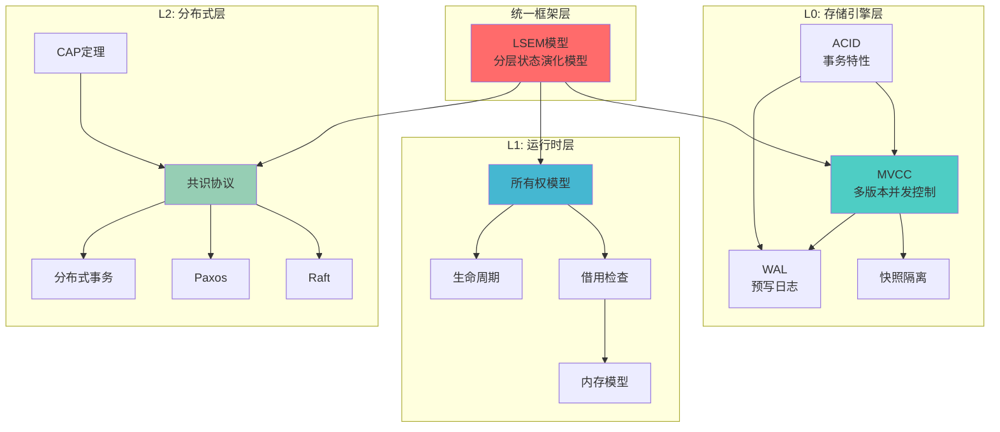

**关系类型说明**:

- **实线箭头 (→)**: 直接依赖关系，如"MVCC → 快照隔离"表示快照隔离是MVCC的核心机制
- **虚线箭头 (⇢)**: 间接影响关系，如"CAP定理 ⇢ 共识协议"表示CAP定理影响共识协议的设计选择
- **双向箭头 (↔)**: 相互映射关系，如"L0状态 ↔ L1状态"表示两层状态概念的同构性

---

## 二、定义关系网络

### 2.1 LSEM核心概念网络

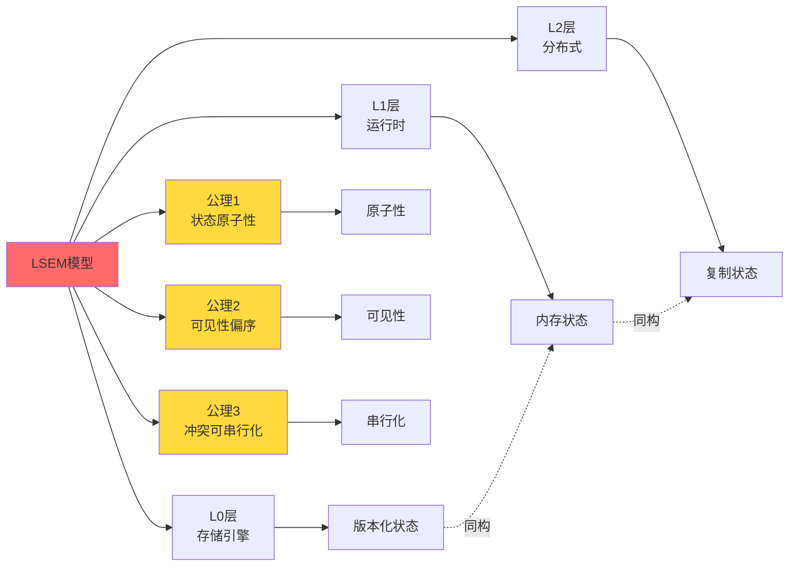

**关键关系**:

- **LSEM → L0/L1/L2**: 统一框架包含三个层次
- **LSEM → 三大公理**: 公理体系是LSEM的理论基础
- **状态同构**: 三层状态概念在LSEM框架下同构

---

### 2.2 MVCC概念网络

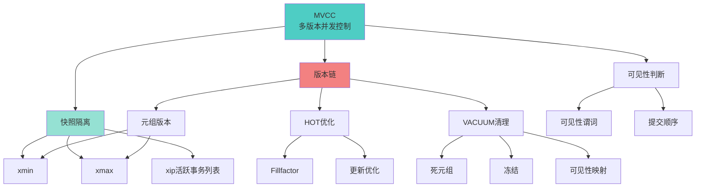

**定义关系**:

- **MVCC**: 多版本并发控制是总概念
- **快照隔离**: MVCC的核心隔离机制
- **版本链**: MVCC的数据结构基础
- **可见性判断**: MVCC的核心算法

---

### 2.3 ACID概念网络

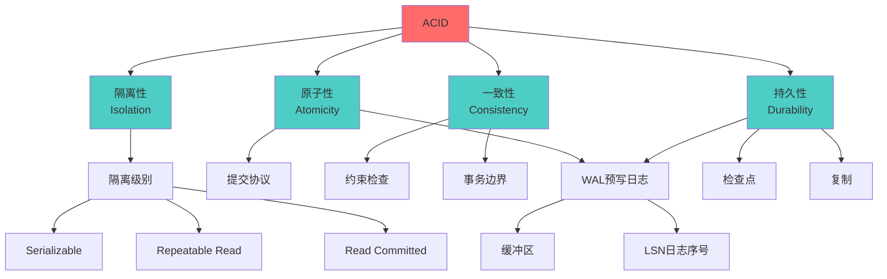

**组成关系**:

- **ACID**: 由四个特性组成
- **隔离性 → 隔离级别**: 隔离性通过不同隔离级别实现
- **持久性 → WAL**: WAL是实现持久性的核心机制

---

### 2.4 CAP概念网络

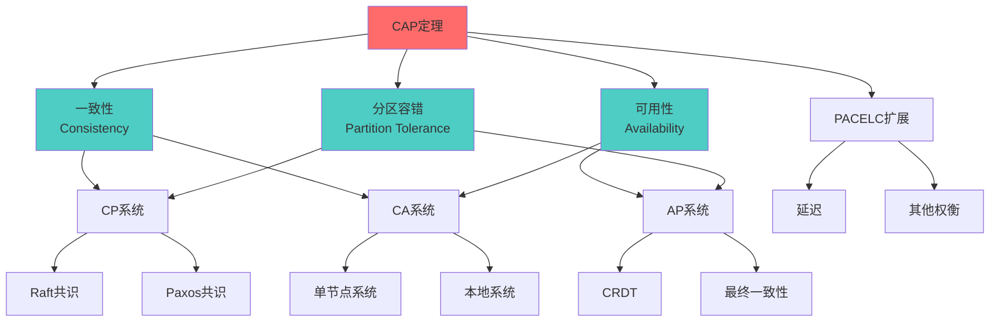

**权衡关系**:

- **CAP → CP/AP/CA**: CAP定理指出三者不可兼得，系统必须选择
- **CP → 共识协议**: CP系统需要强一致性，通常使用共识协议
- **AP → CRDT**: AP系统允许弱一致性，可以使用CRDT等数据结构

---

### 2.5 Rust所有权概念网络

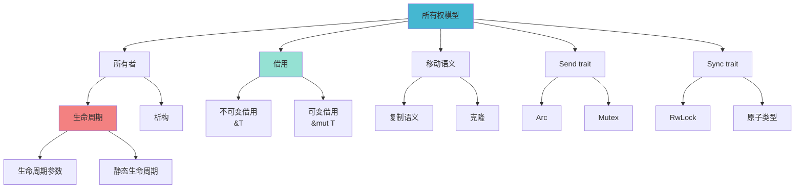

**核心关系**:

- **所有权 → 借用**: 借用是所有权系统的核心机制
- **所有权 → 生命周期**: 生命周期管理是所有权系统的安全保障
- **Send/Sync**: 并发安全的基础trait

---

### 2.6 分布式系统概念网络

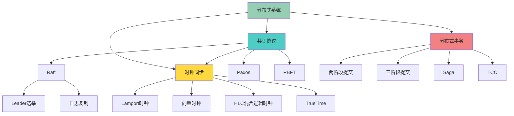

---

## 三、因果关系链

### 3.1 时间戳理论发展链


**因果链说明**:

1. **物理时钟问题** → 需要逻辑时钟解决同步问题
2. **Lamport时钟** → 提供偏序关系，但无法检测并发
3. **向量时钟** → 可以检测并发，但向量大小随节点数增长
4. **HLC** → 结合物理时钟和逻辑时钟，向量大小固定
5. **TrueTime** → 使用原子钟和GPS提供全局时间

---

### 3.2 并发控制演进链

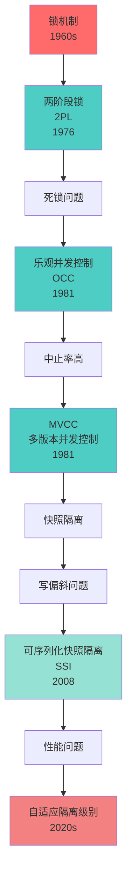

**演进逻辑**:

- **锁机制** → 简单但性能差，易死锁
- **2PL** → 解决死锁但性能仍受限
- **OCC** → 提高性能但中止率高
- **MVCC** → 读性能优秀，但写偏斜问题
- **SSI** → 解决写偏斜，但性能开销
- **自适应** → 根据工作负载动态调整

---

### 3.3 一致性模型发展链

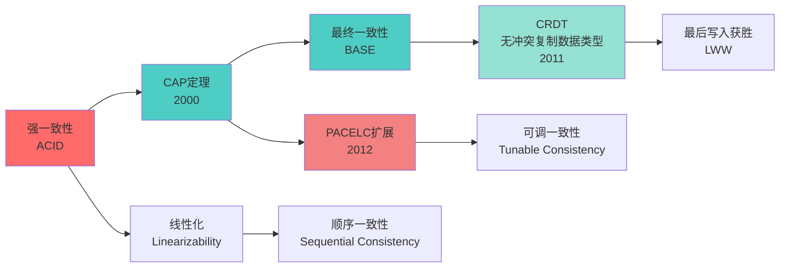

---

### 3.4 隔离级别演进链

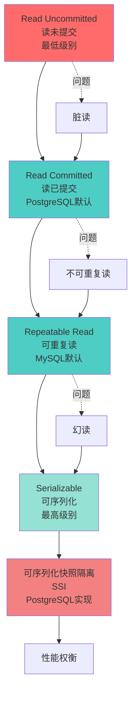

**问题驱动演进**:

- 每个隔离级别解决上一级别的问题
- 但带来性能开销
- SSI是SERIALIZABLE的高性能实现

---

## 四、跨层映射关系

### 4.1 L0 ↔ L1 映射

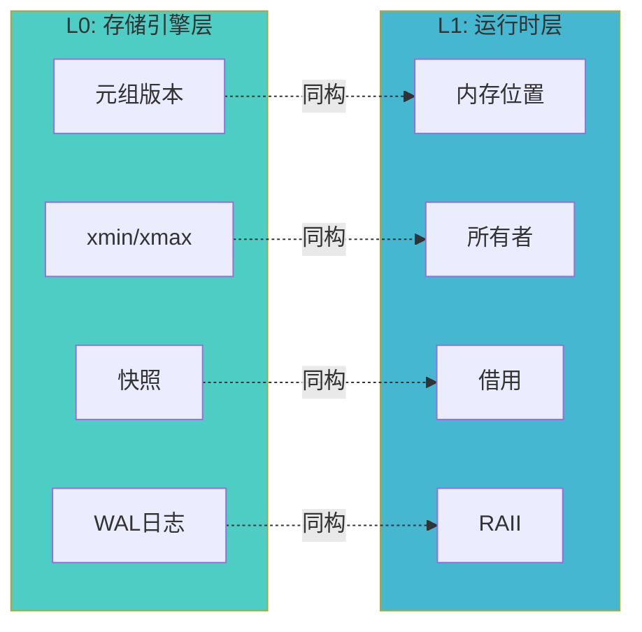

**映射关系表**:

| L0概念    | L1概念   | 映射关系   | 说明                       |
| --------- | -------- | ---------- | -------------------------- |
| 元组版本  | 内存位置 | 状态单元   | 都是版本化的状态容器       |
| xmin/xmax | 所有者   | 可见性控制 | 都通过所有权控制可见性     |
| 快照      | 借用     | 时间点视图 | 都提供特定时间点的状态视图 |
| WAL       | RAII     | 资源管理   | 都保证资源正确释放         |

---

### 4.2 L1 ↔ L2 映射

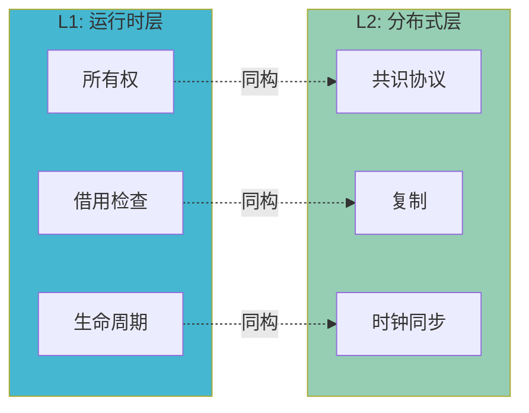

**映射关系表**:

| L1概念   | L2概念   | 映射关系   | 说明                   |
| -------- | -------- | ---------- | ---------------------- |
| 所有权   | 共识协议 | 权威性     | 都确定谁有权修改状态   |
| 借用检查 | 复制     | 可见性传播 | 都控制状态的可见性传播 |
| 生命周期 | 时钟同步 | 时间顺序   | 都建立时间偏序关系     |

---

### 4.3 L0 ↔ L2 映射

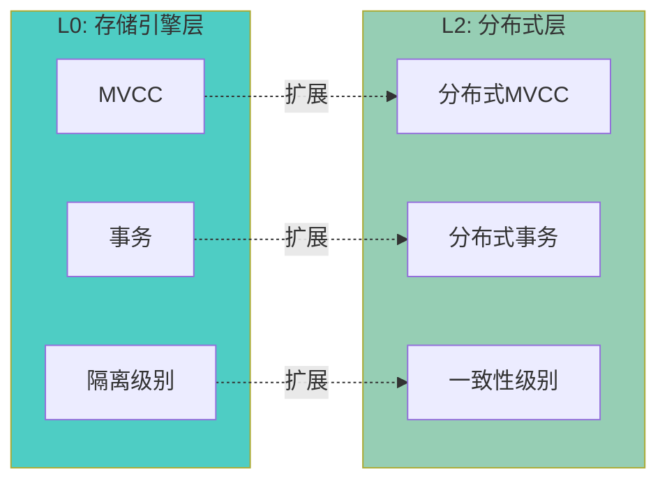

**扩展关系**:

- **MVCC → 分布式MVCC**: 单机MVCC扩展到分布式环境
- **事务 → 分布式事务**: 单机事务扩展到跨节点事务
- **隔离级别 → 一致性级别**: 单机隔离扩展到分布式一致性

---

### 4.4 三层统一映射

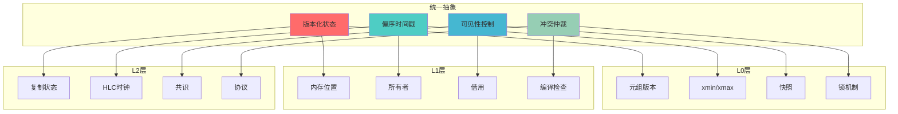

**统一映射表**:

| 统一抽象           | L0实现      | L1实现     | L2实现        |
| ------------------ | ----------- | ---------- | ------------- |
| **状态单元** | 元组版本    | 内存位置   | 复制状态机    |
| **时间戳**   | xmin/xmax   | 生命周期   | HLC/TrueTime  |
| **可见性**   | 快照隔离    | 借用检查   | 共识协议      |
| **冲突仲裁** | 锁+死锁检测 | 编译期拒绝 | 共识+冲突解决 |

---

## 5. 概念依赖关系

### 5.1 基础依赖

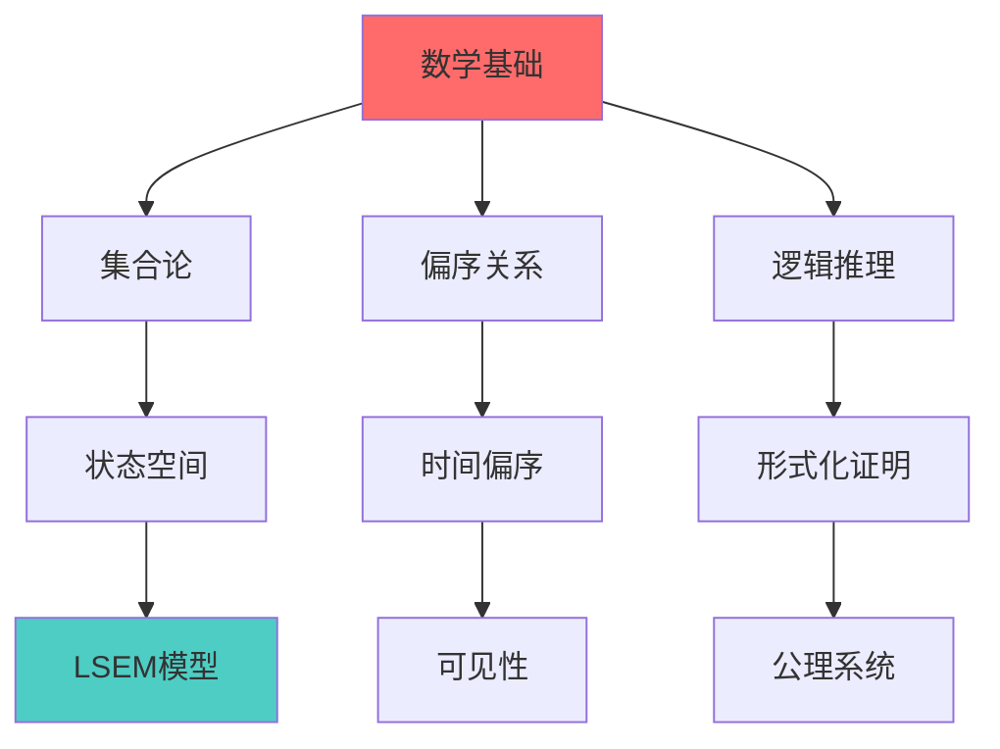

**基础概念**:

- **集合论**: 状态空间、事务集合等的基础
- **偏序关系**: 时间戳、可见性关系的基础
- **逻辑推理**: 形式化证明的基础

---

### 5.2 组合依赖

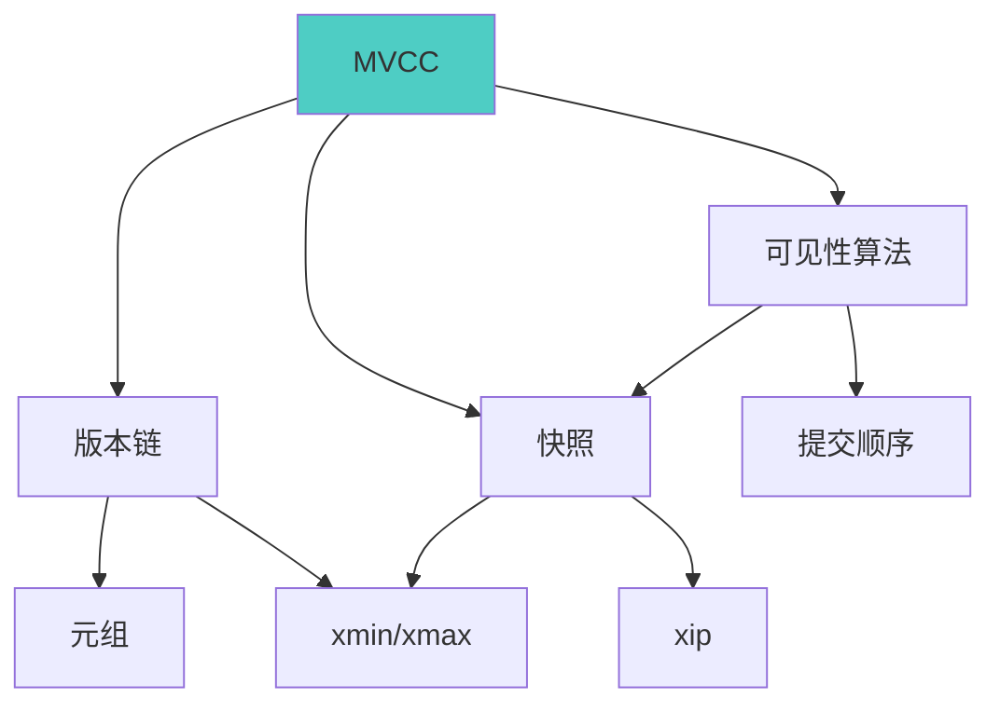

**组合关系**:

- **MVCC**: 由版本链、快照、可见性算法组合而成
- **快照**: 由xmin、xmax、xip组合而成
- **可见性算法**: 依赖快照和提交顺序

---

### 5.3 实现依赖

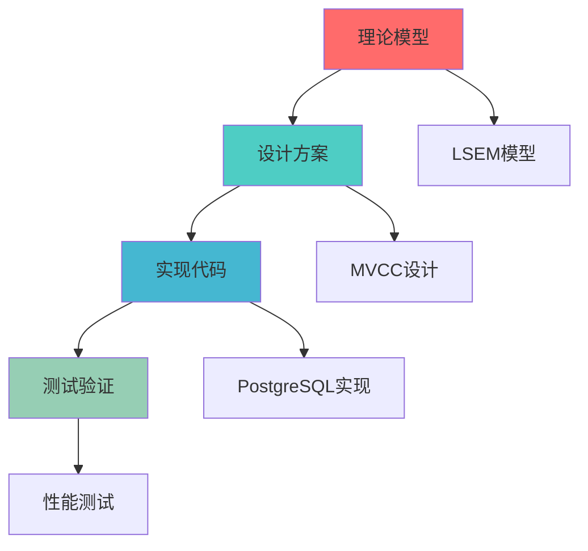

---

## 六、概念分类树

### 6.1 按抽象层次分类

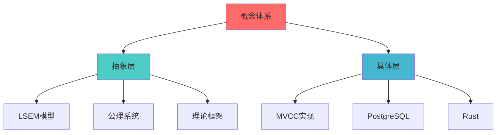

---

### 6.2 按功能领域分类

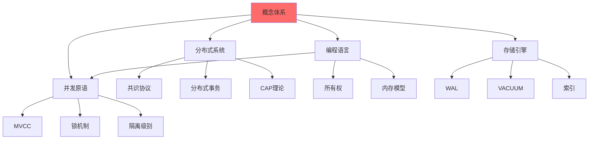

---

### 6.3 按实现机制分类

```mermaid
graph TB
    Root[概念体系] --> Optimistic[乐观机制]
    Root --> Pessimistic[悲观机制]
    Root --> Hybrid[混合机制]

    Optimistic --> OCC[OCC]
    Optimistic --> MVCC[MVCC]
    Optimistic --> CRDT[CRDT]

    Pessimistic --> Lock[锁]
    Pessimistic --> 2PL[2PL]
    Pessimistic --> Serial[串行化]

    Hybrid --> SSI[SSI]
    Hybrid --> Adaptive[自适应]
    Hybrid --> Learning[学习型]

    style Root fill:#ff6b6b
```

---

## 七、概念关联矩阵

### 7.1 核心概念关联矩阵

| 概念                | LSEM     | MVCC   | ACID     | CAP    | Ownership | Consensus |
| ------------------- | -------- | ------ | -------- | ------ | --------- | --------- |
| **LSEM**      | -        | L0层   | 理论基础 | L2层   | L1层      | L2层      |
| **MVCC**      | L0实现   | -      | 隔离性   | -      | 同构      | -         |
| **ACID**      | 保证机制 | 隔离性 | -        | -      | -         | -         |
| **CAP**       | L2层     | -      | -        | -      | -         | CP系统    |
| **Ownership** | L1层     | 同构   | -        | -      | -         | 同构      |
| **Consensus** | L2层     | -      | -        | CP系统 | 同构      | -         |

**关联强度**:

- **强关联 (直接依赖)**: LSEM ↔ MVCC/Ownership/Consensus
- **中等关联 (部分依赖)**: MVCC ↔ ACID, CAP ↔ Consensus
- **弱关联 (概念相似)**: MVCC ↔ Ownership (同构关系)

---

### 7.2 跨层概念关联矩阵

| L0概念    | L1概念   | L2概念   | 关联类型     |
| --------- | -------- | -------- | ------------ |
| 元组版本  | 内存位置 | 复制状态 | 状态单元同构 |
| xmin/xmax | 所有者   | Leader   | 权威性同构   |
| 快照      | 借用     | 共识视图 | 可见性同构   |
| WAL       | RAII     | 日志复制 | 资源管理同构 |
| 锁机制    | 编译检查 | 共识协议 | 冲突仲裁同构 |

---

## 八、扩展阅读指南

### 按关系类型阅读

**定义关系**:

- [01-核心概念词典.md](./01-核心概念词典.md) - 所有概念的权威定义
- [01-核心理论模型/01-分层状态演化模型(LSEM).md](../01-核心理论模型/01-分层状态演化模型(LSEM).md) - LSEM框架定义

**因果关系**:

- [09-理论发展史.md](./09-理论发展史.md) - 理论发展历史
- [01-核心理论模型/02-MVCC理论完整解析.md](../01-核心理论模型/02-MVCC理论完整解析.md) - MVCC演进

**跨层映射**:

- [00-理论体系全景图.md](./00-理论体系全景图.md) - 跨层映射关系
- [01-核心理论模型/01-分层状态演化模型(LSEM).md](../01-核心理论模型/01-分层状态演化模型(LSEM).md#五跨层同构性证明) - 同构性证明

**实现依赖**:

- [05-实现机制/01-PostgreSQL-MVCC实现.md](../05-实现机制/01-PostgreSQL-MVCC实现.md) - PostgreSQL实现
- [05-实现机制/04-Rust-所有权实现.md](../05-实现机制/04-Rust-所有权实现.md) - Rust实现

---

**文档版本**: 1.0.0
**创建日期**: 2025-12-05
**最后更新**: 2025-12-05
**维护者**: PostgreSQL理论研究组

**相关文档**:

- [00-理论体系全景图.md](./00-理论体系全景图.md) - 理论体系总览
- [01-核心概念词典.md](./01-核心概念词典.md) - 概念定义
- [09-理论发展史.md](./09-理论发展史.md) - 发展历史
