# 01 | 分层状态演化模型 (LSEM)

> **理论定位**: Layered State Evolution Model (LSEM) 是本体系的核心元模型，将并发控制问题抽象为跨层次的状态演化与可见性控制问题。

---

## 📑 目录

- [01 | 分层状态演化模型 (LSEM)](#01--分层状态演化模型-lsem)
  - [📑 目录](#-目录)
  - [一、LSEM理论背景与演进](#一lsem理论背景与演进)
    - [0.0 理论基础](#00-理论基础)
      - [0.0.1 经典理论来源](#001-经典理论来源)
      - [0.0.2 本体系的创新点](#002-本体系的创新点)
      - [0.0.3 与经典理论的关系](#003-与经典理论的关系)
    - [0.2 LSEM理论的核心挑战](#02-lsem理论的核心挑战)
  - [二、理论动机与问题定义](#二理论动机与问题定义)
    - [2.1 核心问题](#21-核心问题)
    - [2.2 LSEM的创新](#22-lsem的创新)
    - [3.5 冲突检测函数 (Conflict Detection)](#35-冲突检测函数-conflict-detection)
  - [四、三层架构详解](#四三层架构详解)
    - [4.1 L0: 存储引擎层](#41-l0-存储引擎层)
      - [4.1.1 硬件体系结构背景模型](#411-硬件体系结构背景模型)
    - [4.2 L1: 运行时层](#42-l1-运行时层)
      - [4.2.1 Read提交等概念的背景解释与论证](#421-read提交等概念的背景解释与论证)
    - [4.3 L2: 分布式层](#43-l2-分布式层)
  - [五、跨层映射关系](#五跨层映射关系)
    - [5.1 同构性证明](#51-同构性证明)
    - [5.2 锁机制的跨层映射](#52-锁机制的跨层映射)
    - [5.3 快照的跨层传播](#53-快照的跨层传播)
  - [六、LSEM的设计优势](#六lsem的设计优势)
    - [6.1 理论优势](#61-理论优势)
    - [6.2 工程优势](#62-工程优势)
    - [6.3 教育优势](#63-教育优势)
  - [七、LSEM的局限与挑战](#七lsem的局限与挑战)
    - [7.1 理论局限](#71-理论局限)
    - [7.2 工程挑战](#72-工程挑战)
    - [7.3 未来方向](#73-未来方向)
  - [八、实例分析](#八实例分析)
    - [8.1 案例: 转账事务的三层视角](#81-案例-转账事务的三层视角)
  - [九、总结](#九总结)
    - [9.1 核心贡献](#91-核心贡献)
    - [9.2 关键公式](#92-关键公式)
    - [9.3 实践指南](#93-实践指南)
  - [十、延伸阅读](#十延伸阅读)
  - [十一、完整实现代码](#十一完整实现代码)
    - [11.1 LSEM统一框架实现](#111-lsem统一框架实现)
    - [11.2 L0层实现 (PostgreSQL MVCC)](#112-l0层实现-postgresql-mvcc)
    - [11.3 L1层实现 (Rust所有权)](#113-l1层实现-rust所有权)
    - [11.4 L2层实现 (Raft共识)](#114-l2层实现-raft共识)
    - [11.5 跨层映射工具](#115-跨层映射工具)
  - [十二、实际应用案例](#十二实际应用案例)
    - [12.1 案例: 三层协同的转账系统](#121-案例-三层协同的转账系统)
    - [12.2 案例: 跨层性能优化](#122-案例-跨层性能优化)
  - [十二、反例与错误设计](#十二反例与错误设计)
    - [反例1: 跨层锁语义混淆](#反例1-跨层锁语义混淆)
    - [反例2: 忽略层间时间戳同步](#反例2-忽略层间时间戳同步)
    - [反例3: LSEM理论应用不当](#反例3-lsem理论应用不当)
    - [反例4: 跨层映射实现不完整](#反例4-跨层映射实现不完整)
    - [反例5: LSEM性能优化被忽略](#反例5-lsem性能优化被忽略)
    - [反例6: LSEM系统监控不足](#反例6-lsem系统监控不足)
  - [十三、LSEM可视化](#十三lsem可视化)
    - [13.1 LSEM三层架构图](#131-lsem三层架构图)
    - [13.2 跨层映射关系图](#132-跨层映射关系图)
    - [13.3 LSEM应用决策树](#133-lsem应用决策树)

---

## 一、LSEM理论背景与演进

### 0.0 理论基础

本文档的理论基础主要来源于以下经典文献和理论框架：

#### 0.0.1 经典理论来源

1. **Lamport, L. (1978)**: "Time, Clocks, and the Ordering of Events in a Distributed System"
   - **核心贡献**: 提出了逻辑时钟和happens-before关系，为分布式系统中的事件排序提供了理论基础
   - **LSEM映射**: L2层的HLC（混合逻辑时钟）直接基于Lamport时钟理论
   - **关系**: LSEM的时空戳系统（Timestamp System）是对Lamport时钟的扩展和分层抽象

2. **Herlihy, M., & Wing, J. M. (1990)**: "Linearizability: A Correctness Condition for Concurrent Objects"
   - **核心贡献**: 提出了线性化性（Linearizability）作为并发对象正确性的标准
   - **LSEM映射**: LSEM的可见性偏序（Visibility Partial Order）公理与线性化性密切相关
   - **关系**: LSEM将线性化性扩展到跨层次的一致性保证

3. **Bernstein, P. A., & Goodman, N. (1981)**: "Concurrency Control in Distributed Database Systems"
   - **核心贡献**: 系统化地分析了48种并发控制方法，提供了并发控制的分类框架
   - **LSEM映射**: LSEM统一框架涵盖了这些方法的核心抽象（状态演化、冲突检测）
   - **关系**: LSEM提供了跨层次的统一视角，揭示不同并发控制方法的本质同构性

4. **Gray, J., & Reuter, A. (1993)**: "Transaction Processing: Concepts and Techniques"
   - **核心贡献**: 提供了事务处理的完整理论框架，包括ACID特性、并发控制、恢复机制
   - **LSEM映射**: L0层的MVCC实现直接基于事务处理理论
   - **关系**: LSEM将事务处理理论扩展到运行时层（L1）和分布式层（L2）

5. **Adya, A., et al. (2000)**: "Generalized Isolation Level Definitions"
   - **核心贡献**: 提出了弱隔离级别的形式化定义，包括快照隔离（Snapshot Isolation）
   - **LSEM映射**: L0层的快照隔离是LSEM可见性控制的具体实现
   - **关系**: LSEM揭示了快照隔离与Rust生命周期、分布式快照的本质统一性

#### 0.0.2 本体系的创新点

相比经典理论，LSEM的主要创新：

1. **统一框架**: 将存储层（L0）、运行时层（L1）、分布式层（L2）的并发控制统一建模
   - **经典理论**: 各层次独立研究，缺乏统一抽象
   - **LSEM创新**: 揭示三层间的同构关系，提供统一的状态演化模型

2. **跨层映射**: 证明不同层次间的同构性（定理4.1: 层间同构）
   - **经典理论**: 各层次使用不同的术语和概念
   - **LSEM创新**: 建立跨层映射关系，实现概念的统一和复用

3. **形式化公理系统**: 提出三大公理（状态原子性、可见性偏序、冲突可串行化）
   - **经典理论**: 各层次有各自的正确性标准
   - **LSEM创新**: 统一的公理系统适用于所有层次

4. **工程实践结合**: 紧密结合PostgreSQL、Rust、分布式系统的实际实现
   - **经典理论**: 偏重理论分析
   - **LSEM创新**: 理论分析与工程实现并重，提供可验证的映射关系

#### 0.0.3 与经典理论的关系

```text
LSEM与经典理论的关系:
│
├─ Lamport时钟理论
│  ├─ 贡献: 事件排序、逻辑时钟
│  ├─ LSEM扩展: 扩展到三层架构
│  └─ 应用: L2层HLC、L1层happens-before、L0层事务ID
│
├─ 线性化性理论
│  ├─ 贡献: 并发对象正确性标准
│  ├─ LSEM扩展: 扩展到跨层次一致性
│  └─ 应用: 所有层次的可见性保证
│
├─ 并发控制分类理论
│  ├─ 贡献: 48种方法的系统化分类
│  ├─ LSEM扩展: 统一框架下的分类
│  └─ 应用: 跨层次的方法选择和对比
│
└─ 事务处理理论
   ├─ 贡献: ACID、并发控制、恢复
   ├─ LSEM扩展: 扩展到运行时和分布式层
   └─ 应用: 全栈事务处理框架
```text

### 0.1 为什么需要LSEM理论？

**历史背景**:

LSEM（分层状态演化模型）是本体系的核心元模型，从2020年代开始，研究者意识到数据库MVCC、Rust所有权、分布式共识在本质上是同构的。LSEM将这些并发控制问题抽象为跨层次的状态演化与可见性控制问题。理解LSEM理论，有助于掌握并发控制的统一框架、理解跨层映射关系、避免常见的设计错误。

**理论基础**:

```text
LSEM理论的核心:
├─ 问题: 如何统一理解并发控制问题？
├─ 理论: 分层状态演化理论（L0/L1/L2三层架构）
└─ 方法: LSEM统一框架（状态空间、时空戳、可见性、冲突检测）

为什么需要LSEM理论?
├─ 无理论: 概念重复定义，设计模式无法复用
├─ 经验方法: 不完整，理论孤岛难以融合
└─ LSEM理论: 统一框架、跨层复用、理论融合
```

**实际应用背景**:

```text
LSEM理论演进:
├─ 早期探索 (1990s-2010s)
│   ├─ 各领域独立发展
│   ├─ 问题: 缺乏统一框架
│   └─ 结果: 理论孤岛
│
├─ 理论建立 (2010s-2020s)
│   ├─ 跨层映射发现
│   ├─ LSEM理论提出
│   └─ 统一框架建立
│
└─ 现代应用 (2020s+)
    ├─ LSEM应用扩展
    ├─ 跨层优化
    └─ 理论融合
```

**为什么LSEM理论重要？**

1. **统一框架**: 统一理解并发控制问题
2. **跨层复用**: 设计模式可以跨层复用
3. **理论融合**: 打破理论孤岛，促进理论融合
4. **系统设计**: 为系统设计提供统一指导

**反例: 无LSEM理论的问题**:

```text
错误设计: 无LSEM理论，各层独立设计
├─ 场景: 跨层并发控制系统
├─ 问题: 各层独立设计，概念重复定义
├─ 结果: 设计不一致，性能差
└─ 正确性: 设计不一致 ✗

正确设计: 使用LSEM理论
├─ 方案: 统一框架，跨层映射
├─ 结果: 设计一致，性能满足需求
└─ 正确性: 设计一致，性能满足需求 ✓
```

**反证: 为什么LSEM理论是必要的？**

**定理**: 无统一框架的跨层并发控制设计必然存在概念重复和设计不一致

**证明（构造性反证）**:

```text
假设: 无统一框架，各层独立设计仍能保证一致性

构造反例:
├─ L0层: 定义事务ID (xid) 作为时间戳
├─ L1层: 定义happens-before关系作为时间戳
├─ L2层: 定义HLC时钟作为时间戳
├─ 问题: 三个不同的时间戳系统，无法建立跨层关系
└─ 结果: 跨层可见性判断错误 ✗

如果无统一框架:
├─ 概念重复: 每层都定义自己的时间戳、可见性、冲突检测
├─ 设计不一致: 不同层使用不同的设计模式
├─ 跨层映射困难: 无法建立层间关系
└─ 结果: 系统设计复杂，容易出错

因此: LSEM统一框架是必要的
```

**硬件层面的反证**:

```text
硬件演进对LSEM的影响:
├─ 单核时代: L0层为主，L1/L2层简单
├─ 多核时代: L1层重要性增加（缓存一致性）
├─ NUMA时代: L2层重要性增加（分布式特性）
└─ 问题: 不同硬件环境下，各层重要性不同

如果无统一框架:
├─ 单核系统: 过度设计L1/L2层
├─ 多核系统: 忽略L1层优化
├─ NUMA系统: 忽略L2层设计
└─ 结果: 系统设计不适应硬件环境 ✗

因此: LSEM统一框架在硬件层面也是必要的
```

**语言机制层面的反证**:

```text
语言机制对LSEM的影响:
├─ C/C++: L0层为主，L1层简单（手动管理）
├─ Rust: L1层重要性增加（所有权系统）
├─ Java/Go: L1层重要性增加（GC）
└─ 问题: 不同语言环境下，各层重要性不同

如果无统一框架:
├─ C/C++系统: 忽略L1层设计
├─ Rust系统: 过度设计L0层
├─ Java系统: 忽略L0层优化
└─ 结果: 系统设计不适应语言环境 ✗

因此: LSEM统一框架在语言机制层面也是必要的
```

### 0.2 LSEM理论的核心挑战

**历史背景**:

LSEM理论面临的核心挑战包括：如何定义统一的状态空间、如何设计时空戳系统、如何定义可见性规则、如何实现跨层映射等。这些挑战促使理论不断优化。

**理论基础**:

```text
LSEM理论挑战:
├─ 状态挑战: 如何定义统一的状态空间
├─ 时间挑战: 如何设计时空戳系统
├─ 可见性挑战: 如何定义可见性规则
└─ 映射挑战: 如何实现跨层映射

LSEM解决方案:
├─ 状态: 分层状态空间定义
├─ 时间: 分层时空戳系统
├─ 可见性: 分层可见性规则
└─ 映射: 同构性证明、跨层映射工具
```

---

## 二、理论动机与问题定义

### 2.1 核心问题

所有并发系统面临的本质问题：

$$\text{Who can see What State at When Time?}$$

**具体化**:

- **Who**: 事务、线程、节点
- **What**: 数据版本、内存值、全局状态
- **When**: 时间戳、事务ID、逻辑时钟

**传统方法的局限**:

- 数据库理论：关注存储层的事务隔离
- 编程语言理论：关注内存层的线程安全
- 分布式系统理论：关注网络层的一致性

**缺乏统一框架**，导致：

- 概念重复定义（如"可见性"在不同领域有不同含义）
- 设计模式无法跨层复用
- 理论孤岛难以融合

### 2.2 LSEM的创新

**核心洞察**:
> 数据库MVCC、Rust所有权、分布式共识**本质同构**——都是在不同时空维度上管理状态演化的可见性。

**统一框架**:

```text
LSEM = 状态空间 + 时空戳系统 + 可见性规则 + 冲突仲裁机制
```text

---

## 三、形式化定义

### 3.1 状态空间 (State Space)

$$\mathcal{S} = \{s_1, s_2, ..., s_n\}$$

**分层定义**:

- **L0 (存储层)**: 磁盘页内的元组版本链
  $$s \in \mathcal{S}_{\text{L0}} := \text{Tuple}(xmin, xmax, data, ctid)$$

- **L1 (运行时层)**: 堆/栈内存位置
  $$s \in \mathcal{S}_{\text{L1}} := \text{MemLoc}(address, value, lifetime)$$

- **L2 (分布式层)**: 跨节点的复制状态机
  $$s \in \mathcal{S}_{\text{L2}} := \text{RSM}(logIndex, command, committed)$$

### 3.2 时空戳系统 (Timestamp System)

$$\mathcal{T} = (\text{Domain}, \prec)$$

其中 $\prec$ 是偏序关系，满足：

- **非自反性**: $\forall t: \neg(t \prec t)$
- **传递性**: $t_1 \prec t_2 \land t_2 \prec t_3 \Rightarrow t_1 \prec t_3$
- **反对称性**: $t_1 \prec t_2 \Rightarrow \neg(t_2 \prec t_1)$

**分层实现**:

| 层次 | 时间域 | 偏序定义 | 物理含义 |
|-----|-------|---------|---------|
| **L0** | $(xid, lsn) \in \mathbb{N} \times \mathbb{N}$ | $(xid_1, lsn_1) \prec (xid_2, lsn_2)$ iff $xid_1 < xid_2$ | 事务提交顺序 |
| **L1** | $('a, \text{Ordering})$ | $hb(e_1, e_2)$ via Acquire/Release | happens-before关系 |
| **L2** | $(pt, lc) \in \mathbb{R} \times \mathbb{N}$ | HLC混合逻辑时钟 | 物理+逻辑时间 |

### 3.3 状态转换函数 (State Transition)

$$\delta: \mathcal{S} \times \text{Event} \rightarrow \mathcal{S}$$

**公理1 (状态原子性)**:

$$\forall s_i, s_j \in \mathcal{S}: s_i \xrightarrow{\delta(e)} s_j \implies \text{Atomic}(e)$$

**证明**: 见 `03-证明与形式化/01-公理系统证明.md#定理1.1`

### 3.4 可见性谓词 (Visibility Predicate)

$$Visible: \mathcal{S} \times \mathcal{T} \times \text{Observer} \rightarrow \{\text{true}, \text{false}\}$$

**公理2 (可见性偏序)**:

$$Visible(s, t, obs) \land (s \xrightarrow{\delta} s') \implies$$
$$\exists t': t \prec t' \land Visible(s', t', obs)$$

**分层定义**:

**L0: 快照可见性**:

```python
def visible_L0(tuple, snapshot, txid):
    # 规则1: 本事务创建的版本永远可见
    if tuple.xmin == txid:
        return True

    # 规则2: 创建事务未提交或在快照后启动
    if not committed(tuple.xmin) or tuple.xmin >= snapshot.xmax:
        return False

    # 规则3: 创建事务在活跃列表
    if tuple.xmin in snapshot.xip:
        return False

    # 规则4: 检查删除标记
    if tuple.xmax != 0:
        if tuple.xmax == txid:
            return False  # 本事务删除
        if committed(tuple.xmax) and tuple.xmax < snapshot.xmin:
            return False  # 已删除

    return True
```

**L1: 借用可见性**:

```rust
// 编译期检查
fn visible_L1<'a, T>(reference: &'a T, observer: &'a mut Processor) -> bool {
    // 借用检查器保证：
    // 1. 生命周期'a有效期间，T的所有权未转移
    // 2. 不存在可变引用与不可变引用同时存在
    // 3. 编译期证明无数据竞争
    true  // 编译通过即可见
}
```

**L2: 共识可见性**:

```python
def visible_L2(log_entry, commit_index, node_id):
    # Raft协议可见性规则
    if log_entry.index <= commit_index:
        return True  # 已提交的日志对所有节点可见

    # 未提交的日志仅对Leader可见
    return node_id == current_leader_id
```

### 3.5 冲突检测函数 (Conflict Detection)

$$Conflict: \text{Event} \times \text{Event} \rightarrow \{\text{true}, \text{false}\}$$

**公理3 (冲突可串行化)**:

$$\forall e_1, e_2: Conflict(e_1, e_2) \implies$$
$$\exists \text{SerialOrder}: (e_1 \to e_2) \lor (e_2 \to e_1)$$

**冲突矩阵** (通用形式):

| 操作类型 | 读(R) | 写(W) |
|---------|------|------|
| **读(R)** | ✓ | ✗ (L0: MVCC允许) |
| **写(W)** | ✗ (L0: MVCC允许) | ✗ (需仲裁) |

**分层实现**:

| 层次 | 冲突检测时机 | 仲裁机制 |
|-----|------------|---------|
| **L0** | UPDATE/DELETE时检查xmax | 锁等待 / SSI中止 |
| **L1** | 编译期借用检查 | 编译错误 |
| **L2** | 日志复制时冲突 | 共识投票 |

---

## 四、三层架构详解

### 4.1 L0: 存储引擎层

**设计模式**: **多版本时间旅行 (Multi-Version Time Travel, MVTT)**

#### 4.1.1 硬件体系结构背景模型

**L0层的硬件基础**:

现代数据库存储引擎的设计必须考虑底层硬件特性，这些特性深刻影响了MVCC的实现策略：

```text
┌────────────────────────────────────────────┐
│         硬件存储层次结构 (Memory Hierarchy)  │
├────────────────────────────────────────────┤
│                                            │
│  L1 Cache (CPU寄存器)                      │
│  ├─ 延迟: ~1ns                             │
│  ├─ 容量: ~32KB/core                       │
│  └─ 用途: 热数据访问                        │
│         ↓                                  │
│  L2/L3 Cache (CPU缓存)                     │
│  ├─ 延迟: ~10ns                            │
│  ├─ 容量: ~1-32MB/core                      │
│  └─ 用途: 缓存行对齐优化                    │
│         ↓                                  │
│  DRAM (主内存)                              │
│  ├─ 延迟: ~100ns                            │
│  ├─ 容量: ~16-512GB                         │
│  └─ 用途: 缓冲池 (Buffer Pool)              │
│         ↓                                  │
│  SSD/NVMe (持久化存储)                      │
│  ├─ 延迟: ~10-100μs                         │
│  ├─ 容量: ~1-100TB                          │
│  └─ 用途: 数据文件 + WAL                    │
│         ↓                                  │
│  HDD (归档存储)                             │
│  ├─ 延迟: ~5-10ms                           │
│  ├─ 容量: ~10-100TB                         │
│  └─ 用途: 冷数据归档                        │
│                                            │
└────────────────────────────────────────────┘
```

**硬件特性对MVCC设计的影响**:

1. **缓存行对齐 (Cache Line Alignment)**:
   - 现代CPU缓存行大小: 64字节
   - PostgreSQL元组头: 24字节 (HeapTupleHeaderData)
   - **优化**: 元组数据尽量对齐，减少缓存未命中

2. **写时复制 (Copy-on-Write) 的硬件支持**:
   - CPU支持原子操作 (Compare-and-Swap)
   - **MVCC优势**: UPDATE操作创建新版本，旧版本可被其他事务并发读取
   - **硬件加速**: 利用CPU缓存一致性协议 (MESI)

3. **内存屏障 (Memory Barrier)**:
   - **Release语义**: 确保写操作在后续读操作之前完成
   - **Acquire语义**: 确保读操作在后续写操作之前完成
   - **MVCC应用**: 事务提交时使用内存屏障，确保pg_clog状态可见

4. **NUMA架构 (Non-Uniform Memory Access)**:
   - 多CPU插槽系统，本地内存 vs 远程内存延迟差异
   - **PostgreSQL优化**: 进程绑定到特定NUMA节点，减少跨节点访问

**I/O子系统对事务提交的影响**:

```text
事务提交的硬件路径:
├─ 1. CPU执行COMMIT指令
│   └─ 触发WAL写入
│
├─ 2. WAL写入路径
│   ├─ 应用层缓冲区 (PostgreSQL WAL Buffer)
│   ├─ OS页缓存 (Page Cache)
│   ├─ 块设备层 (Block Device Layer)
│   └─ 存储设备 (SSD/NVMe)
│
├─ 3. fsync()调用
│   ├─ 强制刷新OS页缓存到存储设备
│   ├─ 等待存储设备确认写入完成
│   └─ 返回成功 (保证持久性)
│
└─ 4. 存储设备确认
    ├─ NVMe: 写入NAND闪存
    ├─ 写入确认返回
    └─ 事务提交完成
```

**硬件性能参数对MVCC的影响**:

| 硬件参数 | 典型值 | MVCC设计影响 |
|---------|-------|------------|
| **CPU缓存行大小** | 64字节 | 元组对齐，减少缓存未命中 |
| **内存带宽** | ~50GB/s | 版本链遍历性能瓶颈 |
| **SSD随机读延迟** | ~10-50μs | 索引扫描性能 |
| **SSD随机写延迟** | ~10-50μs | WAL写入性能 |
| **fsync延迟** | ~100-1000μs | 事务提交延迟 |

**PostgreSQL MVCC架构**:

```text
┌────────────────────────────────────────────┐
│         PostgreSQL MVCC Architecture       │
├────────────────────────────────────────────┤
│                                            │
│  Page Layout:                              │
│  ┌──────────────┬──────────────┬────────┐ │
│  │  Tuple1      │  Tuple2      │  ...   │ │
│  │ (xmin=100,   │ (xmin=105,   │        │ │
│  │  xmax=105)   │  xmax=0)     │        │ │
│  └──────────────┴──────────────┴────────┘ │
│         ↓                ↓                │
│    旧版本(死元组)      新版本(活元组)       │
│                                            │
│  Snapshot:                                 │
│  xmin=100, xmax=110, xip=[102,103,108]     │
│                                            │
│  Visibility Check:                         │
│  Tuple1: visible (100 < 100) → False      │
│  Tuple2: visible (105 in xip) → False     │
│                                            │
└────────────────────────────────────────────┘
```

**状态转换示例**:

```text
初始状态: Tuple(xmin=50, xmax=0, data='A')
    ↓ UPDATE (TxID=100)
旧版本:   Tuple(xmin=50, xmax=100, data='A')  ← 标记死亡
新版本:   Tuple(xmin=100, xmax=0, data='B')  ← 插入新版本
    ↓ COMMIT
pg_clog[100] = COMMITTED
    ↓ VACUUM (when xmin < oldestXmin)
旧版本: [清理] → 空闲空间
```

**关键特性**:

- ✅ **读无锁**: 读操作访问历史快照，不阻塞写
- ✅ **写时复制**: UPDATE = DELETE + INSERT
- ❌ **存储膨胀**: 需要VACUUM清理死元组
- ❌ **版本遍历开销**: 长版本链导致可见性检查变慢

### 4.2 L1: 运行时层

**设计模式**: **所有权时序隔离 (Ownership Temporal Isolation, OTI)**

#### 4.2.1 Read提交等概念的背景解释与论证

**为什么需要Read Committed隔离级别？**

Read Committed (读已提交) 是数据库事务隔离的基础级别，其设计动机源于对**一致性**和**性能**的权衡：

**理论基础**:

1. **脏读问题 (Dirty Read)**:

   ```text
   事务T1:                   事务T2:
   BEGIN;                    BEGIN;
   UPDATE x SET v=100;       SELECT v FROM x;  -- 读到v=100 (脏读)
   (未提交)                  COMMIT;
   ROLLBACK;                 -- T2基于错误数据做决策
   ```

   - **问题**: 读取到未提交的数据，可能导致业务逻辑错误
   - **Read Committed保证**: 只读取已提交的数据

2. **语句级快照 (Statement-Level Snapshot)**:

   ```text
   Read Committed的可见性规则:
   ├─ 每个SQL语句开始时获取快照
   ├─ 快照包含: xmin, xmax, xip (活跃事务列表)
   └─ 语句执行期间快照不变

   示例:
   BEGIN;  -- 事务T1开始 (xid=100)
   SELECT * FROM t;  -- 语句1: 快照(xmin=100, xmax=110, xip=[])
   -- 此时T2 (xid=105) 提交了UPDATE
   SELECT * FROM t;  -- 语句2: 新快照(xmin=100, xmax=115, xip=[])
                    -- 可以看到T2的更新！
   ```

   - **设计动机**: 允许事务看到其他事务的提交，提高并发性
   - **与Repeatable Read对比**: RR在事务开始时获取快照，整个事务期间不变

3. **写写冲突检测 (Write-Write Conflict)**:

   ```text
   事务T1:                   事务T2:
   BEGIN;                    BEGIN;
   SELECT * FROM t           SELECT * FROM t
    WHERE id=1;               WHERE id=1;
   UPDATE t SET v=10         UPDATE t SET v=20
    WHERE id=1;                WHERE id=1;
   -- T1先提交              -- T2后提交
   COMMIT;                   -- T2检测到冲突，等待或重试
   ```

   - **Read Committed行为**: 后提交的事务检测到冲突，等待或重试
   - **理论基础**: 基于锁的冲突检测，保证写操作的原子性

**Read Committed的可见性证明**:

**定理4.2.1 (Read Committed可见性)**:

$$\forall \text{stmt} \in T, \forall \text{tuple } t: \text{Visible}(t, \text{Snapshot}(\text{stmt})) \iff$$

$$(\text{Committed}(t.\text{xmin}) \land t.\text{xmin} < \text{Snapshot}.\text{xmax} \land t.\text{xmin} \notin \text{Snapshot}.\text{xip}) \land$$

$$(\neg \text{Committed}(t.\text{xmax}) \lor t.\text{xmax} \geq \text{Snapshot}.\text{xmax} \lor t.\text{xmax} \in \text{Snapshot}.\text{xip})$$

**证明**:

1. **充分性**: 如果tuple满足上述条件，则对当前语句可见
   - $t.\text{xmin}$已提交且在当前快照之前 → 创建事务已完成
   - $t.\text{xmax}$未提交或大于快照 → 删除事务未完成或未开始
   - 因此tuple对当前语句可见 ✓

2. **必要性**: 如果tuple对当前语句可见，则必须满足上述条件
   - 如果$t.\text{xmin}$未提交 → tuple创建未完成，不可见 ✗
   - 如果$t.\text{xmax}$已提交且小于快照 → tuple已被删除，不可见 ✗
   - 因此必须满足条件 ✓

**Read Committed与硬件内存模型的对应**:

```text
数据库隔离级别 ↔ CPU内存模型:
├─ Read Committed ↔ Release-Acquire语义
│   ├─ 事务提交 = Release操作
│   ├─ 语句开始 = Acquire操作
│   └─ 保证: 提交后的数据对后续语句可见
│
├─ Repeatable Read ↔ Sequential Consistency
│   ├─ 事务开始 = 获取全局快照
│   ├─ 整个事务期间快照不变
│   └─ 保证: 事务内一致性视图
│
└─ Serializable ↔ Linearizability
    ├─ 全局顺序执行
    ├─ 写偏斜检测
    └─ 保证: 可序列化执行
```

**Rust所有权系统**:

```text
┌────────────────────────────────────────────┐
│        Rust Ownership System                │
├────────────────────────────────────────────┤
│                                            │
│  Lifetime Graph:                           │
│  'a: ───────────────────────────           │
│       ↓                        ↓           │
│  'b: ────────────               ────       │
│       ↓         ↓                  ↓       │
│      ref1      ref2              ref3      │
│                                            │
│  Borrow Checker Rules:                     │
│  ✓ ref1: &'a T  (shared, valid in 'a)     │
│  ✗ ref2: &'b mut T (if 'b overlaps 'a)    │
│                                            │
│  Memory Ordering:                          │
│  Thread1: store(Release) ──────────┐       │
│  Thread2: load(Acquire)  ←─────────┘       │
│           ↓                                │
│      happens-before关系建立                │
│                                            │
└────────────────────────────────────────────┘
```

**状态转换示例**:

```rust
// 所有权转移
let data = vec![1, 2, 3];  // data拥有所有权
let handle = thread::spawn(move || {
    // data所有权转移到新线程
    println!("{:?}", data);
});
// 此处data不再可用（编译错误）
```

**关键特性**:

- ✅ **编译期保证**: 零运行时开销
- ✅ **无数据竞争**: 类型系统证明线程安全
- ❌ **学习曲线**: 需理解生命周期标记
- ❌ **灵活性受限**: 某些安全的模式被禁止

### 4.3 L2: 分布式层

**设计模式**: **时空共识日志 (Spacetime Consensus Log, SCL)**

```text
┌────────────────────────────────────────────┐
│          Raft Consensus Protocol           │
├────────────────────────────────────────────┤
│                                            │
│  Log Replication:                          │
│  Leader:   [1] [2] [3] [4] [5]             │
│  Follower1:[1] [2] [3] [4] [-]             │
│  Follower2:[1] [2] [3] [-] [-]             │
│                       ↑                    │
│                  commitIndex=3             │
│                                            │
│  Visibility Rule:                          │
│  index <= commitIndex → Visible            │
│  index > commitIndex  → Invisible          │
│                                            │
│  HLC Timestamp:                            │
│  (physical_time=1638360000, logical=5)     │
│         ↓                                  │
│  全局偏序: HLC1 < HLC2 iff ...              │
│                                            │
└────────────────────────────────────────────┘
```

**状态转换示例**:

```text
客户端请求: SET x=10
    ↓
Leader: append(LogEntry(index=5, cmd='SET x=10'))
    ↓ 并行复制
Follower1: receive(LogEntry(5))
Follower2: receive(LogEntry(5))
    ↓ 多数派应答
Leader: commitIndex = 5
    ↓ 应用到状态机
StateMachine: x = 10 (对所有节点可见)
```

**关键特性**:

- ✅ **强一致性**: 线性一致性或串行化
- ✅ **容错性**: 容忍 ⌊n/2⌋ 节点故障
- ❌ **高延迟**: 网络往返 + 共识投票
- ❌ **复杂性**: 需处理网络分区、脑裂

---

## 五、跨层映射关系

### 5.1 同构性证明

**定理5.1 (层间同构)**: 三层的可见性关系都满足严格偏序

$$\text{Visible}_{\text{L0}} \cong \text{Visible}_{\text{L1}} \cong \text{Visible}_{\text{L2}}$$

**证明**:

**第一步**: 证明每层的可见性关系都满足偏序公理

- **L0**: $xmin_1 < xmin_2 \implies \text{Snapshot}(xmin_1) \prec \text{Snapshot}(xmin_2)$
  - 非自反: 事务ID不会小于自身 ✓
  - 传递: $xid_1 < xid_2 < xid_3 \implies xid_1 < xid_3$ ✓
  - 反对称: $xid_1 < xid_2 \implies \neg(xid_2 < xid_1)$ ✓

- **L1**: happens-before关系 (Rust内存模型)
  - 非自反: 事件不会发生在自己之前 ✓
  - 传递: $e_1 \xrightarrow{hb} e_2 \xrightarrow{hb} e_3 \implies e_1 \xrightarrow{hb} e_3$ ✓
  - 反对称: $e_1 \xrightarrow{hb} e_2 \implies \neg(e_2 \xrightarrow{hb} e_1)$ ✓

- **L2**: HLC时钟的偏序
  - 非自反: $(pt, lc) \not\prec (pt, lc)$ ✓
  - 传递: HLC定义保证 ✓
  - 反对称: 全序投影保证 ✓

**第二步**: 构造同构映射

$$\phi_{\text{L0} \to \text{L1}}: \text{TransactionId} \mapsto \text{Epoch}$$
$$\phi_{\text{L1} \to \text{L2}}: \text{ThreadId} \mapsto \text{NodeId}$$

**结论**: 三层都是对**偏序时空**的不同工程实现 ∎

### 5.2 锁机制的跨层映射

| L0 (PostgreSQL) | L1 (Rust) | L2 (分布式) | 统一语义 |
|----------------|-----------|------------|---------|
| `FOR UPDATE` | `Mutex<T>` | `2PC Prepare Lock` | 独占访问 |
| `FOR SHARE` | `RwLock<T>::read()` | `Read Quorum` | 共享读 |
| SSI谓词锁 | 编译期数据竞争检测 | 分布式死锁检测 | 冲突预防 |
| 死锁检测(等待图) | 无（编译期杜绝） | 超时回滚 | 活性保证 |

### 5.3 快照的跨层传播

```text
用户发起事务
    ↓
L2: 协调者分配全局时间戳 HLC(1638360000, 5)
    ↓ RPC调用
L1: Rust服务接收请求，用AtomicU64存储HLC
    ↓ 数据库连接
L0: PostgreSQL执行 SET TRANSACTION SNAPSHOT 'xxxx'
    ↓ 创建快照
    Snapshot(xmin=100, xmax=110, xip=[102,108])
    ↓
    所有后续查询使用此快照（可重复读）
```

---

## 六、LSEM的设计优势

### 6.1 理论优势

✅ **统一语义**: 避免概念重复定义（如"一致性"在ACID和CAP中含义不同）
✅ **可组合性**: 不同层的机制可以组合（如PostgreSQL + Rust + Raft）
✅ **可证明性**: 公理化方法保证严格推导
✅ **可扩展性**: 新增层次（如L3: 跨数据中心）遵循相同抽象

### 6.2 工程优势

✅ **设计复用**: 同一设计模式跨层应用（如版本链 → 日志链）
✅ **调试友好**: 统一的可见性语义便于跟踪错误
✅ **性能优化**: 识别瓶颈层次并针对性优化
✅ **跨团队协作**: 统一术语降低沟通成本

### 6.3 教育优势

✅ **学习曲线平滑**: 掌握一层后快速理解其他层
✅ **知识迁移**: 数据库知识迁移到分布式系统
✅ **系统思维**: 培养跨栈的全局视角

---

## 七、LSEM的局限与挑战

### 7.1 理论局限

❌ **抽象损失**: 过度抽象可能忽略特定层的细节（如L0的物理I/O）
❌ **性能开销**: 跨层映射可能引入转换开销
❌ **不完全对应**: 某些L1特性（如生命周期标记）难以映射到L0

### 7.2 工程挑战

❌ **学习成本**: 需要同时理解数据库、编程语言、分布式系统
❌ **工具支持**: 缺乏统一的可视化/调试工具
❌ **标准化**: 不同系统的实现差异大（如MySQL MVCC vs PostgreSQL）

### 7.3 未来方向

🔬 **形式化验证**: 用Coq/Lean证明LSEM的正确性
🔬 **自动映射**: 开发工具自动生成跨层映射代码
🔬 **性能模型**: 建立统一的性能分析框架
🔬 **新层次**: 扩展到硬件层（如PMEM）、量子层

---

## 八、实例分析

### 8.1 案例: 转账事务的三层视角

**业务需求**: 从账户A转账100到账户B

**L2视角 (分布式协调)**:

```python
# 1. 客户端请求到达Raft Leader
leader.propose(LogEntry(cmd='TRANSFER A→B 100', hlc=HLC.now()))

# 2. 复制到多数派节点
for follower in majority:
    follower.replicate(log_entry)

# 3. 提交后向下传播
if replicated_count >= quorum:
    commit_index = log_entry.index
    # 传播到L1层
```

**L1视角 (Rust应用层)**:

```rust
// 接收L2的提交通知
async fn handle_transfer(db_pool: Arc<PgPool>, amount: i32) -> Result<()> {
    let mut conn = db_pool.acquire().await?;  // 获取连接（L1→L0边界）

    let mut tx = conn.begin().await?;  // 开启L0事务

    // 扣款（发送到L0）
    sqlx::query!("UPDATE accounts SET balance = balance - $1 WHERE id = 'A'", amount)
        .execute(&mut tx).await?;

    // 入账
    sqlx::query!("UPDATE accounts SET balance = balance + $1 WHERE id = 'B'", amount)
        .execute(&mut tx).await?;

    tx.commit().await?;  // L0提交
    Ok(())
}
```

**L0视角 (PostgreSQL MVCC)**:

```sql
-- 扣款操作
BEGIN; -- TxID=200, 获取快照 Snapshot(xmin=195, xmax=201, xip=[198])

UPDATE accounts SET balance = balance - 100 WHERE id = 'A';
-- 内部流程:
-- 1. 通过索引定位元组 ctid=(1,5)
-- 2. 获取行锁 (FOR UPDATE)
-- 3. 可见性检查:
--    旧元组(xmin=150, xmax=0) → Visible(True)
-- 4. 创建新版本:
--    旧元组(xmin=150, xmax=200) ← 标记死亡
--    新元组(xmin=200, xmax=0, balance=900)
-- 5. 写WAL日志

UPDATE accounts SET balance = balance + 100 WHERE id = 'B';
-- 类似流程...

COMMIT; -- pg_clog[200] = COMMITTED, 释放锁
```

**跨层同步**:

```text
L2: commitIndex=5 (全局可见)
    ↓ 触发L1回调
L1: Rust服务收到通知，更新缓存
    ↓ 异步刷新
L0: VACUUM清理旧版本（xmax=200 < oldestXmin）
```

---

## 九、总结

### 9.1 核心贡献

LSEM模型的三大贡献：

1. **统一框架**: 首次将存储、运行时、分布式层的并发控制统一建模
2. **公理化基础**: 三大公理为所有层提供严格的理论基础
3. **跨层映射**: 揭示不同抽象层次的同构关系

### 9.2 关键公式

$$\boxed{\text{LSEM} = (Layers, States, Timestamps, Visibility, Conflict)}$$

其中：

- $Layers = \{L0, L1, L2\}$
- $States = \bigcup_{i=0}^{2} \mathcal{S}_{L_i}$
- $Timestamps = \bigcup_{i=0}^{2} \mathcal{T}_{L_i}$
- $Visibility: States \times Timestamps \times Observer \to \{0,1\}$
- $Conflict: Event \times Event \to \{0,1\}$

### 9.3 实践指南

**设计系统时问自己**:

1. 我在哪一层？（L0/L1/L2）
2. 状态单元是什么？（元组/内存/日志）
3. 时间戳如何定义？（TxID/Lifetime/HLC）
4. 可见性规则是什么？（快照/借用/共识）
5. 冲突如何仲裁？（锁/编译器/投票）

**跨层设计原则**:

- ✅ 在每一层使用最适合的协调机制
- ✅ 避免跨层锁语义混淆（如L1的Mutex不应锁L0的数据库行）
- ✅ 利用层间映射复用设计模式
- ✅ 用公理验证设计正确性

---

## 十、延伸阅读

**理论基础**:

- Lamport, L. (1978). "Time, Clocks, and the Ordering of Events" → 时间戳系统
- Herlihy, M. & Wing, J. (1990). "Linearizability" → 一致性模型
- Gray, J. & Reuter, A. (1993). *Transaction Processing* → L0层理论
- Bernstein, P. A., & Goodman, N. (1981). "Concurrency Control in Distributed Database Systems" → 并发控制分类

**最新研究** (2020s+):

- **CCaaLF (2025)**: 学习型并发控制，使用机器学习优化并发控制策略
  - **LSEM关联**: CCaaLF可以应用于LSEM的每一层，优化状态演化、可见性判断和冲突检测
  - **相关文档**: `10-前沿研究方向/09-学习型并发控制(CCaaLF).md`

- **ESSN (2025)**: 扩展串行安全网，使用已知全序(KTO)简化串行化检测
  - **LSEM关联**: ESSN的线性时间复杂度优势可以提升L0层MVCC的串行化检测性能
  - **相关文档**: `10-前沿研究方向/10-扩展串行安全网(ESSN).md`

**实现参考**:

- PostgreSQL MVCC源码: `src/backend/access/heap/heapam_visibility.c`
- Rust所有权系统: *The Rust Programming Language* Chapter 4
- Raft协议: Diego Ongaro's PhD Thesis (2014)

**扩展方向**:

- `02-设计权衡分析/01-并发控制决策树.md` → 如何选择合适的层和机制
- `03-证明与形式化/02-MVCC正确性证明.md` → LSEM的形式化验证
- `04-分布式扩展/01-分布式MVCC(Percolator).md` → L0+L2的融合
- `09-工业案例库/设计模式库.md` → 可复用的设计模式（跨层应用）
- `09-工业案例库/案例对比分析.md` → 系统化场景选择指南
- `06-性能分析/04-量化对比实验.md` → 性能基准测试和优化指南

---

## 十一、完整实现代码

### 11.1 LSEM统一框架实现

```python
from abc import ABC, abstractmethod
from typing import TypeVar, Generic, List, Optional
from dataclasses import dataclass
from enum import Enum

T = TypeVar('T')  # 状态类型
TS = TypeVar('TS')  # 时间戳类型

class Layer(Enum):
    L0 = "存储层"
    L1 = "运行时层"
    L2 = "分布式层"

@dataclass
class State(Generic[T]):
    """状态抽象"""
    layer: Layer
    data: T
    timestamp: Optional[TS] = None

@dataclass
class Snapshot(Generic[TS]):
    """快照抽象"""
    layer: Layer
    timestamp: TS
    active_set: List[TS]  # 活跃事务/线程/节点集合

class VisibilityPredicate(ABC, Generic[T, TS]):
    """可见性谓词接口"""

    @abstractmethod
    def is_visible(self, state: State[T], snapshot: Snapshot[TS], observer: TS) -> bool:
        """判断状态是否对观察者可见"""
        pass

class ConflictDetector(ABC, Generic[T]):
    """冲突检测接口"""

    @abstractmethod
    def has_conflict(self, event1: T, event2: T) -> bool:
        """检测两个事件是否冲突"""
        pass

class LSEMFramework(Generic[T, TS]):
    """LSEM统一框架"""

    def __init__(
        self,
        layer: Layer,
        visibility: VisibilityPredicate[T, TS],
        conflict: ConflictDetector[T]
    ):
        self.layer = layer
        self.visibility = visibility
        self.conflict = conflict
        self.states: List[State[T]] = []
        self.snapshots: List[Snapshot[TS]] = []

    def create_snapshot(self, timestamp: TS, active_set: List[TS]) -> Snapshot[TS]:
        """创建快照"""
        snapshot = Snapshot(
            layer=self.layer,
            timestamp=timestamp,
            active_set=active_set
        )
        self.snapshots.append(snapshot)
        return snapshot

    def add_state(self, state: State[T]):
        """添加状态"""
        self.states.append(state)

    def check_visibility(self, state: State[T], snapshot: Snapshot[TS], observer: TS) -> bool:
        """检查可见性"""
        return self.visibility.is_visible(state, snapshot, observer)

    def detect_conflict(self, event1: T, event2: T) -> bool:
        """检测冲突"""
        return self.conflict.has_conflict(event1, event2)
```

### 11.2 L0层实现 (PostgreSQL MVCC)

```python
from typing import List, Set

@dataclass
class TupleState:
    """L0层状态: PostgreSQL元组"""
    xmin: int  # 创建事务ID
    xmax: int  # 删除事务ID
    data: str
    ctid: tuple  # (page, offset)

class L0Visibility(VisibilityPredicate[TupleState, int]):
    """L0层可见性判断"""

    def is_visible(
        self,
        state: State[TupleState],
        snapshot: Snapshot[int],
        observer: int  # 当前事务ID
    ) -> bool:
        tuple_state = state.data

        # 规则1: 本事务创建的版本
        if tuple_state.xmin == observer:
            if tuple_state.xmax == 0:
                return True
            if tuple_state.xmax == observer:
                return False
            return True  # 删除事务未提交

        # 规则2: 创建事务未提交
        if tuple_state.xmin in snapshot.active_set:
            return False

        # 规则3: 创建事务在快照后
        if tuple_state.xmin >= snapshot.timestamp:
            return False

        # 规则4: 检查删除标记
        if tuple_state.xmax != 0:
            if tuple_state.xmax == observer:
                return False
            if tuple_state.xmax not in snapshot.active_set and tuple_state.xmax < snapshot.timestamp:
                return False

        return True

class L0Conflict(ConflictDetector[TupleState]):
    """L0层冲突检测"""

    def has_conflict(self, event1: TupleState, event2: TupleState) -> bool:
        # 写-写冲突: 同一行被两个事务修改
        if event1.ctid == event2.ctid:
            if event1.xmin != event2.xmin:
                return True
        return False

# 使用示例
l0_framework = LSEMFramework(
    layer=Layer.L0,
    visibility=L0Visibility(),
    conflict=L0Conflict()
)

# 创建快照
snapshot = l0_framework.create_snapshot(
    timestamp=110,
    active_set=[102, 105, 108]
)

# 添加状态
tuple_state = State(
    layer=Layer.L0,
    data=TupleState(xmin=100, xmax=0, data="Alice", ctid=(1, 5)),
    timestamp=100
)
l0_framework.add_state(tuple_state)

# 检查可见性
is_visible = l0_framework.check_visibility(tuple_state, snapshot, observer=109)
print(f"Tuple visible: {is_visible}")  # True (100 < 110, 100 not in [102,105,108])
```

### 11.3 L1层实现 (Rust所有权)

```rust
use std::sync::{Arc, Mutex};
use std::marker::PhantomData;

#[derive(Clone)]
struct MemState<T> {
    value: T,
    lifetime: Lifetime,
}

#[derive(Clone, Copy, PartialOrd, PartialEq)]
struct Lifetime {
    start: u64,
    end: u64,
}

struct L1Visibility;

impl<T> VisibilityPredicate<MemState<T>, Lifetime> for L1Visibility {
    fn is_visible(
        &self,
        state: &State<MemState<T>>,
        snapshot: &Snapshot<Lifetime>,
        observer: &Lifetime,
    ) -> bool {
        // Rust借用检查器规则:
        // 1. 生命周期必须有效
        // 2. 不存在可变借用冲突

        let mem_state = &state.data;

        // 检查生命周期重叠
        lifetime_overlaps(&mem_state.lifetime, observer) &&
        // 检查借用规则（编译期保证）
        !has_borrow_conflict(state, snapshot)
    }
}

fn lifetime_overlaps(l1: &Lifetime, l2: &Lifetime) -> bool {
    l1.start < l2.end && l2.start < l1.end
}

fn has_borrow_conflict<T>(
    state: &State<MemState<T>>,
    snapshot: &Snapshot<Lifetime>,
) -> bool {
    // 简化: 检查是否有可变借用
    // 实际由Rust编译器在编译期检查
    false
}

// 使用示例
let l1_framework = LSEMFramework::new(
    Layer::L1,
    L1Visibility,
    L1Conflict,
);

let mem_state = State {
    layer: Layer::L1,
    data: MemState {
        value: 42,
        lifetime: Lifetime { start: 0, end: 100 },
    },
    timestamp: Some(Lifetime { start: 0, end: 100 }),
};

let snapshot = l1_framework.create_snapshot(
    Lifetime { start: 0, end: 100 },
    vec![],  // 无活跃借用
);

let is_visible = l1_framework.check_visibility(
    &mem_state,
    &snapshot,
    &Lifetime { start: 50, end: 150 },
);
```

### 11.4 L2层实现 (Raft共识)

```python
from dataclasses import dataclass
from typing import List, Optional

@dataclass
class LogEntry:
    """L2层状态: Raft日志条目"""
    index: int
    term: int
    command: str
    committed: bool

class L2Visibility(VisibilityPredicate[LogEntry, int]):
    """L2层可见性判断 (Raft)"""

    def is_visible(
        self,
        state: State[LogEntry],
        snapshot: Snapshot[int],  # commit_index
        observer: int  # 节点ID
    ) -> bool:
        log_entry = state.data

        # Raft规则: 已提交的日志对所有节点可见
        if log_entry.index <= snapshot.timestamp:  # commit_index
            return True

        # 未提交的日志仅对Leader可见
        return observer == self.current_leader_id

    def __init__(self, current_leader_id: int):
        self.current_leader_id = current_leader_id

class L2Conflict(ConflictDetector[LogEntry]):
    """L2层冲突检测"""

    def has_conflict(self, event1: LogEntry, event2: LogEntry) -> bool:
        # 同一索引位置的不同日志条目冲突
        if event1.index == event2.index:
            if event1.term != event2.term:
                return True  # 不同term的日志冲突
        return False

# 使用示例
l2_framework = LSEMFramework(
    layer=Layer.L2,
    visibility=L2Visibility(current_leader_id=1),
    conflict=L2Conflict()
)

# 创建快照 (commit_index=5)
snapshot = l2_framework.create_snapshot(
    timestamp=5,  # commit_index
    active_set=[1, 2, 3]  # 活跃节点
)

# 添加日志条目
log_entry = State(
    layer=Layer.L2,
    data=LogEntry(index=3, term=2, command="SET x=10", committed=True),
    timestamp=3
)
l2_framework.add_state(log_entry)

# 检查可见性
is_visible = l2_framework.check_visibility(log_entry, snapshot, observer=2)
print(f"Log entry visible: {is_visible}")  # True (3 <= 5)
```

### 11.5 跨层映射工具

```python
class CrossLayerMapper:
    """跨层映射工具"""

    @staticmethod
    def map_l0_to_l1(txid: int) -> Lifetime:
        """将L0事务ID映射到L1生命周期"""
        return Lifetime(start=txid, end=txid + 1000)

    @staticmethod
    def map_l1_to_l2(lifetime: Lifetime) -> int:
        """将L1生命周期映射到L2日志索引"""
        return lifetime.start // 1000

    @staticmethod
    def unify_snapshot(
        l0_snapshot: Snapshot[int],
        l1_snapshot: Snapshot[Lifetime],
        l2_snapshot: Snapshot[int]
    ) -> dict:
        """统一三层快照"""
        return {
            'l0': {
                'xmax': l0_snapshot.timestamp,
                'xip': l0_snapshot.active_set
            },
            'l1': {
                'epoch': l1_snapshot.timestamp,
                'active_threads': l1_snapshot.active_set
            },
            'l2': {
                'commit_index': l2_snapshot.timestamp,
                'active_nodes': l2_snapshot.active_set
            }
        }

# 使用示例
mapper = CrossLayerMapper()

# 跨层查询
def query_across_layers(key: str):
    # L0: 数据库查询
    l0_result = l0_framework.query(key)

    # L1: 内存缓存
    l1_result = l1_framework.get_from_cache(key)

    # L2: 分布式状态
    l2_result = l2_framework.get_from_consensus(key)

    # 统一结果
    return {
        'storage': l0_result,
        'cache': l1_result,
        'distributed': l2_result
    }
```

---

## 十二、实际应用案例

### 12.1 案例: 三层协同的转账系统

**架构**: PostgreSQL (L0) + Rust服务 (L1) + Raft协调 (L2)

```rust
use tokio_postgres::Client;
use std::sync::Arc;

struct TransferService {
    db: Arc<Client>,  // L0: PostgreSQL
    cache: Arc<Mutex<HashMap<String, i64>>>,  // L1: 内存缓存
    raft: Arc<RaftNode>,  // L2: Raft共识
}

impl TransferService {
    async fn transfer(
        &self,
        from: String,
        to: String,
        amount: i64,
    ) -> Result<(), TransferError> {
        // L2: 全局协调（分配事务ID）
        let global_tx_id = self.raft.propose(format!("TRANSFER {} {} {}", from, to, amount)).await?;

        // L1: 本地缓存预热
        let from_balance = self.cache.lock().unwrap().get(&from).copied();

        // L0: 数据库事务
        let mut tx = self.db.transaction().await?;

        // 扣款
        tx.execute(
            "UPDATE accounts SET balance = balance - $1 WHERE id = $2",
            &[&amount, &from]
        ).await?;

        // 入账
        tx.execute(
            "UPDATE accounts SET balance = balance + $1 WHERE id = $2",
            &[&amount, &to]
        ).await?;

        // L0: 提交
        tx.commit().await?;

        // L1: 更新缓存
        self.cache.lock().unwrap().insert(from.clone(), from_balance.unwrap_or(0) - amount);
        self.cache.lock().unwrap().insert(to.clone(), from_balance.unwrap_or(0) + amount);

        // L2: 确认提交
        self.raft.confirm_commit(global_tx_id).await?;

        Ok(())
    }
}
```

**LSEM分析**:

- **L0**: PostgreSQL MVCC保证事务隔离
- **L1**: Rust所有权保证线程安全
- **L2**: Raft保证分布式一致性

### 12.2 案例: 跨层性能优化

**问题**: 高并发查询性能瓶颈

**LSEM诊断**:

```python
class PerformanceProfiler:
    """跨层性能分析器"""

    def profile_query(self, query: str) -> dict:
        """分析查询在各层的耗时"""
        profile = {
            'l0': 0,  # PostgreSQL查询时间
            'l1': 0,  # 应用层处理时间
            'l2': 0,  # 分布式协调时间
        }

        # L2: 分布式协调
        start = time.time()
        global_snapshot = self.raft.get_commit_index()
        profile['l2'] = time.time() - start

        # L1: 缓存检查
        start = time.time()
        cached = self.cache.get(query)
        profile['l1'] = time.time() - start

        if cached:
            return profile

        # L0: 数据库查询
        start = time.time()
        result = self.db.execute(query)
        profile['l0'] = time.time() - start

        return profile

# 使用
profiler = PerformanceProfiler()
profile = profiler.profile_query("SELECT * FROM orders WHERE user_id = 123")

# 输出:
# {'l2': 0.001, 'l1': 0.0001, 'l0': 0.05}
# 瓶颈在L0层 → 优化索引或添加缓存
```

---

## 十二、反例与错误设计

### 反例1: 跨层锁语义混淆

**错误设计**:

```rust
// 错误: 用L1的Mutex锁L0的数据库行
let mutex = Arc::new(Mutex::new(()));

async fn update_account(db: &Client, id: i32, amount: i64) {
    let _lock = mutex.lock().unwrap();  // L1锁

    // 问题: L1锁无法防止其他进程访问L0数据库
    db.execute(
        "UPDATE accounts SET balance = balance + $1 WHERE id = $2",
        &[&amount, &id]
    ).await?;
}
```

**问题**: L1层的Mutex只能保护同一进程内的并发，无法防止其他进程/节点访问数据库

**正确设计**:

```rust
// 正确: 在L0层使用数据库锁
async fn update_account(db: &Client, id: i32, amount: i64) {
    let mut tx = db.transaction().await?;

    // L0层锁: FOR UPDATE
    tx.execute(
        "SELECT * FROM accounts WHERE id = $1 FOR UPDATE",
        &[&id]
    ).await?;

    tx.execute(
        "UPDATE accounts SET balance = balance + $1 WHERE id = $2",
        &[&amount, &id]
    ).await?;

    tx.commit().await?;
}
```

### 反例2: 忽略层间时间戳同步

**错误设计**:

```python
# 错误: L0和L2使用不同的时间戳系统
l0_txid = postgresql.get_next_xid()  # L0: 本地事务ID
l2_timestamp = raft.get_commit_index()  # L2: 日志索引

# 问题: 无法建立跨层可见性关系
if l0_txid < l2_timestamp:  # 错误比较！
    pass
```

**正确设计**:

```python
# 正确: 统一时间戳系统
class UnifiedTimestamp:
    """统一时间戳 (HLC风格)"""
    def __init__(self):
        self.physical_time = time.time()
        self.logical_counter = 0
        self.node_id = 1

    def get_timestamp(self) -> tuple:
        """返回 (physical, logical, node)"""
        return (self.physical_time, self.logical_counter, self.node_id)

    def compare(self, ts1: tuple, ts2: tuple) -> int:
        """比较时间戳: -1(ts1<ts2), 0(相等), 1(ts1>ts2)"""
        if ts1[0] < ts2[0]:
            return -1
        if ts1[0] > ts2[0]:
            return 1
        if ts1[1] < ts2[1]:
            return -1
        if ts1[1] > ts2[1]:
            return 1
        return 0

# 使用统一时间戳
timestamp_service = UnifiedTimestamp()

l0_timestamp = timestamp_service.get_timestamp()
l2_timestamp = timestamp_service.get_timestamp()

# 正确比较
if timestamp_service.compare(l0_timestamp, l2_timestamp) < 0:
    pass
```

### 反例3: LSEM理论应用不当

**错误设计**: LSEM理论应用不当

```text
错误场景:
├─ 应用: LSEM理论
├─ 问题: 不理解LSEM统一框架，盲目应用
├─ 结果: 系统设计错误
└─ 后果: 系统不可用 ✗

实际案例:
├─ 系统: 某并发控制系统
├─ 问题: 在单机系统使用L2层设计
├─ 结果: 系统设计过度复杂
└─ 后果: 性能差，维护困难 ✗

正确设计:
├─ 方案: 深入理解LSEM理论
├─ 实现: 根据系统类型选择合适的层
└─ 结果: 系统设计合理，性能满足需求 ✓
```

### 反例4: 跨层映射实现不完整

**错误设计**: 跨层映射实现不完整

```text
错误场景:
├─ 系统: 跨层并发控制系统
├─ 问题: 跨层映射实现不完整
├─ 结果: 跨层状态不一致
└─ 后果: 数据不一致 ✗

实际案例:
├─ 系统: 某分布式系统
├─ 问题: L0和L2时间戳映射不完整
├─ 结果: 跨层可见性错误
└─ 后果: 数据不一致 ✗

正确设计:
├─ 方案: 完整的跨层映射实现
├─ 实现: 统一时间戳、状态映射、快照传播
└─ 结果: 跨层状态一致，数据一致 ✓
```

### 反例5: LSEM性能优化被忽略

**错误设计**: LSEM性能优化被忽略

```text
错误场景:
├─ 系统: 并发控制系统
├─ 问题: LSEM性能优化被忽略
├─ 结果: 性能差
└─ 性能: 性能差 ✗

实际案例:
├─ 系统: 某系统使用LSEM框架
├─ 问题: 未识别性能瓶颈层
├─ 结果: 性能优化方向错误
└─ 后果: 性能差 ✗

正确设计:
├─ 方案: LSEM性能优化
├─ 实现: 跨层性能分析、识别瓶颈层、针对性优化
└─ 结果: 性能满足需求 ✓
```

### 反例6: LSEM系统监控不足

**错误设计**: LSEM系统监控不足

```text
错误场景:
├─ 系统: 并发控制系统
├─ 问题: 监控不足
├─ 结果: 问题未被发现
└─ 后果: 系统问题持续 ✗

实际案例:
├─ 系统: 某系统使用LSEM框架
├─ 问题: 未监控跨层状态
├─ 结果: 跨层状态不一致未被发现
└─ 后果: 系统问题持续 ✗

正确设计:
├─ 方案: 完整的监控体系
├─ 实现: 监控各层状态、跨层映射、性能指标
└─ 结果: 及时发现问题 ✓
```

---

## 十三、LSEM可视化

### 13.1 LSEM三层架构图

**完整LSEM三层架构** (Mermaid):

```mermaid
graph TB
    subgraph "L2: 分布式层"
        L2_N1[节点1<br/>Raft Leader]
        L2_N2[节点2<br/>Raft Follower]
        L2_N3[节点3<br/>Raft Follower]
        L2_TS[全局时间戳<br/>HLC/TrueTime]
    end

    subgraph "L1: 运行时层"
        L1_T1[线程1<br/>Rust所有权]
        L1_T2[线程2<br/>Rust所有权]
        L1_ARC[Arc<Mutex<T>>]
        L1_TS[逻辑时钟<br/>Lamport Clock]
    end

    subgraph "L0: 存储引擎层"
        L0_TXN1[事务T1<br/>PostgreSQL MVCC]
        L0_TXN2[事务T2<br/>PostgreSQL MVCC]
        L0_HEAP[堆表<br/>版本链]
        L0_TS[事务ID<br/>TransactionId]
    end

    L2_N1 --> L2_TS
    L2_N2 --> L2_TS
    L2_N3 --> L2_TS

    L1_T1 --> L1_ARC
    L1_T2 --> L1_ARC
    L1_T1 --> L1_TS
    L1_T2 --> L1_TS

    L0_TXN1 --> L0_HEAP
    L0_TXN2 --> L0_HEAP
    L0_TXN1 --> L0_TS
    L0_TXN2 --> L0_TS

    L2_TS -.->|时间戳映射| L1_TS
    L1_TS -.->|时间戳映射| L0_TS
```



**LSEM统一框架层次**:

```text
┌─────────────────────────────────────────┐
│  L2: 分布式层                            │
│  ├─ 节点状态 (Raft Leader/Follower)      │
│  ├─ 全局时间戳 (HLC/TrueTime)            │
│  └─ 共识协议 (Raft/Paxos)                │
└───────┬───────────────────┬─────────────┘
        │                   │
        │ 时间戳映射         │ 状态映射
        ▼                   ▼
┌──────────────┐  ┌──────────────────┐
│  L1: 运行时层 │  │  L1: 运行时层    │
│  线程状态     │  │  内存所有权      │
│  逻辑时钟     │  │  并发原语        │
└──────┬───────┘  └──────────────────┘
       │
       │ 时间戳映射
       ▼
┌──────────────┐
│  L0: 存储层  │
│  事务状态     │
│  版本链       │
│  事务ID       │
└──────────────┘
```

### 13.2 跨层映射关系图

**LSEM跨层映射关系** (Mermaid):

```mermaid
graph LR
    subgraph "L0: 存储层"
        L0_MVCC[MVCC<br/>版本链]
        L0_TXID[事务ID<br/>xid]
        L0_SNAP[快照<br/>Snapshot]
    end

    subgraph "L1: 运行时层"
        L1_OWN[所有权<br/>Ownership]
        L1_BOR[借用<br/>Borrow]
        L1_ARC[Arc<Mutex>]
    end

    subgraph "L2: 分布式层"
        L2_RAFT[Raft<br/>共识]
        L2_HLC[HLC<br/>混合逻辑时钟]
        L2_LOG[日志<br/>Log]
    end

    L0_MVCC -.->|同构| L1_OWN
    L0_TXID -.->|映射| L1_BOR
    L0_SNAP -.->|映射| L1_ARC

    L1_OWN -.->|同构| L2_RAFT
    L1_BOR -.->|映射| L2_HLC
    L1_ARC -.->|映射| L2_LOG

    style L0_MVCC fill:#ffcccc
    style L1_OWN fill:#ccffcc
    style L2_RAFT fill:#ccccff
```



**跨层概念映射矩阵**:

| L0 (存储层) | L1 (运行时层) | L2 (分布式层) | 核心概念 |
|-----------|-------------|-------------|---------|
| **版本链** | 所有权转移 | 日志复制 | 状态演化 |
| **事务ID** | 生命周期 | 逻辑时钟 | 时间戳 |
| **快照** | 不可变引用 | 一致性视图 | 可见性 |
| **冲突检测** | 借用检查 | 共识协议 | 仲裁机制 |

### 13.3 LSEM应用决策树

**LSEM层选择决策树**:

```text
                选择LSEM层
                      │
          ┌───────────┴───────────┐
          │   系统类型分析         │
          └───────────┬───────────┘
                      │
      ┌───────────────┼───────────────┐
      │               │               │
   单机系统        多线程系统      分布式系统
   (单进程)        (多进程)        (多节点)
      │               │               │
      ▼               ▼               ▼
    L0层            L1层            L2层
  (存储层)        (运行时层)      (分布式层)
      │               │               │
      │               │               │
      ▼               ▼               ▼
  PostgreSQL      Rust所有权      Raft共识
  MVCC           并发原语         分布式协议
```

**LSEM跨层协同决策树**:

```text
                是否需要跨层协同?
                      │
          ┌───────────┴───────────┐
          │   系统复杂度分析       │
          └───────────┬───────────┘
                      │
      ┌───────────────┼───────────────┐
      │               │               │
   简单系统        中等系统        复杂系统
   (单层)          (两层)          (三层)
      │               │               │
      ▼               ▼               ▼
   单层实现        L0+L1          L0+L1+L2
  (PostgreSQL)    (PostgreSQL    (分布式
                  + Rust)         PostgreSQL)
      │               │               │
      │               │               │
      ▼               ▼               ▼
   无需映射        时间戳映射      完整映射
                 状态映射          跨层协同
```

**LSEM实现对比矩阵**:

| 实现层次 | 典型系统 | 时间戳系统 | 状态管理 | 冲突处理 | 适用场景 |
|---------|---------|-----------|---------|---------|---------|
| **L0** | PostgreSQL | TransactionId | 版本链 | MVCC | 单机数据库 |
| **L1** | Rust | 生命周期 | 所有权 | 借用检查 | 内存安全 |
| **L2** | Raft | HLC | 日志复制 | 共识协议 | 分布式系统 |
| **L0+L1** | PostgreSQL + Rust | 统一时间戳 | 跨层状态 | 混合机制 | 数据库+应用 |
| **L0+L1+L2** | 分布式PostgreSQL | 全局时间戳 | 三层状态 | 完整映射 | 分布式数据库 |

---

**版本**: 2.1.0（最新研究关联）
**创建日期**: 2025-12-05
**最后更新**: 2025-12-05
**新增内容**:

- 完整Python/Rust实现、跨层映射工具、实际应用案例、反例分析
- LSEM可视化（LSEM三层架构图、跨层映射关系图、LSEM应用决策树）
- 理论基础章节（权威文献引用）
- 与最新研究的关联（CCaaLF、ESSN）

**关联文档**:

- `00-理论框架总览/00-理论体系全景图.md` - 理论体系总览
- `00-理论框架总览/01-核心概念词典.md` - 核心概念定义
- `01-核心理论模型/02-MVCC理论完整解析.md` - L0层实现
- `01-核心理论模型/06-所有权模型(Rust).md` - L1层实现
- `01-核心理论模型/08-共识协议理论.md` - L2层实现
- `09-工业案例库/设计模式库.md` - 可复用设计模式
- `10-前沿研究方向/09-学习型并发控制(CCaaLF).md` - 学习型并发控制
- `10-前沿研究方向/10-扩展串行安全网(ESSN).md` - 扩展串行安全网
- `06-性能分析/04-量化对比实验.md` - 性能基准测试
