# 03 | ACID理论与实现

> **理论定位**: ACID是关系数据库的基石，本文档提供从理论定义到PostgreSQL实现的完整分析链。

---

## 📑 目录

- [03 | ACID理论与实现](#03--acid理论与实现)
  - [📑 目录](#-目录)
  - [一、ACID理论背景与演进](#一acid理论背景与演进)
    - [0.1 为什么需要ACID理论？](#01-为什么需要acid理论)
      - [硬件体系演进对ACID实现的影响](#硬件体系演进对acid实现的影响)
      - [语言机制对ACID实现的影响](#语言机制对acid实现的影响)
    - [0.2 ACID理论的核心挑战](#02-acid理论的核心挑战)
  - [二、ACID理论基础](#二acid理论基础)
    - [1.1 历史与动机](#11-历史与动机)
    - [1.2 四大特性概览](#12-四大特性概览)
  - [三、原子性 (Atomicity)](#三原子性-atomicity)
    - [3.1 理论定义](#31-理论定义)
    - [3.2 PostgreSQL实现机制](#32-postgresql实现机制)
      - [机制1: WAL (Write-Ahead Logging)](#机制1-wal-write-ahead-logging)
      - [机制2: 事务状态管理](#机制2-事务状态管理)
  - [三、一致性 (Consistency)](#三一致性-consistency)
    - [3.1 理论定义](#31-理论定义-1)
    - [4.2 PostgreSQL约束实现](#42-postgresql约束实现)
      - [约束1: 主键约束](#约束1-主键约束)
      - [约束2: 外键约束](#约束2-外键约束)
      - [约束3: CHECK约束](#约束3-check约束)
    - [4.3 触发器 (Triggers)](#43-触发器-triggers)
  - [五、隔离性 (Isolation)](#五隔离性-isolation)
    - [5.1 理论定义](#51-理论定义)
    - [5.2 异常现象定义](#52-异常现象定义)
    - [5.3 隔离级别矩阵](#53-隔离级别矩阵)
    - [5.4 PostgreSQL实现](#54-postgresql实现)
  - [六、持久性 (Durability)](#六持久性-durability)
    - [6.1 理论定义](#61-理论定义)
    - [6.2 PostgreSQL实现机制](#62-postgresql实现机制)
      - [机制1: WAL持久化](#机制1-wal持久化)
      - [机制2: Checkpoint](#机制2-checkpoint)
      - [机制3: 故障恢复算法](#机制3-故障恢复算法)
  - [七、ACID之间的关系](#七acid之间的关系)
    - [6.1 依赖关系图](#61-依赖关系图)
    - [6.2 权衡分析](#62-权衡分析)
  - [八、形式化证明](#八形式化证明)
    - [7.1 定理: ACID保证正确性](#71-定理-acid保证正确性)
  - [九、实践指南](#九实践指南)
    - [8.1 选择合适的隔离级别](#81-选择合适的隔离级别)
    - [8.2 优化WAL性能](#82-优化wal性能)
    - [8.3 Checkpoint调优](#83-checkpoint调优)
  - [十、总结](#十总结)
    - [9.1 核心贡献](#91-核心贡献)
    - [9.2 关键公式](#92-关键公式)
    - [9.3 设计原则](#93-设计原则)
  - [十、延伸阅读](#十延伸阅读)
  - [十二、完整实现代码](#十二完整实现代码)
    - [11.1 WAL机制完整实现](#111-wal机制完整实现)
    - [11.2 事务状态管理实现](#112-事务状态管理实现)
    - [11.3 约束检查实现](#113-约束检查实现)
  - [十三、实际应用案例](#十三实际应用案例)
    - [12.1 案例: 金融转账系统（强一致性）](#121-案例-金融转账系统强一致性)
    - [12.2 案例: 高并发订单系统（性能优化）](#122-案例-高并发订单系统性能优化)
  - [十四、反例与错误设计](#十四反例与错误设计)
    - [反例1: 关闭fsync导致数据丢失](#反例1-关闭fsync导致数据丢失)
    - [反例2: 忽略约束检查导致数据不一致](#反例2-忽略约束检查导致数据不一致)
    - [反例3: ACID理论应用不当](#反例3-acid理论应用不当)
    - [反例4: 隔离性保证不完整](#反例4-隔离性保证不完整)
    - [反例5: 持久性优化被忽略](#反例5-持久性优化被忽略)
    - [反例6: ACID系统监控不足](#反例6-acid系统监控不足)
  - [十五、ACID理论可视化](#十五acid理论可视化)
    - [14.1 ACID架构设计图](#141-acid架构设计图)
    - [14.2 ACID保证流程图](#142-acid保证流程图)
    - [14.3 ACID特性对比矩阵](#143-acid特性对比矩阵)

---

## 一、ACID理论背景与演进

### 0.1 为什么需要ACID理论？

**历史背景**:

ACID理论是关系数据库的基石，从1981年Jim Gray提出开始，ACID理论就定义了事务的四个基本特性。ACID理论解决了并发访问导致的数据不一致问题，为数据库系统提供了正确性和可靠性的保证。理解ACID理论，有助于掌握事务处理的核心概念、理解数据库正确性保证、避免常见的设计错误。

**深度历史演进与硬件背景**:

#### 硬件体系演进对ACID实现的影响

**早期系统 (1970s-1980s)**:

```text
硬件特征:
├─ CPU: 单核心，顺序执行
├─ 内存: 小容量（KB级），无缓存
├─ 存储: 磁盘，顺序访问
└─ 问题: 主要是I/O瓶颈

ACID实现特点:
├─ WAL: 顺序写入，性能可接受
├─ 锁: 简单，无真实并行
└─ 设计: 基于单核假设
```

**现代系统 (2000s+)**:

```text
硬件特征:
├─ CPU: 多核心，真实并行
├─ 内存: 大容量（GB级），多级缓存
├─ 存储: SSD/NVMe，随机访问性能提升
└─ 问题: 缓存一致性、NUMA效应

ACID实现变化:
├─ WAL: 需要考虑并发写入
├─ 锁: 需要考虑缓存一致性
├─ 持久化: fsync性能成为瓶颈
└─ 设计: 需要考虑硬件特性
```

#### 语言机制对ACID实现的影响

**编译时保证 vs 运行时保证**:

```text
ACID实现层次:
├─ L0层 (数据库): PostgreSQL ACID
│   ├─ 实现: C语言，运行时检查
│   ├─ 原子性: WAL + 事务状态
│   ├─ 一致性: 运行时约束检查
│   ├─ 隔离性: MVCC + 锁
│   └─ 持久性: WAL持久化
│
├─ L1层 (语言): Rust所有权
│   ├─ 实现: Rust，编译时检查
│   ├─ 原子性: 编译期保证（所有权转移）
│   ├─ 一致性: 类型系统保证
│   ├─ 隔离性: 借用检查器
│   └─ 持久性: 不适用（内存系统）
│
└─ 映射关系:
    ├─ ACID原子性 ≈ Rust所有权转移
    ├─ ACID一致性 ≈ Rust类型系统
    └─ ACID隔离性 ≈ Rust借用规则
```

**编译器优化对ACID的影响**:

```text
编译器优化限制:
├─ WAL写入: 不能优化掉（有副作用）
├─ 约束检查: 不能优化掉（有副作用）
├─ 锁操作: 不能优化掉（有副作用）
└─ 持久化: 不能优化掉（有副作用）

ACID语义保证:
├─ 原子性: 编译器不能破坏事务边界
├─ 一致性: 编译器不能跳过约束检查
├─ 隔离性: 编译器不能破坏隔离语义
└─ 持久性: 编译器不能优化掉fsync
```

**理论基础**:

```text
ACID理论的核心:
├─ 问题: 如何保证数据库正确性和可靠性？
├─ 理论: 事务理论（原子性、一致性、隔离性、持久性）
└─ 方法: ACID保证方法（WAL、锁、MVCC）

为什么需要ACID理论?
├─ 无理论: 设计盲目，可能错误
├─ 经验方法: 不完整，难以保证正确性
└─ ACID理论: 系统化、严格、可验证
```

**实际应用背景**:

```text
ACID理论演进:
├─ 早期探索 (1960s-1970s)
│   ├─ 事务概念提出
│   ├─ 问题: 缺乏系统化理论
│   └─ 结果: 实现不一致
│
├─ 理论建立 (1980s)
│   ├─ ACID理论提出
│   ├─ 系统化定义
│   └─ 实现标准化
│
└─ 现代应用 (1990s+)
    ├─ ACID实现优化
    ├─ 性能优化
    └─ 分布式扩展
```

**为什么ACID理论重要？**

1. **正确性保证**: 严格保证数据库正确性
2. **设计指导**: 为数据库设计提供指导
3. **错误避免**: 避免常见的设计错误
4. **系统设计**: 为系统设计提供参考

**反例: 无ACID理论的问题**

```text
错误设计: 无ACID理论，盲目设计
├─ 场景: 数据库事务系统
├─ 问题: 不理解原子性要求
├─ 结果: 部分提交，数据不一致
└─ 正确性: 数据不一致 ✗

正确设计: 使用ACID理论
├─ 方案: 严格遵循ACID四个特性
├─ 结果: 数据一致，系统可靠
└─ 正确性: 100%正确 ✓
```

**反证: 为什么ACID理论是必要的？**

**定理**: 无ACID理论保证的数据库系统必然存在数据不一致风险

**证明（构造性反证）**:

```text
假设: 无ACID理论，系统仍能保证数据一致性

构造反例:
├─ 场景: 银行转账系统
├─ 操作: 从账户A转100元到账户B
├─ 步骤1: 账户A余额 -= 100 (成功)
├─ 步骤2: 账户B余额 += 100 (失败，系统崩溃)
└─ 结果: 账户A少了100元，账户B未增加 ✗

如果无原子性保证:
├─ 部分操作成功: 数据不一致
├─ 无法回滚: 数据永久错误
└─ 业务损失: 资金丢失

如果无隔离性保证:
├─ 事务1: 读取账户A余额 = 1000
├─ 事务2: 修改账户A余额 = 900
├─ 事务1: 基于旧余额1000计算
└─ 结果: 数据不一致 ✗

如果无持久性保证:
├─ 事务提交: 数据写入内存
├─ 系统崩溃: 内存数据丢失
└─ 结果: 已提交事务丢失 ✗

因此: ACID理论是必要的
```

**硬件层面的反证**:

```text
硬件故障场景:
├─ CPU故障: 原子性保证（WAL）
├─ 内存故障: 持久性保证（WAL持久化）
├─ 磁盘故障: 持久性保证（WAL复制）
└─ 网络故障: 分布式ACID保证

如果无ACID保证:
├─ CPU故障: 部分操作执行，数据不一致
├─ 内存故障: 已提交事务丢失
├─ 磁盘故障: 数据永久丢失
└─ 结果: 系统不可靠 ✗

因此: ACID理论在硬件层面也是必要的
```

**语言机制层面的反证**:

```text
编译时检查 vs 运行时检查:
├─ Rust所有权: 编译期保证（L1层）
├─ ACID理论: 运行时保证（L0层）
└─ 关系: 不同层次，互补

如果只有编译时检查:
├─ 问题: 无法处理数据库持久化
├─ 局限: 只能保证内存安全
└─ 结果: 无法保证持久性 ✗

如果只有运行时检查:
├─ 问题: 无法利用编译期优化
├─ 局限: 运行时开销大
└─ 结果: 性能可能下降 ✗

因此: 需要编译时和运行时双重保证
```

### 0.2 ACID理论的核心挑战

**历史背景**:

ACID理论面临的核心挑战包括：如何保证原子性、如何保证一致性、如何保证隔离性、如何保证持久性等。这些挑战促使实现方法不断优化。

**理论基础**:

```text
ACID理论挑战:
├─ 原子性挑战: 如何保证全部成功或全部失败
├─ 一致性挑战: 如何保证满足所有约束
├─ 隔离性挑战: 如何保证并发事务互不干扰
└─ 持久性挑战: 如何保证提交后永久保存

ACID解决方案:
├─ 原子性: WAL、事务状态管理
├─ 一致性: 约束检查、触发器
├─ 隔离性: MVCC、锁、SSI
└─ 持久性: WAL持久化、Checkpoint
```

---

## 二、ACID理论基础

### 1.1 历史与动机

**提出背景** (Jim Gray, 1981):

- 问题: 并发访问导致数据不一致
- 解决: 定义事务(Transaction)概念
- 目标: 保证数据库**正确性**和**可靠性**

**形式化定义**:

$$Transaction: \text{Sequence of operations that execute atomically}$$

$$\{R(x), W(y), ...\} \xrightarrow{ACID} \text{Database State Transition}$$

### 1.2 四大特性概览

| 特性 | 英文 | 保证内容 | 失败后果 |
|-----|------|---------|---------|
| **原子性** | Atomicity | 全部成功或全部失败 | 部分执行 → 数据不一致 |
| **一致性** | Consistency | 满足所有完整性约束 | 违反约束 → 无效数据 |
| **隔离性** | Isolation | 并发事务互不干扰 | 读脏数据 → 错误决策 |
| **持久性** | Durability | 提交后永久保存 | 数据丢失 → 业务损失 |

---

## 三、原子性 (Atomicity)

### 3.1 理论定义

**定义3.1 (原子性)**:

$$\forall T: T = \{op_1, op_2, ..., op_n\}$$

$$Execute(T) \in \{\text{Commit}, \text{Abort}\}$$

$$\text{Commit} \implies \forall op_i: Applied(op_i)$$

$$\text{Abort} \implies \forall op_i: \neg Applied(op_i)$$

**关键性质**: **All-or-Nothing**

### 3.2 PostgreSQL实现机制

#### 机制1: WAL (Write-Ahead Logging)

**核心思想**: 先写日志，后修改数据

$$\forall \text{modification } M: WAL(M) \text{ written before } M \text{ applied}$$

**WAL记录结构**:

```c
typedef struct XLogRecord {
    uint32      xl_tot_len;    // 总长度
    TransactionId xl_xid;      // 事务ID
    XLogRecPtr  xl_prev;       // 前一条记录指针
    uint8       xl_info;       // 标志位
    RmgrId      xl_rmid;       // 资源管理器ID
    XLogRecPtr  xl_crc;        // CRC校验

    // 具体数据
    union {
        heap_insert_data;
        heap_update_data;
        heap_delete_data;
        // ...
    } xl_data;
} XLogRecord;
```

**事务日志流程**:

```text
┌──────────────────────────────────────┐
│         Transaction T1               │
├──────────────────────────────────────┤
│                                      │
│  BEGIN                               │
│    ↓                                 │
│  INSERT INTO users VALUES (...)      │
│    ↓                                 │
│  [1] 生成WAL记录                      │
│  [2] 写入WAL Buffer                   │
│  [3] 修改Shared Buffer (内存)         │
│    ↓                                 │
│  UPDATE accounts SET balance=...     │
│    ↓                                 │
│  [4] 生成WAL记录                      │
│  [5] 写入WAL Buffer                   │
│  [6] 修改Shared Buffer                │
│    ↓                                 │
│  COMMIT                              │
│    ↓                                 │
│  [7] fsync(WAL) ← 关键：持久化日志     │
│  [8] 标记事务COMMITTED (pg_clog)      │
│  [9] 返回客户端成功                    │
│    ↓                                 │
│  [后台] Checkpoint刷盘                │
│                                      │
└──────────────────────────────────────┘
```

**原子性保证**:

- **COMMIT前**: 所有修改记录在WAL
- **崩溃后**: 重放WAL恢复到一致状态
- **ABORT**: 忽略WAL中的记录

**定理3.2 (WAL保证原子性)**:

$$
\forall T: \text{Crash} \implies \text{Recovery}(WAL) = \begin{cases}
\text{Redo all committed } T \\
\text{Undo all aborted } T
\end{cases}
$$

**证明**: 见 `03-证明与形式化/01-公理系统证明.md#定理3.1`

#### 机制2: 事务状态管理

**pg_clog (Commit Log)**:

```c
// 2-bit per transaction
typedef enum {
    TRANSACTION_STATUS_IN_PROGRESS  = 0x00,
    TRANSACTION_STATUS_COMMITTED    = 0x01,
    TRANSACTION_STATUS_ABORTED      = 0x02,
    TRANSACTION_STATUS_SUB_COMMITTED= 0x03
} TransactionStatus;
```

**状态转换图**:

```text
        BEGIN
          ↓
    IN_PROGRESS ──COMMIT──→ COMMITTED
          │                     ↑
          │                     │
        ABORT               (永久状态)
          ↓
       ABORTED ──────────────────→ (永久状态)
```

**原子性保证**:

```python
def commit_transaction(txid):
    # 1. 确保WAL已刷盘
    ensure_wal_flushed(txid)

    # 2. 原子更新状态
    with atomic_operation():
        set_transaction_status(txid, COMMITTED)

    # 3. 返回成功
    return SUCCESS

def abort_transaction(txid):
    # 直接标记为ABORTED（WAL记录被忽略）
    set_transaction_status(txid, ABORTED)
```

---

## 三、一致性 (Consistency)

### 3.1 理论定义

**定义4.1 (一致性)**:

$$\forall T, \forall \text{Constraint } C: $$

$$\text{State}_{\text{before}} \models C \land Execute(T) \implies \text{State}_{\text{after}} \models C$$

**约束类型**:

1. **域约束** (Domain Constraints): $x \in \text{Domain}$
2. **实体完整性** (Entity Integrity): $\text{PRIMARY KEY} \neq \text{NULL}$
3. **参照完整性** (Referential Integrity): $\text{FOREIGN KEY} \subseteq \text{PRIMARY KEY}$
4. **用户定义约束** (CHECK Constraints): $\text{Predicate}(x) = \text{TRUE}$

### 4.2 PostgreSQL约束实现

#### 约束1: 主键约束

```sql
CREATE TABLE users (
    id INTEGER PRIMARY KEY,
    name TEXT NOT NULL
);

-- 内部实现
-- 1. 创建唯一索引
CREATE UNIQUE INDEX users_pkey ON users (id);

-- 2. 添加NOT NULL约束
ALTER TABLE users ALTER COLUMN id SET NOT NULL;
```

**检查时机**: INSERT/UPDATE时

**检查算法**:

```python
def check_primary_key(table, new_row):
    pk_columns = get_primary_key_columns(table)
    pk_value = extract_values(new_row, pk_columns)

    # 1. 检查NULL
    if any(v is None for v in pk_value):
        raise IntegrityError("NULL value in primary key")

    # 2. 检查唯一性（通过索引）
    if index_exists(table.pk_index, pk_value):
        raise IntegrityError("duplicate key value")
```

#### 约束2: 外键约束

```sql
CREATE TABLE orders (
    id INTEGER PRIMARY KEY,
    user_id INTEGER REFERENCES users(id) ON DELETE CASCADE
);
```

**检查策略**:

| 动作 | 时机 | 检查内容 |
|-----|------|---------|
| **INSERT orders** | 立即 | user_id是否存在于users |
| **UPDATE orders.user_id** | 立即 | 新user_id是否存在 |
| **DELETE users** | 立即/延迟 | 是否有关联orders |
| **UPDATE users.id** | 立即/延迟 | 是否有关联orders |

**实现**:

```python
def check_foreign_key(child_table, parent_table, fk_column, fk_value):
    # 1. 检查父表是否存在该值
    if fk_value is not None:
        parent_exists = execute_query(
            f"SELECT 1 FROM {parent_table} WHERE id = {fk_value}"
        )
        if not parent_exists:
            raise IntegrityError(f"Foreign key violation: {fk_value} not found")

def handle_delete(parent_table, parent_id, on_delete_action):
    if on_delete_action == 'CASCADE':
        # 级联删除
        execute_query(f"DELETE FROM {child_table} WHERE user_id = {parent_id}")
    elif on_delete_action == 'SET NULL':
        # 设置为NULL
        execute_query(f"UPDATE {child_table} SET user_id = NULL WHERE user_id = {parent_id}")
    elif on_delete_action == 'RESTRICT':
        # 拒绝删除
        child_exists = execute_query(f"SELECT 1 FROM {child_table} WHERE user_id = {parent_id}")
        if child_exists:
            raise IntegrityError("Foreign key constraint violation")
```

#### 约束3: CHECK约束

```sql
CREATE TABLE accounts (
    id INTEGER PRIMARY KEY,
    balance DECIMAL CHECK (balance >= 0)
);
```

**检查时机**: 每次INSERT/UPDATE

**实现**:

```python
def check_constraints(table, new_row):
    for constraint in table.check_constraints:
        predicate = constraint.predicate

        # 评估谓词
        if not evaluate_predicate(predicate, new_row):
            raise IntegrityError(f"CHECK constraint {constraint.name} violated")

# 示例: balance >= 0
def evaluate_predicate(predicate, row):
    if predicate == "balance >= 0":
        return row['balance'] >= 0
```

### 4.3 触发器 (Triggers)

**用途**: 实现复杂业务规则

```sql
CREATE TRIGGER check_balance_trigger
BEFORE UPDATE ON accounts
FOR EACH ROW
EXECUTE FUNCTION check_balance();

CREATE FUNCTION check_balance() RETURNS TRIGGER AS $$
BEGIN
    IF NEW.balance < 0 THEN
        RAISE EXCEPTION 'Balance cannot be negative';
    END IF;
    RETURN NEW;
END;
$$ LANGUAGE plpgsql;
```

**触发器类型**:

| 时机 | 粒度 | 用途 |
|-----|------|------|
| BEFORE | ROW | 验证/修改数据 |
| AFTER | ROW | 审计/级联 |
| INSTEAD OF | ROW | 视图更新 |
| BEFORE | STATEMENT | 表级验证 |
| AFTER | STATEMENT | 汇总统计 |

---

## 五、隔离性 (Isolation)

### 5.1 理论定义

**定义5.1 (隔离性)**:

$$\forall T_i, T_j: Concurrent(T_i, T_j) \implies$$

$$\exists \text{SerialSchedule } S: Effect(T_i \parallel T_j) = Effect(S)$$

**隔离级别层次**:

```text
Serializable (最强)
    ↓
Repeatable Read
    ↓
Read Committed
    ↓
Read Uncommitted (PostgreSQL不支持)
```

### 5.2 异常现象定义

**定义5.2 (脏读)**:

$$T_i \text{ reads data written by uncommitted } T_j$$

**定义5.3 (不可重复读)**:

$$T_i \text{ reads } x \text{ twice, gets different values}$$

**定义5.4 (幻读)**:

$$T_i \text{ range query twice, gets different row sets}$$

**定义5.5 (串行化异常)**:

$$\exists \text{ cycle in serialization graph}$$

### 5.3 隔离级别矩阵

| 隔离级别 | 脏读 | 不可重复读 | 幻读 | 串行化异常 |
|---------|-----|-----------|------|-----------|
| **Read Uncommitted** | ✗ | ✗ | ✗ | ✗ |
| **Read Committed** | ✓ | ✗ | ✗ | ✗ |
| **Repeatable Read** | ✓ | ✓ | ✓ (PG扩展) | ✗ |
| **Serializable** | ✓ | ✓ | ✓ | ✓ |

### 5.4 PostgreSQL实现

**Read Committed**:

```python
class ReadCommittedTransaction:
    def execute_statement(self, sql):
        # 每条语句获取新快照
        snapshot = get_current_snapshot()
        result = execute_with_mvcc(sql, snapshot)
        return result
```

**Repeatable Read**:

```python
class RepeatableReadTransaction:
    def __init__(self):
        # 事务开始时固定快照
        self.snapshot = get_current_snapshot()

    def execute_statement(self, sql):
        result = execute_with_mvcc(sql, self.snapshot)
        return result

    def check_write_conflict(self, tuple):
        # 检测写写冲突
        if tuple.xmax != 0 and tuple.xmax != self.txid:
            if is_committed(tuple.xmax):
                raise SerializationError("concurrent update")
```

**Serializable (SSI)**:

```python
class SerializableTransaction:
    def __init__(self):
        self.snapshot = get_current_snapshot()
        self.predicate_locks = []  # SIREAD锁

    def execute_select(self, sql):
        result = execute_with_mvcc(sql, self.snapshot)

        # 记录读取范围
        predicate = extract_predicate(sql)
        self.predicate_locks.append(predicate)

        return result

    def execute_modify(self, sql):
        # 检查是否违反其他事务的谓词锁
        for other_tx in get_concurrent_transactions():
            for pred_lock in other_tx.predicate_locks:
                if conflicts_with(sql, pred_lock):
                    # 记录依赖
                    add_dependency(other_tx, self)

                    # 检测环
                    if has_cycle():
                        raise SerializationError("cycle detected")
```

详细分析见: `01-核心理论模型/02-MVCC理论完整解析.md#四隔离级别实现`

---

## 六、持久性 (Durability)

### 6.1 理论定义

**定义6.1 (持久性)**:

$$\forall T: Commit(T) \implies \forall \text{Crash}: State_{\text{after\_recovery}} \models T$$

**关键性质**: **Survive System Failures**

### 6.2 PostgreSQL实现机制

#### 机制1: WAL持久化

**synchronous_commit参数**:

| 值 | 含义 | 性能 | 可靠性 |
|---|------|------|--------|
| **off** | 异步提交，不等待WAL刷盘 | 最高 | 最低（可能丢失最后几个事务） |
| **local** | 等待本地WAL刷盘 | 中 | 中（单机故障不丢失） |
| **remote_write** | 等待备库接收WAL | 中低 | 高（备库内存有副本） |
| **on/remote_apply** | 等待备库应用WAL | 最低 | 最高（备库已应用） |

**fsync策略**:

```c
// PostgreSQL WAL刷盘
void XLogFlush(XLogRecPtr record) {
    // 1. 等待WAL写入内核缓冲区
    XLogWrite(record);

    // 2. 强制刷盘
    if (sync_method == SYNC_METHOD_FSYNC) {
        fsync(wal_fd);  // ← 关键系统调用
    } else if (sync_method == SYNC_METHOD_FDATASYNC) {
        fdatasync(wal_fd);  // 不同步元数据
    } else if (sync_method == SYNC_METHOD_OPEN_DSYNC) {
        // 使用O_DSYNC标志打开文件
    }
}
```

#### 机制2: Checkpoint

**目的**: 将内存脏页刷盘，缩短恢复时间

**流程**:

```text
┌──────────────────────────────────────┐
│         Checkpoint Process           │
├──────────────────────────────────────┤
│                                      │
│  [1] 记录Checkpoint起始LSN            │
│      checkpoint_start_lsn            │
│         ↓                            │
│  [2] 扫描Shared Buffer               │
│      找到所有脏页                     │
│         ↓                            │
│  [3] 按顺序刷盘                       │
│      for page in dirty_pages:        │
│          fsync(page)                 │
│         ↓                            │
│  [4] 记录Checkpoint完成LSN            │
│      checkpoint_end_lsn              │
│         ↓                            │
│  [5] 更新控制文件                     │
│      pg_control.checkPointCopy       │
│                                      │
└──────────────────────────────────────┘
```

**触发条件**:

| 条件 | 参数 | 默认值 |
|-----|------|--------|
| **WAL大小** | `max_wal_size` | 1GB |
| **时间间隔** | `checkpoint_timeout` | 5分钟 |
| **手动触发** | `CHECKPOINT` 命令 | - |

**恢复加速**:

$$\text{Recovery Time} \propto \text{WAL Size Since Last Checkpoint}$$

```python
def recover_from_crash():
    # 1. 读取最后一个Checkpoint位置
    checkpoint_lsn = read_control_file().checkpoint_lsn

    # 2. 从Checkpoint位置开始重放WAL
    current_lsn = checkpoint_lsn
    while current_lsn < latest_wal_lsn:
        record = read_wal_record(current_lsn)

        if record.xid.status == COMMITTED:
            redo_operation(record)  # 重做已提交事务
        # 未提交事务的记录被忽略（相当于回滚）

        current_lsn = record.next_lsn
```

#### 机制3: 故障恢复算法

**ARIES算法** (Algorithms for Recovery and Isolation Exploiting Semantics):

**阶段1: 分析 (Analysis)**:

```python
def analysis_phase():
    """确定哪些事务需要REDO/UNDO"""
    redo_list = []
    undo_list = []

    for record in wal_from_checkpoint:
        if record.type == BEGIN:
            active_transactions.add(record.xid)
        elif record.type == COMMIT:
            active_transactions.remove(record.xid)
        elif record.type == ABORT:
            active_transactions.remove(record.xid)
        else:
            # 修改操作
            redo_list.append(record)

    # 崩溃时仍活跃的事务需要UNDO
    undo_list = list(active_transactions)

    return redo_list, undo_list
```

**阶段2: 重做 (Redo)**:

```python
def redo_phase(redo_list):
    """重做所有已提交事务的修改"""
    for record in redo_list:
        if is_committed(record.xid):
            apply_modification(record)
```

**阶段3: 回滚 (Undo)**:

```python
def undo_phase(undo_list):
    """回滚所有未提交事务"""
    for xid in undo_list:
        # 反向扫描该事务的WAL记录
        for record in reverse_wal_scan(xid):
            undo_modification(record)

        # 标记为ABORTED
        set_transaction_status(xid, ABORTED)
```

---

## 七、ACID之间的关系

### 6.1 依赖关系图

```text
        Atomicity (WAL + pg_clog)
              ↓
         Consistency (Constraints)
              ↓
         Isolation (MVCC + Locks)
              ↓
         Durability (WAL fsync + Checkpoint)
```

**关键洞察**:

1. **Atomicity是基础**: 没有原子性，其他特性无从谈起
2. **Consistency是目标**: ACID的最终目的是保证数据一致性
3. **Isolation是手段**: 通过隔离并发事务保证一致性
4. **Durability是保障**: 确保已提交事务不丢失

### 6.2 权衡分析

**性能 vs 一致性**:

| 配置 | 性能 | 一致性 | 适用场景 |
|-----|------|--------|---------|
| `synchronous_commit=off` | 高 | 弱 | 日志、分析 |
| `synchronous_commit=local` | 中 | 强 | 常规OLTP |
| `synchronous_commit=on` | 低 | 最强 | 金融、核心 |

**隔离级别 vs 并发**:

$$Concurrency \propto \frac{1}{IsolationLevel}$$

- Read Committed: 高并发，允许异常
- Serializable: 低并发，无异常

---

## 八、形式化证明

### 7.1 定理: ACID保证正确性

**定理7.1**:

$$\forall T: ACID(T) \implies Correctness(T)$$

**证明**:

**引理1**: Atomicity保证状态转换完整性

$$Atomicity \implies State \in \{S_{\text{before}}, S_{\text{after}}\}$$

**引理2**: Consistency保证约束不变性

$$Consistency \implies \forall C: State \models C$$

**引理3**: Isolation保证串行化等价

$$Isolation \implies \exists SerialSchedule: Equivalent$$

**引理4**: Durability保证持久化

$$Durability \implies \forall Crash: State_{\text{recovered}} = State_{\text{committed}}$$

**结合引理1-4**:

$$ACID \implies \text{Correct State Transitions} \land \text{Constraint Satisfaction} \land$$
$$\text{Serializable Execution} \land \text{Persistent Storage}$$

$$\implies Correctness \quad \square$$

详细证明见: `03-证明与形式化/01-公理系统证明.md#定理7.1`

---

## 九、实践指南

### 8.1 选择合适的隔离级别

**决策树**:

```text
需要串行化吗？
├─ 是 → Serializable
└─ 否 → 需要可重复读吗？
    ├─ 是 → Repeatable Read
    └─ 否 → Read Committed（默认）
```

**场景映射**:

| 业务场景 | 推荐级别 | 理由 |
|---------|---------|------|
| **金融转账** | Serializable | 防止丢失更新 |
| **库存扣减** | Serializable | 防止超卖 |
| **报表查询** | Repeatable Read | 一致性快照 |
| **Web应用** | Read Committed | 高并发 |
| **数据分析** | Read Committed | 读最新数据 |

### 8.2 优化WAL性能

**参数调优**:

```sql
-- 提升性能（降低可靠性）
SET synchronous_commit = off;  -- 异步提交
SET wal_writer_delay = 1000ms; -- 延迟刷盘

-- 提升可靠性（降低性能）
SET synchronous_commit = remote_apply;  -- 等待备库
SET full_page_writes = on;               -- 完整页写入
```

**WAL压缩**:

```sql
-- 启用WAL压缩
SET wal_compression = on;  -- 减少WAL大小

-- 权衡
-- 优势: 减少磁盘I/O，减少网络带宽（复制）
-- 劣势: 增加CPU开销
```

### 8.3 Checkpoint调优

```sql
-- 增加Checkpoint间隔
SET checkpoint_timeout = 30min;  -- 默认5min

-- 增加WAL上限
SET max_wal_size = 10GB;         -- 默认1GB

-- 平滑Checkpoint
SET checkpoint_completion_target = 0.9;  -- 90%时间内完成
```

---

## 十、总结

### 9.1 核心贡献

**理论贡献**:

1. **ACID形式化定义**（第一章）
2. **正确性证明**（定理7.1）
3. **隔离级别数学模型**（定义4.1-4.5）

**工程价值**:

1. **WAL机制**：保证原子性和持久性
2. **MVCC + 锁**：实现隔离性
3. **约束系统**：保证一致性

### 9.2 关键公式

**ACID正确性**:

$$ACID = Atomicity \land Consistency \land Isolation \land Durability$$

$$\implies Correctness$$

**恢复时间**:

$$T_{\text{recovery}} = \frac{\text{WAL\_Size\_Since\_Checkpoint}}{\text{Redo\_Speed}}$$

### 9.3 设计原则

1. **WAL优先**: 先写日志后修改数据
2. **延迟刷盘**: 批量fsync提升性能
3. **定期Checkpoint**: 缩短恢复时间
4. **约束检查**: 事务内强制执行

---

## 十、延伸阅读

**理论基础**:

- Gray, J., & Reuter, A. (1992). *Transaction Processing* → ACID理论奠基
- Mohan, C., et al. (1992). "ARIES: A Transaction Recovery Method" → 恢复算法

**实现细节**:

- PostgreSQL WAL源码: `src/backend/access/transam/xlog.c`
- 约束检查: `src/backend/executor/execMain.c`
- Checkpoint: `src/backend/postmaster/checkpointer.c`

**扩展方向**:

- `01-核心理论模型/04-CAP理论与权衡.md` → 分布式环境下的ACID
- `03-证明与形式化/01-公理系统证明.md` → 完整数学证明
- `06-性能分析/02-延迟分析模型.md` → WAL性能量化

---

## 十二、完整实现代码

### 11.1 WAL机制完整实现

```python
import os
import struct
from typing import List, Optional
from dataclasses import dataclass
from enum import IntEnum

class WALRecordType(IntEnum):
    """WAL记录类型"""
    INSERT = 1
    UPDATE = 2
    DELETE = 3
    COMMIT = 4
    ABORT = 5
    CHECKPOINT = 6

@dataclass
class WALRecord:
    """WAL记录"""
    type: WALRecordType
    transaction_id: int
    table_oid: int
    tuple_oid: int
    data: bytes
    lsn: int  # Log Sequence Number

class WALManager:
    """WAL管理器完整实现"""

    def __init__(self, wal_file: str, wal_buffer_size: int = 16 * 1024 * 1024):
        self.wal_file = wal_file
        self.wal_buffer = bytearray(wal_buffer_size)
        self.buffer_pos = 0
        self.current_lsn = 0
        self.fd = open(wal_file, 'ab+')

    def write_record(self, record: WALRecord) -> int:
        """写入WAL记录"""
        # 1. 序列化记录
        record_bytes = self._serialize_record(record)

        # 2. 检查缓冲区空间
        if self.buffer_pos + len(record_bytes) > len(self.wal_buffer):
            self._flush_buffer()

        # 3. 写入缓冲区
        lsn = self.current_lsn
        self.wal_buffer[self.buffer_pos:self.buffer_pos + len(record_bytes)] = record_bytes
        self.buffer_pos += len(record_bytes)
        self.current_lsn += len(record_bytes)

        # 4. 更新记录的LSN
        record.lsn = lsn

        return lsn

    def _serialize_record(self, record: WALRecord) -> bytes:
        """序列化WAL记录"""
        # 格式: [type(1)][xid(4)][table_oid(4)][tuple_oid(8)][data_len(4)][data]
        fmt = '!B I I Q I'
        header = struct.pack(fmt, record.type, record.transaction_id,
                           record.table_oid, record.tuple_oid, len(record.data))
        return header + record.data

    def flush(self):
        """强制刷盘（fsync）"""
        if self.buffer_pos > 0:
            self._flush_buffer()
            os.fsync(self.fd.fileno())  # 关键: 确保持久化

    def _flush_buffer(self):
        """刷新缓冲区到文件"""
        if self.buffer_pos > 0:
            self.fd.write(self.wal_buffer[:self.buffer_pos])
            self.fd.flush()  # 刷新到OS缓冲区
            self.buffer_pos = 0

    def recover(self) -> List[WALRecord]:
        """崩溃恢复: 读取所有WAL记录"""
        records = []
        self.fd.seek(0)

        while True:
            # 读取记录头
            header = self.fd.read(21)  # 1+4+4+8+4
            if len(header) < 21:
                break

            type_val, xid, table_oid, tuple_oid, data_len = struct.unpack('!B I I Q I', header)
            data = self.fd.read(data_len)

            record = WALRecord(
                type=WALRecordType(type_val),
                transaction_id=xid,
                table_oid=table_oid,
                tuple_oid=tuple_oid,
                data=data,
                lsn=self.fd.tell()
            )
            records.append(record)

        return records

# 使用示例
wal = WALManager('/var/lib/postgresql/wal/000000010000000000000001')

# 写入INSERT记录
insert_record = WALRecord(
    type=WALRecordType.INSERT,
    transaction_id=100,
    table_oid=16384,
    tuple_oid=12345,
    data=b'user data...',
    lsn=0
)
lsn = wal.write_record(insert_record)

# 提交事务
commit_record = WALRecord(
    type=WALRecordType.COMMIT,
    transaction_id=100,
    table_oid=0,
    tuple_oid=0,
    data=b'',
    lsn=0
)
wal.write_record(commit_record)

# 强制刷盘（保证持久性）
wal.flush()
```

### 11.2 事务状态管理实现

```python
from typing import Dict, Set
from dataclasses import dataclass
from enum import IntEnum

class TransactionStatus(IntEnum):
    """事务状态（对应PostgreSQL pg_clog）"""
    IN_PROGRESS = 0x00
    COMMITTED = 0x01
    ABORTED = 0x02
    SUB_COMMITTED = 0x03

@dataclass
class Transaction:
    """事务对象"""
    xid: int
    status: TransactionStatus
    start_lsn: int
    commit_lsn: Optional[int] = None

class CommitLog:
    """提交日志（pg_clog）完整实现"""

    def __init__(self):
        # 每个事务2位: [status, status, ...]
        # 4个事务/字节
        self.clog: Dict[int, bytearray] = {}  # {page_num: bytearray}
        self.page_size = 8192  # 8KB页

    def get_status(self, xid: int) -> TransactionStatus:
        """获取事务状态"""
        page_num = xid // (self.page_size * 4)  # 每页4个事务/字节
        offset = (xid % (self.page_size * 4)) // 4

        if page_num not in self.clog:
            return TransactionStatus.IN_PROGRESS

        byte_offset = offset // 4
        bit_offset = (offset % 4) * 2

        byte_val = self.clog[page_num][byte_offset]
        status_val = (byte_val >> bit_offset) & 0x03

        return TransactionStatus(status_val)

    def set_status(self, xid: int, status: TransactionStatus):
        """设置事务状态（原子操作）"""
        page_num = xid // (self.page_size * 4)
        offset = (xid % (self.page_size * 4)) // 4

        if page_num not in self.clog:
            self.clog[page_num] = bytearray(self.page_size)

        byte_offset = offset // 4
        bit_offset = (offset % 4) * 2

        # 原子更新（需要锁保护）
        old_byte = self.clog[page_num][byte_offset]
        mask = 0x03 << bit_offset
        new_byte = (old_byte & ~mask) | (status << bit_offset)
        self.clog[page_num][byte_offset] = new_byte

class TransactionManager:
    """事务管理器完整实现"""

    def __init__(self):
        self.clog = CommitLog()
        self.active_transactions: Set[int] = set()
        self.next_xid = 1

    def begin_transaction(self) -> int:
        """开始事务"""
        xid = self.next_xid
        self.next_xid += 1
        self.active_transactions.add(xid)
        self.clog.set_status(xid, TransactionStatus.IN_PROGRESS)
        return xid

    def commit_transaction(self, xid: int):
        """提交事务"""
        self.clog.set_status(xid, TransactionStatus.COMMITTED)
        self.active_transactions.discard(xid)

    def abort_transaction(self, xid: int):
        """中止事务"""
        self.clog.set_status(xid, TransactionStatus.ABORTED)
        self.active_transactions.discard(xid)

    def is_committed(self, xid: int) -> bool:
        """检查事务是否已提交"""
        return self.clog.get_status(xid) == TransactionStatus.COMMITTED

# 使用示例
tx_mgr = TransactionManager()

# 开始事务
tx1 = tx_mgr.begin_transaction()
tx2 = tx_mgr.begin_transaction()

# 提交tx1
tx_mgr.commit_transaction(tx1)

# 检查状态
assert tx_mgr.is_committed(tx1) == True
assert tx_mgr.is_committed(tx2) == False
```

### 11.3 约束检查实现

```python
from typing import List, Callable, Any
from dataclasses import dataclass

@dataclass
class Constraint:
    """约束定义"""
    name: str
    type: str  # 'PRIMARY_KEY', 'FOREIGN_KEY', 'CHECK', 'UNIQUE'
    table: str
    columns: List[str]
    predicate: Optional[Callable] = None  # CHECK约束的谓词

class ConstraintChecker:
    """约束检查器完整实现"""

    def __init__(self, db_conn):
        self.conn = db_conn
        self.constraints: Dict[str, List[Constraint]] = {}

    def check_primary_key(self, table: str, row: dict) -> bool:
        """检查主键约束"""
        constraints = self.constraints.get(table, [])
        pk_constraints = [c for c in constraints if c.type == 'PRIMARY_KEY']

        for constraint in pk_constraints:
            pk_values = [row[col] for col in constraint.columns]

            # 检查1: NULL值
            if any(v is None for v in pk_values):
                raise IntegrityError(f"PRIMARY KEY cannot be NULL: {constraint.name}")

            # 检查2: 唯一性
            placeholders = ','.join(['%s'] * len(pk_values))
            query = f"SELECT 1 FROM {table} WHERE {' AND '.join([f'{col}=%s' for col in constraint.columns])}"

            cur = self.conn.cursor()
            cur.execute(query, pk_values)
            if cur.fetchone():
                raise IntegrityError(f"PRIMARY KEY violation: {constraint.name}")

        return True

    def check_foreign_key(self, table: str, row: dict) -> bool:
        """检查外键约束"""
        constraints = self.constraints.get(table, [])
        fk_constraints = [c for c in constraints if c.type == 'FOREIGN_KEY']

        for constraint in fk_constraints:
            fk_values = [row[col] for col in constraint.columns]

            # 跳过NULL（允许NULL外键）
            if all(v is None for v in fk_values):
                continue

            # 检查父表是否存在
            parent_table = constraint.predicate  # 简化: predicate存储父表名
            placeholders = ','.join(['%s'] * len(fk_values))
            query = f"SELECT 1 FROM {parent_table} WHERE {' AND '.join([f'{col}=%s' for col in constraint.columns])}"

            cur = self.conn.cursor()
            cur.execute(query, fk_values)
            if not cur.fetchone():
                raise IntegrityError(f"FOREIGN KEY violation: {constraint.name}")

        return True

    def check_check_constraint(self, table: str, row: dict) -> bool:
        """检查CHECK约束"""
        constraints = self.constraints.get(table, [])
        check_constraints = [c for c in constraints if c.type == 'CHECK']

        for constraint in check_constraints:
            if constraint.predicate and not constraint.predicate(row):
                raise IntegrityError(f"CHECK constraint violation: {constraint.name}")

        return True

    def check_all(self, table: str, row: dict) -> bool:
        """检查所有约束"""
        self.check_primary_key(table, row)
        self.check_foreign_key(table, row)
        self.check_check_constraint(table, row)
        return True

# 使用示例
checker = ConstraintChecker(db_conn)

# 定义约束
checker.constraints['accounts'] = [
    Constraint('accounts_pkey', 'PRIMARY_KEY', 'accounts', ['id']),
    Constraint('accounts_balance_check', 'CHECK', 'accounts', ['balance'],
               predicate=lambda row: row.get('balance', 0) >= 0)
]

# 插入时检查
try:
    checker.check_all('accounts', {'id': 1, 'balance': 1000})
    # 执行INSERT
except IntegrityError as e:
    print(f"约束违反: {e}")
```

---

## 十三、实际应用案例

### 12.1 案例: 金融转账系统（强一致性）

**业务场景**: 银行核心转账系统

**需求**:

- 零数据丢失（监管要求）
- 强一致性（ACID全部保证）
- 高可用（99.99%）

**ACID实现**:

```sql
-- 1. 原子性: WAL保证
BEGIN;
UPDATE accounts SET balance = balance - 100 WHERE id = 'from_account';
UPDATE accounts SET balance = balance + 100 WHERE id = 'to_account';
COMMIT;  -- WAL刷盘后返回

-- 2. 一致性: 约束检查
ALTER TABLE accounts ADD CONSTRAINT balance_non_negative
    CHECK (balance >= 0);

-- 3. 隔离性: Serializable级别
SET TRANSACTION ISOLATION LEVEL SERIALIZABLE;

-- 4. 持久性: 同步复制
ALTER SYSTEM SET synchronous_commit = 'on';
ALTER SYSTEM SET synchronous_standby_names = 'standby1,standby2';
```

**性能数据** (生产环境30天):

| 指标 | 值 |
|-----|---|
| **TPS** | 5,200 |
| **P99延迟** | 280ms |
| **数据丢失** | 0次 ✅ |
| **一致性违反** | 0次 ✅ |

### 12.2 案例: 高并发订单系统（性能优化）

**业务场景**: 电商订单系统

**需求**:

- 高并发（50,000 TPS）
- 可接受最终一致（订单状态）
- 性能优先

**ACID权衡**:

```sql
-- 1. 原子性: 必须保证（WAL）
-- 2. 一致性: 弱化（允许短暂不一致）
-- 3. 隔离性: Read Committed（性能优先）
SET default_transaction_isolation = 'read committed';

-- 4. 持久性: 异步提交（性能优先）
ALTER SYSTEM SET synchronous_commit = 'off';  -- 异步
```

**优化效果**:

| 配置 | TPS | P99延迟 | 数据丢失风险 |
|-----|-----|---------|------------|
| **同步提交** | 8,000 | 150ms | 0 |
| **异步提交** | **50,000** | **45ms** | <1秒数据 |

---

## 十四、反例与错误设计

### 反例1: 关闭fsync导致数据丢失

**错误设计**:

```sql
-- 错误: 为性能关闭fsync
ALTER SYSTEM SET fsync = off;
ALTER SYSTEM SET synchronous_commit = off;
```

**问题场景**:

```python
# 事务执行
BEGIN;
UPDATE accounts SET balance = 1000 WHERE id = 1;
COMMIT;  # 返回成功

# 但数据仅在OS缓存，未刷盘
# 突然断电 → 数据丢失！
# 用户已收到成功响应，但数据未持久化
```

**后果**:

- 已提交事务丢失
- 用户认为成功，但数据未保存
- 违反ACID持久性

**正确设计**:

```sql
-- 正确: 生产环境必须开启
ALTER SYSTEM SET fsync = on;
ALTER SYSTEM SET synchronous_commit = on;  -- 或至少local
```

### 反例2: 忽略约束检查导致数据不一致

**错误设计**:

```python
# 错误: 应用层不检查约束
def transfer(from_account, to_account, amount):
    # 直接执行，不检查余额约束
    db.execute(f"UPDATE accounts SET balance = balance - {amount} WHERE id = {from_account}")
    # 问题: 可能余额为负！
```

**问题**: 违反CHECK约束，数据不一致

**正确设计**:

```python
# 正确: 数据库层约束 + 应用层检查
def transfer(from_account, to_account, amount):
    # 数据库CHECK约束保证
    # 应用层也检查（双重保护）
    balance = db.execute(f"SELECT balance FROM accounts WHERE id = {from_account}").fetchone()[0]
    if balance < amount:
        raise InsufficientFunds()

    db.execute(f"UPDATE accounts SET balance = balance - {amount} WHERE id = {from_account}")
    db.execute(f"UPDATE accounts SET balance = balance + {amount} WHERE id = {to_account}")
```

### 反例3: ACID理论应用不当

**错误设计**: ACID理论应用不当

```text
错误场景:
├─ 应用: ACID理论
├─ 问题: 不理解ACID四个特性，盲目应用
├─ 结果: 系统设计错误
└─ 后果: 数据不一致 ✗

实际案例:
├─ 系统: 某数据库系统
├─ 问题: 不理解原子性要求
├─ 结果: 部分提交，数据不一致
└─ 后果: 数据不一致 ✗

正确设计:
├─ 方案: 深入理解ACID理论
├─ 实现: 严格遵循ACID四个特性
└─ 结果: 数据一致，系统可靠 ✓
```

### 反例4: 隔离性保证不完整

**错误设计**: 隔离性保证不完整

```text
错误场景:
├─ 系统: 数据库系统
├─ 问题: 隔离性保证不完整
├─ 结果: 并发事务干扰
└─ 后果: 数据不一致 ✗

实际案例:
├─ 系统: 某数据库系统
├─ 问题: 只实现读未提交，未实现更高隔离级别
├─ 结果: 读脏数据，数据不一致
└─ 后果: 数据不一致 ✗

正确设计:
├─ 方案: 完整的隔离性保证
├─ 实现: 根据需求选择合适的隔离级别
└─ 结果: 隔离性满足需求 ✓
```

### 反例5: 持久性优化被忽略

**错误设计**: 持久性优化被忽略

```text
错误场景:
├─ 系统: 数据库系统
├─ 问题: 持久性优化被忽略
├─ 结果: 性能差
└─ 性能: 性能差 ✗

实际案例:
├─ 系统: 某数据库系统
├─ 问题: 每次提交都fsync
├─ 结果: 写入性能差
└─ 后果: 性能差 ✗

正确设计:
├─ 方案: 持久性优化
├─ 实现: 批量fsync、异步提交、Checkpoint优化
└─ 结果: 性能满足需求 ✓
```

### 反例6: ACID系统监控不足

**错误设计**: ACID系统监控不足

```text
错误场景:
├─ 系统: 数据库系统
├─ 问题: 监控不足
├─ 结果: 问题未被发现
└─ 后果: 系统问题持续 ✗

实际案例:
├─ 系统: 某数据库系统
├─ 问题: 未监控WAL性能
├─ 结果: WAL性能差未被发现
└─ 后果: 系统性能问题 ✗

正确设计:
├─ 方案: 完整的监控体系
├─ 实现: 监控WAL性能、事务性能、ACID保证
└─ 结果: 及时发现问题 ✓
```

---

## 十五、ACID理论可视化

### 14.1 ACID架构设计图

**完整ACID架构** (Mermaid):

```mermaid
graph TB
    subgraph "事务层"
        TXN[事务<br/>Transaction]
    end

    subgraph "ACID保证层"
        A[原子性<br/>Atomicity<br/>WAL]
        C[一致性<br/>Consistency<br/>约束检查]
        I[隔离性<br/>Isolation<br/>MVCC+锁]
        D[持久性<br/>Durability<br/>WAL+Checkpoint]
    end

    subgraph "实现层"
        WAL[WAL日志<br/>Write-Ahead Log]
        MVCC[MVCC<br/>多版本并发控制]
        LOCK[锁机制<br/>Lock]
        CONSTRAINT[约束系统<br/>Constraint]
        CHECKPOINT[Checkpoint<br/>检查点]
    end

    subgraph "存储层"
        HEAP[堆表<br/>Heap]
        INDEX[索引<br/>Index]
        DISK[磁盘<br/>Disk]
    end

    TXN --> A
    TXN --> C
    TXN --> I
    TXN --> D

    A --> WAL
    C --> CONSTRAINT
    I --> MVCC
    I --> LOCK
    D --> WAL
    D --> CHECKPOINT

    WAL --> DISK
    MVCC --> HEAP
    LOCK --> HEAP
    CONSTRAINT --> HEAP
    CHECKPOINT --> DISK
    HEAP --> INDEX
```



**ACID实现层次**:

```text
┌─────────────────────────────────────────┐
│  L3: 事务层                              │
│  事务 (Transaction)                      │
└───────┬───────────────────┬──────────────┘
        │                   │
        │ ACID保证           │ ACID保证
        ▼                   ▼
┌──────────────┐  ┌──────────────────┐
│  L2: ACID层  │  │  L2: ACID层      │
│  原子性      │  │  一致性          │
│  隔离性      │  │  持久性          │
└──────┬───────┘  └──────────────────┘
       │
       │ 实现机制
       ▼
┌──────────────┐
│  L1: 实现层  │
│  WAL         │
│  MVCC        │
│  锁          │
│  约束        │
└──────┬───────┘
       │
       │ 存储
       ▼
┌──────────────┐
│  L0: 存储层  │
│  堆表        │
│  索引        │
│  磁盘        │
└──────────────┘
```

### 14.2 ACID保证流程图

**ACID保证完整流程** (Mermaid):

```mermaid
flowchart TD
    START([事务开始]) --> BEGIN[BEGIN TRANSACTION]
    BEGIN --> WAL_WRITE[写入WAL日志]
    WAL_WRITE --> EXEC[执行操作]

    EXEC --> CHECK_CONSTRAINT{约束检查}
    CHECK_CONSTRAINT -->|违反| ABORT[ABORT]
    CHECK_CONSTRAINT -->|通过| CHECK_ISOLATION{隔离性检查}

    CHECK_ISOLATION -->|冲突| WAIT[等待/重试]
    WAIT --> CHECK_ISOLATION
    CHECK_ISOLATION -->|无冲突| UPDATE[更新数据]

    UPDATE --> COMMIT_DECIDE{提交决定?}
    COMMIT_DECIDE -->|COMMIT| WAL_COMMIT[写入COMMIT到WAL]
    COMMIT_DECIDE -->|ABORT| WAL_ABORT[写入ABORT到WAL]

    WAL_COMMIT --> FLUSH[WAL刷盘 fsync]
    FLUSH --> UPDATE_STATUS[更新事务状态]
    UPDATE_STATUS --> SUCCESS([事务成功])

    WAL_ABORT --> ROLLBACK[回滚数据]
    ROLLBACK --> ABORT_END([事务中止])

    ABORT --> ROLLBACK
```



**ACID特性保证流程**:

```text
原子性保证:
├─ BEGIN → 记录开始
├─ 操作 → 写入WAL
├─ COMMIT → 写入COMMIT到WAL
└─ 故障 → 从WAL恢复

一致性保证:
├─ 约束检查 → 主键/外键/CHECK
├─ 触发器 → 业务规则
└─ 事务内 → 所有约束满足

隔离性保证:
├─ MVCC → 快照隔离
├─ 锁 → 写写冲突
└─ SSI → 写偏斜检测

持久性保证:
├─ WAL → 先写日志
├─ fsync → 强制刷盘
└─ Checkpoint → 定期持久化
```

### 14.3 ACID特性对比矩阵

**ACID特性对比矩阵**:

| 特性 | 英文 | 保证内容 | 实现机制 | 失败后果 | 性能影响 |
|-----|------|---------|---------|---------|---------|
| **原子性** | Atomicity | 全部成功或全部失败 | WAL日志 | 部分执行 → 数据不一致 | 中等 (WAL写入) |
| **一致性** | Consistency | 满足完整性约束 | 约束检查/触发器 | 违反约束 → 无效数据 | 低 (检查开销) |
| **隔离性** | Isolation | 并发事务互不干扰 | MVCC+锁 | 读脏数据 → 错误决策 | 高 (MVCC开销) |
| **持久性** | Durability | 提交后永久保存 | WAL+fsync | 数据丢失 → 业务损失 | 高 (fsync延迟) |

**PostgreSQL ACID实现对比矩阵**:

| 配置 | 原子性 | 一致性 | 隔离性 | 持久性 | 性能 | 适用场景 |
|-----|-------|-------|-------|-------|------|---------|
| **默认配置** | ✓ | ✓ | RC | 异步 | 高 | 一般应用 |
| **同步提交** | ✓ | ✓ | RC | 同步 | 中 | 金融系统 |
| **Serializable** | ✓ | ✓ | SSI | 同步 | 低 | 强一致性 |
| **异步提交** | ✓ | ✓ | RC | 异步 | 最高 | 高性能场景 |

**ACID与CAP关系对比矩阵**:

| 特性 | ACID | CAP | 关系 |
|-----|------|-----|------|
| **原子性** | 全部成功/失败 | - | 单机特性 |
| **一致性** | 完整性约束 | 线性一致性 | 不同含义 |
| **隔离性** | 事务隔离 | - | 单机特性 |
| **持久性** | 永久保存 | - | 单机特性 |

---

**版本**: 2.0.0（大幅充实）
**最后更新**: 2025-12-05
**新增内容**: 完整WAL实现、事务状态管理、约束检查、实际案例、反例分析、ACID理论可视化（ACID架构设计图、ACID保证流程图、ACID特性对比矩阵）

**关联文档**:

- `01-核心理论模型/01-分层状态演化模型(LSEM).md`
- `01-核心理论模型/02-MVCC理论完整解析.md`
- `02-设计权衡分析/02-隔离级别权衡矩阵.md`
