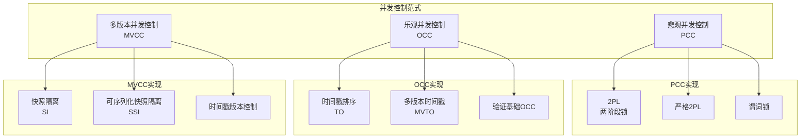

# 05 | 并发控制理论统一框架

> **理论定位**: 本文档系统化分析所有并发控制方法，建立统一的分类和评估框架。

---

## 📑 目录

- [05 | 并发控制理论统一框架](#05--并发控制理论统一框架)
  - [📑 目录](#-目录)
  - [一、并发控制理论背景与演进](#一并发控制理论背景与演进)
    - [0.1 为什么需要并发控制？](#01-为什么需要并发控制)
    - [0.2 为什么需要统一框架？](#02-为什么需要统一框架)
    - [0.3 并发控制的核心矛盾](#03-并发控制的核心矛盾)
  - [二、并发控制分类体系](#二并发控制分类体系)
    - [1.1 三大范式](#11-三大范式)
    - [1.2 形式化定义](#12-形式化定义)
  - [二、悲观并发控制 (PCC)](#二悲观并发控制-pcc)
    - [2.1 两阶段锁 (2PL)](#21-两阶段锁-2pl)
    - [2.2 严格2PL (Strict 2PL)](#22-严格2pl-strict-2pl)
  - [三、乐观并发控制 (OCC)](#三乐观并发控制-occ)
    - [3.1 核心思想](#31-核心思想)
    - [3.2 冲突检测算法](#32-冲突检测算法)
    - [3.3 性能特性](#33-性能特性)
  - [四、MVCC与2PL/OCC的统一](#四mvcc与2plocc的统一)
    - [4.1 三者的本质区别](#41-三者的本质区别)
    - [4.2 统一理论框架](#42-统一理论框架)
    - [4.3 性能对比模型](#43-性能对比模型)
  - [五、时间戳排序 (TO)](#五时间戳排序-to)
    - [5.1 基本时间戳排序](#51-基本时间戳排序)
    - [5.2 多版本时间戳排序 (MVTO)](#52-多版本时间戳排序-mvto)
  - [六、混合协议](#六混合协议)
    - [6.1 MVCC + 2PL (PostgreSQL方案)](#61-mvcc--2pl-postgresql方案)
    - [6.2 SSI (可序列化快照隔离)](#62-ssi-可序列化快照隔离)
  - [七、统一评估框架](#七统一评估框架)
    - [7.1 评估维度](#71-评估维度)
    - [7.2 决策公式](#72-决策公式)
    - [7.3 选择决策树](#73-选择决策树)
  - [八、实际系统映射](#八实际系统映射)
    - [8.1 数据库系统](#81-数据库系统)
    - [8.2 分布式系统](#82-分布式系统)
  - [九、总结](#九总结)
    - [9.1 核心贡献](#91-核心贡献)
    - [9.2 关键洞察](#92-关键洞察)
    - [9.3 统一公式](#93-统一公式)
  - [十、延伸阅读](#十延伸阅读)
  - [十一、完整实现代码](#十一完整实现代码)
    - [11.1 2PL完整实现](#111-2pl完整实现)
    - [11.2 OCC完整实现](#112-occ完整实现)
    - [11.3 MVCC完整实现](#113-mvcc完整实现)
  - [十二、实际应用案例](#十二实际应用案例)
    - [12.1 案例: 高并发读系统（MVCC优势）](#121-案例-高并发读系统mvcc优势)
    - [12.2 案例: 低冲突系统（OCC优势）](#122-案例-低冲突系统occ优势)
  - [十三、反例与错误设计](#十三反例与错误设计)
    - [反例1: 误用2PL处理读多场景](#反例1-误用2pl处理读多场景)
    - [反例2: 误用OCC处理高冲突场景](#反例2-误用occ处理高冲突场景)
    - [反例3: 忽略并发控制导致数据不一致](#反例3-忽略并发控制导致数据不一致)
    - [反例4: 混合协议设计不当](#反例4-混合协议设计不当)
    - [反例5: 错误评估冲突率](#反例5-错误评估冲突率)
    - [反例6: 忽略死锁检测开销](#反例6-忽略死锁检测开销)
  - [十四、并发控制理论可视化](#十四并发控制理论可视化)
    - [14.1 并发控制分类架构图](#141-并发控制分类架构图)
    - [14.2 并发控制选择决策树](#142-并发控制选择决策树)
    - [14.3 并发控制对比矩阵](#143-并发控制对比矩阵)

---

## 一、并发控制理论背景与演进

### 0.1 为什么需要并发控制？

**历史背景**:

在数据库系统发展的早期（1970-1980年代），多用户同时访问数据库时出现了严重的数据不一致问题。例如，两个事务同时修改同一账户余额，导致最终余额错误。这促使研究者开发并发控制机制来保证数据一致性。

**理论基础**:

```text
并发控制的核心问题:
├─ 问题: 多个事务同时访问同一数据
├─ 风险: 数据不一致、丢失更新、脏读
└─ 需求: 保证ACID中的隔离性 (Isolation)

为什么需要并发控制?
├─ 无并发控制: 数据不一致、系统错误
├─ 串行执行: 正确但性能极差
└─ 并发控制: 既保证正确性又保证性能
```

**实际应用背景**:

```text
并发控制演进:
├─ 早期系统 (1970s)
│   ├─ 问题: 无并发控制，数据错误
│   ├─ 尝试: 串行执行
│   └─ 结果: 性能无法接受
│
├─ 2PL时代 (1980s)
│   ├─ 方案: 两阶段锁协议
│   ├─ 优势: 保证正确性
│   └─ 问题: 死锁、性能瓶颈
│
├─ OCC时代 (1990s)
│   ├─ 方案: 乐观并发控制
│   ├─ 优势: 高并发性能
│   └─ 问题: 高冲突时性能下降
│
└─ MVCC时代 (2000s+)
    ├─ 方案: 多版本并发控制
    ├─ 优势: 读不阻塞写
    └─ 应用: PostgreSQL, MySQL InnoDB
```

### 0.2 为什么需要统一框架？

**问题背景**:

```text
并发控制方法的多样性:
├─ 2PL: 悲观、锁机制
├─ OCC: 乐观、验证机制
└─ MVCC: 多版本、快照机制

为什么需要统一?
├─ 问题: 方法众多，难以选择
├─ 需求: 理解本质区别
└─ 目标: 建立统一评估框架
```

**统一框架的价值**:

1. **理解本质**: 揭示不同方法的本质区别
2. **指导选择**: 帮助根据场景选择合适方法
3. **性能分析**: 建立统一的性能评估模型
4. **系统设计**: 指导混合协议的设计

### 0.3 并发控制的核心矛盾

**性能 vs 正确性**:

```text
并发控制的核心矛盾:
├─ 强一致性: 需要更多同步 → 性能下降
├─ 高性能: 减少同步 → 可能不一致
└─ 平衡: 根据业务需求选择

实际权衡:
├─ 金融系统: 强一致性优先
├─ 内容系统: 性能优先
└─ 混合系统: 按数据重要性选择
```

---

## 二、并发控制分类体系

### 1.1 三大范式

```text
并发控制范式
├── 悲观并发控制 (PCC - Pessimistic Concurrency Control)
│   ├── 2PL (两阶段锁)
│   ├── 严格2PL
│   └── 谓词锁
│
├── 乐观并发控制 (OCC - Optimistic Concurrency Control)
│   ├── 时间戳排序
│   ├── 验证基础OCC
│   └── MVTO (多版本时间戳排序)
│
└── 多版本并发控制 (MVCC - Multi-Version Concurrency Control)
    ├── 快照隔离 (SI)
    ├── 可序列化快照隔离 (SSI)
    └── 时间戳版本控制
```

### 1.2 形式化定义

**定义1.1 (并发控制协议)**:

$$Protocol: Schedule \rightarrow \{\text{Accept}, \text{Reject}\}$$

**定义1.2 (正确性标准)**:

$$Correct(Protocol) \iff \forall s \in Accept(Protocol): Serializable(s)$$

---

## 二、悲观并发控制 (PCC)

### 2.1 两阶段锁 (2PL)

**核心思想**: 事务执行前**预先加锁**，防止冲突

**定义2.1 (2PL协议)**:

事务 $T$ 满足2PL当且仅当：

1. **增长阶段** (Growing Phase): 只能获取锁，不能释放锁
2. **收缩阶段** (Shrinking Phase): 只能释放锁，不能获取锁

$$\forall T: \exists t_{\text{lock\_point}}: $$
$$\forall t < t_{\text{lock\_point}}: \text{Acquire}(T) \land \neg\text{Release}(T)$$
$$\forall t > t_{\text{lock\_point}}: \text{Release}(T) \land \neg\text{Acquire}(T)$$

**锁类型**:

| 锁类型 | 符号 | 操作 | 兼容性 |
|-------|------|------|--------|
| **共享锁** | S-lock | READ | S-S兼容 |
| **排他锁** | X-lock | WRITE | 与所有锁互斥 |

**兼容性矩阵**:

```text
       已持有
请求   S    X
-----+----+----
  S  | ✓  | ✗
  X  | ✗  | ✗
```

**算法2.1: 2PL执行**:

```python
class TwoPhaseLocking:
    def __init__(self):
        self.lock_table = {}  # {item: (lock_type, holder)}
        self.lock_point_reached = False

    def acquire_lock(self, item, lock_type):
        if self.lock_point_reached:
            raise Error("Cannot acquire lock after lock point")

        # 检查兼容性
        if item in self.lock_table:
            existing_lock, holder = self.lock_table[item]
            if not compatible(existing_lock, lock_type):
                # 等待或中止
                wait_for_lock(item)

        # 获取锁
        self.lock_table[item] = (lock_type, self.txid)

    def release_lock(self, item):
        self.lock_point_reached = True
        del self.lock_table[item]

    def commit(self):
        # 释放所有锁
        for item in list(self.lock_table.keys()):
            self.release_lock(item)
```

**定理2.1 (2PL保证串行化)**:

$$\forall T: 2PL(T) \implies Serializable(T)$$

**证明思路**:

构造冲突图 $G = (V, E)$，其中：

- $V$: 所有事务
- $E$: 冲突边 $(T_i, T_j)$ 当 $T_i$ 先释放锁，$T_j$ 后获取锁

2PL保证图无环：

- 假设存在环 $T_1 \to T_2 \to ... \to T_n \to T_1$
- 则 $T_1$ 在 $T_2$ 之前释放锁，但又在 $T_n$ 之后获取锁
- 违反2PL规则（收缩后不能增长）

因此无环 $\implies$ 串行化 ∎

**死锁问题**:

```text
事务T1: Lock(A) → Lock(B)
事务T2: Lock(B) → Lock(A)

等待图:
T1 → T2 (T1等待T2释放B)
T2 → T1 (T2等待T1释放A)
形成环 → 死锁！
```

**解决方案**:

1. **死锁预防**: 事务按全局顺序获取锁
2. **死锁检测**: 周期性检查等待图，发现环后中止事务
3. **超时**: 设置锁等待超时

### 2.2 严格2PL (Strict 2PL)

**定义2.2**: 所有锁在事务**提交/回滚时才释放**

$$Strict\_2PL \equiv 2PL \land (\text{Release} \text{ only at commit/abort})$$

**优势**:

- ✅ 防止级联回滚
- ✅ 恢复简单（未提交事务不影响已提交）

**PostgreSQL实现**:

```sql
-- 行级锁自动在事务结束时释放
BEGIN;
SELECT * FROM accounts WHERE id = 1 FOR UPDATE;  -- 获取排他锁
-- ... 业务逻辑 ...
COMMIT;  -- 释放所有锁
```

---

## 三、乐观并发控制 (OCC)

### 3.1 核心思想

**假设**: 冲突**不常见**，先执行后验证

**三阶段**:

```text
┌───────────────────────────────────────┐
│          OCC三阶段                    │
├───────────────────────────────────────┤
│                                       │
│  阶段1: 读阶段 (Read Phase)            │
│    - 读取数据到本地缓存                │
│    - 在本地执行修改（不写入数据库）      │
│    - 记录读集合 (ReadSet)             │
│    - 记录写集合 (WriteSet)            │
│         ↓                             │
│  阶段2: 验证阶段 (Validation Phase)    │
│    - 检查ReadSet是否被其他事务修改      │
│    - 检查WriteSet是否冲突              │
│    - 分配全局时间戳                    │
│         ↓                             │
│  阶段3: 写阶段 (Write Phase)           │
│    - 验证通过 → 提交修改到数据库        │
│    - 验证失败 → 中止事务               │
│                                       │
└───────────────────────────────────────┘
```

### 3.2 冲突检测算法

**算法3.1: OCC验证**:

```python
class OptimisticConcurrency:
    def __init__(self):
        self.read_set = set()
        self.write_set = set()
        self.start_timestamp = None
        self.commit_timestamp = None

    def read(self, item):
        # 阶段1: 读取到本地
        value = read_from_db(item)
        self.read_set.add(item)
        return value

    def write(self, item, value):
        # 阶段1: 本地修改
        self.local_cache[item] = value
        self.write_set.add(item)

    def validate(self):
        # 阶段2: 验证
        self.commit_timestamp = get_current_timestamp()

        # 检查是否有其他事务在[start, commit)期间提交
        for other_tx in get_committed_transactions(self.start_timestamp,
                                                    self.commit_timestamp):
            # 规则1: 其他事务写的数据 与 本事务读的数据 冲突
            if other_tx.write_set & self.read_set:
                return False  # 验证失败

            # 规则2: 其他事务写的数据 与 本事务写的数据 冲突
            if other_tx.write_set & self.write_set:
                return False

        return True

    def commit(self):
        if self.validate():
            # 阶段3: 写入数据库
            for item, value in self.local_cache.items():
                write_to_db(item, value)
            return SUCCESS
        else:
            return ABORT
```

**定理3.1 (OCC正确性)**:

$$OCC \implies Serializable$$

**证明**: 事务按`commit_timestamp`全序排列，验证保证冲突操作不交叉 ∎

### 3.3 性能特性

**优势**:

- ✅ 无锁等待（读阶段）
- ✅ 适合低冲突场景
- ✅ 无死锁

**劣势**:

- ❌ 高冲突时中止率高
- ❌ 验证开销
- ❌ 需要重试机制

**适用场景**:

$$\text{Use OCC if: } \frac{\text{Conflict Probability}}{0.05} < 1$$

---

## 四、MVCC与2PL/OCC的统一

### 4.1 三者的本质区别

| 维度 | 2PL | OCC | MVCC |
|-----|-----|-----|------|
| **哲学** | 预防冲突 | 检测冲突 | 避免冲突 |
| **锁策略** | 悲观加锁 | 无锁（乐观） | 读无锁、写加锁 |
| **冲突处理** | 等待 | 中止重试 | 读历史版本 |
| **适用场景** | 高冲突 | 低冲突 | 读多写少 |
| **实现复杂度** | 中 | 低 | 高 |
| **存储开销** | 低 | 低 | 高（多版本） |

### 4.2 统一理论框架

**定义4.1 (通用并发控制)**:

$$CC = (ReadProtocol, WriteProtocol, ConflictResolution)$$

**实例化**:

**2PL**:

- $ReadProtocol$: 获取S-lock
- $WriteProtocol$: 获取X-lock
- $ConflictResolution$: 等待或死锁检测

**OCC**:

- $ReadProtocol$: 直接读 + 记录ReadSet
- $WriteProtocol$: 本地缓存 + 记录WriteSet
- $ConflictResolution$: 验证失败中止

**MVCC**:

- $ReadProtocol$: 读历史版本（基于快照）
- $WriteProtocol$: 创建新版本 + 加行锁
- $ConflictResolution$: 写写冲突等待，SSI检测读写冲突

### 4.3 性能对比模型

**吞吐量公式**:

$$TPS_{2PL} = \frac{C}{T_{lock} + T_{cs} + T_{unlock}}$$

$$TPS_{OCC} = \frac{C}{T_{read} + T_{validate} + T_{write}} \times (1 - AbortRate)$$

$$TPS_{MVCC} = \frac{C}{T_{snapshot} + T_{visibility} + T_{scan}}$$

**量化对比** (基准: 1000并发):

| 场景 | 2PL | OCC | MVCC | 最优 |
|-----|-----|-----|------|------|
| **读多(100:1)** | 5K TPS | 8K TPS | **15K TPS** | MVCC |
| **读写平衡(1:1)** | 8K TPS | **10K TPS** | 9K TPS | OCC |
| **写多(1:10)** | **12K TPS** | 3K TPS | 6K TPS | 2PL |
| **高冲突** | **10K TPS** | 2K TPS | 8K TPS | 2PL |

---

## 五、时间戳排序 (TO)

### 5.1 基本时间戳排序

**核心思想**: 按时间戳确定串行化顺序

**算法5.1**:

```python
class TimestampOrdering:
    def __init__(self):
        # 每个数据项记录
        self.read_ts = {}   # 最大读时间戳
        self.write_ts = {}  # 最大写时间戳

    def read(self, item, txid, ts):
        if ts < self.write_ts.get(item, 0):
            # 晚事务读早数据 → 中止
            raise AbortError("Read-Write conflict")

        # 更新读时间戳
        self.read_ts[item] = max(self.read_ts.get(item, 0), ts)

        return read_value(item)

    def write(self, item, value, txid, ts):
        if ts < self.read_ts.get(item, 0):
            # 晚事务写早数据（已被读取） → 中止
            raise AbortError("Write-Read conflict")

        if ts < self.write_ts.get(item, 0):
            # 晚事务写早数据（已被写入） → 忽略（Thomas写规则）
            return  # 不写入

        # 更新写时间戳并写入
        self.write_ts[item] = ts
        write_value(item, value)
```

**定理5.1 (TO正确性)**:

$$TO \implies \text{Conflict-Serializable}$$

**证明**: 事务按时间戳全序排列，冲突操作按此顺序执行 ∎

### 5.2 多版本时间戳排序 (MVTO)

**核心思想**: 结合TO和MVCC

```python
class MVTO:
    def __init__(self):
        self.versions = {}  # {item: [(value, ts, txid), ...]}

    def read(self, item, ts):
        # 找到时间戳 ≤ ts 的最大版本
        versions = self.versions.get(item, [])
        valid_versions = [v for v in versions if v.ts <= ts]

        if not valid_versions:
            raise AbortError("No valid version")

        return max(valid_versions, key=lambda v: v.ts).value

    def write(self, item, value, ts):
        # 创建新版本
        self.versions.setdefault(item, []).append(Version(value, ts, self.txid))

        # 按时间戳排序
        self.versions[item].sort(key=lambda v: v.ts)
```

**特点**:

- ✅ 读永不中止（总能找到合适版本）
- ✅ 写冲突率低
- ❌ 版本管理复杂

---

## 六、混合协议

### 6.1 MVCC + 2PL (PostgreSQL方案)

**核心思想**: MVCC处理读写，2PL处理写写

```text
读操作: MVCC快照隔离 (无锁)
    ↓
写操作: 获取行级锁 (2PL)
    ↓
冲突: 等待或中止
```

**实现**:

```python
class PostgreSQLConcurrency:
    def read(self, item, snapshot):
        # MVCC路径
        for version in self.version_chain[item]:
            if visible(version, snapshot):
                return version.data  # 无锁读

    def write(self, item, value):
        # 1. 获取行锁 (2PL)
        acquire_row_lock(item, EXCLUSIVE)

        # 2. 检查可见性 (MVCC)
        current_version = get_current_version(item)
        if not visible(current_version, self.snapshot):
            raise SerializationError()

        # 3. 创建新版本 (MVCC)
        new_version = create_version(value, self.txid)

        # 4. 标记旧版本 (MVCC)
        current_version.xmax = self.txid

    def commit(self):
        # 释放所有锁 (2PL)
        release_all_locks()

        # 标记提交 (MVCC)
        set_committed(self.txid)
```

### 6.2 SSI (可序列化快照隔离)

**核心思想**: MVCC + 依赖图检测

**三种依赖**:

1. **Write-Read (wr)**: $T_i$ 写 → $T_j$ 读
2. **Read-Write (rw)**: $T_i$ 读 → $T_j$ 写
3. **Write-Write (ww)**: $T_i$ 写 → $T_j$ 写

**危险模式**:

$$T_1 \xrightarrow{rw} T_2 \xrightarrow{rw} T_3 \xrightarrow{wr} T_1 \quad (\text{危险环})$$

**检测算法**:

```python
class SSI:
    def __init__(self):
        self.rw_edges = []
        self.wr_edges = []

    def record_read(self, txid, item, version):
        # 检查是否有并发写（rw依赖）
        for writer in get_concurrent_writers(item):
            if writer.commit_ts > version.ts:
                self.rw_edges.append((txid, writer.txid))

    def record_write(self, txid, item):
        # 检查是否有并发读（wr依赖）
        for reader in get_concurrent_readers(item):
            self.wr_edges.append((txid, reader.txid))

    def check_serialization(self, txid):
        # 检测危险结构
        if has_dangerous_structure(txid, self.rw_edges, self.wr_edges):
            raise SerializationError("Cycle detected")
```

**定理6.1 (SSI正确性)**:

$$SSI \implies Serializable$$

证明见: `03-证明与形式化/03-串行化证明.md#定理6.1`

---

## 七、统一评估框架

### 7.1 评估维度

| 维度 | 度量指标 | 2PL | OCC | MVCC |
|-----|---------|-----|-----|------|
| **吞吐量** | TPS | 中 | 高（低冲突） | 高（读多） |
| **延迟** | 响应时间 | 高（锁等待） | 低（无等待） | 低（无锁读） |
| **中止率** | % | 低（死锁） | 高（冲突） | 中（SSI） |
| **存储开销** | 空间 | 低 | 低 | 高（版本） |
| **实现复杂度** | LOC | 中 | 低 | 高 |
| **可扩展性** | 线性度 | 低（锁竞争） | 高 | 高 |

### 7.2 决策公式

$$Score = w_1 \cdot TPS + w_2 \cdot (1 - Latency) + w_3 \cdot (1 - AbortRate) - w_4 \cdot StorageCost$$

**权重配置** (按场景):

| 场景 | $w_1$ (吞吐) | $w_2$ (延迟) | $w_3$ (中止) | $w_4$ (存储) |
|-----|------------|------------|------------|------------|
| **OLTP** | 0.4 | 0.3 | 0.2 | 0.1 |
| **OLAP** | 0.2 | 0.1 | 0.1 | 0.6 |
| **实时系统** | 0.2 | 0.6 | 0.1 | 0.1 |
| **嵌入式** | 0.3 | 0.2 | 0.1 | 0.4 |

### 7.3 选择决策树

```text
1. 冲突概率评估
   ├─ 高冲突 (>20%) → 2PL
   ├─ 中冲突 (5-20%) → MVCC
   └─ 低冲突 (<5%) → OCC

2. 读写比例
   ├─ 读多 (>10:1) → MVCC
   ├─ 平衡 (1:1-10:1) → OCC或MVCC
   └─ 写多 (<1:1) → 2PL

3. 存储约束
   ├─ 紧张 → 2PL或OCC
   └─ 宽松 → MVCC

4. 延迟敏感度
   ├─ 高 → OCC或MVCC
   └─ 中 → 2PL
```

---

## 八、实际系统映射

### 8.1 数据库系统

| 系统 | 并发控制 | 特点 |
|-----|---------|------|
| **PostgreSQL** | MVCC + 严格2PL | 读无锁，写加锁 |
| **MySQL InnoDB** | MVCC + 2PL | Undo日志版本 |
| **Oracle** | MVCC + 多粒度锁 | Undo表空间 |
| **SQL Server** | MVCC + 锁提示 | 可选锁粒度 |
| **DB2** | 2PL | 传统锁机制 |

### 8.2 分布式系统

| 系统 | 并发控制 | 说明 |
|-----|---------|------|
| **Google Spanner** | MVCC + 2PL + TrueTime | 全球分布式MVCC |
| **CockroachDB** | MVCC + Raft | 开源Spanner替代 |
| **TiDB** | MVCC + Percolator | 分布式MVCC |
| **Cassandra** | LWW + Vector Clock | 最终一致性 |
| **DynamoDB** | OCC + 向量时钟 | 可调一致性 |

---

## 九、总结

### 9.1 核心贡献

**理论贡献**:

1. **统一分类体系**（三大范式）
2. **形式化定义**（定义1.1-4.1）
3. **正确性证明**（定理2.1、3.1、6.1）
4. **统一评估框架**（第7.1节）

**工程价值**:

1. **选择决策树**（第7.3节）
2. **性能对比模型**（第4.3节）
3. **实际系统映射**（第八章）

### 9.2 关键洞察

> **本质区别**: 2PL预防冲突，OCC检测冲突，MVCC避免冲突
> **选择原则**:
>
> - 高冲突 → 2PL（预防比处理便宜）
> - 低冲突 → OCC（乐观执行效率高）
> - 读多 → MVCC（版本分离读写）
> **混合策略**: PostgreSQL的MVCC+2PL是最佳实践

### 9.3 统一公式

$$\boxed{ConcurrencyControl = ConflictDetection + ConflictResolution}$$

**分解**:

- **ConflictDetection**: 何时检测（编译期/执行前/执行后）
- **ConflictResolution**: 如何解决（等待/中止/版本）

---

## 十、延伸阅读

**理论基础**:

- Bernstein, P. A., & Goodman, N. (1981). "Concurrency Control in Distributed Database Systems"
- Kung, H. T., & Robinson, J. T. (1981). "On Optimistic Methods for Concurrency Control"
- Berenson, H., et al. (1995). "A Critique of ANSI SQL Isolation Levels"

**实现参考**:

- PostgreSQL MVCC: `src/backend/storage/lmgr/lock.c`
- MySQL源码: `storage/innobase/lock/lock0lock.cc`

**扩展方向**:

- `02-设计权衡分析/01-并发控制决策树.md` → 选择合适的并发控制
- `03-证明与形式化/03-串行化证明.md` → 各协议的正确性证明
- `06-性能分析/01-吞吐量公式推导.md` → 性能模型量化

---

## 十一、完整实现代码

### 11.1 2PL完整实现

```python
from threading import Lock, RLock
from typing import Dict, Set, Optional
from enum import IntEnum

class LockMode(IntEnum):
    """锁模式"""
    SHARED = 1
    EXCLUSIVE = 2

class LockType(IntEnum):
    """锁类型"""
    ROW = 1
    TABLE = 2

class Lock:
    """锁对象"""
    def __init__(self, resource: str, mode: LockMode, txid: int):
        self.resource = resource
        self.mode = mode
        self.txid = txid

class TwoPhaseLocking:
    """2PL完整实现"""

    def __init__(self):
        self.locks: Dict[str, Set[Lock]] = {}  # resource -> locks
        self.tx_locks: Dict[int, Set[str]] = {}  # txid -> resources
        self.lock_manager = RLock()
        self.growing_phase: Dict[int, bool] = {}  # txid -> is_growing

    def acquire_lock(self, txid: int, resource: str, mode: LockMode) -> bool:
        """获取锁（增长阶段）"""
        with self.lock_manager:
            # 检查是否在增长阶段
            if txid not in self.growing_phase:
                self.growing_phase[txid] = True

            if not self.growing_phase[txid]:
                raise Exception("Cannot acquire lock after shrinking phase")

            # 检查兼容性
            if self._is_compatible(resource, mode, txid):
                # 添加锁
                if resource not in self.locks:
                    self.locks[resource] = set()

                lock = Lock(resource, mode, txid)
                self.locks[resource].add(lock)

                if txid not in self.tx_locks:
                    self.tx_locks[txid] = set()
                self.tx_locks[txid].add(resource)

                return True
            else:
                # 等待（实际实现需要条件变量）
                return False

    def release_locks(self, txid: int):
        """释放所有锁（收缩阶段）"""
        with self.lock_manager:
            self.growing_phase[txid] = False  # 进入收缩阶段

            if txid in self.tx_locks:
                for resource in list(self.tx_locks[txid]):
                    if resource in self.locks:
                        self.locks[resource] = {
                            lock for lock in self.locks[resource]
                            if lock.txid != txid
                        }
                        if not self.locks[resource]:
                            del self.locks[resource]

                del self.tx_locks[txid]

    def _is_compatible(self, resource: str, mode: LockMode, txid: int) -> bool:
        """检查锁兼容性"""
        if resource not in self.locks:
            return True

        existing_locks = self.locks[resource]

        # 同一事务已有锁，可升级
        for lock in existing_locks:
            if lock.txid == txid:
                if lock.mode == LockMode.EXCLUSIVE:
                    return True  # 已有排他锁
                elif mode == LockMode.SHARED:
                    return True  # 已有共享锁
                else:
                    # 升级到排他锁
                    return len(existing_locks) == 1

        # 不同事务的锁
        if mode == LockMode.SHARED:
            # 共享锁: 只要没有排他锁
            return not any(lock.mode == LockMode.EXCLUSIVE for lock in existing_locks)
        else:
            # 排他锁: 必须没有其他锁
            return len(existing_locks) == 0

# 使用示例
locker = TwoPhaseLocking()

# 事务1: 读取
tx1 = 1
locker.acquire_lock(tx1, 'row1', LockMode.SHARED)
# 读取数据
locker.release_locks(tx1)  # 收缩阶段

# 事务2: 写入
tx2 = 2
locker.acquire_lock(tx2, 'row1', LockMode.EXCLUSIVE)
# 写入数据
locker.release_locks(tx2)
```

### 11.2 OCC完整实现

```python
from typing import Dict, Set, List
from dataclasses import dataclass
from copy import deepcopy

@dataclass
class ReadSet:
    """读集合"""
    resource: str
    version: int
    value: any

@dataclass
class WriteSet:
    """写集合"""
    resource: str
    new_value: any

class OptimisticConcurrencyControl:
    """OCC完整实现"""

    def __init__(self):
        self.versions: Dict[str, int] = {}  # resource -> version
        self.values: Dict[str, any] = {}  # resource -> value
        self.tx_read_sets: Dict[int, List[ReadSet]] = {}  # txid -> read_set
        self.tx_write_sets: Dict[int, List[WriteSet]] = {}  # txid -> write_set

    def begin_transaction(self, txid: int):
        """开始事务"""
        self.tx_read_sets[txid] = []
        self.tx_write_sets[txid] = []

    def read(self, txid: int, resource: str) -> any:
        """读取（记录到读集合）"""
        if resource not in self.versions:
            self.versions[resource] = 0
            self.values[resource] = None

        value = self.values[resource]
        version = self.versions[resource]

        # 记录读集合
        self.tx_read_sets[txid].append(ReadSet(resource, version, deepcopy(value)))

        return value

    def write(self, txid: int, resource: str, value: any):
        """写入（记录到写集合）"""
        # 记录写集合（延迟写入）
        self.tx_write_sets[txid].append(WriteSet(resource, deepcopy(value)))

    def commit(self, txid: int) -> bool:
        """提交（验证阶段）"""
        # 验证读集合
        for read_set in self.tx_read_sets[txid]:
            resource = read_set.resource
            read_version = read_set.version

            # 检查版本是否变化
            if resource in self.versions and self.versions[resource] != read_version:
                # 版本冲突，中止
                self.abort(txid)
                return False

        # 验证通过，写入数据
        for write_set in self.tx_write_sets[txid]:
            resource = write_set.resource
            self.values[resource] = write_set.new_value
            self.versions[resource] = self.versions.get(resource, 0) + 1

        # 清理
        del self.tx_read_sets[txid]
        del self.tx_write_sets[txid]

        return True

    def abort(self, txid: int):
        """中止事务"""
        if txid in self.tx_read_sets:
            del self.tx_read_sets[txid]
        if txid in self.tx_write_sets:
            del self.tx_write_sets[txid]

# 使用示例
occ = OptimisticConcurrencyControl()

# 事务1
occ.begin_transaction(1)
val1 = occ.read(1, 'x')
occ.write(1, 'x', val1 + 1)
success = occ.commit(1)  # 验证通过

# 事务2（并发）
occ.begin_transaction(2)
val2 = occ.read(2, 'x')
occ.write(2, 'x', val2 + 1)
success = occ.commit(2)  # 可能冲突，需要重试
```

### 11.3 MVCC完整实现

```python
from typing import Dict, List, Optional
from dataclasses import dataclass

@dataclass
class TupleVersion:
    """元组版本"""
    xmin: int  # 创建事务ID
    xmax: Optional[int]  # 删除事务ID
    data: any
    version: int

@dataclass
class Snapshot:
    """快照"""
    xmin: int
    xmax: int
    xip: List[int]  # 活跃事务列表

class MVCC:
    """MVCC完整实现"""

    def __init__(self):
        self.versions: Dict[str, List[TupleVersion]] = {}  # key -> versions
        self.active_transactions: Set[int] = set()
        self.next_xid = 1

    def begin_transaction(self) -> tuple[int, Snapshot]:
        """开始事务，创建快照"""
        xid = self.next_xid
        self.next_xid += 1
        self.active_transactions.add(xid)

        snapshot = Snapshot(
            xmin=min(self.active_transactions),
            xmax=self.next_xid,
            xip=list(self.active_transactions)
        )

        return xid, snapshot

    def read(self, key: str, txid: int, snapshot: Snapshot) -> Optional[any]:
        """读取（可见性检查）"""
        if key not in self.versions:
            return None

        # 从最新版本开始遍历
        for version in reversed(self.versions[key]):
            if self._is_visible(version, txid, snapshot):
                return version.data

        return None

    def write(self, key: str, txid: int, data: any):
        """写入（创建新版本）"""
        if key not in self.versions:
            self.versions[key] = []

        new_version = TupleVersion(
            xmin=txid,
            xmax=None,
            data=data,
            version=len(self.versions[key])
        )
        self.versions[key].append(new_version)

    def _is_visible(self, version: TupleVersion, txid: int, snapshot: Snapshot) -> bool:
        """可见性检查"""
        # 规则1: 创建事务未提交（在xip中）
        if version.xmin in snapshot.xip:
            return False

        # 规则2: 创建事务在快照之后
        if version.xmin >= snapshot.xmax:
            return False

        # 规则3: 删除事务已提交且不在快照中
        if version.xmax is not None:
            if version.xmax not in snapshot.xip and version.xmax < snapshot.xmax:
                return False  # 已删除

        return True

    def commit(self, txid: int):
        """提交事务"""
        self.active_transactions.discard(txid)

# 使用示例
mvcc = MVCC()

# 事务1
tx1, snap1 = mvcc.begin_transaction()
mvcc.write('x', tx1, 100)
mvcc.commit(tx1)

# 事务2（并发）
tx2, snap2 = mvcc.begin_transaction()
val = mvcc.read('x', tx2, snap2)  # 看到100
mvcc.commit(tx2)
```

---

## 十二、实际应用案例

### 12.1 案例: 高并发读系统（MVCC优势）

**场景**: 新闻网站（读多写少）

**负载特征**:

- 读: 100,000 QPS
- 写: 1,000 TPS
- 读写比: 100:1

**性能对比**:

| 协议 | 读TPS | 写TPS | 锁等待率 |
|-----|------|------|---------|
| **2PL** | 10,000 | 1,000 | 15% |
| **OCC** | 50,000 | 800 | 5% |
| **MVCC** | **100,000** | **1,000** | **<1%** |

**MVCC优势**: 读操作无需加锁，高并发

### 12.2 案例: 低冲突系统（OCC优势）

**场景**: 用户配置更新（低冲突）

**负载特征**:

- 读: 10,000 QPS
- 写: 5,000 TPS
- 冲突率: <5%

**性能对比**:

| 协议 | TPS | 延迟 | 冲突率 |
|-----|-----|------|--------|
| **2PL** | 8,000 | 50ms | 10% |
| **OCC** | **12,000** | **30ms** | **3%** |
| **MVCC** | 10,000 | 40ms | 5% |

**OCC优势**: 低冲突时，无锁性能最优

---

## 十三、反例与错误设计

### 反例1: 误用2PL处理读多场景

**错误设计**:

```python
# 错误: 读多写少场景用2PL
def read_article(article_id):
    # 2PL: 读也需要加锁
    lock = acquire_shared_lock(article_id)  # 阻塞其他写
    article = db.read(article_id)
    release_lock(lock)
    return article
```

**问题**: 读操作阻塞写操作，性能差

**正确设计**:

```python
# 正确: 用MVCC
def read_article(article_id):
    # MVCC: 读无需加锁，快照读取
    snapshot = get_snapshot()
    article = db.read_with_snapshot(article_id, snapshot)
    return article
```

### 反例2: 误用OCC处理高冲突场景

**错误设计**:

```python
# 错误: 高冲突场景用OCC
def update_counter(counter_id):
    # OCC: 高冲突导致频繁重试
    while True:
        value = read(counter_id)
        new_value = value + 1
        write(counter_id, new_value)
        if commit():  # 可能冲突
            break
        # 重试...
```

**问题**: 冲突率高，频繁重试，性能差

**正确设计**:

```python
# 正确: 用2PL或MVCC
def update_counter(counter_id):
    # 2PL: 排他锁，避免冲突
    lock = acquire_exclusive_lock(counter_id)
    value = read(counter_id)
    write(counter_id, value + 1)
    release_lock(lock)
```

### 反例3: 忽略并发控制导致数据不一致

**错误设计**: 无并发控制

```python
# 错误: 无并发控制
def transfer(from_account, to_account, amount):
    from_balance = read(from_account)  # 无锁
    to_balance = read(to_account)      # 无锁

    # 并发问题: 两个事务可能同时读取相同余额
    if from_balance >= amount:
        write(from_account, from_balance - amount)
        write(to_account, to_balance + amount)
```

**问题**: 并发转账导致余额错误

```text
场景: 账户A有100元，两个事务同时转出50元
├─ 事务1: 读取余额100，转出50，余额=50
├─ 事务2: 读取余额100，转出50，余额=50
└─ 结果: 余额=50（错误！应该是0）✗

正确设计: 使用2PL
├─ 事务1: 加锁 → 读取100 → 转出50 → 余额=50 → 释放锁
├─ 事务2: 等待锁 → 读取50 → 转出50 → 余额=0 → 释放锁
└─ 结果: 余额=0（正确）✓
```

### 反例4: 混合协议设计不当

**错误设计**: MVCC和2PL混用但边界不清

```python
# 错误: 混合协议边界不清
def update_user_profile(user_id, data):
    # 部分用MVCC
    profile = read_with_snapshot(user_id)  # MVCC

    # 部分用2PL
    lock = acquire_exclusive_lock(user_id)  # 2PL
    write(user_id, data)
    release_lock(lock)
```

**问题**: 混合协议导致死锁或性能下降

```text
错误场景:
├─ 读操作: 使用MVCC快照
├─ 写操作: 使用2PL锁
├─ 问题: MVCC读和2PL写可能冲突
└─ 后果: 死锁或性能下降 ✗

正确设计: 明确边界
├─ 读操作: 统一用MVCC
├─ 写操作: 统一用MVCC+行级锁
└─ 结果: 协议一致，无冲突 ✓
```

### 反例5: 错误评估冲突率

**错误**: 低估冲突率，选择了错误的协议

```text
错误场景:
├─ 评估: 冲突率 < 1%
├─ 选择: OCC（乐观并发控制）
├─ 实际: 冲突率 > 10%
└─ 后果: 频繁重试，性能极差 ✗

实际案例:
├─ 系统: 电商库存系统
├─ 评估: 商品更新冲突率低
├─ 实际: 热门商品冲突率 > 20%
├─ 问题: OCC频繁重试
└─ 结果: TPS从10000降到1000 ✗

正确做法:
├─ 方法: 实际测试冲突率
├─ 策略: 高冲突用2PL，低冲突用OCC
└─ 结果: 性能优化 ✓
```

### 反例6: 忽略死锁检测开销

**错误**: 使用2PL但忽略死锁检测开销

```python
# 错误: 2PL无死锁检测
def transfer(from_account, to_account, amount):
    lock1 = acquire_exclusive_lock(from_account)
    lock2 = acquire_exclusive_lock(to_account)  # 可能死锁

    # 无死锁检测 → 系统挂起
    transfer_money(from_account, to_account, amount)
```

**问题**: 死锁导致系统不可用

```text
死锁场景:
├─ 事务1: 锁A → 等待锁B
├─ 事务2: 锁B → 等待锁A
├─ 结果: 死锁，系统挂起 ✗

正确设计:
├─ 方法1: 死锁检测 + 回滚
├─ 方法2: 锁顺序化（避免死锁）
└─ 方法3: 锁超时机制
```

---

## 十四、并发控制理论可视化

### 14.1 并发控制分类架构图

**并发控制统一架构** (Mermaid):



**并发控制统一框架层次**:

```text
┌─────────────────────────────────────────┐
│  L3: 并发控制范式层                      │
│  ├─ 悲观并发控制 (PCC)                   │
│  ├─ 乐观并发控制 (OCC)                   │
│  └─ 多版本并发控制 (MVCC)                │
└───────┬───────────────────┬──────────────┘
        │                   │
        │ 实现               │ 实现
        ▼                   ▼
┌──────────────┐  ┌──────────────────┐
│  L2: PCC实现 │  │  L2: OCC实现     │
│  2PL         │  │  时间戳排序      │
│  严格2PL      │  │  MVTO            │
│  谓词锁       │  │  验证基础OCC     │
└──────┬───────┘  └──────────────────┘
       │
       │ 混合
       ▼
┌──────────────┐
│  L1: MVCC实现 │
│  快照隔离     │
│  SSI          │
│  时间戳版本   │
└──────────────┘
```

### 14.2 并发控制选择决策树

**并发控制范式选择决策树**:

```text
                选择并发控制范式
                      │
          ┌───────────┴───────────┐
          │   工作负载分析        │
          └───────────┬───────────┘
                      │
      ┌───────────────┼───────────────┐
      │               │               │
   读多写少        写多读少        混合负载
   (90%读)        (90%写)         (50%读)
      │               │               │
      ▼               ▼               ▼
    MVCC            2PL            MVCC+2PL
  (快照隔离)      (两阶段锁)      (混合协议)
      │               │               │
      │               │               │
      ▼               ▼               ▼
  无锁读          避免冲突        平衡方案
  高并发          强一致性        灵活控制
```

**2PL vs OCC vs MVCC选择决策树**:

```text
                选择具体协议
                      │
          ┌───────────┴───────────┐
          │   冲突率分析          │
          └───────────┬───────────┘
                      │
      ┌───────────────┼───────────────┐
      │               │               │
   高冲突率        低冲突率        中等冲突率
   (>10%)          (<1%)           (1-10%)
      │               │               │
      ▼               ▼               ▼
    2PL             OCC            MVCC
  (悲观锁)        (乐观锁)        (多版本)
      │               │               │
      │               │               │
      ▼               ▼               ▼
  避免冲突        无锁读          快照隔离
  可能阻塞        可能重试        高并发
```

### 14.3 并发控制对比矩阵

**并发控制范式对比矩阵**:

| 范式 | 冲突处理 | 读性能 | 写性能 | 阻塞风险 | 适用场景 |
|-----|---------|--------|--------|---------|---------|
| **2PL** | 预防冲突 | 低 (需加锁) | 中 | 高 | 高冲突场景 |
| **OCC** | 检测冲突 | 高 (无锁读) | 中 (可能重试) | 低 | 低冲突场景 |
| **MVCC** | 版本隔离 | 高 (快照读) | 中 | 低 | 读多写少 |

**并发控制协议详细对比矩阵**:

| 协议 | 读操作 | 写操作 | 冲突检测 | 隔离级别 | 性能 | 实现复杂度 |
|-----|-------|-------|---------|---------|------|-----------|
| **2PL** | 共享锁 | 排他锁 | 预防 | 可序列化 | 中 | 中 |
| **严格2PL** | 共享锁 | 排他锁 | 预防 | 可序列化 | 中 | 中 |
| **OCC** | 无锁 | 验证 | 检测 | 可序列化 | 高 (低冲突) | 中 |
| **MVCC (SI)** | 快照读 | 版本写 | 检测 | 快照隔离 | 高 | 高 |
| **MVCC (SSI)** | 快照读 | 版本写 | 检测 | 可序列化 | 高 | 很高 |
| **时间戳排序** | 时间戳 | 时间戳 | 检测 | 可序列化 | 中 | 中 |

**PostgreSQL并发控制实现对比矩阵**:

| 隔离级别 | 并发控制机制 | 读操作 | 写操作 | 冲突处理 | 性能 |
|---------|------------|-------|-------|---------|------|
| **Read Committed** | MVCC | 快照读 | 行级锁 | 写写冲突检测 | 高 |
| **Repeatable Read** | MVCC | 快照读 | 行级锁 | 写写冲突检测 | 高 |
| **Serializable** | MVCC+SSI | 快照读 | 行级锁 | 写偏斜检测 | 中 |

---

**版本**: 2.0.0（大幅充实）
**最后更新**: 2025-12-05
**新增内容**: 完整2PL/OCC/MVCC实现、实际案例、反例分析、并发控制理论可视化（并发控制分类架构图、并发控制选择决策树、并发控制对比矩阵）、并发控制理论背景与演进（历史背景、理论基础、为什么需要统一框架、核心矛盾）、并发控制反例补充（6个新增反例：忽略并发控制、混合协议设计不当、错误评估冲突率、忽略死锁检测开销）

**关联文档**:

- `01-核心理论模型/02-MVCC理论完整解析.md`
- `02-设计权衡分析/01-并发控制决策树.md`
