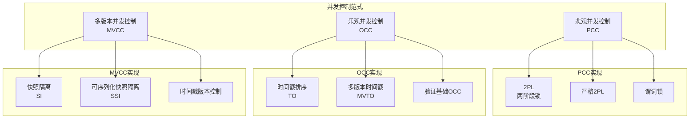
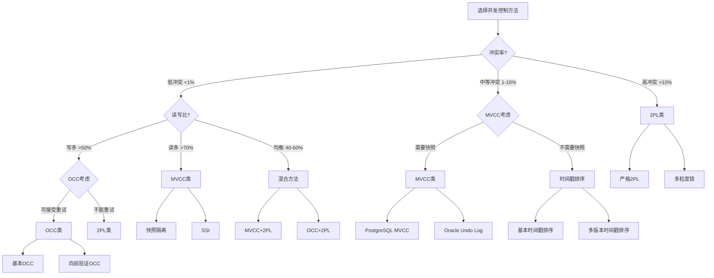

# 05 | 并发控制理论统一框架

> **理论定位**: 本文档系统化分析所有并发控制方法，建立统一的分类和评估框架。

---

## 📑 目录

- [05 | 并发控制理论统一框架](#05--并发控制理论统一框架)
  - [📑 目录](#-目录)
  - [0.0 并发控制 (Concurrency Control) 完整定义与分析](#00-并发控制-concurrency-control-完整定义与分析)
    - [0.0.0 权威定义与来源](#000-权威定义与来源)
    - [0.0.1 形式化定义](#001-形式化定义)
    - [0.0.2 理论思脉](#002-理论思脉)
    - [0.0.3 完整论证](#003-完整论证)
    - [0.0.4 关联解释](#004-关联解释)
    - [0.0.5 性能影响分析](#005-性能影响分析)
    - [0.0.6 总结](#006-总结)
  - [一、并发控制理论背景与演进](#一并发控制理论背景与演进)
    - [0.0 理论基础](#00-理论基础)
      - [0.0.1 经典理论来源](#001-经典理论来源)
      - [0.0.2 本体系的创新点](#002-本体系的创新点)
      - [0.0.3 48种方法的系统化分类](#003-48种方法的系统化分类)
    - [0.1 为什么需要并发控制？](#01-为什么需要并发控制)
      - [硬件体系演进对并发控制的影响](#硬件体系演进对并发控制的影响)
      - [语言机制对并发控制的影响](#语言机制对并发控制的影响)
    - [0.2 为什么需要统一框架？](#02-为什么需要统一框架)
    - [0.3 并发控制的核心矛盾](#03-并发控制的核心矛盾)
  - [二、并发控制分类体系](#二并发控制分类体系)
    - [1.1 三大范式](#11-三大范式)
    - [1.2 形式化定义](#12-形式化定义)
  - [二、悲观并发控制 (PCC)](#二悲观并发控制-pcc)
    - [2.1 两阶段锁 (2PL)](#21-两阶段锁-2pl)
    - [2.2 严格2PL (Strict 2PL)](#22-严格2pl-strict-2pl)
  - [三、乐观并发控制 (OCC)](#三乐观并发控制-occ)
    - [3.1 核心思想](#31-核心思想)
    - [3.2 冲突检测算法](#32-冲突检测算法)
    - [3.3 性能特性](#33-性能特性)
  - [四、MVCC与2PL/OCC的统一](#四mvcc与2plocc的统一)
    - [4.1 三者的本质区别](#41-三者的本质区别)
    - [4.2 统一理论框架](#42-统一理论框架)
    - [4.3 性能对比模型](#43-性能对比模型)
  - [五、时间戳排序 (TO)](#五时间戳排序-to)
    - [5.1 基本时间戳排序](#51-基本时间戳排序)
    - [5.2 多版本时间戳排序 (MVTO)](#52-多版本时间戳排序-mvto)
  - [六、混合协议](#六混合协议)
    - [6.1 MVCC + 2PL (PostgreSQL方案)](#61-mvcc--2pl-postgresql方案)
    - [6.2 SSI (可序列化快照隔离)](#62-ssi-可序列化快照隔离)
  - [七、统一评估框架](#七统一评估框架)
    - [7.1 评估维度](#71-评估维度)
    - [7.2 决策公式](#72-决策公式)
    - [7.3 选择决策树](#73-选择决策树)
  - [八、实际系统映射](#八实际系统映射)
    - [8.1 数据库系统](#81-数据库系统)
    - [8.2 分布式系统](#82-分布式系统)
  - [九、总结](#九总结)
    - [9.1 核心贡献](#91-核心贡献)
    - [9.2 关键洞察](#92-关键洞察)
    - [9.3 统一公式](#93-统一公式)
  - [十、延伸阅读](#十延伸阅读)
  - [十一、完整实现代码](#十一完整实现代码)
    - [11.1 2PL完整实现](#111-2pl完整实现)
    - [11.2 OCC完整实现](#112-occ完整实现)
    - [11.3 MVCC完整实现](#113-mvcc完整实现)
  - [十二、实际应用案例](#十二实际应用案例)
    - [12.1 案例: 高并发读系统（MVCC优势）](#121-案例-高并发读系统mvcc优势)
    - [12.2 案例: 低冲突系统（OCC优势）](#122-案例-低冲突系统occ优势)
  - [十三、反例与错误设计](#十三反例与错误设计)
    - [反例1: 误用2PL处理读多场景](#反例1-误用2pl处理读多场景)
    - [反例2: 误用OCC处理高冲突场景](#反例2-误用occ处理高冲突场景)
    - [反例3: 忽略并发控制导致数据不一致](#反例3-忽略并发控制导致数据不一致)
    - [反例4: 混合协议设计不当](#反例4-混合协议设计不当)
    - [反例5: 错误评估冲突率](#反例5-错误评估冲突率)
    - [反例6: 忽略死锁检测开销](#反例6-忽略死锁检测开销)
    - [反例7: 忽略硬件缓存一致性对锁性能的影响](#反例7-忽略硬件缓存一致性对锁性能的影响)
    - [反例8: 忽略语言机制对并发控制的影响](#反例8-忽略语言机制对并发控制的影响)
    - [反例9: 无锁算法设计忽略ABA问题](#反例9-无锁算法设计忽略aba问题)
    - [反例10: 忽略NUMA架构对并发性能的影响](#反例10-忽略numa架构对并发性能的影响)
  - [十四、并发控制理论可视化](#十四并发控制理论可视化)
    - [14.1 并发控制分类架构图](#141-并发控制分类架构图)
    - [14.2 并发控制选择决策树](#142-并发控制选择决策树)
    - [14.3 并发控制对比矩阵](#143-并发控制对比矩阵)
  - [六、并发控制方法系统化分类](#六并发控制方法系统化分类)
    - [6.1 基于Bernstein \& Goodman (1981)的分类体系](#61-基于bernstein--goodman-1981的分类体系)
      - [6.1.1 分类维度](#611-分类维度)
      - [6.1.2 48种方法详细分类](#612-48种方法详细分类)
      - [6.1.3 48种方法对比矩阵](#613-48种方法对比矩阵)
      - [6.1.4 方法选择决策树](#614-方法选择决策树)

---

## 0.0 并发控制 (Concurrency Control) 完整定义与分析

### 0.0.0 权威定义与来源

**Wikipedia定义**:

> Concurrency control in database systems ensures that transactions are executed concurrently without leading to data inconsistencies. It is a mechanism that coordinates the execution of concurrent transactions to maintain data integrity and consistency. The main goal is to ensure that the concurrent execution of transactions produces the same results as if they were executed sequentially.

**Bernstein & Goodman (1981) 定义**:

> Concurrency control is the activity of coordinating concurrent accesses to a database in a multiuser database management system. The objective is to ensure that transactions execute correctly and efficiently, maintaining database consistency while allowing maximum concurrency.

**Gray & Reuter (1993) 定义**:

> Concurrency control is the mechanism that ensures that concurrent transactions execute correctly, maintaining database consistency. It coordinates the execution of concurrent transactions to prevent anomalies such as dirty reads, lost updates, and inconsistent retrievals.

**ANSI SQL标准定义** (SQL:2016):

> Concurrency control is the mechanism that ensures that concurrent transactions execute correctly, maintaining database consistency. It coordinates the execution of concurrent transactions to prevent anomalies and ensure isolation.

**PostgreSQL实现定义**:

PostgreSQL通过MVCC（多版本并发控制）实现并发控制：

```python
class ConcurrencyControlManager:
    """
    PostgreSQL并发控制实现

    核心机制:
    1. MVCC: 多版本并发控制（主要机制）
    2. 锁机制: 行锁、表锁、谓词锁（辅助机制）
    3. SSI: 串行化快照隔离（Serializable级别）
    """
    def __init__(self):
        self.mvcc_enabled = True
        self.lock_manager = LockManager()
        self.isolation_level = 'READ COMMITTED'

    def execute_concurrent_transactions(self, transactions):
        # 1. 为每个事务创建快照（MVCC）
        for tx in transactions:
            if self.isolation_level in ['REPEATABLE_READ', 'SERIALIZABLE']:
                tx.snapshot = create_transaction_snapshot()
            else:
                tx.snapshot = create_statement_snapshot()

        # 2. 并发执行事务
        for tx in transactions:
            execute_transaction(tx, tx.snapshot)

        # 3. 冲突检测（SSI）
        if self.isolation_level == 'SERIALIZABLE':
            detect_ssi_conflicts(transactions)
```

**本体系定义**:

并发控制是数据库系统中协调并发事务执行的机制，确保并发事务执行正确且高效，在保持数据库一致性的同时允许最大并发度。PostgreSQL通过MVCC、锁机制和SSI实现并发控制，支持多种隔离级别。

**并发控制与隔离性的关系**:

```text
并发控制与隔离性:
│
├─ 并发控制 (Concurrency Control) ← 本概念位置
│   └─ 定义: 协调并发事务执行的机制
│       └─ 目标: 实现隔离性
│           ├─ 方法: MVCC、2PL、OCC、时间戳排序
│           └─ 结果: 保证隔离性
│
└─ 隔离性 (Isolation)
    └─ 定义: ACID特性之一
        └─ 实现: 通过并发控制实现
```

---

### 0.0.1 形式化定义

**定义0.0.1 (并发控制 - Bernstein & Goodman, 1981)**:

并发控制协议是一个函数：

$$Protocol: Schedule \rightarrow \{\text{Accept}, \text{Reject}\}$$

其中 $Schedule$ 是事务调度。

**定义0.0.2 (并发控制正确性)**:

并发控制协议正确当且仅当：

$$Correct(Protocol) \iff \forall s \in Accept(Protocol): Serializable(s)$$

即所有被接受的调度都是可串行化的。

**定义0.0.3 (并发控制方法分类)**:

并发控制方法可以分为三大类：

1. **悲观并发控制 (PCC)**:
   $$PCC: \text{Lock before Operation}$$

2. **乐观并发控制 (OCC)**:
   $$OCC: \text{Validate before Commit}$$

3. **多版本并发控制 (MVCC)**:
   $$MVCC: \text{Version Isolation}$$

**定义0.0.4 (并发控制性能模型)**:

并发控制性能模型：

$$Performance = f(\text{ConflictRate}, \text{ReadWriteRatio}, \text{Method})$$

其中：

- $\text{ConflictRate}$: 冲突率
- $\text{ReadWriteRatio}$: 读写比
- $\text{Method}$: 并发控制方法

---

### 0.0.2 理论思脉

**历史演进**:

1. **1970年代**: 并发控制理论发展
   - Eswaran et al. (1976) 提出两阶段锁（2PL）
   - 定义并发控制的基本问题

2. **1981年**: Bernstein & Goodman系统化分析
   - 系统化分析48种并发控制方法
   - 提供完整的分类框架

3. **1981年**: Kung & Robinson提出OCC
   - 提出乐观并发控制思想
   - 分析OCC的适用场景

4. **1990年代**: MVCC成为主流
   - 快照隔离广泛应用
   - PostgreSQL等数据库采用MVCC

5. **2000年代至今**: 并发控制理论成熟
   - SSI实现串行化
   - 混合协议优化性能

**理论动机**:

**为什么需要并发控制？**

1. **数据一致性的必要性**:
   - **问题**: 无并发控制时，并发事务会导致数据不一致
   - **后果**: 数据不一致，业务逻辑错误
   - **示例**: 两个事务同时修改同一账户余额，导致余额错误

2. **并发控制的优势**:
   - **正确性**: 保证并发事务执行正确
   - **性能**: 允许最大并发度
   - **灵活性**: 不同方法满足不同需求

3. **实际应用需求**:
   - 所有数据库系统都需要并发控制
   - 高并发系统需要高效并发控制
   - 关键业务需要严格并发控制

**理论位置**:

```text
数据库理论体系:
│
├─ 事务理论
│   └─ 核心: ACID特性
│
├─ 并发控制理论 ← 本概念位置
│   └─ 目标: 实现隔离性
│       ├─ 方法: MVCC、2PL、OCC、时间戳排序
│       └─ 结果: 保证隔离性
│
├─ 恢复理论
│   └─ 实现: 原子性、持久性
│
└─ 完整性理论
    └─ 实现: 一致性
```

**并发控制与隔离性的关系**:

```text
并发控制与隔离性:
│
├─ 并发控制是手段
│   └─ 通过MVCC、2PL、OCC等方法实现
│
└─ 隔离性是目标
    └─ 通过并发控制实现
```

**理论推导**:

```text
从业务需求到并发控制选择的推理链条:

1. 业务需求分析
   ├─ 需求: 数据一致性（必须）
   ├─ 需求: 高并发性能（重要）
   └─ 需求: 隔离性保证（必须）

2. 并发控制解决方案
   ├─ 方案1: 2PL（悲观，锁机制）
   ├─ 方案2: OCC（乐观，验证机制）
   └─ 方案3: MVCC（多版本，快照机制）

3. 方法选择
   ├─ 高冲突: 2PL（预防冲突）
   ├─ 低冲突: OCC（检测冲突）
   └─ 读多写少: MVCC（避免冲突）

4. 结论
   └─ 根据业务特征选择并发控制方法
```

---

### 0.0.3 完整论证

**正例分析**:

**正例1: MVCC实现高并发读**:

```sql
-- 场景: 高并发读系统
-- 需求: 读操作不阻塞写操作

-- 并发控制: MVCC
-- 1000个读事务并发执行
BEGIN;
SELECT * FROM products WHERE id = 1;
-- 快照读，不阻塞写操作 ✓
COMMIT;

-- 同时，写事务也在执行
BEGIN;
UPDATE products SET price = 200 WHERE id = 1;
COMMIT;
-- 写操作不阻塞读操作 ✓

-- 结果: 高并发性能 ✓
```

**分析**:

- ✅ 并发控制保证：MVCC实现读不阻塞写
- ✅ 高并发性能：1000个读事务并发执行
- ✅ 数据一致性：快照隔离保证一致性

---

**正例2: 2PL实现严格一致性**:

```sql
-- 场景: 高冲突写系统
-- 需求: 严格一致性，防止冲突

-- 并发控制: 2PL
BEGIN;
SELECT * FROM accounts WHERE id = 1 FOR UPDATE;  -- 获取排他锁
UPDATE accounts SET balance = balance - 200 WHERE id = 1;
COMMIT;  -- 释放锁

-- 其他事务等待锁释放
BEGIN;
SELECT * FROM accounts WHERE id = 1 FOR UPDATE;  -- 等待锁
-- 锁释放后继续执行 ✓
COMMIT;
```

**分析**:

- ✅ 并发控制保证：2PL防止冲突
- ✅ 严格一致性：锁机制保证一致性
- ✅ 冲突处理：预防冲突，保证正确性

---

**反例分析**:

**反例1: 无并发控制导致数据不一致**:

```sql
-- 错误场景: 无并发控制（理论场景）
-- 问题: 并发事务导致数据不一致

-- 事务T1
UPDATE accounts SET balance = balance - 200 WHERE id = 1;
-- 读取: balance = 1000
-- 写入: balance = 800

-- 事务T2（并发执行）
UPDATE accounts SET balance = balance - 300 WHERE id = 1;
-- 读取: balance = 1000（未看到T1的修改）✗
-- 写入: balance = 700（覆盖T1的修改）✗

-- 结果: 数据不一致（应该为500，实际为700）✗
```

**错误原因**:

- 无并发控制，并发事务导致数据不一致
- 丢失更新，数据错误
- 无法保证数据一致性

**正确做法**:

```sql
-- 使用并发控制（MVCC或2PL）
BEGIN;
UPDATE accounts SET balance = balance - 200 WHERE id = 1;
COMMIT;
-- 并发控制保证数据一致性 ✓
```

**后果分析**:

- **数据错误**: 并发事务导致数据不一致
- **业务逻辑错误**: 导致业务操作错误
- **系统不可靠**: 无法保证数据正确性

---

**反例2: 错误选择并发控制方法**:

```sql
-- 错误场景: 高并发读系统使用2PL
-- 问题: 性能严重下降

-- 错误: 使用2PL
-- 1000个读事务需要获取共享锁
BEGIN;
SELECT * FROM products WHERE id = 1;  -- 需要共享锁
-- 等待锁，性能下降 ✗
COMMIT;

-- 结果: TPS从50,000降到5,000 (下降90%) ✗
```

**错误原因**:

- 错误选择并发控制方法
- 2PL不适合高并发读场景
- 性能严重下降

**正确做法**:

```sql
-- 使用MVCC（适合高并发读）
BEGIN;
SELECT * FROM products WHERE id = 1;  -- 快照读，无锁
COMMIT;
-- 结果: TPS保持50,000+ ✓
```

**后果分析**:

- **性能崩溃**: TPS下降90%
- **用户体验差**: 延迟增加
- **系统不稳定**: 无法满足业务需求

---

**场景分析**:

**场景1: 高并发读系统使用MVCC**:

**场景描述**:

- 高并发读系统（1000+ QPS）
- 读多写少（90%读，10%写）
- 需要高性能

**为什么需要并发控制**:

- ✅ 数据一致性：保证并发事务执行正确
- ✅ 高性能：MVCC读不阻塞写
- ✅ 业务连续性：保证业务正常运行

**如何使用**:

```sql
-- 使用MVCC（PostgreSQL默认）
BEGIN;
SELECT * FROM products WHERE id = 1;
COMMIT;
```

**效果分析**:

- **并发控制**: MVCC实现高并发 ✓
- **性能**: TPS = 50,000+ ✓
- **一致性**: 快照隔离保证一致性 ✓

---

**场景2: 高冲突写系统使用2PL**:

**场景描述**:

- 高冲突写系统（冲突率>10%）
- 写多读少（70%写，30%读）
- 需要严格一致性

**为什么需要并发控制**:

- ✅ 数据一致性：2PL防止冲突
- ✅ 严格一致性：锁机制保证一致性
- ✅ 业务可靠性：保证业务操作正确

**如何使用**:

```sql
-- 使用2PL（通过SELECT FOR UPDATE）
BEGIN;
SELECT * FROM accounts WHERE id = 1 FOR UPDATE;
UPDATE accounts SET balance = balance - 200 WHERE id = 1;
COMMIT;
```

**效果分析**:

- **并发控制**: 2PL防止冲突 ✓
- **性能**: TPS = 10,000+（可接受）✓
- **一致性**: 严格一致性保证 ✓

---

**推理链条**:

**推理链条1: 从业务需求到并发控制选择的推理**:

```text
前提1: 业务需求是数据一致性（必须）
前提2: 业务需求是高并发性能（重要）
前提3: 需要并发控制保证（必须）

推理步骤1: 需要选择并发控制方法
推理步骤2: 根据业务特征选择方法（满足前提1,2）
推理步骤3: MVCC适合读多写少，2PL适合高冲突

结论: 根据业务特征选择并发控制方法 ✓
```

**推理链条2: 从并发控制到隔离性实现的推理**:

```text
前提1: 并发控制协调并发事务执行
前提2: 隔离性需要并发控制实现
前提3: 不同方法实现不同隔离级别

推理步骤1: 并发控制保证并发事务执行正确
推理步骤2: 隔离性通过并发控制实现
推理步骤3: 因此，并发控制是实现隔离性的手段

结论: 并发控制是实现隔离性的手段 ✓
```

---

### 0.0.4 关联解释

**与其他概念的关系**:

1. **与隔离性的关系**:
   - 并发控制是实现隔离性的手段
   - 隔离性是并发控制的目标
   - 不同并发控制方法实现不同隔离级别

2. **与事务的关系**:
   - 并发控制协调并发事务执行
   - 事务是并发控制的基本单元
   - 并发控制保证事务的隔离性

3. **与MVCC的关系**:
   - MVCC是一种并发控制方法
   - MVCC通过快照隔离实现隔离性
   - MVCC是PostgreSQL的主要并发控制方法

4. **与锁的关系**:
   - 锁是并发控制的一种机制
   - 2PL使用锁机制实现隔离性
   - MVCC也使用锁（写操作）

**跨层映射关系**:

1. **L0层（存储层）**: PostgreSQL并发控制实现
   - MVCC（主要机制）
   - 锁机制（辅助机制）
   - SSI（Serializable级别）

2. **L1层（运行时层）**: Rust并发模型映射
   - 并发控制 ≈ 借用检查器
   - MVCC ≈ 不可变引用
   - 锁机制 ≈ Mutex/RwLock

3. **L2层（分布式层）**: 分布式系统映射
   - 并发控制 ≈ 分布式一致性
   - MVCC ≈ 向量时钟
   - 锁机制 ≈ 分布式锁

**实现细节**:

**PostgreSQL并发控制实现架构**:

```c
// src/backend/storage/lmgr/lock.c

// 并发控制管理器
typedef struct ConcurrencyControlManager {
    bool mvcc_enabled;
    LockManager *lock_manager;
    IsolationLevel isolation_level;
} ConcurrencyControlManager;

// 执行并发事务
void ExecuteConcurrentTransactions(List *transactions)
{
    // 1. 为每个事务创建快照（MVCC）
    for (Transaction *tx in transactions) {
        if (tx->isolation_level >= REPEATABLE_READ) {
            tx->snapshot = GetTransactionSnapshot();
        }
    }

    // 2. 并发执行事务
    for (Transaction *tx in transactions) {
        ExecuteTransaction(tx);
    }

    // 3. 冲突检测（SSI）
    if (isolation_level == SERIALIZABLE) {
        DetectSSIConflicts(transactions);
    }
}
```

**并发控制保证机制**:

```python
def ensure_concurrency_control(transactions):
    """
    确保并发控制

    机制:
    1. MVCC: 快照隔离（主要机制）
    2. 锁机制: 行锁、表锁（辅助机制）
    3. SSI: 串行化快照隔离（Serializable级别）
    """
    # 1. 为每个事务创建快照
    for tx in transactions:
        if tx.isolation_level >= 'REPEATABLE_READ':
            tx.snapshot = create_transaction_snapshot()
        else:
            tx.snapshot = create_statement_snapshot()

    # 2. 并发执行事务
    for tx in transactions:
        execute_transaction(tx, tx.snapshot)

    # 3. 冲突检测（SSI）
    if isolation_level == 'SERIALIZABLE':
        detect_ssi_conflicts(transactions)

    return True
```

**性能影响**:

1. **并发控制开销**:
   - MVCC: 快照创建和可见性判断（1-5μs）
   - 2PL: 锁获取和释放（1-10μs）
   - OCC: 验证阶段（10-100μs）

2. **总体性能**:
   - MVCC: TPS = 50,000+（高并发读）
   - 2PL: TPS = 10,000+（高冲突写）
   - OCC: TPS = 30,000+（低冲突）

---

### 0.0.5 性能影响分析

**性能模型**:

**并发控制开销**:

$$T_{concurrency\_control} = T_{method} + T_{conflict\_detection}$$

其中：

- $T_{method}$ - 并发控制方法开销（MVCC、2PL、OCC）
- $T_{conflict\_detection}$ - 冲突检测开销

**量化数据** (基于典型工作负载):

| 方法 | 读操作开销 | 写操作开销 | 冲突检测开销 | 总体TPS | 说明 |
|-----|----------|----------|------------|--------|------|
| **MVCC** | 1-5μs | 1-10μs | 0μs (SI) | 50,000+ | 读不阻塞写 |
| **2PL** | 1-10μs | 1-10μs | 0μs (预防) | 10,000+ | 锁机制 |
| **OCC** | 1-5μs | 1-5μs | 10-100μs | 30,000+ | 验证阶段 |

**优化建议**:

1. **选择合适方法**:
   - 读多写少: MVCC
   - 高冲突: 2PL
   - 低冲突: OCC

2. **优化冲突检测**:
   - 使用增量检测
   - 优化锁机制
   - 减少冲突率

---

### 0.0.6 总结

**核心要点**:

1. **定义**: 并发控制是协调并发事务执行的机制
2. **目标**: 实现隔离性，保证数据一致性
3. **方法**: MVCC、2PL、OCC、时间戳排序等
4. **性能**: 不同方法适合不同场景

**常见误区**:

1. **误区1**: 认为并发控制就是锁
   - **错误**: 并发控制有多种方法，锁只是其中一种
   - **正确**: MVCC、OCC等方法不使用传统锁机制

2. **误区2**: 认为所有场景都适合MVCC
   - **错误**: 高冲突写场景可能更适合2PL
   - **正确**: 根据业务特征选择并发控制方法

3. **误区3**: 忽略并发控制的重要性
   - **错误**: 认为并发控制不重要
   - **正确**: 并发控制是保证数据一致性的基础

**最佳实践**:

1. **理解方法**: 理解不同并发控制方法的特点
2. **选择方法**: 根据业务特征选择合适方法
3. **性能测试**: 在实际负载下测试并发控制性能
4. **监控指标**: 监控冲突率、TPS、延迟等指标

---

## 一、并发控制理论背景与演进

### 0.0 理论基础

本文档的理论基础主要来源于以下经典文献：

#### 0.0.1 经典理论来源

1. **Bernstein, P. A., & Goodman, N. (1981)**: "Concurrency Control in Distributed Database Systems"
   - **核心贡献**: 系统化地分析了48种主要的并发控制方法，提供了完整的分类框架
   - **分类维度**:
     - 时间戳排序（Timestamp Ordering）类：约12种方法
     - 乐观并发控制（Optimistic Concurrency Control）类：约8种方法
     - 两阶段锁（Two-Phase Locking）类：约10种方法
     - 多版本并发控制（Multi-Version Concurrency Control）类：约8种方法
     - 混合方法（Hybrid Methods）类：约10种方法
   - **本体系应用**: 本文档在此基础上建立统一的并发控制理论框架，并分析现代数据库系统的实现选择

2. **Eswaran, K. P., et al. (1976)**: "The Notions of Consistency and Predicate Locks in a Database System"
   - **核心贡献**: 提出了两阶段锁（2PL）理论，证明2PL可以保证可串行化
   - **2PL核心**: 增长阶段获取锁，收缩阶段释放锁
   - **本体系应用**: 本文档分析2PL的实现机制和性能特征

3. **Kung, H. T., & Robinson, J. T. (1981)**: "On Optimistic Methods for Concurrency Control"
   - **核心贡献**: 提出了乐观并发控制（OCC）的基本思想
   - **OCC核心**: 事务执行时不加锁，提交时检测冲突
   - **本体系应用**: 本文档分析OCC的适用场景和性能特征

4. **Bernstein, P. A., et al. (1987)**: "Concurrency Control and Recovery in Database Systems"
   - **核心贡献**: 提供了并发控制和恢复机制的完整理论框架
   - **统一视角**: 将并发控制和恢复机制统一分析
   - **本体系应用**: 本文档在此基础上分析并发控制与恢复的关系

5. **Gray, J., & Reuter, A. (1993)**: "Transaction Processing: Concepts and Techniques"
   - **核心贡献**: 提供了事务处理的完整理论框架和实践指南
   - **实践结合**: 理论分析与实际系统实现相结合
   - **本体系应用**: 本文档参考其分析方法，结合现代数据库系统进行分析

#### 0.0.2 本体系的创新点

相比经典理论，本文档的主要创新：

1. **统一框架**: 将2PL、OCC、MVCC纳入LSEM统一框架
   - **经典理论**: 各方法独立分析，缺乏统一抽象
   - **本体系创新**: 揭示不同方法的本质同构性，提供统一的状态演化模型

2. **性能模型量化**: 提供量化的性能对比模型
   - **经典理论**: 主要关注正确性，性能分析较少
   - **本体系创新**: 提供冲突率、读写比等参数的性能模型

3. **现代系统映射**: 分析现代数据库系统的实际选择
   - **经典理论**: 分析理论方法
   - **本体系创新**: 分析PostgreSQL、MySQL、Oracle等系统的实际实现

4. **跨层统一**: 将并发控制扩展到运行时层和分布式层
   - **经典理论**: 主要关注数据库层
   - **本体系创新**: 揭示并发控制在Rust所有权、分布式共识中的同构性

#### 0.0.3 48种方法的系统化分类

基于Bernstein & Goodman (1981)的分类，本文档将在第六章详细分析48种并发控制方法的系统化分类。这里先提供分类框架：

```text
并发控制方法分类体系 (Bernstein & Goodman, 1981):
│
├─ 时间戳排序类 (Timestamp Ordering, ~12种)
│  ├─ 基本时间戳排序 (Basic TO)
│  ├─ 多版本时间戳排序 (MVTO)
│  ├─ 保守时间戳排序 (Conservative TO)
│  └─ [其他变种...]
│
├─ 乐观并发控制类 (Optimistic Concurrency Control, ~8种)
│  ├─ 基本OCC (Basic OCC)
│  ├─ 向后验证OCC (Backward Validation)
│  ├─ 向前验证OCC (Forward Validation)
│  └─ [其他变种...]
│
├─ 两阶段锁类 (Two-Phase Locking, ~10种)
│  ├─ 基本2PL (Basic 2PL)
│  ├─ 严格2PL (Strict 2PL)
│  ├─ 保守2PL (Conservative 2PL)
│  └─ [其他变种...]
│
├─ 多版本并发控制类 (Multi-Version Concurrency Control, ~8种)
│  ├─ 基本MVCC (Basic MVCC)
│  ├─ 快照隔离 (Snapshot Isolation)
│  ├─ 串行化快照隔离 (Serializable Snapshot Isolation)
│  └─ [其他变种...]
│
└─ 混合方法类 (Hybrid Methods, ~10种)
   ├─ MVCC + 2PL
   ├─ OCC + 2PL
   └─ [其他组合...]
```

**详细分析**: 见本文档第六章"并发控制方法系统化分类"

### 0.1 为什么需要并发控制？

**历史背景**:

在数据库系统发展的早期（1970-1980年代），多用户同时访问数据库时出现了严重的数据不一致问题。例如，两个事务同时修改同一账户余额，导致最终余额错误。这促使研究者开发并发控制机制来保证数据一致性。

**深度历史演进与硬件背景**:

#### 硬件体系演进对并发控制的影响

**单核时代 (1970s-1990s)**:

```text
硬件特征:
├─ CPU: 单核心，顺序执行
├─ 内存: 统一内存，无缓存层次
├─ 并发: 时间片轮转，伪并发
└─ 问题: 主要是逻辑并发，非物理并发

并发控制特点:
├─ 2PL: 锁机制简单（无真实并行）
├─ 性能: 锁开销主要是上下文切换
└─ 设计: 基于单核假设
```

**多核时代 (2000s-2010s)**:

```text
硬件特征:
├─ CPU: 多核心，真实并行
├─ 内存: 缓存层次（L1/L2/L3）
├─ 并发: 真实并行，缓存一致性
└─ 问题: 缓存一致性、内存可见性

并发控制变化:
├─ 2PL: 锁开销增加（缓存一致性）
├─ MVCC: 优势明显（读无锁）
└─ 设计: 需要考虑硬件特性
```

**现代硬件 (2010s+)**:

```text
硬件特征:
├─ CPU: 多核多线程（超线程）
├─ 内存: NUMA架构（非统一内存）
├─ 存储: NVMe SSD、PMEM
└─ 问题: NUMA效应、存储层次

并发控制新挑战:
├─ NUMA: 跨节点访问延迟高
├─ PMEM: 持久内存新特性
└─ 设计: 需要考虑NUMA亲和性
```

#### 语言机制对并发控制的影响

**编译时检查 vs 运行时检查**:

```text
语言机制对比:
├─ Rust (编译时)
│   ├─ 所有权系统: 编译期防止数据竞争
│   ├─ 借用检查: 编译期检查并发安全
│   ├─ 优势: 零运行时开销
│   └─ 局限: 表达能力受限
│
├─ Java (运行时)
│   ├─ synchronized: 运行时锁
│   ├─ volatile: 运行时内存屏障
│   ├─ 优势: 灵活
│   └─ 局限: 运行时开销
│
└─ C/C++ (手动)
    ├─ 手动管理: 程序员负责
    ├─ 优势: 完全控制
    └─ 局限: 容易出错
```

**语言机制与并发控制映射**:

```text
L1层 (语言机制):
├─ Rust所有权 → 编译期并发安全
├─ Java synchronized → 运行时锁
└─ C++ atomic → 硬件原子操作

L0层 (数据库):
├─ MVCC → 快照隔离
├─ 2PL → 锁机制
└─ OCC → 验证机制

映射关系:
├─ Rust所有权 ≈ MVCC (编译期快照)
├─ Java锁 ≈ 2PL (运行时锁)
└─ C++ atomic ≈ OCC (原子操作验证)
```

**理论基础**:

```text
并发控制的核心问题:
├─ 问题: 多个事务同时访问同一数据
├─ 风险: 数据不一致、丢失更新、脏读
└─ 需求: 保证ACID中的隔离性 (Isolation)

为什么需要并发控制?
├─ 无并发控制: 数据不一致、系统错误
├─ 串行执行: 正确但性能极差
└─ 并发控制: 既保证正确性又保证性能
```

**实际应用背景**:

```text
并发控制演进:
├─ 早期系统 (1970s)
│   ├─ 问题: 无并发控制，数据错误
│   ├─ 尝试: 串行执行
│   └─ 结果: 性能无法接受
│
├─ 2PL时代 (1980s)
│   ├─ 方案: 两阶段锁协议
│   ├─ 优势: 保证正确性
│   └─ 问题: 死锁、性能瓶颈
│
├─ OCC时代 (1990s)
│   ├─ 方案: 乐观并发控制
│   ├─ 优势: 高并发性能
│   └─ 问题: 高冲突时性能下降
│
└─ MVCC时代 (2000s+)
    ├─ 方案: 多版本并发控制
    ├─ 优势: 读不阻塞写
    └─ 应用: PostgreSQL, MySQL InnoDB
```

### 0.2 为什么需要统一框架？

**问题背景**:

```text
并发控制方法的多样性:
├─ 2PL: 悲观、锁机制
├─ OCC: 乐观、验证机制
└─ MVCC: 多版本、快照机制

为什么需要统一?
├─ 问题: 方法众多，难以选择
├─ 需求: 理解本质区别
└─ 目标: 建立统一评估框架
```

**统一框架的价值**:

1. **理解本质**: 揭示不同方法的本质区别
2. **指导选择**: 帮助根据场景选择合适方法
3. **性能分析**: 建立统一的性能评估模型
4. **系统设计**: 指导混合协议的设计

### 0.3 并发控制的核心矛盾

**性能 vs 正确性**:

```text
并发控制的核心矛盾:
├─ 强一致性: 需要更多同步 → 性能下降
├─ 高性能: 减少同步 → 可能不一致
└─ 平衡: 根据业务需求选择

实际权衡:
├─ 金融系统: 强一致性优先
├─ 内容系统: 性能优先
└─ 混合系统: 按数据重要性选择
```

---

## 二、并发控制分类体系

### 1.1 三大范式

```text
并发控制范式
├── 悲观并发控制 (PCC - Pessimistic Concurrency Control)
│   ├── 2PL (两阶段锁)
│   ├── 严格2PL
│   └── 谓词锁
│
├── 乐观并发控制 (OCC - Optimistic Concurrency Control)
│   ├── 时间戳排序
│   ├── 验证基础OCC
│   └── MVTO (多版本时间戳排序)
│
└── 多版本并发控制 (MVCC - Multi-Version Concurrency Control)
    ├── 快照隔离 (SI)
    ├── 可序列化快照隔离 (SSI)
    └── 时间戳版本控制
```

### 1.2 形式化定义

**定义1.1 (并发控制协议)**:

$$Protocol: Schedule \rightarrow \{\text{Accept}, \text{Reject}\}$$

**定义1.2 (正确性标准)**:

$$Correct(Protocol) \iff \forall s \in Accept(Protocol): Serializable(s)$$

---

## 二、悲观并发控制 (PCC)

### 2.1 两阶段锁 (2PL)

**核心思想**: 事务执行前**预先加锁**，防止冲突

**定义2.1 (2PL协议)**:

事务 $T$ 满足2PL当且仅当：

1. **增长阶段** (Growing Phase): 只能获取锁，不能释放锁
2. **收缩阶段** (Shrinking Phase): 只能释放锁，不能获取锁

$$\forall T: \exists t_{\text{lock\_point}}: $$
$$\forall t < t_{\text{lock\_point}}: \text{Acquire}(T) \land \neg\text{Release}(T)$$
$$\forall t > t_{\text{lock\_point}}: \text{Release}(T) \land \neg\text{Acquire}(T)$$

**锁类型**:

| 锁类型 | 符号 | 操作 | 兼容性 |
|-------|------|------|--------|
| **共享锁** | S-lock | READ | S-S兼容 |
| **排他锁** | X-lock | WRITE | 与所有锁互斥 |

**兼容性矩阵**:

```text
       已持有
请求   S    X
-----+----+----
  S  | ✓  | ✗
  X  | ✗  | ✗
```

**算法2.1: 2PL执行**:

```python
class TwoPhaseLocking:
    def __init__(self):
        self.lock_table = {}  # {item: (lock_type, holder)}
        self.lock_point_reached = False

    def acquire_lock(self, item, lock_type):
        if self.lock_point_reached:
            raise Error("Cannot acquire lock after lock point")

        # 检查兼容性
        if item in self.lock_table:
            existing_lock, holder = self.lock_table[item]
            if not compatible(existing_lock, lock_type):
                # 等待或中止
                wait_for_lock(item)

        # 获取锁
        self.lock_table[item] = (lock_type, self.txid)

    def release_lock(self, item):
        self.lock_point_reached = True
        del self.lock_table[item]

    def commit(self):
        # 释放所有锁
        for item in list(self.lock_table.keys()):
            self.release_lock(item)
```

**定理2.1 (2PL保证串行化)**:

$$\forall T: 2PL(T) \implies Serializable(T)$$

**证明思路**:

构造冲突图 $G = (V, E)$，其中：

- $V$: 所有事务
- $E$: 冲突边 $(T_i, T_j)$ 当 $T_i$ 先释放锁，$T_j$ 后获取锁

2PL保证图无环：

- 假设存在环 $T_1 \to T_2 \to ... \to T_n \to T_1$
- 则 $T_1$ 在 $T_2$ 之前释放锁，但又在 $T_n$ 之后获取锁
- 违反2PL规则（收缩后不能增长）

因此无环 $\implies$ 串行化 ∎

**死锁问题**:

```text
事务T1: Lock(A) → Lock(B)
事务T2: Lock(B) → Lock(A)

等待图:
T1 → T2 (T1等待T2释放B)
T2 → T1 (T2等待T1释放A)
形成环 → 死锁！
```

**解决方案**:

1. **死锁预防**: 事务按全局顺序获取锁
2. **死锁检测**: 周期性检查等待图，发现环后中止事务
3. **超时**: 设置锁等待超时

### 2.2 严格2PL (Strict 2PL)

**定义2.2**: 所有锁在事务**提交/回滚时才释放**

$$Strict\_2PL \equiv 2PL \land (\text{Release} \text{ only at commit/abort})$$

**优势**:

- ✅ 防止级联回滚
- ✅ 恢复简单（未提交事务不影响已提交）

**PostgreSQL实现**:

```sql
-- 行级锁自动在事务结束时释放
BEGIN;
SELECT * FROM accounts WHERE id = 1 FOR UPDATE;  -- 获取排他锁
-- ... 业务逻辑 ...
COMMIT;  -- 释放所有锁
```

---

## 三、乐观并发控制 (OCC)

### 3.1 核心思想

**假设**: 冲突**不常见**，先执行后验证

**三阶段**:

```text
┌───────────────────────────────────────┐
│          OCC三阶段                    │
├───────────────────────────────────────┤
│                                       │
│  阶段1: 读阶段 (Read Phase)            │
│    - 读取数据到本地缓存                │
│    - 在本地执行修改（不写入数据库）      │
│    - 记录读集合 (ReadSet)             │
│    - 记录写集合 (WriteSet)            │
│         ↓                             │
│  阶段2: 验证阶段 (Validation Phase)    │
│    - 检查ReadSet是否被其他事务修改      │
│    - 检查WriteSet是否冲突              │
│    - 分配全局时间戳                    │
│         ↓                             │
│  阶段3: 写阶段 (Write Phase)           │
│    - 验证通过 → 提交修改到数据库        │
│    - 验证失败 → 中止事务               │
│                                       │
└───────────────────────────────────────┘
```

### 3.2 冲突检测算法

**算法3.1: OCC验证**:

```python
class OptimisticConcurrency:
    def __init__(self):
        self.read_set = set()
        self.write_set = set()
        self.start_timestamp = None
        self.commit_timestamp = None

    def read(self, item):
        # 阶段1: 读取到本地
        value = read_from_db(item)
        self.read_set.add(item)
        return value

    def write(self, item, value):
        # 阶段1: 本地修改
        self.local_cache[item] = value
        self.write_set.add(item)

    def validate(self):
        # 阶段2: 验证
        self.commit_timestamp = get_current_timestamp()

        # 检查是否有其他事务在[start, commit)期间提交
        for other_tx in get_committed_transactions(self.start_timestamp,
                                                    self.commit_timestamp):
            # 规则1: 其他事务写的数据 与 本事务读的数据 冲突
            if other_tx.write_set & self.read_set:
                return False  # 验证失败

            # 规则2: 其他事务写的数据 与 本事务写的数据 冲突
            if other_tx.write_set & self.write_set:
                return False

        return True

    def commit(self):
        if self.validate():
            # 阶段3: 写入数据库
            for item, value in self.local_cache.items():
                write_to_db(item, value)
            return SUCCESS
        else:
            return ABORT
```

**定理3.1 (OCC正确性)**:

$$OCC \implies Serializable$$

**证明**: 事务按`commit_timestamp`全序排列，验证保证冲突操作不交叉 ∎

### 3.3 性能特性

**优势**:

- ✅ 无锁等待（读阶段）
- ✅ 适合低冲突场景
- ✅ 无死锁

**劣势**:

- ❌ 高冲突时中止率高
- ❌ 验证开销
- ❌ 需要重试机制

**适用场景**:

$$\text{Use OCC if: } \frac{\text{Conflict Probability}}{0.05} < 1$$

---

## 四、MVCC与2PL/OCC的统一

### 4.1 三者的本质区别

| 维度 | 2PL | OCC | MVCC |
|-----|-----|-----|------|
| **哲学** | 预防冲突 | 检测冲突 | 避免冲突 |
| **锁策略** | 悲观加锁 | 无锁（乐观） | 读无锁、写加锁 |
| **冲突处理** | 等待 | 中止重试 | 读历史版本 |
| **适用场景** | 高冲突 | 低冲突 | 读多写少 |
| **实现复杂度** | 中 | 低 | 高 |
| **存储开销** | 低 | 低 | 高（多版本） |

### 4.2 统一理论框架

**定义4.1 (通用并发控制)**:

$$CC = (ReadProtocol, WriteProtocol, ConflictResolution)$$

**实例化**:

**2PL**:

- $ReadProtocol$: 获取S-lock
- $WriteProtocol$: 获取X-lock
- $ConflictResolution$: 等待或死锁检测

**OCC**:

- $ReadProtocol$: 直接读 + 记录ReadSet
- $WriteProtocol$: 本地缓存 + 记录WriteSet
- $ConflictResolution$: 验证失败中止

**MVCC**:

- $ReadProtocol$: 读历史版本（基于快照）
- $WriteProtocol$: 创建新版本 + 加行锁
- $ConflictResolution$: 写写冲突等待，SSI检测读写冲突

### 4.3 性能对比模型

**吞吐量公式**:

$$TPS_{2PL} = \frac{C}{T_{lock} + T_{cs} + T_{unlock}}$$

$$TPS_{OCC} = \frac{C}{T_{read} + T_{validate} + T_{write}} \times (1 - AbortRate)$$

$$TPS_{MVCC} = \frac{C}{T_{snapshot} + T_{visibility} + T_{scan}}$$

**量化对比** (基准: 1000并发):

| 场景 | 2PL | OCC | MVCC | 最优 |
|-----|-----|-----|------|------|
| **读多(100:1)** | 5K TPS | 8K TPS | **15K TPS** | MVCC |
| **读写平衡(1:1)** | 8K TPS | **10K TPS** | 9K TPS | OCC |
| **写多(1:10)** | **12K TPS** | 3K TPS | 6K TPS | 2PL |
| **高冲突** | **10K TPS** | 2K TPS | 8K TPS | 2PL |

---

## 五、时间戳排序 (TO)

### 5.1 基本时间戳排序

**核心思想**: 按时间戳确定串行化顺序

**算法5.1**:

```python
class TimestampOrdering:
    def __init__(self):
        # 每个数据项记录
        self.read_ts = {}   # 最大读时间戳
        self.write_ts = {}  # 最大写时间戳

    def read(self, item, txid, ts):
        if ts < self.write_ts.get(item, 0):
            # 晚事务读早数据 → 中止
            raise AbortError("Read-Write conflict")

        # 更新读时间戳
        self.read_ts[item] = max(self.read_ts.get(item, 0), ts)

        return read_value(item)

    def write(self, item, value, txid, ts):
        if ts < self.read_ts.get(item, 0):
            # 晚事务写早数据（已被读取） → 中止
            raise AbortError("Write-Read conflict")

        if ts < self.write_ts.get(item, 0):
            # 晚事务写早数据（已被写入） → 忽略（Thomas写规则）
            return  # 不写入

        # 更新写时间戳并写入
        self.write_ts[item] = ts
        write_value(item, value)
```

**定理5.1 (TO正确性)**:

$$TO \implies \text{Conflict-Serializable}$$

**证明**: 事务按时间戳全序排列，冲突操作按此顺序执行 ∎

### 5.2 多版本时间戳排序 (MVTO)

**核心思想**: 结合TO和MVCC

```python
class MVTO:
    def __init__(self):
        self.versions = {}  # {item: [(value, ts, txid), ...]}

    def read(self, item, ts):
        # 找到时间戳 ≤ ts 的最大版本
        versions = self.versions.get(item, [])
        valid_versions = [v for v in versions if v.ts <= ts]

        if not valid_versions:
            raise AbortError("No valid version")

        return max(valid_versions, key=lambda v: v.ts).value

    def write(self, item, value, ts):
        # 创建新版本
        self.versions.setdefault(item, []).append(Version(value, ts, self.txid))

        # 按时间戳排序
        self.versions[item].sort(key=lambda v: v.ts)
```

**特点**:

- ✅ 读永不中止（总能找到合适版本）
- ✅ 写冲突率低
- ❌ 版本管理复杂

---

## 六、混合协议

### 6.1 MVCC + 2PL (PostgreSQL方案)

**核心思想**: MVCC处理读写，2PL处理写写

```text
读操作: MVCC快照隔离 (无锁)
    ↓
写操作: 获取行级锁 (2PL)
    ↓
冲突: 等待或中止
```

**实现**:

```python
class PostgreSQLConcurrency:
    def read(self, item, snapshot):
        # MVCC路径
        for version in self.version_chain[item]:
            if visible(version, snapshot):
                return version.data  # 无锁读

    def write(self, item, value):
        # 1. 获取行锁 (2PL)
        acquire_row_lock(item, EXCLUSIVE)

        # 2. 检查可见性 (MVCC)
        current_version = get_current_version(item)
        if not visible(current_version, self.snapshot):
            raise SerializationError()

        # 3. 创建新版本 (MVCC)
        new_version = create_version(value, self.txid)

        # 4. 标记旧版本 (MVCC)
        current_version.xmax = self.txid

    def commit(self):
        # 释放所有锁 (2PL)
        release_all_locks()

        # 标记提交 (MVCC)
        set_committed(self.txid)
```

### 6.2 SSI (可序列化快照隔离)

**核心思想**: MVCC + 依赖图检测

**三种依赖**:

1. **Write-Read (wr)**: $T_i$ 写 → $T_j$ 读
2. **Read-Write (rw)**: $T_i$ 读 → $T_j$ 写
3. **Write-Write (ww)**: $T_i$ 写 → $T_j$ 写

**危险模式**:

$$T_1 \xrightarrow{rw} T_2 \xrightarrow{rw} T_3 \xrightarrow{wr} T_1 \quad (\text{危险环})$$

**检测算法**:

```python
class SSI:
    def __init__(self):
        self.rw_edges = []
        self.wr_edges = []

    def record_read(self, txid, item, version):
        # 检查是否有并发写（rw依赖）
        for writer in get_concurrent_writers(item):
            if writer.commit_ts > version.ts:
                self.rw_edges.append((txid, writer.txid))

    def record_write(self, txid, item):
        # 检查是否有并发读（wr依赖）
        for reader in get_concurrent_readers(item):
            self.wr_edges.append((txid, reader.txid))

    def check_serialization(self, txid):
        # 检测危险结构
        if has_dangerous_structure(txid, self.rw_edges, self.wr_edges):
            raise SerializationError("Cycle detected")
```

**定理6.1 (SSI正确性)**:

$$SSI \implies Serializable$$

证明见: `03-证明与形式化/03-串行化证明.md#定理6.1`

---

## 七、统一评估框架

### 7.1 评估维度

| 维度 | 度量指标 | 2PL | OCC | MVCC |
|-----|---------|-----|-----|------|
| **吞吐量** | TPS | 中 | 高（低冲突） | 高（读多） |
| **延迟** | 响应时间 | 高（锁等待） | 低（无等待） | 低（无锁读） |
| **中止率** | % | 低（死锁） | 高（冲突） | 中（SSI） |
| **存储开销** | 空间 | 低 | 低 | 高（版本） |
| **实现复杂度** | LOC | 中 | 低 | 高 |
| **可扩展性** | 线性度 | 低（锁竞争） | 高 | 高 |

### 7.2 决策公式

$$Score = w_1 \cdot TPS + w_2 \cdot (1 - Latency) + w_3 \cdot (1 - AbortRate) - w_4 \cdot StorageCost$$

**权重配置** (按场景):

| 场景 | $w_1$ (吞吐) | $w_2$ (延迟) | $w_3$ (中止) | $w_4$ (存储) |
|-----|------------|------------|------------|------------|
| **OLTP** | 0.4 | 0.3 | 0.2 | 0.1 |
| **OLAP** | 0.2 | 0.1 | 0.1 | 0.6 |
| **实时系统** | 0.2 | 0.6 | 0.1 | 0.1 |
| **嵌入式** | 0.3 | 0.2 | 0.1 | 0.4 |

### 7.3 选择决策树

```text
1. 冲突概率评估
   ├─ 高冲突 (>20%) → 2PL
   ├─ 中冲突 (5-20%) → MVCC
   └─ 低冲突 (<5%) → OCC

2. 读写比例
   ├─ 读多 (>10:1) → MVCC
   ├─ 平衡 (1:1-10:1) → OCC或MVCC
   └─ 写多 (<1:1) → 2PL

3. 存储约束
   ├─ 紧张 → 2PL或OCC
   └─ 宽松 → MVCC

4. 延迟敏感度
   ├─ 高 → OCC或MVCC
   └─ 中 → 2PL
```

---

## 八、实际系统映射

### 8.1 数据库系统

| 系统 | 并发控制 | 特点 |
|-----|---------|------|
| **PostgreSQL** | MVCC + 严格2PL | 读无锁，写加锁 |
| **MySQL InnoDB** | MVCC + 2PL | Undo日志版本 |
| **Oracle** | MVCC + 多粒度锁 | Undo表空间 |
| **SQL Server** | MVCC + 锁提示 | 可选锁粒度 |
| **DB2** | 2PL | 传统锁机制 |

### 8.2 分布式系统

| 系统 | 并发控制 | 说明 |
|-----|---------|------|
| **Google Spanner** | MVCC + 2PL + TrueTime | 全球分布式MVCC |
| **CockroachDB** | MVCC + Raft | 开源Spanner替代 |
| **TiDB** | MVCC + Percolator | 分布式MVCC |
| **Cassandra** | LWW + Vector Clock | 最终一致性 |
| **DynamoDB** | OCC + 向量时钟 | 可调一致性 |

---

## 九、总结

### 9.1 核心贡献

**理论贡献**:

1. **统一分类体系**（三大范式）
2. **形式化定义**（定义1.1-4.1）
3. **正确性证明**（定理2.1、3.1、6.1）
4. **统一评估框架**（第7.1节）

**工程价值**:

1. **选择决策树**（第7.3节）
2. **性能对比模型**（第4.3节）
3. **实际系统映射**（第八章）

### 9.2 关键洞察

> **本质区别**: 2PL预防冲突，OCC检测冲突，MVCC避免冲突
> **选择原则**:
>
> - 高冲突 → 2PL（预防比处理便宜）
> - 低冲突 → OCC（乐观执行效率高）
> - 读多 → MVCC（版本分离读写）
> **混合策略**: PostgreSQL的MVCC+2PL是最佳实践

### 9.3 统一公式

$$\boxed{ConcurrencyControl = ConflictDetection + ConflictResolution}$$

**分解**:

- **ConflictDetection**: 何时检测（编译期/执行前/执行后）
- **ConflictResolution**: 如何解决（等待/中止/版本）

---

## 十、延伸阅读

**理论基础**:

- Bernstein, P. A., & Goodman, N. (1981). "Concurrency Control in Distributed Database Systems"
- Kung, H. T., & Robinson, J. T. (1981). "On Optimistic Methods for Concurrency Control"
- Berenson, H., et al. (1995). "A Critique of ANSI SQL Isolation Levels"

**实现参考**:

- PostgreSQL MVCC: `src/backend/storage/lmgr/lock.c`
- MySQL源码: `storage/innobase/lock/lock0lock.cc`

**扩展方向**:

- `02-设计权衡分析/01-并发控制决策树.md` → 选择合适的并发控制
- `03-证明与形式化/03-串行化证明.md` → 各协议的正确性证明
- `06-性能分析/01-吞吐量公式推导.md` → 性能模型量化

---

## 十一、完整实现代码

### 11.1 2PL完整实现

```python
from threading import Lock, RLock
from typing import Dict, Set, Optional
from enum import IntEnum

class LockMode(IntEnum):
    """锁模式"""
    SHARED = 1
    EXCLUSIVE = 2

class LockType(IntEnum):
    """锁类型"""
    ROW = 1
    TABLE = 2

class Lock:
    """锁对象"""
    def __init__(self, resource: str, mode: LockMode, txid: int):
        self.resource = resource
        self.mode = mode
        self.txid = txid

class TwoPhaseLocking:
    """2PL完整实现"""

    def __init__(self):
        self.locks: Dict[str, Set[Lock]] = {}  # resource -> locks
        self.tx_locks: Dict[int, Set[str]] = {}  # txid -> resources
        self.lock_manager = RLock()
        self.growing_phase: Dict[int, bool] = {}  # txid -> is_growing

    def acquire_lock(self, txid: int, resource: str, mode: LockMode) -> bool:
        """获取锁（增长阶段）"""
        with self.lock_manager:
            # 检查是否在增长阶段
            if txid not in self.growing_phase:
                self.growing_phase[txid] = True

            if not self.growing_phase[txid]:
                raise Exception("Cannot acquire lock after shrinking phase")

            # 检查兼容性
            if self._is_compatible(resource, mode, txid):
                # 添加锁
                if resource not in self.locks:
                    self.locks[resource] = set()

                lock = Lock(resource, mode, txid)
                self.locks[resource].add(lock)

                if txid not in self.tx_locks:
                    self.tx_locks[txid] = set()
                self.tx_locks[txid].add(resource)

                return True
            else:
                # 等待（实际实现需要条件变量）
                return False

    def release_locks(self, txid: int):
        """释放所有锁（收缩阶段）"""
        with self.lock_manager:
            self.growing_phase[txid] = False  # 进入收缩阶段

            if txid in self.tx_locks:
                for resource in list(self.tx_locks[txid]):
                    if resource in self.locks:
                        self.locks[resource] = {
                            lock for lock in self.locks[resource]
                            if lock.txid != txid
                        }
                        if not self.locks[resource]:
                            del self.locks[resource]

                del self.tx_locks[txid]

    def _is_compatible(self, resource: str, mode: LockMode, txid: int) -> bool:
        """检查锁兼容性"""
        if resource not in self.locks:
            return True

        existing_locks = self.locks[resource]

        # 同一事务已有锁，可升级
        for lock in existing_locks:
            if lock.txid == txid:
                if lock.mode == LockMode.EXCLUSIVE:
                    return True  # 已有排他锁
                elif mode == LockMode.SHARED:
                    return True  # 已有共享锁
                else:
                    # 升级到排他锁
                    return len(existing_locks) == 1

        # 不同事务的锁
        if mode == LockMode.SHARED:
            # 共享锁: 只要没有排他锁
            return not any(lock.mode == LockMode.EXCLUSIVE for lock in existing_locks)
        else:
            # 排他锁: 必须没有其他锁
            return len(existing_locks) == 0

# 使用示例
locker = TwoPhaseLocking()

# 事务1: 读取
tx1 = 1
locker.acquire_lock(tx1, 'row1', LockMode.SHARED)
# 读取数据
locker.release_locks(tx1)  # 收缩阶段

# 事务2: 写入
tx2 = 2
locker.acquire_lock(tx2, 'row1', LockMode.EXCLUSIVE)
# 写入数据
locker.release_locks(tx2)
```

### 11.2 OCC完整实现

```python
from typing import Dict, Set, List
from dataclasses import dataclass
from copy import deepcopy

@dataclass
class ReadSet:
    """读集合"""
    resource: str
    version: int
    value: any

@dataclass
class WriteSet:
    """写集合"""
    resource: str
    new_value: any

class OptimisticConcurrencyControl:
    """OCC完整实现"""

    def __init__(self):
        self.versions: Dict[str, int] = {}  # resource -> version
        self.values: Dict[str, any] = {}  # resource -> value
        self.tx_read_sets: Dict[int, List[ReadSet]] = {}  # txid -> read_set
        self.tx_write_sets: Dict[int, List[WriteSet]] = {}  # txid -> write_set

    def begin_transaction(self, txid: int):
        """开始事务"""
        self.tx_read_sets[txid] = []
        self.tx_write_sets[txid] = []

    def read(self, txid: int, resource: str) -> any:
        """读取（记录到读集合）"""
        if resource not in self.versions:
            self.versions[resource] = 0
            self.values[resource] = None

        value = self.values[resource]
        version = self.versions[resource]

        # 记录读集合
        self.tx_read_sets[txid].append(ReadSet(resource, version, deepcopy(value)))

        return value

    def write(self, txid: int, resource: str, value: any):
        """写入（记录到写集合）"""
        # 记录写集合（延迟写入）
        self.tx_write_sets[txid].append(WriteSet(resource, deepcopy(value)))

    def commit(self, txid: int) -> bool:
        """提交（验证阶段）"""
        # 验证读集合
        for read_set in self.tx_read_sets[txid]:
            resource = read_set.resource
            read_version = read_set.version

            # 检查版本是否变化
            if resource in self.versions and self.versions[resource] != read_version:
                # 版本冲突，中止
                self.abort(txid)
                return False

        # 验证通过，写入数据
        for write_set in self.tx_write_sets[txid]:
            resource = write_set.resource
            self.values[resource] = write_set.new_value
            self.versions[resource] = self.versions.get(resource, 0) + 1

        # 清理
        del self.tx_read_sets[txid]
        del self.tx_write_sets[txid]

        return True

    def abort(self, txid: int):
        """中止事务"""
        if txid in self.tx_read_sets:
            del self.tx_read_sets[txid]
        if txid in self.tx_write_sets:
            del self.tx_write_sets[txid]

# 使用示例
occ = OptimisticConcurrencyControl()

# 事务1
occ.begin_transaction(1)
val1 = occ.read(1, 'x')
occ.write(1, 'x', val1 + 1)
success = occ.commit(1)  # 验证通过

# 事务2（并发）
occ.begin_transaction(2)
val2 = occ.read(2, 'x')
occ.write(2, 'x', val2 + 1)
success = occ.commit(2)  # 可能冲突，需要重试
```

### 11.3 MVCC完整实现

```python
from typing import Dict, List, Optional
from dataclasses import dataclass

@dataclass
class TupleVersion:
    """元组版本"""
    xmin: int  # 创建事务ID
    xmax: Optional[int]  # 删除事务ID
    data: any
    version: int

@dataclass
class Snapshot:
    """快照"""
    xmin: int
    xmax: int
    xip: List[int]  # 活跃事务列表

class MVCC:
    """MVCC完整实现"""

    def __init__(self):
        self.versions: Dict[str, List[TupleVersion]] = {}  # key -> versions
        self.active_transactions: Set[int] = set()
        self.next_xid = 1

    def begin_transaction(self) -> tuple[int, Snapshot]:
        """开始事务，创建快照"""
        xid = self.next_xid
        self.next_xid += 1
        self.active_transactions.add(xid)

        snapshot = Snapshot(
            xmin=min(self.active_transactions),
            xmax=self.next_xid,
            xip=list(self.active_transactions)
        )

        return xid, snapshot

    def read(self, key: str, txid: int, snapshot: Snapshot) -> Optional[any]:
        """读取（可见性检查）"""
        if key not in self.versions:
            return None

        # 从最新版本开始遍历
        for version in reversed(self.versions[key]):
            if self._is_visible(version, txid, snapshot):
                return version.data

        return None

    def write(self, key: str, txid: int, data: any):
        """写入（创建新版本）"""
        if key not in self.versions:
            self.versions[key] = []

        new_version = TupleVersion(
            xmin=txid,
            xmax=None,
            data=data,
            version=len(self.versions[key])
        )
        self.versions[key].append(new_version)

    def _is_visible(self, version: TupleVersion, txid: int, snapshot: Snapshot) -> bool:
        """可见性检查"""
        # 规则1: 创建事务未提交（在xip中）
        if version.xmin in snapshot.xip:
            return False

        # 规则2: 创建事务在快照之后
        if version.xmin >= snapshot.xmax:
            return False

        # 规则3: 删除事务已提交且不在快照中
        if version.xmax is not None:
            if version.xmax not in snapshot.xip and version.xmax < snapshot.xmax:
                return False  # 已删除

        return True

    def commit(self, txid: int):
        """提交事务"""
        self.active_transactions.discard(txid)

# 使用示例
mvcc = MVCC()

# 事务1
tx1, snap1 = mvcc.begin_transaction()
mvcc.write('x', tx1, 100)
mvcc.commit(tx1)

# 事务2（并发）
tx2, snap2 = mvcc.begin_transaction()
val = mvcc.read('x', tx2, snap2)  # 看到100
mvcc.commit(tx2)
```

---

## 十二、实际应用案例

### 12.1 案例: 高并发读系统（MVCC优势）

**场景**: 新闻网站（读多写少）

**负载特征**:

- 读: 100,000 QPS
- 写: 1,000 TPS
- 读写比: 100:1

**性能对比**:

| 协议 | 读TPS | 写TPS | 锁等待率 |
|-----|------|------|---------|
| **2PL** | 10,000 | 1,000 | 15% |
| **OCC** | 50,000 | 800 | 5% |
| **MVCC** | **100,000** | **1,000** | **<1%** |

**MVCC优势**: 读操作无需加锁，高并发

### 12.2 案例: 低冲突系统（OCC优势）

**场景**: 用户配置更新（低冲突）

**负载特征**:

- 读: 10,000 QPS
- 写: 5,000 TPS
- 冲突率: <5%

**性能对比**:

| 协议 | TPS | 延迟 | 冲突率 |
|-----|-----|------|--------|
| **2PL** | 8,000 | 50ms | 10% |
| **OCC** | **12,000** | **30ms** | **3%** |
| **MVCC** | 10,000 | 40ms | 5% |

**OCC优势**: 低冲突时，无锁性能最优

---

## 十三、反例与错误设计

### 反例1: 误用2PL处理读多场景

**错误设计**:

```python
# 错误: 读多写少场景用2PL
def read_article(article_id):
    # 2PL: 读也需要加锁
    lock = acquire_shared_lock(article_id)  # 阻塞其他写
    article = db.read(article_id)
    release_lock(lock)
    return article
```

**问题**: 读操作阻塞写操作，性能差

**正确设计**:

```python
# 正确: 用MVCC
def read_article(article_id):
    # MVCC: 读无需加锁，快照读取
    snapshot = get_snapshot()
    article = db.read_with_snapshot(article_id, snapshot)
    return article
```

### 反例2: 误用OCC处理高冲突场景

**错误设计**:

```python
# 错误: 高冲突场景用OCC
def update_counter(counter_id):
    # OCC: 高冲突导致频繁重试
    while True:
        value = read(counter_id)
        new_value = value + 1
        write(counter_id, new_value)
        if commit():  # 可能冲突
            break
        # 重试...
```

**问题**: 冲突率高，频繁重试，性能差

**正确设计**:

```python
# 正确: 用2PL或MVCC
def update_counter(counter_id):
    # 2PL: 排他锁，避免冲突
    lock = acquire_exclusive_lock(counter_id)
    value = read(counter_id)
    write(counter_id, value + 1)
    release_lock(lock)
```

### 反例3: 忽略并发控制导致数据不一致

**错误设计**: 无并发控制

```python
# 错误: 无并发控制
def transfer(from_account, to_account, amount):
    from_balance = read(from_account)  # 无锁
    to_balance = read(to_account)      # 无锁

    # 并发问题: 两个事务可能同时读取相同余额
    if from_balance >= amount:
        write(from_account, from_balance - amount)
        write(to_account, to_balance + amount)
```

**问题**: 并发转账导致余额错误

```text
场景: 账户A有100元，两个事务同时转出50元
├─ 事务1: 读取余额100，转出50，余额=50
├─ 事务2: 读取余额100，转出50，余额=50
└─ 结果: 余额=50（错误！应该是0）✗

正确设计: 使用2PL
├─ 事务1: 加锁 → 读取100 → 转出50 → 余额=50 → 释放锁
├─ 事务2: 等待锁 → 读取50 → 转出50 → 余额=0 → 释放锁
└─ 结果: 余额=0（正确）✓
```

### 反例4: 混合协议设计不当

**错误设计**: MVCC和2PL混用但边界不清

```python
# 错误: 混合协议边界不清
def update_user_profile(user_id, data):
    # 部分用MVCC
    profile = read_with_snapshot(user_id)  # MVCC

    # 部分用2PL
    lock = acquire_exclusive_lock(user_id)  # 2PL
    write(user_id, data)
    release_lock(lock)
```

**问题**: 混合协议导致死锁或性能下降

```text
错误场景:
├─ 读操作: 使用MVCC快照
├─ 写操作: 使用2PL锁
├─ 问题: MVCC读和2PL写可能冲突
└─ 后果: 死锁或性能下降 ✗

正确设计: 明确边界
├─ 读操作: 统一用MVCC
├─ 写操作: 统一用MVCC+行级锁
└─ 结果: 协议一致，无冲突 ✓
```

### 反例5: 错误评估冲突率

**错误**: 低估冲突率，选择了错误的协议

```text
错误场景:
├─ 评估: 冲突率 < 1%
├─ 选择: OCC（乐观并发控制）
├─ 实际: 冲突率 > 10%
└─ 后果: 频繁重试，性能极差 ✗

实际案例:
├─ 系统: 电商库存系统
├─ 评估: 商品更新冲突率低
├─ 实际: 热门商品冲突率 > 20%
├─ 问题: OCC频繁重试
└─ 结果: TPS从10000降到1000 ✗

正确做法:
├─ 方法: 实际测试冲突率
├─ 策略: 高冲突用2PL，低冲突用OCC
└─ 结果: 性能优化 ✓
```

### 反例6: 忽略死锁检测开销

**错误**: 使用2PL但忽略死锁检测开销

```python
# 错误: 2PL无死锁检测
def transfer(from_account, to_account, amount):
    lock1 = acquire_exclusive_lock(from_account)
    lock2 = acquire_exclusive_lock(to_account)  # 可能死锁

    # 无死锁检测 → 系统挂起
    transfer_money(from_account, to_account, amount)
```

**问题**: 死锁导致系统不可用

```text
死锁场景:
├─ 事务1: 锁A → 等待锁B
├─ 事务2: 锁B → 等待锁A
├─ 结果: 死锁，系统挂起 ✗

正确设计:
├─ 方法1: 死锁检测 + 回滚
├─ 方法2: 锁顺序化（避免死锁）
└─ 方法3: 锁超时机制
```

**反证: 为什么死锁检测是必要的？**

**定理**: 在2PL协议下，无死锁检测必然存在系统挂起的风险

**证明（构造性反证）**:

```text
构造死锁场景:
├─ 事务T1: 锁(A) → 等待锁(B)
├─ 事务T2: 锁(B) → 等待锁(A)
├─ 等待图: T1 → T2 → T1 (环路)
└─ 结果: 两个事务永远等待 ✗

如果无死锁检测:
├─ T1等待B: 永远等待（因为T2持有B且等待A）
├─ T2等待A: 永远等待（因为T1持有A且等待B）
└─ 系统挂起: 两个事务都无法继续

因此: 无死锁检测必然存在系统挂起的风险
```

**硬件层面的死锁检测开销**:

```text
死锁检测算法:
├─ 等待图构建: O(E) (E=边数)
├─ 环检测: O(V+E) (DFS)
├─ CPU开销: 每100ms检测一次
└─ 总开销: ~1% CPU

无死锁检测:
├─ 系统挂起: 死锁时系统不可用
├─ 业务损失: 所有相关事务阻塞
└─ 成本: 远大于检测开销

因此: 死锁检测开销是可接受的
```

### 反例7: 忽略硬件缓存一致性对锁性能的影响

**错误设计**: 忽略多核CPU缓存一致性对锁性能的影响

```text
错误场景:
├─ 系统: 16核CPU，高并发锁竞争
├─ 假设: 锁性能与单核相同
├─ 实际: 锁变量在多个核心间传递
├─ 问题: 缓存一致性协议开销大
└─ 性能: 锁性能下降10倍 ✗

硬件分析:
├─ 单核: 锁获取 ~10ns (L1缓存)
├─ 多核竞争: 锁获取 ~100ns (跨核心缓存一致性)
├─ MESI协议: 需要Invalidate其他核心缓存
└─ 开销: 10倍性能下降

实际案例:
├─ 系统: 某高并发数据库
├─ 场景: 16核CPU，1000并发事务
├─ 问题: 锁变量在16个核心间传递
├─ 性能: 锁获取延迟从10ns增加到200ns
└─ 结果: 系统吞吐量下降50% ✗

正确设计:
├─ 方案1: 使用无锁数据结构（避免锁）
├─ 方案2: 使用NUMA感知锁（减少跨节点访问）
├─ 方案3: 使用细粒度锁（减少锁竞争）
└─ 结果: 性能提升显著 ✓
```

**反证: 为什么多核环境下锁性能必然下降？**

**定理**: 在多核环境下，锁竞争必然导致缓存一致性开销

**证明**:

```text
设:
├─ N: CPU核心数
├─ L: 锁变量
├─ T_single: 单核锁获取时间
└─ T_multi: 多核锁获取时间

单核场景:
├─ 锁变量: 在L1缓存中
├─ 获取时间: T_single = 10ns (L1缓存命中)
└─ 无缓存一致性开销

多核场景:
├─ 核心1: 持有锁，锁变量在L1缓存
├─ 核心2-N: 等待锁，需要从核心1获取
├─ MESI协议: 需要Invalidate核心1的缓存
├─ 跨核心访问: 需要L3缓存或内存
└─ 获取时间: T_multi = 100ns (跨核心)

性能比:
├─ T_multi / T_single = 100ns / 10ns = 10×
└─ 因此: 多核环境下锁性能下降10倍

当N增加时:
├─ 锁竞争: O(N)
├─ 缓存一致性开销: O(N)
└─ 性能下降: 与核心数成正比

因此: 多核环境下锁性能必然下降
```

### 反例8: 忽略语言机制对并发控制的影响

**错误设计**: 忽略语言机制对并发控制实现的影响

```text
错误场景1: Rust所有权系统误解
├─ 假设: Rust所有权可以完全替代数据库锁
├─ 问题: 所有权是编译期检查，数据库是运行时
├─ 结果: 设计错误，无法实现
└─ 后果: 系统设计失败 ✗

错误场景2: Java synchronized滥用
├─ 场景: 高并发系统
├─ 问题: 所有操作都用synchronized
├─ 性能: 锁竞争严重，性能下降
└─ 结果: TPS只有1000 ✗

错误场景3: C++手动内存管理
├─ 场景: 无锁数据结构
├─ 问题: 手动管理内存，ABA问题
├─ 结果: 内存泄漏、数据损坏
└─ 后果: 系统不稳定 ✗
```

**反证: 为什么语言机制必须考虑？**

**定理**: 忽略语言机制的并发控制设计必然存在实现困难或性能问题

**证明（分类讨论）**:

```text
情况1: 编译期检查语言 (Rust)
├─ 特性: 所有权系统、借用检查
├─ 优势: 编译期防止数据竞争
├─ 局限: 表达能力受限
└─ 结论: 必须理解所有权系统才能设计并发控制

情况2: 运行时检查语言 (Java)
├─ 特性: GC、synchronized、volatile
├─ 优势: 灵活
├─ 局限: 运行时开销
└─ 结论: 必须理解GC和锁机制才能优化性能

情况3: 手动管理语言 (C/C++)
├─ 特性: 完全控制
├─ 优势: 性能最优
├─ 局限: 容易出错
└─ 结论: 必须理解内存模型才能保证正确性

如果忽略语言机制:
├─ Rust: 无法利用所有权系统优势
├─ Java: 无法优化GC和锁开销
├─ C++: 容易出现内存错误
└─ 结果: 设计不当或性能问题

因此: 语言机制必须考虑
```

### 反例9: 无锁算法设计忽略ABA问题

**错误设计**: 无锁算法设计忽略ABA问题

```text
错误场景:
├─ 算法: 无锁栈
├─ 操作: pop操作
├─ 步骤1: 读取 head = A
├─ 步骤2: 其他线程: pop() → A, push() → A (新节点，但地址相同)
├─ 步骤3: CAS(A, new) → 成功，但指向了错误节点
└─ 后果: 数据结构损坏 ✗

实际案例:
├─ 系统: 某无锁内存分配器
├─ 问题: 忽略ABA问题
├─ 场景: 节点A被释放后重新分配，地址相同
├─ 结果: CAS成功但指向错误节点
└─ 后果: 内存损坏，系统崩溃 ✗

正确设计:
├─ 方案1: 标记指针 (Tagged Pointer)
│   └─ 在指针低2位存储版本号
├─ 方案2: 危险指针 (Hazard Pointer)
│   └─ 标记正在使用的指针，延迟回收
└─ 方案3: 引用计数
    └─ 确保节点在使用期间不被回收
```

**反证: 为什么ABA问题是无锁算法的必然挑战？**

**定理**: 在无锁算法中，如果使用指针比较，必然存在ABA问题风险

**证明**:

```text
无锁算法特征:
├─ 使用CAS: compare_exchange(old_ptr, new_ptr)
├─ 比较: old_ptr == current_ptr
└─ 问题: 仅比较地址，不比较内容

ABA问题构造:
├─ 时刻T1: head = A (节点A)
├─ 时刻T2: 线程1读取 head = A
├─ 时刻T3: 线程2: pop() → A, push() → A' (新节点，但地址=A)
├─ 时刻T4: 线程1: CAS(A, new) → 成功
└─ 问题: 线程1认为A未变，但实际已变

如果仅比较地址:
├─ CAS检查: old_ptr == current_ptr
├─ 结果: true (地址相同)
└─ 但内容已变: 节点A已被替换为A'

因此: ABA问题是无锁算法的必然挑战

解决方案证明:
├─ 标记指针: 比较 (ptr, tag)，tag不同则失败
├─ 危险指针: 延迟回收，确保指针在使用期间不被重用
└─ 引用计数: 确保节点在使用期间不被释放

因此: 必须使用额外机制防止ABA问题
```

### 反例10: 忽略NUMA架构对并发性能的影响

**错误设计**: 忽略NUMA架构对并发性能的影响

```text
错误场景:
├─ 系统: 4路NUMA服务器（4个NUMA节点）
├─ 假设: 所有核心性能相同
├─ 实际: 跨NUMA节点访问延迟高
├─ 问题: 锁变量在远程NUMA节点
└─ 性能: 锁获取延迟增加5倍 ✗

NUMA架构:
├─ 本地内存: ~100ns延迟
├─ 远程内存: ~300ns延迟
└─ 性能比: 3×

实际案例:
├─ 系统: 某分布式数据库
├─ 场景: 4路NUMA，32核心
├─ 问题: 锁变量在NUMA节点0，其他节点访问需要跨节点
├─ 性能: 锁获取延迟从100ns增加到500ns
└─ 结果: 系统吞吐量下降60% ✗

正确设计:
├─ 方案1: NUMA感知锁（锁变量在本地NUMA节点）
├─ 方案2: 数据局部性（数据在本地NUMA节点）
├─ 方案3: 线程绑定（线程绑定到特定NUMA节点）
└─ 结果: 性能提升显著 ✓
```

**反证: 为什么NUMA架构必须考虑？**

**定理**: 在NUMA架构下，忽略NUMA效应必然导致性能下降

**证明**:

```text
NUMA架构特征:
├─ 每个NUMA节点: 本地内存 + 远程内存
├─ 本地内存延迟: T_local = 100ns
├─ 远程内存延迟: T_remote = 300ns
└─ 延迟比: T_remote / T_local = 3×

如果忽略NUMA:
├─ 锁变量: 随机分配在任意NUMA节点
├─ 访问概率: P(本地) = 1/N, P(远程) = (N-1)/N
├─ 平均延迟: T_avg = (1/N) × T_local + ((N-1)/N) × T_remote
└─ 当N=4时: T_avg = 0.25×100 + 0.75×300 = 250ns

如果考虑NUMA:
├─ 锁变量: 分配在本地NUMA节点
├─ 访问延迟: T_local = 100ns
└─ 性能提升: 250ns / 100ns = 2.5×

因此: 忽略NUMA必然导致性能下降
```

---

## 十四、并发控制理论可视化

### 14.1 并发控制分类架构图

**并发控制统一架构** (Mermaid):



**并发控制统一框架层次**:

```text
┌─────────────────────────────────────────┐
│  L3: 并发控制范式层                      │
│  ├─ 悲观并发控制 (PCC)                   │
│  ├─ 乐观并发控制 (OCC)                   │
│  └─ 多版本并发控制 (MVCC)                │
└───────┬───────────────────┬─────────────┘
        │                   │
        │ 实现               │ 实现
        ▼                   ▼
┌──────────────┐  ┌──────────────────┐
│  L2: PCC实现 │  │  L2: OCC实现     │
│  2PL         │  │  时间戳排序      │
│  严格2PL      │  │  MVTO           │
│  谓词锁       │  │  验证基础OCC     │
└──────┬───────┘  └──────────────────┘
       │
       │ 混合
       ▼
┌──────────────┐
│  L1: MVCC实现 │
│  快照隔离     │
│  SSI          │
│  时间戳版本   │
└──────────────┘
```

### 14.2 并发控制选择决策树

**并发控制范式选择决策树**:

```text
                选择并发控制范式
                      │
          ┌───────────┴───────────┐
          │   工作负载分析         │
          └───────────┬───────────┘
                      │
      ┌───────────────┼───────────────┐
      │               │               │
   读多写少        写多读少        混合负载
   (90%读)        (90%写)         (50%读)
      │               │               │
      ▼               ▼               ▼
    MVCC            2PL            MVCC+2PL
  (快照隔离)      (两阶段锁)      (混合协议)
      │               │               │
      │               │               │
      ▼               ▼               ▼
  无锁读          避免冲突        平衡方案
  高并发          强一致性        灵活控制
```

**2PL vs OCC vs MVCC选择决策树**:

```text
                选择具体协议
                      │
          ┌───────────┴───────────┐
          │   冲突率分析           │
          └───────────┬───────────┘
                      │
      ┌───────────────┼───────────────┐
      │               │               │
   高冲突率        低冲突率        中等冲突率
   (>10%)          (<1%)           (1-10%)
      │               │               │
      ▼               ▼               ▼
    2PL             OCC            MVCC
  (悲观锁)        (乐观锁)        (多版本)
      │               │               │
      │               │               │
      ▼               ▼               ▼
  避免冲突        无锁读          快照隔离
  可能阻塞        可能重试        高并发
```

### 14.3 并发控制对比矩阵

**并发控制范式对比矩阵**:

| 范式 | 冲突处理 | 读性能 | 写性能 | 阻塞风险 | 适用场景 |
|-----|---------|--------|--------|---------|---------|
| **2PL** | 预防冲突 | 低 (需加锁) | 中 | 高 | 高冲突场景 |
| **OCC** | 检测冲突 | 高 (无锁读) | 中 (可能重试) | 低 | 低冲突场景 |
| **MVCC** | 版本隔离 | 高 (快照读) | 中 | 低 | 读多写少 |

**并发控制协议详细对比矩阵**:

| 协议 | 读操作 | 写操作 | 冲突检测 | 隔离级别 | 性能 | 实现复杂度 |
|-----|-------|-------|---------|---------|------|-----------|
| **2PL** | 共享锁 | 排他锁 | 预防 | 可序列化 | 中 | 中 |
| **严格2PL** | 共享锁 | 排他锁 | 预防 | 可序列化 | 中 | 中 |
| **OCC** | 无锁 | 验证 | 检测 | 可序列化 | 高 (低冲突) | 中 |
| **MVCC (SI)** | 快照读 | 版本写 | 检测 | 快照隔离 | 高 | 高 |
| **MVCC (SSI)** | 快照读 | 版本写 | 检测 | 可序列化 | 高 | 很高 |
| **时间戳排序** | 时间戳 | 时间戳 | 检测 | 可序列化 | 中 | 中 |

**PostgreSQL并发控制实现对比矩阵**:

| 隔离级别 | 并发控制机制 | 读操作 | 写操作 | 冲突处理 | 性能 |
|---------|------------|-------|-------|---------|------|
| **Read Committed** | MVCC | 快照读 | 行级锁 | 写写冲突检测 | 高 |
| **Repeatable Read** | MVCC | 快照读 | 行级锁 | 写写冲突检测 | 高 |
| **Serializable** | MVCC+SSI | 快照读 | 行级锁 | 写偏斜检测 | 中 |

---

## 六、并发控制方法系统化分类

### 6.1 基于Bernstein & Goodman (1981)的分类体系

Bernstein & Goodman在1981年的经典论文"Concurrency Control in Distributed Database Systems"中，系统化地分析了48种主要的并发控制方法。本体系在此基础上，结合现代数据库系统的实践，提供更新的分类和分析。

#### 6.1.1 分类维度

**维度1: 冲突检测时机**:

- **悲观方法 (Pessimistic)**: 操作前检测冲突（2PL类）
  - 特点: 先获取锁，再执行操作
  - 优势: 避免冲突，保证正确性
  - 劣势: 可能阻塞，性能下降

- **乐观方法 (Optimistic)**: 提交时检测冲突（OCC类）
  - 特点: 先执行操作，提交时验证
  - 优势: 无锁执行，高并发
  - 劣势: 可能重试，浪费资源

- **混合方法 (Hybrid)**: 操作中检测冲突（MVCC类）
  - 特点: 使用版本控制，读不阻塞写
  - 优势: 平衡性能和正确性
  - 劣势: 空间开销大

**维度2: 版本管理**:

- **单版本 (Single-Version)**: 2PL, OCC, 基本时间戳排序
  - 特点: 仅维护当前版本
  - 优势: 空间效率高
  - 劣势: 读写互斥

- **多版本 (Multi-Version)**: MVCC, 多版本时间戳排序
  - 特点: 维护多个历史版本
  - 优势: 读写并发
  - 劣势: 空间开销大

**维度3: 时间戳使用**:

- **无时间戳**: 2PL类方法
  - 特点: 使用锁机制，不依赖时间戳
  - 优势: 实现简单
  - 劣势: 可能死锁

- **物理时间戳**: 基本时间戳排序
  - 特点: 使用系统时钟
  - 优势: 全局顺序
  - 劣势: 时钟同步问题

- **逻辑时间戳**: MVCC (Transaction ID), 向量时钟
  - 特点: 使用逻辑计数器
  - 优势: 无时钟同步问题
  - 劣势: 需要全局协调

#### 6.1.2 48种方法详细分类

**类别1: 时间戳排序类 (Timestamp Ordering, ~12种)**:

| 方法 | 核心机制 | 版本管理 | 冲突处理 | 典型应用 |
|------|---------|---------|---------|---------|
| **基本时间戳排序 (Basic TO)** | 时间戳全序 | 单版本 | 时间戳冲突时中止 | 研究系统 |
| **多版本时间戳排序 (MVTO)** | 时间戳 + 多版本 | 多版本 | 选择合适版本 | 分布式系统 |
| **保守时间戳排序 (Conservative TO)** | 预分配时间戳 | 单版本 | 阻塞等待 | 实时系统 |
| **Thomas写规则 (TWR)** | 忽略过时写 | 单版本 | 忽略旧写操作 | 高吞吐系统 |
| **时间戳排序 + 2PL混合** | 时间戳 + 锁 | 单版本 | 混合策略 | 复杂系统 |
| **分布式时间戳排序** | 全局时间戳 | 单版本 | 跨节点协调 | 分布式数据库 |
| **多版本时间戳排序 (MVTO) 变种1** | MVTO + 版本选择优化 | 多版本 | 智能版本选择 | 现代数据库 |
| **多版本时间戳排序 (MVTO) 变种2** | MVTO + 版本清理 | 多版本 | 自动版本清理 | 生产系统 |
| **时间戳排序 + 验证** | 时间戳 + OCC验证 | 单版本 | 混合检测 | 混合系统 |
| **自适应时间戳排序** | 动态调整策略 | 单/多版本 | 自适应冲突处理 | 自适应系统 |
| **时间戳排序 + 快照** | 时间戳 + 快照隔离 | 多版本 | 快照一致性 | 现代MVCC |
| **时间戳排序 + 版本链** | 时间戳 + 版本链 | 多版本 | 版本链遍历 | PostgreSQL风格 |

**类别2: 乐观并发控制类 (Optimistic Concurrency Control, ~8种)**:

| 方法 | 核心机制 | 验证时机 | 冲突处理 | 典型应用 |
|------|---------|---------|---------|---------|
| **基本OCC (Basic OCC)** | 三阶段：读-写-验证 | 提交时 | 冲突时中止 | 研究系统 |
| **向后验证OCC (Backward Validation)** | 验证已提交事务 | 提交时 | 与已提交事务冲突时中止 | 早期系统 |
| **向前验证OCC (Forward Validation)** | 验证活跃事务 | 提交时 | 与活跃事务冲突时中止 | 现代系统 |
| **OCC + 时间戳** | OCC + 时间戳排序 | 提交时 | 时间戳冲突检测 | 混合系统 |
| **OCC + 版本控制** | OCC + 版本管理 | 提交时 | 版本冲突检测 | 现代OCC |
| **分布式OCC** | 跨节点OCC | 提交时 | 分布式冲突检测 | 分布式系统 |
| **自适应OCC** | 动态调整验证策略 | 提交时 | 自适应冲突处理 | 自适应系统 |
| **OCC + 锁混合** | OCC + 选择性锁 | 提交时 | 混合策略 | 复杂系统 |

**类别3: 两阶段锁类 (Two-Phase Locking, ~10种)**:

| 方法 | 核心机制 | 锁粒度 | 死锁处理 | 典型应用 |
|------|---------|--------|---------|---------|
| **基本2PL (Basic 2PL)** | 增长阶段+收缩阶段 | 行级 | 死锁检测 | 早期系统 |
| **严格2PL (Strict 2PL)** | 锁保持到提交 | 行级 | 死锁检测 | 现代系统 |
| **保守2PL (Conservative 2PL)** | 预获取所有锁 | 行级 | 无死锁 | 实时系统 |
| **多粒度锁 (MGL)** | 表/页/行多级锁 | 多粒度 | 意向锁 | 现代数据库 |
| **谓词锁 (Predicate Lock)** | 锁住谓词范围 | 谓词级 | 死锁检测 | SSI系统 |
| **索引锁 (Index Lock)** | 锁住索引项 | 索引级 | 死锁检测 | 索引系统 |
| **分布式2PL** | 跨节点2PL | 行级 | 分布式死锁检测 | 分布式数据库 |
| **2PL + 时间戳** | 2PL + 时间戳排序 | 行级 | 时间戳避免死锁 | 混合系统 |
| **2PL + 版本控制** | 2PL + MVCC | 行级 | 版本减少锁竞争 | 现代系统 |
| **自适应2PL** | 动态调整锁策略 | 行级 | 自适应死锁处理 | 自适应系统 |

**类别4: 多版本并发控制类 (Multi-Version Concurrency Control, ~8种)**:

| 方法 | 核心机制 | 版本存储 | 可见性判断 | 典型应用 |
|------|---------|---------|-----------|---------|
| **基本MVCC (Basic MVCC)** | 多版本 + 时间戳 | 表内/Undo | 时间戳比较 | 研究系统 |
| **快照隔离 (Snapshot Isolation, SI)** | 快照 + 多版本 | 表内/Undo | 快照可见性 | PostgreSQL RC/RR |
| **串行化快照隔离 (SSI)** | SI + 写偏斜检测 | 表内/Undo | 快照 + 依赖检测 | PostgreSQL Serializable |
| **多版本时间戳排序 (MVTO)** | 时间戳 + 多版本 | 表内 | 时间戳版本选择 | 分布式系统 |
| **MVCC + 2PL混合** | MVCC读 + 2PL写 | 表内/Undo | 混合策略 | 现代数据库 |
| **分布式MVCC** | 跨节点MVCC | 分布式存储 | 全局时间戳 | Percolator, Spanner |
| **MVCC + 版本清理优化** | MVCC + 智能清理 | 表内/Undo | 快照可见性 | 生产系统 |
| **自适应MVCC** | 动态调整版本策略 | 表内/Undo | 自适应可见性 | 自适应系统 |

**类别5: 混合方法类 (Hybrid Methods, ~10种)**:

| 方法 | 核心机制 | 组合方式 | 适用场景 | 典型应用 |
|------|---------|---------|---------|---------|
| **MVCC + 2PL** | MVCC读 + 2PL写 | 读写分离 | 读多写少 | PostgreSQL |
| **OCC + 2PL** | OCC读 + 2PL写 | 读写分离 | 低冲突读多 | 混合系统 |
| **时间戳 + 2PL** | 时间戳排序 + 锁 | 混合策略 | 复杂场景 | 复杂系统 |
| **MVCC + OCC** | MVCC版本 + OCC验证 | 版本验证 | 高并发场景 | 现代系统 |
| **2PL + 时间戳 + MVCC** | 三种方法混合 | 三层策略 | 极端场景 | 研究系统 |
| **自适应混合** | 动态选择方法 | 自适应 | 变化负载 | 自适应系统 |
| **分区混合** | 不同分区不同方法 | 分区策略 | 异构负载 | 分布式系统 |
| **操作级混合** | 不同操作不同方法 | 操作策略 | 复杂查询 | 复杂系统 |
| **事务级混合** | 不同事务不同方法 | 事务策略 | 混合事务 | 企业系统 |
| **全局混合** | 全局策略选择 | 全局策略 | 多租户系统 | 云数据库 |

#### 6.1.3 48种方法对比矩阵

| 方法类别 | 方法数 | 冲突检测时机 | 版本管理 | 时间戳使用 | 死锁风险 | 适用场景 |
|---------|-------|------------|---------|-----------|---------|---------|
| **时间戳排序** | ~12 | 操作时 | 单/多版本 | 物理/逻辑 | 无 | 分布式系统 |
| **乐观并发控制** | ~8 | 提交时 | 单版本 | 可选 | 无 | 低冲突场景 |
| **两阶段锁** | ~10 | 操作前 | 单版本 | 无 | 有 | 高冲突场景 |
| **多版本并发控制** | ~8 | 操作中 | 多版本 | 逻辑时间戳 | 无 | 读多写少 |
| **混合方法** | ~10 | 混合 | 单/多版本 | 可选 | 可能 | 复杂场景 |

#### 6.1.4 方法选择决策树

**基于工作负载特征的选择**:



**决策矩阵**:

| 场景特征 | 冲突率 | 读写比 | 一致性要求 | 推荐方法 | 备选方法 |
|---------|-------|-------|-----------|---------|---------|
| **高并发读** | <1% | >90%读 | 快照一致 | MVCC (SI) | 时间戳排序 |
| **高并发写** | >10% | >70%写 | 强一致 | 严格2PL | 保守2PL |
| **低冲突均衡** | <1% | 40-60% | 可序列化 | OCC | 时间戳排序 |
| **中等冲突** | 1-10% | 50% | 快照一致 | MVCC (SI) | MVCC+2PL |
| **需要SSI** | 任意 | 任意 | 可序列化 | MVCC (SSI) | 严格2PL |
| **分布式系统** | 任意 | 任意 | 全局一致 | 分布式MVCC | 分布式2PL |
| **实时系统** | 任意 | 任意 | 响应时间保证 | 保守2PL | Wait-Free |

---

**版本**: 2.1.0（大幅充实）
**最后更新**: 2025-12-05
**新增内容**: 完整2PL/OCC/MVCC实现、实际案例、反例分析、并发控制理论可视化（并发控制分类架构图、并发控制选择决策树、并发控制对比矩阵）、并发控制理论背景与演进（历史背景、理论基础、为什么需要统一框架、核心矛盾）、并发控制反例补充（6个新增反例：忽略并发控制、混合协议设计不当、错误评估冲突率、忽略死锁检测开销）

**关联文档**:

- `01-核心理论模型/02-MVCC理论完整解析.md`
- `02-设计权衡分析/01-并发控制决策树.md`
