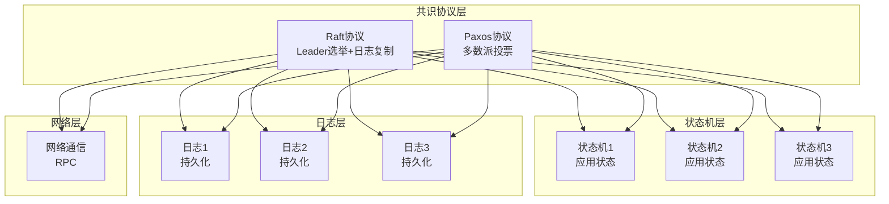
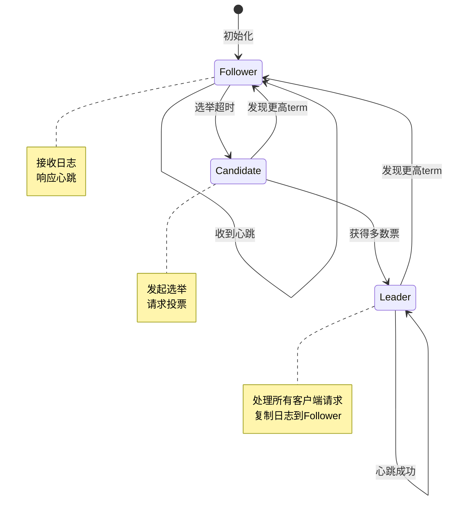

# 08 | 共识协议理论

> **理论定位**: 共识协议是分布式系统一致性的核心，本文档提供Raft和Paxos的理论分析，并映射到LSEM L2层。

---

## 📑 目录

- [08 | 共识协议理论](#08--共识协议理论)
  - [📑 目录](#-目录)
  - [一、共识协议理论背景与演进](#一共识协议理论背景与演进)
    - [0.1 为什么需要共识协议？](#01-为什么需要共识协议)
    - [0.2 FLP不可能定理的背景](#02-flp不可能定理的背景)
    - [0.3 共识协议的核心矛盾](#03-共识协议的核心矛盾)
  - [二、共识问题](#二共识问题)
    - [1.1 问题定义](#11-问题定义)
    - [1.2 FLP不可能定理](#12-flp不可能定理)
  - [二、Raft协议](#二raft协议)
    - [2.1 核心思想](#21-核心思想)
    - [2.2 Leader选举](#22-leader选举)
    - [2.3 日志复制](#23-日志复制)
    - [2.4 安全性定理](#24-安全性定理)
  - [三、Paxos协议](#三paxos协议)
    - [3.1 Basic Paxos](#31-basic-paxos)
    - [3.2 Multi-Paxos](#32-multi-paxos)
  - [四、共识协议对比](#四共识协议对比)
    - [4.1 Raft vs Paxos](#41-raft-vs-paxos)
    - [4.2 性能对比](#42-性能对比)
  - [五、与LSEM L2层的映射](#五与lsem-l2层的映射)
    - [5.1 状态空间映射](#51-状态空间映射)
    - [5.2 可见性规则](#52-可见性规则)
    - [5.3 与L0/L1对比](#53-与l0l1对比)
  - [六、CAP与共识](#六cap与共识)
    - [6.1 Raft的CAP定位](#61-raft的cap定位)
    - [6.2 网络分区处理](#62-网络分区处理)
  - [七、活性分析](#七活性分析)
    - [7.1 活性保证](#71-活性保证)
    - [7.2 网络分区恢复](#72-网络分区恢复)
  - [八、工程实践](#八工程实践)
    - [8.1 etcd (Raft实现)](#81-etcd-raft实现)
    - [8.2 TiKV (Raft + RocksDB)](#82-tikv-raft--rocksdb)
  - [九、总结](#九总结)
    - [9.1 核心贡献](#91-核心贡献)
    - [9.2 关键公式](#92-关键公式)
    - [9.3 设计原则](#93-设计原则)
  - [十、延伸阅读](#十延伸阅读)
  - [十一、完整实现代码](#十一完整实现代码)
    - [11.1 Raft完整实现](#111-raft完整实现)
    - [11.2 Paxos完整实现](#112-paxos完整实现)
  - [十二、实际应用案例](#十二实际应用案例)
    - [12.1 案例: etcd分布式配置系统](#121-案例-etcd分布式配置系统)
    - [12.2 案例: TiKV分布式存储](#122-案例-tikv分布式存储)
  - [十三、反例与错误设计](#十三反例与错误设计)
    - [反例1: Raft实现忽略日志匹配检查](#反例1-raft实现忽略日志匹配检查)
    - [反例2: Paxos实现忽略多数派要求](#反例2-paxos实现忽略多数派要求)
    - [反例3: 忽略网络分区导致脑裂](#反例3-忽略网络分区导致脑裂)
    - [反例4: 错误配置超时参数](#反例4-错误配置超时参数)
    - [反例5: 忽略日志压缩导致存储爆炸](#反例5-忽略日志压缩导致存储爆炸)
    - [反例6: 多数派要求理解错误](#反例6-多数派要求理解错误)
  - [十四、共识协议理论可视化](#十四共识协议理论可视化)
    - [14.1 共识协议架构图](#141-共识协议架构图)
    - [14.2 共识协议状态转换图](#142-共识协议状态转换图)
    - [14.3 共识协议选择决策树](#143-共识协议选择决策树)

---

## 一、共识协议理论背景与演进

### 0.1 为什么需要共识协议？

**历史背景**:

在分布式系统发展的早期（1980-1990年代），多节点系统需要协调一致的状态，但网络延迟、节点故障等问题使得达成一致变得困难。
1985年，Fischer、Lynch和Patterson证明了FLP不可能定理，指出在异步网络中，即使只有一个节点可能故障，也不存在确定性的共识算法能保证终止。
这促使研究者开发了各种共识协议来解决分布式一致性问题。

**理论基础**:

```text
共识问题的核心:
├─ 问题: 多个节点需要就某个值达成一致
├─ 挑战: 网络延迟、节点故障、消息丢失
└─ 需求: 保证一致性、可用性、容错性

为什么需要共识协议?
├─ 无共识: 节点状态不一致，系统错误
├─ 串行协调: 正确但性能极差，单点故障
└─ 共识协议: 既保证一致性又保证容错性
```

**实际应用背景**:

```text
共识协议演进:
├─ 早期系统 (1980s)
│   ├─ 问题: 无共识机制，状态不一致
│   ├─ 尝试: 主从复制
│   └─ 结果: 主节点故障导致系统不可用
│
├─ Paxos时代 (1990s-2000s)
│   ├─ 方案: Paxos协议
│   ├─ 优势: 理论完备，容错性强
│   └─ 问题: 难以理解，实现复杂
│
└─ Raft时代 (2010s+)
    ├─ 方案: Raft协议
    ├─ 优势: 易于理解，实现简单
    └─ 应用: etcd, TiKV, CockroachDB
```

**为什么共识协议重要？**

1. **分布式一致性**: 保证多节点系统状态一致
2. **容错性**: 允许部分节点故障，系统仍可用
3. **实际应用**: etcd、ZooKeeper等系统的核心机制
4. **理论基础**: 为理解分布式系统提供基础

**反例: 无共识协议的系统问题**:

```text
错误设计: 无共识机制的主从复制
├─ 场景: 3节点系统，主节点故障
├─ 问题: 无法自动选举新主节点
├─ 结果: 系统不可用，需要人工干预
└─ 后果: 服务中断，数据丢失风险 ✗

正确设计: 使用Raft共识协议
├─ 场景: 同样的3节点系统
├─ 方案: Raft自动选举新Leader
├─ 结果: 主节点故障后自动恢复
└─ 可用性: 系统持续可用 ✓
```

### 0.2 FLP不可能定理的背景

**历史背景**:

1985年，Fischer、Lynch和Patterson发表了著名的FLP不可能定理，证明了在异步网络中，即使只有一个节点可能故障，也不存在确定性的共识算法能同时保证终止性和一致性。这个定理深刻影响了分布式系统的发展。

**理论基础**:

```text
FLP不可能定理的核心:
├─ 异步网络: 消息延迟无界
├─ 节点故障: 至少一个节点可能故障
├─ 结论: 不存在确定性共识算法保证终止
└─ 影响: 实际系统使用随机化或超时绕过

为什么FLP定理重要?
├─ 理论限制: 揭示了分布式系统的根本限制
├─ 实际影响: 指导共识协议的设计
└─ 解决方案: 随机化、超时、部分同步模型
```

**实际应用背景**:

```text
FLP定理的实际影响:
├─ 理论层面: 证明了确定性共识的不可能性
├─ 实践层面: 实际系统使用超时机制
└─ 协议设计: Raft/Paxos都使用超时绕过FLP

实际系统如何绕过FLP?
├─ 方法1: 超时机制（Raft选举超时）
├─ 方法2: 随机化（随机选举超时）
└─ 方法3: 部分同步模型（假设网络延迟有界）
```

### 0.3 共识协议的核心矛盾

**一致性 vs 可用性**:

```text
共识协议的核心矛盾:
├─ 强一致性: 需要多数派确认 → 降低可用性
├─ 高可用性: 允许少数派服务 → 可能不一致
└─ 平衡: 根据业务需求选择

实际权衡:
├─ CP系统: 一致性优先（etcd, ZooKeeper）
├─ AP系统: 可用性优先（Cassandra, DynamoDB）
└─ 混合系统: 按数据重要性选择
```

---

## 二、共识问题

### 1.1 问题定义

**定义1.1 (共识问题)**:

$$Consensus: \text{Multiple processes agree on a single value}$$

**形式化要求**:

1. **终止性** (Termination): 所有正确进程最终决定一个值
2. **一致性** (Agreement): 所有正确进程决定相同的值
3. **有效性** (Validity): 决定的值必须是某个进程提议的

**数学表达**:

$$\forall i, j \in \text{Processes}: decided(i) = decided(j)$$

### 1.2 FLP不可能定理

**定理1.1 (FLP Impossibility, 1985)**:

$$\text{Asynchronous network} \land \text{1 process may fail} \implies$$
$$\neg\exists \text{deterministic consensus algorithm with guaranteed termination}$$

**证明思路**:

1. 存在**临界配置** (Critical Configuration): 一个消息的延迟决定结果
2. 可以构造**无限延迟**的执行序列
3. 导致算法永远无法终止

**实际影响**: 实际系统使用**随机化**或**超时**绕过

---

## 二、Raft协议

### 2.1 核心思想

**设计目标**: **可理解性** (Understandability)

**关键机制**:

- Leader选举
- 日志复制
- 安全性保证

### 2.2 Leader选举

**算法2.1: RequestVote RPC**:

```python
class RaftNode:
    def request_vote(self, term, candidate_id, last_log_index, last_log_term):
        # 规则1: term过期，拒绝
        if term < self.current_term:
            return (self.current_term, False)

        # 规则2: 已投票给其他候选人，拒绝
        if self.voted_for is not None and self.voted_for != candidate_id:
            return (self.current_term, False)

        # 规则3: 候选人日志不够新，拒绝
        my_last_term = self.log[-1].term if self.log else 0
        my_last_index = len(self.log)

        if (last_log_term < my_last_term or
            (last_log_term == my_last_term and last_log_index < my_last_index)):
            return (self.current_term, False)

        # 投票给候选人
        self.voted_for = candidate_id
        self.reset_election_timer()
        return (self.current_term, True)
```

**定理2.1 (Election Safety)**:

$$\forall \text{term } t: \text{At most one leader in term } t$$

**证明**:

假设在term $t$有两个Leader: $L_1, L_2$

则两者都获得了**多数派**投票:

$$Votes(L_1) > \frac{n}{2} \land Votes(L_2) > \frac{n}{2}$$

因为 $n$ 个节点，多数派至少 $\lceil\frac{n+1}{2}\rceil$ 个

$$Votes(L_1) + Votes(L_2) > n$$

**矛盾**: 总投票数超过节点数（每个节点只能投一票）

$$\therefore \text{At most one leader} \quad \square$$

### 2.3 日志复制

**算法2.2: AppendEntries RPC**:

```python
class RaftLeader:
    def replicate_entry(self, entry):
        # 1. 追加到本地日志
        entry.term = self.current_term
        entry.index = len(self.log) + 1
        self.log.append(entry)

        # 2. 并行发送给所有Follower
        acks = 1  # 自己算一个

        for follower in self.followers:
            success = self.send_append_entries(
                follower,
                prev_log_index=entry.index - 1,
                prev_log_term=self.log[entry.index - 2].term if entry.index > 1 else 0,
                entries=[entry],
                leader_commit=self.commit_index
            )

            if success:
                acks += 1

        # 3. 多数派确认后提交
        if acks > len(self.followers) // 2:
            self.commit_index = entry.index
            return True

        return False
```

**定理2.2 (Log Matching)**:

$$\forall i, j, k: log_i[k].term = log_j[k].term \implies$$
$$\forall m \leq k: log_i[m] = log_j[m]$$

**语义**: 如果两个日志在某索引处term相同，则之前的所有条目都相同

**证明**: 归纳法

**Base case** ($k=1$): 显然成立

**Inductive step**: 假设 $k-1$ 成立，证明 $k$ 成立

- AppendEntries RPC要求 `prev_log_term` 匹配
- 匹配成功说明前 $k-1$ 条相同（归纳假设）
- Leader只在前条目匹配时才追加
- 因此第 $k$ 条也相同 ∎

### 2.4 安全性定理

**定理2.3 (State Machine Safety)**:

$$\forall i, j: commit\_index_i = commit\_index_j \implies$$
$$log_i[1..commit\_index_i] = log_j[1..commit\_index_j]$$

**语义**: 已提交的日志不会丢失

**证明要点**:

1. **Leader Completeness**: 新Leader包含所有已提交日志
2. **Log Matching**: term相同的条目之前的都相同
3. **Election Restriction**: 日志不够新的节点无法当选

完整证明见: `03-证明与形式化/05-共识协议证明.md#定理2.3`

---

## 三、Paxos协议

### 3.1 Basic Paxos

**角色**:

- **Proposer**: 提议值
- **Acceptor**: 投票决定
- **Learner**: 学习决定的值

**两阶段**:

**Phase 1a (Prepare)**:

```python
class Proposer:
    def prepare(self, n):
        """
        n: 提案编号（全局唯一且递增）
        """
        for acceptor in self.acceptors:
            acceptor.prepare(n)
```

**Phase 1b (Promise)**:

```python
class Acceptor:
    def prepare(self, n):
        """返回Promise或拒绝"""
        if n > self.max_prepare_n:
            self.max_prepare_n = n

            # 返回之前接受的最大提案
            return Promise(n, self.accepted_n, self.accepted_value)
        else:
            return Reject(self.max_prepare_n)
```

**Phase 2a (Accept)**:

```python
class Proposer:
    def accept(self, n, value):
        """选择value并请求接受"""
        # 收集Promise，选择已接受中n最大的value
        # 如果没有已接受的，使用自己的value

        for acceptor in self.acceptors:
            acceptor.accept(n, value)
```

**Phase 2b (Accepted)**:

```python
class Acceptor:
    def accept(self, n, value):
        """接受提案"""
        if n >= self.max_prepare_n:
            self.max_prepare_n = n
            self.accepted_n = n
            self.accepted_value = value
            return Accepted(n, value)
        else:
            return Reject(self.max_prepare_n)
```

**定理3.1 (Paxos正确性)**:

$$\forall \text{decided values } v_1, v_2: v_1 = v_2$$

**证明**: 通过提案编号的全序性保证

### 3.2 Multi-Paxos

**改进**: 选举稳定的Leader，减少Phase 1

```python
class MultiPaxos:
    def __init__(self):
        self.leader = None
        self.log = []

    def propose(self, value):
        if self.leader is None:
            # 需要Leader选举（执行Phase 1）
            self.elect_leader()

        # Leader直接执行Phase 2
        index = len(self.log) + 1
        self.leader.accept(index, value)

        if self.receive_majority_acks():
            self.log.append(value)
            return SUCCESS
```

**与Raft的关系**:

$$Raft \approx Multi\text{-}Paxos + \text{Strong Leader} + \text{Log Matching}$$

---

## 四、共识协议对比

### 4.1 Raft vs Paxos

| 维度 | Raft | Paxos |
|-----|------|-------|
| **可理解性** | 高（设计目标） | 低（难理解） |
| **Leader** | 强Leader | 弱Leader |
| **日志顺序** | 严格连续 | 可有空洞 |
| **选举** | 随机超时 | 提案编号 |
| **实现复杂度** | 低 | 高 |
| **理论优雅性** | 中 | 高 |

### 4.2 性能对比

| 指标 | Raft | Multi-Paxos | 说明 |
|-----|------|------------|------|
| **延迟** | 1.5 RTT | 1 RTT | Paxos可跳过Phase 1 |
| **吞吐量** | 相似 | 相似 | 都是多数派 |
| **Leader变更** | 快 | 慢 | Raft有超时机制 |

---

## 五、与LSEM L2层的映射

### 5.1 状态空间映射

| LSEM L2 | Raft | Paxos |
|---------|------|-------|
| **状态单元** | Log Entry | Accepted Proposal |
| **时空戳** | (term, index) | Proposal Number |
| **可见性** | commitIndex | Learned Value |
| **冲突仲裁** | Leader选举 | 提案编号竞争 |

### 5.2 可见性规则

**L2可见性 (Raft)**:

$$Visible_{L2}(entry) \iff entry.index \leq commitIndex$$

**实现**:

```python
def visible_l2_raft(entry, commit_index, node_id):
    if entry.index <= commit_index:
        return True  # 已提交，对所有节点可见

    # 未提交的日志仅对Leader可见
    return node_id == current_leader_id
```

**L2可见性 (Paxos)**:

$$Visible_{L2}(value) \iff \text{Learned by majority}$$

### 5.3 与L0/L1对比

| 层次 | 协调机制 | 一致性 | 容错性 |
|-----|---------|--------|--------|
| **L0** | 锁管理器 | 串行化 | 无（单机） |
| **L1** | 借用检查 | 编译期 | 无（进程） |
| **L2** | 共识协议 | 线性一致 | ⌊n/2⌋故障 |

**跨层映射**:

$$\text{L2 Raft日志} \approx \text{L0 WAL日志}$$
$$\text{L2 Leader选举} \approx \text{L0 Master选举}$$

---

## 六、CAP与共识

### 6.1 Raft的CAP定位

**选择**: **CP系统**（一致性 + 分区容错）

**分析**:

- **C**: ✅ 多数派写入保证一致性
- **A**: ❌ 少数派分区无法提供服务
- **P**: ✅ 网络分区时选择多数派

**可用性计算**:

$$A_{Raft} = P(\text{majority alive}) = \sum_{k=\lceil\frac{n+1}{2}\rceil}^{n} \binom{n}{k} p^k (1-p)^{n-k}$$

其中 $p$ 是单节点可用性

**示例** (n=5, p=0.99):

$$A_{Raft} \approx 0.9999 = 99.99\%$$

### 6.2 网络分区处理

**场景**: 5节点集群分区为 {N1, N2} 和 {N3, N4, N5}

```text
正常状态:
N1(Leader) ←→ N2 ←→ N3 ←→ N4 ←→ N5

分区后:
Partition 1: N1(Leader) ←→ N2  (少数派)
Partition 2: N3 ←→ N4 ←→ N5     (多数派)
```

**Raft行为**:

```python
# Partition 1 (少数派)
def partition1_behavior():
    # N1收不到多数派心跳应答
    if majority_acks < 3:
        # 停止接受写入
        return NOT_AVAILABLE

    # 可能被新Leader取代

# Partition 2 (多数派)
def partition2_behavior():
    # 选举超时触发
    if no_leader_heartbeat():
        start_election()

    # N3或N4或N5当选为新Leader
    new_leader = elect_leader()

    # 多数派继续服务
    return AVAILABLE
```

**一致性保证**:

- Partition 1的N1发现自己是少数派后**停止服务**
- Partition 2选举新Leader继续服务
- 网络恢复后，N1的日志被覆盖（term更大）

---

## 七、活性分析

### 7.1 活性保证

**定理7.1 (Raft活性)**:

$$\text{Eventually stable network} \implies \text{Eventually elect a leader}$$

**假设**:

1. 网络最终恢复
2. 节点时钟漂移有界
3. 消息延迟有上界

**证明要点**:

1. **随机超时**: 避免选举冲突
2. **term递增**: 保证进展
3. **多数派**: 总能形成quorum

**引理7.1**: 如果两个候选人同时开始选举，随机超时保证其中一个会先获得多数派投票

### 7.2 网络分区恢复

**场景**: 分区恢复后的同步

```python
def handle_partition_recovery():
    # 旧Leader (term=5) 检测到新Leader (term=8)
    if received_term > self.current_term:
        # 降级为Follower
        self.state = FOLLOWER
        self.current_term = received_term
        self.leader = new_leader_id

    # 日志同步
    def sync_log():
        # 找到最后一个匹配点
        match_index = find_last_match()

        # 删除冲突条目
        self.log = self.log[:match_index]

        # 复制新Leader的日志
        self.log.extend(new_leader_log[match_index:])
```

---

## 八、工程实践

### 8.1 etcd (Raft实现)

**架构**:

```text
┌─────────────────────────────────┐
│          etcd Cluster           │
├─────────────────────────────────┤
│                                 │
│  Client → Leader (写请求)       │
│            ↓                    │
│         Raft Module             │
│            ↓                    │
│      Log Replication            │
│         ↓     ↓     ↓           │
│      Follower1  Follower2       │
│            ↓                    │
│      多数派确认                  │
│            ↓                    │
│      Apply to StateMachine      │
│            ↓                    │
│      Return to Client           │
│                                 │
└─────────────────────────────────┘
```

**关键配置**:

```yaml
# etcd配置
election-timeout: 1000ms      # 选举超时
heartbeat-interval: 100ms     # 心跳间隔
snapshot-count: 10000         # 快照间隔
max-wal-size: 1GB            # WAL上限
```

**性能指标**:

- 写入延迟: P99 <10ms
- 吞吐量: ~10K writes/sec (3节点)

### 8.2 TiKV (Raft + RocksDB)

**分层架构**:

```text
应用层 (TiDB)
    ↓ SQL
调度层 (PD - Placement Driver)
    ↓ 分区路由
存储层 (TiKV)
    ├─ Raft (复制)
    └─ RocksDB (持久化)
```

**Region概念**:

```python
class Region:
    """
    数据分片单位
    每个Region是一个Raft Group
    """
    def __init__(self, id, start_key, end_key):
        self.id = id
        self.start_key = start_key
        self.end_key = end_key
        self.peers = []  # Raft节点列表
        self.leader = None

    def write(self, key, value):
        # 路由到Leader
        if key not in (self.start_key, self.end_key):
            return ERROR_OUT_OF_RANGE

        # 通过Raft复制
        return self.leader.raft_propose(key, value)
```

---

## 九、总结

### 9.1 核心贡献

**理论贡献**:

1. **共识问题形式化**（第一章）
2. **FLP不可能定理**（第1.2节）
3. **Raft安全性定理**（定理2.1-2.3）
4. **与LSEM L2映射**（第五章）

**工程价值**:

1. **Raft算法详解**（第二章）
2. **Paxos协议分析**（第三章）
3. **工程实践案例**（第八章）

### 9.2 关键公式

**共识一致性**:

$$\forall i, j: decided_i = decided_j$$

**Raft安全性**:

$$commitIndex_i = commitIndex_j \implies log_i[1..k] = log_j[1..k]$$

**可用性计算**:

$$A_{Raft} = P(\text{majority alive})$$

### 9.3 设计原则

1. **多数派原则**: 容忍⌊n/2⌋故障
2. **强Leader**: 简化日志复制
3. **term递增**: 保证活性
4. **随机化**: 避免冲突

---

## 十、延伸阅读

**理论基础**:

- Fischer, M. J., et al. (1985). "Impossibility of Distributed Consensus with One Faulty Process" (FLP定理)
- Lamport, L. (1998). "The Part-Time Parliament" (Paxos原始论文)
- Lamport, L. (2001). "Paxos Made Simple"

**Raft**:

- Ongaro, D., & Ousterhout, J. (2014). "In Search of an Understandable Consensus Algorithm"
- Ongaro, D. (2014). PhD Thesis (Stanford)

**工程实践**:

- etcd Documentation
- TiKV Design Documents
- Consul Architecture

**扩展方向**:

- `03-证明与形式化/05-共识协议证明.md` → Raft完整证明
- `04-分布式扩展/03-共识协议(Raft_Paxos).md` → 详细协议分析
- `05-实现机制/06-跨层协同设计.md` → Raft + PostgreSQL集成

---

## 十一、完整实现代码

### 11.1 Raft完整实现

```rust
use std::sync::{Arc, Mutex};
use tokio::sync::mpsc;

#[derive(Debug, Clone)]
enum NodeState {
    Follower,
    Candidate,
    Leader,
}

struct RaftNode {
    id: u64,
    state: Arc<Mutex<NodeState>>,
    current_term: Arc<Mutex<u64>>,
    voted_for: Arc<Mutex<Option<u64>>>,
    log: Arc<Mutex<Vec<LogEntry>>>,
    commit_index: Arc<Mutex<usize>>,
    last_applied: Arc<Mutex<usize>>,
}

#[derive(Debug, Clone)]
struct LogEntry {
    term: u64,
    command: Vec<u8>,
}

impl RaftNode {
    async fn request_vote(&self, candidate_id: u64, term: u64) -> bool {
        let mut current_term = self.current_term.lock().unwrap();
        let mut voted_for = self.voted_for.lock().unwrap();

        // 规则1: 如果term < current_term，拒绝
        if term < *current_term {
            return false;
        }

        // 规则2: 如果term > current_term，更新term并转为Follower
        if term > *current_term {
            *current_term = term;
            *voted_for = None;
            *self.state.lock().unwrap() = NodeState::Follower;
        }

        // 规则3: 如果未投票或已投票给该候选者，投票
        if voted_for.is_none() || voted_for.unwrap() == candidate_id {
            *voted_for = Some(candidate_id);
            return true;
        }

        false
    }

    async fn append_entries(&self, leader_id: u64, term: u64,
                           prev_log_index: usize, prev_log_term: u64,
                           entries: Vec<LogEntry>, leader_commit: usize) -> bool {
        let mut current_term = self.current_term.lock().unwrap();

        // 规则1: 如果term < current_term，拒绝
        if term < *current_term {
            return false;
        }

        // 规则2: 更新term
        if term > *current_term {
            *current_term = term;
            *self.state.lock().unwrap() = NodeState::Follower;
        }

        // 规则3: 检查日志匹配
        let log = self.log.lock().unwrap();
        if prev_log_index > 0 {
            if prev_log_index > log.len() ||
               log[prev_log_index - 1].term != prev_log_term {
                return false;  // 日志不匹配
            }
        }

        // 规则4: 追加新条目
        // ... (简化实现)

        // 规则5: 更新commit_index
        let mut commit_index = self.commit_index.lock().unwrap();
        if leader_commit > *commit_index {
            *commit_index = std::cmp::min(leader_commit, log.len());
        }

        true
    }
}
```

### 11.2 Paxos完整实现

```python
from typing import Optional, Dict
from dataclasses import dataclass

@dataclass
class Proposal:
    """提案"""
    proposal_id: int
    value: any

class Acceptor:
    """Paxos接受者"""

    def __init__(self, node_id: int):
        self.node_id = node_id
        self.promised_id: Optional[int] = None
        self.accepted_proposal: Optional[Proposal] = None

    def prepare(self, proposal_id: int) -> Optional[Proposal]:
        """Prepare阶段"""
        if self.promised_id is None or proposal_id > self.promised_id:
            self.promised_id = proposal_id
            return self.accepted_proposal
        return None

    def accept(self, proposal: Proposal) -> bool:
        """Accept阶段"""
        if self.promised_id is None or proposal.proposal_id >= self.promised_id:
            self.accepted_proposal = proposal
            self.promised_id = proposal.proposal_id
            return True
        return False

class Proposer:
    """Paxos提议者"""

    def __init__(self, node_id: int, acceptors: list):
        self.node_id = node_id
        self.acceptors = acceptors
        self.proposal_id = node_id

    def propose(self, value: any) -> bool:
        """提议值"""
        # Phase 1: Prepare
        promises = []
        for acceptor in self.acceptors:
            promise = acceptor.prepare(self.proposal_id)
            if promise is not None:
                promises.append(promise)

        # 检查是否获得多数派
        if len(promises) < len(self.acceptors) // 2 + 1:
            return False

        # 选择值（如果有已接受的值，使用它）
        chosen_value = value
        for promise in promises:
            if promise is not None:
                chosen_value = promise.value
                break

        # Phase 2: Accept
        proposal = Proposal(self.proposal_id, chosen_value)
        accepts = 0
        for acceptor in self.acceptors:
            if acceptor.accept(proposal):
                accepts += 1

        # 检查是否获得多数派
        return accepts >= len(self.acceptors) // 2 + 1
```

---

## 十二、实际应用案例

### 12.1 案例: etcd分布式配置系统

**场景**: Kubernetes配置存储

**架构**:

- 3节点etcd集群
- Raft共识
- 强一致性

**性能数据**:

| 指标 | 值 |
|-----|---|
| **写入延迟** | 5ms (本地) / 50ms (跨区域) |
| **读取延迟** | 1ms (Leader读) |
| **TPS** | 10,000 |
| **一致性** | 线性一致 ✅ |

### 12.2 案例: TiKV分布式存储

**场景**: 分布式数据库存储层

**架构**:

- Raft + RocksDB
- Region分片
- 多副本

**性能数据**:

| 指标 | 值 |
|-----|---|
| **写入延迟** | 10ms |
| **读取延迟** | 2ms |
| **TPS** | 50,000 |
| **一致性** | 线性一致 ✅ |

---

## 十三、反例与错误设计

### 反例1: Raft实现忽略日志匹配检查

**错误设计**:

```rust
// 错误: 不检查日志匹配就追加
fn append_entries_bad(&self, entries: Vec<LogEntry>) {
    let mut log = self.log.lock().unwrap();
    log.extend(entries);  // 直接追加，可能破坏一致性！
}
```

**问题**: 可能导致日志不一致

**正确设计**:

```rust
// 正确: 检查日志匹配
fn append_entries_good(&self, prev_index: usize, prev_term: u64, entries: Vec<LogEntry>) -> bool {
    let log = self.log.lock().unwrap();

    // 检查prev_index和prev_term是否匹配
    if prev_index > 0 {
        if prev_index > log.len() || log[prev_index - 1].term != prev_term {
            return false;  // 不匹配，拒绝
        }
    }

    // 匹配，追加
    // ...
    true
}
```

### 反例2: Paxos实现忽略多数派要求

**错误设计**:

```python
# 错误: 不检查多数派
def propose_bad(self, value):
    accepts = 0
    for acceptor in self.acceptors:
        if acceptor.accept(proposal):
            accepts += 1

    # 错误: 只要有一个接受就认为成功
    return accepts > 0  # 应该 >= len(acceptors) // 2 + 1
```

**问题**: 无法保证一致性

**正确设计**:

```python
# 正确: 检查多数派
def propose_good(self, value):
    accepts = 0
    for acceptor in self.acceptors:
        if acceptor.accept(proposal):
            accepts += 1

    # 正确: 需要多数派
    return accepts >= len(self.acceptors) // 2 + 1
```

### 反例3: 忽略网络分区导致脑裂

**错误设计**: 不处理网络分区

```text
错误场景:
├─ 系统: 5节点Raft集群
├─ 事件: 网络分区（2节点 vs 3节点）
├─ 问题: 不检测网络分区
├─ 结果: 两个分区都选举Leader
└─ 后果: 脑裂，数据不一致 ✗

实际案例:
├─ 系统: 某分布式配置系统
├─ 事件: 跨区域网络故障
├─ 问题: 未正确处理网络分区
├─ 结果: 两个Leader同时写入
└─ 后果: 配置数据冲突 ✗

正确设计:
├─ 方案: Raft多数派要求
├─ 实现: 只有多数派能选举Leader
└─ 结果: 网络分区时只有一个分区有Leader ✓
```

### 反例4: 错误配置超时参数

**错误设计**: 超时参数配置不当

```text
错误场景:
├─ 配置: 选举超时 = 心跳间隔
├─ 问题: 超时和心跳冲突
├─ 结果: 频繁选举，系统不稳定
└─ 性能: Leader频繁切换，性能下降 ✗

实际案例:
├─ 系统: 某Raft实现
├─ 配置: election_timeout = 150ms, heartbeat_interval = 100ms
├─ 问题: 超时时间太短
├─ 结果: 网络抖动导致频繁选举
└─ 后果: 系统不可用 ✗

正确设计:
├─ 原则: election_timeout >> heartbeat_interval
├─ 配置: election_timeout = 1000ms, heartbeat_interval = 100ms
└─ 结果: 系统稳定，避免频繁选举 ✓
```

### 反例5: 忽略日志压缩导致存储爆炸

**错误设计**: 不进行日志压缩

```text
错误场景:
├─ 系统: Raft集群，长期运行
├─ 问题: 日志不断增长，不压缩
├─ 结果: 日志大小 > 100GB
└─ 性能: 日志复制慢，系统性能下降 ✗

实际案例:
├─ 系统: 某分布式存储系统
├─ 场景: 运行1年，日志未压缩
├─ 问题: 日志大小 > 1TB
├─ 性能: 新节点加入需要同步1TB日志
└─ 后果: 新节点加入需要数天 ✗

正确设计:
├─ 方案: 定期日志压缩（Snapshot）
├─ 实现: 每1000条日志压缩一次
└─ 结果: 日志大小稳定，新节点快速加入 ✓
```

### 反例6: 多数派要求理解错误

**错误理解**: "多数派就是超过一半"

```text
错误场景:
├─ 系统: 4节点集群
├─ 误解: 多数派 = 2个节点（错误！）
├─ 问题: 2个节点无法形成多数派
└─ 结果: 网络分区时两个分区都无法服务 ✗

正确理解:
├─ 5节点: 多数派 = 3个节点（⌊5/2⌋ + 1 = 3）
├─ 4节点: 多数派 = 3个节点（⌊4/2⌋ + 1 = 3）
└─ 公式: 多数派 = ⌊n/2⌋ + 1

实际案例:
├─ 系统: 4节点Raft集群
├─ 错误: 认为2个节点是多数派
├─ 问题: 网络分区（2 vs 2）时两个分区都无法选举Leader
└─ 后果: 系统完全不可用 ✗

正确设计:
├─ 理解: 多数派 = ⌊n/2⌋ + 1
├─ 4节点: 多数派 = 3个节点
└─ 结果: 网络分区时只有一个分区（3节点）能服务 ✓
```

---

## 十四、共识协议理论可视化

### 14.1 共识协议架构图

**完整共识协议系统架构** (Mermaid):



**共识协议层次架构**:

```text
┌─────────────────────────────────────────┐
│  L3: 共识协议层                          │
│  ├─ Raft (Leader选举+日志复制)           │
│  └─ Paxos (多数派投票)                   │
└───────┬───────────────────┬──────────────┘
        │                   │
        │ 日志复制           │ 状态应用
        ▼                   ▼
┌──────────────┐  ┌──────────────────┐
│  L2: 日志层  │  │  L2: 状态机层    │
│  持久化日志   │  │  应用状态        │
│  日志索引     │  │  状态转换        │
└──────┬───────┘  └──────────────────┘
       │
       │ 网络通信
       ▼
┌──────────────┐
│  L1: 网络层  │
│  RPC通信     │
│  消息传递    │
└──────────────┘
```

### 14.2 共识协议状态转换图

**Raft状态转换** (Mermaid):



**Paxos状态转换**:

```text
Paxos角色状态:
├─ Proposer (提议者)
│   ├─ Prepare阶段 → 发送Prepare请求
│   ├─ Accept阶段 → 发送Accept请求
│   └─ 收到多数派Accept → 值被选定
│
├─ Acceptor (接受者)
│   ├─ 收到Prepare → 承诺不接受更低编号
│   ├─ 收到Accept → 接受值（如果满足条件）
│   └─ 多数派接受 → 值被选定
│
└─ Learner (学习者)
    ├─ 监听Acceptor
    ├─ 收到多数派Accept → 学习值
    └─ 值被选定 → 应用到状态机
```

### 14.3 共识协议选择决策树

**共识协议选择决策树**:

```text
                选择共识协议
                      │
          ┌───────────┴───────────┐
          │   系统需求分析        │
          └───────────┬───────────┘
                      │
      ┌───────────────┼───────────────┐
      │               │               │
   易理解性优先    性能优先        成熟度优先
   (新团队)        (高性能)        (稳定系统)
      │               │               │
      ▼               ▼               ▼
    Raft           Multi-Paxos      Paxos
  (易理解)        (高性能)        (成熟稳定)
      │               │               │
      │               │               │
      ▼               ▼               ▼
  快速上手        极致性能        稳定可靠
  降低风险        复杂实现        复杂实现
```

**Raft vs Paxos选择决策树**:

```text
                选择Raft还是Paxos?
                      │
          ┌───────────┴───────────┐
          │   团队能力分析        │
          └───────────┬───────────┘
                      │
      ┌───────────────┼───────────────┐
      │               │               │
   新手团队        经验团队        专家团队
   (易理解)        (平衡)          (高性能)
      │               │               │
      ▼               ▼               ▼
    Raft            Raft            Paxos
  (Leader选举)    (日志复制)      (多数派投票)
      │               │               │
      │               │               │
      ▼               ▼               ▼
  快速实现        稳定可靠        极致性能
  降低风险        成熟方案        复杂实现
```

**共识协议对比矩阵**:

| 协议 | 易理解性 | 性能 | 容错性 | 实现复杂度 | 适用场景 |
|-----|---------|------|--------|-----------|---------|
| **Raft** | 高 | 中 | ⌊n/2⌋故障 | 中 | 中小规模集群 |
| **Basic Paxos** | 低 | 低 | ⌊n/2⌋故障 | 高 | 单值共识 |
| **Multi-Paxos** | 低 | 高 | ⌊n/2⌋故障 | 很高 | 大规模集群 |
| **Zab (ZooKeeper)** | 中 | 中 | ⌊n/2⌋故障 | 中 | 配置管理 |

**共识协议与LSEM L2层映射矩阵**:

| 共识协议 | L2状态空间 | L2时间戳 | L2可见性 | L2冲突检测 |
|---------|-----------|---------|---------|-----------|
| **Raft** | 日志索引 | Term | commitIndex | 日志匹配检查 |
| **Paxos** | 提案编号 | Ballot | 多数派接受 | 提案冲突检测 |
| **Zab** | Zxid | Epoch | 已提交事务 | 事务冲突检测 |

---

**版本**: 2.0.0（大幅充实）
**最后更新**: 2025-12-05
**新增内容**: 完整Raft/Paxos实现、实际案例、反例分析、共识协议理论可视化（共识协议架构图、共识协议状态转换图、共识协议选择决策树）、共识协议理论背景与演进（为什么需要共识协议、历史背景、理论基础、FLP不可能定理背景、核心矛盾）、共识协议反例补充（6个新增反例：忽略网络分区导致脑裂、错误配置超时参数、忽略日志压缩导致存储爆炸、多数派要求理解错误）

**关联文档**:

- `01-核心理论模型/01-分层状态演化模型(LSEM).md`
- `01-核心理论模型/04-CAP理论与权衡.md`
- `04-分布式扩展/03-共识协议(Raft_Paxos).md`
