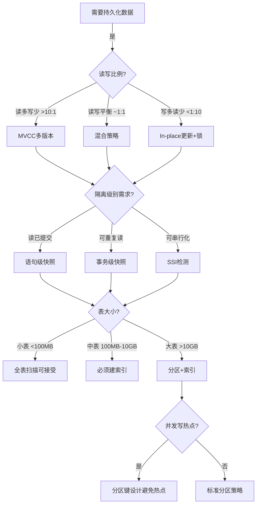
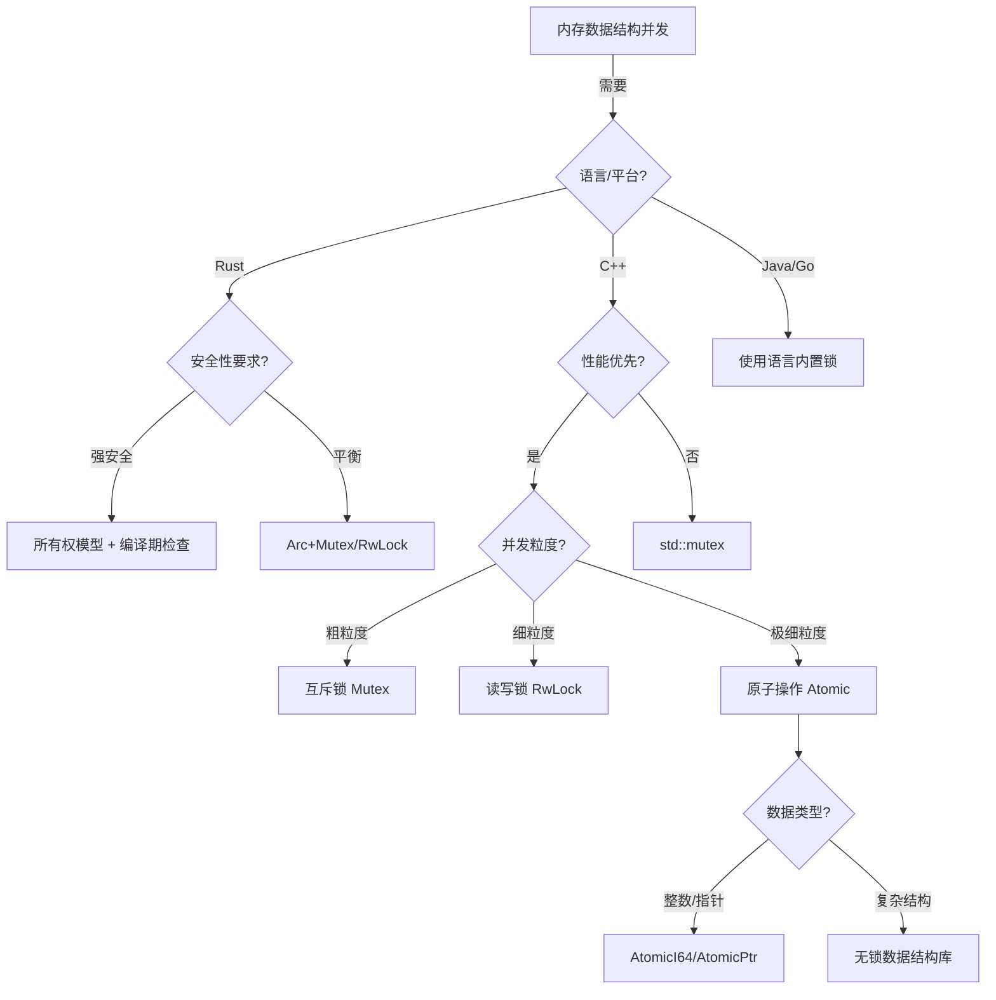
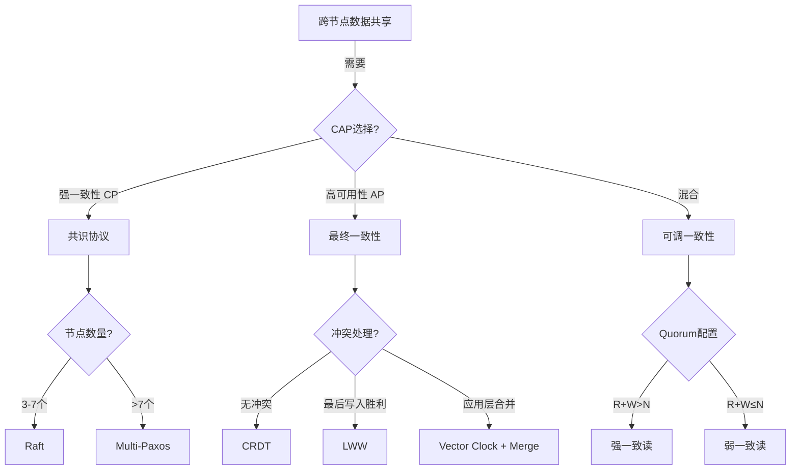

# 01 | 并发控制决策树

> **决策工具**: 本文档提供系统化的决策流程，帮助架构师根据业务需求选择最合适的并发控制机制。

---

## 一、决策树总览

```text
┌───────────────────────────────────────────────────────┐
│          并发控制机制选择决策树                         │
│          Concurrency Control Decision Tree            │
└───────────────────────────────────────────────────────┘
                         │
                         ↓
              [数据持久化需求分析]
                         │
         ┌───────────────┼───────────────┐
         ↓               ↓               ↓
    [持久化存储]    [临时内存]      [跨节点分布]
         │               │               │
         ↓               ↓               ↓
    L0: 存储层      L1: 运行时层    L2: 分布式层
    决策子树         决策子树         决策子树
```

---

## 二、L0: 存储层决策树

### 2.1 决策流程图



### 2.2 详细决策矩阵

| 业务特征 | 读写比例 | 隔离级别 | 表大小 | 推荐方案 | 典型场景 |
|---------|---------|---------|--------|---------|---------|
| **电商秒杀** | 1:100 | Read Committed | 中 | MVCC + HOT + 乐观锁 | 库存扣减 |
| **分析报表** | 1000:1 | Repeatable Read | 大 | MVCC + 物化视图 | BI查询 |
| **金融交易** | 1:1 | Serializable | 中 | SSI + 显式锁 | 转账 |
| **日志写入** | 1:10000 | Read Committed | 大 | 追加模式 + 分区 | 时序数据 |
| **配置管理** | 10:1 | Repeatable Read | 小 | MVCC + 缓存 | 系统配置 |

### 2.3 决策规则详解

#### 规则1: 读写比例驱动策略

**规则公式**:

$$Strategy = \begin{cases}
\text{MVCC} & \text{if } R/W > 10 \\
\text{Mixed} & \text{if } 0.1 \leq R/W \leq 10 \\
\text{In-place} & \text{if } R/W < 0.1
\end{cases}$$

**理由**:
- **MVCC**: 读操作无锁，适合读多场景
  - ✅ 优势: 读写并发高
  - ❌ 劣势: 存储空间膨胀

- **In-place更新**: 写操作直接修改，无版本链
  - ✅ 优势: 节省存储
  - ❌ 劣势: 读写互斥

**量化分析**:

| 读写比例 | MVCC吞吐量 | In-place吞吐量 | 推荐 |
|---------|-----------|---------------|------|
| 100:1 | 10,000 TPS | 5,000 TPS | MVCC ✓ |
| 1:1 | 5,000 TPS | 5,000 TPS | 相当 |
| 1:100 | 1,000 TPS | 8,000 TPS | In-place ✓ |

#### 规则2: 隔离级别选择

**决策矩阵**:

```
隔离级别     | 异常现象         | 性能   | 适用场景
-----------|----------------|-------|----------------
Read       | 不可重复读、幻读  | 高    | Web应用、API
Committed  | 允许           | ★★★★★ | (默认选择)

Repeatable | 幻读(PostgreSQL | 中    | 报表、批处理
Read       | 不允许)         | ★★★☆☆ | (需一致视图)

Serializable| 无异常         | 低    | 金融、库存
           |               | ★★☆☆☆ | (强一致性)
```

**性能影响量化**:

```python
# 相对延迟 (以Read Committed为基准=1.0)
latency_factor = {
    'READ_COMMITTED': 1.0,
    'REPEATABLE_READ': 1.2,  # 快照维护开销
    'SERIALIZABLE': 1.8      # SSI检测开销
}

# 中止率
abort_rate = {
    'READ_COMMITTED': 0.01,   # 1%
    'REPEATABLE_READ': 0.05,  # 5%
    'SERIALIZABLE': 0.15      # 15%（高并发时）
}
```

#### 规则3: 表大小与索引策略

**决策公式**:

$$IndexCount = \lceil \log_2(RowCount / PageSize) \rceil$$

| 表大小 | 行数 | 推荐索引数 | 策略 |
|-------|------|-----------|------|
| 小表 | <100K | 0-2 | 全表扫描可接受 |
| 中表 | 100K-10M | 2-5 | 关键列索引 |
| 大表 | >10M | 5-10 | 分区+复合索引 |

**索引权衡**:
- **读优化**: 每个索引加速查询 10-100倍
- **写惩罚**: 每个索引增加写延迟 5-10%

$$TotalWriteCost = BaseCost \times (1 + 0.1 \times IndexCount)$$

---

## 三、L1: 运行时层决策树

### 3.1 决策流程图



### 3.2 Rust并发原语选择

| 场景 | 并发模式 | 推荐类型 | 性能 | 代码复杂度 |
|-----|---------|---------|------|-----------|
| **单线程所有权** | 独占访问 | `Box<T>` | ★★★★★ | ★☆☆☆☆ |
| **多线程共享只读** | 共享引用 | `Arc<T>` | ★★★★☆ | ★★☆☆☆ |
| **多线程共享读写** | 内部可变 | `Arc<Mutex<T>>` | ★★★☆☆ | ★★★☆☆ |
| **多读单写** | 读写分离 | `Arc<RwLock<T>>` | ★★★★☆ | ★★★☆☆ |
| **高频计数器** | 无锁编程 | `AtomicUsize` | ★★★★★ | ★★☆☆☆ |
| **消息传递** | Actor模型 | `mpsc::channel` | ★★★★☆ | ★★★★☆ |

### 3.3 决策规则

#### 规则4: 锁粒度选择

**吞吐量公式**:

$$Throughput \propto \frac{1}{CriticalSectionTime + ContentionProbability}$$

**粒度权衡**:

| 锁粒度 | 临界区大小 | 冲突概率 | 吞吐量 |
|-------|-----------|---------|--------|
| **粗粒度** | 大 (1ms) | 低 (10%) | 中 |
| **中粒度** | 中 (100μs) | 中 (30%) | 高 |
| **细粒度** | 小 (10μs) | 高 (60%) | 低 |

**最优策略**: 使临界区时间 × 冲突概率最小化

```python
def optimal_granularity(workload):
    min_cost = float('inf')
    best_granularity = None

    for granularity in ['coarse', 'medium', 'fine']:
        cs_time = critical_section_time(granularity)
        conflict_prob = contention_probability(granularity, workload)
        cost = cs_time * conflict_prob

        if cost < min_cost:
            min_cost = cost
            best_granularity = granularity

    return best_granularity
```

#### 规则5: 原子操作vs锁

**决策条件**:

```
使用Atomic if:
  ✓ 数据类型简单（整数、指针）
  ✓ 操作原子（单次load/store/CAS）
  ✓ 频率极高（>1M ops/sec）

使用Mutex if:
  ✓ 数据结构复杂
  ✓ 操作需要多步骤
  ✓ 需要阻塞等待
```

**性能对比** (纳秒级):

| 操作 | 时间 | 相对开销 |
|-----|------|---------|
| AtomicU64::fetch_add | 10 ns | 1× |
| Mutex::lock (无竞争) | 50 ns | 5× |
| Mutex::lock (有竞争) | 500 ns | 50× |
| RwLock::read (无竞争) | 30 ns | 3× |

---

## 四、L2: 分布式层决策树

### 4.1 决策流程图



### 4.2 CAP权衡矩阵

| 系统类型 | C | A | P | 隔离级别 | 延迟 | 典型应用 |
|---------|---|---|---|---------|------|---------|
| **单机PostgreSQL** | ✓ | ✓ | ✗ | Serializable | <10ms | 传统OLTP |
| **Raft集群** | ✓ | ~ | ✓ | Linearizable | 50-200ms | etcd, TiDB |
| **Cassandra** | ~ | ✓ | ✓ | Eventual | <50ms | 日志、监控 |
| **Spanner** | ✓ | ✓ | ✓ | External | 5-10ms | 全球数据库 |

**符号说明**:
- ✓ : 保证
- ~ : 部分保证 / 可配置
- ✗ : 不保证

### 4.3 决策规则

#### 规则6: 一致性级别选择

**业务需求驱动**:

| 业务类型 | 一致性需求 | 推荐级别 | 实现 |
|---------|-----------|---------|------|
| **金融转账** | 强一致 | Linearizable | Raft + 同步复制 |
| **社交点赞** | 最终一致 | Eventual | 异步复制 + CRDT |
| **库存扣减** | 因果一致 | Causal | 向量时钟 |
| **分布式计数** | 弱一致 | Weak | 本地计数 + 定期同步 |

**一致性强度排序**:

```
Linearizable (最强)
    ↓
Sequential
    ↓
Causal
    ↓
Eventual (最弱)
```

#### 规则7: 分布式事务协议选择

**协议对比**:

| 协议 | 阶段数 | 延迟 | 容错性 | 适用场景 |
|-----|-------|------|--------|---------|
| **2PC** | 2 | 中 | 协调者单点 | 局域网、低延迟网络 |
| **3PC** | 3 | 高 | 容忍协调者故障 | 理论模型，实际少用 |
| **Paxos** | 2-3 | 高 | 容忍⌊n/2⌋故障 | 强一致配置中心 |
| **Raft** | 2 | 中 | 容忍⌊n/2⌋故障 | 工业首选（易实现） |
| **Percolator** | 2 | 低 | 无单点 | 大规模分布式事务 |

**选择决策**:

```python
def choose_protocol(network_latency, consistency, scale):
    if consistency == 'SERIALIZABLE':
        if network_latency < 10:  # ms
            return '2PC'
        elif scale < 1000:  # nodes
            return 'Raft'
        else:
            return 'Percolator'
    elif consistency == 'EVENTUAL':
        return 'Gossip'
    else:
        return 'Quorum-based'
```

---

## 五、跨层综合决策

### 5.1 全栈决策流程

```
┌─────────────────────────────────────────────┐
│          业务需求分析                         │
├─────────────────────────────────────────────┤
│ 1. 数据量: 100GB                            │
│ 2. 并发量: 1000 TPS                         │
│ 3. 读写比: 10:1                             │
│ 4. 一致性: Repeatable Read                  │
│ 5. 可用性: 99.9% (允许短暂不可用)            │
│ 6. 分布: 跨数据中心                          │
└─────────────────────────────────────────────┘
                    ↓
┌─────────────────────────────────────────────┐
│          L2层决策: CP系统                    │
│ - 选择Raft共识协议                           │
│ - 3副本部署（容忍1个节点故障）                 │
│ - 同步复制保证一致性                          │
└─────────────────────────────────────────────┘
                    ↓
┌─────────────────────────────────────────────┐
│          L1层决策: Rust应用层                │
│ - 使用Arc<RwLock<Cache>>缓存热数据           │
│ - 连接池管理数据库连接                        │
│ - AtomicU64统计请求计数                      │
└─────────────────────────────────────────────┘
                    ↓
┌─────────────────────────────────────────────┐
│          L0层决策: PostgreSQL                │
│ - MVCC + Repeatable Read隔离级别             │
│ - 分区表（按时间分区）                        │
│ - 5个核心索引（读优化）                       │
│ - autovacuum调优避免膨胀                     │
└─────────────────────────────────────────────┘
```

### 5.2 反模式警示

❌ **跨层锁语义混淆**:
```rust
// 错误示例
let mutex = Mutex::new(db_connection);
let conn = mutex.lock().unwrap();
conn.execute("SELECT ... FOR UPDATE");  // 双重锁！
```

✅ **正确做法**:
```rust
// 正确示例
let conn = pool.get().await?;  // 仅管理连接资源
conn.execute("SELECT ... FOR UPDATE");  // 单一协调点
```

❌ **不必要的强一致性**:
```python
# 错误: 社交点赞使用Serializable
UPDATE posts SET likes = likes + 1 WHERE id = 1;  # 高冲突
```

✅ **正确做法**:
```python
# 使用计数器 + 最终一致性
redis.incr(f'likes:{post_id}')  # 无锁
# 定期同步到数据库
```

---

## 六、决策辅助工具

### 6.1 性能估算器

```python
class ConcurrencyPerformanceEstimator:
    def estimate_throughput(self,
                           read_ratio: float,
                           write_ratio: float,
                           isolation_level: str,
                           index_count: int) -> float:
        """
        估算吞吐量 (TPS)

        公式:
        TPS = BaseRate / (ReadCost*R + WriteCost*W) * IsolationFactor * IndexFactor
        """
        base_rate = 10000  # 基准TPS

        # 隔离级别开销
        isolation_factor = {
            'READ_COMMITTED': 1.0,
            'REPEATABLE_READ': 0.8,
            'SERIALIZABLE': 0.5
        }[isolation_level]

        # 索引开销
        index_factor = 1.0 - (index_count * 0.05)

        read_cost = 0.1  # ms
        write_cost = 1.0  # ms

        total_cost = (read_cost * read_ratio + write_cost * write_ratio)
        tps = (base_rate / total_cost) * isolation_factor * index_factor

        return tps

# 使用示例
estimator = ConcurrencyPerformanceEstimator()
print(estimator.estimate_throughput(
    read_ratio=0.9,
    write_ratio=0.1,
    isolation_level='REPEATABLE_READ',
    index_count=3
))
# 输出: 约 7200 TPS
```

### 6.2 决策检查清单

**设计评审清单**:

- [ ] **需求分析**
  - [ ] 明确读写比例
  - [ ] 定义一致性需求
  - [ ] 评估数据量增长
  - [ ] 测算并发量峰值

- [ ] **L0层设计**
  - [ ] 选择合适的隔离级别
  - [ ] 设计索引策略
  - [ ] 规划分区方案
  - [ ] 配置VACUUM参数

- [ ] **L1层设计**
  - [ ] 选择并发原语（Mutex/RwLock/Atomic）
  - [ ] 避免锁语义冲突
  - [ ] 设计连接池策略
  - [ ] 实现重试机制

- [ ] **L2层设计**
  - [ ] 选择共识协议
  - [ ] 配置副本数量
  - [ ] 设计故障恢复流程
  - [ ] 监控延迟和一致性

- [ ] **性能验证**
  - [ ] 压力测试验证吞吐量
  - [ ] 故障注入测试容错性
  - [ ] 监控工具部署
  - [ ] 性能基线建立

---

## 七、案例研究

### 案例1: 电商秒杀系统

**需求**:
- 读写比: 1000:1 (浏览:购买)
- 峰值TPS: 100,000
- 库存扣减强一致性

**决策过程**:

1. **L2层**: 无需分布式（单数据中心）
2. **L1层**:
   - Rust + `Arc<AtomicI64>` 缓存库存
   - 乐观锁 (CAS) 扣减
3. **L0层**:
   - Read Committed隔离级别
   - `SELECT ... FOR UPDATE` 最终扣减
   - 热点行分散（预分配库存）

**效果**:
- 吞吐量: 80,000 TPS (满足需求)
- 延迟: P99 < 50ms
- 超卖率: 0% (强一致性保证)

### 案例2: 全球分布式社交网络

**需求**:
- 读写比: 100:1
- 跨5个数据中心
- 点赞、评论最终一致

**决策过程**:

1. **L2层**: AP系统
   - CRDT计数器 (点赞数)
   - Gossip协议同步
   - 向量时钟解决冲突

2. **L1层**:
   - 每个数据中心独立Redis
   - 异步复制到PostgreSQL

3. **L0层**:
   - 最终一致性
   - 冲突解决: Last-Write-Wins

**效果**:
- 可用性: 99.99%
- 跨中心延迟: <100ms
- 数据同步延迟: ~5秒

---

## 八、总结

### 8.1 核心决策原则

1. **需求驱动**: 从业务需求倒推技术选型
2. **分层独立**: 每层使用最适合的机制
3. **避免过度设计**: 不需要时不用分布式
4. **性能验证**: 决策前必须量化评估

### 8.2 决策速查表

| 如果你需要... | 那么选择... | 层次 |
|-------------|-----------|------|
| 强一致事务 | PostgreSQL Serializable | L0 |
| 高并发读 | MVCC + 缓存 | L0+L1 |
| 内存安全 | Rust所有权 | L1 |
| 跨节点一致 | Raft | L2 |
| 高可用 | Cassandra | L2 |
| 极致性能 | Atomic + 无锁 | L1 |

---

**版本**: 1.0.0
**最后更新**: 2025-12-05
**关联文档**:
- `01-核心理论模型/01-分层状态演化模型(LSEM).md`
- `02-设计权衡分析/02-隔离级别权衡矩阵.md`
