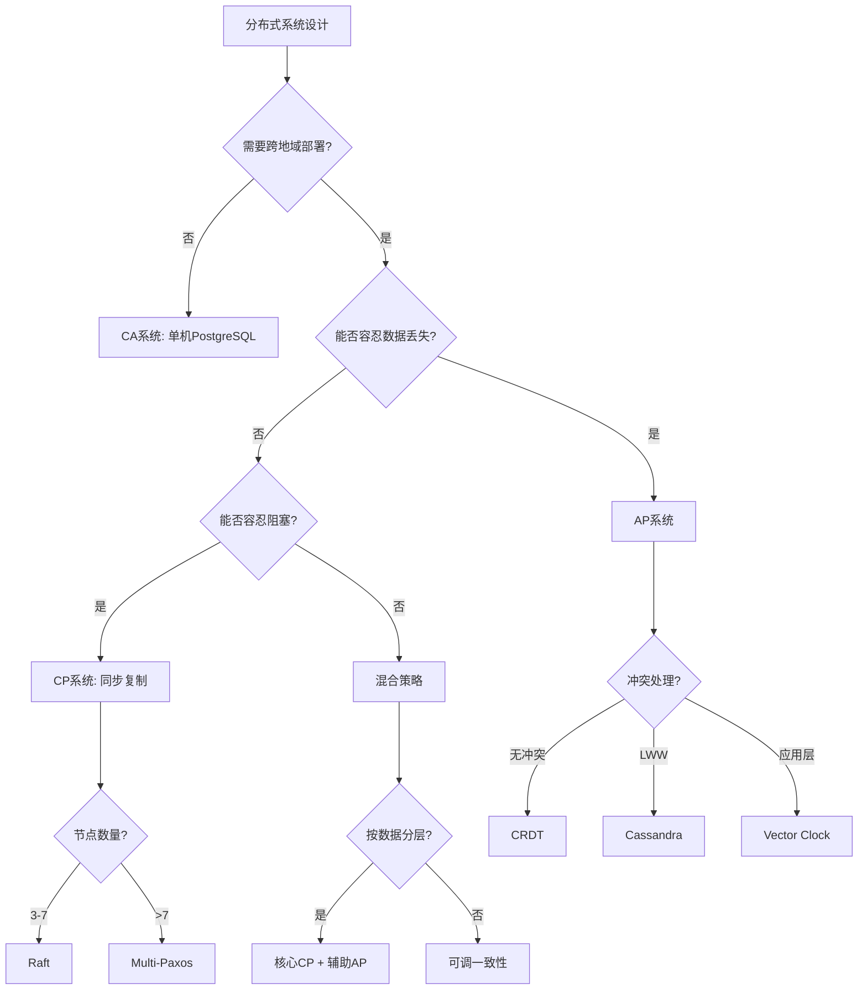
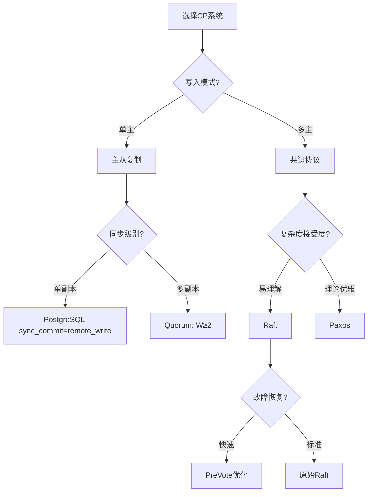
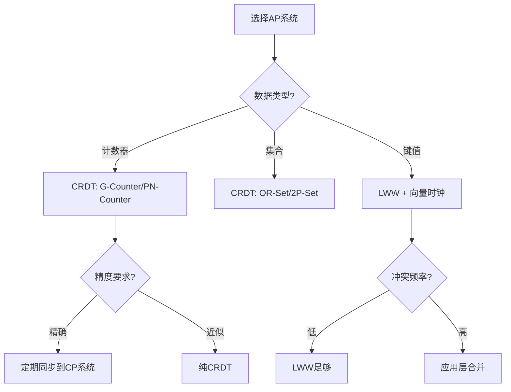

# 03 | CAP权衡决策模型

> **决策工具**: 本文档提供系统化的CAP权衡决策方法，帮助架构师在分布式环境下选择合适的一致性策略。

---

## 一、决策框架

### 1.1 CAP决策树



### 1.2 PACELC决策矩阵

**完整模型**: 考虑分区和正常情况

| 系统 | 分区时 (PA/PC) | 正常时 (EL/EC) | 典型应用 |
|------|---------------|---------------|---------|
| **DynamoDB** | PA | EL | 购物车、会话 |
| **Cassandra** | PA | EC* | 日志、监控 |
| **MongoDB** | PC | EL | 内容管理 |
| **HBase** | PC | EC | 大数据分析 |
| **etcd** | PC | EC | 配置中心 |
| **PostgreSQL (async)** | PA | EL | Web应用 |
| **PostgreSQL (sync)** | PC | EC | 金融系统 |
| **Spanner** | PC | EC | 全球数据库 |

*可配置

---

## 二、CP系统设计决策

### 2.1 CP决策子树



### 2.2 一致性级别选择

**矩阵**:

| 一致性级别 | 延迟 | 容错性 | 实现复杂度 | 适用场景 |
|-----------|------|--------|-----------|---------|
| **Linearizable** | 高 | ⌊n/2⌋ | 高 | 金融交易、配置 |
| **Sequential** | 中高 | ⌊n/2⌋ | 中高 | 协调服务 |
| **Causal** | 中 | 部分节点 | 中 | 社交网络 |
| **Eventual** | 低 | 几乎所有 | 低 | 日志、监控 |

**选择公式**:

$$ConsistencyLevel = f(\text{DataCriticality}, \text{LatencyBudget}, \text{FailureTolerance})$$

### 2.3 Quorum配置

**定义**:

$$R + W > N \implies \text{Strong Consistency}$$

其中:

- $R$: 读取副本数
- $W$: 写入副本数
- $N$: 总副本数

**常见配置**:

| 配置 | R | W | N | 一致性 | 读性能 | 写性能 |
|-----|---|---|---|--------|--------|--------|
| **强一致读写** | 2 | 2 | 3 | 强 | 中 | 中 |
| **读优化** | 1 | 3 | 3 | 强 | 高 | 低 |
| **写优化** | 3 | 1 | 3 | 强 | 低 | 高 |
| **最终一致** | 1 | 1 | 3 | 弱 | 高 | 高 |

**选择策略**:

```python
def choose_quorum(read_ratio, write_ratio):
    if read_ratio > 0.8:
        return (R=1, W=N)  # 读优化
    elif write_ratio > 0.8:
        return (R=N, W=1)  # 写优化
    else:
        return (R=⌈N/2⌉+1, W=⌈N/2⌉+1)  # 平衡
```

---

## 三、AP系统设计决策

### 3.1 AP决策子树



### 3.2 冲突解决策略

**策略矩阵**:

| 策略 | 实现复杂度 | 数据丢失 | 适用场景 |
|-----|-----------|---------|---------|
| **LWW** | 低 | 可能丢失 | 配置、状态 |
| **CRDT** | 中 | 无丢失 | 计数器、集合 |
| **Vector Clock** | 高 | 无丢失（需合并） | 通用场景 |
| **应用层合并** | 很高 | 自定义 | 复杂业务 |

**选择流程**:

```python
def choose_conflict_resolution(data_type, conflict_rate):
    if data_type in ['counter', 'set']:
        return 'CRDT'  # 无冲突合并

    if conflict_rate < 0.01:  # <1%
        return 'LWW'  # 简单高效

    if can_merge_at_application():
        return 'Vector Clock + App Merge'
    else:
        return 'LWW with logging'  # 记录冲突便于审计
```

### 3.3 最终一致性保证

**定义**:

$$\forall w: \text{eventually } \forall n: read_n(x) = w(x)$$

**收敛时间估算**:

$$T_{convergence} \approx \text{max}(\text{GossipRounds}, \text{NetworkDelay})$$

**Gossip协议**:

```python
class GossipProtocol:
    def __init__(self, node_id, peers):
        self.node_id = node_id
        self.peers = peers
        self.data = {}

    def gossip_round(self):
        # 随机选择peer
        peer = random.choice(self.peers)

        # 交换数据
        my_data = self.data
        peer_data = peer.get_data()

        # 合并（使用版本号）
        for key, value in peer_data.items():
            if key not in my_data or value.version > my_data[key].version:
                my_data[key] = value

        # 发送我的数据给peer
        peer.merge_data(my_data)
```

**收敛速度**: $O(\log n)$ 轮Gossip

---

## 四、混合策略

### 4.1 数据分层策略

**原则**: 按数据重要性分层

```
┌─────────────────────────────────┐
│        数据分层架构               │
├─────────────────────────────────┤
│                                 │
│  核心数据层 (订单、支付)          │
│  ├─ CP系统: PostgreSQL同步复制   │
│  ├─ Raft共识                    │
│  └─ 强一致性保证                 │
│         ↓                       │
│  辅助数据层 (日志、统计)          │
│  ├─ AP系统: Cassandra           │
│  ├─ 异步复制                    │
│  └─ 最终一致性                   │
│         ↓                       │
│  缓存层 (热点数据)               │
│  ├─ Redis Cluster               │
│  ├─ 最终一致性                   │
│  └─ 允许短暂不一致               │
│                                 │
└─────────────────────────────────┘
```

**决策矩阵**:

| 数据类型 | 一致性 | 系统选择 | 理由 |
|---------|-------|---------|------|
| **订单** | 强 | PostgreSQL CP | 金钱相关 |
| **支付** | 强 | Raft + 2PC | 跨服务事务 |
| **库存** | 强 | CP + 乐观锁 | 超卖风险 |
| **浏览记录** | 弱 | Cassandra AP | 可丢失 |
| **点赞数** | 弱 | Redis AP | 允许延迟 |
| **用户配置** | 中 | etcd CP | 需要一致 |

### 4.2 动态切换策略

**场景**: 根据负载动态调整

```python
class AdaptiveConsistency:
    def __init__(self):
        self.cp_system = PostgreSQL()
        self.ap_system = Cassandra()
        self.load_monitor = LoadMonitor()

    def write(self, key, value, priority):
        load = self.load_monitor.get_current_load()

        if priority == 'CRITICAL':
            # 核心数据，强一致
            return self.cp_system.write(key, value)

        elif load > 0.8:  # 高负载
            # 降级到AP，保证可用性
            logger.warning("High load, using AP system")
            return self.ap_system.write(key, value)

        else:
            # 正常负载，使用CP
            try:
                return self.cp_system.write(key, value, timeout=100ms)
            except TimeoutError:
                # 超时降级到AP
                return self.ap_system.write(key, value)
```

### 4.3 读写分离

**策略**: 写CP，读AP

```
┌─────────────────────────────────┐
│         读写分离架构              │
├─────────────────────────────────┤
│                                 │
│  写入路径:                       │
│  Client → CP系统 (PostgreSQL)   │
│            ↓ WAL                │
│         持久化                   │
│            ↓ 逻辑复制            │
│  读取缓存:                       │
│  AP系统 (Redis/Cassandra)       │
│            ↓                    │
│  Client ← 高性能读取             │
│                                 │
└─────────────────────────────────┘
```

**延迟分析**:

- 写延迟: CP系统延迟（~10ms）
- 读延迟: AP系统延迟（~1ms）
- 同步延迟: 秒级（异步复制）

---

## 五、实践案例

### 案例1: 电商订单系统

**需求分析**:

| 数据 | 一致性要求 | 可用性要求 | 决策 |
|-----|-----------|-----------|------|
| 订单创建 | 强 | 中 | CP (PostgreSQL) |
| 库存扣减 | 强 | 高 | CP + 预分配 |
| 订单查询 | 中 | 高 | AP (缓存) |
| 物流状态 | 弱 | 极高 | AP (Cassandra) |

**架构**:

```
订单服务 (CP)
├─ PostgreSQL主从 (同步复制)
├─ 写入: Serializable隔离级别
└─ 读取: 主库（强一致）

库存服务 (CP + 优化)
├─ PostgreSQL + 乐观锁
├─ 预分配策略（降低竞争）
└─ 最终同步

查询服务 (AP)
├─ Redis缓存
├─ 异步更新（1-5秒延迟）
└─ 缓存穿透保护

物流服务 (AP)
├─ Cassandra
├─ 最终一致性
└─ 高可用优先
```

**CAP权衡**:

- 核心流程（订单、支付）: **PC/EC**
- 辅助流程（查询、物流）: **PA/EL**

### 案例2: 全球社交网络

**需求分析**:

| 功能 | 一致性 | 延迟要求 | 决策 |
|-----|-------|---------|------|
| 发帖 | 弱 | <100ms | AP (就近写入) |
| 点赞 | 弱 | <50ms | AP (CRDT计数) |
| 好友关系 | 中 | <200ms | CP (关系重要) |
| 消息发送 | 强 | <500ms | CP (不能丢失) |

**架构**:

```
全球5个数据中心
├─ 发帖/点赞: Cassandra (PA/EL)
│   ├─ 就近写入
│   ├─ Gossip同步
│   └─ CRDT合并
│
├─ 好友关系: CockroachDB (PC/EC)
│   ├─ Raft复制
│   ├─ 跨区域延迟
│   └─ 强一致性
│
└─ 消息: PostgreSQL + Raft (PC/EC)
    ├─ 分区存储
    ├─ 跨区域2PC
    └─ 消息不丢失
```

**CAP权衡**:

- 轻量级操作（点赞、浏览）: **PA/EL**
- 关键操作（消息、关系）: **PC/EC**

---

## 六、监控与度量

### 6.1 一致性监控

**关键指标**:

| 指标 | 定义 | 阈值 | 告警 |
|-----|------|------|------|
| **复制延迟** | 主从数据差异时间 | <5s | >10s |
| **冲突率** | 写冲突占比 | <1% | >5% |
| **收敛时间** | 达到一致的时间 | <10s | >30s |
| **不一致窗口** | 读到旧数据的时长 | <2s | >10s |

**监控代码**:

```python
class ConsistencyMonitor:
    def measure_replication_lag(self):
        """测量复制延迟"""
        primary_lsn = self.primary.get_current_lsn()

        lags = []
        for standby in self.standbys:
            standby_lsn = standby.get_replay_lsn()
            lag = primary_lsn - standby_lsn
            lags.append(lag)

        return max(lags)  # 最大延迟

    def measure_consistency_window(self):
        """测量不一致窗口"""
        # 写入测试值
        test_key = f"consistency_test_{timestamp()}"
        self.primary.write(test_key, timestamp())

        # 检查所有副本
        start = time.time()
        while True:
            all_consistent = all(
                replica.read(test_key) == value
                for replica in self.replicas
            )

            if all_consistent:
                return time.time() - start

            if time.time() - start > 60:
                return float('inf')  # 超时
```

### 6.2 可用性监控

**关键指标**:

| 指标 | 计算公式 | SLA |
|-----|---------|-----|
| **服务可用性** | $\frac{\text{Uptime}}{\text{Total}}$ | >99.9% |
| **写入成功率** | $\frac{\text{Success}}{\text{Total}}$ | >99.99% |
| **读取成功率** | $\frac{\text{Success}}{\text{Total}}$ | >99.999% |
| **故障恢复时间** | MTTR | <5min |

---

## 七、权衡量化模型

### 7.1 延迟-一致性曲线

**模型**:

$$Latency = Base + Consistency \times Factor$$

| 一致性级别 | Factor | 延迟示例 (Base=5ms) |
|-----------|--------|-------------------|
| Eventual | 0× | 5ms |
| Causal | 1× | 10ms |
| Sequential | 2× | 15ms |
| Linearizable | 3× | 20ms |

**图示**:

```
延迟 (ms)
  ↑
20│                    ● Linearizable
15│            ● Sequential
10│     ● Causal
 5│ ● Eventual
  └─────────────────────────→ 一致性强度
```

### 7.2 可用性-一致性曲线

**模型**:

$$Availability = Base \times (1 - Consistency \times FailureImpact)$$

| 配置 | 节点故障影响 | 可用性 |
|-----|-------------|--------|
| AP (异步) | 低 (单节点继续) | 99.99% |
| CP (Quorum) | 中 (需多数派) | 99.9% |
| CP (同步全部) | 高 (需所有节点) | 99% |

### 7.3 成本-性能曲线

**模型**:

$$Cost = Storage \times Replicas + Network \times Bandwidth$$

| 配置 | 副本数 | 存储成本 | 网络成本 | 总成本 |
|-----|-------|---------|---------|--------|
| 单机 | 1 | $100 | $0 | $100 |
| 异步3副本 | 3 | $300 | $50 | $350 |
| Raft 5节点 | 5 | $500 | $200 | $700 |

---

## 八、决策检查清单

### 8.1 需求分析清单

- [ ] **数据重要性**
  - [ ] 核心数据（金钱、订单）
  - [ ] 辅助数据（日志、统计）
  - [ ] 临时数据（会话、缓存）

- [ ] **一致性需求**
  - [ ] 强一致性（金融、库存）
  - [ ] 因果一致性（社交关系）
  - [ ] 最终一致性（点赞、浏览）

- [ ] **可用性需求**
  - [ ] 99.999% (五个9)
  - [ ] 99.99% (四个9)
  - [ ] 99.9% (三个9)

- [ ] **延迟预算**
  - [ ] <10ms (实时)
  - [ ] <100ms (交互)
  - [ ] <1s (批处理)

- [ ] **地域分布**
  - [ ] 单数据中心
  - [ ] 同城多机房
  - [ ] 跨地域多区域

### 8.2 方案评估清单

- [ ] **技术可行性**
  - [ ] 团队技术栈匹配
  - [ ] 运维复杂度可接受
  - [ ] 故障恢复可演练

- [ ] **成本可接受性**
  - [ ] 硬件成本
  - [ ] 网络带宽成本
  - [ ] 人力成本

- [ ] **性能验证**
  - [ ] 压力测试达标
  - [ ] 故障演练通过
  - [ ] 监控指标正常

---

## 九、总结

### 9.1 核心贡献

**决策工具**:

1. **CAP决策树**（第1.1节）
2. **PACELC矩阵**（第1.2节）
3. **Quorum配置指南**（第2.3节）
4. **冲突解决策略**（第3.2节）

**量化模型**:

1. **延迟-一致性曲线**（第7.1节）
2. **可用性计算公式**（第7.2节）
3. **成本预估模型**（第7.3节）

### 9.2 关键公式

**Quorum条件**:

$$R + W > N \implies \text{Strong Consistency}$$

**可用性计算**:

$$A_{Raft} = P(\text{majority alive})$$

**收敛时间**:

$$T_{convergence} = O(\log n) \times RTT$$

### 9.3 设计原则

1. **需求驱动**: 从业务需求倒推技术选型
2. **分层设计**: 核心CP，辅助AP
3. **监控先行**: 建立度量体系
4. **渐进式**: 从CA开始，按需扩展

---

## 十、延伸阅读

**理论基础**:

- Brewer, E. (2012). "CAP Twelve Years Later: How the 'Rules' Have Changed"
- Abadi, D. (2012). "Consistency Tradeoffs in Modern Distributed Systems: PACELC"
- Vogels, W. (2009). "Eventually Consistent"

**工程实践**:

- Kleppmann, M. (2017). *Designing Data-Intensive Applications* Chapter 5-9
- *Database Internals* (Alex Petrov) Chapter 12-14

**案例分析**:

- DynamoDB论文 (Amazon, 2007)
- Cassandra论文 (Facebook, 2010)
- Spanner论文 (Google, 2012)

**扩展方向**:

- `01-核心理论模型/04-CAP理论与权衡.md` → CAP理论基础
- `04-分布式扩展/05-CAP实践案例.md` → 真实系统分析
- `06-性能分析/02-延迟分析模型.md` → 量化性能

---

**版本**: 1.0.0
**最后更新**: 2025-12-05
**关联文档**:

- `01-核心理论模型/04-CAP理论与权衡.md`
- `02-设计权衡分析/01-并发控制决策树.md`
- `04-分布式扩展/README.md`
