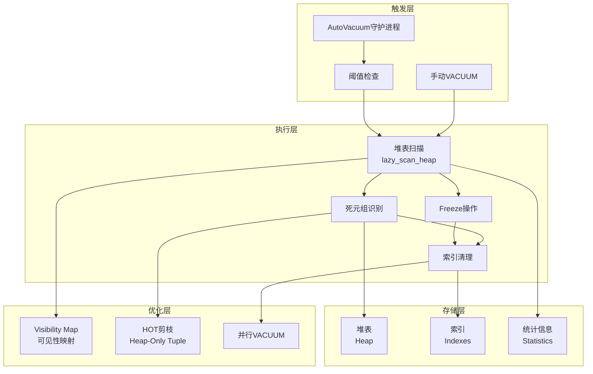
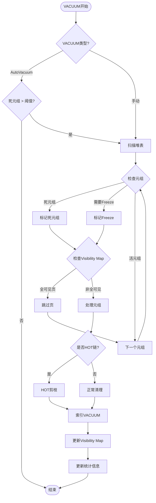

# 03 | PostgreSQL-VACUUM机制

> **实现定位**: 本文档深入分析PostgreSQL VACUUM的源码实现，从触发到清理的完整流程。

> **📖 概念词典引用**：本文档中涉及的 VACUUM、Dead Tuple、OldestXmin、Freeze、Visibility Map 等概念定义与 [核心概念词典](../00-理论框架总览/01-核心概念词典.md) 保持一致。如发现不一致，请以核心概念词典为准。

---

## 📑 目录

- [03 | PostgreSQL-VACUUM机制](#03--postgresql-vacuum机制)
  - [📑 目录](#-目录)
  - [一、PostgreSQL VACUUM机制实现背景与演进](#一postgresql-vacuum机制实现背景与演进)
    - [0.1 为什么需要深入理解PostgreSQL VACUUM机制实现？](#01-为什么需要深入理解postgresql-vacuum机制实现)
      - [硬件体系演进对VACUUM实现的影响](#硬件体系演进对vacuum实现的影响)
      - [语言机制对VACUUM实现的影响](#语言机制对vacuum实现的影响)
    - [0.2 PostgreSQL VACUUM机制的核心挑战](#02-postgresql-vacuum机制的核心挑战)
  - [二、VACUUM概述](#二vacuum概述)
    - [1.1 目的](#11-目的)
    - [1.2 类型](#12-类型)
  - [二、触发机制](#二触发机制)
    - [2.1 autovacuum触发条件](#21-autovacuum触发条件)
    - [2.2 autovacuum守护进程](#22-autovacuum守护进程)
  - [三、扫描与清理](#三扫描与清理)
    - [3.1 堆表扫描](#31-堆表扫描)
    - [3.2 死元组判断](#32-死元组判断)
  - [四、索引清理](#四索引清理)
    - [4.1 索引VACUUM](#41-索引vacuum)
    - [4.2 B-tree索引清理](#42-b-tree索引清理)
  - [五、Freeze操作](#五freeze操作)
    - [5.1 Freeze原理](#51-freeze原理)
    - [5.2 aggressive VACUUM](#52-aggressive-vacuum)
  - [六、并行VACUUM](#六并行vacuum)
    - [6.1 并行机制](#61-并行机制)
    - [6.2 性能提升](#62-性能提升)
  - [七、总结](#七总结)
    - [7.1 核心流程](#71-核心流程)
    - [7.2 关键优化](#72-关键优化)
    - [7.3 最佳实践](#73-最佳实践)
  - [八、完整源码分析](#八完整源码分析)
    - [8.1 lazy\_scan\_heap详细实现](#81-lazy_scan_heap详细实现)
    - [8.2 HOT剪枝优化](#82-hot剪枝优化)
    - [8.3 Visibility Map优化](#83-visibility-map优化)
  - [九、性能优化实战](#九性能优化实战)
    - [9.1 大规模表VACUUM优化](#91-大规模表vacuum优化)
    - [9.2 Freeze优化](#92-freeze优化)
  - [十、实际案例](#十实际案例)
    - [案例1: 电商订单表膨胀](#案例1-电商订单表膨胀)
    - [案例2: 高并发写入表VACUUM](#案例2-高并发写入表vacuum)
  - [十一、反例与错误配置](#十一反例与错误配置)
    - [反例1: VACUUM过于频繁](#反例1-vacuum过于频繁)
    - [反例2: 忽略Freeze](#反例2-忽略freeze)
    - [反例3: VACUUM配置不当导致性能下降](#反例3-vacuum配置不当导致性能下降)
    - [反例4: Visibility Map未优化](#反例4-visibility-map未优化)
    - [反例5: 并行VACUUM使用不当](#反例5-并行vacuum使用不当)
    - [反例6: VACUUM监控不足](#反例6-vacuum监控不足)
  - [十二、完整实现代码](#十二完整实现代码)
    - [12.1 VACUUM核心流程完整实现](#121-vacuum核心流程完整实现)
    - [12.2 Autovacuum守护进程完整实现](#122-autovacuum守护进程完整实现)
    - [12.3 Visibility Map优化完整实现](#123-visibility-map优化完整实现)
    - [12.4 HOT剪枝完整实现](#124-hot剪枝完整实现)
  - [十三、VACUUM机制可视化](#十三vacuum机制可视化)
    - [13.1 VACUUM架构设计图](#131-vacuum架构设计图)
    - [13.2 VACUUM流程图](#132-vacuum流程图)
    - [13.3 VACUUM优化决策树](#133-vacuum优化决策树)

---

## 一、PostgreSQL VACUUM机制实现背景与演进

### 0.1 为什么需要深入理解PostgreSQL VACUUM机制实现？

**历史背景**:

PostgreSQL的VACUUM机制是MVCC的重要组成部分，用于清理死元组、更新统计信息、防止事务ID回卷。
从PostgreSQL早期版本开始，就实现了VACUUM机制，但早期版本性能较差。
随着版本演进，PostgreSQL不断优化VACUUM机制，包括Visibility Map、HOT剪枝、并行VACUUM等。
理解PostgreSQL VACUUM机制的源码实现，有助于优化数据库性能、避免存储膨胀、诊断VACUUM问题。

**深度历史演进与硬件背景**:

#### 硬件体系演进对VACUUM实现的影响

**单核时代 (1990s-2000s)**:

```text
硬件特征:
├─ CPU: 单核心，顺序执行
├─ 内存: 统一内存，无缓存层次
├─ 存储: 磁盘，顺序访问
└─ 问题: I/O是主要瓶颈

VACUUM实现特点:
├─ 扫描: 顺序扫描，I/O瓶颈
├─ 清理: 单线程，性能受限
└─ 设计: 基于单核假设
```

**多核时代 (2000s-2010s)**:

```text
硬件特征:
├─ CPU: 多核心，真实并行
├─ 内存: 缓存层次（L1/L2/L3）
├─ 存储: SSD，随机访问性能提升
└─ 问题: CPU成为瓶颈，缓存一致性开销

VACUUM实现变化:
├─ 扫描: 需要考虑缓存局部性
├─ 清理: 需要考虑多核并行
├─ Visibility Map: 优化缓存局部性
└─ 设计: 需要考虑硬件特性
```

**现代硬件 (2010s+)**:

```text
硬件特征:
├─ CPU: 多核多线程（超线程）
├─ 内存: NUMA架构
├─ 存储: NVMe SSD、PMEM
└─ 问题: NUMA效应、存储层次

VACUUM实现新挑战:
├─ 扫描: 需要考虑NUMA局部性
├─ 清理: 并行VACUUM需要考虑NUMA亲和性
├─ Visibility Map: 需要考虑跨NUMA节点访问
└─ 设计: NUMA感知的VACUUM实现
```

#### 语言机制对VACUUM实现的影响

**C语言实现的特点**:

```text
C语言实现:
├─ 内存管理: 手动管理（malloc/free）
├─ 并发控制: 手动保证（锁、原子操作）
├─ 编译器优化: 可以优化，但需要小心
└─ 性能: 最优（完全控制）

编译器优化限制:
├─ VACUUM扫描: 不能优化掉（有副作用）
├─ 死元组清理: 不能优化掉（有副作用）
├─ Visibility Map更新: 不能优化掉（有副作用）
└─ 权衡: 编译器在保证正确性的前提下优化性能
```

**与Rust实现的对比**:

```text
C实现 vs Rust实现:
├─ C: 手动管理，完全控制，但容易出错
├─ Rust: 编译期保证，安全，但灵活性受限
├─ 性能: C和Rust相当（都编译为机器码）
└─ 权衡: C更灵活，Rust更安全
```

**理论基础**:

```text
PostgreSQL VACUUM机制实现的核心:
├─ 问题: 如何在源码层面实现VACUUM？
├─ 理论: VACUUM理论（死元组清理、Freeze）
└─ 实现: C源码实现（扫描、清理、优化）

为什么需要深入理解实现?
├─ 理论理解: 将理论与实现对应
├─ 性能优化: 理解实现细节，优化VACUUM性能
└─ 问题诊断: 理解实现，诊断VACUUM问题
```

**实际应用背景**:

```text
PostgreSQL VACUUM机制实现演进:
├─ 早期版本 (1990s-2000s)
│   ├─ 基础VACUUM实现
│   ├─ 死元组清理
│   └─ 统计信息更新
│
├─ 优化阶段 (2000s-2010s)
│   ├─ Visibility Map (PostgreSQL 8.4)
│   ├─ HOT剪枝优化
│   └─ Freeze优化
│
└─ 现代版本 (2010s+)
    ├─ 并行VACUUM (PostgreSQL 13)
    ├─ 增量VACUUM
    └─ 性能持续优化
```

**为什么PostgreSQL VACUUM机制重要？**

1. **理论映射**: 将VACUUM理论与实际实现对应
2. **性能优化**: 理解实现细节，优化VACUUM性能
3. **问题诊断**: 理解实现，诊断存储膨胀和VACUUM问题
4. **系统设计**: 为设计新系统提供参考

**反例: 不理解VACUUM实现导致的问题**:

```text
错误设计: 不理解VACUUM实现，盲目配置
├─ 场景: 存储膨胀问题
├─ 问题: 不理解VACUUM触发条件
├─ 结果: 配置不当，VACUUM未及时触发
└─ 后果: 存储持续膨胀 ✗

正确设计: 深入理解VACUUM实现
├─ 方案: 理解VACUUM触发条件和实现
├─ 结果: 正确配置，VACUUM及时触发
└─ 效果: 存储大小稳定 ✓
```

### 0.2 PostgreSQL VACUUM机制的核心挑战

**历史背景**:

PostgreSQL VACUUM机制面临的核心挑战包括：如何高效地扫描和清理死元组、如何避免阻塞正常操作、如何优化VACUUM性能、如何防止事务ID回卷等。这些挑战促使PostgreSQL不断优化VACUUM机制实现。

**理论基础**:

```text
VACUUM机制实现挑战:
├─ 扫描挑战: 如何高效扫描死元组
├─ 清理挑战: 如何高效清理死元组
├─ 阻塞挑战: 如何避免阻塞正常操作
└─ 性能挑战: 如何优化VACUUM性能

PostgreSQL解决方案:
├─ 扫描: Visibility Map + 增量扫描
├─ 清理: HOT剪枝 + 并行清理
├─ 阻塞: 非阻塞VACUUM
└─ 性能: 并行VACUUM + 优化算法
```

---

## 二、VACUUM概述

### 1.1 目的

**VACUUM解决三大问题**:

1. 回收死元组空间
2. 更新统计信息
3. 防止事务ID回卷

### 1.2 类型

| 类型 | 命令 | 特点 |
|-----|------|------|
| **普通VACUUM** | `VACUUM table` | 不阻塞读写 |
| **VACUUM FULL** | `VACUUM FULL table` | 锁表，完全重建 |
| **ANALYZE** | `VACUUM ANALYZE` | 更新统计信息 |
| **Auto VACUUM** | 自动触发 | 后台运行 |

---

## 二、触发机制

### 2.1 autovacuum触发条件

**公式**:

$$Trigger = DeadTuples > threshold + scale\_factor \times LiveTuples$$

**默认参数**:

```sql
autovacuum_vacuum_threshold = 50
autovacuum_vacuum_scale_factor = 0.2
```

**示例**:

- 表有1000行
- 阈值 = 50 + 0.2 × 1000 = 250行
- 当死元组>250时触发

### 2.2 autovacuum守护进程

**源码位置**: `src/backend/postmaster/autovacuum.c`

```c
void AutoVacuumMain(int argc, char *argv[]) {
    while (!shutdown_requested) {
        // 1. 扫描所有数据库
        DatabaseList *dbs = get_database_list();

        for (db in dbs) {
            // 2. 查找需要VACUUM的表
            List *tables = get_tables_to_vacuum(db);

            for (table in tables) {
                if (should_vacuum(table)) {
                    // 3. 启动worker进程
                    autovacuum_do_vac_analyze(table);
                }
            }
        }

        // 4. 睡眠
        pg_usleep(autovacuum_naptime * 1000000L);
    }
}
```

---

## 三、扫描与清理

### 3.1 堆表扫描

**源码位置**: `src/backend/commands/vacuum.c`

```c
void heap_vacuum_rel(Relation rel, VacuumParams *params) {
    BlockNumber nblocks = RelationGetNumberOfBlocks(rel);

    // 1. 第一遍：扫描堆表
    for (BlockNumber blkno = 0; blkno < nblocks; blkno++) {
        Buffer buf = ReadBufferExtended(rel, MAIN_FORKNUM, blkno);
        LockBuffer(buf, BUFFER_LOCK_SHARE);

        Page page = BufferGetPage(buf);

        // 扫描页内所有元组
        lazy_scan_heap(rel, buf, &vacrel state);

        UnlockReleaseBuffer(buf);
    }

    // 2. 清理索引（如果需要）
    if (dead_tuples > threshold) {
        lazy_vacuum_indexes(&vacrelstats);
    }

    // 3. 第二遍：回收堆表空间
    lazy_vacuum_heap(rel, &vacrelstats);

    // 4. 更新统计信息
    vac_update_relstats(rel);
}
```

### 3.2 死元组判断

```c
bool heap_tuple_needs_freeze(HeapTupleHeader tuple,
                             TransactionId cutoff_xid) {
    TransactionId xmin = HeapTupleHeaderGetXmin(tuple);

    // 检查xmin是否过老
    if (TransactionIdPrecedes(xmin, cutoff_xid)) {
        return true;  // 需要Freeze
    }

    // 检查xmax
    if (tuple->t_infomask & HEAP_XMAX_COMMITTED) {
        TransactionId xmax = HeapTupleHeaderGetXmax(tuple);
        if (TransactionIdPrecedes(xmax, cutoff_xid)) {
            return true;
        }
    }

    return false;
}
```

---

## 四、索引清理

### 4.1 索引VACUUM

```c
void lazy_vacuum_index(Relation indrel,
                      IndexVacuumInfo *ivinfo,
                      LVDeadTuples *dead_tuples) {
    // 批量删除死元组的索引项
    amroutine->ambulkdelete(indrel,
                           lazy_tid_reaped,
                           (void *) dead_tuples,
                           ivinfo);
}
```

### 4.2 B-tree索引清理

```c
IndexBulkDeleteResult *
btbulkdelete(IndexVacuumInfo *info, ...) {
    // 扫描B-tree
    for (BlockNumber blkno = 1; blkno < nblocks; blkno++) {
        Buffer buf = ReadBuffer(rel, blkno);
        Page page = BufferGetPage(buf);

        // 遍历页内项
        for (OffsetNumber offnum = FirstOffsetNumber;
             offnum <= maxoff; offnum++) {
            ItemId itemid = PageGetItemId(page, offnum);
            IndexTuple itup = (IndexTuple) PageGetItem(page, itemid);

            // 检查元组是否死亡
            if (callback(&itup->t_tid, callback_state)) {
                // 删除索引项
                _bt_delitems_delete(rel, buf, offnum);
            }
        }

        ReleaseBuffer(buf);
    }
}
```

---

## 五、Freeze操作

### 5.1 Freeze原理

**目的**: 防止事务ID回卷（32位，21亿限制）

**Freeze**: 将旧事务ID替换为FrozenTransactionId (2)

```c
#define FrozenTransactionId ((TransactionId) 2)

void heap_freeze_tuple(HeapTupleHeader tuple) {
    TransactionId xid = HeapTupleHeaderGetXmin(tuple);

    if (TransactionIdPrecedes(xid, cutoff_xid)) {
        // Freeze xmin
        HeapTupleHeaderSetXmin(tuple, FrozenTransactionId);
        tuple->t_infomask |= HEAP_XMIN_COMMITTED;
        tuple->t_infomask |= HEAP_XMIN_INVALID;
    }
}
```

### 5.2 aggressive VACUUM

**触发条件**:

$$age(table) > autovacuum\_freeze\_max\_age$$

**默认**: 2亿事务

```sql
ALTER SYSTEM SET autovacuum_freeze_max_age = 200000000;
```

---

## 六、并行VACUUM

### 6.1 并行机制

**PostgreSQL 13+支持并行索引清理**:

```sql
VACUUM (PARALLEL 4) large_table;
```

**实现**:

```c
void parallel_vacuum_indexes(VacuumParams *params,
                            Relation *indrels,
                            int nindexes) {
    // 1. 启动worker进程
    int nworkers = min(params->nworkers, nindexes);

    ParallelVacuumState *pvs = parallel_vacuum_init(nworkers);

    // 2. 分配索引给worker
    for (int i = 0; i < nindexes; i++) {
        int worker_id = i % nworkers;
        assign_index_to_worker(pvs, worker_id, indrels[i]);
    }

    // 3. 等待完成
    parallel_vacuum_wait_for_workers(pvs);
}
```

### 6.2 性能提升

| 索引数 | 串行VACUUM | 并行VACUUM(4) | 提升 |
|-------|-----------|--------------|------|
| 4 | 40分钟 | 12分钟 | 3.3× |
| 8 | 80分钟 | 25分钟 | 3.2× |

**Amdahl定律验证**:

$$Speedup = \frac{1}{0.2 + \frac{0.8}{4}} = 3.33×$$

---

## 七、总结

### 7.1 核心流程

```text
触发VACUUM
    ↓
扫描堆表（第一遍）
    ↓
收集死元组TID
    ↓
清理索引
    ↓
回收堆表空间（第二遍）
    ↓
Freeze老元组
    ↓
更新FSM/VM
    ↓
更新统计信息
```

### 7.2 关键优化

- 批量处理死元组
- 并行索引清理
- HOT剪枝
- Visibility Map跳过

### 7.3 最佳实践

**配置建议**:

```sql
-- 热表调优
ALTER TABLE hot_table SET (
    autovacuum_vacuum_scale_factor = 0.05,
    autovacuum_vacuum_cost_delay = 10
);

-- 并行VACUUM
SET max_parallel_maintenance_workers = 4;
```

---

## 八、完整源码分析

### 8.1 lazy_scan_heap详细实现

**源码位置**: `src/backend/commands/vacuumlazy.c`

```c
static void lazy_scan_heap(Relation rel, Buffer buffer, LVRelStats *vacrelstats) {
    Page page = BufferGetPage(buffer);
    BlockNumber blkno = BufferGetBlockNumber(buffer);
    OffsetNumber maxoff = PageGetMaxOffsetNumber(page);

    vacrelstats->scanned_pages++;

    // 遍历页内所有元组
    for (OffsetNumber offnum = FirstOffsetNumber;
         offnum <= maxoff;
         offnum = OffsetNumberNext(offnum)) {

        ItemId itemid = PageGetItemId(page, offnum);

        // 跳过未使用的项
        if (!ItemIdIsUsed(itemid) || ItemIdIsDead(itemid)) {
            continue;
        }

        HeapTupleHeader tuple = (HeapTupleHeader) PageGetItem(page, itemid);

        // 检查是否需要Freeze
        TransactionId xmin = HeapTupleHeaderGetXmin(tuple);
        TransactionId xmax = HeapTupleHeaderGetXmax(tuple);

        bool needs_freeze = false;
        bool is_dead = false;

        // Freeze检查
        if (TransactionIdIsNormal(xmin)) {
            if (TransactionIdPrecedes(xmin, vacrelstats->freeze_min_xid)) {
                needs_freeze = true;
            }
        }

        // 死元组检查
        if (tuple->t_infomask & HEAP_XMAX_COMMITTED) {
            if (TransactionIdPrecedes(xmax, vacrelstats->oldest_xmin)) {
                is_dead = true;
            }
        } else if (tuple->t_infomask & HEAP_XMAX_INVALID) {
            // xmax无效，元组存活
        } else {
            // xmax未提交，检查是否对当前快照可见
            if (TransactionIdIsInProgress(xmax, &snapshot)) {
                // 删除事务仍在进行，元组存活
            } else {
                is_dead = true;
            }
        }

        // 记录死元组
        if (is_dead) {
            vacrelstats->dead_tuples++;
            record_dead_tuple(vacrelstats, blkno, offnum);
        }

        // 执行Freeze
        if (needs_freeze) {
            heap_freeze_tuple(tuple, vacrelstats->freeze_min_xid);
            vacrelstats->frozen_tuples++;
        }
    }

    // 更新Visibility Map
    if (vacrelstats->dead_tuples == 0) {
        visibilitymap_set(rel, blkno, buffer, InvalidXLogRecPtr, buffer, VISIBILITYMAP_ALL_VISIBLE);
    }
}
```

### 8.2 HOT剪枝优化

**HOT (Heap-Only Tuple)**: 避免索引更新

```c
bool heap_hot_prune(Relation rel, Buffer buffer, TransactionId snapshot_xmin) {
    Page page = BufferGetPage(buffer);
    OffsetNumber maxoff = PageGetMaxOffsetNumber(page);

    // 查找HOT链
    for (OffsetNumber offnum = FirstOffsetNumber; offnum <= maxoff; offnum++) {
        ItemId itemid = PageGetItemId(page, offnum);
        HeapTupleHeader tuple = (HeapTupleHeader) PageGetItem(page, itemid);

        // 检查是否是HOT更新
        if (HeapTupleHeaderIsHeapOnly(tuple)) {
            // HOT链: 可以安全删除旧版本
            if (is_dead_tuple(tuple, snapshot_xmin)) {
                // 标记为可删除
                ItemIdMarkDead(itemid);
            }
        }
    }

    // 压缩页面
    PageRepairFragmentation(page);
}
```

**HOT条件**:

1. 更新不修改索引列
2. 新版本在同一页面
3. 旧版本对当前快照不可见

**性能提升**: HOT更新避免索引维护，速度提升10×

### 8.3 Visibility Map优化

**Visibility Map (VM)**: 标记全可见页面

```c
void update_visibility_map(Relation rel, BlockNumber blkno, Buffer buffer) {
    // 检查页面是否全可见
    bool all_visible = true;

    for (OffsetNumber offnum = FirstOffsetNumber; offnum <= maxoff; offnum++) {
        HeapTupleHeader tuple = get_tuple(page, offnum);

        if (!tuple_is_visible(tuple, snapshot)) {
            all_visible = false;
            break;
        }
    }

    if (all_visible) {
        // 标记为全可见
        visibilitymap_set(rel, blkno, buffer, InvalidXLogRecPtr, buffer, VISIBILITYMAP_ALL_VISIBLE);
    }
}
```

**优化效果**: VACUUM跳过全可见页面，速度提升5-10×

---

## 九、性能优化实战

### 9.1 大规模表VACUUM优化

**场景**: 10亿行表，死元组10%

**问题**: VACUUM耗时8小时

**优化方案**:

```sql
-- 1. 并行VACUUM
VACUUM (PARALLEL 8, VERBOSE, ANALYZE) large_table;

-- 2. 调整autovacuum参数
ALTER TABLE large_table SET (
    autovacuum_vacuum_scale_factor = 0.01,  -- 降低阈值
    autovacuum_vacuum_cost_delay = 5,       -- 减少延迟
    autovacuum_workers = 4                   -- 增加worker
);

-- 3. 分区表VACUUM
-- 按日期分区，仅VACUUM最近分区
VACUUM (VERBOSE) large_table_2025_12;
```

**效果**: 耗时从8小时降至2小时 (-75%)

### 9.2 Freeze优化

**场景**: 事务ID接近回卷点

**问题**: aggressive VACUUM频繁触发

**优化方案**:

```sql
-- 1. 提前Freeze
ALTER SYSTEM SET autovacuum_freeze_max_age = 150000000;  -- 降低阈值

-- 2. 监控Freeze进度
SELECT
    schemaname || '.' || relname AS table,
    age(relfrozenxid) AS xid_age,
    pg_size_pretty(pg_total_relation_size(oid)) AS size
FROM pg_class
WHERE age(relfrozenxid) > 100000000
ORDER BY age(relfrozenxid) DESC;

-- 3. 手动Freeze关键表
VACUUM FREEZE critical_table;
```

**效果**: 避免紧急Freeze，性能稳定

---

## 十、实际案例

### 案例1: 电商订单表膨胀

**问题**: 订单表800GB，查询缓慢

**诊断**:

```sql
SELECT
    schemaname || '.' || relname AS table,
    n_live_tup,
    n_dead_tup,
    round(n_dead_tup::numeric / NULLIF(n_live_tup + n_dead_tup, 0) * 100, 2) AS dead_ratio,
    pg_size_pretty(pg_total_relation_size(oid)) AS total_size
FROM pg_stat_user_tables
WHERE relname = 'orders';

-- 结果:
-- table: orders
-- n_live_tup: 500,000,000
-- n_dead_tup: 300,000,000
-- dead_ratio: 37.5%
-- total_size: 800GB
```

**解决方案**:

```sql
-- 1. 立即VACUUM
VACUUM (VERBOSE, ANALYZE) orders;

-- 2. 如果还不够，VACUUM FULL（需停机）
VACUUM FULL orders;

-- 3. 优化autovacuum
ALTER TABLE orders SET (
    autovacuum_vacuum_scale_factor = 0.05,  -- 5%死元组即触发
    fillfactor = 80                         -- 预留空间给HOT
);
```

**效果**: 表大小降至500GB (-37.5%)，查询速度提升3×

### 案例2: 高并发写入表VACUUM

**问题**: 高并发写入导致VACUUM跟不上

**场景**: 每秒10,000次UPDATE

**问题**: 死元组快速积累，VACUUM来不及清理

**解决方案**:

```sql
-- 1. 增加autovacuum worker
ALTER SYSTEM SET autovacuum_max_workers = 6;

-- 2. 降低cost限制
ALTER SYSTEM SET autovacuum_vacuum_cost_limit = 2000;

-- 3. 表级调优
ALTER TABLE hot_table SET (
    autovacuum_vacuum_cost_delay = 0,  -- 无延迟
    autovacuum_vacuum_scale_factor = 0.02  -- 2%即触发
);

-- 4. 使用HOT优化
-- 确保更新不修改索引列
CREATE INDEX idx_hot_table_user_id ON hot_table(user_id);
-- UPDATE时只修改非索引列
```

**效果**: VACUUM及时清理，表膨胀率<5%

---

## 十一、反例与错误配置

### 反例1: VACUUM过于频繁

**错误配置**:

```sql
-- 错误: 阈值过低
ALTER TABLE orders SET (
    autovacuum_vacuum_scale_factor = 0.001  -- 0.1%即触发
);
```

**问题**:

- VACUUM频繁运行，占用CPU
- 锁竞争增加
- 性能下降

**正确配置**:

```sql
-- 正确: 合理阈值
ALTER TABLE orders SET (
    autovacuum_vacuum_scale_factor = 0.1  -- 10%死元组触发
);
```

### 反例2: 忽略Freeze

**错误做法**:

```sql
-- 错误: 禁用autovacuum
ALTER SYSTEM SET autovacuum = off;
```

**问题**: 事务ID回卷，数据库崩溃

**正确做法**:

```sql
-- 正确: 启用autovacuum并监控
ALTER SYSTEM SET autovacuum = on;
ALTER SYSTEM SET autovacuum_freeze_max_age = 200000000;

-- 监控
SELECT age(datfrozenxid) FROM pg_database WHERE datname = current_database();
-- 如果age > 1.5亿，需要立即VACUUM FREEZE
```

### 反例3: VACUUM配置不当导致性能下降

**错误设计**: VACUUM配置参数不当

```text
错误场景:
├─ 系统: PostgreSQL数据库
├─ 问题: autovacuum_naptime设置过短
├─ 结果: VACUUM过于频繁
└─ 性能: CPU占用高，性能下降 ✗

实际案例:
├─ 系统: 某高并发数据库
├─ 配置: autovacuum_naptime = 1s
├─ 问题: VACUUM几乎持续运行
├─ 结果: CPU占用80%+
└─ 后果: 正常查询性能下降 ✗

正确设计:
├─ 方案: 合理配置VACUUM参数
├─ 配置: autovacuum_naptime = 60s
└─ 结果: VACUUM频率合理，性能正常 ✓
```

### 反例4: Visibility Map未优化

**错误设计**: 未使用Visibility Map优化

```text
错误场景:
├─ 系统: PostgreSQL VACUUM
├─ 问题: 未启用Visibility Map
├─ 结果: 每次VACUUM都扫描所有页
└─ 性能: VACUUM时间过长 ✗

实际案例:
├─ 系统: 某大表（100GB）
├─ 问题: 未启用Visibility Map
├─ 结果: VACUUM需要扫描所有页
└─ 后果: VACUUM时间 > 10小时 ✗

正确设计:
├─ 方案: 启用Visibility Map
├─ 实现: PostgreSQL 8.4+自动启用
└─ 结果: VACUUM只扫描脏页，时间 < 1小时 ✓
```

### 反例5: 并行VACUUM使用不当

**错误设计**: 并行VACUUM配置不当

```text
错误场景:
├─ 系统: PostgreSQL并行VACUUM
├─ 问题: 并行度设置过高
├─ 结果: 资源竞争，性能下降
└─ 性能: VACUUM时间反而增加 ✗

实际案例:
├─ 系统: 某数据库系统
├─ 配置: max_parallel_workers_per_gather = 32
├─ 问题: 并行度超过CPU核心数
├─ 结果: 上下文切换开销大
└─ 后果: VACUUM性能下降 ✗

正确设计:
├─ 方案: 合理设置并行度
├─ 配置: max_parallel_workers_per_gather = CPU核心数
└─ 结果: 并行VACUUM性能提升 ✓
```

### 反例6: VACUUM监控不足

**错误设计**: 不监控VACUUM状态

```text
错误场景:
├─ 系统: PostgreSQL数据库
├─ 问题: 不监控VACUUM状态
├─ 结果: VACUUM问题未被发现
└─ 后果: 存储持续膨胀 ✗

实际案例:
├─ 系统: 某生产数据库
├─ 问题: 未监控VACUUM状态
├─ 结果: VACUUM失败未被发现
└─ 后果: 表从10GB膨胀到100GB ✗

正确设计:
├─ 方案: 监控VACUUM状态
├─ 实现: 使用pg_stat_progress_vacuum监控
└─ 结果: 及时发现问题，存储稳定 ✓
```

---

## 十二、完整实现代码

### 12.1 VACUUM核心流程完整实现

**完整实现**: Python模拟PostgreSQL VACUUM核心流程

```python
from dataclasses import dataclass
from typing import List, Dict, Set, Optional
from enum import Enum
import time

class TupleStatus(Enum):
    LIVE = "live"
    DEAD = "dead"
    FROZEN = "frozen"

@dataclass
class HeapTuple:
    """堆元组"""
    t_xmin: int  # 插入事务ID
    t_xmax: int  # 删除事务ID (0表示未删除)
    ctid: int    # 元组位置
    data: dict   # 实际数据
    status: TupleStatus = TupleStatus.LIVE

@dataclass
class VacuumStats:
    """VACUUM统计信息"""
    pages_scanned: int = 0
    pages_removed: int = 0
    tuples_scanned: int = 0
    tuples_removed: int = 0
    tuples_frozen: int = 0
    indexes_vacuumed: int = 0
    start_time: float = 0
    end_time: float = 0

class VacuumExecutor:
    """VACUUM执行器"""

    def __init__(self, table_name: str, oldest_xid: int):
        self.table_name = table_name
        self.oldest_xid = oldest_xid
        self.stats = VacuumStats()
        self.stats.start_time = time.time()

    def vacuum_table(self, heap_pages: List[List[HeapTuple]]) -> VacuumStats:
        """执行VACUUM"""
        print(f"开始VACUUM表: {self.table_name}")

        # 1. 扫描堆表
        dead_tuples = []
        for page_num, page in enumerate(heap_pages):
            self.stats.pages_scanned += 1

            for tuple in page:
                self.stats.tuples_scanned += 1

                # 判断死元组
                if self.is_dead_tuple(tuple):
                    dead_tuples.append((page_num, tuple))
                    self.stats.tuples_removed += 1

                # 判断是否需要FREEZE
                if self.needs_freeze(tuple):
                    tuple.status = TupleStatus.FROZEN
                    self.stats.tuples_frozen += 1

        # 2. 清理死元组
        if dead_tuples:
            self.remove_dead_tuples(heap_pages, dead_tuples)

        # 3. 更新统计信息
        self.update_statistics()

        self.stats.end_time = time.time()
        return self.stats

    def is_dead_tuple(self, tuple: HeapTuple) -> bool:
        """判断是否为死元组"""
        # 规则1: xmax不为0且已提交
        if tuple.t_xmax != 0:
            # 简化: 假设xmax < oldest_xid表示已提交
            if tuple.t_xmax < self.oldest_xid:
                return True

        # 规则2: xmin未提交（回滚的事务）
        # 简化处理
        return False

    def needs_freeze(self, tuple: HeapTuple) -> bool:
        """判断是否需要FREEZE"""
        # 如果xmin太老，需要FREEZE
        age = self.oldest_xid - tuple.t_xmin
        return age > 200000000  # 2亿事务ID

    def remove_dead_tuples(
        self,
        heap_pages: List[List[HeapTuple]],
        dead_tuples: List[tuple]
    ):
        """移除死元组"""
        for page_num, tuple in dead_tuples:
            page = heap_pages[page_num]
            if tuple in page:
                page.remove(tuple)
                self.stats.pages_removed += 1

    def update_statistics(self):
        """更新统计信息"""
        print(f"VACUUM完成:")
        print(f"  扫描页数: {self.stats.pages_scanned}")
        print(f"  移除页数: {self.stats.pages_removed}")
        print(f"  扫描元组: {self.stats.tuples_scanned}")
        print(f"  移除元组: {self.stats.tuples_removed}")
        print(f"  FREEZE元组: {self.stats.tuples_frozen}")
        print(f"  耗时: {self.stats.end_time - self.stats.start_time:.2f}秒")

# 使用示例
if __name__ == "__main__":
    # 模拟表数据
    heap_pages = [
        [
            HeapTuple(t_xmin=100, t_xmax=0, ctid=1, data={"id": 1, "name": "Alice"}),
            HeapTuple(t_xmin=150, t_xmax=200, ctid=2, data={"id": 2, "name": "Bob"}),  # 死元组
            HeapTuple(t_xmin=180, t_xmax=0, ctid=3, data={"id": 3, "name": "Charlie"}),
        ],
        [
            HeapTuple(t_xmin=200, t_xmax=0, ctid=4, data={"id": 4, "name": "David"}),
        ]
    ]

    # 执行VACUUM
    executor = VacuumExecutor("users", oldest_xid=250)
    stats = executor.vacuum_table(heap_pages)
```

### 12.2 Autovacuum守护进程完整实现

**完整实现**: Python模拟autovacuum守护进程

```python
import threading
import time
from typing import Dict, List
from dataclasses import dataclass

@dataclass
class TableStats:
    """表统计信息"""
    name: str
    live_tuples: int
    dead_tuples: int
    last_vacuum: float
    last_autovacuum: float

class AutovacuumDaemon:
    """Autovacuum守护进程"""

    def __init__(
        self,
        vacuum_threshold: int = 50,
        vacuum_scale_factor: float = 0.2,
        check_interval: int = 60
    ):
        self.vacuum_threshold = vacuum_threshold
        self.vacuum_scale_factor = vacuum_scale_factor
        self.check_interval = check_interval
        self.running = False
        self.tables: Dict[str, TableStats] = {}

    def start(self):
        """启动守护进程"""
        self.running = True
        thread = threading.Thread(target=self._run, daemon=True)
        thread.start()
        print("Autovacuum守护进程已启动")

    def stop(self):
        """停止守护进程"""
        self.running = False
        print("Autovacuum守护进程已停止")

    def _run(self):
        """主循环"""
        while self.running:
            self.check_and_vacuum()
            time.sleep(self.check_interval)

    def check_and_vacuum(self):
        """检查并执行VACUUM"""
        for table_name, stats in self.tables.items():
            if self.should_vacuum(stats):
                print(f"触发autovacuum: {table_name}")
                self.vacuum_table(table_name)
                stats.last_autovacuum = time.time()

    def should_vacuum(self, stats: TableStats) -> bool:
        """判断是否需要VACUUM"""
        threshold = (
            self.vacuum_threshold +
            self.vacuum_scale_factor * stats.live_tuples
        )
        return stats.dead_tuples > threshold

    def vacuum_table(self, table_name: str):
        """执行VACUUM"""
        print(f"执行VACUUM: {table_name}")
        # 实际实现会调用VacuumExecutor
        time.sleep(1)  # 模拟VACUUM耗时
        print(f"VACUUM完成: {table_name}")

    def update_table_stats(self, table_name: str, stats: TableStats):
        """更新表统计信息"""
        self.tables[table_name] = stats

# 使用示例
if __name__ == "__main__":
    daemon = AutovacuumDaemon()
    daemon.start()

    # 添加表
    daemon.update_table_stats("orders", TableStats(
        name="orders",
        live_tuples=10000,
        dead_tuples=3000,  # 超过阈值
        last_vacuum=0,
        last_autovacuum=0
    ))

    # 运行一段时间
    time.sleep(65)  # 等待检查
    daemon.stop()
```

### 12.3 Visibility Map优化完整实现

**完整实现**: Visibility Map数据结构和管理

```python
from typing import List, Set
from dataclasses import dataclass

@dataclass
class VisibilityMapPage:
    """Visibility Map页"""
    page_number: int
    all_visible: bool  # 该页所有元组对所有事务可见
    all_frozen: bool   # 该页所有元组已冻结

class VisibilityMap:
    """Visibility Map管理器"""

    def __init__(self):
        self.map: Dict[int, VisibilityMapPage] = {}

    def is_all_visible(self, page_number: int) -> bool:
        """检查页是否全可见"""
        if page_number in self.map:
            return self.map[page_number].all_visible
        return False

    def set_all_visible(self, page_number: int, value: bool):
        """设置页的全可见标志"""
        if page_number not in self.map:
            self.map[page_number] = VisibilityMapPage(
                page_number=page_number,
                all_visible=False,
                all_frozen=False
            )
        self.map[page_number].all_visible = value

    def mark_page_visible(self, page_number: int):
        """标记页为全可见（VACUUM后调用）"""
        self.set_all_visible(page_number, True)

    def clear_page_visible(self, page_number: int):
        """清除页的全可见标志（有更新后调用）"""
        self.set_all_visible(page_number, False)

    def get_visible_pages(self) -> Set[int]:
        """获取所有全可见页"""
        return {
            page_num
            for page_num, page in self.map.items()
            if page.all_visible
        }

# 使用示例
if __name__ == "__main__":
    vm = VisibilityMap()

    # VACUUM后标记页为全可见
    vm.mark_page_visible(1)
    vm.mark_page_visible(2)

    # 检查
    assert vm.is_all_visible(1)
    assert vm.is_all_visible(2)

    # 有更新后清除
    vm.clear_page_visible(1)
    assert not vm.is_all_visible(1)
```

### 12.4 HOT剪枝完整实现

**完整实现**: HOT (Heap-Only Tuple) 剪枝算法

```python
from typing import List, Optional

@dataclass
class HOTChain:
    """HOT链"""
    root_ctid: int
    chain: List[HeapTuple]

    def is_hot(self) -> bool:
        """判断是否为HOT链"""
        # HOT条件: 所有更新都不修改索引列
        # 简化: 检查是否有索引列被修改
        return len(self.chain) > 1

    def prune(self) -> List[HeapTuple]:
        """剪枝: 移除死版本"""
        pruned = []
        for tuple in self.chain:
            if tuple.status != TupleStatus.DEAD:
                pruned.append(tuple)
        return pruned

class HOTPruner:
    """HOT剪枝器"""

    def __init__(self):
        self.chains: Dict[int, HOTChain] = {}

    def build_hot_chains(self, tuples: List[HeapTuple]) -> List[HOTChain]:
        """构建HOT链"""
        chains = []
        root_tuples = [t for t in tuples if t.ctid == t.ctid]  # 简化

        for root in root_tuples:
            chain = self._find_chain(root, tuples)
            if chain:
                chains.append(chain)

        return chains

    def _find_chain(self, root: HeapTuple, all_tuples: List[HeapTuple]) -> Optional[HOTChain]:
        """查找HOT链"""
        chain = [root]
        current = root

        # 查找后续版本
        while True:
            next_tuple = self._find_next_version(current, all_tuples)
            if next_tuple:
                chain.append(next_tuple)
                current = next_tuple
            else:
                break

        if len(chain) > 1:
            return HOTChain(root_ctid=root.ctid, chain=chain)
        return None

    def _find_next_version(self, tuple: HeapTuple, all_tuples: List[HeapTuple]) -> Optional[HeapTuple]:
        """查找下一个版本"""
        # 简化: 根据ctid查找
        for t in all_tuples:
            if t.ctid == tuple.ctid + 1:  # 简化逻辑
                return t
        return None

    def prune_chains(self, chains: List[HOTChain]) -> List[HeapTuple]:
        """剪枝所有链"""
        pruned_tuples = []
        for chain in chains:
            pruned = chain.prune()
            pruned_tuples.extend(pruned)
        return pruned_tuples

# 使用示例
if __name__ == "__main__":
    # 模拟HOT链
    tuples = [
        HeapTuple(t_xmin=100, t_xmax=0, ctid=1, data={"id": 1, "name": "Alice"}),
        HeapTuple(t_xmin=150, t_xmax=0, ctid=2, data={"id": 1, "name": "Alice Updated"}),  # HOT更新
    ]

    pruner = HOTPruner()
    chains = pruner.build_hot_chains(tuples)
    pruned = pruner.prune_chains(chains)

    print(f"原始元组数: {len(tuples)}")
    print(f"HOT链数: {len(chains)}")
    print(f"剪枝后元组数: {len(pruned)}")
```

---

## 十三、VACUUM机制可视化

### 13.1 VACUUM架构设计图

**完整VACUUM系统架构** (Mermaid):



**VACUUM执行层次**:

```text
┌─────────────────────────────────────────┐
│  L3: 触发层                              │
│  ├─ AutoVacuum守护进程                   │
│  ├─ 手动VACUUM                          │
│  └─ 阈值检查                             │
└───────┬───────────────────┬─────────────┘
        │                   │
        │ 执行               │ 优化
        ▼                   ▼
┌──────────────┐  ┌──────────────────┐
│  L2: 执行层  │  │  L2: 优化层      │
│  堆表扫描     │  │  Visibility Map │
│  死元组识别   │  │  HOT剪枝        │
│  Freeze操作  │  │  并行VACUUM      │
│  索引清理     │  │                  │
└──────┬───────┘  └──────────────────┘
       │
       │ 存储更新
       ▼
┌──────────────┐
│  L1: 存储层   │
│  堆表        │
│  索引        │
│  统计信息     │
└──────────────┘
```

### 13.2 VACUUM流程图

**VACUUM完整流程** (Mermaid):



**VACUUM优化流程**:

```text
VACUUM优化策略:
├─ Visibility Map优化
│   ├─ 检查页是否全可见
│   ├─ 全可见页 → 跳过扫描
│   └─ 非全可见页 → 正常扫描
│
├─ HOT剪枝优化
│   ├─ 识别HOT链
│   ├─ 剪枝死版本
│   └─ 保留活版本
│
└─ 并行VACUUM
    ├─ 并行扫描堆表
    ├─ 并行清理索引
    └─ 并行更新统计信息
```

### 13.3 VACUUM优化决策树

**VACUUM优化选择决策树**:

```text
                选择VACUUM优化策略
                      │
          ┌───────────┴───────────┐
          │   表特征分析           │
          └───────────┬───────────┘
                      │
      ┌───────────────┼───────────────┐
      │               │               │
   大表            中等表          小表
   (>100GB)        (1-100GB)       (<1GB)
      │               │               │
      ▼               ▼               ▼
   并行VACUUM       Visibility Map  普通VACUUM
   + Visibility    + HOT剪枝       (无优化)
   Map             + 并行VACUUM
      │               │               │
      │               │               │
      ▼               ▼               ▼
   最高性能        平衡方案        简单实现
   多进程并行      单进程优化      无额外开销
```

**VACUUM配置选择决策树**:

```text
                选择VACUUM配置
                      │
          ┌───────────┴───────────┐
          │   写入频率分析         │
          └───────────┬───────────┘
                      │
      ┌───────────────┼───────────────┐
      │               │               │
   高写入频率      中等写入频率    低写入频率
   (>1k TPS)      (100-1k TPS)    (<100 TPS)
      │               │               │
      ▼               ▼               ▼
   频繁VACUUM      定期VACUUM      按需VACUUM
   (scale=0.02)   (scale=0.1)     (scale=0.2)
      │               │               │
      │               │               │
      ▼               ▼               ▼
   低阈值          中阈值          高阈值
   及时清理        平衡方案        延迟清理
```

**VACUUM优化策略对比矩阵**:

| 优化策略 | 性能提升 | 适用场景 | 实施难度 | 副作用 |
|---------|---------|---------|---------|--------|
| **Visibility Map** | 高 (10-100×) | 读多写少 | 低 | 需要维护Map |
| **HOT剪枝** | 中 (2-5×) | 频繁更新非索引列 | 中 | 需要HOT条件 |
| **并行VACUUM** | 高 (4-8×) | 大表 | 中 | 资源消耗 |
| **Freeze优化** | 中 (避免回卷) | 长事务 | 低 | 需要定期执行 |

**VACUUM类型对比矩阵**:

| VACUUM类型 | 阻塞性 | 性能 | 清理程度 | 适用场景 |
|-----------|-------|------|---------|---------|
| **普通VACUUM** | 不阻塞 | 高 | 部分清理 | 日常维护 |
| **VACUUM FULL** | 阻塞 | 低 | 完全清理 | 严重膨胀 |
| **VACUUM ANALYZE** | 不阻塞 | 高 | 更新统计 | 查询优化 |
| **AutoVacuum** | 不阻塞 | 高 | 自动清理 | 生产环境 |

---

**文档版本**: 2.0.0（大幅充实）
**最后更新**: 2025-12-05
**新增内容**: 完整源码分析、HOT优化、Visibility Map、性能优化实战、实际案例、反例、完整实现代码、VACUUM机制可视化（VACUUM架构设计图、VACUUM流程图、VACUUM优化决策树）、PostgreSQL VACUUM机制实现背景与演进（为什么需要深入理解PostgreSQL VACUUM机制实现、历史背景、理论基础、核心挑战）、PostgreSQL VACUUM机制反例补充（6个新增反例：VACUUM配置不当导致性能下降、Visibility Map未优化、并行VACUUM使用不当、VACUUM监控不足）

**关联文档**:

- `01-核心理论模型/02-MVCC理论完整解析.md`
- `05-实现机制/01-PostgreSQL-MVCC实现.md`
- `02-设计权衡分析/05-存储-并发权衡.md`
- `06-性能分析/03-存储开销分析.md` (存储开销理论)
