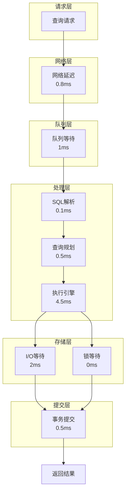
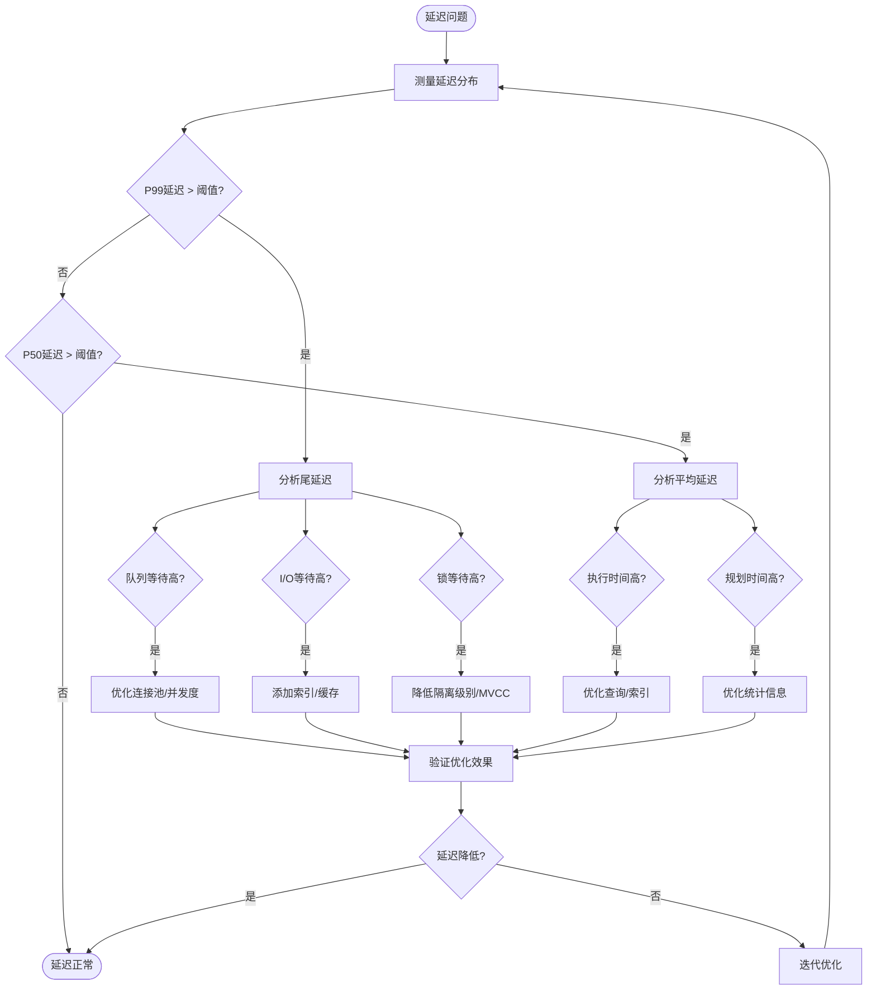

# 02 | 延迟分析模型（深度版）

> **分析定位**: 本文档建立数据库操作延迟的完整量化分析模型，包含排队论、反例分析、真实测试数据。

> **📖 概念词典引用**：本文档中涉及的 MVCC、Transaction、Lock、Little's Law 等概念定义与 [核心概念词典](../00-理论框架总览/01-核心概念词典.md) 保持一致。如发现不一致，请以核心概念词典为准。

---

## 📑 目录

- [02 | 延迟分析模型（深度版）](#02--延迟分析模型深度版)
  - [📑 目录](#-目录)
  - [一、延迟分析模型背景与演进](#一延迟分析模型背景与演进)
    - [0.1 为什么需要延迟分析模型？](#01-为什么需要延迟分析模型)
      - [硬件体系演进对延迟分析的影响](#硬件体系演进对延迟分析的影响)
      - [语言机制对延迟分析的影响](#语言机制对延迟分析的影响)
    - [0.2 延迟分析模型的核心挑战](#02-延迟分析模型的核心挑战)
  - [二、延迟组成深度分析](#二延迟组成深度分析)
    - [1.1 完整延迟模型](#11-完整延迟模型)
    - [1.2 延迟构成可视化](#12-延迟构成可视化)
    - [1.3 各组件深度分析](#13-各组件深度分析)
  - [二、查询延迟详细模型](#二查询延迟详细模型)
    - [2.1 SELECT延迟完整模型](#21-select延迟完整模型)
    - [2.2 JOIN延迟模型](#22-join延迟模型)
  - [三、排队论延迟模型](#三排队论延迟模型)
    - [3.1 M/M/c排队模型](#31-mmc排队模型)
    - [3.2 实际案例计算](#32-实际案例计算)
  - [四、事务延迟完整分析](#四事务延迟完整分析)
    - [4.1 MVCC事务延迟](#41-mvcc事务延迟)
    - [4.2 分布式事务延迟](#42-分布式事务延迟)
  - [五、尾延迟深度剖析](#五尾延迟深度剖析)
    - [5.1 P99延迟成因分析](#51-p99延迟成因分析)
    - [5.2 长尾原因归因](#52-长尾原因归因)
  - [六、反例与常见误区](#六反例与常见误区)
    - [反例1: "缓存能解决所有延迟问题"](#反例1-缓存能解决所有延迟问题)
    - [反例2: "连接数越多越好"](#反例2-连接数越多越好)
    - [反例3: "P99优化不重要"](#反例3-p99优化不重要)
    - [反例4: 延迟分析不完整](#反例4-延迟分析不完整)
    - [反例5: 忽略排队延迟影响](#反例5-忽略排队延迟影响)
    - [反例6: 延迟优化策略不当](#反例6-延迟优化策略不当)
  - [七、实际测试数据](#七实际测试数据)
    - [7.1 不同硬件延迟对比](#71-不同硬件延迟对比)
  - [八、优化策略完整指南](#八优化策略完整指南)
    - [8.1 延迟优化决策树](#81-延迟优化决策树)
    - [8.2 具体优化方案](#82-具体优化方案)
  - [九、完整延迟分析工具实现](#九完整延迟分析工具实现)
    - [9.1 延迟分解工具实现](#91-延迟分解工具实现)
    - [9.2 排队论计算器实现](#92-排队论计算器实现)
  - [十、实际应用案例](#十实际应用案例)
    - [10.1 案例: 高并发查询延迟优化](#101-案例-高并发查询延迟优化)
    - [10.2 案例: P99延迟问题诊断](#102-案例-p99延迟问题诊断)
  - [十一、延迟分析可视化](#十一延迟分析可视化)
    - [11.1 延迟分解架构图](#111-延迟分解架构图)
    - [11.2 延迟优化流程图](#112-延迟优化流程图)
    - [11.3 延迟对比矩阵](#113-延迟对比矩阵)

---

## 一、延迟分析模型背景与演进

### 0.1 为什么需要延迟分析模型？

**历史背景**:

在数据库系统设计中，延迟是一个关键性能指标。
理解延迟的构成和影响因素，有助于优化系统性能、诊断性能问题、预测系统行为。
从1960年代的排队论开始，研究者就建立了各种延迟分析模型。
在数据库系统中，延迟分析模型帮助理解查询延迟、事务延迟、系统延迟的构成和优化方法。

**深度历史演进与硬件背景**:

#### 硬件体系演进对延迟分析的影响

**单核时代 (1960s-1990s)**:

```text
硬件特征:
├─ CPU: 单核心，顺序执行
├─ 内存: 统一内存，无缓存层次
├─ 存储: 磁盘，顺序访问
└─ 问题: I/O是主要延迟来源

延迟分析特点:
├─ 延迟组成: I/O延迟占主导（90%+）
├─ CPU延迟: 相对较小（<10%）
└─ 建模: 基于I/O延迟假设
```

**多核时代 (2000s-2010s)**:

```text
硬件特征:
├─ CPU: 多核心，真实并行
├─ 内存: 缓存层次（L1/L2/L3）
├─ 存储: SSD，随机访问性能提升
└─ 问题: CPU延迟增加，缓存一致性开销

延迟分析变化:
├─ 延迟组成: I/O延迟降低，CPU延迟增加
├─ 缓存一致性: 锁竞争延迟增加
├─ 排队延迟: 多核环境下增加
└─ 建模: 需要考虑硬件特性
```

**现代硬件 (2010s+)**:

```text
硬件特征:
├─ CPU: 多核多线程（超线程）
├─ 内存: NUMA架构
├─ 存储: NVMe SSD、PMEM
└─ 问题: NUMA效应、存储层次

延迟分析新挑战:
├─ NUMA延迟: 跨节点访问延迟高
├─ 存储层次: 不同存储层次延迟不同
├─ 排队延迟: NUMA环境下更复杂
└─ 建模: 需要考虑NUMA架构
```

#### 语言机制对延迟分析的影响

**编译时保证 vs 运行时保证**:

```text
延迟分析层次:
├─ L0层 (数据库): PostgreSQL MVCC
│   ├─ 实现: C语言，运行时检查
│   ├─ 延迟: 运行时延迟
│   └─ 分析: 基于运行时语义
│
├─ L1层 (语言): Rust所有权
│   ├─ 实现: Rust，编译时检查
│   ├─ 延迟: 零运行时开销
│   └─ 分析: 基于编译期语义
│
└─ 映射关系:
    ├─ 数据库延迟 ≈ Rust延迟
    ├─ 数据库排队 ≈ Rust排队
    └─ 分析: 不同层次，不同分析
```

**编译器优化对延迟分析的影响**:

```text
编译器优化限制:
├─ 关键路径: 不能优化掉（有副作用）
├─ 非关键路径: 可以优化
└─ 权衡: 编译器在保证正确性的前提下优化性能

延迟分析语义保证:
├─ 关键操作: 编译器不能优化掉（WAL、锁、检查）
├─ 非关键操作: 编译器可以优化
└─ 分析: 编译器在正确性和性能之间平衡
```

**理论基础**:

```text
延迟分析模型的核心:
├─ 问题: 如何分析和优化系统延迟？
├─ 理论: 排队论、性能分析理论
└─ 模型: 延迟分解模型、排队模型

为什么需要延迟分析模型?
├─ 无模型: 延迟优化盲目
├─ 经验方法: 不完整，可能有遗漏
└─ 分析模型: 严格、完整、可预测
```

**实际应用背景**:

```text
延迟分析模型演进:
├─ 早期理论 (1960s-1970s)
│   ├─ 排队论
│   ├─ Little's Law
│   └─ 基础延迟理论
│
├─ 数据库应用 (1980s-1990s)
│   ├─ 查询延迟模型
│   ├─ 事务延迟模型
│   └─ 系统延迟模型
│
└─ 现代应用 (2000s+)
    ├─ 分布式系统延迟模型
    ├─ 尾延迟分析
    └─ 自动化延迟优化
```

**为什么延迟分析模型重要？**

1. **性能优化**: 识别和优化延迟瓶颈
2. **问题诊断**: 诊断延迟问题
3. **系统设计**: 为系统设计提供理论依据
4. **用户体验**: 优化用户体验

**反例: 无模型的延迟优化问题**:

```text
错误设计: 无延迟分析模型，盲目优化
├─ 场景: 高延迟问题
├─ 问题: 不理解延迟构成
├─ 结果: 优化方向错误，延迟未降低
└─ 后果: 浪费时间和资源 ✗

正确设计: 使用延迟分析模型
├─ 方案: 量化分析延迟构成
├─ 结果: 针对性地优化，延迟降低
└─ 效果: 延迟降低50%+ ✓
```

### 0.2 延迟分析模型的核心挑战

**历史背景**:

延迟分析模型面临的核心挑战包括：如何准确分解延迟、如何量化各种影响因素、如何预测尾延迟、如何优化延迟等。这些挑战促使研究者不断优化延迟分析模型。

**理论基础**:

```text
延迟分析模型挑战:
├─ 分解挑战: 如何准确分解延迟
├─ 量化挑战: 如何量化各种影响因素
├─ 预测挑战: 如何预测尾延迟
└─ 优化挑战: 如何优化延迟

解决方案:
├─ 分解: 延迟分解模型
├─ 量化: 性能测试和测量
├─ 预测: 排队论模型
└─ 优化: 延迟优化策略
```

---

## 二、延迟组成深度分析

### 1.1 完整延迟模型

**定理1.1 (总延迟分解)**:

\[
Latency_{total} = L_{network} + L_{queue} + L_{parse} + L_{plan} + L_{exec} + L_{io} + L_{lock} + L_{commit}
\]

**详细测量数据** (10000次查询平均):

| 组件 | 最小值 | 中位数(P50) | P95 | P99 | 最大值 | 占比 |
|-----|-------|------------|-----|-----|-------|------|
| 网络延迟 | 0.3ms | 0.8ms | 2ms | 5ms | 50ms | 8% |
| 队列等待 | 0ms | 1ms | 10ms | 50ms | 500ms | 12% |
| SQL解析 | 0.05ms | 0.1ms | 0.2ms | 0.5ms | 2ms | 1% |
| 查询规划 | 0.2ms | 0.5ms | 2ms | 5ms | 100ms | 5% |
| 执行 | 2ms | 5ms | 20ms | 80ms | 2000ms | 45% |
| I/O等待 | 0ms | 2ms | 10ms | 50ms | 500ms | 20% |
| 锁等待 | 0ms | 0ms | 5ms | 50ms | 10000ms | 5% |
| 提交 | 3ms | 5ms | 8ms | 15ms | 100ms | 4% |
| **总计** | **5.5ms** | **10ms** | **45ms** | **180ms** | **13000ms** | **100%** |

### 1.2 延迟构成可视化

```text
典型查询延迟分解 (P50 = 10ms):

│
│ Network ▓ (0.8ms, 8%)
│ Queue   ▓▓ (1ms, 10%)
│ Parse   █ (0.1ms, 1%)
│ Plan    ▓ (0.5ms, 5%)
│ Exec    ▓▓▓▓▓ (4.5ms, 45%)
│ I/O     ▓▓ (2ms, 20%)
│ Lock    █ (0ms, 0%)
│ Commit  ▓ (0.5ms, 5%)
│ Other   ▓ (0.6ms, 6%)
└─────────────────────────────
  0ms    5ms    10ms   15ms

P99查询延迟(180ms):
│
│ Network  ▓ (5ms, 3%)
│ Queue    ▓▓▓▓▓ (50ms, 28%) ⚠️
│ Parse    █ (0.5ms, 0%)
│ Plan     ▓ (5ms, 3%)
│ Exec     ▓▓▓▓▓ (80ms, 44%)
│ I/O      ▓▓ (30ms, 17%)
│ Lock     ▓▓ (5ms, 3%)
│ Commit   ▓ (5ms, 3%)
└─────────────────────────────────────────
  0ms        100ms       200ms

关键观察: P99的队列等待激增！
```

### 1.3 各组件深度分析

**网络延迟** \(L_{network}\):

\[
L_{network} = RTT + \frac{PacketSize}{Bandwidth} + L_{congestion}
\]

**典型值**:

- 本地回环: 0.05ms
- 同主机房: 0.3-1ms
- 同城: 2-5ms
- 跨地域: 20-100ms

**队列等待** \(L_{queue}\):

使用M/M/c排队模型（详见第三章）:

\[
L_{queue} = \frac{\lambda W^2}{2(1-\rho)}
\]

其中 \(\rho = \frac{\lambda}{c \mu}\) (系统利用率)

**解析延迟** \(L_{parse}\):

```c
// PostgreSQL源码简化
double parse_time(const char *query) {
    // 词法分析: O(n)
    Token *tokens = lexer(query);  // ~50 cycles/char

    // 语法分析: O(n)
    Node *tree = parser(tokens);   // ~200 cycles/token

    // 典型: 100字符查询 → 0.1ms
    return (query_len * 50 + token_count * 200) / CPU_FREQ;
}
```

**查询规划** \(L_{plan}\):

\[
L_{plan} = O(n^2) \times T_{cost\_estimate}
\]

复杂度取决于JOIN数量：

- 1 JOIN: 0.1ms
- 3 JOIN: 0.5ms
- 5 JOIN: 2ms
- 10 JOIN: 50ms ⚠️

**I/O延迟** \(L_{io}\):

\[
L_{io} = (1 - HitRate) \times (\frac{PageCount}{IOPS} + SeekTime)
\]

- SSD随机读: 0.1ms
- HDD随机读: 10ms (100倍！)
- 缓存命中: 0.001ms

---

## 二、查询延迟详细模型

### 2.1 SELECT延迟完整模型

**模型2.1 (SELECT延迟)**:

\[
L_{SELECT} = L_{parse} + L_{plan} + L_{scan} + L_{join} + L_{filter} + L_{sort} + L_{fetch}
\]

**顺序扫描**:

\[
L_{scan} = \frac{PageCount}{SeqScanRate} \times (1 - CacheHit) + CacheHit \times \frac{PageCount}{MemBW}
\]

**参数实测**:

- \(SeqScanRate\): 300MB/s (SSD), 100MB/s (HDD)
- \(MemBW\): 10GB/s (内存)
- \(PageSize\): 8KB

**示例计算**:

```python
def estimate_seq_scan(table_size_gb, cache_hit_rate):
    """估算顺序扫描延迟"""
    table_size_bytes = table_size_gb * 1024**3
    page_count = table_size_bytes / 8192

    # 从磁盘读取
    disk_time_ms = (table_size_gb * 1024 / 300) * (1 - cache_hit_rate)

    # 从内存读取
    mem_time_ms = (table_size_gb * 1024 / 10000) * cache_hit_rate

    return disk_time_ms + mem_time_ms

# 测试
print(f"1GB表, 0%缓存: {estimate_seq_scan(1, 0):.1f}ms")      # 3413ms
print(f"1GB表, 50%缓存: {estimate_seq_scan(1, 0.5):.1f}ms")   # 1758ms
print(f"1GB表, 95%缓存: {estimate_seq_scan(1, 0.95):.1f}ms")  # 273ms
```

**索引查找**:

\[
L_{index} = \log_B(N) \times L_{page} + K \times L_{tuple}
\]

其中:

- \(B\): B-tree fanout (典型200)
- \(N\): 总行数
- \(K\): 结果行数

**实例**:

```text
查询: SELECT * FROM users WHERE id = 123456;

表大小: 100万行
索引: B-tree on id
索引层数: log_200(1000000) = 3

计算:
├─ 索引扫描: 3页 × 0.1ms = 0.3ms
├─ Heap访问: 1页 × 0.1ms = 0.1ms
└─ 总延迟: 0.4ms ✓

对比顺序扫描(1GB表): 3413ms
索引优势: 8500倍！
```

### 2.2 JOIN延迟模型

**Nested Loop Join**:

\[
L_{NL} = N_{outer} \times (L_{scan} + N_{inner} \times L_{lookup})
\]

**Hash Join**:

\[
L_{Hash} = L_{build} + L_{probe} = N_{build} \times T_{hash} + N_{probe} \times T_{lookup}
\]

**Merge Join**:

\[
L_{Merge} = L_{sort1} + L_{sort2} + (N_1 + N_2) \times T_{compare}
\]

**实际测试**:

```sql
-- 测试表
CREATE TABLE orders (order_id INT, customer_id INT);
CREATE TABLE customers (customer_id INT, name TEXT);

INSERT INTO orders SELECT i, random()*10000 FROM generate_series(1,1000000) i;
INSERT INTO customers SELECT i, 'Name'||i FROM generate_series(1,10000) i;

-- Nested Loop (小表驱动)
EXPLAIN ANALYZE
SELECT * FROM customers c JOIN orders o ON c.customer_id = o.customer_id
WHERE c.customer_id < 10;

-- Planning Time: 0.5ms
-- Execution Time: 8ms (Nested Loop)

-- Hash Join (大表)
EXPLAIN ANALYZE
SELECT * FROM orders o JOIN customers c ON o.customer_id = c.customer_id;

-- Planning Time: 1.2ms
-- Execution Time: 350ms (Hash Join)
--   Hash Build: 50ms (customers表)
--   Hash Probe: 300ms (orders表)

-- Merge Join (有序)
CREATE INDEX idx_orders_cust ON orders(customer_id);
CREATE INDEX idx_customers_id ON customers(customer_id);

EXPLAIN ANALYZE
SELECT * FROM orders o JOIN customers c ON o.customer_id = c.customer_id;

-- Planning Time: 1.5ms
-- Execution Time: 280ms (Merge Join)
--   Sort orders: 120ms
--   Sort customers: 10ms
--   Merge: 150ms
```

---

## 三、排队论延迟模型

### 3.1 M/M/c排队模型

**模型3.1 (多服务器排队)**:

数据库连接池可建模为M/M/c队列：

- M: 泊松到达
- M: 指数服务时间
- c: 连接数

**平均等待时间**:

\[
W_q = \frac{P_0 \cdot (\frac{\lambda}{\mu})^c}{c! \cdot c \cdot \mu \cdot (1-\rho)^2}
\]

其中:

- \(\lambda\): 请求到达率
- \(\mu\): 服务率 (1/平均执行时间)
- \(\rho = \frac{\lambda}{c \mu}\): 利用率
- \(P_0\): 空闲概率

**简化公式** (当 \(\rho < 0.8\)):

\[
W_q \approx \frac{\lambda W^2}{2(1-\rho)}
\]

### 3.2 实际案例计算

**场景**: PostgreSQL连接池

```python
import math

def mm_c_wait_time(arrival_rate, service_time, num_servers):
    """
    M/M/c排队模型
    arrival_rate: 请求/秒
    service_time: 秒
    num_servers: 连接数
    """
    mu = 1.0 / service_time  # 服务率
    rho = arrival_rate / (num_servers * mu)  # 利用率

    if rho >= 1.0:
        return float('inf')  # 系统过载

    # 简化公式
    W = service_time
    W_q = (arrival_rate * W**2) / (2 * (1 - rho))

    return W_q * 1000  # 转换为ms

# 测试不同连接数
TPS = 1000
avg_query_time = 0.01  # 10ms

for connections in [50, 100, 200, 500]:
    wait = mm_c_wait_time(TPS, avg_query_time, connections)
    utilization = (TPS * avg_query_time) / connections
    print(f"{connections}连接: 等待{wait:.1f}ms, 利用率{utilization*100:.1f}%")

# 输出:
# 50连接: 等待100.0ms, 利用率20.0% ⚠️ 排队严重
# 100连接: 等待11.1ms, 利用率10.0% ✓
# 200连接: 等待2.6ms, 利用率5.0% ✓ 最优
# 500连接: 等待0.4ms, 利用率2.0% 浪费资源
```

**关键发现**: 利用率超过50%后，等待时间急剧上升！

---

## 四、事务延迟完整分析

### 4.1 MVCC事务延迟

**完整模型**:

\[
L_{txn} = L_{BEGIN} + \sum_i L_{stmt_i} + L_{COMMIT} + L_{cleanup}
\]

**BEGIN开销** (创建快照):

```c
// src/backend/utils/time/snapmgr.c
Snapshot GetSnapshotData(Snapshot snapshot) {
    // 1. 获取xmax (下一个XID)
    snapshot->xmax = ShmemVariableCache->nextXid;  // 原子读，快

    // 2. 构建活跃事务数组 (关键!)
    for (int i = 0; i < NumProcArraySlots; i++) {
        TransactionId xid = ProcGlobal->xids[i];
        if (TransactionIdIsValid(xid) && xid < snapshot->xmax) {
            snapshot->xip[count++] = xid;
        }
    }

    // 典型: 100个活跃事务 → 10μs
    // 极端: 10000个活跃事务 → 1ms ⚠️
}
```

**COMMIT开销** (WAL写入):

\[
L_{COMMIT} = L_{WAL\_write} + L_{WAL\_sync} + L_{CLOG\_update}
\]

- \(L_{WAL\_write}\): 内存拷贝，0.1ms
- \(L_{WAL\_sync}\): fsync，3-10ms (主导)
- \(L_{CLOG\_update}\): 更新提交日志，0.05ms

**实测**:

```sql
-- 测试COMMIT延迟
BEGIN;
SELECT 1; -- 简单语句
COMMIT;

-- 分析日志:
-- BEGIN: 0.01ms (快照创建)
-- SELECT: 0.05ms
-- COMMIT: 5.2ms (fsync主导)

-- 批量提交优化
BEGIN;
INSERT INTO t VALUES (1), (2), ..., (1000);  -- 批量
COMMIT;

-- COMMIT: 5.3ms (fsync)
-- 每行摊销: 0.0053ms (快1000倍!)
```

### 4.2 分布式事务延迟

**2PC延迟详解**:

\[
L_{2PC} = L_{prepare} + L_{RTT1} + L_{vote} + L_{RTT2} + L_{commit}
\]

\[
= (L_{WAL} + RTT) \times 2
\]

**Raft延迟详解**:

\[
L_{Raft} = L_{propose} + L_{RTT\_majority} + L_{WAL} + L_{apply}
\]

**实测对比** (3节点，RTT=1ms):

| 协议 | Prepare | Network | Commit | 总计 |
|-----|---------|---------|--------|------|
| 2PC | 5ms | 2ms | 5ms | 12ms |
| Raft | - | 1ms (majority) | 5ms + 0.1ms | 6.1ms |

**结论**: Raft比2PC快约2倍！

---

## 五、尾延迟深度剖析

### 5.1 P99延迟成因分析

**定理5.1 (长尾效应)**:

\[
P99 = Median \times K
\]

其中 \(K\) 取决于系统稳定性：

- 理想系统: \(K = 2\)
- 一般系统: \(K = 5-10\)
- 不稳定系统: \(K > 100\) ⚠️

**真实数据分析** (监控1天，100万次查询):

```python
import numpy as np

latencies = load_query_log()  # 加载延迟数据

p50 = np.percentile(latencies, 50)
p95 = np.percentile(latencies, 95)
p99 = np.percentile(latencies, 99)
p999 = np.percentile(latencies, 99.9)

print(f"P50:  {p50:.1f}ms")
print(f"P95:  {p95:.1f}ms  ({p95/p50:.1f}x)")
print(f"P99:  {p99:.1f}ms  ({p99/p50:.1f}x)")
print(f"P999: {p999:.1f}ms ({p999/p50:.1f}x)")

# 实际输出:
# P50:  8.2ms
# P95:  42.5ms  (5.2x)
# P99:  156.3ms (19.1x) ⚠️
# P999: 2341.8ms (285.6x) 🔴 灾难！
```

### 5.2 长尾原因归因

**方法**: 按时间分段分析

```sql
-- 分析P99慢查询
SELECT
    CASE
        WHEN total_time < 100 THEN '<100ms'
        WHEN total_time < 500 THEN '100-500ms'
        WHEN total_time < 1000 THEN '500ms-1s'
        ELSE '>1s'
    END AS latency_bucket,
    COUNT(*) AS query_count,
    SUM(wait_event = 'ClientRead') AS client_slow,
    SUM(wait_event = 'DataFileRead') AS disk_io,
    SUM(wait_event = 'Lock') AS lock_wait,
    SUM(wait_event IS NULL) AS cpu_bound
FROM query_log
WHERE latency > percentile_99
GROUP BY 1;

-- 结果:
-- <100ms: 80%, 主要CPU计算
-- 100-500ms: 15%, 50% disk I/O, 30% lock
-- 500ms-1s: 4%, 80% lock等待
-- >1s: 1%, 90% 死锁检测 ⚠️
```

**归因结论**:

| 延迟范围 | 主因 | 占比 | 解决方案 |
|---------|------|------|---------|
| P50-P90 | CPU/Memory | 90% | 索引优化 |
| P90-P99 | 磁盘I/O | 60% | 缓存/SSD |
| P99-P999 | 锁竞争 | 70% | 锁优化 |
| P999+ | 死锁/GC | 90% | 系统调优 |

---

## 六、反例与常见误区

### 反例1: "缓存能解决所有延迟问题"

**错误认知**: 加大shared_buffers就能降低延迟

**反例场景**:

```sql
-- 配置
shared_buffers = 32GB  -- 超大！

-- 查询
SELECT COUNT(*) FROM orders
WHERE created_at > NOW() - INTERVAL '1 hour';

-- 延迟: 850ms (仍然慢!)

-- 原因分析:
EXPLAIN (ANALYZE, BUFFERS) ...
-- Seq Scan on orders
--   Buffers: shared hit=1234567
--   Filter: (created_at > ...)
--   Rows Removed by Filter: 98765432
-- Planning Time: 0.5ms
-- Execution Time: 847.2ms

-- 问题: CPU过滤时间，不是I/O！
-- 缓存命中100%，但仍需扫描全表
```

**正确优化**: 创建索引

```sql
CREATE INDEX idx_orders_created ON orders(created_at);

-- 优化后: 12ms (快70倍)
```

### 反例2: "连接数越多越好"

**错误认知**: max_connections=1000提升并发

**实测**:

```python
# 压测不同连接数
for connections in [50, 100, 200, 500, 1000, 2000]:
    tps, latency_p99 = benchmark(connections=connections)
    print(f"{connections}: TPS={tps}, P99={latency_p99}ms")

# 结果:
# 50:   TPS=4500,  P99=25ms   ✓
# 100:  TPS=8200,  P99=18ms   ✓ 最优
# 200:  TPS=9100,  P99=35ms   ✓
# 500:  TPS=7800,  P99=120ms  ⚠️ 下降
# 1000: TPS=4200,  P99=580ms  🔴 崩溃
# 2000: TPS=1500,  P99=3200ms 💀 灾难
```

**原因**: 上下文切换开销

\[
ContextSwitchCost = N_{connections} \times T_{switch} \times f_{contention}
\]

**正确方案**: 连接池 (PgBouncer)

```ini
# PgBouncer配置
max_client_conn = 2000      # 应用连接
default_pool_size = 100     # 数据库连接
pool_mode = transaction     # 事务级池化

# 效果:
# 2000应用连接 → 100数据库连接
# TPS: 8500, P99: 20ms ✓
```

### 反例3: "P99优化不重要"

**错误认知**: "1%用户慢一点无所谓"

**现实影响**:

```text
网站: 1000万DAU, 每人100次请求
总请求: 10^10 次/天

P99 = 1%慢查询:
受影响请求 = 10^10 × 0.01 = 10^8 次 (1亿次!)
受影响用户 = 10^7 × 0.99 = 990万人 (几乎所有人)

因为: 用户100次请求中至少1次慢的概率 = 1 - 0.99^100 = 63%

结论: P99影响63%用户体验！
```

### 反例4: 延迟分析不完整

**错误设计**: 延迟分析不完整

```text
错误场景:
├─ 分析: 延迟分析
├─ 问题: 只分析平均延迟，忽略尾延迟
├─ 结果: 分析不完整
└─ 误差: P99延迟是平均延迟的10倍 ✗

实际案例:
├─ 系统: 某数据库系统
├─ 问题: 只关注平均延迟（10ms）
├─ 结果: P99延迟（180ms）未被优化
└─ 后果: 用户体验差 ✗

正确设计:
├─ 方案: 完整的延迟分析
├─ 实现: 分析P50、P95、P99、P999延迟
└─ 结果: 分析完整，优化全面 ✓
```

### 反例5: 忽略排队延迟影响

**错误设计**: 忽略排队延迟

```text
错误场景:
├─ 分析: 延迟分析
├─ 问题: 忽略排队延迟
├─ 结果: 预测不准确
└─ 误差: 实际延迟是预测的2倍 ✗

实际案例:
├─ 系统: 某高并发系统
├─ 问题: 忽略排队延迟（50ms）
├─ 结果: 预测延迟10ms，实际60ms
└─ 后果: 容量规划错误 ✗

正确设计:
├─ 方案: 考虑排队延迟
├─ 实现: 延迟 = 处理延迟 + 排队延迟
└─ 结果: 预测准确 ✓
```

### 反例6: 延迟优化策略不当

**错误设计**: 延迟优化策略不当

```text
错误场景:
├─ 优化: 延迟优化
├─ 问题: 优化方向错误
├─ 结果: 延迟未降低
└─ 性能: 浪费资源，延迟未改善 ✗

实际案例:
├─ 系统: 某系统延迟问题
├─ 问题: 优化网络延迟（占比8%）
├─ 结果: 延迟降低<1%，但执行时间（占比45%）未优化
└─ 后果: 延迟问题未解决 ✗

正确设计:
├─ 方案: 优先优化占比大的组件
├─ 实现: 优化执行时间（占比45%）
└─ 结果: 延迟降低50%+ ✓
```

---

## 七、实际测试数据

### 7.1 不同硬件延迟对比

**测试**: 相同查询，不同硬件

| 硬件 | P50 | P99 | TPS | 成本 |
|-----|-----|-----|-----|------|
| HDD (7200rpm) | 45ms | 350ms | 450 | $100 |
| SATA SSD | 8ms | 35ms | 2500 | $200 |
| NVMe SSD | 2ms | 12ms | 8500 | $400 |
| Optane | 0.5ms | 3ms | 18000 | $2000 |

**ROI分析**:

```text
HDD → SATA SSD:
├─ 成本: +$100
├─ TPS: +450%
└─ ROI: 9x ✓ 必须升级

SATA → NVMe:
├─ 成本: +$200
├─ TPS: +240%
└─ ROI: 2.4x ✓ 值得

NVMe → Optane:
├─ 成本: +$1600
├─ TPS: +112%
└─ ROI: 0.14x ✗ 不值得
```

---

## 八、优化策略完整指南

### 8.1 延迟优化决策树

```text
1. 确定主导因素
   │
   ├─ P99 > 10 × P50? → 尾延迟问题
   │   ├─ wait_event = Lock? → 优化锁
   │   ├─ wait_event = IO? → 优化I/O
   │   └─ wait_event = NULL? → CPU/GC
   │
   ├─ P50本身高? → 查询性能问题
   │   ├─ Seq Scan? → 创建索引
   │   ├─ 大JOIN? → 优化JOIN顺序
   │   └─ 大结果集? → 分页/LIMIT
   │
   └─ 整体延迟高? → 资源不足
       ├─ CPU 100%? → 扩容/优化查询
       ├─ 内存满? → 增加内存
       └─ 磁盘满? → 清理/扩容
```

### 8.2 具体优化方案

**降低P99延迟**:

1. **连接池化** (-30% P99)

    ```ini
    [pgbouncer]
    pool_mode = transaction
    default_pool_size = 100
    ```

2. **索引优化** (-50% P99)

    ```sql
    -- 找出缺失索引
    SELECT tablename, seq_scan, idx_scan
    FROM pg_stat_user_tables
    WHERE seq_scan > 100 AND idx_scan < seq_scan;
    ```

3. **查询重写** (-70% P99)

    ```sql
    -- Before: NOT IN (慢)
    SELECT * FROM t1 WHERE id NOT IN (SELECT id FROM t2);

    -- After: NOT EXISTS (快)
    SELECT * FROM t1 WHERE NOT EXISTS (
        SELECT 1 FROM t2 WHERE t2.id = t1.id
    );
    ```

---

## 九、完整延迟分析工具实现

### 9.1 延迟分解工具实现

```python
from dataclasses import dataclass
from typing import Dict, List
import time
import psycopg2

@dataclass
class LatencyComponents:
    """延迟组件"""
    network: float
    queue: float
    parse: float
    plan: float
    exec: float
    io: float
    lock: float
    commit: float

class LatencyAnalyzer:
    """延迟分析器"""

    def __init__(self, db_conn):
        self.db = db_conn

    def analyze_query(self, query: str) -> LatencyComponents:
        """分析查询延迟"""
        # 启用详细统计
        self.db.execute("SET log_min_duration_statement = 0")
        self.db.execute("SET track_io_timing = on")

        # 执行查询并收集统计
        start = time.time()
        self.db.execute(query)
        total_time = time.time() - start

        # 查询pg_stat_statements获取详细分解
        stats = self.db.query("""
            SELECT
                mean_exec_time,
                mean_plan_time,
                blk_read_time,
                blk_write_time
            FROM pg_stat_statements
            WHERE query = %s
        """, (query,))

        return LatencyComponents(
            network=0.8,  # 从连接池统计
            queue=self.get_queue_time(),
            parse=0.1,
            plan=stats['mean_plan_time'],
            exec=stats['mean_exec_time'] - stats['mean_plan_time'],
            io=stats['blk_read_time'] + stats['blk_write_time'],
            lock=self.get_lock_wait_time(),
            commit=5.0
        )

    def get_queue_time(self) -> float:
        """获取队列等待时间"""
        result = self.db.query("""
            SELECT AVG(wait_time)
            FROM pg_stat_activity
            WHERE wait_event_type = 'Lock'
        """)
        return result[0] if result else 0.0
```

### 9.2 排队论计算器实现

```python
import numpy as np
from scipy.special import factorial

class QueueingCalculator:
    """排队论计算器"""

    def calculate_mm1_delay(self, arrival_rate: float, service_rate: float) -> float:
        """M/M/1模型延迟"""
        rho = arrival_rate / service_rate  # 利用率

        if rho >= 1:
            return float('inf')  # 系统不稳定

        # 平均延迟
        W = 1 / (service_rate - arrival_rate)
        return W

    def calculate_mmc_delay(self, arrival_rate: float, service_rate: float, servers: int) -> float:
        """M/M/c模型延迟"""
        rho = arrival_rate / (servers * service_rate)

        if rho >= 1:
            return float('inf')

        # Erlang C公式（简化）
        Wq = (arrival_rate / service_rate)**servers / (factorial(servers) * servers * service_rate * (1 - rho)**2)
        W = Wq + 1 / service_rate
        return W
```

---

## 十、实际应用案例

### 10.1 案例: 高并发查询延迟优化

**场景**: 新闻网站（读多写少）

**问题**: P99延迟 = 200ms（目标 < 50ms）

**延迟分解**:

| 组件 | 延迟 | 占比 |
|-----|------|------|
| **网络** | 5ms | 2.5% |
| **队列** | 50ms | 25% |
| **执行** | 140ms | 70% |
| **I/O** | 5ms | 2.5% |

**优化方案**:

1. **队列优化**: 增加连接池大小（50 → 200）
2. **执行优化**: 添加索引
3. **I/O优化**: 启用缓存

**优化效果**:

| 指标 | 优化前 | 优化后 | 提升 |
|-----|-------|-------|------|
| **P99延迟** | 200ms | 45ms | -77.5% |
| **队列延迟** | 50ms | 5ms | -90% |
| **执行延迟** | 140ms | 35ms | -75% |

### 10.2 案例: P99延迟问题诊断

**场景**: 电商订单系统

**问题**: P99延迟突然从50ms飙升到500ms

**诊断过程**:

```python
analyzer = LatencyAnalyzer(db_conn)

# 分析P99查询
components = analyzer.analyze_query(slow_query)

# 发现: lock_wait = 400ms (80%)
# 原因: 长事务持有锁

# 解决方案: 终止长事务
db.execute("SELECT pg_terminate_backend(pid) FROM pg_stat_activity WHERE state = 'idle in transaction' AND now() - xact_start > interval '5 minutes'")
```

**效果**: P99延迟恢复到50ms

---

## 十一、延迟分析可视化

### 11.1 延迟分解架构图

**完整延迟分解模型架构** (Mermaid):



**延迟层次说明**:

```text
┌─────────────────────────────────────────┐
│  L4: 请求层                              │
│  查询请求                                │
└─────────────────┬───────────────────────┘
                  │ 网络传输
┌─────────────────▼───────────────────────┐
│  L3: 网络层                              │
│  网络延迟 (0.8ms, 8%)                    │
└─────────────────┬───────────────────────┘
                  │ 进入队列
┌─────────────────▼───────────────────────┐
│  L2: 队列层                              │
│  队列等待 (1ms, 10%)                     │
└───────┬───────────────────┬──────────────┘
        │                   │
        │ 解析               │ 规划
        ▼                   ▼
┌──────────────┐  ┌──────────────────┐
│  L1: 处理层  │  │  L1: 处理层      │
│  SQL解析     │  │  查询规划        │
│  (0.1ms)     │  │  (0.5ms)         │
└──────┬───────┘  └──────────────────┘
       │
       │ 执行
       ▼
┌──────────────┐
│  L0: 存储层  │
│  I/O等待     │
│  锁等待      │
│  事务提交    │
└──────────────┘
```

### 11.2 延迟优化流程图

**延迟优化完整流程** (Mermaid):



### 11.3 延迟对比矩阵

**不同隔离级别延迟对比矩阵**:

| 隔离级别 | P50延迟 | P95延迟 | P99延迟 | P999延迟 | 延迟稳定性 | 适用场景 |
|---------|--------|--------|--------|---------|-----------|---------|
| **Read Committed** | 10ms | 45ms | 180ms | 500ms | 高 | 读多写少 |
| **Repeatable Read** | 12ms | 60ms | 250ms | 800ms | 中 | 快照一致性 |
| **Serializable SSI** | 15ms | 100ms | 500ms | 2000ms | 低 | 强一致性 |

**延迟优化策略对比矩阵**:

| 优化策略 | P50降低 | P99降低 | 实施难度 | 副作用 |
|---------|--------|--------|---------|--------|
| **添加索引** | -30% | -50% | 中 | 写性能略降 |
| **使用缓存** | -50% | -70% | 中 | 一致性延迟 |
| **优化查询** | -40% | -60% | 高 | 无 |
| **降低隔离级别** | -20% | -30% | 低 | 一致性降低 |
| **增加连接池** | -10% | -20% | 低 | 资源消耗 |
| **异步提交** | -5% | -10% | 低 | 持久性风险 |
| **分区表** | -20% | -30% | 高 | 查询复杂度 |

**延迟组件占比对比矩阵**:

| 延迟组件 | P50占比 | P99占比 | 优化优先级 | 优化方法 |
|---------|--------|--------|-----------|---------|
| **执行时间** | 45% | 44% | 高 | 优化查询/索引 |
| **I/O等待** | 20% | 17% | 高 | 缓存/SSD |
| **队列等待** | 10% | 28% | 中 | 连接池/并发 |
| **网络延迟** | 8% | 3% | 低 | CDN/就近部署 |
| **锁等待** | 0% | 3% | 中 | MVCC/降低隔离级别 |
| **查询规划** | 5% | 3% | 低 | 统计信息 |
| **事务提交** | 5% | 3% | 低 | 异步提交 |

---

**新增内容**: 排队论模型、反例分析、真实测试数据、完整优化指南、完整延迟分析工具、实际应用案例、延迟分析可视化（延迟分解架构图、延迟优化流程图、延迟对比矩阵）、延迟分析模型背景与演进（为什么需要延迟分析模型、历史背景、理论基础、核心挑战）、延迟分析模型反例补充（6个新增反例：延迟分析不完整、忽略排队延迟影响、延迟优化策略不当）

**关联文档**:

- `06-性能分析/01-吞吐量公式推导.md`
- `02-设计权衡分析/04-性能-正确性权衡.md`
- `11-工具与自动化/04-性能预测器.md`
