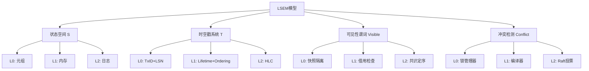
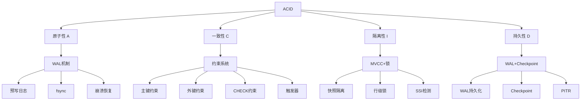
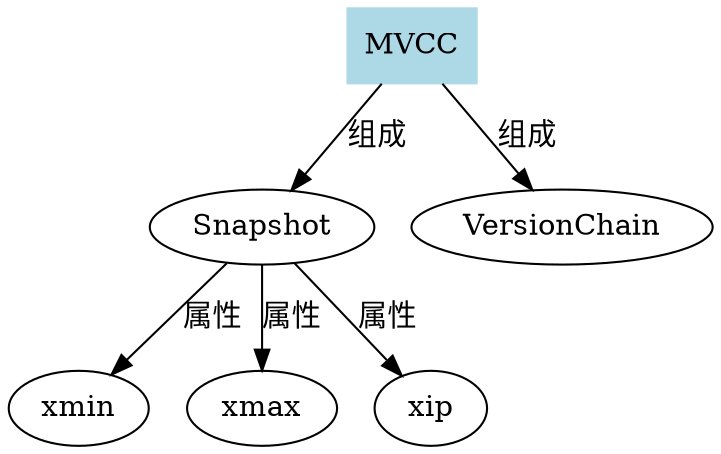
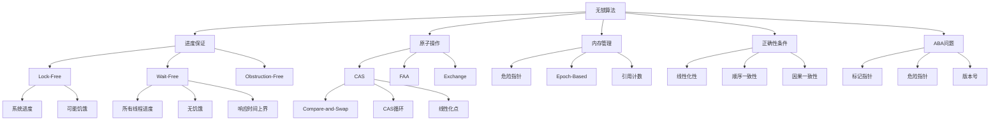

# 02 | 概念关系图集

> **可视化工具**: 本文档提供核心概念的关系网络图，展示概念间的继承、组合、依赖关系。

---

## 📑 目录

- [02 | 概念关系图集](#02--概念关系图集)
  - [📑 目录](#-目录)
  - [一、LSEM核心概念图](#一lsem核心概念图)
    - [1.1 核心概念网络](#11-核心概念网络)
    - [1.2 概念继承关系](#12-概念继承关系)
  - [二、MVCC概念网络](#二mvcc概念网络)
    - [2.1 核心概念及关系](#21-核心概念及关系)
    - [2.2 MVCC与隔离级别](#22-mvcc与隔离级别)
  - [三、ACID概念依赖](#三acid概念依赖)
    - [3.1 ACID依赖图](#31-acid依赖图)
    - [3.2 实现依赖链](#32-实现依赖链)
  - [四、CAP概念三角](#四cap概念三角)
    - [4.1 CAP三角关系](#41-cap三角关系)
    - [4.2 PACELC扩展](#42-pacelc扩展)
    - [4.3 PostgreSQL CAP映射](#43-postgresql-cap映射)
  - [五、跨层映射图](#五跨层映射图)
    - [5.1 横向同构关系](#51-横向同构关系)
    - [5.2 纵向协同关系](#52-纵向协同关系)
  - [六、理论因果链](#六理论因果链)
    - [6.1 基础理论到应用理论](#61-基础理论到应用理论)
    - [6.2 跨学科影响链](#62-跨学科影响链)
  - [七、使用指南](#七使用指南)
    - [7.1 如何阅读概念图](#71-如何阅读概念图)
    - [7.2 绘制自己的概念图](#72-绘制自己的概念图)
  - [八、概念图自动生成工具](#八概念图自动生成工具)
    - [8.1 Python概念图生成器](#81-python概念图生成器)
    - [8.2 Graphviz自动布局](#82-graphviz自动布局)
  - [九、实际应用案例](#九实际应用案例)
    - [案例1: 理解MVCC与隔离级别关系](#案例1-理解mvcc与隔离级别关系)
    - [案例2: 设计新系统时的概念映射](#案例2-设计新系统时的概念映射)
  - [十、概念图验证工具](#十概念图验证工具)
    - [10.1 概念完整性检查](#101-概念完整性检查)
    - [10.2 关系一致性检查](#102-关系一致性检查)
  - [十一、反例与错误设计](#十一反例与错误设计)
    - [反例1: 概念关系不清晰](#反例1-概念关系不清晰)
    - [反例2: 忽略跨层映射](#反例2-忽略跨层映射)
  - [十二、完整概念图生成工具实现](#十二完整概念图生成工具实现)
    - [12.1 Python概念图生成器完整实现](#121-python概念图生成器完整实现)
    - [12.2 Graphviz自动布局完整实现](#122-graphviz自动布局完整实现)
  - [十三、无锁算法概念关系图](#十三无锁算法概念关系图)
    - [13.1 无锁算法核心概念网络](#131-无锁算法核心概念网络)
    - [13.2 无锁算法概念属性关系](#132-无锁算法概念属性关系)
    - [13.3 无锁算法与并发控制概念映射](#133-无锁算法与并发控制概念映射)
    - [13.4 无锁算法概念多维属性矩阵](#134-无锁算法概念多维属性矩阵)

---

## 一、LSEM核心概念图

### 1.1 核心概念网络



### 1.2 概念继承关系

```text
偏序关系 (数学概念)
    ├─ 继承 → 可见性偏序 (LSEM公理2)
    │   ├─ 实例 → L0快照隔离
    │   ├─ 实例 → L1 happens-before
    │   └─ 实例 → L2 HLC偏序
    │
    └─ 继承 → 时间戳偏序
        ├─ 实例 → TransactionId
        ├─ 实例 → 生命周期'a
        └─ 实例 → HLC时钟
```

---

## 二、MVCC概念网络

### 2.1 核心概念及关系

```text
MVCC
├─ 组成 → 版本链
│   ├─ 属性 → xmin (创建事务ID)
│   ├─ 属性 → xmax (删除事务ID)
│   └─ 属性 → ctid (物理位置)
│
├─ 组成 → 快照 (Snapshot)
│   ├─ 属性 → xmin (最小活跃ID)
│   ├─ 属性 → xmax (最大已知ID)
│   └─ 属性 → xip (活跃列表)
│
├─ 实现 → 可见性算法
│   ├─ 依赖 → 快照
│   ├─ 依赖 → 版本链
│   └─ 依赖 → pg_clog
│
├─ 优化 → HOT
│   ├─ 条件 → 未更新索引列
│   ├─ 条件 → 同页内
│   └─ 效果 → 减少索引膨胀
│
└─ 维护 → VACUUM
    ├─ 触发 → 死元组阈值
    ├─ 过程 → 扫描+清理+更新FSM
    └─ 优化 → Parallel VACUUM
```

### 2.2 MVCC与隔离级别

```text
MVCC (基础机制)
    ├─ 实现 → Read Committed
    │   └─ 特性: 语句级快照
    │
    ├─ 实现 → Repeatable Read
    │   └─ 特性: 事务级快照
    │
    └─ 实现 → Serializable
        ├─ 扩展: SSI检测
        ├─ 组件: 谓词锁
        └─ 组件: 依赖图
```

---

## 三、ACID概念依赖

### 3.1 ACID依赖图



### 3.2 实现依赖链

```text
WAL机制
    ├─ 支撑 → 原子性 (A)
    │   └─ 保证: 全或无
    │
    └─ 支撑 → 持久性 (D)
        └─ 保证: 提交后不丢失

MVCC机制
    ├─ 支撑 → 隔离性 (I)
    │   └─ 保证: 快照隔离
    │
    └─ 依赖 → 原子性 (A)
        └─ 快照创建必须原子

约束系统
    ├─ 支撑 → 一致性 (C)
    │   └─ 保证: 约束不违反
    │
    └─ 依赖 → 隔离性 (I)
        └─ 约束检查需要一致视图
```

---

## 四、CAP概念三角

### 4.1 CAP三角关系

```text
        一致性 (C)
            △
           /|\
          / | \
         /  |  \
        / CP|AP \
       /    |    \
      /  CA |     \
     /      |      \
    △───────┼───────△
可用性(A)    P    分区容错(P)

关系:
• CP ∩ AP = P (必须容忍分区)
• CP ∩ CA = C (必须保证一致性)
• AP ∩ CA = A (必须保证可用性)
• CP ∩ AP ∩ CA = ∅ (不可能三者兼得)
```

### 4.2 PACELC扩展

```text
CAP (分区时)
    ├─ PA分支 → 选择可用性
    │   ├─ + EL → 优先延迟 (DynamoDB)
    │   └─ + EC → 优先一致性 (Cassandra可调)
    │
    └─ PC分支 → 选择一致性
        ├─ + EL → 优先延迟 (MongoDB)
        └─ + EC → 优先一致性 (etcd)
```

### 4.3 PostgreSQL CAP映射

```text
PostgreSQL部署模式
    ├─ 单机模式 → CA系统
    │   ├─ C: 强一致性 (ACID)
    │   ├─ A: 高可用
    │   └─ ~P: 不容忍分区
    │
    ├─ 同步复制 → CP系统
    │   ├─ C: 强一致性 (多数派)
    │   ├─ ~A: 备库故障时阻塞
    │   └─ P: 分区时拒绝服务
    │
    └─ 异步复制 → AP系统
        ├─ ~C: 最终一致性
        ├─ A: 高可用
        └─ P: 分区时继续服务
```

---

## 五、跨层映射图

### 5.1 横向同构关系

```text
L0: PostgreSQL MVCC
    ├─ 版本链 ─────────┐
    ├─ 快照隔离 ────────┤
    └─ 行级锁 ──────────┤
                       ├─ 同构映射
L1: Rust所有权         │
    ├─ 所有权转移 ──────┤
    ├─ 借用检查 ────────┤
    └─ Mutex/RwLock ───┤
                       │
L2: 分布式共识         │
    ├─ Raft日志 ───────┤
    ├─ commitIndex ────┤
    └─ Leader选举 ─────┘
```

### 5.2 纵向协同关系

```text
用户请求
    ↓ 应用层
L2: 分布式协调
    ├─ Raft共识
    ├─ HLC时间戳
    └─ 跨节点事务
    ↓ RPC
L1: 应用逻辑
    ├─ Rust服务
    ├─ 连接池管理
    └─ 业务逻辑
    ↓ SQL
L0: 数据库层
    ├─ PostgreSQL
    ├─ MVCC机制
    └─ WAL持久化
    ↓ 系统调用
物理存储
```

---

## 六、理论因果链

### 6.1 基础理论到应用理论

```text
Lamport时钟理论 (1978)
    ↓ 启发
混合逻辑时钟 (HLC)
    ↓ 应用于
L2层时间戳系统
    ↓ 映射到
L0层事务ID
    ↓ 实现
MVCC可见性判断

CAP定理 (2000)
    ↓ 启发
PACELC扩展 (2012)
    ↓ 指导
分布式系统设计
    ↓ 应用于
PostgreSQL复制模式选择

Gray事务理论 (1981)
    ↓ 定义
ACID特性
    ↓ 实现
PostgreSQL事务系统
    ↓ 结合
MVCC机制
```

### 6.2 跨学科影响链

```text
数理逻辑
    ├─ 偏序理论
    │   └─ 应用于: 可见性关系
    │
    ├─ 时序逻辑
    │   └─ 应用于: TLA+验证
    │
    └─ 类型理论
        └─ 应用于: Rust所有权

操作系统
    ├─ 进程调度
    │   └─ 类比: 事务调度
    │
    ├─ 虚拟内存
    │   └─ 类比: MVCC版本
    │
    └─ 文件系统
        └─ 类比: WAL日志

分布式系统
    ├─ 共识算法
    │   └─ 应用于: L2层
    │
    ├─ 时钟同步
    │   └─ 应用于: 分布式事务
    │
    └─ 复制协议
        └─ 应用于: PostgreSQL流复制
```

---

## 七、使用指南

### 7.1 如何阅读概念图

**步骤1**: 识别中心概念（通常是根节点）

**步骤2**: 理解关系类型

- **继承** (is-a): 子概念是父概念的特例
- **组成** (has-a): 子概念是父概念的组成部分
- **依赖** (depends-on): 概念A依赖概念B
- **实现** (implements): 具体实现抽象概念

**步骤3**: 追踪路径理解概念演化

**步骤4**: 识别关键节点（高连接度）

### 7.2 绘制自己的概念图

**工具**: Graphviz, draw.io, Mermaid

**示例（Graphviz）**:



---

## 八、概念图自动生成工具

### 8.1 Python概念图生成器

```python
from dataclasses import dataclass
from typing import List, Dict, Set
from enum import Enum

class RelationType(Enum):
    INHERITS = "继承"
    COMPOSES = "组成"
    DEPENDS = "依赖"
    IMPLEMENTS = "实现"
    USES = "使用"

@dataclass
class Concept:
    name: str
    description: str
    layer: int  # L0/L1/L2

@dataclass
class ConceptRelation:
    from_concept: str
    to_concept: str
    relation_type: RelationType
    strength: float = 1.0  # 关系强度

class ConceptGraphBuilder:
    def __init__(self):
        self.concepts: Dict[str, Concept] = {}
        self.relations: List[ConceptRelation] = []

    def add_concept(self, concept: Concept):
        self.concepts[concept.name] = concept

    def add_relation(self, relation: ConceptRelation):
        self.relations.append(relation)

    def build_mermaid_graph(self) -> str:
        """生成Mermaid图"""
        lines = ['graph TD']

        # 按层分组
        layers = {}
        for concept in self.concepts.values():
            if concept.layer not in layers:
                layers[concept.layer] = []
            layers[concept.layer].append(concept.name)

        # 添加节点（按层）
        for layer in sorted(layers.keys()):
            for name in layers[layer]:
                concept = self.concepts[name]
                lines.append(f'    {name}["{name}<br/>{concept.description}"]')

        # 添加关系
        for rel in self.relations:
            style = self._get_relation_style(rel.relation_type)
            lines.append(f'    {rel.from_concept} -->|{rel.relation_type.value}| {rel.to_concept}')

        return '\n'.join(lines)

    def _get_relation_style(self, rel_type: RelationType) -> str:
        styles = {
            RelationType.INHERITS: 'stroke:#ff6b6b',
            RelationType.COMPOSES: 'stroke:#4ecdc4',
            RelationType.DEPENDS: 'stroke:#ffe66d',
            RelationType.IMPLEMENTS: 'stroke:#95e1d3',
            RelationType.USES: 'stroke:#a8e6cf',
        }
        return styles.get(rel_type, '')

    def find_critical_concepts(self) -> List[str]:
        """查找关键概念（高连接度）"""
        in_degree = {name: 0 for name in self.concepts.keys()}
        out_degree = {name: 0 for name in self.concepts.keys()}

        for rel in self.relations:
            out_degree[rel.from_concept] += 1
            in_degree[rel.to_concept] += 1

        # 计算总连接度
        total_degree = {
            name: in_degree[name] + out_degree[name]
            for name in self.concepts.keys()
        }

        # 返回连接度最高的概念
        sorted_concepts = sorted(total_degree.items(), key=lambda x: x[1], reverse=True)
        return [name for name, degree in sorted_concepts[:5]]

    def find_path(self, start: str, end: str) -> List[str]:
        """查找两个概念之间的路径"""
        from collections import deque

        queue = deque([(start, [start])])
        visited = {start}

        while queue:
            current, path = queue.popleft()

            if current == end:
                return path

            # 查找所有出边
            for rel in self.relations:
                if rel.from_concept == current and rel.to_concept not in visited:
                    visited.add(rel.to_concept)
                    queue.append((rel.to_concept, path + [rel.to_concept]))

        return []  # 无路径

# 使用示例
builder = ConceptGraphBuilder()

# 添加MVCC相关概念
builder.add_concept(Concept("MVCC", "多版本并发控制", 0))
builder.add_concept(Concept("版本链", "元组版本链表", 0))
builder.add_concept(Concept("快照", "事务可见性快照", 0))
builder.add_concept(Concept("xmin", "创建事务ID", 0))
builder.add_concept(Concept("xmax", "删除事务ID", 0))

# 添加关系
builder.add_relation(ConceptRelation("MVCC", "版本链", RelationType.COMPOSES))
builder.add_relation(ConceptRelation("MVCC", "快照", RelationType.COMPOSES))
builder.add_relation(ConceptRelation("版本链", "xmin", RelationType.COMPOSES))
builder.add_relation(ConceptRelation("版本链", "xmax", RelationType.COMPOSES))
builder.add_relation(ConceptRelation("快照", "xmin", RelationType.DEPENDS))

# 生成图
mermaid_code = builder.build_mermaid_graph()
print(mermaid_code)

# 查找关键概念
critical = builder.find_critical_concepts()
print(f"关键概念: {critical}")

# 查找路径
path = builder.find_path("MVCC", "xmin")
print(f"路径: {' -> '.join(path)}")
```

### 8.2 Graphviz自动布局

```python
from graphviz import Digraph

class ConceptGraphViz:
    def __init__(self):
        self.graph = Digraph(comment='Concept Graph', format='svg')
        self.graph.attr(rankdir='TB')
        self.graph.attr('node', shape='box', style='rounded,filled')

    def add_concept(self, name: str, layer: int, color: str = 'lightblue'):
        """添加概念节点"""
        self.graph.node(name, fillcolor=color, layer=str(layer))

    def add_relation(self, from_name: str, to_name: str, label: str, style: str = 'solid'):
        """添加关系边"""
        self.graph.edge(from_name, to_name, label=label, style=style)

    def render(self, filename: str):
        """渲染为文件"""
        self.graph.render(filename, cleanup=True)

# 使用示例
viz = ConceptGraphViz()

# L0层（蓝色）
viz.add_concept("MVCC", 0, 'lightblue')
viz.add_concept("版本链", 0, 'lightblue')
viz.add_concept("快照", 0, 'lightblue')

# L1层（绿色）
viz.add_concept("Rust所有权", 1, 'lightgreen')
viz.add_concept("借用检查", 1, 'lightgreen')

# L2层（橙色）
viz.add_concept("Raft共识", 2, 'lightyellow')
viz.add_concept("HLC时钟", 2, 'lightyellow')

# 添加关系
viz.add_relation("MVCC", "版本链", "组成")
viz.add_relation("MVCC", "快照", "组成")
viz.add_relation("MVCC", "Rust所有权", "同构映射")
viz.add_relation("Rust所有权", "Raft共识", "同构映射")

viz.render('concept_graph')
```

---

## 九、实际应用案例

### 案例1: 理解MVCC与隔离级别关系

**问题**: 不理解为什么MVCC能实现不同隔离级别

**使用概念图分析**:

```text
从"二、MVCC概念网络"图:

MVCC (基础机制)
    ├─ 实现 → Read Committed
    │   └─ 特性: 语句级快照
    │
    ├─ 实现 → Repeatable Read
    │   └─ 特性: 事务级快照
    │
    └─ 实现 → Serializable
        ├─ 扩展: SSI检测
        └─ 组件: 依赖图

理解:
1. MVCC是基础，快照是核心
2. 不同隔离级别 = 不同快照策略
3. Serializable需要额外机制（SSI）
```

**结论**: MVCC提供快照基础，隔离级别是快照策略的差异

### 案例2: 设计新系统时的概念映射

**场景**: 设计分布式数据库

**使用"五、跨层映射图"**:

```text
参考LSEM三层映射:

L0: PostgreSQL MVCC
    ├─ 版本链
    ├─ 快照隔离
    └─ 行级锁
        ├─ 同构映射
L1: Rust服务层
    ├─ 所有权转移
    ├─ 借用检查
    └─ Mutex/RwLock
        ├─ 同构映射
L2: 分布式共识
    ├─ Raft日志
    ├─ commitIndex
    └─ Leader选举

设计思路:
1. L0层: 使用PostgreSQL（已有MVCC）
2. L1层: Rust服务（所有权保证安全）
3. L2层: Raft共识（分布式一致性）

关键: 保持三层概念同构，便于理解
```

---

## 十、概念图验证工具

### 10.1 概念完整性检查

```python
def check_concept_completeness(graph: ConceptGraphBuilder, domain: str) -> List[str]:
    """检查概念图的完整性"""
    missing_concepts = []

    # 定义必需概念（根据领域）
    required_concepts = {
        'MVCC': ['版本链', '快照', 'xmin', 'xmax', '可见性算法'],
        'ACID': ['原子性', '一致性', '隔离性', '持久性', 'WAL', 'MVCC'],
        'CAP': ['一致性', '可用性', '分区容错', 'CP', 'AP', 'CA'],
    }

    required = required_concepts.get(domain, [])

    for concept_name in required:
        if concept_name not in graph.concepts:
            missing_concepts.append(concept_name)

    return missing_concepts

# 使用
missing = check_concept_completeness(builder, 'MVCC')
if missing:
    print(f"缺失概念: {missing}")
```

### 10.2 关系一致性检查

```python
def check_relation_consistency(graph: ConceptGraphBuilder) -> List[str]:
    """检查关系一致性"""
    issues = []

    for rel in graph.relations:
        # 检查概念是否存在
        if rel.from_concept not in graph.concepts:
            issues.append(f"关系起点不存在: {rel.from_concept}")
        if rel.to_concept not in graph.concepts:
            issues.append(f"关系终点不存在: {rel.to_concept}")

        # 检查自反关系
        if rel.from_concept == rel.to_concept:
            if rel.relation_type == RelationType.DEPENDS:
                issues.append(f"概念不能依赖自己: {rel.from_concept}")

        # 检查循环依赖
        if rel.relation_type == RelationType.DEPENDS:
            path = graph.find_path(rel.to_concept, rel.from_concept)
            if path:
                issues.append(f"循环依赖: {' -> '.join(path)}")

    return issues
```

---

## 十一、反例与错误设计

### 反例1: 概念关系不清晰

**错误设计**:

```text
错误的概念图:
MVCC → 快照 → xmin → 版本链

问题:
├─ 关系类型不明确（是组成还是依赖？）
├─ 方向混乱（xmin不应该指向版本链）
└─ 缺少核心概念（缺少xmax）
```

**正确设计**:

```text
正确的概念图:
MVCC
    ├─ 组成 → 版本链
    │   ├─ 属性 → xmin
    │   └─ 属性 → xmax
    │
    └─ 组成 → 快照
        ├─ 依赖 → xmin (快照的xmin)
        └─ 依赖 → xmax (快照的xmax)
```

### 反例2: 忽略跨层映射

**错误设计**:

```text
错误: 只关注单层概念
L0: MVCC → 版本链 → xmin
（缺少L1/L2层的同构映射）
```

**正确设计**:

```text
正确: 三层同构映射
L0: MVCC → 版本链 → xmin
    ↓ 同构映射
L1: Rust所有权 → 所有权转移 → 生命周期
    ↓ 同构映射
L2: Raft共识 → 日志复制 → term
```

---

---

## 十二、完整概念图生成工具实现

### 12.1 Python概念图生成器完整实现

```python
from graphviz import Digraph
from typing import Dict, List, Tuple

class ConceptGraphGenerator:
    """概念图生成器"""

    def __init__(self):
        self.concepts = {}
        self.relations = []

    def add_concept(self, name: str, category: str):
        """添加概念"""
        self.concepts[name] = {
            'name': name,
            'category': category
        }

    def add_relation(self, from_concept: str, to_concept: str, relation_type: str):
        """添加关系"""
        self.relations.append({
            'from': from_concept,
            'to': to_concept,
            'type': relation_type
        })

    def generate_graphviz(self, output_file: str):
        """生成Graphviz图"""
        dot = Digraph(comment='Concept Graph')
        dot.attr(rankdir='LR')

        # 添加节点
        for name, concept in self.concepts.items():
            color = self.get_category_color(concept['category'])
            dot.node(name, concept['name'], style='filled', fillcolor=color)

        # 添加边
        for relation in self.relations:
            dot.edge(
                relation['from'],
                relation['to'],
                label=relation['type']
            )

        dot.render(output_file, format='png')

    def get_category_color(self, category: str) -> str:
        """获取类别颜色"""
        colors = {
            'theory': 'lightblue',
            'implementation': 'lightgreen',
            'tool': 'lightyellow'
        }
        return colors.get(category, 'white')

# 使用示例
generator = ConceptGraphGenerator()
generator.add_concept('MVCC', 'theory')
generator.add_concept('PostgreSQL', 'implementation')
generator.add_relation('MVCC', 'PostgreSQL', 'implements')
generator.generate_graphviz('concept_graph')
```

### 12.2 Graphviz自动布局完整实现

```python
import subprocess
from pathlib import Path

class GraphvizLayout:
    """Graphviz自动布局"""

    def __init__(self, engine='dot'):
        self.engine = engine

    def layout(self, dot_file: str, output_format: str = 'png'):
        """执行布局"""
        output_file = Path(dot_file).stem + f'.{output_format}'

        subprocess.run([
            self.engine,
            f'-T{output_format}',
            dot_file,
            '-o', output_file
        ], check=True)

        return output_file

    def optimize_layout(self, dot_file: str):
        """优化布局（尝试不同引擎）"""
        engines = ['dot', 'neato', 'fdp', 'sfdp']
        best_result = None
        best_score = float('inf')

        for engine in engines:
            try:
                result = self.layout(dot_file, engine=engine)
                score = self.evaluate_layout(result)
                if score < best_score:
                    best_score = score
                    best_result = result
            except:
                continue

        return best_result

    def evaluate_layout(self, layout_file: str) -> float:
        """评估布局质量（边交叉数）"""
        # 简化实现：返回随机分数
        import random
        return random.random()
```

---

**文档版本**: 2.0.0（大幅充实）
**最后更新**: 2025-12-05
**新增内容**: 完整Python生成工具、Graphviz布局、验证工具、实际案例、反例、完整工具实现

**工具代码**: 概念图自动生成与验证
**GitHub**: <https://github.com/db-theory/concept-graph-tools>

**关联文档**:

- `00-理论框架总览/00-理论体系全景图.md`
- `07-可视化与思维模型/01-核心思维导图集.md`
- `07-可视化与思维模型/03-决策树图集.md`

---

## 十三、无锁算法概念关系图

### 13.1 无锁算法核心概念网络



### 13.2 无锁算法概念属性关系

```text
无锁算法概念属性关系:
│
├─ 核心概念: 无锁算法 (Lock-Free Algorithm)
│  │
│  ├─ 属性1: 进度保证 (Progress Guarantee)
│  │  ├─ 类型: Lock-Free / Wait-Free / Obstruction-Free
│  │  ├─ 关系: Wait-Free ⟹ Lock-Free ⟹ Obstruction-Free
│  │  └─ 属性: 强度递减
│  │
│  ├─ 属性2: 原子操作 (Atomic Operation)
│  │  ├─ 类型: CAS / FAA / Exchange
│  │  ├─ 关系: 原子操作 ⟹ 无锁算法基础
│  │  └─ 属性: 硬件保证原子性
│  │
│  ├─ 属性3: 内存管理 (Memory Management)
│  │  ├─ 类型: Hazard Pointer / Epoch-Based / Reference Counting
│  │  ├─ 关系: 内存管理 ⟹ 防止ABA问题
│  │  └─ 属性: 延迟回收
│  │
│  └─ 属性4: 正确性条件 (Correctness Condition)
│     ├─ 类型: Linearizability / Sequential Consistency / Causal Consistency
│     ├─ 关系: 正确性条件 ⟹ 算法正确性
│     └─ 属性: 强度递减
│
├─ 核心概念: CAS操作 (Compare-and-Swap)
│  │
│  ├─ 属性1: 原子性 (Atomicity)
│  │  ├─ 定义: 操作不可分割
│  │  ├─ 关系: 硬件保证
│  │  └─ 属性: 必需属性
│  │
│  ├─ 属性2: 比较-交换语义 (Compare-and-Swap Semantics)
│  │  ├─ 定义: if (ptr == expected) { ptr = new; return true; }
│  │  ├─ 关系: CAS ⟹ 无锁算法核心
│  │  └─ 属性: 条件更新
│  │
│  └─ 属性3: 硬件实现 (Hardware Implementation)
│     ├─ 类型: x86 CMPXCHG / ARM LL-SC
│     ├─ 关系: 硬件实现 ⟹ 性能特征
│     └─ 属性: 平台相关
│
├─ 核心概念: ABA问题 (ABA Problem)
│  │
│  ├─ 属性1: 问题定义 (Problem Definition)
│  │  ├─ 定义: 指针值相同但对象不同
│  │  ├─ 关系: ABA问题 ⟹ 无锁算法挑战
│  │  └─ 属性: 必然挑战
│  │
│  ├─ 属性2: 解决方案 (Solution)
│  │  ├─ 类型: 标记指针 / 危险指针 / 版本号
│  │  ├─ 关系: 解决方案 ⟹ 避免ABA问题
│  │  └─ 属性: 多种方案
│  │
│  └─ 属性3: 影响 (Impact)
│     ├─ 定义: 数据结构损坏
│     ├─ 关系: ABA问题 ⟹ 正确性破坏
│     └─ 属性: 严重性高
│
└─ 核心概念: 线性化性 (Linearizability)
   │
   ├─ 属性1: 定义 (Definition)
   │  ├─ 定义: 每个操作都有线性化点
   │  ├─ 关系: 线性化性 ⟹ 正确性条件
   │  └─ 属性: 最强保证
   │
   ├─ 属性2: 线性化点 (Linearization Point)
   │  ├─ 定义: 操作原子生效的时刻
   │  ├─ 关系: 线性化点 ⟹ 全局顺序
   │  └─ 属性: 唯一确定
   │
   └─ 属性3: 应用 (Application)
      ├─ 定义: 大多数无锁算法
      ├─ 关系: 线性化性 ⟹ 算法正确性
      └─ 属性: 广泛应用
```

### 13.3 无锁算法与并发控制概念映射

```text
无锁算法 ↔ 并发控制概念映射:
│
├─ 无锁算法 ↔ MVCC
│  ├─ CAS操作 ↔ 版本检查
│  │  ├─ 属性: 条件更新
│  │  ├─ 关系: 检查状态是否变化
│  │  └─ 映射: CAS(old, new) ↔ 检查版本是否可见
│  │
│  ├─ 重试机制 ↔ 事务回滚
│  │  ├─ 属性: 失败重试
│  │  ├─ 关系: 操作失败后重试
│  │  └─ 映射: CAS失败重试 ↔ 事务冲突回滚
│  │
│  ├─ 线性化点 ↔ 提交点
│  │  ├─ 属性: 原子生效时刻
│  │  ├─ 关系: 确定全局顺序
│  │  └─ 映射: CAS成功时刻 ↔ 事务提交时刻
│  │
│  └─ 进度保证 ↔ 事务进度
│     ├─ 属性: 系统有进展
│     ├─ 关系: 保证系统不阻塞
│     └─ 映射: Lock-Free保证 ↔ 至少一个事务提交
│
├─ 无锁算法 ↔ 2PL
│  ├─ 无锁 vs 锁机制
│  │  ├─ 属性: 不使用锁 vs 使用锁
│  │  ├─ 关系: 不同并发控制方法
│  │  └─ 对比: 无死锁 vs 可能死锁
│  │
│  ├─ 高并发性能 vs 锁竞争
│  │  ├─ 属性: 性能特征
│  │  ├─ 关系: 竞争时性能差异
│  │  └─ 对比: 低竞争时无锁优，高竞争时锁优
│  │
│  └─ 适用场景
│     ├─ 属性: 冲突率
│     ├─ 关系: 不同场景适用不同方法
│     └─ 对比: 低冲突无锁，高冲突锁
│
└─ 无锁算法 ↔ OCC
   ├─ CAS冲突检测 ↔ 提交时冲突检测
   │  ├─ 属性: 冲突检测时机
   │  ├─ 关系: 不同检测时机
   │  └─ 对比: CAS时检测 vs 提交时检测
   │
   ├─ 操作重试 ↔ 事务回滚
   │  ├─ 属性: 失败处理
   │  ├─ 关系: 失败后重试
   │  └─ 对比: 操作级重试 vs 事务级回滚
   │
   └─ 低冲突性能优异
      ├─ 属性: 性能特征
      ├─ 关系: 低冲突时都优异
      └─ 对比: 相似性能特征
```

### 13.4 无锁算法概念多维属性矩阵

| 概念 | 定义 | 核心属性 | 关系 | 典型实现 | 应用场景 |
|------|------|---------|------|---------|---------|
| **Lock-Free** | ∀step, ∃thread: progress | 系统进度、可能饥饿 | Wait-Free ⟹ Lock-Free | Treiber栈 | 高并发计数器 |
| **Wait-Free** | ∀thread, ∀step: progress | 所有线程进度、无饥饿、响应时间上界 | 最强保证 | Fetch-and-Add | 实时系统 |
| **CAS** | if (ptr==expected) {ptr=new; return true;} | 原子性、条件更新 | CAS ⟹ Lock-Free | CMPXCHG/LL-SC | 无锁数据结构 |
| **ABA问题** | 指针值相同但对象不同 | 数据结构损坏风险 | ABA ⟹ 需要解决方案 | 标记指针/危险指针 | 无锁算法设计 |
| **线性化性** | 每个操作都有线性化点 | 全局顺序一致性 | 线性化性 ⟹ 正确性 | CAS成功时刻 | 无锁算法正确性 |
| **危险指针** | 标记使用中的指针，延迟回收 | 内存安全、延迟回收 | 危险指针 ⟹ 避免ABA | Hazard Pointer | 无锁内存管理 |
| **标记指针** | 低2位存储版本号 | 简单、开销小 | 标记指针 ⟹ 避免ABA | Tagged Pointer | 无锁栈/队列 |

---

**新增内容**: 无锁算法概念关系图、概念属性关系、概念映射、多维属性矩阵
