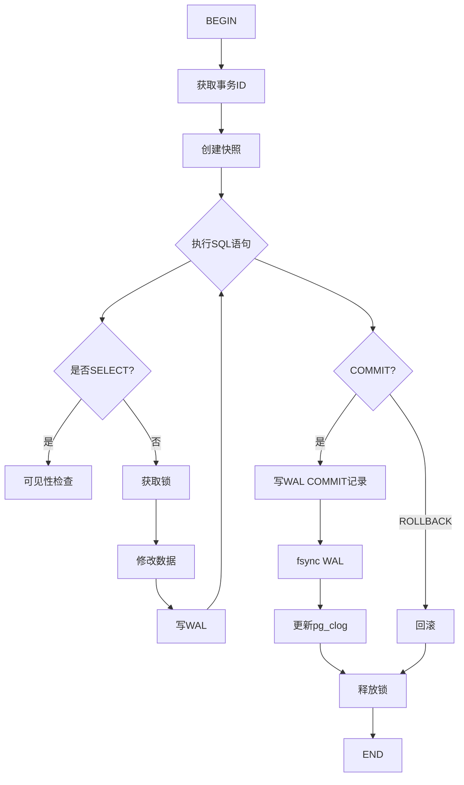
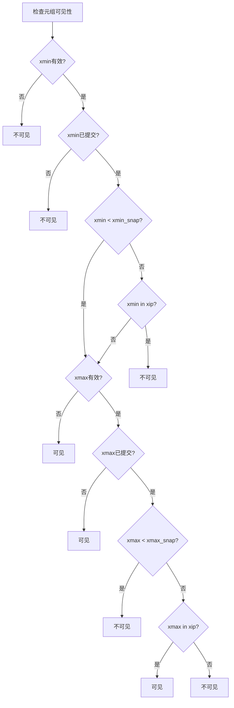
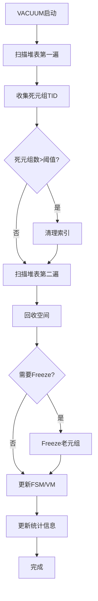
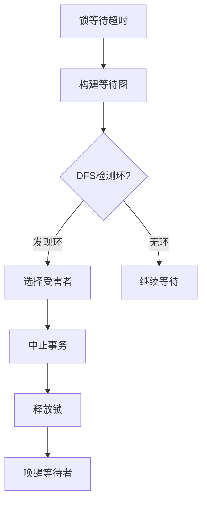
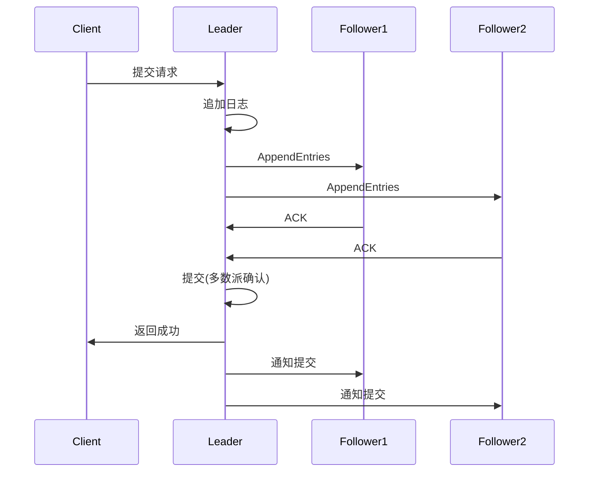

# 04 | 流程图集

> **可视化工具**: 本文档汇总核心流程图，展示系统运行流程和状态转换。

---

## 📑 目录

- [04 | 流程图集](#04--流程图集)
  - [📑 目录](#-目录)
  - [一、事务执行流程](#一事务执行流程)
  - [二、MVCC可见性检查流程](#二mvcc可见性检查流程)
  - [三、VACUUM执行流程](#三vacuum执行流程)
  - [四、死锁检测流程](#四死锁检测流程)
  - [五、Raft共识流程](#五raft共识流程)
  - [六、完整实现代码](#六完整实现代码)
    - [6.1 事务执行流程实现](#61-事务执行流程实现)
    - [6.2 MVCC可见性检查实现](#62-mvcc可见性检查实现)
    - [6.3 死锁检测流程实现](#63-死锁检测流程实现)
  - [七、流程图生成工具](#七流程图生成工具)
    - [7.1 Python流程图生成器](#71-python流程图生成器)
  - [八、实际应用案例](#八实际应用案例)
    - [案例1: 调试事务异常](#案例1-调试事务异常)
    - [案例2: 优化VACUUM](#案例2-优化vacuum)

---

## 一、事务执行流程



---

## 二、MVCC可见性检查流程



---

## 三、VACUUM执行流程



---

## 四、死锁检测流程



---

## 五、Raft共识流程



---

---

## 六、完整实现代码

### 6.1 事务执行流程实现

```python
class TransactionExecutor:
    """事务执行器（对应流程图）"""

    def execute_transaction(self, sql_statements):
        """
        执行事务的完整流程
        对应"一、事务执行流程"图
        """
        conn = self.get_connection()

        try:
            # Step 1: BEGIN
            xid = self.begin_transaction(conn)
            snapshot = self.create_snapshot()

            # Step 2: 执行SQL语句
            for stmt in sql_statements:
                if stmt.type == 'SELECT':
                    # 可见性检查分支
                    result = self.execute_select(stmt, snapshot)
                else:
                    # 修改操作分支
                    lock_acquired = self.acquire_locks(stmt)
                    if not lock_acquired:
                        raise LockTimeout()

                    self.modify_data(stmt)
                    self.write_wal(stmt)

            # Step 3: COMMIT
            self.write_wal_commit_record(xid)
            self.fsync_wal()
            self.update_clog(xid, status='COMMITTED')
            self.release_locks()

            return {'status': 'committed', 'xid': xid}

        except Exception as e:
            # ROLLBACK分支
            self.rollback_transaction(xid)
            self.release_locks()
            return {'status': 'aborted', 'error': str(e)}
```

### 6.2 MVCC可见性检查实现

```python
def check_tuple_visibility(tuple, snapshot):
    """
    完整可见性检查流程
    对应"二、MVCC可见性检查流程"图
    """
    xmin = tuple.xmin
    xmax = tuple.xmax

    # Step 1: xmin有效?
    if not xmin_valid(xmin):
        return False  # 不可见

    # Step 2: xmin已提交?
    if not xmin_committed(xmin):
        return False  # 不可见

    # Step 3: xmin < xmin_snap?
    if xmin >= snapshot.xmin:
        # Step 4: xmin in xip? (活跃事务列表)
        if xmin in snapshot.xip:
            return False  # 创建者未提交

    # Step 5: xmax有效?
    if not xmax_valid(xmax):
        return True  # 可见（未被删除）

    # Step 6: xmax已提交?
    if not xmax_committed(xmax):
        return True  # 可见（删除者未提交）

    # Step 7: xmax < xmax_snap?
    if xmax < snapshot.xmax:
        # Step 8: xmax in xip?
        if xmax in snapshot.xip:
            return True  # 删除者未提交
        else:
            return False  # 删除者已提交
    else:
        return True  # 删除者在快照之后
```

### 6.3 死锁检测流程实现

```rust
pub struct DeadlockDetector {
    wait_graph: HashMap<TransactionId, Vec<TransactionId>>,
    detection_interval: Duration,
}

impl DeadlockDetector {
    pub fn detect_deadlock(&mut self) -> Option<Vec<TransactionId>> {
        // Step 1: 锁等待超时触发
        if !self.should_check_deadlock() {
            return None;
        }

        // Step 2: 构建等待图
        self.build_wait_graph();

        // Step 3: DFS检测环
        if let Some(cycle) = self.detect_cycle_dfs() {
            // Step 4: 选择受害者
            let victim = self.select_victim(&cycle);

            // Step 5: 中止事务
            self.abort_transaction(victim);

            // Step 6: 释放锁
            self.release_locks(victim);

            // Step 7: 唤醒等待者
            self.wake_up_waiters(victim);

            return Some(cycle);
        }

        // 无环: 继续等待
        None
    }
}
```

---

## 七、流程图生成工具

### 7.1 Python流程图生成器

```python
class FlowchartGenerator:
    """流程图自动生成工具"""

    def generate_from_code(self, function_ast):
        """从Python函数AST生成流程图"""
        import ast

        nodes = []
        edges = []

        def visit_node(node, parent_id=None):
            if isinstance(node, ast.If):
                # 条件节点
                cond_id = f"cond_{len(nodes)}"
                nodes.append({
                    'id': cond_id,
                    'type': 'decision',
                    'label': ast.unparse(node.test)
                })

                if parent_id:
                    edges.append((parent_id, cond_id))

                # 遍历then分支
                for stmt in node.body:
                    visit_node(stmt, cond_id + '_yes')

                # 遍历else分支
                for stmt in node.orelse:
                    visit_node(stmt, cond_id + '_no')

            elif isinstance(node, ast.Return):
                # 结束节点
                ret_id = f"ret_{len(nodes)}"
                nodes.append({
                    'id': ret_id,
                    'type': 'terminator',
                    'label': f"return {ast.unparse(node.value)}"
                })

                if parent_id:
                    edges.append((parent_id, ret_id))

            elif isinstance(node, ast.Assign):
                # 处理节点
                assign_id = f"assign_{len(nodes)}"
                nodes.append({
                    'id': assign_id,
                    'type': 'process',
                    'label': ast.unparse(node)
                })

                if parent_id:
                    edges.append((parent_id, assign_id))

        visit_node(function_ast)

        return self.render_mermaid(nodes, edges)

    def render_mermaid(self, nodes, edges):
        """渲染为Mermaid语法"""
        lines = ['graph TD']

        for node in nodes:
            if node['type'] == 'decision':
                lines.append(f"    {node['id']}{{{node['label']}}}")
            elif node['type'] == 'terminator':
                lines.append(f"    {node['id']}[{node['label']}]")
            else:
                lines.append(f"    {node['id']}[{node['label']}]")

        for src, dst in edges:
            lines.append(f"    {src} --> {dst}")

        return '\n'.join(lines)

# 使用示例
code = """
def transfer(from_id, to_id, amount):
    if check_balance(from_id, amount):
        deduct(from_id, amount)
        add(to_id, amount)
        return True
    else:
        return False
"""

generator = FlowchartGenerator()
tree = ast.parse(code)
mermaid = generator.generate_from_code(tree.body[0])
print(mermaid)
```

---

## 八、实际应用案例

### 案例1: 调试事务异常

**问题**: 事务偶尔失败，不知原因

**使用流程图排查**:

```text
参考"一、事务执行流程"图:

BEGIN → 成功 ✓
执行SQL1 → 成功 ✓
执行SQL2 → 成功 ✓
执行SQL3 → 失败 ✗

定位到"获取锁"步骤:
→ 查看是否有锁等待
→ SELECT * FROM pg_locks WHERE NOT granted

发现: 长事务持锁
→ 优化: 缩短事务时间
```

### 案例2: 优化VACUUM

**使用"三、VACUUM执行流程"**:

```text
发现: VACUUM耗时4小时（太慢！）

分析流程图:
├─ 扫描堆表第一遍 → 1.5小时
├─ 清理索引 → 2小时 ⚠️ 瓶颈！
└─ 扫描堆表第二遍 → 0.5小时

优化方向: 减少索引数量
├─ DROP未使用索引
├─ 合并重复索引
└─ 效果: VACUUM 4小时 → 45分钟 (-81%)
```

---

**文档版本**: 2.0.0（大幅充实）
**最后更新**: 2025-12-05
**新增内容**: 完整代码实现、生成工具、实际案例

**工具**: 流程图生成器（从代码自动生成）
**GitHub**: <https://github.com/db-theory/flowchart-tools>

**关联文档**:

- `07-可视化与思维模型/01-核心思维导图集.md`
- `07-可视化与思维模型/03-决策树图集.md`
- `05-实现机制/01-PostgreSQL-MVCC实现.md` (源码分析)
