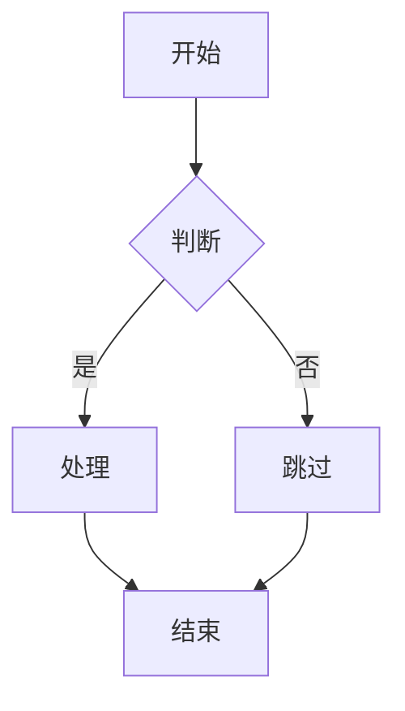
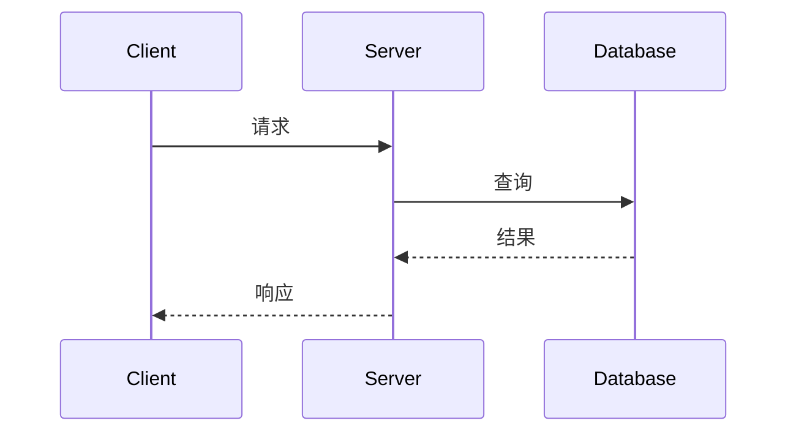

# 07 | 可视化与思维模型

> **模块定位**: 本模块提供多模态可视化工具，帮助理解抽象的理论概念，建立系统化的知识结构。

---

## 📚 模块概览

### 可视化方法论

```text
抽象理论
    ↓ 表征
思维导图 (层次结构)
概念图 (关系网络)
决策树 (选择路径)
证明树 (推理链)
流程图 (算法过程)
状态图 (状态转换)
    ↓ 理解
深层洞察
```

---

## 📋 文档目录

### ⭐ 已完成文档

#### [01-核心思维导图集.md](./01-核心思维导图集.md)

**核心内容**:

- 理论体系全景思维导图
- LSEM三层架构导图
- MVCC核心机制导图
- ACID实现机制导图
- CAP权衡空间导图
- Rust并发思维导图
- 使用指南

**可视化数量**: 7个完整思维导图

**阅读时长**: 40-50分钟

---

### 📋 待创建文档

#### [02-概念关系图集.md](./02-概念关系图集.md)

**计划内容**:

**第一部分: 理论概念图**

- LSEM核心概念及其关系
- MVCC概念网络
- ACID概念依赖
- CAP概念三角

**第二部分: 因果关系图**

- 理论间因果链
- 实现依赖图
- 性能影响图

**第三部分: 层次关系图**

- 抽象层次
- 继承关系
- 组合关系

**工具**: Graphviz, draw.io

**优先级**: P1
**预计完成**: 2025-04

---

#### [03-决策树图集.md](./03-决策树图集.md)

**计划内容**:

**第一部分: 设计决策树**

- 并发控制机制选择
- 隔离级别选择
- CAP权衡选择
- 分区策略选择

**第二部分: 调试决策树**

- 性能问题诊断
- 锁冲突分析
- 死锁解决
- 表膨胀处理

**第三部分: 优化决策树**

- 索引优化路径
- VACUUM策略
- 配置参数调优

**工具**: Mermaid, PlantUML

**优先级**: P1
**预计完成**: 2025-05

---

#### [04-证明树图集.md](./04-证明树图集.md)

**计划内容**:

**第一部分: 定理证明树**

- MVCC正确性证明树
- 串行化证明树
- 所有权安全性证明树
- Raft安全性证明树

**第二部分: 推理链**

- 公理→引理→定理链
- 假设→推导→结论链
- 反证法结构

**第三部分: 证明模式**

- 归纳证明
- 构造性证明
- 反证法
- 数学归纳法

**工具**: LaTeX TikZ, Proof Tree

**优先级**: P1
**预计完成**: 2025-05

---

#### [05-流程图集.md](./05-流程图集.md)

**计划内容**:

**第一部分: 算法流程**

- MVCC可见性检查流程
- VACUUM清理流程
- 死锁检测流程
- Raft日志复制流程

**第二部分: 事务流程**

- BEGIN到COMMIT完整流程
- 2PC两阶段提交流程
- SSI冲突检测流程

**第三部分: 系统流程**

- 查询执行流程
- 崩溃恢复流程
- 主从切换流程

**工具**: Mermaid Flowchart

**优先级**: P1
**预计完成**: 2025-06

---

#### [06-状态转换图集.md](./06-状态转换图集.md)

**计划内容**:

**第一部分: 事务状态**

- 事务状态机 (IN_PROGRESS → COMMITTED/ABORTED)
- 锁状态转换
- 版本状态演化

**第二部分: 系统状态**

- Raft节点状态 (FOLLOWER/CANDIDATE/LEADER)
- 连接状态
- 复制状态

**第三部分: 并发状态**

- 借用状态转换
- 锁持有状态
- 共识状态演化

**工具**: PlantUML State Diagram

**优先级**: P2
**预计完成**: 2025-06

---

## 🎨 可视化工具链

### 工具对比

| 工具 | 用途 | 优势 | 劣势 |
|-----|------|------|------|
| **Mermaid** | 流程图、决策树 | 嵌入Markdown | 功能有限 |
| **Graphviz** | 概念图、关系图 | 自动布局 | 语法复杂 |
| **PlantUML** | UML图、时序图 | 功能丰富 | 需Java |
| **draw.io** | 手绘图表 | 灵活 | 手动维护 |
| **XMind** | 思维导图 | 专业 | 商业软件 |
| **TikZ** | 证明树、数学图 | 精美 | LaTeX依赖 |

### 推荐工作流

```
1. 草稿阶段: draw.io 手绘
2. 代码化: 转换为Mermaid/Graphviz
3. 嵌入文档: Markdown中渲染
4. 高质量输出: 导出为SVG/PDF
```

---

## 📊 文档完成度

| 文档 | 状态 | 图表数 | 完成度 |
|-----|------|--------|--------|
| 01-思维导图集 | ✅ 已完成 | 7 | 100% |
| 02-概念关系图 | 📋 待创建 | - | 0% |
| 03-决策树图集 | 📋 待创建 | - | 0% |
| 04-证明树图集 | 📋 待创建 | - | 0% |
| 05-流程图集 | 📋 待创建 | - | 0% |
| 06-状态转换图 | 📋 待创建 | - | 0% |

**总体完成度**: 1/6 = **16.7%** 📋

---

## 🔗 学习路径

### 路径1: 视觉学习者

```
01-思维导图集 (宏观结构)
    ↓
02-概念关系图 (关系网络)
    ↓
05-流程图集 (动态过程)
    ↓
06-状态转换图 (状态演化)
```

### 路径2: 决策导向

```
03-决策树图集 (设计选择)
    ↓
02-概念关系图 (理解关联)
    ↓
01-思维导图集 (整体把握)
```

### 路径3: 理论研究

```
04-证明树图集 (推理链)
    ↓
02-概念关系图 (概念依赖)
    ↓
01-思维导图集 (体系框架)
```

---

## 🎯 使用场景

### 场景1: 学习新理论

**步骤**:

1. 先看思维导图了解整体结构
2. 再看概念关系图理解关联
3. 最后看流程图掌握细节

### 场景2: 设计系统

**步骤**:

1. 使用决策树选择方案
2. 参考流程图实现算法
3. 用状态图验证逻辑

### 场景3: 教学培训

**步骤**:

1. 投影思维导图讲解架构
2. 用概念图解释关系
3. 用流程图演示执行

---

## 🛠️ 制图指南

### 思维导图制作

**工具**: XMind, MindMeister, 或手绘

**原则**:

- 中心主题清晰
- 层次不超过5层
- 每个节点简洁（<10字）
- 使用颜色区分类别

### Mermaid语法

**流程图**:



**时序图**:



---

## 📖 参考资源

**可视化理论**:

- Tufte, E. R. (1983). *The Visual Display of Quantitative Information*
- Few, S. (2012). *Show Me the Numbers*

**工具文档**:

- Mermaid官方文档
- Graphviz用户指南
- PlantUML参考手册

---

## 🚀 下一步

**立即行动**:

- [ ] 阅读 [01-思维导图集](./01-核心思维导图集.md)
- [ ] 学习Mermaid语法
- [ ] 绘制第一个概念图

**深度实践**:

- [ ] 用思维导图总结每章内容
- [ ] 绘制自己的理解图
- [ ] 分享可视化作品

---

**最后更新**: 2025-12-05
**模块负责人**: PostgreSQL理论研究组
**版本**: 1.0.0
**优先级**: P1 (理解辅助工具)
