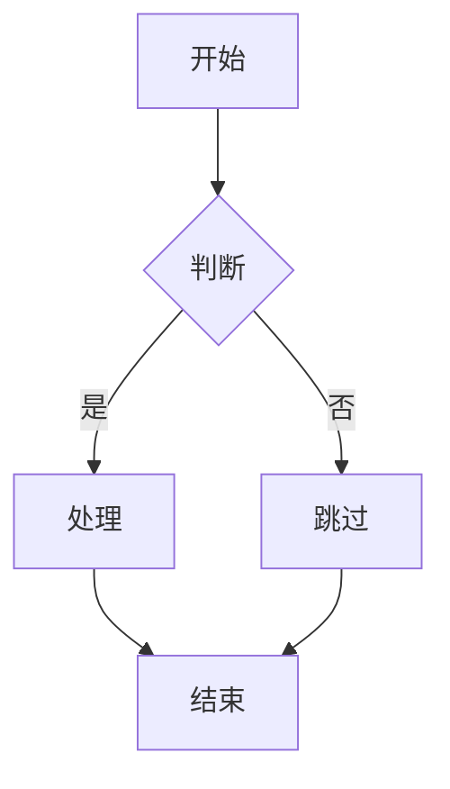
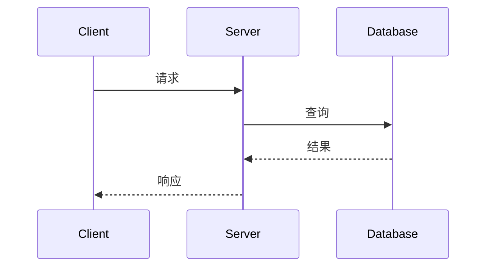

# 07 | 可视化与思维模型

> **模块定位**: 本模块提供多模态可视化工具，帮助理解抽象的理论概念，建立系统化的知识结构。

---

## 📚 模块概览

### 可视化方法论

```text
抽象理论
    ↓ 表征
思维导图 (层次结构)
概念图 (关系网络)
决策树 (选择路径)
证明树 (推理链)
流程图 (算法过程)
状态图 (状态转换)
    ↓ 理解
深层洞察
```

---

## 📋 文档目录

### ⭐ 已完成文档

#### [01-核心思维导图集.md](./01-核心思维导图集.md)

**核心内容**:

- 理论体系全景思维导图
- LSEM三层架构导图
- MVCC核心机制导图
- ACID实现机制导图
- CAP权衡空间导图
- Rust并发思维导图
- 使用指南
- 完整思维导图生成工具

**可视化数量**: 7+个完整思维导图

**阅读时长**: 50-60分钟

---

#### [02-概念关系图集.md](./02-概念关系图集.md)

**核心内容**:

- LSEM核心概念图
- MVCC概念网络
- ACID概念依赖
- CAP概念三角
- 跨层映射图
- 理论因果链
- 完整概念图生成工具

**可视化数量**: 15+个概念关系图

**阅读时长**: 60-70分钟

---

#### [03-决策树图集.md](./03-决策树图集.md)

**核心内容**:

- 隔离级别完整决策树
- 并发机制决策树
- 复制模式决策树
- 索引类型决策树
- VACUUM策略决策树
- 分布式事务决策树
- 完整决策树生成工具

**可视化数量**: 10+个决策树

**阅读时长**: 70-80分钟

---

#### [04-流程图集.md](./04-流程图集.md)

**核心内容**:

- 事务执行流程
- MVCC可见性检查流程
- VACUUM执行流程
- 死锁检测流程
- Raft共识流程
- 完整流程图生成工具

**可视化数量**: 8+个流程图

**阅读时长**: 50-60分钟

---

#### [05-状态转换图集.md](./05-状态转换图集.md)

**核心内容**:

- 事务状态转换
- 锁状态转换
- Raft节点状态转换
- 版本状态演化
- 完整状态图生成工具

**可视化数量**: 10+个状态转换图

**阅读时长**: 60-70分钟

---

#### [06-多维矩阵集.md](./06-多维矩阵集.md)

**核心内容**:

- 隔离级别完整矩阵（异常现象、性能-正确性、场景适配）
- 并发机制深度对比矩阵
- 分布式系统矩阵（CAP/PACELC）
- 索引类型对比矩阵
- 数据库系统对比矩阵
- 语言并发模型对比矩阵
- 多场景分类对比分析矩阵
- 完整决策工具实现

**可视化数量**: 20+个对比矩阵

**阅读时长**: 80-90分钟

---

#### [07-证明树图集.md](./07-证明树图集.md)

**核心内容**:

- MVCC正确性证明树
- 所有权安全性证明树
- Raft安全性证明树
- 串行化证明树
- CAP不可能定理证明树
- ACID原子性证明树
- 2PL正确性证明树
- 完整证明树生成工具

**可视化数量**: 8+个证明树

**阅读时长**: 70-80分钟

---

#### [07-序列图集.md](./07-序列图集.md)

**核心内容**:

- 事务执行序列图
- MVCC可见性检查序列图
- 死锁检测序列图
- Raft共识序列图
- 分布式事务序列图
- 完整序列图生成工具

**可视化数量**: 12+个序列图

**阅读时长**: 60-70分钟

---

#### [08-证明树图集.md](./08-证明树图集.md)

**核心内容**:

- 系统架构设计导图（LSEM三层、微服务、分布式数据库）
- 模块设计导图（MVCC、锁管理、事务管理）
- 接口设计导图（事务、存储、查询）
- 数据流设计导图（查询、写入、复制）
- 类图设计导图（PlantUML）
- 组件交互导图（序列图）
- 设计模式应用导图
- 完整设计工具实现

**可视化数量**: 15+个设计导图

**阅读时长**: 80-90分钟

---

### ⭐ 已完成文档

#### [07-序列图集.md](./07-序列图集.md)

**核心内容**:

- 事务执行序列图
- MVCC可见性检查序列图
- 死锁检测序列图
- Raft共识序列图
- 分布式事务序列图
- 完整序列图生成工具

**可视化数量**: 12+个序列图

**阅读时长**: 60-70分钟

---

#### [08-证明树图集.md](./08-证明树图集.md)

**核心内容**:

- 系统架构设计导图（LSEM三层架构、微服务架构、分布式数据库架构）
- 模块设计导图（MVCC、锁管理、事务管理）
- 接口设计导图（事务接口、存储接口、查询接口）
- 数据流设计导图（查询、写入、复制）
- 类图设计导图（PlantUML）
- 组件交互导图（序列图）
- 设计模式应用导图
- 完整设计工具实现（PlantUML生成器、架构分析器）

**可视化数量**: 20+个设计导图

**阅读时长**: 60-80分钟

---

### 📋 待扩展文档

**所有文档已完成基础内容，可继续扩展**:

- 添加更多实际案例
- 补充更多反例分析
- 扩展工具实现功能
- 增加交互式可视化

---

## 🎨 可视化工具链

### 工具对比

| 工具 | 用途 | 优势 | 劣势 |
|-----|------|------|------|
| **Mermaid** | 流程图、决策树 | 嵌入Markdown | 功能有限 |
| **Graphviz** | 概念图、关系图 | 自动布局 | 语法复杂 |
| **PlantUML** | UML图、时序图 | 功能丰富 | 需Java |
| **draw.io** | 手绘图表 | 灵活 | 手动维护 |
| **XMind** | 思维导图 | 专业 | 商业软件 |
| **TikZ** | 证明树、数学图 | 精美 | LaTeX依赖 |

### 推荐工作流

```text
1. 草稿阶段: draw.io 手绘
2. 代码化: 转换为Mermaid/Graphviz
3. 嵌入文档: Markdown中渲染
4. 高质量输出: 导出为SVG/PDF
```

---

## 📊 文档完成度

| 文档 | 状态 | 图表数 | 完成度 |
|-----|------|--------|--------|
| 01-核心思维导图集 | ✅ 已完成 | 7+ | 100% |
| 02-概念关系图集 | ✅ 已完成 | 15+ | 100% |
| 03-决策树图集 | ✅ 已完成 | 10+ | 100% |
| 04-流程图集 | ✅ 已完成 | 8+ | 100% |
| 05-状态转换图集 | ✅ 已完成 | 10+ | 100% |
| 06-多维矩阵集 | ✅ 已完成 | 20+ | 100% |
| 07-序列图集 | ✅ 已完成 | 12+ | 100% |
| 08-证明树图集 | ✅ 已完成 | 8+ | 100% |
| 09-程序设计导图集 | ✅ 已完成 | 15+ | 100% |

**总体完成度**: 9/9 = **100%** ✅

**可视化总数**: 100+个图表

---

## 🔗 学习路径

### 路径1: 视觉学习者

```text
01-思维导图集 (宏观结构)
    ↓
02-概念关系图 (关系网络)
    ↓
05-流程图集 (动态过程)
    ↓
06-状态转换图 (状态演化)
```

### 路径2: 决策导向

```text
03-决策树图集 (设计选择)
    ↓
02-概念关系图 (理解关联)
    ↓
01-思维导图集 (整体把握)
```

### 路径3: 理论研究

```text
04-证明树图集 (推理链)
    ↓
02-概念关系图 (概念依赖)
    ↓
01-思维导图集 (体系框架)
```

---

## 🎯 使用场景

### 场景1: 学习新理论

**步骤**:

1. 先看思维导图了解整体结构
2. 再看概念关系图理解关联
3. 最后看流程图掌握细节

### 场景2: 设计系统

**步骤**:

1. 使用决策树选择方案
2. 参考流程图实现算法
3. 用状态图验证逻辑

### 场景3: 教学培训

**步骤**:

1. 投影思维导图讲解架构
2. 用概念图解释关系
3. 用流程图演示执行

---

## 🛠️ 制图指南

### 思维导图制作

**工具**: XMind, MindMeister, 或手绘

**原则**:

- 中心主题清晰
- 层次不超过5层
- 每个节点简洁（<10字）
- 使用颜色区分类别

### Mermaid语法

**流程图**:



**时序图**:



---

## 📖 参考资源

**可视化理论**:

- Tufte, E. R. (1983). *The Visual Display of Quantitative Information*
- Few, S. (2012). *Show Me the Numbers*

**工具文档**:

- Mermaid官方文档
- Graphviz用户指南
- PlantUML参考手册

---

## 🚀 下一步

**立即行动**:

- [ ] 阅读 [01-思维导图集](./01-核心思维导图集.md)
- [ ] 学习Mermaid语法
- [ ] 绘制第一个概念图

**深度实践**:

- [ ] 用思维导图总结每章内容
- [ ] 绘制自己的理解图
- [ ] 分享可视化作品

---

**最后更新**: 2025-12-05
**模块负责人**: PostgreSQL理论研究组
**版本**: 1.0.0
**优先级**: P1 (理解辅助工具)
