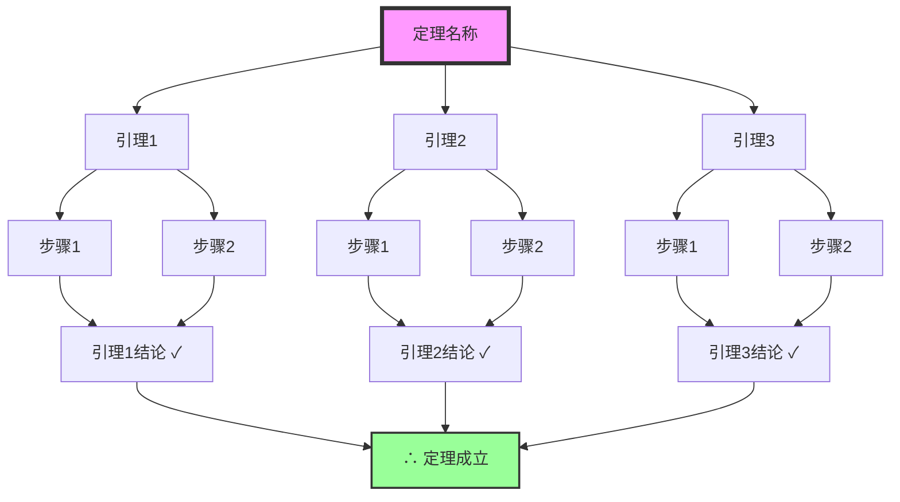
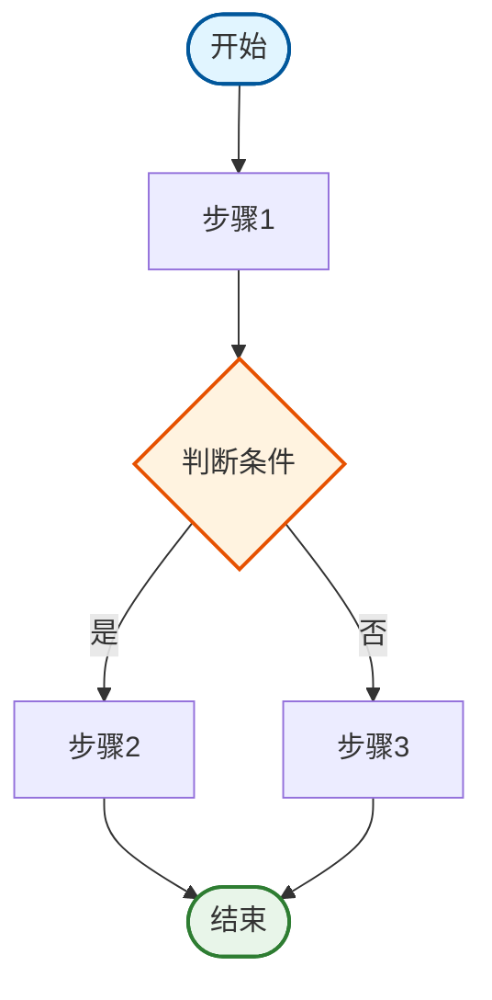
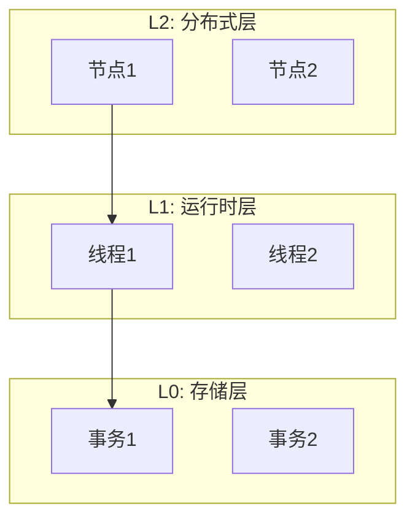
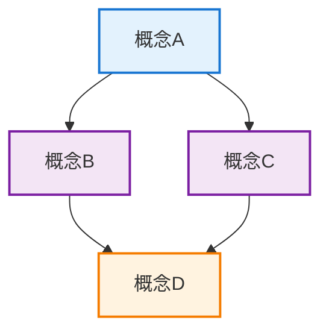

# Markdown格式规范标准

> **创建日期**: 2025-12-05
> **目标**: 统一所有文档的格式标准，确保一致性和可读性
> **适用范围**: 所有Markdown文档

---

## 📑 目录

- [Markdown格式规范标准](#markdown格式规范标准)
  - [📑 目录](#-目录)
  - [一、Mermaid图表格式规范](#一mermaid图表格式规范)
    - [1.1 证明树格式标准](#11-证明树格式标准)
    - [1.2 流程图格式标准](#12-流程图格式标准)
    - [1.3 架构图格式标准](#13-架构图格式标准)
    - [1.4 概念关系图格式标准](#14-概念关系图格式标准)
  - [二、数学公式格式规范](#二数学公式格式规范)
    - [2.1 行内公式](#21-行内公式)
    - [2.2 块级公式](#22-块级公式)
    - [2.3 公式编号](#23-公式编号)
  - [三、代码块格式规范](#三代码块格式规范)
    - [3.1 代码块类型标识](#31-代码块类型标识)
    - [3.2 代码块注释规范](#32-代码块注释规范)
  - [四、表格格式规范](#四表格格式规范)
  - [五、链接格式规范](#五链接格式规范)
  - [六、文档结构规范](#六文档结构规范)

---

## 一、Mermaid图表格式规范

### 1.1 证明树格式标准

**标准格式**:



**格式要求**:

1. **节点样式**:
   - 根节点（定理）: `fill:#f9f,stroke:#333,stroke-width:4px`
   - 结论节点: `fill:#9f9,stroke:#333,stroke-width:2px`
   - 中间节点: 默认样式

2. **节点标签**:
   - 使用中文描述
   - 结论节点添加 `✓` 标记
   - 最终结论使用 `∴` 符号

3. **布局**:
   - 使用 `graph TD` (从上到下)
   - 保持层次清晰
   - 避免交叉线

### 1.2 流程图格式标准

**标准格式**:



**格式要求**:

1. **节点类型**:
   - 开始/结束: 圆角矩形 `([...])`
   - 处理步骤: 矩形 `[...]`
   - 判断: 菱形 `{...}`

2. **节点样式**:
   - 开始节点: `fill:#e1f5ff,stroke:#01579b`
   - 结束节点: `fill:#e8f5e9,stroke:#2e7d32`
   - 判断节点: `fill:#fff3e0,stroke:#e65100`

3. **连接线标签**:
   - 使用 `|标签|` 格式
   - 标签简洁明了

### 1.3 架构图格式标准

**标准格式**:



**格式要求**:

1. **子图命名**:
   - 使用 `subgraph "标题"`
   - 标题清晰描述层次

2. **节点命名**:
   - 使用层次前缀（L0_、L1_、L2_）
   - 保持命名一致性

3. **连接线**:
   - 实线表示直接关系
   - 虚线表示映射关系（使用 `-.->`）

### 1.4 概念关系图格式标准

**标准格式**:



**格式要求**:

1. **颜色方案**:
   - 核心概念: 蓝色系
   - 相关概念: 紫色系
   - 衍生概念: 橙色系

2. **布局**:
   - 核心概念居中或顶部
   - 相关概念围绕核心概念
   - 保持视觉平衡

---

## 二、数学公式格式规范

### 2.1 行内公式

**格式**: 使用 `$...$`

**示例**:

```markdown
事务ID为 $xid$，快照为 $snapshot(xmin, xmax, xip)$。
```

### 2.2 块级公式

**格式**: 使用 `$$...$$`

**示例**:

```markdown
$$
\forall t \in T: \text{Visible}(t, snapshot) \iff
(t.xmin < snapshot.xmax) \land
(t.xmin \notin snapshot.xip)
$$
```

### 2.3 公式编号

**格式**: 使用 `\tag{编号}`

**示例**:

```markdown
$$
\text{Visible}(t, s) \iff (t.xmin < s.xmax) \land (t.xmin \notin s.xip) \tag{1}
$$
```

---

## 三、代码块格式规范

### 3.1 代码块类型标识

**必须指定语言类型**:

```markdown
```python
# Python代码
```

```c
// C代码
```

```rust
// Rust代码
```

```coq
(* Coq代码 *)
```

```sql
-- SQL代码
```

### 3.2 代码块注释规范

**代码块前添加说明**:

```markdown
**PostgreSQL MVCC实现**:

```c
// src/backend/access/heap/heapam.c
// 可见性判断函数
bool HeapTupleSatisfiesSnapshot(HeapTuple tuple, Snapshot snapshot)
{
    // ... 实现细节
}
```

```

---

## 四、表格格式规范

**标准格式**:

```markdown
| 列1 | 列2 | 列3 |
|-----|-----|-----|
| 数据1 | 数据2 | 数据3 |
```

**对齐方式**:

- 左对齐: `|:-----|`
- 居中: `|:-----:|`
- 右对齐: `|-----:|`

**示例**:

```markdown
| 隔离级别 | 读性能 | 写性能 |
|---------|:------:|:------:|
| Read Committed | ⭐⭐⭐⭐ | ⭐⭐⭐⭐ |
| Repeatable Read | ⭐⭐⭐ | ⭐⭐⭐ |
```

---

## 五、链接格式规范

### 5.1 内部链接

**格式**: 使用相对路径

```markdown
[链接文本](./相对路径/文件名.md)
```

**示例**:

```markdown
参见 [MVCC理论完整解析](./01-核心理论模型/02-MVCC理论完整解析.md)
```

### 5.2 外部链接

**格式**: 使用完整URL

```markdown
[链接文本](https://example.com)
```

### 5.3 锚点链接

**格式**: 使用标题锚点

```markdown
[链接文本](#标题锚点)
```

**注意**: 锚点自动生成，使用小写，空格替换为 `-`

---

## 六、文档结构规范

### 6.1 文档头部

**标准格式**:

```markdown
# 文档标题

> **创建日期**: YYYY-MM-DD
> **最后更新**: YYYY-MM-DD
> **状态**: ✅/⏳/📋

---

## 📑 目录

- [文档标题](#文档标题)
  - [一、章节1](#一章节1)
    - [1.1 小节1](#11-小节1)
```

### 6.2 章节编号

**格式**:

- 一级标题: `## 一、标题`
- 二级标题: `### 1.1 标题`
- 三级标题: `#### 1.1.1 标题`

### 6.3 文档尾部

**标准格式**:

```markdown
---

**文档版本**: X.Y.Z
**创建日期**: YYYY-MM-DD
**最后更新**: YYYY-MM-DD
**状态**: ✅/⏳/📋

**相关文档**:

- `相关文档路径1`
- `相关文档路径2`
```

---

## 七、检查清单

### 7.1 格式检查清单

- [ ] 所有Mermaid图表符合格式标准
- [ ] 所有数学公式使用正确格式
- [ ] 所有代码块指定语言类型
- [ ] 所有表格格式正确
- [ ] 所有链接格式正确
- [ ] 文档结构符合规范

### 7.2 内容检查清单

- [ ] 标题层级正确
- [ ] 目录完整且链接正确
- [ ] 代码示例可运行
- [ ] 图表清晰易懂
- [ ] 公式正确无误

---

**文档版本**: 1.0.0
**创建日期**: 2025-12-05
**最后更新**: 2025-12-05
**状态**: ✅ **格式规范已建立**

**相关文档**:

- `03-证明与形式化/07-形式化证明框架与指南.md` - 证明树格式参考
- `scripts/check_links.py` - 链接检查工具
