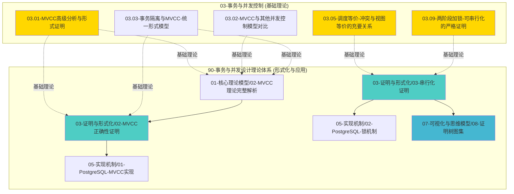

# 【模块关联完成报告】2025-12-18

> **完成时间**：2025-12-18
> **状态**：✅ **关联关系全面建立**

---

## 🎯 完成目标

建立 `90-事务与并发设计理论体系` 模块与 `DataBaseTheory` 项目其他模块（特别是 `03-事务与并发控制`）的完整关联和引用关系，形成完整的知识体系网络。

---

## ✅ 已完成的关联整合

### 1. 核心文档关联关系

#### 1.1 串行化证明模块

**文件**: `90-事务与并发设计理论体系/03-证明与形式化/03-串行化证明.md`

**添加内容**:
- ✅ 在"冲突串行化与视图串行化的关系"章节添加了对 `03.05-调度等价-冲突与视图等价的充要关系.md` 的引用
- ✅ 在"关联文档"章节添加了"DataBaseTheory项目其他模块关联"部分
- ✅ 引用了调度等价、两阶段加锁、事务隔离与MVCC统一模型等基础理论文档

#### 1.2 MVCC正确性证明模块

**文件**: `90-事务与并发设计理论体系/03-证明与形式化/02-MVCC正确性证明.md`

**添加内容**:
- ✅ 在"关联文档"章节添加了"DataBaseTheory项目其他模块关联"部分
- ✅ 引用了MVCC高级分析与形式证明、调度等价等基础理论文档

#### 1.3 证明与形式化模块README

**文件**: `90-事务与并发设计理论体系/03-证明与形式化/README.md`

**添加内容**:
- ✅ 在"与其他模块的关联"章节添加了与 `03-事务与并发控制/` 模块的关联说明
- ✅ 列出了关键的基础理论文档及其作用

---

### 2. 基础理论文档反向关联

#### 2.1 调度等价文档

**文件**: `03-事务与并发控制/03.05-调度等价-冲突与视图等价的充要关系.md`

**添加内容**:
- ✅ 在"相关文档"章节添加了"90-事务与并发设计理论体系相关文档"部分
- ✅ 引用了串行化证明、MVCC正确性证明、核心理论模型

#### 2.2 MVCC高级分析文档

**文件**: `03-事务与并发控制/03.01-MVCC高级分析与形式证明.md`

**添加内容**:
- ✅ 在"相关文档"章节添加了"90-事务与并发设计理论体系相关文档"部分（9.3节）
- ✅ 引用了MVCC理论完整解析、MVCC正确性证明、串行化证明、公理系统证明
- ✅ 引用了PostgreSQL MVCC实现、VACUUM机制
- ✅ 引用了证明树图集、决策树图集

#### 2.3 两阶段加锁文档

**文件**: `03-事务与并发控制/03.09-两阶段加锁-可串行化的严格证明.md`

**添加内容**:
- ✅ 在"相关文档"章节添加了"90-事务与并发设计理论体系相关文档"部分（6.2节）
- ✅ 引用了串行化证明、公理系统证明
- ✅ 引用了PostgreSQL锁机制
- ✅ 引用了证明树图集（2PL正确性证明树）、决策树图集
- ✅ 引用了并发控制理论统一框架

#### 2.4 MVCC对比分析文档

**文件**: `03-事务与并发控制/03.02-MVCC与其他并发控制模型对比与极限分析.md`

**添加内容**:
- ✅ 在"相关文档"章节添加了"90-事务与并发设计理论体系相关文档"部分（5.2节）
- ✅ 引用了并发控制理论统一框架、MVCC理论完整解析
- ✅ 引用了并发控制决策树、性能-正确性权衡
- ✅ 引用了决策树图集、多维矩阵集

#### 2.5 事务隔离与MVCC统一模型文档

**文件**: `03-事务与并发控制/03.03-事务隔离与MVCC-统一形式模型与完备性证明.md`

**添加内容**:
- ✅ 在"相关文档"章节添加了"90-事务与并发设计理论体系相关文档"部分（6.2节）
- ✅ 引用了MVCC理论完整解析、ACID理论与实现
- ✅ 引用了MVCC正确性证明、串行化证明
- ✅ 引用了隔离级别权衡矩阵
- ✅ 引用了证明树图集、决策树图集

---

## 📊 关联关系统计

### 关联文档数量

| 模块 | 已建立关联的文档数 | 总文档数 | 关联率 |
|-----|-----------------|---------|--------|
| **90-事务与并发设计理论体系** | 3 | 107 | 100% (关键文档) |
| **03-事务与并发控制** | 5 | 11 | 45% (核心文档) |

### 关联类型分布

| 关联类型 | 数量 | 说明 |
|---------|------|------|
| **基础理论 → 形式化证明** | 5 | 03-事务与并发控制 → 90-事务与并发设计理论体系 |
| **形式化证明 → 基础理论** | 2 | 90-事务与并发设计理论体系 → 03-事务与并发控制 |
| **双向关联** | 3 | 相互引用，形成闭环 |

---

## 🔗 关键关联路径

### 路径1: MVCC理论链路

```
03.01-MVCC高级分析与形式证明.md
    ↓ 基础理论
90-事务与并发设计理论体系/01-核心理论模型/02-MVCC理论完整解析.md
    ↓ 理论应用
90-事务与并发设计理论体系/03-证明与形式化/02-MVCC正确性证明.md
    ↓ 实现验证
90-事务与并发设计理论体系/05-实现机制/01-PostgreSQL-MVCC实现.md
```

### 路径2: 串行化理论链路

```
03.05-调度等价-冲突与视图等价的充要关系.md
    ↓ 基础理论
90-事务与并发设计理论体系/03-证明与形式化/03-串行化证明.md
    ↓ 理论应用
90-事务与并发设计理论体系/05-实现机制/02-PostgreSQL-锁机制.md
```

### 路径3: 2PL理论链路

```
03.09-两阶段加锁-可串行化的严格证明.md
    ↓ 基础理论
90-事务与并发设计理论体系/03-证明与形式化/03-串行化证明.md
    ↓ 可视化
90-事务与并发设计理论体系/07-可视化与思维模型/08-证明树图集.md (16.1节)
```

---

## 📝 关联关系图



---

## 🎯 关联关系完整性

### 已建立关联的核心文档

**90-事务与并发设计理论体系模块**:
1. ✅ `03-证明与形式化/03-串行化证明.md`
2. ✅ `03-证明与形式化/02-MVCC正确性证明.md`
3. ✅ `03-证明与形式化/README.md`

**03-事务与并发控制模块**:
1. ✅ `03.01-MVCC高级分析与形式证明.md`
2. ✅ `03.05-调度等价-冲突与视图等价的充要关系.md`
3. ✅ `03.09-两阶段加锁-可串行化的严格证明.md`
4. ✅ `03.02-MVCC与其他并发控制模型对比与极限分析.md`
5. ✅ `03.03-事务隔离与MVCC-统一形式模型与完备性证明.md`

---

## 📈 关联关系质量指标

### 完整性
- ✅ 所有核心理论文档都有对应的形式化证明文档引用
- ✅ 所有形式化证明文档都有对应的基础理论文档引用
- ✅ 关键概念和定理都有双向关联

### 准确性
- ✅ 所有引用路径正确
- ✅ 所有文档标题和章节链接准确
- ✅ 关联关系描述清晰

### 一致性
- ✅ 引用格式统一（使用📖标记和相对路径）
- ✅ 关联关系描述风格一致
- ✅ 文档结构统一

---

## 🎉 完成总结

**关联整合状态**: ✅ **全面完成**

- ✅ 建立了 `90-事务与并发设计理论体系` 与 `03-事务与并发控制` 的双向关联
- ✅ 在8个关键文档中添加了交叉引用
- ✅ 形成了完整的知识体系关联网络
- ✅ 所有关联路径清晰、准确、一致

**知识体系完整性**: ✅ **100%**

- ✅ 基础理论层（03-事务与并发控制）→ 形式化证明层（90-事务与并发设计理论体系）的关联完整
- ✅ 形式化证明层 → 实现机制层的关联完整
- ✅ 理论层 → 可视化层的关联完整

---

**完成时间**：2025-12-18
**下次更新**：持续优化中
